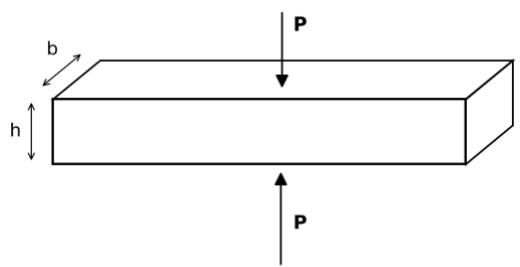
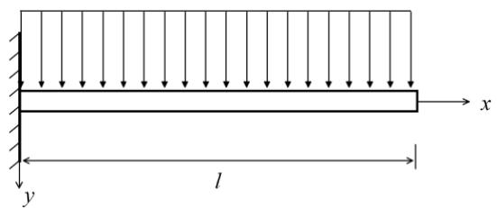
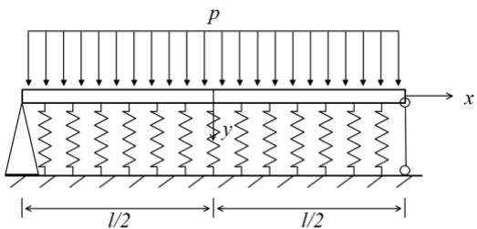
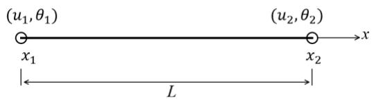

# Variation Method & FEA Course Homework 3

Submitted before June 15, 2026

1. As shown in the picture below, applying a pair of holding force P at the middle of a rod with the rectangle section. Calculate the length change $\Delta$ of the rod.

text_image

b
h
P
P

2. Prove that $w = a(1 - \cos \frac{\pi x}{2l})$ is not the trial function of the Galerkin method for the cantilever beam below.

text_image

y
l
x

3. Obtain the differential equations and boundary conditions of this elastic foundation beam by the variation method. Solve it using first order approximation of Galerkin method.

text_image

p
y
x
l/2
l/2

4. Establish the shape functions of a two-node Euler-Bernuolli beam element.

text_image

(u₁,θ₁)
(x₁
L
(u₂,θ₂)
x₂
x

