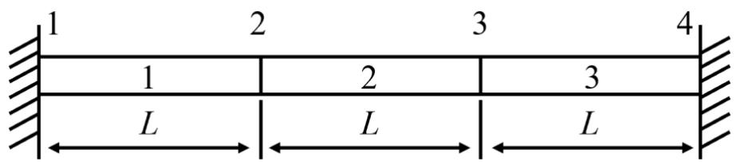
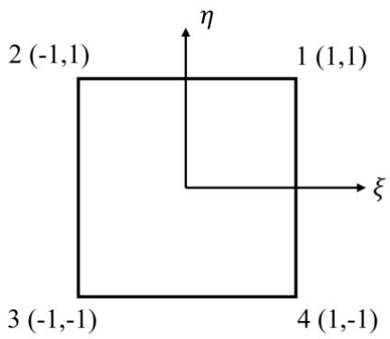

# Variation Method & FEA Course Homework 4

> **提交截止**：June 22, 2026
> **对应知识**：[1-5 FEM 公式推导](../../01-Lecture-Notes/1-5-FEM-Formulation.md)（§5.2 单元分析与总体集成）、[1-6 单元构造](../../01-Lecture-Notes/1-6-Element-Construction.md)（§6.2 矩形单元 Lagrange 插值、§6.4 等参元）
> **PDF 原文**：[`homework4-2026.pdf`](../../06-References/pdfs-originals/homework4-2026.pdf)

---

## Problem 1 — 杆单元刚度矩阵（Rod Element Stiffness Matrix）

等截面弹性直杆两端固定，截面积 $A$ 为常数，杆长 $3L$，受均匀体力 $f$ 作用。将杆划分为 3 个线性单元（每段长度 $L$），求：

1. 单元形函数矩阵（element shape function matrix）
2. 单元刚度矩阵（element stiffness matrix）
3. 总体刚度矩阵（global stiffness matrix）

> 节点编号 1–2–3–4，单元编号 (1)–(2)–(3)，每段长度 $L$

---

## Problem 2 — FEM 求解 ODE 边值问题

用有限元法求解以下方程，要求将区间等分为 **4 个单元**（节点 $0, \frac14, \frac12, \frac34, 1$）：

$$
-u''(x) + u(x) = -x
$$

边界条件：

$$
u(0) = u(1) = 0
$$

提示：方程的等效积分弱形式为

$$
Q[u(x)] = \frac12 \int_0^1 \bigl[ u'^2(x) + u^2(x) + 2x\,u(x) \bigr]\,dx
$$

---

## Problem 3 — 划线法构造形函数（Scraping Line Method）

> 📖 [1-6 单元构造 §6.2.2 矩形单元 Lagrange 插值](../../01-Lecture-Notes/1-6-Element-Construction.md#22-rectangular-element矩形单元)

使用**划线法**（method of scraping line）直接满足基函数的要求。图中所有边长相等。

> 节点坐标：$1(1,1)$, $2(-1,1)$, $3(-1,-1)$, $4(1,-1)$（$\xi$-$\eta$ 局部坐标系）
