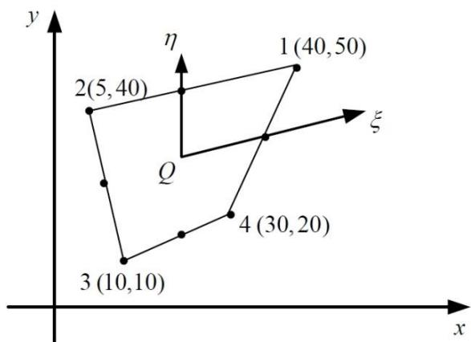
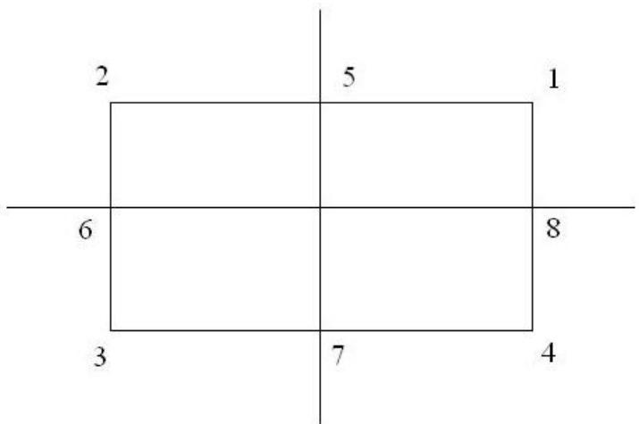

1. 证明 $Q[y(x)] = \int_{a}^{b} y^{2}(x) dx$ 不是线性泛函。

首先

$$
Q \left[ c _ {1} y _ {1} (x) + c _ {2} y _ {2} (x) \right]
$$

$$
= \int_ {a} ^ {b} \left[ c _ {1} y _ {1} (x) + c _ {2} y _ {2} (x) \right] ^ {2} d x
$$

$$
= \int_ {a} ^ {b} \left[ c _ {1} ^ {2} y _ {1} ^ {2} (x) + c _ {2} ^ {2} y _ {2} ^ {2} (x) + 2 c _ {1} c _ {2} y _ {1} (x) y _ {2} (x) \right] d x
$$

其次

$$
c _ {1} Q \left[ y _ {1} (x) \right] + c _ {2} Q \left[ y _ {2} (x) \right] = \int_ {a} ^ {b} \left[ c _ {1} y _ {1} ^ {2} (x) + c _ {2} y _ {2} ^ {2} (x) \right] d x
$$

因为 $Q\left[c_1y_1(x) + c_2y_2(x)\right] \neq c_1Q\left[y_1(x)\right] + c_2Q\left[y_2(x)\right]$

所以 $Q\Big[y(x)\Big] = \int_{a}^{b}y^{2}(x)dx$ 不是线性泛函。

2. 推导包含自变函数三阶导数的泛函极值条件的 Euler 方程。

即求泛函 $Q=\int_{a}^{b}F(x,y,y',y'',y'')dx$ 的 Euler 方程。

该泛函的一阶变分为

$$
\delta Q = \int_ {a} ^ {b} \left[ F _ {y} \delta y + F _ {y ^ {\prime}} \delta y ^ {\prime} + F _ {y ^ {\prime \prime}} \delta y ^ {\prime \prime} + F _ {y ^ {\prime \prime \prime}} \delta y ^ {\prime \prime \prime} \right] d x = 0
$$

已经证明了

$$
\int_ {a} ^ {b} F _ {y ^ {\prime}} \delta y ^ {\prime} d x = - \int_ {a} ^ {b} \delta y \frac {d}{d x} \left(F _ {y ^ {\prime}}\right) d x
$$

$$
\int_ {a} ^ {b} F _ {y ^ {\prime \prime}} \delta y ^ {\prime \prime} d x = \int_ {a} ^ {b} \delta y \frac {d ^ {2}}{d x ^ {2}} \left(F _ {y ^ {\prime \prime}}\right) d x
$$

对于 $\int_{a}^{b}F_{y^{\prime \prime}}\delta y^{\prime \prime \prime}dx$ ，有

$$
\begin{array}{l} \int_ {a} ^ {b} F _ {y ^ {\prime \prime}} \delta y ^ {\prime \prime \prime} d x = \int_ {a} ^ {b} F _ {y ^ {\prime \prime}} \frac {d}{d x} (\delta y ^ {\prime \prime}) d x \\ = \delta y ^ {\prime \prime} F _ {y ^ {\prime \prime}} \left| _ {a} ^ {b} - \int_ {a} ^ {b} \delta y ^ {\prime \prime} \frac {d}{d x} \left(F _ {y ^ {\prime \prime}}\right) d x \right. \\ = 0 - \int_ {a} ^ {b} \frac {d}{d x} \left(\delta y ^ {\prime}\right) \frac {d}{d x} \left(F _ {y ^ {\prime \prime}}\right) d x \\ = - \delta y ^ {\prime} \frac {d}{d x} \left(F _ {y ^ {\prime \prime}}\right) \Big | _ {a} ^ {b} + \int_ {a} ^ {b} \delta y ^ {\prime} \frac {d ^ {2}}{d x ^ {2}} \left(F _ {y ^ {\prime \prime}}\right) d x \\ = 0 + \int_ {a} ^ {b} \frac {d}{d x} (\delta y) \frac {d ^ {2}}{d x ^ {2}} \left(F _ {y ^ {\prime \prime}}\right) d x \\ = \delta y \frac {d ^ {2}}{d x ^ {2}} \left(F _ {y ^ {\prime \prime}}\right) \Big | _ {a} ^ {b} - \int_ {a} ^ {b} \delta y \frac {d ^ {3}}{d x ^ {3}} \left(F _ {y ^ {\prime \prime}}\right) d x \\ = 0 - \int_ {a} ^ {b} \delta y \frac {d ^ {3}}{d x ^ {3}} \left(F _ {y ^ {\prime \prime}}\right) d x \\ = - \int_ {a} ^ {b} \delta y \frac {d ^ {3}}{d x ^ {3}} \left(F _ {y ^ {\prime \prime}}\right) d x \\ \end{array}
$$

$$
\delta Q = \int_ {a} ^ {b} \delta y \left[ F _ {y} - \frac {d}{d x} \left(F _ {y ^ {\prime}}\right) + \frac {d ^ {2}}{d x ^ {2}} \left(F _ {y ^ {\prime \prime}}\right) - \frac {d ^ {3}}{d x ^ {3}} \left(F _ {y ^ {\prime \prime \prime}}\right) \right] d x = 0
$$

所以，包含自变函数三阶导数的泛函极值条件的 Euler 方程为

$$
F _ {y} - \frac {d}{d x} \left(F _ {y ^ {\prime}}\right) + \frac {d ^ {2}}{d x ^ {2}} \left(F _ {y ^ {\prime \prime}}\right) - \frac {d ^ {3}}{d x ^ {3}} \left(F _ {y ^ {\prime \prime \prime}}\right) = 0
$$

3、分别用 Euler 方程法，Ritz 法求解泛函极值函数：

$$
Q [ y ] = \int_ {0} ^ {1} \left(y ^ {\prime 2} - 4 y ^ {2}\right) d x \quad y (0) = 0, y (1) = 1
$$

解:

$$
Q [ y ] = \int_ {0} ^ {1} \left(y ^ {\prime 2} - 4 y ^ {2}\right) d x, y (0) = 0, y (1) = 1
$$

(1)直接法(Euler 法)

对于泛函 $Q[y]=\int_{0}^{1}\left(y'^{2}-4y^{2}\right)dx$ ，有

$$
F = y ^ {2} - 4 y ^ {2}
$$

$$
F _ {y} = - 8 y
$$

$$
F _ {y ^ {\prime}} = 2 y ^ {\prime}
$$

$$
\frac {d}{d x} \left(F _ {y ^ {\prime}}\right) = 2 y ^ {\prime \prime}
$$

由于 Euler 方程为 $F_{y}-\frac{d}{dx}\left(F_{y'}\right)=0$

从而得到 $-8y - 2y'' = 0$

整理后得到 Euler 方程为 $y'' = -4y$

对于该微分方程，可以采用如下的方法求得它的解(具体过程可以参考高等数学有关的章节)

微分方程 $y'' = -4y$ 的特征方程为

$$
r ^ {2} + 4 = 0
$$

该特征方程的两个解为 $r_1 = +2i$ 和 $r_2 = -2i$

所以微分方程 $y'' = -4y$ 的解的形式为

$y=e^{\alpha x}(c_{1}\cos\beta x+c_{2}\sin\beta x)$ ，其中的 $\alpha$ 和 $\beta$ 根据特征方程的解确定为 $\alpha=0,\quad\beta=2$

即有 $y = c_{1}\cos 2x + c_{2}\sin 2x$

由边界条件 $y(0)=0,\quad y(1)=1$ ，得到

$$
\left\{ \begin{array}{l} y (0) = c _ {1} = 0 \\ y (1) = c _ {2} \sin 2 = 1 \end{array} \right.
$$

所以 $c_{1} = 0, c_{2} = \frac{1}{\sin 2}$

即 Euler 方程的解为 $y=\frac{\sin2x}{\sin2}$

(2)Ritz 法

对于泛函 $Q[y] = \int_{0}^{1}\left(y'^{2} - 4y^{2}\right)dx$

由 $F=y^{\prime2}-4y^{2}$ ，有

$$
F _ {y} = - 8 y, F _ {y ^ {\prime}} = 2 y ^ {\prime}, \frac {d}{d x} \left(F _ {y ^ {\prime}}\right) = 2 y ^ {\prime \prime}
$$

所以 Euler 方程为

$$
F _ {y} - \frac {d}{d x} \left(F _ {y ^ {\prime}}\right) = 0 \Rightarrow - y ^ {\prime \prime} - 4 y = 0
$$

归结为用 Ritz 法求解如下方程

$$
\left\{ \begin{array}{l} - y ^ {\prime \prime} - 4 y = 0 \\ y (0) = 0, y (1) = 1 \end{array} \right.
$$

上述方程的边界条件 $y(1)=1$ 是非齐次边界条件，不能直接按齐次边界条件 $(y(1)=0)$ 的情况进行求解。故进行如下处理：

令 $y = w + y_{1}$ ，其中 $w$ 为满足给定齐次边界条件的函数， $y_{1}$ 为满足给定非齐次边界条件的函数，此处可令 $y_{1} = x$ ，将上述表达式代入方程(1)中，得到关于 $w$ 的求解方程

$$
\begin{array}{l} \left\{ \begin{array}{l} - \left(w + y _ {1}\right) ^ {\prime \prime} - 4 \left(w + y _ {1}\right) = 0 \\ w (0) = 0, w (1) = 0 \end{array} \right. \\ \Rightarrow \left\{ \begin{array}{l} - w ^ {\prime \prime} - 4 w = 4 x \\ w (0) = 0, w (1) = 0 \end{array} \right. \\ \end{array}
$$

对比微分方程的表达式 Lw = f 可知， $Lw = -w'' - 4w, f = 4x$

令近似解的形式为 $w = a_{1}\phi_{1} + a_{2}\phi_{2} + a_{3}\phi_{3}$ ，其中 $a_{i}$ 为待定系数， $\phi_{i}$ 为基函数，取

$$
\phi_ {1} = x (1 - x)
$$

$$
\phi_ {2} = x ^ {2} (1 - x)
$$

$$
\phi_ {3} = x ^ {3} (1 - x)
$$

形成如下的求解方程组

$$
\left[ \begin{array}{c c c} \left(L \phi_ {1}, \phi_ {1}\right) & \left(L \phi_ {1}, \phi_ {2}\right) & \left(L \phi_ {1}, \phi_ {3}\right) \\ \left(L \phi_ {2}, \phi_ {1}\right) & \left(L \phi_ {2}, \phi_ {2}\right) & \left(L \phi_ {2}, \phi_ {3}\right) \\ \left(L \phi_ {3}, \phi_ {1}\right) & \left(L \phi_ {3}, \phi_ {2}\right) & \left(L \phi_ {3}, \phi_ {3}\right) \end{array} \right] \left\{ \begin{array}{l} a _ {1} \\ a _ {2} \\ a _ {3} \end{array} \right\} = \left\{ \begin{array}{l} (f, \phi_ {1}) \\ (f, \phi_ {2}) \\ (f, \phi_ {3}) \end{array} \right\}
$$

其中 $\left(L\phi_{i},\phi_{j}\right)$ 表示 $L\phi_{i}$ 和 $\phi_{j}$ 的内积 $\int_{0}^{1}\left(L\phi_{i}\right)\phi_{j}dx,\quad\left(f,\phi_{i}\right)$ 表示 $\int_{0}^{1}f\phi_{i}dx$

以 $\left(L\phi_1,\phi_2\right),\left(f,\phi_2\right)$ 为例

$$
\left(L \phi_ {1}, \phi_ {2}\right) = \int_ {0} ^ {1} \left(L \phi_ {1}\right) \phi_ {2} d x = \int_ {0} ^ {1} \left(2 x ^ {2} - 6 x ^ {3} + 8 x ^ {4} - 4 x ^ {5}\right) d x = \frac {1}{1 0}
$$

$$
\left(f, \phi_ {2}\right) = \int_ {0} ^ {1} f \phi_ {2} d x = \int_ {0} ^ {1} \left(4 x ^ {3} - 4 x ^ {4}\right) d x = \frac {1}{5}
$$

其余各项可仿照上两式求得

最后形成的求解方程组如下

$$
\left[ \begin{array}{c c c} \frac {1}{5} & \frac {1}{1 0} & \frac {1 3}{2 1 0} \\ \frac {1}{1 0} & \frac {2}{2 1} & \frac {8}{1 0 5} \\ \frac {1 3}{2 1 0} & \frac {8}{1 0 5} & \frac {2 2}{3 1 5} \end{array} \right] \left\{ \begin{array}{l} a _ {1} \\ a _ {2} \\ a _ {3} \end{array} \right\} = \left\{ \begin{array}{l} \frac {1}{3} \\ \frac {1}{5} \\ \frac {2}{1 5} \end{array} \right\}
$$

求解方程组得到

$$
\left\{ \begin{array}{l} a _ {1} = 1. 1 8 7 1 \\ a _ {2} = 1. 3 2 0 1 7 \\ a _ {3} = - 0. 5 8 3 3 3 2 \end{array} \right.
$$

所以

$$
\begin{array}{l} w = a _ {1} \phi_ {1} + a _ {2} \phi_ {2} + a _ {3} \phi_ {3} \\ = 1. 1 8 7 1 \left(x - x ^ {2}\right) + 1. 3 2 0 1 7 \left(x ^ {2} - x ^ {3}\right) - 0. 5 8 3 3 3 2 \left(x ^ {3} - x ^ {4}\right) \\ \end{array}
$$

对应于本题非齐次边界条件的解为

$$
\begin{array}{l} y = w + y _ {1} \\ = x + 1. 1 8 7 1 \left(x - x ^ {2}\right) + 1. 3 2 0 1 7 \left(x ^ {2} - x ^ {3}\right) - 0. 5 8 3 3 3 2 \left(x ^ {3} - x ^ {4}\right) \\ \end{array}
$$

附：对比精确解和上述 Ritz 法得到的近似解

<table><tr><td>x=</td><td>精确解 $y(x)=\frac{\sin(2x)}{\sin 2}$ </td><td>Ritz法近似解</td><td>相对误差(%)</td></tr><tr><td>0.1</td><td>0.2184866304</td><td>0.2181955312</td><td>-0.133234319</td></tr><tr><td>0.2</td><td>0.4282628883</td><td>0.4284481152</td><td>0.043250754</td></tr><tr><td>0.3</td><td>0.6209656563</td><td>0.6214367352</td><td>0.075862316</td></tr><tr><td>0.4</td><td>0.7889124831</td><td>0.7892403712</td><td>0.041562034</td></tr><tr><td>0.5</td><td>0.9254078588</td><td>0.9253380000</td><td>-0.007548979</td></tr><tr><td>0.6</td><td>1.0250101435</td><td>1.0246085952</td><td>-0.039175058</td></tr><tr><td>0.7</td><td>1.0837485084</td><td>1.0833311272</td><td>-0.038512733</td></tr><tr><td>0.8</td><td>1.0992812402</td><td>1.0991845632</td><td>-0.008794562</td></tr><tr><td>0.9</td><td>1.0709890979</td><td>1.0712478672</td><td>0.024161712</td></tr><tr><td>1.0</td><td>1.0000000000</td><td>1.0000000000</td><td>0</td></tr></table>

结论：可见近似解的精度相当高。

4、求下列泛函的欧拉方程和自然边界条件。

$$
Q [ y ] = \frac {1}{2} \int_ {x _ {0}} ^ {x _ {1}} \left[ p _ {(x)} y ^ {\prime 2} + q _ {(x)} y ^ {\prime 2} + r _ {(x)} y ^ {2} - 2 s _ {(x)} y \right] d x
$$

对于泛函 $Q[y] = \frac{1}{2}\int_{x_0}^{x_1}\left[p(x)y^{\prime 2} + q(x)y'^2 + r(x)y^2 - 2s(x)y\right]dx$

其一阶变分为 $\delta Q = \frac{1}{2} \int_{x_0}^{x_1} \left[ F_y \delta y + F_{y'} \delta y' + F_{y''} \delta y'' \right] dx$

其中，

$$
\int_ {x _ {0}} ^ {x _ {1}} F _ {y ^ {\prime}} \delta y ^ {\prime} d x = \int_ {x _ {0}} ^ {x _ {1}} F _ {y ^ {\prime}} d (\delta y) = \delta y F _ {y ^ {\prime}} \left| _ {x _ {0}} ^ {x _ {1}} - \int_ {x _ {0}} ^ {x _ {1}} \delta y \frac {d}{d x} \left(F _ {y ^ {\prime}}\right) d x \right.
$$

$$
\begin{array}{l} \int_ {x _ {0}} ^ {x _ {1}} F _ {y ^ {\prime \prime}} \delta y ^ {\prime \prime} d x = \int_ {x _ {0}} ^ {x _ {1}} F _ {y ^ {\prime \prime}} \frac {d}{d x} (\delta y ^ {\prime}) d x \\ = \delta y ^ {\prime} F _ {y ^ {\prime \prime}} \left| _ {x _ {0}} ^ {x _ {1}} - \int_ {x _ {0}} ^ {x _ {1}} \delta y ^ {\prime} \frac {d}{d x} \left(F _ {y ^ {\prime \prime}}\right) d x \right. \\ = \delta y ^ {\prime} F _ {y ^ {\prime \prime}} \left| _ {x _ {0}} ^ {x _ {1}} - \int_ {x _ {0}} ^ {x _ {1}} \frac {d}{d x} (\delta y) \frac {d}{d x} \left(F _ {y ^ {\prime \prime}}\right) d x \right. \\ = \delta y ^ {\prime} F _ {y ^ {\prime \prime}} \left| _ {x _ {0}} ^ {x _ {1}} - \delta y \frac {d}{d x} \left(F _ {y ^ {\prime \prime}}\right) \right| _ {x _ {0}} ^ {x _ {1}} + \int_ {x _ {0}} ^ {x _ {1}} \delta y \frac {d ^ {2}}{d x ^ {2}} \left(F _ {y ^ {\prime \prime}}\right) d x \\ \end{array}
$$

所以

$$
\begin{array}{l} \frac {1}{2} \int_ {x _ {0}} ^ {x _ {1}} \left[ F _ {y} \delta y + F _ {y ^ {\prime}} \delta y ^ {\prime} + F _ {y ^ {\prime \prime}} \delta y ^ {\prime \prime} \right] d x \\ = \frac {1}{2} \left[ \right. \int_ {x _ {0}} ^ {x _ {1}} F _ {y} \delta y d x + \delta y F _ {y ^ {\prime}} \left| \right. _ {x _ {0}} ^ {x _ {1}} - \int_ {x _ {0}} ^ {x _ {1}} \delta y \frac {d}{d x} \left(F _ {y ^ {\prime}}\right) d x + \delta y ^ {\prime} F _ {y ^ {\prime \prime}} \left| _ {x _ {0}} ^ {x _ {1}} - \delta y \frac {d}{d x} \left(F _ {y ^ {\prime \prime}}\right)\right| _ {x _ {0}} ^ {x _ {1}} + \int_ {x _ {0}} ^ {x _ {1}} \delta y \frac {d ^ {2}}{d x ^ {2}} \left(F _ {y ^ {\prime \prime}}\right) d x \left. \right] \\ = \frac {1}{2} \int_ {x _ {0}} ^ {x _ {1}} \delta y \left[ F _ {y} - \frac {d}{d x} \left(F _ {y ^ {\prime}}\right) + \frac {d ^ {2}}{d x ^ {2}} \left(F _ {y ^ {\prime \prime}}\right) \right] d x + \frac {1}{2} \left[ \delta y F _ {y ^ {\prime}} \left| _ {x _ {0}} ^ {x _ {1}} + \delta y ^ {\prime} F _ {y ^ {\prime \prime}} \right| _ {x _ {0}} ^ {x _ {1}} - \delta y \frac {d}{d x} \left(F _ {y ^ {\prime \prime}}\right) \right| _ {x _ {0}} ^ {x _ {1}} \\ \end{array}
$$

所以 Euler 方程为

$$
F _ {y} - \frac {d}{d x} \left(F _ {y ^ {\prime}}\right) + \frac {d ^ {2}}{d x ^ {2}} \left(F _ {y ^ {\prime \prime}}\right) = 0
$$

自然边界条件为

当 $x = x_0$ ， $x = x_{1}$ 时

$$
\left. F _ {y ^ {\prime}} \right| _ {x _ {0}} ^ {x _ {1}} - \frac {d}{d x} \left(F _ {y ^ {\prime \prime}}\right) \Big | _ {x _ {0}} ^ {x _ {1}} = 0 (\delta y \neq 0)
$$

$$
\left. F _ {y ^ {\prime \prime}} \right| _ {x _ {0}} ^ {x _ {1}} = 0 (\delta y ^ {\prime} \neq 0)
$$

可以进行更进一步的计算

$$
F _ {y} = 2 r (x) y - 2 s (x)
$$

$$
F _ {y ^ {\prime}} = 2 q (x) y ^ {\prime}
$$

$$
F _ {y ^ {\prime \prime}} = 2 p (x) y ^ {\prime \prime}
$$

$$
\frac {d}{d x} \left(F _ {y ^ {\prime}}\right) = F _ {y ^ {\prime} x} + F _ {y ^ {\prime} y} y ^ {\prime} + F _ {y ^ {\prime} y ^ {\prime}} y ^ {\prime \prime} + F _ {y ^ {\prime} y ^ {\prime \prime}} y ^ {\prime \prime \prime} = 2 q ^ {\prime} (x) y ^ {\prime} + 2 q (x) y ^ {\prime \prime}
$$

$$
\frac {d}{d x} \left(F _ {y ^ {\prime \prime}}\right) = 2 p ^ {\prime} (x) y ^ {\prime \prime} + 2 p (x) y ^ {\prime \prime \prime}
$$

$$
\frac {d ^ {2}}{d x ^ {2}} \left(F _ {y ^ {\prime \prime}}\right) = 2 p ^ {\prime \prime} (x) y ^ {\prime \prime} + 2 p ^ {\prime} (x) y ^ {\prime \prime \prime} + 2 p ^ {\prime} (x) y ^ {\prime \prime \prime} + 2 p (x) y ^ {(4)}
$$

所以 Euler 方程变为

$$
2 p (x) y ^ {(4)} + 4 p ^ {\prime} (x) y ^ {(3)} + \left[ 2 p ^ {\prime \prime} (x) - 2 q (x) \right] y ^ {\prime \prime} - 2 q ^ {\prime} (x) y ^ {\prime} + 2 r (x) y - 2 s (x) = 0
$$

即 $p(x)y^{(4)}+2p'(x)y^{(3)}+\left[p''(x)-q(x)\right]y''-q'(x)y'+r(x)y-s(x)=0$

自然边界条件为

当 $x = x_0$ ， $x = x_{1}$ 时

$$
F _ {y ^ {\prime \prime}} \left| \begin{array}{l} x _ {1} \\ x _ {0} \end{array} = 0 \Rightarrow 2 q (x) y ^ {\prime \prime} = 0 \Rightarrow y ^ {\prime \prime} = 0 \right.
$$

$$
\begin{array}{l} \left. F _ {y ^ {\prime}} \right| _ {x _ {0}} ^ {x _ {1}} - \frac {d}{d x} \left(F _ {y ^ {\prime \prime}}\right) \Big | _ {x _ {0}} ^ {x _ {1}} = 0 \\ \Rightarrow 2 q (x) y ^ {\prime} - \left[ 2 p ^ {\prime} (x) y ^ {\prime \prime} + 2 p (x) y ^ {(3)} \right] = 0 \\ \Rightarrow 2 q (x) y ^ {\prime} - 2 p (x) y ^ {(3)} = 0 \\ \end{array}
$$

由于 $q(x)$ 和 $p(x)$ 为可能取任意值，所以应有

$$
y ^ {\prime} = 0
$$

$$
y ^ {(3)} = 0
$$

所以自然边界条件为

当 $x = x_0$ ， $x = x_{1}$ 时

$$
y ^ {\prime} = 0
$$

$$
y ^ {\prime \prime} = 0
$$

$$
y ^ {(3)} = 0
$$

5. 利用划线法构造二阶三角形单元的插值函数。

面积坐标 $(L_{i}, L_{j}, L_{m})$

所以，二次三角形单元中，各点的面积坐标如下：

点 1，(1,0,0)

点 2，(0,1,0)

点 3， $(0,0,1)$

点 4， $(1/2, 1/2,0)$

点 5， $(0,1/2,1/2)$

点 6， $(1/2,0,1/2)$

对于点 1，划 4-6 线和 2-5-3 线

$$
N _ {1} = \frac {L _ {1} - 1 / 2}{L _ {1} \left(L _ {1 (1)} , L _ {2 (1)} , L _ {3 (1)}\right) - 1 / 2} \cdot \frac {L _ {1}}{L _ {1} \left(L _ {1 (1)} , L _ {2 (1)} , L _ {3 (1)}\right)} = \frac {L _ {1} - 1 / 2}{1 / 2} \cdot \frac {L _ {1}}{1} = (2 L _ {1} - 1) L _ {1}
$$

对于点 2，划 4-5 线和 1-6-3 线， $N_{2}=\frac{L_{2}-1/2}{1/2}\cdot\frac{L_{2}}{1}=(2L_{2}-1)L_{2}$

对于点3，划6-5线和1-4-2线， $N_{3} = \frac{L_{3} - 1 / 2}{1 / 2}\cdot \frac{L_{3}}{1} = (2L_{3} - 1)L_{3}$

对于点4，划1-6-3线和2-5-3线， $N_{4}==\frac{L_{1}}{1/2}\cdot\frac{L_{2}}{1/2}=4L_{1}L_{2}$

对于点5，划1-6-3线和1-4-2线， $N_{5}==\frac{L_{2}}{1/2}\cdot\frac{L_{3}}{1/2}=4L_{2}L_{3}$

对于点 6，划 1-4-2 线和 2-5-3 线， $N_{6}==\frac{L_{3}}{1/2}\cdot\frac{L_{1}}{1/2}=4L_{3}L_{1}$

6. 如图所示为二次四边形单元，试计算 $\frac{\partial N_{1}}{\partial x}$ ， $\frac{\partial N_{2}}{\partial y}$ 在自然坐标为 $(1/2,1/2)$ 的点 Q 的值。

(提示：因为单元的边是直线，可用四个结点定义单元几何形状的等参变换。

思考：如果单元的边是曲线时，又该如何处理？）

text_image

y
η
1 (40,50)
2(5,40)
ξ
Q
3 (10,10)
4 (30,20)
x

text_image

2
5
1
6
8
3
7
4

采用局部坐标时，单元中各个结点的局部坐标和形函数如下：

<table><tr><td>结点i</td><td>坐标ξi(相当于x)</td><td>坐标ηi(相当于y)</td><td>结点形函数Ni</td></tr><tr><td>1</td><td>1</td><td>1</td><td> $N_{1}=\frac{1}{4}(1+\xi)(1+\eta)(\xi+\eta-1)$ </td></tr><tr><td>2</td><td>-1</td><td>1</td><td> $N_{2}=\frac{1}{4}(1-\xi)(1+\eta)(-\xi+\eta-1)$ </td></tr><tr><td>3</td><td>-1</td><td>-1</td><td> $N_{3}=\frac{1}{4}(1-\xi)(1-\eta)(-\xi-\eta-1)$ </td></tr><tr><td>4</td><td>1</td><td>-1</td><td> $N_{4}=\frac{1}{4}(1+\xi)(1-\eta)(\xi-\eta-1)$ </td></tr><tr><td>5</td><td>0</td><td>1</td><td> $N_{5}=\frac{1}{2}(1-\xi^{2})(1+\eta)$ </td></tr><tr><td>6</td><td>-1</td><td>0</td><td> $N_{6}=\frac{1}{2}(1-\eta^{2})(1-\xi)$ </td></tr><tr><td>7</td><td>0</td><td>-1</td><td> $N_{7} = \frac{1}{2}(1 - \xi^{2})(1 - \eta)$ </td></tr><tr><td>8</td><td>1</td><td>0</td><td> $N_{8} = \frac{1}{2}(1 - \eta^{2})(1 + \xi)$ </td></tr></table>

进行求导后，得到如下各式

$$
\frac {\partial N _ {1}}{\partial \xi} = \frac {1}{4} (\eta + 2 \xi + 2 \xi \eta + \eta^ {2}), \quad \frac {\partial N _ {1}}{\partial \eta} = \frac {1}{4} (\xi + 2 \eta + 2 \xi \eta + \xi^ {2})
$$

$$
\frac {\partial N _ {2}}{\partial \xi} = \frac {1}{4} (- \eta + 2 \xi + 2 \xi \eta - \eta^ {2}), \quad \frac {\partial N _ {2}}{\partial \eta} = \frac {1}{4} (- \xi + 2 \eta - 2 \xi \eta + \xi^ {2})
$$

$$
\frac {\partial N _ {3}}{\partial \xi} = \frac {1}{4} (\eta + 2 \xi - 2 \xi \eta - \eta^ {2}), \quad \frac {\partial N _ {3}}{\partial \eta} = \frac {1}{4} (\xi + 2 \eta - 2 \xi \eta - \xi^ {2})
$$

$$
\frac {\partial N _ {4}}{\partial \xi} = \frac {1}{4} (- \eta + 2 \xi - 2 \xi \eta + \eta^ {2}), \quad \frac {\partial N _ {4}}{\partial \eta} = \frac {1}{4} (- \xi + 2 \eta + 2 \xi \eta - \xi^ {2})
$$

$$
\frac {\partial N _ {5}}{\partial \xi} = - \xi - \xi \eta , \quad \frac {\partial N _ {5}}{\partial \eta} = \frac {1}{2} (1 - \xi^ {2})
$$

$$
\frac {\partial N _ {6}}{\partial \xi} = \frac {1}{2} (- 1 + \eta^ {2}), \quad \frac {\partial N _ {6}}{\partial \eta} = - \eta + \xi \eta
$$

$$
\frac {\partial N _ {7}}{\partial \xi} = - \xi + \xi \eta , \quad \frac {\partial N _ {7}}{\partial \eta} = \frac {1}{2} (- 1 + \xi^ {2})
$$

$$
\frac {\partial N _ {8}}{\partial \xi} = \frac {1}{2} \left(1 - \eta^ {2}\right), \quad \frac {\partial N _ {8}}{\partial \eta} = - \eta - \xi \eta
$$

对于自然坐标为(1/2, 1/2)的 Q 点， $\xi=\frac{1}{2}$ ， $\eta=\frac{1}{2}$ ，代入上面各式中，可以得到各个 $\frac{\partial N_{i}}{\partial\xi}$ 和 $\frac{\partial N_{i}}{\partial\eta}$ 在 Q 点上的值。

由于

$\left\{ \begin{array}{l} \frac{\partial N_i}{\partial x} \\ \frac{\partial N_i}{\partial y} \end{array} \right\} = [J]^{-1} \left\{ \begin{array}{l} \frac{\partial N_i}{\partial \xi} \\ \frac{\partial N_i}{\partial \eta} \end{array} \right\}$ ，其中 $[J]$ 为雅可比矩阵， $[J]^{-1}$ 为雅可比矩阵的逆矩阵，其计算如

下

$\left[J\right]^{-1} = \frac{1}{|J|}\left[ \begin{array}{cc}\frac{\partial y}{\partial\eta} & -\frac{\partial y}{\partial\xi}\\ -\frac{\partial x}{\partial\eta} & \frac{\partial x}{\partial\xi} \end{array} \right]$ ，其中 $|J|$ 为对应于雅可比矩阵的雅可比行列式的值。

将上面计算的各个 $\frac{\partial N_i}{\partial\xi}$ 和 $\frac{\partial N_i}{\partial\eta}$ 在Q点上的值代入下式中

$$
\left[ \begin{array}{l l} \frac {\partial y}{\partial \eta} & - \frac {\partial y}{\partial \xi} \\ - \frac {\partial x}{\partial \eta} & \frac {\partial x}{\partial \xi} \end{array} \right] = \left[ \begin{array}{l l} \sum_ {i = 1} ^ {8} \left(\frac {\partial N _ {i}}{\partial \eta} y _ {i}\right) & - \sum_ {i = 1} ^ {8} \left(\frac {\partial N _ {i}}{\partial \xi} y _ {i}\right) \\ - \sum_ {i = 1} ^ {8} \left(\frac {\partial N _ {i}}{\partial \eta} x _ {i}\right) & \sum_ {i = 1} ^ {8} \left(\frac {\partial N _ {i}}{\partial \xi} x _ {i}\right) \end{array} \right] = \left[ \begin{array}{c c} 1 5 & - 5 \\ - 3. 1 2 5 & 1 5. 6 2 5 \end{array} \right]
$$

$$
\left| J \right| = \left| \begin{array}{c c} \frac {\partial x}{\partial \xi} & \frac {\partial y}{\partial \xi} \\ \frac {\partial x}{\partial \eta} & \frac {\partial y}{\partial \eta} \end{array} \right| = \left| \begin{array}{c c} 1 5. 6 2 5 & 5 \\ 3. 1 2 5 & 1 5 \end{array} \right| = 2 1 8. 7 5
$$

所以有

$$
\left\{ \begin{array}{l} \frac {\partial N _ {1}}{\partial x} \\ \frac {\partial N _ {1}}{\partial y} \end{array} \right\} = \frac {1}{| J |} \left[ \begin{array}{c c} \frac {\partial y}{\partial \eta} & - \frac {\partial y}{\partial \xi} \\ - \frac {\partial x}{\partial \eta} & \frac {\partial x}{\partial \xi} \end{array} \right] \left\{ \begin{array}{l} \frac {\partial N _ {1}}{\partial \xi} \\ \frac {\partial N _ {1}}{\partial \eta} \end{array} \right\} = \frac {1}{2 1 8 . 7 5} \left[ \begin{array}{c c} 1 5 & - 5 \\ - 3. 1 2 5 & 1 5. 6 2 5 \end{array} \right] \left\{ \begin{array}{l} 0. 5 6 2 5 \\ 0. 5 6 2 5 \end{array} \right\} = \left\{ \begin{array}{l} 0. 0 2 5 7 1 \\ 0. 0 3 2 1 4 \end{array} \right\}
$$

$$
\left\{ \begin{array}{l} \frac {\partial N _ {2}}{\partial x} \\ \frac {\partial N _ {2}}{\partial y} \end{array} \right\} = \frac {1}{| J |} \left[ \begin{array}{c c} \frac {\partial y}{\partial \eta} & - \frac {\partial y}{\partial \xi} \\ - \frac {\partial x}{\partial \eta} & \frac {\partial x}{\partial \xi} \end{array} \right] \left\{ \begin{array}{l} \frac {\partial N _ {2}}{\partial \xi} \\ \frac {\partial N _ {2}}{\partial \eta} \end{array} \right\} = \frac {1}{2 1 8 . 7 5} \left[ \begin{array}{c c} 1 5 & - 5 \\ - 3. 1 2 5 & 1 5. 6 2 5 \end{array} \right] \left\{ \begin{array}{l} 0. 1 8 7 5 \\ 0. 0 6 2 5 \end{array} \right\} = \left\{ \begin{array}{l} 0. 0 1 1 4 3 \\ 0. 0 0 1 7 8 6 \end{array} \right\}
$$

所以，在自然坐标为(1/2, 1/2)的 Q 点处， $\frac{\partial N_{1}}{\partial x}=0.02571,\quad\frac{\partial N_{2}}{\partial y}=0.001786$