## Chapter 1

## Solid mechanics: theory of elasticity

## Contents

1 Introduction  
2 Introduction to tensor  
3 Theory of elasticity: differential context  
4 Introduction to variational theory  
5 Theory of elasticity: variational context

## 1. Introduction

## Theory of elasticity

Elasticity – After the external forces are removed, objects made of elastic materials will return to their original state.

Elastic body – An ideal physical object with elasticity being the only material property.

Solid mechanics of elastic bodies – A subject that studies the distribution of stresses and deformations within the elastic body, under certain external conditions (e.g. temperature, force).

The applications of elastic material can be found throughout thousands of years of human civilization. However, the establishment of the theory of elasticity was not completed until the industrial revolution. The theory has been widely applied in the fields of civil, aeronautical and mechanical engineering.

## Theory of elasticity

Theory of elasticity is an important branch of solid mechanics; whereas the mechanics of materials perhaps has the longest history as a branch of solid mechanics.  
The mechanics of materials focuses on strength, stiffness and stability issues of structural members, e.g. stresses, strains and deformations of structural members under external loads.  
However, the mechanics of materials only focuses on column and beam types of structures, whereas plate, shell and solid structures are generally difficult to be dealt with.  
Even for column and beam members, there are still problems left to be solved.

## Theory of elasticity

text_image

M
M

Structural member with rectangular cross-section in torsion  
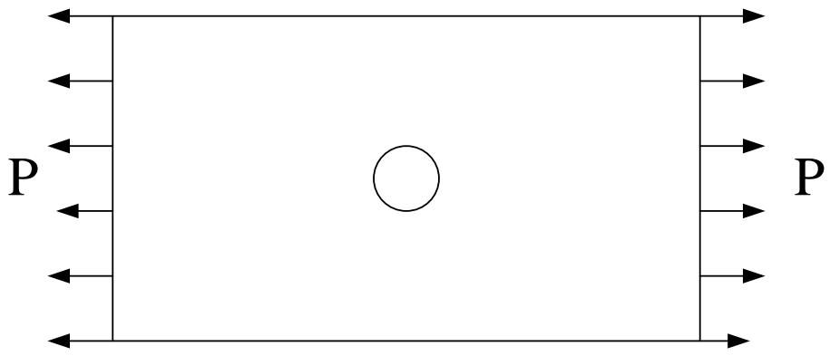

text_image

P
P

Plate with hole in tension

The problems described above cannot be solved with the knowledge of mechanics of materials.  
However, the precise solutions can be obtained in the theory of elasticity.  
Similar problems are found in many different areas of engineering.

## Brief state of the art

The theory of elasticity has a history of more than three hundred years.

In 1678, Hooke found that the displacement of an elastic body is directly proportional to the externally applied force.  
In 1821 and 1823, Navier and Cauchy derived the governing equilibrium equations for the linear elastic boundary value problems respectively, which provided a first insight into the mechanics of elastic bodies.  
Other important works in the history of elasticity theory include the classic works by Saint-Venant (1855) on torsion and bending, and the complex variable formulation by Muskhelishvili (1933).

The first problem described in the previous slide can be approached by conformal transformation where the rectangular cross-section is transformed into circular cross-section.

In the late 20th century, the theory of elasticity was further developed to consider the interaction with other physical factors such as:

Heat  
Viscosity  
...

## Brief state of the art

As mentioned above, the theory of elasticity investigates the general behaviour of how elastic bodies deform under external load. In principle, there is no limitation on the geometry of the elastic body and the form of the external load.  
In contrast to the mechanics of materials, the theory of elasticity allows more realistic assumptions to be made. For example, the assumption of ‘plain sections remain plane’ in beam bending theory would not be appropriate under certain conditions.  
The development of the theory requires more precise and logical analysis, where more powerful and complex mathematical tools are needed, hence provides more generic, more precise and wider range of applications.  
☐ The development of any engineering subject tends to reduce the number of assumptions with the aid of more mathematical analysis.

## Brief state of the art

Through the study of theory of elasticity or applied mathematics, we know that solving partial differential equations for boundary value problems can be problematic. For complex geometries and boundary conditions, it is generally very difficult to obtain exact solutions.

Such problems are very common in real engineering applications. On the other hand, the precision of solutions is still crucial.

Therefore, researchers tend to look for approximate solutions.

Even for problems with exact solutions, the analytical approach can be cumbersome and hence involved with huge computational costs. The results are sometimes difficult to interpret (e.g. infinite series). Under such circumstances, engineers would prefer approximate solutions to the exact solutions.

## Objectives of the lecture

◆ Recap the theory of elasticity  
Introduce and apply expressions in tensor forms

To simplify written expressions  
To gain insight into the theory of mechanics  
To help with literature reading  
...

Introduce the variational principle in mathematics and apply f variation in the theory of elasticity, hence provide a basic knowledge for finite element analysis (FEA).

## 2. Introduction to tensor

## Introduction

Assume that a physical law describes the physical relationships between components a, b, c, ... of a certain physical quantity under a certain coordinate system K, the same law should also apply to a new set of components a', b', c', ... under the new coordinate system K' for the same physical quantity. Note that both set of components decreased the physical state of the physical quantity. In independent on the transformation of the coordinate system system  
The form of tensor provides a clear and simple expression that shows different components under different coordinate system for the same physical state.  
As we know scalar is a special form of vector, scalar and vector are both special forms of tensor. For detailed explanation with regard to coordinate transformation, we will:  
Recall the airy stress function under different coordinate climate system system

■ Firstly introduce notations for index and summation  
■ Secondly introduce two common notations $\delta_{ij}$ and $e_{ijk}$  
■ Then review the coordinate transformation in linear algebra  
■ Finally comprehensively introduce vector and tensor with coordinate transformation

## 2.1 Index and summation

Many physical quantities can only be expressed by a set of scalar variables instead of a single scalar. Each scalar in the set is called the component which is normally written with regard to the predefined coordinate system. For example:

Position of a point: expressed by the coordinate system x, y, and z  
Displacement: expressed by displacement components u, v, and w with respect to x, y, and z  
Velocity: expressed by velocity components $v_{x}$ , $v_{y}$ , $v_{z}$ respectively  
➢ Stress: expressed by nine stress components $\sigma_{x}$ , $\sigma_{y}$ , $\sigma_{z}$ , $\tau_{xy}$ , $\tau_{yx}$ , $\tau_{yz}$ , $\tau_{zy}$ , $\tau_{xz}$ , $\tau_{zx}$  
• • • • • •

## 2.1 Index and summation

For simplifying expressions with summation convention, the same letter is used in the tensor form. A same letter is used for a given physical variable whose components are represented by indices. For example:

Displacement: $u_{1}$ , $u_{2}$ and $u_{3}$ are expressed as $u_{i}$ .  
➢ Stress: $\sigma_{11}$ , $\sigma_{22}$ , $\sigma_{33}$ , $\sigma_{12}$ , $\sigma_{21}$ , $\sigma_{23}$ , $\sigma_{32}$ , $\sigma_{13}$ and $\sigma_{31}$ are expressed as $\sigma_{ij}$ .

In the current chapter, unless specified otherwise, the indices (e.g. i and j) are generally taken as 1, 2 or 3.

## 2.1 Index and summation

The same index letter that appears more than once in a single term is referred to as the summation index (also referred to as the dummy index), meaning that the single term is essentially the sum of the terms with the indices being 1, 2 and 3 in turn. This is known as the summation convention. The index letter that appears only once in a single term is referred to as the free index, meaning that it is a general term with its index being 1, 2 or 3.

$$
\left. \begin{array}{c} a _ {i} b _ {i} = a _ {1} b _ {1} + a _ {2} b _ {2} + a _ {3} b _ {3} = \sum_ {i = 1} ^ {3} a _ {i} b _ {i} \\ a _ {i j} b _ {j} = a _ {i 1} b _ {1} + a _ {i 2} b _ {2} + a _ {i 3} b _ {3} = \sum_ {j = 1} ^ {3} a _ {i j} b _ {j} \\ a _ {i i} = a _ {1 1} + a _ {2 2} + a _ {3 3} = \sum_ {i = 1} ^ {3} a _ {i i} \end{array} \right\}
$$

The index i in the second equation above is a free index, therefore the term is essentially given by three equations with i being 1, 2 or 3.

## 2.1 Index and summation

For example, a set of linear simultaneous equations is given below:

$$
\left. \begin{array}{l} a _ {1 1} b _ {1} + a _ {1 2} b _ {2} + a _ {1 3} b _ {3} = c _ {1} \\ a _ {2 1} b _ {1} + a _ {2 2} b _ {2} + a _ {2 3} b _ {3} = c _ {2} \\ a _ {3 1} b _ {1} + a _ {3 2} b _ {2} + a _ {3 3} b _ {3} = c _ {3} \end{array} \right\}
$$

With the summation index, it is simplified to (i is the free index):

$$
a _ {i j} b _ {j} = c _ {i} \quad (i = 1, 2, 3)
$$

The summation index can be substituted by any letter, since it does not represent different components, instead it is a sign of summation:

$$
a _ {i i} = a _ {1 1} + a _ {2 2} + a _ {3 3} = a _ {k k}
$$

## 2.2 Common symbols

With the previously set convention, $\delta_{ij}$ has nine components, often referred to as the Kronecker delta.

$$
\delta_ {i j} = \left\{ \begin{array}{l} 1, \text {if} i = j \\ 0, \text {if} i \neq j \end{array} \right.
$$

Sometimes it is also known as the substitution tensor. Assume the following equation:

$$
\delta_ {i j} A _ {i} = \delta_ {1 j} A _ {1} + \delta_ {2 j} A _ {2} + \delta_ {3 j} A _ {3}
$$

Recall the definition for $\delta_{ij}$ :

If j=1, $\delta_{il}A_{i}=A_{1}$  
If j=2, $\delta_{i2}A_{i}=A_{2}$  
If j=3, $\delta_{i3}A_{i}=A_{3}$

And therefore

The subscript i in $A_{i}$ is substituted by j

$$
\delta_ {i j} \mathbf {A} _ {i} = \mathbf {A} _ {j}
$$

## 2.2 Common symbols

With the previously set convention, $e_{ijk}$ has 27 components, often known as the Levi-Civita symbols.

$$
e _ {i j k} = \left\{ \begin{array}{l l} 1, & \text {if} (i, j, k) = (1, 2, 3), (2, 3, 1), (3, 1, 2) \\ - 1, & \text {if} (i, j, k) = (3, 2, 1), (2, 1, 3), (1, 3, 2) \\ 0, & \text {If any two indices are identical} \end{array} \right.
$$

Sometimes it is also referred to as the permutation symbol, thus $e_{ijk}$ is +1 if i, j and k follows the clockwise permutation, -1 if i, j and k follows the anti-clockwise permutation and 0 if any index is repeated.

The relationship between $\delta_{ij}$ and $e_{ijk}$ is given by:

$$
\boldsymbol {e} _ {\mathrm{ijk}} \boldsymbol {e} _ {\mathrm{ist}} = \delta_ {\mathrm{js}} \delta_ {\mathrm{kt}} - \delta_ {\mathrm{jt}} \delta_ {\mathrm{ks}}
$$

We will prove this equation in later sections.

flowchart

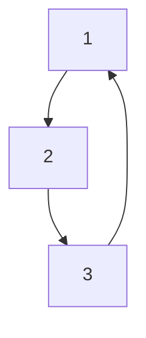

## 2.2 Common symbols

## Example

Consider the following simultaneous equations

$$
\left. \begin{array}{r} a _ {1 1} = b + c _ {1 1} \\ a _ {2 2} = b + c _ {2 2} \\ a _ {3 3} = b + c _ {3 3} \\ a _ {1 2} = c _ {1 2}, a _ {2 1} = c _ {2 1} \\ a _ {2 3} = c _ {2 3}, a _ {3 2} = c _ {3 2} \\ a _ {3 1} = c _ {3 1}, a _ {1 3} = c _ {1 3} \end{array} \right\}
$$

With the aid of Kronecker delta $\delta_{ij}$ , the equations above can be simplified to

$$
a _ {i j} = b \delta_ {i j} + c _ {i j}
$$

## 2.2 Common symbols

## Example

## The determinant

## of a 3 by 3 square matrix:

$$
\begin{array}{r} a = \left| \begin{array}{c c c} a _ {1 1} & a _ {1 2} & a _ {1 3} \\ a _ {2 1} & a _ {2 2} & a _ {2 3} \\ a _ {3 1} & a _ {3 2} & a _ {3 3} \end{array} \right| \end{array}
$$

Expanding the equation:

$$
a = a _ {1 1} \left| \begin{array}{c c} a _ {2 2} & a _ {2 3} \\ a _ {3 2} & a _ {3 3} \end{array} \right| - a _ {1 2} \left| \begin{array}{c c} a _ {2 1} & a _ {2 3} \\ a _ {3 1} & a _ {3 3} \end{array} \right| + a _ {1 3} \left| \begin{array}{c c} a _ {2 1} & a _ {2 2} \\ a _ {3 1} & a _ {3 2} \end{array} \right|
$$

$$
= a _ {1 1} a _ {2 2} a _ {3 3} + a _ {2 1} a _ {3 2} a _ {1 3} + a _ {3 1} a _ {1 2} a _ {2 3} - a _ {3 1} a _ {2 2} a _ {1 3} - a _ {2 1} a _ {1 2} a _ {3 3} - a _ {1 1} a _ {3 2} a _ {2 3}
$$

It is obvious that the all column indices are clock-wise permutation in all six terms whereas the row indices are clock-wise permutation in the first three terms and anti clock-wise permutation in the last three terms.

Therefore, with the Levi-Civita symbol the equation above can be written as:

$$
a = \left| a _ {i j} \right| = e _ {i j k} a _ {i 1} a _ {j 2} a _ {k 3}
$$

flowchart

## 2.2 Common Symbols

## Example

## 3 by 3 square matrix:

The previous expression was obtained by expanding the determinant by column, if expanding by row the following expression is obtained:

$$
a = \left| a _ {i j} \right| = e _ {i j k} a _ {1 i} a _ {2 j} a _ {3 k}
$$

flowchart

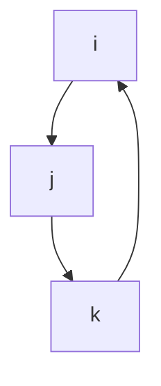

If we swap any adjacent columns once in the original matrix, the sign of the determinant becomes the opposite and the permutation of the new matrix becomes anti clock-wise:

$$
a ^ {\prime} = \left| \begin{array}{c c c} a _ {1 ^ {\prime} 1 ^ {\prime}} & a _ {1 ^ {\prime} 2 ^ {\prime}} & a _ {1 ^ {\prime} 3 ^ {\prime}} \\ a _ {2 ^ {\prime} 1 ^ {\prime}} & a _ {2 ^ {\prime} 2 ^ {\prime}} & a _ {2 ^ {\prime} 3 ^ {\prime}} \\ a _ {3 ^ {\prime} 1 ^ {\prime}} & a _ {3 ^ {\prime} 2 ^ {\prime}} & a _ {3 ^ {\prime} 3 ^ {\prime}} \end{array} \right| = \left| \begin{array}{c c c} a _ {1 1} & a _ {1 3} & a _ {1 2} \\ a _ {2 1} & a _ {2 3} & a _ {2 2} \\ a _ {3 1} & a _ {3 3} & a _ {3 2} \end{array} \right|
$$

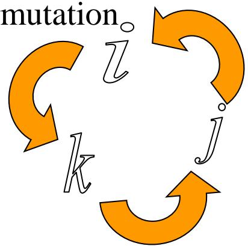

flowchart

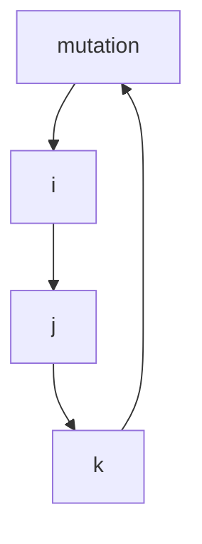

Similarly, the following expression is obtained upon expansion of the new matrix:

$$
a ^ {\prime} = \left| a _ {i j} ^ {\prime} \right| = e _ {i ^ {\prime} j ^ {\prime} k ^ {\prime}} a _ {1 ^ {\prime} i ^ {\prime}} a _ {2 ^ {\prime} j ^ {\prime}} a _ {3 ^ {\prime} k ^ {\prime}} = e _ {i k j} a _ {1 i} a _ {2 j} a _ {3 k}
$$

## 2.2 Common symbols

## Example

## 3 by 3 square matrix:

Therefore, for odd number of swaps of any adjacent columns, the sign of the determinant and the permutation are both changed. On the other hand, for even number of swaps of any adjacent columns, both the determinant and the permutation remain the same as for the original matrix.  
Hence, if the column indices are in some random order r, s and t instead of the cyclic order 1, 2 and 3, we can draw the following conclusion:

A cyclic permutation in r, s and t implies an even number of swaps of any adjacent columns whereas the determinant remains unchanged. Moreover, indices r, s and t are achieved through an even number of swaps from 1, 2 and 3, thus are still cyclic.  
■ An anticyclic permutation in r, s and t implies an odd number of swaps of any adjacent columns whereas the sign of the determinant becomes the opposite. Moreover, indices r, s and t are achieved through an odd number of swaps from 1, 2 and 3, thus are anticyclic.

Therefore the information on column swaps and the sign changes of the determinant in a square matrix can be seen from expressions with the Levi-Civita

$$
\mathrm{symbol} e _ {i j k}
$$

$$
a e _ {r s t} = a _ {i r} a _ {j s} a _ {k t} e _ {i j k}
$$

Similarly, for row swaps:

$$
a e _ {r s t} = a _ {r i} a _ {s j} a _ {t k} e _ {i j k}
$$

## 2.3 Revision of linear algebra

## Vector and coordinates

Assume that $\{O; x_{1}, x_{2}, x_{3}\}$ is the Cartesian-coordinate system in a 3-D space, $e_{1}, e_{2}$ and $e_{3}$ are the basis vectors in the direction of $Ox_{1}$ , $Ox_{2}$ and $Ox_{3}$ respectively. Therefore any random vector OP = r can be expressed as:

$$
\mathbf {r} = x _ {1} \mathbf {e} _ {1} + x _ {2} \mathbf {e} _ {2} + x _ {3} \mathbf {e} _ {3}
$$

$x_{1}$ , $x_{2}$ and $x_{3}$ are referred to as the vector coordinates.  
$\mathbf{e}_1, \mathbf{e}_2$ and $\mathbf{e}_3$ are three mutually perpendicular basis vectors, sometimes referred to as the orthonormal basis in the Cartesian-coordinate system.

text_image

x₃
e₃
P
r
x₃
O
e₁
x₂
x₁
x₂
e₂

Obviously, the vector r is independent of the choice of the coordinate system. However its components vary their forms according to different coordinate systems, the same vector is generally expressed in different forms of components in different coordinate systems.

## 2.3 Revision of linear algebra

## Basis vector transformation

Assume a Cartesian-coordinate system in a 3-D space $\{O; x_1, x_2, x_3\}$ , with basis vectors being $\{\mathbf{e}_1, \mathbf{e}_2, \mathbf{e}_3\}$ .  
Assume that there is another coordinate system $\{O; x_{1}^{\prime}, x_{2}^{\prime}, x_{3}^{\prime}\}$ , with basis vectors being $\{e_{1}^{\prime}, e_{2}^{\prime}, e_{3}^{\prime}\}$ .

> Denote $l_{i}, j$ as the direct cos function of the angle between $x_{i}$ and $x_{j}$ axis: $\cos(x_{i}', x_{j})$

$$
\left\{ \begin{array}{l} \mathbf {e} _ {1} ^ {\prime} = l _ {1 ^ {\prime} 1} \mathbf {e} _ {1} + l _ {1 ^ {\prime} 2} \mathbf {e} _ {2} + l _ {1 ^ {\prime} 3} \mathbf {e} _ {3} \\ \mathbf {e} _ {2} ^ {\prime} = l _ {2 ^ {\prime} 1} \mathbf {e} _ {1} + l _ {2 ^ {\prime} 2} \mathbf {e} _ {2} + l _ {2 ^ {\prime} 3} \mathbf {e} _ {3} \\ \mathbf {e} _ {3} ^ {\prime} = l _ {3 ^ {\prime} 1} \mathbf {e} _ {1} + l _ {3 ^ {\prime} 2} \mathbf {e} _ {2} + l _ {3 ^ {\prime} 3} \mathbf {e} _ {3} \end{array} \right.
$$

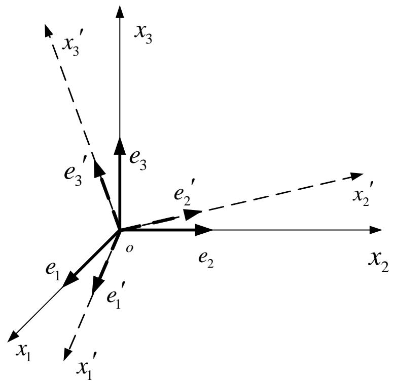

text_image

x₃'
e₃'
e₃
e₂'
e₂
x₂'
x₂
o
e₁
e₁'
x₁
x₁'

<table><tr><td rowspan="2">axis</td><td colspan="3">axis</td></tr><tr><td> $x_1$ </td><td> $x_2$ </td><td> $x_3$ </td></tr><tr><td> $x'_1$ </td><td> $l_{1'1}$ </td><td> $l_{1'2}$ </td><td> $l_{1'3}$ </td></tr><tr><td> $x'_2$ </td><td> $l_{2'1}$ </td><td> $l_{2'2}$ </td><td> $l_{2'3}$ </td></tr><tr><td> $x'_3$ </td><td> $l_{3'1}$ </td><td> $l_{3'2}$ </td><td> $l_{3'3}$ </td></tr></table>

## 2.3 Revision of linear algebra

## Basis vector transformation

The equations given in the previous slide show the transformation between basis vectors $\mathbf{e}_{i}^{\prime}(i=1,2,3)$ and $\mathbf{e}_{i}(i=1,2,3)$ . Expressing in matrix form, thus:

$$
\left( \begin{array}{l} \mathbf {e} _ {1} ^ {\prime} \\ \mathbf {e} _ {2} ^ {\prime} \\ \mathbf {e} _ {3} ^ {\prime} \end{array} \right) = \left[ \begin{array}{l l l} l _ {1 ^ {\prime} 1} & l _ {1 ^ {\prime} 2} & l _ {1 ^ {\prime} 3} \\ l _ {2 ^ {\prime} 1} & l _ {2 ^ {\prime} 2} & l _ {2 ^ {\prime} 3} \\ l _ {3 ^ {\prime} 1} & l _ {3 ^ {\prime} 2} & l _ {3 ^ {\prime} 3} \end{array} \right] \left( \begin{array}{l} \mathbf {e} _ {1} \\ \mathbf {e} _ {2} \\ \mathbf {e} _ {3} \end{array} \right)
$$

With summation indices, the expression can be simplified to:

$$
\mathbf {e} _ {i} ^ {\prime} = l _ {i ^ {\prime} j} \mathbf {e} _ {j} (i, i ^ {\prime}, j = 1, 2, 3)
$$

and in matrix form:

$$
\mathbf {e} ^ {\prime} = \mathbf {L e}
$$

## 2.3 Revision of linear algebra

## Basis vector transformation

L is an orthogonal matrix:

$$
L = \left[ \begin{array}{l l l} l _ {1 ^ {\prime} 1} & l _ {1 ^ {\prime} 2} & l _ {1 ^ {\prime} 3} \\ l _ {2 ^ {\prime} 1} & l _ {2 ^ {\prime} 2} & l _ {2 ^ {\prime} 3} \\ l _ {3 ^ {\prime} 1} & l _ {3 ^ {\prime} 2} & l _ {3 ^ {\prime} 3} \end{array} \right]
$$

Since L is an orthogonal matrix, $L^{-1}=L^{T}$ . Hence it is not difficult to obtain the reverse transformation of the basis vectors:

$$
\left\{ \begin{array}{l l} \mathbf {e} _ {1} = l _ {1 1 ^ {\prime}} \mathbf {e} _ {1} ^ {\prime} + l _ {1 2 ^ {\prime}} \mathbf {e} _ {2} ^ {\prime} + l _ {1 3 ^ {\prime}} \mathbf {e} _ {3} ^ {\prime} \\ \mathbf {e} _ {2} = l _ {2 1 ^ {\prime}} \mathbf {e} _ {1} ^ {\prime} + l _ {2 2 ^ {\prime}} \mathbf {e} _ {2} ^ {\prime} + l _ {2 3 ^ {\prime}} \mathbf {e} _ {3} ^ {\prime} \\ \mathbf {e} _ {3} = l _ {3 1 ^ {\prime}} \mathbf {e} _ {1} ^ {\prime} + l _ {3 2 ^ {\prime}} \mathbf {e} _ {2} ^ {\prime} + l _ {3 3 ^ {\prime}} \mathbf {e} _ {3} ^ {\prime} \end{array} \right. \quad \text {thus} \quad \mathbf {e} = \mathbf {L} ^ {T} \mathbf {e} ^ {\prime}
$$

## 2.3 Revision of linear algebra

## Transformation of coordinates

Consider a vector $a$ originating from O to A, the coordinates are $\{a_1, a_2, a_3\}$ and $\{a_1', a_2', a_3'\}$ in the old and new coordinate systems respectively,  
and a can be expressed as:

$$
a = a _ {i} \mathbf {e} _ {i} = a _ {1} \mathbf {e} _ {1} + a _ {2} \mathbf {e} _ {2} + a _ {3} \mathbf {e} _ {3} = (\mathbf {e} _ {1}, \mathbf {e} _ {2}, \mathbf {e} _ {3}) \cdot (a _ {1}, a _ {2}, a _ {3}) ^ {T}
$$

$$
a = a _ {i ^ {\prime}} \mathbf {e} _ {i} ^ {\prime} = a _ {1 ^ {\prime}} \mathbf {e} _ {1} ^ {\prime} + a _ {2 ^ {\prime}} \mathbf {e} _ {2} ^ {\prime} + a _ {3 ^ {\prime}} \mathbf {e} _ {3} ^ {\prime} = (\mathbf {e} _ {1} ^ {\prime}, \mathbf {e} _ {2} ^ {\prime}, \mathbf {e} _ {3} ^ {\prime}) \cdot (a _ {1 ^ {\prime}}, a _ {2 ^ {\prime}}, a _ {3 ^ {\prime}}) ^ {T}
$$

With the previously derived equations for basis vector transformation, the following expression is obtained:

$$
(\mathbf {e} _ {1} ^ {\prime}, \mathbf {e} _ {2} ^ {\prime}, \mathbf {e} _ {3} ^ {\prime}) \left( \begin{array}{l} a _ {1 ^ {\prime}} \\ a _ {2 ^ {\prime}} \\ a _ {3 ^ {\prime}} \end{array} \right) = (\mathbf {e} _ {1}, \mathbf {e} _ {2}, \mathbf {e} _ {3}) \left[ \begin{array}{l l l} l _ {1 1 ^ {\prime}} & l _ {1 2 ^ {\prime}} & l _ {1 3 ^ {\prime}} \\ l _ {2 1 ^ {\prime}} & l _ {2 2 ^ {\prime}} & l _ {2 3 ^ {\prime}} \\ l _ {3 1 ^ {\prime}} & l _ {3 2 ^ {\prime}} & l _ {3 3 ^ {\prime}} \end{array} \right] \left( \begin{array}{l} a _ {1 ^ {\prime}} \\ a _ {2 ^ {\prime}} \\ a _ {3 ^ {\prime}} \end{array} \right) = (\mathbf {e} _ {1}, \mathbf {e} _ {2}, \mathbf {e} _ {3}) \left( \begin{array}{l} a _ {1} \\ a _ {2} \\ a _ {3} \end{array} \right)
$$

## 2.3 Revision of linear algebra

## Transformation of coordinates

thus

$$
\left\{ \begin{array}{l l} a _ {1} = l _ {1 1 ^ {\prime}} a _ {1 ^ {\prime}} + l _ {1 2 ^ {\prime}} a _ {2 ^ {\prime}} + l _ {1 3 ^ {\prime}} a _ {3 ^ {\prime}} \\ a _ {2} = l _ {2 1 ^ {\prime}} a _ {1 ^ {\prime}} + l _ {2 2 ^ {\prime}} a _ {2 ^ {\prime}} + l _ {2 3 ^ {\prime}} a _ {3 ^ {\prime}} & \text {或} \quad \mathbf {a} = \mathbf {L} ^ {T} \mathbf {a} ^ {\prime} \\ a _ {3} = l _ {3 1 ^ {\prime}} a _ {1} + l _ {3 2 ^ {\prime}} a _ {2} + l _ {3 3 ^ {\prime}} a _ {3 ^ {\prime}} \end{array} \right.
$$

Expressed with summation indices, thus

$$
a _ {i} = l _ {i j ^ {\prime}} a _ {j ^ {\prime}} \quad (i = 1, 2, 3)
$$

The equation above transforms the components of vector a from the new to the old coordinate system. Similarly, the equation of transformation from the old to the new coordinate system can also be derived.

$$
a _ {i \mathbb {C}} = l _ {i \mathbb {C} j} a _ {j} (i \mathbb {C} = 1, 2, 3)
$$

## 2.3 Revision of linear algebra

## Matrix transformation

With the knowledge of linear algebra, we know that the linear transformation in any space is entirely based on the transformation of basis vectors. Matrix is the coordinated expression of linear transformation for certain basis. For a random vector $\mathbf{a}$ ,

$$
Y \mathbf {a} = \boxed {Y (\mathbf {e} _ {1} \mathbf {e} _ {2} \mathbf {e} _ {3})} \begin{array}{c c c} a & 0 & \text {Basis vector} \\ \zeta & a _ {1} & \div \\ \zeta & a _ {2} & \div \\ \zeta & a _ {3} & \div \\ \tilde {\epsilon} & \end{array} = \boxed {(\mathbf {e} _ {1} \mathbf {e} _ {2} \mathbf {e} _ {3}) \mathbf {A}} \begin{array}{c c c} a & 0 & \ddot {\circ} \\ \zeta & a _ {1} & \div \\ \zeta & a _ {2} & \div \\ \zeta & a _ {3} & \div \\ \tilde {\epsilon} & \end{array} = \mathbf {e} ^ {T} \mathbf {A} \mathbf {a}
$$

where $\Psi$ is the linear transformation operator, A is the matrix expression of the linear transformation for basis $\{e_{1}, e_{2}, e_{3}\}$ .

Similarly, for basis $\{e_{1}^{\prime}, e_{2}^{\prime}, e_{3}^{\prime}\}$ we have:

$$
\Psi \mathbf {a} = \Psi (\mathbf {e} _ {1} ^ {\prime} \quad \mathbf {e} _ {2} ^ {\prime} \quad \mathbf {e} _ {3} ^ {\prime}) \left( \begin{array}{l} a _ {1 ^ {\prime}} \\ a _ {2 ^ {\prime}} \\ a _ {3 ^ {\prime}} \end{array} \right) = (\mathbf {e} _ {1} ^ {\prime} \quad \mathbf {e} _ {2} ^ {\prime} \quad \mathbf {e} _ {3} ^ {\prime}) \mathbf {A} ^ {\prime} \left( \begin{array}{l} a _ {1 ^ {\prime}} \\ a _ {2 ^ {\prime}} \\ a _ {3 ^ {\prime}} \end{array} \right) = \mathbf {e} ^ {\prime T} \mathbf {A} ^ {\prime} \mathbf {a} ^ {\prime}
$$

## 2.3 Revision of linear algebra

## Matrix transformation

Recall the equations of basis transformation and vector transformation derived previously,

$$
\mathbf {e} ^ {T} = \mathbf {e} ^ {\prime T} \mathbf {L} \quad \mathbf {a} = \mathbf {L} ^ {T} \mathbf {a} ^ {\prime}
$$

substitute into the equation of the linear transformation under the old coordinate system, thus:

$$
\Psi \mathbf {a} = \mathbf {e} ^ {T} \mathbf {A a} = \mathbf {e} ^ {\prime T} \mathbf {L A L} ^ {T} \mathbf {a} ^ {\prime}
$$

\- comparing with the equation of the linear transformation under the new coordinate system:

$$
\mathsf {Y} \mathbf {a} = \mathbf {e} ^ {\mathbb {C} ^ {T}} \mathbf {A} ^ {\mathbb {C}} \mathbf {a} ^ {\mathbb {C}}
$$

since a' is a random vector, thus

$$
\mathbf {A} ^ {\prime} = \mathbf {L A L} ^ {T}
$$

The expression above is the matrix transformations, with summation indices it can be simplified to:

$$
a _ {i ^ {\prime} j ^ {\prime}} = a _ {m n} l _ {i ^ {\prime} m} l _ {j ^ {\prime} n} (i ^ {\prime}, j ^ {\prime} = 1, 2, 3)
$$

## 2.3 Revision of linear algebra

## Scalar product of vectors

Recall the definition of the orthonormal basis:

$$
\delta_ {i j} = \mathbf {e} _ {i} \bullet \mathbf {e} _ {j} \quad \delta_ {i ^ {\prime} j ^ {\prime}} = \mathbf {e} _ {i ^ {\prime}} \bullet \mathbf {e} _ {j ^ {\prime}}
$$

Shifting

index

the scalar product of any two vectors is thus:

$$
\boldsymbol {a} \cdot \boldsymbol {b} = (a _ {i} \mathbf {e} _ {i}) \cdot (b _ {j} \mathbf {e} _ {j}) = a _ {i} b _ {j} \mathbf {e} _ {i} \cdot \mathbf {e} _ {j} = a _ {i} b _ {j} ^ {\prime} \delta_ {i j} = a _ {i} b _ {i}
$$

Moreover:

$$
\delta_ {i j} = e _ {i} e _ {j} = l _ {k ^ {\prime} i} e _ {k ^ {\prime}} l _ {l ^ {\prime} j} e _ {l ^ {\prime}} = l _ {k ^ {\prime} i} l _ {l ^ {\prime} j} \delta_ {k ^ {\prime} l ^ {\prime}} = l _ {k _ {i} ^ {\prime} k _ {j} ^ {\prime}}
$$

## Cross product Definition of

Shifting rows indeterminant of

cross\_product

Recall the discussion about the determinant of matrix:

$$
\mathbf {a} \times \mathbf {b} = \left| \begin{array}{c c c} \mathbf {e} _ {1} & \mathbf {e} _ {2} & \mathbf {e} _ {3} \\ a _ {1} & a _ {2} & a _ {3} \\ b _ {1} & b _ {2} & b _ {3} \end{array} \right| = \left| \begin{array}{c c c} a _ {1} & a _ {2} & a _ {3} \\ b _ {1} & b _ {2} & b _ {3} \\ \mathbf {e} _ {1} & \mathbf {e} _ {2} & \mathbf {e} _ {3} \end{array} \right| = a _ {i} b _ {j} e _ {i j k} \mathbf {e} _ {k}
$$

## 2.3 Revision of linear algebra

We will prove the relationship between $\delta_{ij}$ and $e_{ijk}$ given below, hence be more familiar with tensor calculations.

$$
e _ {k s p} e _ {i p j} = \delta_ {i s} \delta_ {j k} - \delta_ {i k} \delta_ {j s}
$$

Rule of double cross product: (refer to math text book)

$$
\boldsymbol {a} \times (\boldsymbol {b} \times \boldsymbol {c}) = (\boldsymbol {a} \cdot \boldsymbol {c}) \boldsymbol {b} - (\boldsymbol {a} \cdot \boldsymbol {b}) \boldsymbol {c}
$$

Express the vectors in terms of components, thus:

$$
\boldsymbol {a} = a _ {i} \mathbf {e} _ {i}, \quad \boldsymbol {b} = b _ {k} \mathbf {e} _ {k}, \quad \boldsymbol {c} = c _ {s} \mathbf {e} _ {s}
$$

Substitute into the equation of double cross product, thus:

$$
\begin{array}{l} \pmb {a} \times (\pmb {b} \times \pmb {c}) = a _ {i} \mathbf {e} _ {i} \times (b _ {k} c _ {s} e _ {k s p} \mathbf {\epsilon_ {p}}) \\ = a _ {i} b _ {k} c _ {s} e _ {k s p} e _ {i p j} \mathbf {e} _ {j} \\ \end{array}
$$

$$
(\pmb {a} \bullet \pmb {c}) \pmb {b} - (\pmb {a} \bullet \pmb {b}) \pmb {c} = a _ {i} c _ {s} \delta_ {i s} b _ {k} \mathbf {e} _ {k} - a _ {i} b _ {k} \delta_ {i k} c _ {s} \mathbf {e} _ {s}
$$

$$
= a _ {i} b _ {k} c _ {s} (\delta_ {i s} \delta_ {j k} - \delta_ {i k} \delta_ {j s}) \mathbf {e} _ {j}
$$

## 2.3 Revision of linear algebra

Using the rule of double cross product to prove the relationship between $\delta_{ij}$ and $e_{ijk}$

thus  
Simply the expression above, thus:

$$
a _ {i} b _ {k} c _ {s} e _ {k s p} e _ {i p j} \mathbf {e} _ {j} = a _ {i} b _ {k} c _ {s} (\delta_ {i s} \delta_ {j k} - \delta_ {i k} \delta_ {j s}) \mathbf {e} _ {j}
$$

$$
a _ {i} b _ {k} c _ {s} [ e _ {k s p} e _ {i p j} - (\delta_ {i s} \delta_ {j k} - \delta_ {i k} \delta_ {j s}) ] \mathbf {e} _ {j} = 0
$$

Since $a_{i}$ , $b_{k}$ , $c_{s}$ are random vectors, hence:

$$
e _ {k s p} e _ {i p j} = e _ {k s p} e _ {j i p} = \delta_ {i s} \delta_ {j k} - \delta_ {i k} \delta_ {j s}
$$

Practice 1: Try proving the expression below using Lagrange equation

$$
(a \times b) \bullet (c \times d) = (a \bullet c) (b \bullet d) - (a \bullet d) (b \bullet c)
$$

Practice 2: Using enumeration method, prove all 81 scenarios for all combinations of values of i, j, k and s.

## 2.4 Cartesian tensor

Tensor is a quantity that describes the physical state or the geometric property of a certain object. It includes the quantity that describes the deformation and stress state of a continuum, the quantity that describes the elastic property of an object, etc.

The name “tensor” is originated from its historical relationship with stress (tensile). In fact, the moment of inertia of a rigid body is a second order tensor in classic mechanics, which sometimes is NOT clearly indicated in mechanics text books. We will prove this statement in later sections.

We will make further discussions about scalars and vectors, which will be very helpful to provide a better understanding of the concept of tensor.

## 2.4 Cartesian tensor

## Scalar

A physical or geometric quantity that can be expressed by a single real number.

## There are normally two types of scalars...

The first type of scalar does not vary with the coordinate transformation, hence is independent of the coordinate system. This type is referred to as the ordinary scalar, such as the density, the temperature, etc.  
The second type is dependent of the coordinate system, such as the scalar part of the vector component. This is referred to as the relative scalar.  
All scalars under the context of tensor are thought as ordinary scalars.

## 2.4 Cartesian tensor

## Example

Consider points A and B in a space, of which the coordinates are $a_{i}$ and $b_{i}$ (i=1,2,3) in a Cartesian coordinate system $\{O;x_{1},x_{2},x_{3}\}$ , respectively. The distance between A and B is denoted as $\Delta s$ , which is of course the length of AB, thus $\Delta s$ is a scalar.

## Proof:

The length of AB is thus: $\Delta s^2 = \Delta x_1^2 +\Delta x_2^2 +\Delta x_3^2 = \Delta x_i\Delta x_i$

Recall the angular transformations of the coordinate system: $x_{i'} = l_{i'j}x_j$

The coordinates of A and B in the Cartesian coordinate are $a_{i}$ , and $b_{i}$ , respectively, thus:

$$
\Delta x _ {\mathrm{i}} = a _ {\mathrm{i}} - b _ {\mathrm{i}}, \quad \Delta x _ {\mathrm{i} ^ {\prime}} = a _ {\mathrm{i} ^ {\prime}} - b _ {\mathrm{i} ^ {\prime}}
$$

Using the transformation:

Length is a scalar

$$
\Delta x _ {i ^ {\prime}} = a _ {i ^ {\prime}} - b _ {i ^ {\prime}} = l _ {i ^ {\prime} j} a _ {j} - l _ {i ^ {\prime} j} b _ {j} = l _ {i ^ {\prime} j} (a _ {j} - b _ {j}) = l _ {i ^ {\prime} j} ^ {\bullet} \Delta x _ {j}
$$

thus:

$$
(\Delta s ^ {\prime}) ^ {2} = \Delta x _ {i} ^ {\prime} \Delta x _ {i} ^ {\prime} = l _ {i ^ {\prime} k} l _ {i ^ {\prime} l} \Delta x _ {k} \Delta x _ {l} = \delta_ {k l} \Delta x _ {k} \Delta x _ {l} = \Delta x _ {k} \Delta x _ {k} = (\Delta s) ^ {2}
$$

## 2.4 Cartesian tensor

## Vector

Normally a vector is defined as a quantity with magnitude and direction. For further discussions, the new definition is given below:  
A physical or geometric quantity that are defined by 3 scalars that are dependent of the choice of the coordinate system and consistent with the equation of angular transformation of the coordinate system.

$$
a _ {i ^ {\prime}} = l _ {i ^ {\prime} j} a _ {j}
$$

Vector can be expressed by a single bold letter, or by its three components. (In theory of elasticity, variables are normally expressed by column vectors)

However, a set of three scalars may NOT be a vector. For example $a_{1}$ describes the age, $a_{2}$ describes the height and $a_{3}$ describes the weight of a person. It can be expressed in vector form ( $a_{1}$ , $a_{2}$ , $a_{3}$ ) $^{T}$ . It can be plus or multiplied to obtain average values of age, height and weight, however it is NOT a vector.  
Herein, the definition of vector is NOT a general definition. In another word, it is a restrict definition.

## 2.4 Cartesian tensor

## Example

The displacement of any point in a space is a vector.

## Proof:

Consider a point P in a coordinate system $\{O;x_{1},x_{2},x_{3}\}$ , the coordinate of P is expressed as:

$$
x _ {\mathrm{i}} = x _ {\mathrm{i}} (\mathrm{t})
$$

therefore in a time interval $(t, t+\Delta t)$ the displacement of P is thus:

$$
u _ {\mathrm{i}} = x _ {\mathrm{i}} (\mathrm{t} + \Delta \mathrm{t}) - x _ {\mathrm{i}} (\mathrm{t})
$$

in a new coordinate system $\{\mathrm{O};x_1',x_2',x_3'\}$ , it becomes:

$$
u _ {\mathrm{i} ^ {\prime}} = x _ {\mathrm{i} ^ {\prime}} (\mathrm{t} + \Delta \mathrm{t}) - x _ {\mathrm{i} ^ {\prime}} (\mathrm{t})
$$

with coordinate transformation:

$$
x _ {i ^ {\prime}} = l _ {i ^ {\prime} j} x _ {j}
$$

thus:

$$
u _ {i ^ {\prime}} = x _ {i ^ {\prime}} (t + \Delta t) - x _ {i ^ {\prime}} (t) = l _ {i ^ {\prime} j} (x _ {j} (t + \Delta t) - x _ {j} (t)) = l _ {i ^ {\prime} j} u _ {j}
$$

Similarly, velocity and acceleration can both be proved to be vectors.

Displacement is vector

## 2.4 Cartesian tensor

## Tensor

A quantity that are defined by 9 scalars that are dependent of the choice of the coordinate system and consistent with the equation of angular transformation of the coordinate system given below.

$$
a _ {i ^ {\prime} j ^ {\prime}} = a _ {m n} l _ {i ^ {\prime} m} l _ {j ^ {\prime} n}
$$

Comparing with

the vector:

$$
a _ {i ^ {\prime}} = l _ {i ^ {\prime} j} a _ {j}
$$

Second order tensors can normally be expressed in matrix forms:

$$
a _ {i j} = \left[ \begin{array}{c c c} a _ {1 1} & a _ {1 2} & a _ {1 3} \\ a _ {2 1} & a _ {2 2} & a _ {2 3} \\ a _ {3 1} & a _ {3 2} & a _ {3 3} \end{array} \right]
$$

Clearly, a random $3 \times 3$ matrix may NOT be a tensor, it is only the ones that are consistent with the equation of angular transformation of the coordinate system

## Sometimes scalars are referred to zero order tensors and referred to as first order tensors.

The number of components in a tensor is given by the number of the power of the number of the order:

2-D vector (2-D first order tensor): $2^{1} = 2$ components (p)  
3-D vector (3-D first order tensor): $3^{1} = 3$ components (s)

The dimension of space is different to the order of tensor.

Dimension indicates the range of index whereas order indicates the number of subscripts. The dimension in Theory of Relativity is 4

## 2.4 Cartesian tensor

## Example

## 1 Kronecker symbol

## Proof:

Consider the transformation of the basis vectors:

$$
e _ {i} ^ {\prime} = l _ {i ^ {\prime} j} e _ {j}
$$

Refer to definition of tensor

and the scalar product of orthonormal basis, thus

$$
\delta_ {i ^ {\prime} j ^ {\prime}} = \mathbf {e} _ {i} ^ {\prime} \bullet \mathbf {e} _ {j} ^ {\prime} = l _ {i ^ {\prime} k} \mathbf {e} _ {k} \bullet l _ {j ^ {\prime} s} \mathbf {e} _ {s} = l _ {i ^ {\prime} k} l _ {j ^ {\prime} s} \delta_ {k s}.
$$

Therefore Kronecker symbol is a second order tensor.

Practice: Similarly, prove permutation symbol $e_{ijk}$ is a third order tensor

## 2.4 Cartesian tensor

## Example 2

The moment of inertia of a rigid body

## Proof:

Consider the angular velocity $\omega$ of a rigid body, the velocity of any point in the rigid body is thus:

$$
\nu = \omega \times \mathbf {r}
$$

where $\mathbf{r}$ is position vector of the point.

The angular momentum of the rigid body is:

$$
\begin{array}{l} \mathbf {I} = \int \mathbf {r} \times \mathbf {v} d m = \int \mathbf {r} \times (\boldsymbol {\omega} \times \mathbf {r}) d m = \int (x _ {p} \mathbf {e} _ {p}) \times [ (\omega_ {j} \mathbf {e} _ {j}) \times (x _ {k} \mathbf {e} _ {k}) ] d m \\ = \int (x _ {p} \mathbf {e} _ {p}) \times (\omega_ {j} x _ {k} e _ {j k q} \mathbf {e} _ {q}) d m = (e _ {p q i} e _ {j k q} \int x _ {p} x _ {k} d m) \omega_ {j} \mathbf {e} _ {p} \\ \end{array}
$$

the moment of inertia of the rigid body:

$$
I _ {i j} = e _ {p q i} e _ {j k q} \int x _ {p} x _ {k} d m = e _ {q i p} e _ {q j k} \int x _ {p} x _ {k} d m
$$

text_image

x₃
ω
r
v
x₂
x₁

Symmetry of index

## 2.4 Cartesian tensor

## Example 2

Moment of inertia of rigid body
Recall the relationship between $\delta_{ij}$ and $e_{ijk}$ :

$$
e _ {q i p} e _ {q j k} = \delta_ {i j} \delta_ {p k} - \delta_ {i k} \delta_ {p j}
$$

Substitute into the expression of moment of inertia:

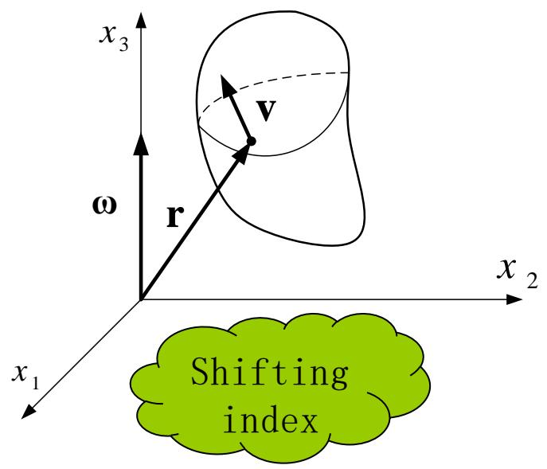

text_image

x₃
ω
r
v
x₂
x₁
Shifting
index

$$
\begin{array}{l} I _ {i j} = e _ {p q i} e _ {p j k} \int x _ {p} x _ {k} d m = \int (\delta_ {i j} \delta_ {p k} - \delta_ {i k} \delta_ {p j}) x _ {p} x _ {k} d m \\ = \int (\delta_ {i j} \delta_ {p k} x _ {p} x _ {k} - \delta_ {i k} \delta_ {p j} x _ {p} x _ {k}) d m = \int (\delta_ {i j} x _ {p} x _ {p} - x _ {i} x _ {j}) d m \\ \end{array}
$$

Equation of coordinate transformation:

$$
x _ {i ^ {\prime}} = l _ {i ^ {\prime} j} x _ {j}
$$

## 2.4 Cartesian tensor

## Example 2

The moment of inertia of rigid body

From the previous example we know that $\delta_{ij}$ is a second order tensor.

Note that the length $x_{\mathrm{p}}x_{\mathrm{p}}$ is a scalar and therefore is independent of coordinate transformation. Recall the summation indices:

$$
x _ {p} x _ {p} = x _ {p ^ {\prime}} x _ {p ^ {\prime}}
$$

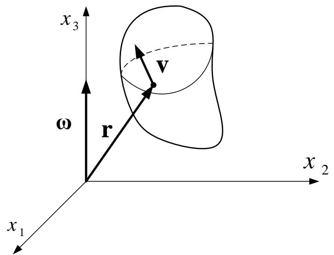

text_image

x₃
ω
r
v
x₂
x₁

For $x_{i}x_{j}$ : $x_{i'}x_{j'} = l_{i'm}x_ml_{j'n}x_n = l_{i'm}l_{j'n}x_mx_n$

Thus: $I_{i'j'} = \int (\delta_{i'j'}x_{p'}x_{p'} - x_{i'}x_{j'})dm$

$$
= \int (\delta_ {m n} l _ {i ^ {\prime} m} l _ {j ^ {\prime} n} x _ {p} x _ {p} - x _ {m} x _ {n} l _ {i ^ {\prime} m} l _ {j ^ {\prime} n}) d \Omega
$$

$$
= l _ {i ^ {\prime} m} l _ {j ^ {\prime} n} \int (\delta_ {m n} x _ {p} x _ {p} - x _ {m} x _ {n}) d m = l _ {i ^ {\prime} m} l _ {j ^ {\prime} n} I _ {m n}
$$

The moment of inertia is a second order tensor

## 2.4 Cartesian tensor

## Tensor calculations

Addition and subtraction is the same as matrix calculation.  
Product of a scalar and a tensor is the same as matrix multiplication.  
Notation of the derivatives of tensors

$$
\frac {\partial (\mathbf {\Omega})}{\partial x _ {i}} \equiv (\mathbf {\Omega}), _ {i} \quad \frac {\partial (\mathbf {\Omega})}{\partial x _ {i j}} \equiv (\mathbf {\Omega}), _ {i j}
$$

## Tensor decomposition

Symmetric and anti-symmetric tensor decomposition  
Spherical and deviator tensor decomposition

## Tensor invariant

Analogous to eigenvalue and eigenvectors in matrix.

Tensor is a mathematical tool. During early development it was only a convenient notation that simplifies expressions and equations. However in recent decades, theory of tensor was rapidly developed and became an important tool for studies of continuum mechanics.

Herein, only basic concepts are given and it is expected to be helpful for reading the textbook and literatures  
The three bullet points listed above will be further discussed with specific examples in later sections.

## III、Theory of elasticity: differential context

# Introduction

Several basic concepts are reviewed in this lecture. Since the main purpose is to consolidate the tensor as a tool for defining the elasticity theory, the completeness of the elasticity theory is not particularly sought.  
In addition to learning the use of tensor, several basic concepts in mechanics of elasticity are also reviewed.

Internal forces内力分析部分

■ Stress states, stresses transformation when coordinate axes rotate 点的应力状态，坐标轴旋转时应力分量的计算  
■ Principal stresses and stress invariants, the decomposition of stress tensors主应力及应力不变量，应力张量的分解

Deformation 变形分析部分

■ Strain tensors: deduction and physical representations应变张量的推导及其物理意义  
■ Deformation analysis of rigid body刚体变形分析

Constitutive theory 本构理论

■ Strain energy function derived from thermal mechanics theory从热力学出发建立应变能函数  
■ Deduction of linear elasticity theory 线弹性理论的推导

Summary of mechanics and elasticity 弹性力学方程汇总

■ The order reduction of tensors 张量的降阶  
■ Expression of matrix calculus 矩阵算子表达式  
■ Equation derivations under various coordinate systems不同坐标系下方程的推导

## 3.1 Internal forces内力分析

## Stress state at one point

The stress state will be determined if all nine stress components can be determined.

This statement is true only if the following condition is met: stresses in any slant planes can be represented by those nine components.

This has been proven in the Theory of Elasticity and is used herewith directly. Consider the infinitesimal tetrahedron element in the diagram on the right:

The equilibrium in three axial directions will lead to the stress equations in any slant plane.: $\left\{\begin{array}{l}n\\n\end{array}\right.$

$$
\left\{ \begin{array}{l} T _ {1} ^ {n} = \sigma_ {1 1} l _ {1} + \sigma_ {2 1} l _ {2} + \sigma_ {3 1} l _ {3} \\ T _ {2} ^ {n} = \sigma_ {1 2} l _ {1} + \sigma_ {2 2} l _ {2} + \sigma_ {3 2} l _ {3} \\ T _ {3} ^ {n} = \sigma_ {1 3} l _ {1} + \sigma_ {2 3} l _ {2} + \sigma_ {3 3} l _ {3} \end{array} \right.
$$

text_image

x₃
σ₂₂ ← σ₂₁ ← σ₁₂ ← σ₁₃ ← σ₁₄ ← σ₁₅ ← σ₁₆ ← σ₁₇ ← σ₁₈ ← σ₁₉ ← σ₂₀ ← σ₂₁ ← σ₂₂ ← σ₂₃ ← σ₂₄ ← σ₂₅ ← σ₂₆ ← σ₂₇ ← σ₂₈ ← σ₂₉ ← σ₃₀ ← σ₃₁ ← σ₃₂ ← σ₃₃ ← σ₃₄ ← σ₃₅ ← σ₃₆ ← σ₃₇ ← σ₃₈ ← σ₃₉ ← σ₄₀ ← σ₄₁ ← σ₄₂ ← σ₄₃ ← σ₄₄ ← σ₄₅ ← σ₄₆ ← σ₄₇ ← σ₄₈ ← σ₄₉ ← σ₅₀ ← σ₅₁ ← σ₅₂ ← σ₅₃ ← σ₅₄ ← σ₅₅ ← σ₅₆ ← σ₅₇ ← σ₅₈ ← σ₅₉ ← σ₆₀ ← σ₆₁ ← σ₆₂ ← σ₆₃ ← σ₆₄ ← σ₆₅ ← σ₆₆ ← σ₆₇ ← σ₆₈ ← σ₆₉ ← σ₇₀ ← σ₇₁ ← σ₇₂ ← σ₇₃ ← σ₇₄ ← σ₇₅ ← σ₇₆ ← σ₇₇ ← σ₈₀ ← σ₈₁ ← σ₈₂ ← σ₈₃ ← σ₈₄ ← σ₈₅ ← σ₈₆ ← σ₈₇ ← σ₈ₑ ← σ₈ₑ
O
x₂

$x_{1}$ $l_{1}, l_{2}, l_{3}$ represent the direction cosine of n, i.e. $l_{1} = \cos(n, x_{1})$ , $l_{2} = \cos(n, x_{2})$ , $l_{3} = \cos(n, x_{3})$

The equations on the left can also represent the stress boundary conditions.

## 3.1 Internal forces内力分析

## Stress at one point

The equation in the previous slide is the well-known Cauchy stress equation, written in the form of matrix as follows:

$$
\left( \begin{array}{l} n \\ T _ {1} \\ n \\ T _ {2} \\ n \\ T _ {3} \end{array} \right) = \left( \begin{array}{l l l} \sigma_ {1 1} & \sigma_ {2 1} & \sigma_ {3 1} \\ \sigma_ {1 2} & \sigma_ {2 2} & \sigma_ {2 3} \\ \sigma_ {1 3} & \sigma_ {2 3} & \sigma_ {3 3} \end{array} \right) \left( \begin{array}{l} l _ {1} \\ l _ {2} \\ l _ {3} \end{array} \right)
$$

It can be further simplified by using the index symbols:

$$
T _ {i} ^ {n} = \sigma_ {j i} l _ {j} (i = 1, 2, 3)
$$

The equilibrium of moment about three axial directions, the theorem of conjugate shear stress can be obtained:

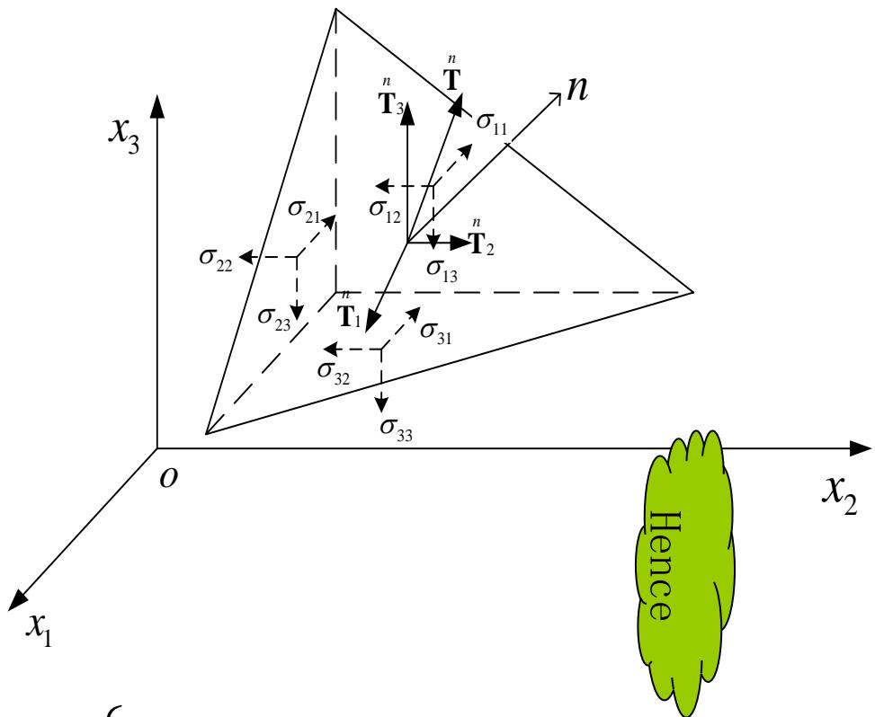

text_image

x₃
σ₂₂
σ₂₁
σ₁₂
T₃
n
T
n
σ₁₁
n
T₂
σ₁₃
σ₂₃
T₁
n
σ₃₁
σ₃₂
σ₃₃
O
x₁
x₂
Hence

$$
\left\{ \begin{array}{l l} \sigma_ {1 2} = \sigma_ {2 1} & \stackrel {\bullet} {\vdots} \\ \sigma_ {2 3} = \sigma_ {3 2} & \stackrel {n} {T} _ {i} = \sigma_ {j i} l _ {j} = \sigma_ {i j} l _ {j} \\ \sigma_ {3 1} = \sigma_ {1 3} & \end{array} \right.
$$

## 3.1 Internal forces内力分析

## The stress transformation at the rotation of coordinate systems

By utilizing the above results, the 9 stress components in the new coordinate system $\{O; x_1', x_2', x_3'\}$ can be represented using those from the old coordinate system $\{O; x_1, x_2, x_3\}$ .  
An orthogonal coordinate system is defined on the slant section with three axes r, m, n. The n axis is aligned with the normal direction and $r \& m$ are perpendicular to each other.  
The projected stress components along r, m, n axes can be represented with $\sigma_{nr}$ , $\sigma_{nm}$ , $\sigma_{mr}$ .  
The direction cosine along the m axis can be expressed as $l_{m1}$ , $l_{m2}$ , $l_{m3}$ , and the n/r axis follows the same convention.  
Since the projection of a vector is the summation of its components, i.e.

$$
\sigma_ {n m _ {n}} = T _ {i} ^ {n} l _ {m i} = T _ {1} ^ {n} l _ {m 1} + T _ {2} ^ {n} l _ {m 2} + T _ {3} ^ {n} l _ {m 3} = \left( \begin{array}{c c c} l _ {m 1} & l _ {m 2} & l _ {m 3} \end{array} \right)
$$

where $T_{i}(i = 1,2,3)$ are the stress vector on the slant plane.

text_image

x₃
r
n
m
o
x₂
x₁

The best way to get familiar with the tensor is to write its expanded expressions and then form them into a matrix. After some practices, you will be able to establish their relationship and find their advantages of being concise.

$$
\left( \begin{array}{c} n \\ T _ {1} \\ n \\ T _ {2} \\ n \\ T _ {3} \end{array} \right)
$$

## 3.1 Internal forces内力分析

## ✿ 坐标轴旋转时应力分量的计算

应用Cauchy公式

$$
\stackrel {n} {T} _ {i} = \sigma_ {j i} l _ {n j}
$$

则有

$$
\sigma_ {n m} = T _ {i} ^ {n} l _ {m i} = \sigma_ {j i} l _ {n j} l _ {m i}
$$

利用矩阵形式表达，即

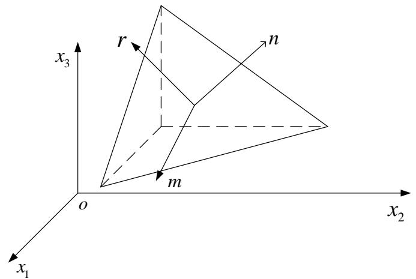

text_image

x₃
r
n
m
o
x₂
x₁

$$
\sigma_ {n m} = \left( \begin{array}{c c c} l _ {m 1} & l _ {m 2} & l _ {m 3} \end{array} \right) \left( \begin{array}{c c c} \sigma_ {1 1} & \sigma_ {2 1} & \sigma_ {3 1} \\ \sigma_ {1 2} & \sigma_ {2 2} & \sigma_ {2 3} \\ \sigma_ {1 3} & \sigma_ {2 3} & \sigma_ {3 3} \end{array} \right) \left( \begin{array}{c} l _ {n 1} \\ l _ {n 2} \\ l _ {n 3} \end{array} \right)
$$

## 3.1 Internal forces内力分析

✿ 坐标轴旋转时应力分量的计算

仿照

$$
\sigma_ {n m} = \sigma_ {j i} l _ {n j} l _ {m i}
$$

不难写出新坐标系下9个应分量，以 $\sigma_{2'3'}$ 为例

$$
\sigma_ {2 ^ {\prime} 3 ^ {\prime}} = \sigma_ {i j} l _ {2 ^ {\prime} j} l _ {3 ^ {\prime} i}
$$

采用自由指标表达，即

$$
\sigma_ {m n} = \sigma_ {i j} l _ {m j} l _ {n i} (m, n = 1, 2, 3)
$$

表达为矩阵形式，即

$$
\pmb {\sigma} ^ {\prime} = \mathbf {L} \pmb {\sigma} \mathbf {L} ^ {T}
$$

由张量定义知，应力为二阶张量，

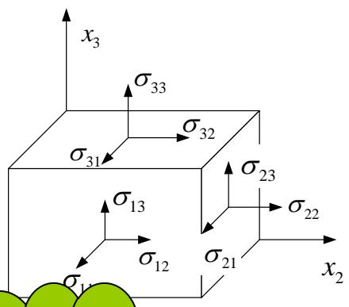

text_image

x₃
σ₃₃
σ₃₂
σ₃₁
σ₁₃
σ₁₂
σ₂₁
σ₂₂
x₂
σ₁₁

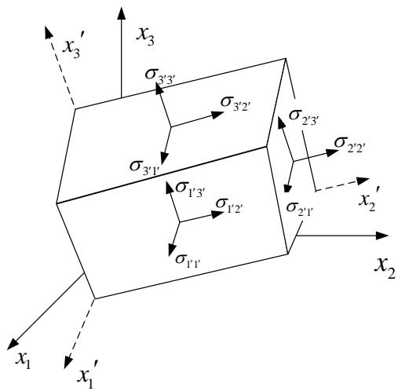

text_image

x₃'
x₃
σ₃'₃'
σ₃'₂'
σ₃'₁'
σ₂'₃'
σ₂'₂'
σ₁'₃'
σ₁'₂'
σ₁'₁'
σ₂'₁'
x₂'
x₁
x₁'
x₂

新旧坐标系夹角的余弦

<table><tr><td></td><td> $x_{1}$ </td><td> $x_{2}$ </td><td> $x_{3}$ </td></tr><tr><td> $x'_{1}$ </td><td> $l_{11}$ </td><td> $l_{12}$ </td><td> $l_{13}$ </td></tr><tr><td> $x'_{2}$ </td><td> $l_{21}$ </td><td> $l_{22}$ </td><td> $l_{23}$ </td></tr><tr><td> $x'_{3}$ </td><td> $l_{31}$ </td><td> $l_{32}$ </td><td> $l_{33}$ </td></tr></table>

## 3.1 Internal forces 内力分析

## 主应力

由下式

$$
\pmb {\sigma} ^ {\prime} = \mathbf {L} \pmb {\sigma} \mathbf {L} ^ {T}
$$

看出，在坐标旋转的情况下，张量分量的变换和矩阵分量的变换是一样的。

$$
\mathbf {A} ^ {\prime} = \mathbf {L A L} ^ {T}
$$

由剪力互等定理，应力张量是对称的。  
线性代数矩阵理论指出，在坐标旋转的情况下，如果矩阵满足以下两个条件

■ 矩阵元素为实数  
■ 矩阵对称

则一定可以找到一组可以将矩阵对角化的坐标系

这个结论对应的物理意义即：对于物体内任意一点，必定存在三个实数值的主应力及一组正交的主方向。

## 3.1 Internal forces内力分析

## 主应力

主应力问题的力学提法
我们知道，经过物体内一点的任意截面上的应力矢量，不仅与该点的应力张量有关，而且依赖于截面的方向。  
因此，很自然会提出下面的问题：是否存在这样一个截面，其应力矢量沿着截面法向？也就是说，应力矢量就是作用在截面上的正应力，切应力等于零。  
以下的讨论中将具有上述特性的正应力称为主应力，它是应力张量的主值。而起作用的截面称为主平面，主平面的法向则为应力张量的主方向。  
假设右图中的斜截面是符合上述要求的面元，并且作用于其上的应力为 $\sigma$ ，利用前面的 Cauchy 公式则有

$$
T _ {i} ^ {n} = \sigma_ {i j} n _ {i} = \sigma n _ {i} (i = 1, 2, 3)
$$

表达为矩阵形式即

text_image

x₃
σ₂₂
σ₂₁
σ₁₂
σ₁₃
σ₂₃
σ₃₂
σ₃₁
σ₃₃
O
x₂
n
T = σₙ
x₁

一点的主应力

$$
\left( \begin{array}{c} ^ {n} T _ {1} \\ ^ {n} T _ {2} \\ ^ {n} T _ {3} \end{array} \right) = \left( \begin{array}{c c c} \sigma_ {1 1} & \sigma_ {2 1} & \sigma_ {3 1} \\ \sigma_ {1 2} & \sigma_ {2 2} & \sigma_ {2 3} \\ \sigma_ {1 3} & \sigma_ {2 3} & \sigma_ {3 3} \end{array} \right) \left( \begin{array}{c} n _ {1} \\ n _ {2} \\ n _ {3} \end{array} \right) = \sigma \left( \begin{array}{c} n _ {1} \\ n _ {2} \\ n _ {3} \end{array} \right)
$$

## 3.1 Internal forces 内力分析

## 主应力

> 上面实际是一个矩阵特征值问题，非零解存在的条件就是相应的行列式系数为零，即

$$
\left| \begin{array}{c c c} \sigma_ {1 1} - \sigma & \sigma_ {2 1} & \sigma_ {3 1} \\ \sigma_ {1 2} & \sigma_ {2 2} - \sigma & \sigma_ {2 3} \\ \sigma_ {1 3} & \sigma_ {2 3} & \sigma_ {3 3} - \sigma \end{array} \right| = 0
$$

■ 可以采用指标符号，更简洁的记为

$$
\left| \sigma_ {i j} - \sigma \delta_ {i j} \right| = 0
$$

■ 展开行列式为

$$
\sigma^ {3} - \sigma^ {2} (\sigma_ {1 1} + \sigma_ {2 2} + \sigma_ {3 3}) + \sigma (\sigma_ {1 1} \sigma_ {2 2} + \sigma_ {2 2} \sigma_ {3 3} + \sigma_ {3 3} \sigma_ {1 1} - \sigma_ {2 3} ^ {2} - \sigma_ {3 1} ^ {2} - \sigma_ {1 2} ^ {2})
$$

$$
- (\sigma_ {1 1} \sigma_ {2 2} \sigma_ {3 3} + 2 \sigma_ {2 3} \sigma_ {3 1} \sigma_ {1 2} - \sigma_ {1 1} \sigma_ {2 3} ^ {2} - \sigma_ {2 2} \sigma_ {3 1} ^ {2} - \sigma_ {3 3} \sigma_ {1 2} ^ {2}) = 0
$$

## 3.1 Internal forces 内力分析

## 主应力与应力张量不变量

上式也可改写为

$$
\sigma^ {3} - \sigma^ {2} I _ {1} + \sigma I _ {2} - I _ {3} = 0
$$

式中 $I_{1}$ 、 $I_{2}$ 、 $I_{3}$ 为应力张量不变量，表达式为

$$
I _ {1} = \sigma_ {1 1} + \sigma_ {2 2} + \sigma_ {3 3}
$$

$$
I _ {2} = \left| \begin{array}{c c} \sigma_ {1 1} & \sigma_ {1 2} \\ \sigma_ {2 1} & \sigma_ {2 2} \end{array} \right| + \left| \begin{array}{c c} \sigma_ {2 2} & \sigma_ {2 3} \\ \sigma_ {3 2} & \sigma_ {3 3} \end{array} \right| + \left| \begin{array}{c c} \sigma_ {3 3} & \sigma_ {3 1} \\ \sigma_ {1 3} & \sigma_ {1 1} \end{array} \right|
$$

$$
I _ {3} = \left| \begin{array}{c c c} \sigma_ {1 1} & \sigma_ {2 1} & \sigma_ {3 1} \\ \sigma_ {1 2} & \sigma_ {2 2} & \sigma_ {2 3} \\ \sigma_ {1 3} & \sigma_ {2 3} & \sigma_ {3 3} \end{array} \right|
$$

## 3.1 Internal forces 内力分析

## 应力张量不变量

这是个一元三次方程，设以 $\sigma_{1}$ ， $\sigma_{2}$ ， $\sigma_{3}$ 表示它的三个根

$$
\sigma^ {3} - \sigma^ {2} I _ {1} + \sigma I _ {2} - I _ {3} = 0
$$

根据代数方程的系数与根的关系， $I_{1}$ 、 $I_{2}$ 、 $I_{3}$ 可以写为

$$
\begin{array}{l} I _ {1} = \sigma_ {1} + \sigma_ {2} + \sigma_ {3} \\ I _ {2} = \sigma_ {1} \sigma_ {2} + \sigma_ {2} \sigma_ {3} + \sigma_ {3} \sigma_ {1} \\ I _ {3} = \sigma_ {1} \sigma_ {2} \sigma_ {3} \\ \end{array}
$$

由于主应力的值与坐标系的选择无关，即由上述三式可知 $I_{1}$ 、 $I_{2}$ 、 $I_{3}$ 可以也是与坐标选择无关的量。这就是不变量名称的意义。  
下面以第一不变量为例，利用转轴公式证明

$$
\sigma_ {i ^ {\prime} i ^ {\prime}} = \sigma_ {m n} l _ {i ^ {\prime} m} l _ {i ^ {\prime} n} = \sigma_ {m n} \delta_ {m n} = \sigma_ {m m} = \sigma_ {i i}
$$

## 3.1 Internal forces 内力分析

## 应力张量的分解

➢ 应力张量可以分解为两部分，一部分为均匀应力状态，其主应力相等，切等于平均应力。表示为矩阵即

$$
\left| \begin{array}{c c c} {\sigma_ {m}} & {0} & {0} \\ {0} & {\sigma_ {m}} & {0} \\ {0} & {0} & {\sigma_ {m}} \end{array} \right| \quad \text {其中} \quad \sigma_ {m} = \frac {1}{3} \sigma_ {i i} = \frac {1}{3} \big (\sigma_ {1 1} + \sigma_ {2 2} + \sigma_ {3 3} \big)
$$

这叫做球应力张量，只与材料的体积应变有关。

➢ 应力张量的其余部分称为偏应力张量，至于材料的形状改变（剪切变形）有关，其分量为

$$
S _ {i j} = \sigma_ {i j} - \sigma_ {m} \delta_ {i j}
$$

可以类似的求出偏应力张量的三个不变量，它们在塑性力学中有着重要的应用。

## 3.1 Internal forces内力分析

## 平衡方程

Gauss公式（该公式以后经常用到，希望大家能够复习）

$$
\iint_ {S} (P \cos \alpha + Q \cos \beta + R \cos \gamma) d S = \iiint_ {V} (\frac {\partial P}{\partial x} + \frac {\partial Q}{\partial y} + \frac {\partial R}{\partial z}) d V
$$

对于弹性力学中的应力，该公式可以写为更简洁的形式

$$
\int_ {S} \sigma_ {i j} l _ {j} d S = \int_ {V} \sigma_ {i j, j} d V (i = 1, 2, 3)
$$

隔离体平衡

在物体内用封闭曲面S包围体积V，得到隔离体。作用在S外表面上的应力矢用 $T_{i}$ 表示，作用在V上的体力用 $F_{i}$ 表示。由合力为零，得

$$
\int_ {S} \mathrm{T} _ {i} d S + \int_ {V} \mathrm{F} _ {i} d V = 0 (i = 1, 2, 3)
$$

代入Cauchy公式，得

$$
\int_ {S} \sigma_ {\mathrm{ij}} l _ {j} d S + \int_ {V} \mathrm{F} _ {i} d V = 0 (i = 1, 2, 3)
$$

## 3.1 Internal forces内力分析

## 平衡方程

Gauss公式

$$
\int_ {S} \sigma_ {i j} l _ {j} d S = \int_ {V} \sigma_ {i j, j} d V (i = 1, 2, 3)
$$

隔离体平衡

$$
\int_ {S} \sigma_ {\mathrm{ij}} l _ {j} d S + \int_ {V} \mathrm{F} _ {i} d V = 0 (i = 1, 2, 3)
$$

结合以上两式

$$
\int_ {V} (\sigma_ {\mathrm{ij,j}} + \mathrm{F} _ {i}) d V = 0 (i = 1, 2, 3)
$$

注意到V是任意取的，要上式成立必然有被积函数恒为零。即

$$
\sigma_ {\mathrm{ij}, \mathrm{j}} + \mathrm{F} _ {i} = 0 (i = 1, 2, 3)
$$

由于建立了连续函数体积分与面积分之间的关系，Gauss公式是应用数学中最有用的公式之一。这里的思想方法，以后经常遇到。

## 3.2 变形分析

## 构形与位移

在小变形假设下，由于变形很小，因而忽略了物体受力后在空间位置的变化。但更一般的情况是，变形比较大，必须考虑这种改变。为了描述物体变形前后的两种不同状态，引入了构形的概念。  
构形(configuration): 在某一瞬时, 物体在空间所占据的区域。有时也将其称为位形, 顾名思义, 就是描述了物体的位置和形状。是指由坐标系所描述的变形体的几何形貌。

在时间t=0，物体的初始构形为 $V_{0}$ ，并参考于一固定的坐标系 $\{x_{i}\}$ 。

物体内任一质点P可由矢径r或其质点坐标（ $x_{1}$ ， $x_{2}$ ， $x_{3}$ ）来表示。构形 $V_{0}$ 被称为初始构形。

在后来某一瞬时t，物体被移动到空间另一位置，其构形为V，称为当前构形。描述这一构形，用直角坐标系 $\{\xi_{i}\}$ 。

初始构形中的P点，变形后被移动到空间位置的Q点，可由矢径R或质点坐标（ $\xi_{1}$ ， $\xi_{2}$ ， $\xi_{3}$ ）来表示。

如右图所示，可以令坐标系 $\{x_{i}\}$ 和 $\{\xi_{i}\}$ 重合。

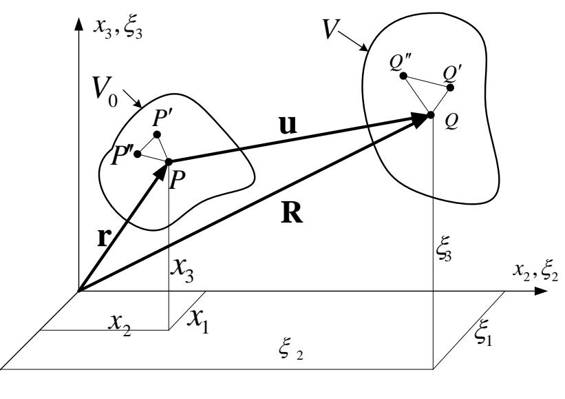

text_image

x₃,ξ₃
V₀
P′
u
P
r
R
x₃
ξ₃
x₂,ξ₂
x₂
x₁
ξ₂
ξ₁
Q″
Q′
Q

## 3.2 变形分析

## 构形与位移

可以把物体由初始构形到当前构形的变化，看作是一种数学上的变换。因而同一质点变形前后的关系有

$$
\xi_ {\mathrm{i}} = \xi_ {\mathrm{i}} (x _ {1}, x _ {2}, x _ {3}, t) (\mathrm{i} = 1, 2, 3)
$$

显然， $\xi_{i}$ 应当是 $x_{j}$ 的单值连续函数。并且由定义可得

$$
\xi_ {\mathrm{i}} = \xi_ {\mathrm{i}} (x _ {1}, x _ {2}, x _ {3}, 0) = x _ {\mathrm{i}} (\mathrm{i} = 1, 2, 3)
$$

位移(displacement)

如果令 $u_{i}$ 表示质点沿 $x_{i}$ 轴方向的位移，则

$$
u _ {\mathrm{i}} = \xi_ {\mathrm{i}} - x _ {\mathrm{i}} (\mathrm{i} = 1, 2, 3)
$$

或改写为向量形式有

$$
\mathbf {u} = \mathbf {R} - \mathbf {r}
$$

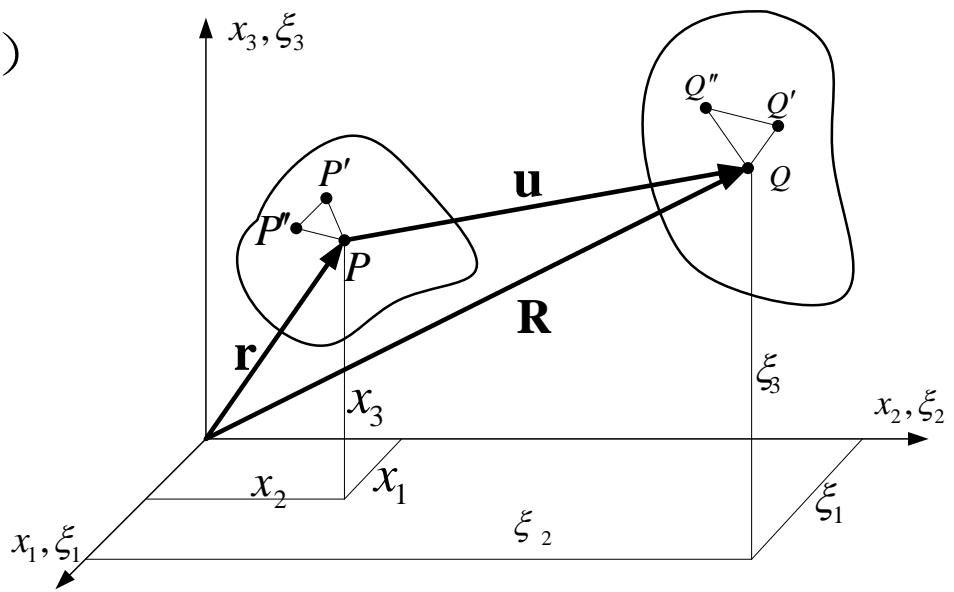

text_image

x₃, ξ₃
P'
P'
P
u
R
r
x₃
ξ₃
x₂, ξ₂
x₁, ξ₁
ξ₂
ξ₁
Q''
Q'
Q

## 3.2 变形分析

## 构形与位移

物体内的位移可分为两种:

\- 刚体位移：位移发生后物体内各点依然保持初始状态的相对位置不变，位移由物体在空间作刚体运动而引起。
- 变形位移：位移发生时改变了物体内各点的相对位移。这也是弹性力学感兴趣的位移，因为这种位移与物体内的应力有关系。

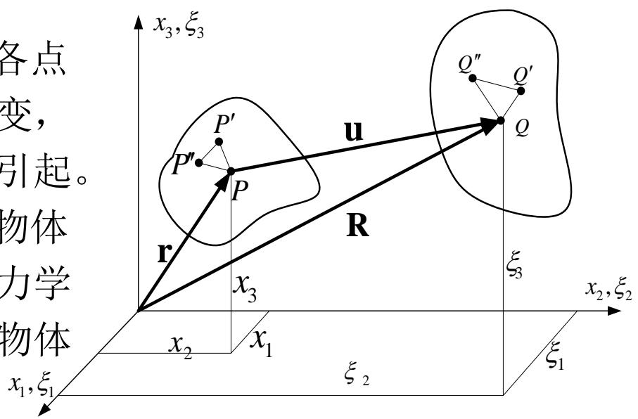

text_image

各点
变，
引起。
物体
力学
物体
x₁,ξ₁
x₂,ξ₂
ξ₁
ξ₂
x₃
x₁
x₂
r
P
P′
P′
u
R
Q
Q″
Q′
ξ₃
ξ₃
x₃,ξ₃

如右图，在变形前物体上取三个邻点P、P'、P"，变形后这三个点分别移动到Q、Q'、Q"，。显然，如果能知道三角形的三边长度的变化，那么变形后三角形的形状和夹角就可以完全确定。  
如果把物体内所有这种微小三角形拼合在一起，那么除了物体在空间的位置之外，变形后的新形态可以完全确定。所以，描述物体内任意两点间距离的变化，将是分析物体变形的关键。

## 3.2 变形分析

## 应变张量

考察物体内两相邻点 $P(x_{1},x_{2},x_{3})$ 、 $P'(x_{1}+dx_{1},x_{2}+dx_{2},x_{3}+dx_{3})$ 。变形前，线元 $PP'$ 的原始长度 $ds_{0}$ 的平方为

$$
d s _ {0} ^ {2} = d x _ {1} ^ {2} + d x _ {2} ^ {2} + d x _ {3} ^ {2} = d x _ {i} d x _ {i}
$$

P、P'变形后移动到Q $(\xi_{1},\xi_{2},\xi_{3})$ , Q' $(\xi_{1}+\mathrm{d}\xi_{1},\xi_{2}+\mathrm{d}\xi_{2},\xi_{3}+\mathrm{d}\xi_{3})$ 线元QQ'的长度ds的平方为

$$
d s ^ {2} = d \xi_ {1} ^ {2} + d \xi_ {2} ^ {2} + d \xi_ {3} ^ {2} = d \xi_ {i} d \xi_ {i}
$$

由于构形的变化看作从 $x_{i}$ （i=1, 2, 3）到 $\xi_{i}$ （i=1, 2, 3）上的一种数学变换，即

$$
\xi_ {\mathrm{i}} = \xi_ {\mathrm{i}} (x _ {1}, x _ {2}, x _ {3}) (\mathrm{i} = 1, 2, 3)
$$

故有 $d\xi_{i} = \frac{\partial\xi_{i}}{\partial x_{j}} dx_{j} = \xi_{i,j}dx_{j}$

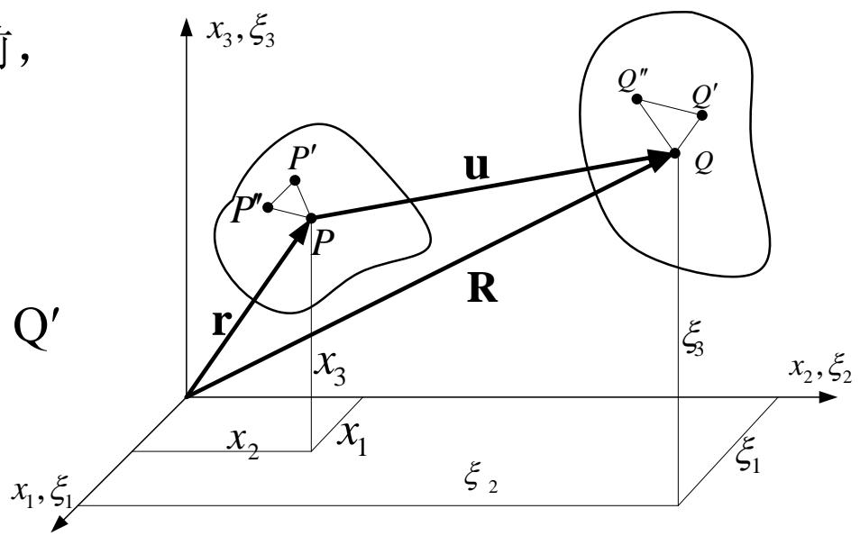

text_image

x₃,ξ₃
P'
P'
P
u
R
r
x₃
ξ₃
Q'
Q''
Q''
ξ₂
ξ₁
x₁,ξ₁
x₂,ξ₂
x₁,ξ₁

## 3.2 变形分析

## 应变张量

于是，线元长度平方之差可写成

$$
d s ^ {2} - d s _ {0} ^ {2} = d \xi_ {k} d \xi_ {k} - d x _ {i} d x _ {i} = \xi_ {k, i} d x _ {i} \xi_ {k, j} d x _ {j} - \delta_ {i j} d x _ {i} d x _ {j}
$$

引进应变项

$$
E _ {i j} = \frac {1}{2} (\xi_ {k, i} \xi_ {k, j} - \delta_ {i j})
$$

上式可以写为

$$
d s ^ {2} - d s _ {0} ^ {2} = 2 E _ {i j} d x _ {j} d x _ {i}
$$

应变 $E_{ij}$ 称为Green应变，为大变形分析条件下常用的应变度量。

为了得到应变和位移的关系，考虑前面的位移场

$$
u _ {i} = \xi_ {i} - x _ {i} (i = 1, 2, 3)
$$

## 3.2 变形分析

## 应变张量

于是，

$$
\frac {\partial \xi_ {i}}{\partial x _ {j}} = \frac {\partial (u _ {i} + x _ {i})}{\partial x _ {j}} = \frac {\partial u _ {i}}{\partial x _ {j}} + \delta_ {i j} = u _ {i, j} + \delta_ {i j}
$$

代入Green应变表达式，并注意 $\delta_{ij}^{j}$ 的换标作用

$$
E _ {i j} = \frac {1}{2} [ (u _ {k, i} + \delta_ {k i}) (u _ {k, j} + \delta_ {k j}) - \delta_ {i j} ] = \frac {1}{2} (u _ {i, j} + u _ {j, i} + u _ {k, i} u _ {k, j})
$$

由于小变形的假设，上式中位移导数的二次项相对于它的一次项可以忽略，因此Green应变可以退化为小位移情况下的无限小应变张量 $\varepsilon_{ij}$ ，即

$$
\star \varepsilon_ {i j} = \frac {1}{2} (u _ {i, j} + u _ {j, i})
$$

大家可以尝试证明，应变也是二阶张量。  
因此，同样可对其进行应变状态分析、确定主应变及主应变方向、求解应变不变量……

## 3.2 变形分析

## 应变张量的物理意义

现在我们考察如何通过应变张量确定线元的相对伸长。

设已知任意线元 $ds_{0}$ 变形前与 $x_{1}$ 轴平行，其分量为 $dx_{1}=ds_{0}$ ， $dx_{2}=dx_{3}=0$ ；变形之后为ds，于是线元的相对伸长为

$$
L _ {1} = \frac {d s - d s _ {0}}{d s _ {0}} \quad \text {或} \quad d s = (1 + L _ {1}) d s _ {0}
$$

根据前面讨论，在小变形假设下有

$$
d s ^ {2} - d s _ {0} ^ {2} = 2 E _ {i j} d x _ {j} d x _ {i} \approx 2 \varepsilon_ {i j} d x _ {j} d x _ {i} = 2 \varepsilon_ {1 1} d x _ {1} ^ {2}
$$

将其代入上式，并注意到 $dx_{1}=ds_{0}$ ，得

$$
(1 + L _ {1}) ^ {2} - 1 = 2 \varepsilon_ {1 1} \quad \text {即} \quad L _ {1} = \sqrt {1 + 2 \varepsilon_ {1 1}} - 1 \approx \varepsilon_ {1 1}
$$

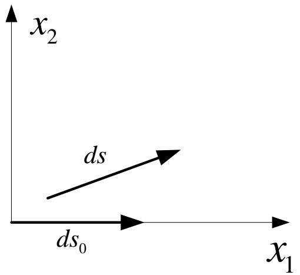

text_image

x₂
ds
ds₀
x₁

注意相对伸长比就是通常意义下的正应变！因此 $\varepsilon_{11}$ 数值上等于工程正应变 $\varepsilon_{x}$ 。同理可讨论 $\varepsilon_{22}$ 和 $\varepsilon_{33}$ 。

## 3.2 变形分析

## 应变张量的物理意义

## 考察如何通过应变张量确定两垂直线元间角度的变化。

设变形前线元 $ds_{0}$ 与 $x_{1}$ 轴平行，其分量为 $dx_{1}=ds_{0}$ ， $dx_{2}=dx_{3}=0$ ；变形前线元 $ds'_{0}$ 与 $x_{2}$ 轴平行，其分量为 $dx_{2}=ds_{0}$ ， $dx_{1}=dx_{3}=0$ 。变形后为 $ds(\mathrm{d}\xi_{\mathrm{i}})$ 和 $ds'(\mathrm{d}\xi'_{\mathrm{i}})$ ，列出变形后线元ds与ds'的内积

$$
d \mathbf {s} \cdot d \mathbf {s} ^ {\prime} = d s d s ^ {\prime} \cos \theta = d \xi_ {k} d \xi_ {k} ^ {\prime} = \xi_ {k, i} d x _ {i} \xi_ {k, j} d x _ {j} ^ {\prime} = \xi_ {k, 1} \xi_ {k, 2} d s _ {0} d s _ {0} ^ {\prime}
$$

根据Green应变定义，并注意到其中 $\delta_{ij} = \delta_{12} = 0$ ，得

$$
E _ {1 2} = \frac {1}{2} (\xi_ {k, 1} \xi_ {k, 2} - \delta_ {i j}) = \frac {1}{2} \xi_ {k, 1} \xi_ {k, 2}
$$

将其代入上式，得

$$
d s d s ^ {\prime} \cos \theta = 2 E _ {1 2} d s _ {0} d s _ {0} ^ {\prime}
$$

由前面分析知

$$
d s = \sqrt {1 + 2 E _ {1 1}} d s _ {0} d s ^ {\prime} = \sqrt {1 + 2 E _ {1 1}} d s _ {0} ^ {\prime}
$$

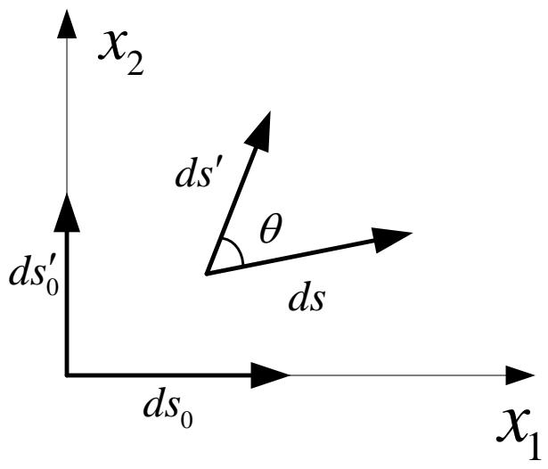

text_image

x₂
ds′₀
θ
ds
ds₀
x₁

## 3.2 变形分析

## 应变张量的物理意义

整理以上各式得

$$
\cos \theta = \frac {2 E _ {1 2} d s _ {0} d s _ {0} ^ {\prime}}{d s d s ^ {\prime}} = \frac {2 E _ {1 2}}{\sqrt {1 + 2 E _ {1 1}} \sqrt {1 + 2 E _ {2 2}}}
$$

则变形前相互垂直的 $ds_{0}$ 与 $ds'_{0}$ 两线元间夹角的变化

$$
\alpha_ {1 2} = \frac {\pi}{2} - \theta
$$

于是有

$$
\sin \alpha_ {1 2} = \frac {2 E _ {1 2}}{\sqrt {1 + 2 E _ {1 1}} \sqrt {1 + 2 E _ {2 2}}}
$$

在小变形情况下

$$
\sin \alpha_ {1 2} \approx \alpha_ {1 2} \approx 2 E _ {1 2} \approx 2 \varepsilon_ {1 2} = u _ {i, j} + u _ {j, i} = \gamma_ {i j}
$$

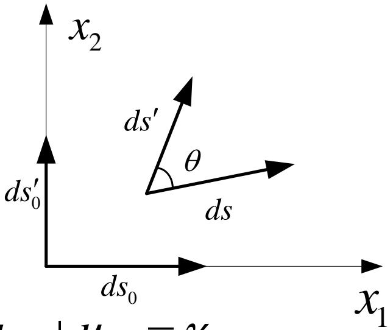

text_image

x₂
ds′
θ
ds
ds₀
ds₀
x₁

上式即工程剪切应变 $\gamma_{xy}$ ：变形体内一点沿 $x_{1}$ 和 $x_{2}$ 方向两线元间直角的变化。同理可讨论其他分量。

## 3.2 变形分析

## 刚体变形

前面我们以物体内任意两点间的距离变化为出发点，详细讨论了物体的应变。然而，物体在外力作用下产生的位移是由刚体运动和变形共同引起的。  
例如右图中任意线元AB变形后移动到新位置A'B"。它的运动可以看作：线元AB先做刚体平动到A'B'，然后经过伸长变形和刚体转动到A'B"。  
下面来考察刚体转动部分，并限于讨论小变形情况。  
显然，在考虑刚体转动时，只与线元AB端点的相对位移有关。

设A点和B点的位移分别为 $u_{A}$ 和 $u_{B}$ 。

如将邻点B的位移展开为A点的Taylor级数，并略去二次以上微量，得到

$$
\mathbf {u} _ {B} = \mathbf {u} _ {A} + \frac {\partial \mathbf {u}}{\partial x _ {j}} d x _ {j}
$$

线元AB两端点的相对位移为

$$
d \mathbf {u} = \mathbf {u} _ {B} - \mathbf {u} _ {A} = \frac {\partial \mathbf {u}}{\partial x _ {j}} d x _ {j}
$$

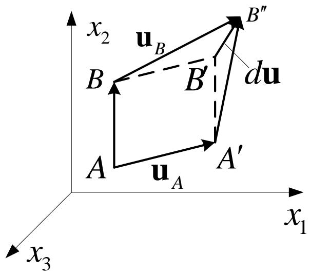

text_image

x₂ u_B B''
B B' du
A u_A A'
x₁
x₃

## 3.2 变形分析

## 刚体变形

采用指标记号，上式可以写为

$$
d u _ {i} = \frac {\partial u _ {i}}{\partial x _ {j}} d x _ {j} = u _ {i, j} d x _ {j} (i = 1, 2, 3)
$$

可以证明位移的一阶偏导数是二阶张量。写成矩阵形式，即

$$
u _ {i, j} = \left( \begin{array}{c c c} \frac {\partial u _ {1}}{\partial x _ {1}} & \frac {\partial u _ {1}}{\partial x _ {2}} & \frac {\partial u _ {1}}{\partial x _ {3}} \\ \frac {\partial u _ {2}}{\partial x _ {1}} & \frac {\partial u _ {2}}{\partial x _ {2}} & \frac {\partial u _ {2}}{\partial x _ {3}} \\ \frac {\partial u _ {3}}{\partial x _ {1}} & \frac {\partial u _ {3}}{\partial x _ {2}} & \frac {\partial u _ {3}}{\partial x _ {3}} \end{array} \right)
$$

通常将其称为位移梯度张量。

## 3.2 变形分析

## 刚体变形

在一般情况下

$$
\frac {\partial u _ {i}}{\partial x _ {j}} \neq \frac {\partial u _ {j}}{\partial x _ {i}}
$$

所以位移梯度张量一般是不对称的。为了将刚体转动和伸长变形分开，可以将位移梯度张量分解为一个对称张量和一个反对称张量之和：

$$
u _ {i, j} = \frac {1}{2} \left(u _ {i, j} + u _ {j, i}\right) + \frac {1}{2} (u
$$

上式右端的对称张量就是小变形的应变张元的转动有关，称为小变形的转动张量，记

由该式可知，仅当 $\varepsilon_{ij}<<1$ ，并且 $\omega_{ij}<<1$ 时才有 $u_{i,j}<<1$ 。也就是说，小变形的情况要求变形和转动都是微小的。

$$
u _ {i, j} = \varepsilon_ {i j} + \omega_ {i j}
$$

其中

$$
\omega_ {i j} = \frac {1}{2} \left(u _ {i, j} - u _ {j, i}\right) = - \omega_ {j i}
$$

## 3.2 变形分析

## 转动张量的物理意义

现在我们考察变形体内过某点在 $x_{1}x_{2}$ 平面上的线元绕过该点且垂直于 $x_{1}x_{2}$ 平面的轴作刚性转动引起的角位移。

取 $x_{1}x_{2}$ 平面上过P点且分别平行于 $x_{1}$ 轴和 $x_{2}$ 轴的两线元PA和PB。如图小变形时，设它们在平面内相对 $x_{1}$ 、 $x_{2}$ 轴转角为 $\alpha_{1}$ 和 $\alpha_{2}$ 。

$$
\left\{ \begin{array}{l l} \alpha_ {1} = \frac {\partial u _ {2}}{\partial x _ {1}} & (\text {逆时针方向}) \\ \alpha_ {2} = \frac {\partial u _ {1}}{\partial x _ {2}} & (\text {顺时针方向}) \end{array} \right.
$$

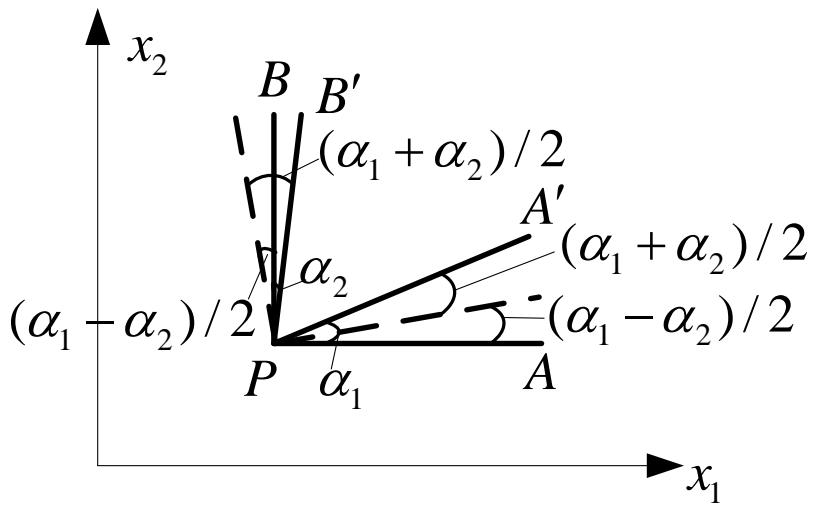

text_image

x₂
B B′
(α₁ + α₂) / 2
A′
(α₁ + α₂) / 2
α₂
(α₁ - α₂) / 2
P α₁ A
x₁

对此两线段位置改变可看作PAB作为整体（即PA和PB保持垂直）逆时针转过角度 $(\alpha_{1}-\alpha_{2})/2$ 到虚线位置，然后线段PA再逆时针转动角度 $(\alpha_{1}+\alpha_{2})/2$ ，而线段PB则顺时针转动角度 $(\alpha_{1}+\alpha_{2})/2$ 。

## 3.2 变形分析

## 转动张量的物理意义

这样，PA与PB的剪切变形为

$$
\gamma_ {1 2} = \frac {\alpha_ {1} + \alpha_ {2}}{2} + \frac {\alpha_ {1} + \alpha_ {2}}{2} = \alpha_ {1} + \alpha_ {2} = \frac {\partial u _ {1}}{\partial x _ {2}} + \frac {\partial u _ {2}}{\partial x _ {1}}
$$

或应变张量分量为

$$
\varepsilon_ {1 2} = \frac {1}{2} \gamma_ {1 2} = \frac {1}{2} \left(\frac {\partial u _ {1}}{\partial x _ {2}} + \frac {\partial u _ {2}}{\partial x _ {1}}\right)
$$

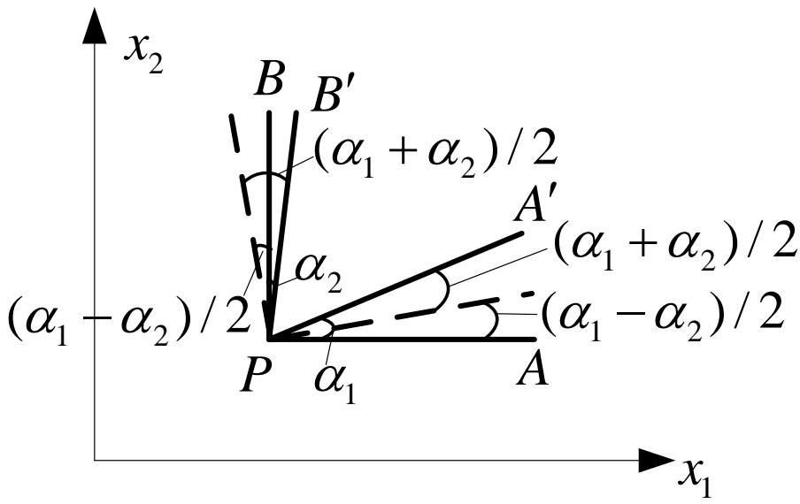

text_image

x₂
B B′
(α₁ + α₂) / 2
A′
(α₁ - α₂) / 2
α₂
P α₁ A
(α₁ - α₂) / 2
x₁

若按右手螺旋规则用矢量 $\Omega$ 表示点 P 的刚性转角，那么矢量在 $x_{3}$ 方向的分量，即点 P 处微元体绕 $x_{3}$ 轴的刚性转角，可记为 $\Omega_{3}$ 。

由上面分析显然有

$$
\Omega_ {3} = \frac {\alpha_ {1} - \alpha_ {2}}{2} = \frac {1}{2} \left(\frac {\partial u _ {1}}{\partial x _ {2}} - \frac {\partial u _ {2}}{\partial x _ {1}}\right) = \omega_ {1 2}
$$

利用排列符号，可将转动张量和转动矢量之间的关系用指标记为

$$
\Omega_ {k} = - \frac {1}{2} e _ {i j k} \omega_ {i j} \quad \text {或} \quad \omega_ {p q} = - e _ {p q k} \Omega_ {k}
$$

## 3.3 本构关系

在前面两节，我们分别从力学和几何的观点出发，导出了平衡方程和几何方程。

这些方程只反映物体变形过程中所应遵循的运动规律和连续性条件，而不涉及具体材料的物理特性，因此对一切连续体均适用。

弹性力学的目的是研究弹性体在外因（包括荷载、温度……）作用下的力学响应（包括应力、变形……）。

显然，仅从上述方程出发，不足以解决问题。必须建立一组把应力、变形和温度等联系起来的方程。

## 3.3 本构关系

一般将描述物质特性的方程称为该物质的本构方程。应力与应变关系描述了物质的力学特性，因此也可以称为本构关系（方程）。

研究描述变形体力学特性的本构关系，从根本上讲，应从热力学定律出发。因为物体在外力作用下的变化过程，实际上是一个热力学过程。

由于具体材料物质结构的复杂性和变形机理的多样性，要通过理论分析得出一个对任何连续介质和工作条件下都适用的本构关系是不可能的。

## 3.3 本构关系

通常的做法是，先根据热力学定律确定本构方程的基本框架，在配合适当的材料试验测定必要的材料特性常数，从而得到某类材料在特定工作条件下便于应用的本构关系。  
本节将按照这种思路介绍线弹性材料的本构关系，并且限于等温过程和绝热过程。利用这两类条件可以近似考虑绝大多数工程问题。

如前所述，在从一种状态变化到另一种状态的过程中，外力对物体作了功，同时该物体还同外界交换（吸收或放出）了热量，因而物体的总能量发生了变化。这一过程应遵循热力学的两个基本定律。

## 3.3 本构关系

## ◆ 理想弹性体的应变能函数

## 热力学第一定律

在无限小的时间间隔内，物体所具有的总能量的改变等于作用在该物体上的全部外力所作的功加上该物体向外界吸收（或放出）的热量。  
物体的总能量应包括物体各部分的动能K和内能U。前者与物体的质量和速度分布有关，而后者可以认为是取决于变形（应变）状态及温度的函数（更确切的说是泛函）。  
如果用A表示外力功，用Q表示热量，则按照热力学第一定律有

$$
\mathrm{dA} + \mathrm{dQ} = \mathrm{dK} + \mathrm{dU}
$$

或

$$
\mathrm{dU} - \mathrm{dQ} = \mathrm{dA} - \mathrm{dK}
$$

为使分析简单，下面只讨论静力问题，于是dK=0，从而有

$$
\mathrm{dU} - \mathrm{dQ} = \mathrm{dA}
$$

## 3.3 本构关系

## ◆ 理想弹性体的应变能函数

## 热力学第一定律

若某瞬时作用在物体上的外力，即体力 $F_{i}$ 和面力 $p_{i}$ 给定。在无限小时间间隔内，物体内各点的位移变化为 $du_{i}$ ，则这一过程中的外力功为

$$
d A = \int_ {V} F _ {i} d u _ {i} d V + \int_ {S} p _ {i} d u _ {i} d S
$$

将应力边界条件代入上式

$$
p _ {i} = \sigma_ {i j} l _ {j} (i = 1, 2, 3)
$$

并利用Gauss公式，化面积分为体积分，得

$$
\begin{array}{l} d A = \int_ {V} F _ {i} d u _ {i} d V + \int_ {S} \sigma_ {i j} l _ {j} d u _ {i} d S \\ = \int_ {V} F _ {i} d u _ {i} d V + \int_ {V} \left(\sigma_ {i j} d u _ {i}\right) _ {, j} d V \\ \end{array}
$$

## 3.3 本构关系

## ◆ 理想弹性体的应变能函数

## 热力学第一定律

继续展开上式

$$
\begin{array}{l} d A = \int_ {V} F _ {i} d u _ {i} d V + \int_ {V} (\sigma_ {i j} d u _ {i}) _ {, j} d V \\ = \int_ {V} F _ {i} d u _ {i} d V + \int_ {V} \left(\sigma_ {i j, j} d u _ {i} + \sigma_ {i j} d u _ {i, j}\right) d V \\ = \int_ {V} \left(F _ {i} + \sigma_ {i j, j}\right) d u _ {i} d V + \int_ {V} \sigma_ {i j} \frac {1}{2} \left(d u _ {i, j} + d u _ {j, i}\right) d V \\ \end{array}
$$

利用前面讨论的平衡方程和几何方程，得

$$
d A = \int_ {V} \sigma_ {i j} d \varepsilon_ {i j} d V
$$

因此有

$$
d U - d Q = d A = \int_ {V} \sigma_ {i j} d \varepsilon_ {i j} d V
$$

## 3.3 本构关系

## ◆ 理想弹性体的应变能函数

## 热力学第二定律

由于我们研究的问题是理想弹性体，其变形过程是可逆的。  
在从一状态到邻近另一状态的热平衡过程中，每一瞬间有一确定的温度T（取绝对温度）。对于可逆过程，按照热力学第二定律，有

$$
\mathrm{TdS} = \mathrm{dQ}
$$

其中，S称为熵，是一个与状态有关的量。

将其代入前式，则有

$$
d U - T d S = \int_ {V} \sigma_ {i j} d \varepsilon_ {i j} d V
$$

上式是在可逆的变形过程中，利用热力学第一定律和热力学第二定律得到的结果。  
下面我们要说明，在某些特定情况下，对于变形可逆的理想弹性体，存在应变能函数，并可通过它确定应力应变关系。

## 3.3 本构关系

## ◆ 理想弹性体的应变能函数

## 热力学自由能

前面已经指出，变形过程为热力学过程。  
描述固体变形过程的热力学参数，通常除了前面提到的应变 $\varepsilon_{ij}$ 、应力 $\sigma_{ij}$ 、温度T、熵S、内能U外，有时还引入用内能U、温度T及熵S表示的自由能F，即

$$
\mathrm{F} = \mathrm{U-ST}
$$

以上各量都是状态参量，可以证明，所有这些参数中只有两个是独立的，其余参数均可表示为这两个参数的函数。  
也就是说，任何一个参数都可以而且只须用两个独立参数表示。例如，一般可将内能U或自由能F表示为应变和温度的状态函数。

只有在下述两种特定情况下，U或F才可仅表示为应变的单值函数，这两种情况便是绝热过程和等温过程。下面分别进行说明。

## 3.3 本构关系

## ◆ 理想弹性体的应变能函数

## 绝热过程

快速加载（如冲击）可视为绝热过程。  
由于过程变化很快，物体与外界热量来不及交换，故有dQ=0。因此有

$$
d U = \int_ {V} \sigma_ {i j} d \varepsilon_ {i j} d V
$$

物体在绝热过程中，温度将略有变化，因而应力也随着变化。但在小变形时，热量dQ与外力功dA相比很小，温度T的变化可以略去不计，于是应力仅是应变的函数。

## 3.3 本构关系

## ◆ 理想弹性体的应变能函数

## 等温过程

若加载十分缓慢，物体在变形时，可充分与外界进行热交换，因而温度保持不变，这就是所谓的等温过程。  
由自由能定义可得

$$
\mathrm{dF} = \mathrm{dU} - \mathrm{TdS} - \mathrm{SdT}
$$

代入下式

$$
d U - T d S = \int_ {V} \sigma_ {i j} d \varepsilon_ {i j} d V
$$

并注意等温过程中，dT=0，于是有

$$
d F = \int_ {V} \sigma_ {i j} d \varepsilon_ {i j} d V
$$

## 3.3 本构关系

## ◆ 理想弹性体的应变能函数

以上分析表明，上述两种过程中，从某一状态到邻近的另一状态，理想弹性的内能变化dU或dF都可以视为仅由应变状态的变化引起的。从而U、F可仅表示为与应变有关的函数。  
以上两个状态函数统称为应变能函数。若以W表示单位体积的应变能，并称为应变能密度（简称应变能），则有

$$
d \int_ {V} W d V = \int_ {V} d W d V = \int_ {V} \sigma_ {i j} d \varepsilon_ {i j} d V
$$

应当说明，同一材料在两种过程中的W可能有差别，但差别仅仅是由于该材料在两种过程中的弹性系数不同而引起的。  
小变形时，应力应变关系的形式是相同的（都可表示为线性关系）。试验表明，两种过程中的弹性常数差别十分微小，可不必区分。因而在一定温度下，同一材料在两种过程中的本构关系可以认为是完全相同的。

## 3.3 本构关系

## ◆ 理想弹性体的应变能函数

由于对于任何一个理想弹性体（绝热或等温过程中），下式都是成立的，即式中的积分区域可以是任意的，

$$
d \int_ {V} W d V = \int_ {V} d W d V = \int_ {V} \sigma_ {i j} d \varepsilon_ {i j} d V
$$

所以对于任意域V内任一点均有

$$
d W = \sigma_ {i j} d \varepsilon_ {i j}
$$

由于应变能W为应变状态的单值函数，与变形过程无关，因此有

$$
\sigma_ {i j} = \frac {\partial W}{\partial \varepsilon_ {i j}}
$$

上式给出了建立应力一应变关系的一般准则，即应力分量等于应变能对相应应变分量的偏导数。这一结果首先由Green得到，因此也称为Green公式。

## 3.3 本构关系

## 线弹性体的本构关系

将应变能W在 $\varepsilon_{ij}=0$ 附近展开为幂级数（Taylor级数），在小应变时一般应变分量很小（ $\varepsilon_{ij}<<1$ ），可以略去 $\varepsilon_{ij}$ 的三阶小量，于是有

$$
W = W (\varepsilon_ {i j}) = a _ {k l} \varepsilon_ {k l} + b _ {k l r s} \varepsilon_ {k l} \varepsilon_ {r s}
$$

进而有

$$
\begin{array}{l} \sigma_ {i j} = \frac {\partial W}{\partial \varepsilon_ {i j}} = a _ {k l} \frac {\partial \varepsilon_ {k l}}{\partial \varepsilon_ {i j}} + b _ {k l r s} \left(\frac {\partial \varepsilon_ {k l}}{\partial \varepsilon_ {i j}} \varepsilon_ {r s} + \frac {\partial \varepsilon_ {r s}}{\partial \varepsilon_ {i j}} \varepsilon_ {k l}\right) \\ = \delta_ {k i} \delta_ {l j} a _ {k l} + b _ {k l r s} \left(\delta_ {k i} \delta_ {l j} \varepsilon_ {r s} + \delta_ {r i} \delta_ {s j} \varepsilon_ {k l}\right) \\ = a _ {i j} + b _ {i j r s} \varepsilon_ {r s} + b _ {k l i j} \varepsilon_ {k l} \\ = a _ {i j} + \left(b _ {i j k l} + b _ {k l i j}\right) \varepsilon_ {k l} \\ \end{array}
$$

## 3.3 本构关系

## 线弹性体的本构关系

当 $\varepsilon_{ij}=0$ 时， $\sigma_{ij}=0$ ，即得 $a_{ij}=0$ 。若令

$$
c _ {i j k l} = b _ {k l i j} + b _ {i j k l}
$$

则得

$$
\sigma_ {i j} = c _ {i j k l} \varepsilon_ {k l}
$$

■ 式中 $C_{ijkl}$ 为材料的特性常数，一般可随坐标、温度改变。  
■ 它是一个四阶张量，一般的四阶张量有81个分量。由于 $\sigma_{ij}$ 和 $\varepsilon_{kl}$ 各自的对称性，可以证明分别 $C_{ijkl}$ 关于 i、j 和关于 k、l 对称，即最多只有36个不同的值。  
■ 另外，由定义式可知， $C_{ijkl}$ 关于ij和kl也是对称的，即

$$
c _ {\mathrm{ijkl}} = c _ {\mathrm{klij}}
$$

所以，实际上在线弹性的本构关系中，在最极端的各向异性的情况下，一点最多也只有21个独立常数。

对于具有各种对称面的材料，其弹性常数还会减少！

## 3.3 本构关系

## 各向同性线弹性体的本构关系

在一定的应变状态下，应变能仅是点的位置的函数，与坐标的取向无关，即应变能是一个标量函数，或者说是一个不变量。  
对于各向同性线弹性体，弹性系数也是不变量。于是应变能的表达式可知W为应变分量的二次齐次式。

$$
W = \int d W = \int_ {0} ^ {\varepsilon_ {i j}} \sigma_ {i j} d \varepsilon_ {i j} = \frac {1}{2} \sigma_ {i j} \varepsilon_ {i j} = \frac {1}{2} c _ {i j k l} \varepsilon_ {i j} \varepsilon_ {k l}
$$

同应力张量相同，应变张量也有且只有三个独立的不变量 $I_{1}$ ， $I_{2}$ ， $I_{3}$ 。它们依次为应变分量的一次、二次、三次齐次式。

根据多项式代数的结论，高次齐次式可以表达为低次齐次式的组合。所以各向同性线弹性材料的应变能可表示为下面的形式

$$
W = A I _ {1} ^ {2} + B I _ {2}
$$

其中A、B是与材料弹性性质有关的常数。

## 3.3 本构关系

## 各向同性线弹性体的本构关系

为了明确力学意义，下面用另外两个常数代替上式中的A、B。并且应变不变量用工程应变分量表达，故W可用工程应变分量表示为

$$
\begin{array}{l} W = \left(\frac {\lambda}{2} + \mu\right) I _ {1} ^ {2} - 2 \mu I _ {2} \\ = \left(\frac {\lambda}{2} + \mu\right) \left(\varepsilon_ {x} + \varepsilon_ {y} + \varepsilon_ {z}\right) ^ {2} - 2 \mu \left[ \varepsilon_ {x} \varepsilon_ {y} + \varepsilon_ {z} \varepsilon_ {y} + \varepsilon_ {x} \varepsilon_ {z} - \frac {1}{4} \left(\gamma_ {x y} ^ {2} + \gamma_ {z x} ^ {2} + \gamma_ {y z} ^ {2}\right) \right] \\ \end{array}
$$

其中 $\lambda$ 、 $\mu$ 称为Lame弹性常数。以上分析表明，各向同性弹性体只有两个独立的弹性常数。

上式可进一步化简为

$$
W = \frac {\lambda}{2} (\varepsilon_ {x} + \varepsilon_ {y} + \varepsilon_ {z}) ^ {2} + \mu [ \varepsilon_ {x} ^ {2} + \varepsilon_ {y} ^ {2} + \varepsilon_ {z} ^ {2} + \frac {1}{2} (\gamma_ {x y} ^ {2} + \gamma_ {z x} ^ {2} + \gamma_ {y z} ^ {2}) ]
$$

根据下式分别把应变能W对各工程应变分量进行求导

$$
\sigma_ {i j} = \frac {\partial W}{\partial \varepsilon_ {i j}}
$$

## 3.3 本构关系

## 各向同性线弹性体的本构关系

由上面的应变能函数可以求得以应变表示的应力为

$$
\left. \begin{array}{l l} \sigma_ {x} = \lambda e + 2 \mu \varepsilon_ {x} & \tau_ {x y} = \mu \gamma_ {x y} \\ \sigma_ {y} = \lambda e + 2 \mu \varepsilon_ {y} & \tau_ {y z} = \mu \gamma_ {y z} \\ \sigma_ {z} = \lambda e + 2 \mu \varepsilon_ {z} & \tau_ {x z} = \mu \gamma_ {x z} \end{array} \right\}
$$

式中

$$
e = \varepsilon_ {x} + \varepsilon_ {y} + \varepsilon_ {z} = \varepsilon_ {k k}
$$

为体积应变。

采用指标记号，上式可简写为

$$
\sigma_ {i j} = \lambda e \delta_ {i j} + 2 \mu \varepsilon_ {i j}
$$

## 3.3 本构关系

## Hooke定律

各向同性材料的两个弹性常数可由试验测定，但通常在材料力学中介绍的拉伸试验测定的并不是前面的两个Lame常数 $\lambda$ 和 $\mu$ ，而是另外两个工程弹性常数E和 v。  
我们已经证明，各向同性材料独立的弹性常数只有两个。因此可以肯定，这些弹性常数间必有确定的关系。  
下面将作简单的推导。

## 3.3 本构关系

## Hooke定律

## 简单拉伸试验

在简单拉伸试验中

$$
\sigma_ {x} = \sigma \quad \sigma_ {y} = \sigma_ {z} = \tau_ {x y} = \tau_ {y z} = \tau_ {z x} = 0
$$

$$
\varepsilon_ {x} = \frac {\sigma}{E} \quad \varepsilon_ {y} = \varepsilon_ {z} = - \nu \frac {\sigma}{E} \quad \gamma_ {x y} = \gamma_ {y z} = \gamma_ {z x} = 0
$$

$$
e = \varepsilon_ {x} + \varepsilon_ {y} + \varepsilon_ {z} = \frac {\sigma}{E} (1 - 2 \nu)
$$

式中E称为杨氏模量（Young's modulus），v 称为泊松比（Poisson's ratio）。

将上述结果代入用Lame常数表示的本构方程，得

$$
\sigma_ {x} = \lambda e + 2 \mu \varepsilon_ {x} = \frac {\sigma}{E} [ \lambda (1 - 2 \nu) + 2 \mu ] = \sigma
$$

$$
\sigma_ {y} = \lambda e + 2 \mu \varepsilon_ {y} = \frac {\sigma}{E} [ \lambda (1 - 2 \nu) - 2 \mu \nu ] = 0 = \sigma_ {z}
$$

## 3.3 本构关系

## Hooke定律

## 简单拉伸试验

因此有

$$
\left\{ \begin{array}{l} \lambda (1 - 2 \nu) + 2 \mu = E \\ \lambda (1 - 2 \nu) - 2 \mu \nu = 0 \end{array} \right.
$$

求解得

$$
\mu = \frac {E}{2 (1 + \nu)}
$$

$$
\lambda = \frac {E \nu}{(1 + \nu) (1 - 2 \nu)}
$$

上式表明了Lame常数 $\lambda$ 、 $\mu$ 和工程弹性常数E和 v 之间的关系。

## 3.3 本构关系

## Hooke定律

## 纯剪试验

工程中通常还会引入另一弹性常数：剪切模量G。有前面讨论可知，它不是独立的，与E、v有确定的关系。  
通过薄壁圆筒扭转实现的纯剪试验表明

$$
\tau_ {x y} = \tau \quad \sigma_ {x} = \sigma_ {y} = \sigma_ {z} = \tau_ {y z} = \tau_ {z x} = 0
$$

$$
\gamma_ {x y} = \frac {\tau}{G} \quad \varepsilon_ {x} = \varepsilon_ {y} = \varepsilon_ {z} = \gamma_ {y z} = \gamma_ {z x} = 0
$$

$$
e = \varepsilon_ {x} + \varepsilon_ {y} + \varepsilon_ {z} = 0
$$

将上述结果代入用Lame常数表示的本构方程

## 3.3 本构关系

## Hooke定律

## 纯剪试验

可知

$$
\left. \begin{array}{l l} \sigma_ {x} = \lambda e + 2 \mu \varepsilon_ {x} & \tau_ {x y} = \mu \gamma_ {x y} \\ \sigma_ {y} = \lambda e + 2 \mu \varepsilon_ {y} & \tau_ {y z} = \mu \gamma_ {y z} \\ \sigma_ {z} = \lambda e + 2 \mu \varepsilon_ {z} & \tau_ {x z} = \mu \gamma_ {x z} \end{array} \right\}
$$

5个蓝色的式子自然满足，余下一个黑色的式子。

比较其中的工程剪应变 $\gamma_{xy}$ ，得

$$
G = \mu = \frac {E}{2 (1 + \nu)}
$$

上式表明了工程弹性常数E、v、G三者的关系，也表明了Lame常数中 $\mu$ 的即剪切模量G。

## 3.4 弹性力学微分方程

综合前面三节，我们获得了弹性力学的全部方程。这是一组泛定方程，必须给出相应的定解条件，才能构成一个完整的弹性力学定解问题。

本节主要内容

汇总基本方程，并通过回顾其建立过程来讨论其适用范围和精度。  
讨论定解条件，即边界条件的正确提法。  
在理论分析时，采用张量形式是很简洁的。但在有限元编程中，常常需要将对称的高阶张量写成矩阵形式，为此介绍Voigt规则。  
为便于有限元中方程离散的推导，结合Voigt规则给出了各基本方程的矩阵算子表达。  
介绍以矩阵算子作为工具，采用坐标变换的方法，以直角坐标系下的基本方程为基础直接推导其他坐标系中基本方程的方法。

## 3.4 弹性力学微分方程

以上各式合在一起是包含15个未知函数的15个方程。这就是弹性力学基本方程组

方程

几何方程

本构方程

方程、几何方程和本构方程合并在一起，即构成

的基本方程组——三个平衡方程联系着六个应力分量

$\sigma_{ij}$ 六个几何方程联系着三个位移分量和六个应变分量

$\varepsilon_{ij}=1$ 六个本构方程联系着六个应力分量和六个应变分量

$$
\sigma_ {i j} = \lambda \delta_ {i j} e + 2 \mu \varepsilon_ {i j}
$$

式中

$$
e = \varepsilon_ {1 1} + \varepsilon_ {2 2} + \varepsilon_ {3 3} = \varepsilon_ {k k}
$$

## 3.4 弹性力学微分方程

## 基本方程

应注意到，上述15个方程均为线性方程。这里有必要回顾一下上述方程与基本假设的关系，即分析连续性、均匀性、各向同性、线弹性、小变形等5个假设在各方程中所起的作用。

上述所有方程的建立都是基于所有未知函数及偏导数均是坐标的连续函数，因而，连续性假设对平衡方程、几何方程和本构方程均是必不可少的。  
容易得知，均匀性、各向同性及线弹性对平衡方程和几何方程均无影响。即，上述两组方程也适用于非均匀、各向异性以及不服从Hooke定律的材料。  
注意，小变形假设是线性的平衡方程和几何方程成立的前提！

■ 在平衡方程的推导中，采用了变形前位置代替变形后位置，这只有在小变形系才允许。  
■ 在几何方程中，仅含位移偏导数的线性项，这也只有满足小变形假设时才是正确的。

## 3.4 弹性力学微分方程

## 基本方程

如前所述，本构关系需由试验确定，但要直接由试验建立6个应力分量和6个应变分量之间的关系，几乎是不可能的，必须进行适当的理论分析。  
在分析中，基于小变形假设可以略去有关的高次小量，于是得到应力—应变的线性关系。这就是所谓的线弹性假设。  
一般说来，线弹性与小变形并没有必然的联系。某些时候，在大变形情况下，材料的应力应变关系也可能是线性的。但对于多数情况，只有小变形条件下，材料的应力一应变才服从线弹性规律，所以可以认为线弹性本构方程是基于小变形假设的。

综上:

<table><tr><td></td><td>连续性</td><td>均匀性</td><td>各向同性</td><td>线弹性</td><td>小变形</td></tr><tr><td>平衡方程</td><td>√</td><td></td><td></td><td></td><td>√</td></tr><tr><td>几何方程</td><td>√</td><td></td><td></td><td></td><td>√</td></tr><tr><td>本构方程</td><td>√</td><td>√</td><td>√</td><td>√</td><td>√</td></tr></table>

## 3.4 弹性力学微分方程

## 基本方程

## 现在来讨论的方程的精度

平衡方程是牛顿基本定律在变形体中的应用。只要我们研究的对象不接近光速，即不进入相对论力学的范畴，该方程的精度是足够高的。对于绝大多数工程问题，这一点显然满足。  
对于几何方程，只要构件的实际应变足够小，例如在千分之几的量级，则精度也是很高的。  
本构方程的精度在很大程度上取决于材料的弹性常数，而弹性常数的标定又和试验有着密切的关系。可见，在三组方程中，本构方程的精度最低。

总的说来，只要材料足够精确的符合Hooke定律，变形又很微小，则上述15个方程就非常精确的反映了弹性体内部的应力和变形规律。只要给定适当的边界条件，所得的应力、应变和位移就能十分接近问题的真实值。

## 3.4 弹性力学微分方程

## 边界条件

如前所述，弹性力学基本方程组只是反映了任何一个弹性体内部的应力、应变和位移变化所必须遵循的普遍规律。

对于每一个具体的问题，还必须根据其边界状况提出适当的边界条件，与基本方程构成一个完整的微分方程边值问题，这样才能获得特定问题的解答。可见边界条件的重要性并不亚于基本方程组。

## 常见的边界条件可以分为三类:

应力边界条件  
位移边界条件  
混合边界条件

## 3.4 弹性力学微分方程

## 边界条件

## 1. 应力边界条件

它给出了物体全部边界上的面力分布，即给出了物体表面上每一点处的三个面力分量。结合前面的Cauchy应力公式，可用张量形式将其表达为

$$
\sigma_ {i j} l _ {j} = \overline {{p}} _ {i}
$$

式中， $\overline{p}_i$ 为给定的面力分量，它是已知边界面上坐标的函数。

## 2. 位移边界条件

它给出了物体全部边界上的位移，反映了边界上的几何约束。即不允许在边界上发生位移不连续的情形。采用张量形式表达为

$$
u _ {i} = \overline {{u}} _ {i}
$$

式中， $\overline{u}_i$ 表示已知边界面处的位移分布规律。

## 3.4 弹性力学微分方程

## 边界条件

## 3. 混合边界条件

它包括两种情况:

一种是在一部分边界上（用 $S_{\sigma}$ 表示）给出应力边界条件，另一部分边界（用 $S_{11}$ 表示）给出位移边界条件。通常表示如下

$$
\sigma_ {i j} l _ {j} = \overline {{{{p}}}} _ {i} \quad (\mathrm{在} \mathbf {S} _ {\sigma} \mathrm{上})
$$

$$
u _ {i} = \overline {{{u}}} _ {i} \quad (\text {在} \mathrm{S} _ {u} \text {上})
$$

另一种情况是，在弹性体的某部分或全部边界上，同一点的一些方向给定面力分量，其余方向则给定位移分量。

特别要注意的是，边界条件必须提的合适，既不能多，也不能少。对于空间问题，边界上每一点必须且只需给定三个正交方向的边界条件。同一方向如果给定面力就不能再给定位移，反之亦然。

当然，在实际工程中还有其它边界条件。不一一列举……

## 3.4 弹性力学微分方程

弹性力学微分提法

现在我们可以得到完整的弹性力学微分方程边值问题的数学表达式，即

$$
\left. \begin{array}{c c} {{\sigma_ {i j, j} + F _ {i} = 0}} & {{(V \mathrm{内})}} \\ {{\varepsilon_ {i j} = \frac {1}{2} \Big (u _ {i, j} + u _ {j, i} \Big)}} & {{(V \mathrm{内})}} \\ {{\sigma_ {i j} = \mathbf {D} _ {i j k l} \varepsilon_ {k l}}} & {{(V \mathrm{内})}} \\ {{\sigma_ {i j} l _ {j} = \overline {{{{p}}}} _ {i}}} & {{(\mathbf {S} _ {\sigma} \mathrm{内})}} \\ {{u _ {i} = \overline {{{{u}}}} _ {i}}} & {{(\mathbf {S} _ {\mathrm{u}} \mathrm{内})}} \end{array} \right\}
$$

其中本构关系适用于最一般的线性弹性体。

## 3.4 弹性力学微分方程

## 弹性力学微分提法

上式是弹性力学问题完整而严格的数学提法。由于它是从对微元体进行分析研究后，归结为偏微分方程的边值问题，通常也称为弹性力学问题的微分提法。

应该指出，作为对一种物理规律的研究，对微元体进行分析固然是一种常用的方法。我们还可以用另一种方法。

即不是从微元体而是从整体的角度，通过建立适当的泛函，并从泛函取极值的条件来研究。这种方法就是弹性力学问题的变分提法。

可以证明，作为这种泛函极值条件的Euler方程，对应于弹性力学问题的基本方程和边界条件。即以上两种提法本质上是等价的。

## 3.4 弹性力学微分方程

## 弹性力学微分提法

在微分提法的定解问题中，基本方程具有普遍性，对于任何问题都可以直接应用。

边界条件则要结合具体问题才能写出，只有正确的给出某问题的边界条件，才能获得该问题的正确解答。

因而，能够根据具体问题正确地写出边界条件，对于工程人员是非常重要的。

## 3.5 附注

“张量”一词最初由Hamilton在1846年引入，但他把这个词用于指代现在称为模量(modulus)的对象。张量的现代意义是Voigt在1899年开始使用的。  
1900年Levi-Civita经典文章《绝对微分》的出版使张量为许多数学家所知。随着1915年左右Einstein的广义相对论的引入，张量微积分获得了更广泛的承认。（广义相对论完全由张量语言表述）  
张量在理论推导上有着巨大的优势，但在工程应用中有时未必方便。我们可以通过Voigt规则将张量与传统的弹性力学矢量建立起对应关系。将高阶自由指标的张量写成低阶张量形式的过程叫做Voigt标记，其规则叫做Voigt规则。例如，在有限元编程中，常常将对称的二阶张量写成列矩阵。  
✿ 相应的，对应于传统弹性力学矢量，我们引入相应的矩阵算子。并对涉及到的符号作如下约定：

黑体表示张量。

■ [ ]表示矩阵。

■ {}表示列向量。

最后，简要介绍了利用坐标变换下算子的符号运算推导其他坐标系中基本方程的方法。

## 3.5 附注

## Voigt规则

Voigt规则的具体约定，取决于一个张量是一个动力学量（诸如应力）还是一个运动学量（诸如应变）。

动力学Voigt规则

二维

$$
\boldsymbol {\sigma} = \left[\begin{array}{c c}\sigma_ {1 1}&\sigma_ {1 2}\\\sigma_ {2 1}&\sigma_ {2 2}\end{array}\right]\rightarrow \left\{\begin{array}{l}\sigma_ {1 1}\\\sigma_ {2 2}\\\sigma_ {1 2}\end{array}\right\} = \left\{\begin{array}{l}\sigma_ {x x}\\\sigma_ {y y}\\\tau_ {x y}\end{array}\right\} = \{\sigma \}
$$

规则

<table><tr><td colspan="2"> $\sigma_{ij}$ </td><td> $\sigma_a$ </td></tr><tr><td>i</td><td>j</td><td>a</td></tr><tr><td>1</td><td>1</td><td>1</td></tr><tr><td>2</td><td>2</td><td>2</td></tr><tr><td>1</td><td>2</td><td>3</td></tr></table>

## 3.5 附注

## Voigt规则

动力学Voigt规则

三维

$$
\boldsymbol {\sigma} = \left[ \begin{array}{c c c} \sigma_ {1 1} & \sigma_ {1 2} & \sigma_ {1 3} \\ \sigma_ {2 1} & \sigma_ {2 2} & \sigma_ {2 3} \\ \sigma_ {3 1} & \sigma_ {3 2} & \sigma_ {3 3} \end{array} \right]
$$

→

$$
\left\{ \begin{array}{l} \sigma_ {1 1} \\ \sigma_ {2 2} \\ \sigma_ {3 3} \\ \sigma_ {2 3} \\ \sigma_ {1 3} \\ \sigma_ {1 2} \end{array} \right\} = \left\{ \begin{array}{l} \sigma_ {x x} \\ \sigma_ {y y} \\ \sigma_ {z z} \\ \sigma_ {y z} \\ \sigma_ {z x} \\ \sigma_ {x y} \end{array} \right\} = \{\sigma \}
$$

<table><tr><td colspan="2"> $\sigma_{ij}$ </td><td> $\sigma_a$ </td></tr><tr><td>i</td><td>j</td><td>a</td></tr><tr><td>1</td><td>1</td><td>1</td></tr><tr><td>2</td><td>2</td><td>2</td></tr><tr><td>3</td><td>3</td><td>3</td></tr><tr><td>2</td><td>3</td><td>4</td></tr><tr><td>1</td><td>3</td><td>5</td></tr><tr><td>1</td><td>2</td><td>6</td></tr></table>

综上可得，列矩阵中各项的次序为：
沿张量的主对角线向下画一条线，然后在最后一列返上，并返回横向第一行（如果还存在任何元素）。

## 3.5 附注

## Voigt规则

## 运动学Voigt规则

对于二阶运动学张量的Voigt规则也可以在前表中给出。但是，剪切应变，即用不同指标表达的分量，需要乘以2。因此，应变的Voigt规则为

$$
\text {二维} \quad \boldsymbol {\varepsilon} = \left[\begin{array}{c c}\varepsilon_ {1 1}&\varepsilon_ {1 2}\\\varepsilon_ {2 1}&\varepsilon_ {2 2}\end{array}\right]\rightarrow \left\{\begin{array}{l}\varepsilon_ {1 1}\\\varepsilon_ {2 2}\\2 \varepsilon_ {1 2}\end{array}\right\} = \left\{\begin{array}{l}\varepsilon_ {x x}\\\varepsilon_ {y y}\\2 \varepsilon_ {x y}\end{array}\right\} = \{\boldsymbol {\varepsilon} \}
$$

<table><tr><td colspan="2"> $\sigma_{ij}$ </td><td> $\sigma_a$ </td></tr><tr><td>i</td><td>j</td><td>a</td></tr><tr><td>1</td><td>1</td><td>1</td></tr><tr><td>2</td><td>2</td><td>2</td></tr><tr><td>1</td><td>2</td><td>3</td></tr></table>

## 3.5 附注

## Voigt规则

运动学Voigt规则

$$
\text {三维} \quad {\pmb {\varepsilon}} = {\left[\begin{array}{l l l}{{\varepsilon_ {1 1}}}&{{\varepsilon_ {1 2}}}&{{\varepsilon_ {1 3}}}\\{{\varepsilon_ {2 1}}}&{{\varepsilon_ {2 2}}}&{{\varepsilon_ {2 3}}}\\{{\varepsilon_ {3 1}}}&{{\varepsilon_ {3 2}}}&{{\varepsilon_ {3 3}}}\end{array}\right]} \rightarrow {\left\{\begin{array}{l}{{\varepsilon_ {1 1}}}\\{{\varepsilon_ {2 2}}}\\{{\varepsilon_ {3 3}}}\\{{2 \varepsilon_ {2 3}}}\\{{2 \varepsilon_ {1 3}}}\\{{2 \varepsilon_ {1 2}}}\end{array}\right\}} = {\left\{\begin{array}{l}{{\varepsilon_ {x x}}}\\{{\varepsilon_ {y y}}}\\{{\varepsilon_ {z z}}}\\{{2 \varepsilon_ {y z}}}\\{{2 \varepsilon_ {z x}}}\\{{2 \varepsilon_ {x y}}}\end{array}\right\}} = {\left\{{\pmb {\varepsilon}} \right\}}
$$

在剪切应变中的系数2是源于能量表达式的需要。采用Voigt标记和指标标记的能量表达式是等价的。大家可以自己证明：

$$
d \varepsilon_ {i j} \sigma_ {i j} = \left\{d \pmb {\varepsilon} \right\} ^ {T} \left\{\pmb {\sigma} \right\}
$$

## 3.5 附注

## Voigt规则

## 高阶张量

在编写程序中，需将非常棘手的四阶张量变换为二阶矩阵，Voigt规则此时是特别有用的。

例如，采用指标标记的线弹性定律包括四阶张量

$$
\sigma_ {i j} = C _ {i j k l} \varepsilon_ {k l}
$$

上式的Voigt矩阵形式是

$$
\{\sigma \} = [ C ] \{\varepsilon \}
$$

式中 $a \to ij$ 和 $b \to kl$ ，如在前面表中对于二维情况和表中对于三维情况。

例如，平面应变的弹性本构矩阵的Voigt矩阵形式为

$$
\left[ \mathbf {C} \right] = \left[ \begin{array}{c c c} C _ {1 1} & C _ {1 2} & C _ {1 3} \\ C _ {2 1} & C _ {2 2} & C _ {2 3} \\ C _ {3 1} & C _ {3 2} & C _ {3 3} \end{array} \right] = \left[ \begin{array}{c c c} C _ {1 1 1 1} & C _ {1 1 2 2} & C _ {1 1 1 2} \\ C _ {2 2 1 1} & C _ {2 2 2 2} & C _ {2 2 1 2} \\ C _ {1 2 1 1} & C _ {1 2 2 2} & C _ {1 2 1 2} \end{array} \right]
$$

## 3.5 附注

## Voigt规则

## 高阶张量

为了证明上面的变换，注意 $\sigma_{12}$ 的张量表达式

$$
\sigma_ {1 2} = C _ {1 2 1 1} \varepsilon_ {1 1} + C _ {1 2 1 2} \varepsilon_ {1 2} + C _ {1 2 2 1} \varepsilon_ {2 1} + C _ {1 2 2 2} \varepsilon_ {2 2}
$$

采用Voigt标记，上式转换为

$$
\sigma_ {3} = C _ {3 1} \varepsilon_ {1} + C _ {3 3} \varepsilon_ {3} + C _ {3 2} \varepsilon_ {2}
$$

利用

$$
\varepsilon_ {3} = \varepsilon_ {1 2} + \varepsilon_ {2 1} = 2 \varepsilon_ {1 2}
$$

和C的对称性，即 $C_{1212}=C_{1221}$ 可以证明以上两式是等价的。

## 3.5 附注

## 矩阵算子

对应于Voigt规则，为了便于有限元方程离散中的推导，下面给出以矩阵算子表达的弹性力学基本方程

引入一阶微分算子矩阵

$$
\left[ \partial \right] = \left[ \begin{array}{c c c c c c} {{\frac {\partial}{\partial x}}} & {{0}} & {{0}} & {{0}} & {{\frac {\partial}{\partial z}}} & {{\frac {\partial}{\partial y}}} \\ {{0}} & {{\frac {\partial}{\partial y}}} & {{0}} & {{\frac {\partial}{\partial z}}} & {{0}} & {{\frac {\partial}{\partial x}}} \\ {{0}} & {{0}} & {{\frac {\partial}{\partial z}}} & {{\frac {\partial}{\partial y}}} & {{\frac {\partial}{\partial x}}} & {{0}} \end{array} \right] ^ {T} = \left[ \begin{array}{c c c} {{\frac {\partial}{\partial x}}} & {{0}} & {{0}} \\ {{0}} & {{\frac {\partial}{\partial y}}} & {{0}} \\ {{0}} & {{0}} & {{\frac {\partial}{\partial z}}} \\ {{0}} & {{\frac {\partial}{\partial z}}} & {{\frac {\partial}{\partial y}}} \\ {{\frac {\partial}{\partial z}}} & {{0}} & {{\frac {\partial}{\partial x}}} \\ {{\frac {\partial}{\partial y}}} & {{\frac {\partial}{\partial x}}} & {{0}} \end{array} \right]
$$

## 3.5 附注

## 矩阵算子

则平衡方程可写为

$$
\left[ \partial \right] ^ {T} \left\{\sigma \right\} + \left\{F \right\} = 0
$$

几何方程可写为

$$
\{\varepsilon \} = [ \partial ] \{u \}
$$

本构方程依然为Voigt标记下的

$$
\left\{\sigma \right\} = \left[ C \right] \left\{\varepsilon \right\}
$$

大家可以自己推算一下，以证明平衡方程和几何方程的正确性。

## 3.5 附注

## 柱坐标系中的基本方程

通常的弹性力学教科书中，是仿照直角坐标系中推导的办法，在柱坐标系中切出合适的微元体，通过对微元体进行分析得到柱坐标系下的基本方程。  
这种方法物理概念很清楚，但是为了不慎把某些应当保留的项当作微量丢弃，在推导一开始不得不保留很多实际上可以不写的高阶微量。而且整个推导过程必须谨慎小心。  
下面介绍一种通过坐标变换进行推导的方法，它以已经得到的直角坐标系下的基本方程作为出发点，将坐标、未知函数、偏微分算子全部用坐标变换的方法变为柱坐标系中的形式，再加以归并整理，从而得到柱坐标系下的平衡方程。  
这种方法虽然在运算过程中出现的项数比较多，推导过程稍显繁复。但是不需要什么物理概念和几何分析，进行的只是一种解析运算，因而数学逻辑性很强。

## 3.5 附注

## 柱坐标系中的基本方程

## 坐标变换

坐标之间的变换可以表示如下

$$
\left\{ \begin{array}{c} x = r \cos \theta \\ y = r \sin \theta \\ z = z \end{array} \right.
$$

或其逆变换

$$
\left\{ \begin{array}{c} \theta = \tan^ {- 1} (y / x) \\ r = \sqrt {x ^ {2} + y ^ {2}} \\ z = z \end{array} \right.
$$

从而可以建立偏微分算子之间的关系

$$
\left\{ \begin{array}{c} \frac {\partial r}{\partial x} = \frac {x}{\sqrt {x ^ {2} + y ^ {2}}} = \frac {x}{r} = \cos \theta \\ \frac {\partial r}{\partial y} = \frac {y}{\sqrt {x ^ {2} + y ^ {2}}} = \frac {y}{r} = \sin \theta \\ \frac {\partial \theta}{\partial x} = \frac {- y}{x ^ {2} + y ^ {2}} = \frac {- y}{r ^ {2}} = - \frac {\sin \theta}{r} \\ \frac {\partial \theta}{\partial y} = \frac {x}{x ^ {2} + y ^ {2}} = \frac {x}{r ^ {2}} = \frac {\cos \theta}{r} \end{array} \right.
$$

## 3.5 附注

## 柱坐标系中的基本方程

## 坐标变换

于是有

$$
\left\{ \begin{array}{l} \frac {\partial}{\partial x} = \frac {\partial}{\partial r} \frac {\partial r}{\partial x} + \frac {\partial}{\partial \theta} \frac {\partial \theta}{\partial x} = \cos \theta \frac {\partial}{\partial r} - \frac {\sin \theta}{r} \frac {\partial}{\partial \theta} \\ \frac {\partial}{\partial y} = \frac {\partial}{\partial r} \frac {\partial r}{\partial y} + \frac {\partial}{\partial \theta} \frac {\partial \theta}{\partial y} = \sin \theta \frac {\partial}{\partial r} + \frac {\cos \theta}{r} \frac {\partial}{\partial \theta} \end{array} \right.
$$

补充z方向偏导数，则有矩阵表达式

$$
\left\{ \begin{array}{l} \frac {\partial}{\partial x} \\ \frac {\partial}{\partial y} \\ \frac {\partial}{\partial z} \end{array} \right\} = \left[ \begin{array}{c c c} \cos \theta & - \sin \theta & 0 \\ \sin \theta & \cos \theta & 0 \\ 0 & 0 & 1 \end{array} \right] \left\{ \begin{array}{c} \frac {\partial}{\partial r} \\ \frac {1}{r} \frac {\partial}{\partial \theta} \\ \frac {\partial}{\partial z} \end{array} \right\}
$$

## 3.5 附注

## 柱坐标系中的基本方程

## 位移变换

设弹性体内某点的位移矢量为u，在直角坐标系和柱坐标系中的三个分量之间的关系为

$$
\left\{ \begin{array}{c} u = u _ {r} \cos \theta - u _ {\theta} \sin \theta \\ v = u _ {r} \sin \theta + u _ {\theta} \cos \theta \\ w = u _ {z} \end{array} \right.
$$

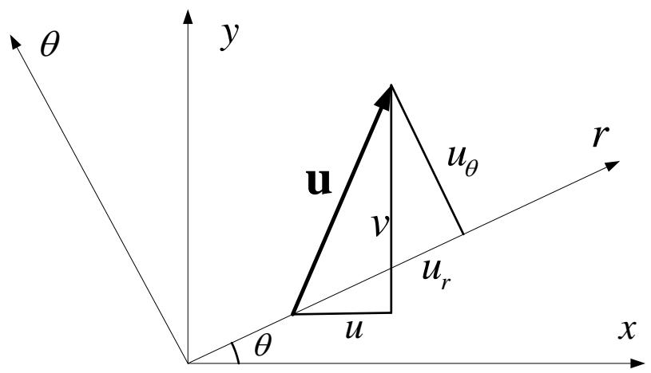

text_image

θ
y
u
v
uθ
uᵣ
r
θ
u
x

表达为矩阵形式，即

$$
\left\{ \begin{array}{c} u \\ v \\ w \end{array} \right\} = \left[ \begin{array}{c c c} \cos \theta & - \sin \theta & 0 \\ \sin \theta & \cos \theta & 0 \\ 0 & 0 & 1 \end{array} \right] \left\{ \begin{array}{c} u _ {r} \\ u _ {\theta} \\ u _ {z} \end{array} \right\}
$$

## 3.5 附注

## 柱坐标系中的基本方程

## 外力变换

同理可得外力间的变换关系

$$
\left\{ \begin{array}{c} F _ {x} \\ F _ {y} \\ F _ {z} \end{array} \right\} = \left[ \begin{array}{c c c} \cos \theta & - \sin \theta & 0 \\ \sin \theta & \cos \theta & 0 \\ 0 & 0 & 1 \end{array} \right] \left\{ \begin{array}{c} F _ {r} \\ F _ {\theta} \\ F _ {z} \end{array} \right\}
$$

以上各式中出现的矩阵都是 $L^{T}$ ，即

$$
\mathbf {L} = \left[ \begin{array}{c c c} l _ {1 1} & l _ {1 2} & l _ {1 3} \\ l _ {2 1} & l _ {2 2} & l _ {2 3} \\ l _ {3 1} & l _ {3 2} & l _ {3 3} \end{array} \right] = \left[ \begin{array}{c c c} \cos \theta & \sin \theta & 0 \\ - \sin \theta & \cos \theta & 0 \\ 0 & 0 & 1 \end{array} \right]
$$

## 3.5 附注

## 柱坐标系中的基本方程

## 平衡方程

利用前面的应力张量旋转变换公式，得

$$
\left[ \begin{array}{c c c} \sigma_ {x} & \tau_ {x y} & \tau_ {z x} \\ \tau_ {x y} & \sigma_ {y} & \tau_ {y z} \\ \tau_ {z x} & \tau_ {y z} & \sigma_ {z} \end{array} \right] = \left[ \begin{array}{c c c} \cos \theta & - \sin \theta & 0 \\ \sin \theta & \cos \theta & 0 \\ 0 & 0 & 1 \end{array} \right] \left[ \begin{array}{c c c} \sigma_ {r} & \tau_ {r \theta} & \tau_ {z r} \\ \tau_ {r \theta} & \sigma_ {\theta} & \tau_ {\theta z} \\ \tau_ {z r} & \tau_ {\theta z} & \sigma_ {z} \end{array} \right] \left[ \begin{array}{c c c} \cos \theta & \sin \theta & 0 \\ - \sin \theta & \cos \theta & 0 \\ 0 & 0 & 1 \end{array} \right]
$$

展开、整理，得

$$
\left. \begin{array}{r} \sigma_ {x} = \sigma_ {r} \cos^ {2} \theta + \sigma_ {\theta} \sin^ {2} \theta - 2 \tau_ {r \theta} \sin \theta \cos \theta \\ \sigma_ {y} = \sigma_ {r} \sin^ {2} \theta + \sigma_ {\theta} \cos^ {2} \theta + 2 \tau_ {r \theta} \sin \theta \cos \theta \\ \sigma_ {z} = \sigma_ {z} \\ \tau_ {y z} = \tau_ {z r} \sin \theta + \tau_ {\theta z} \cos \theta \\ \tau_ {z x} = \tau_ {z r} \cos \theta - \tau_ {\theta z} \sin \theta \\ \tau_ {x y} = (\sigma_ {r} - \sigma_ {\theta}) \sin \theta \cos \theta + \tau_ {r \theta} (\cos^ {2} \theta - \sin^ {2} \theta) \end{array} \right\}
$$

## 3.5 附注

## 柱坐标系中的基本方程

## 平衡方程

将前面得到的微分算子变换、外力变换和应力变换代入平衡方程第一式

$$
\frac {\partial \sigma_ {x}}{\partial x} + \frac {\partial \tau_ {x y}}{\partial y} + \frac {\partial \tau_ {z x}}{\partial z} + F _ {x} = 0
$$

进行稍显冗长但并无困难的运算和整理（这个过程中并不存在略去高阶微量的步骤），可得

$$
\begin{array}{l} \left(\frac {\partial \sigma_ {r}}{\partial r} + \frac {1}{r} \frac {\partial \tau_ {r \theta}}{\partial \theta} + \frac {\partial \tau_ {z r}}{\partial z} + \frac {\sigma_ {r} - \sigma_ {\theta}}{r} + F _ {r}\right) \cos \theta \\ - \left(\frac {\partial \tau_ {r \theta}}{\partial r} + \frac {1}{r} \frac {\partial \sigma_ {r}}{\partial \theta} + \frac {\partial \tau_ {z r}}{\partial z} + \frac {2 \tau_ {r \theta}}{r} + F _ {\theta}\right) \sin \theta = 0 \\ \end{array}
$$

## 3.5 附注

## 柱坐标系中的基本方程

## 平衡方程

上式必须对任意的 $\theta$ 都成立，因此

$$
\frac {\partial \sigma_ {r}}{\partial r} + \frac {1}{r} \frac {\partial \tau_ {r \theta}}{\partial \theta} + \frac {\partial \tau_ {z r}}{\partial z} + \frac {\sigma_ {r} - \sigma_ {\theta}}{r} + F _ {r} = 0
$$

$$
\frac {\partial \tau_ {r \theta}}{\partial r} + \frac {1}{r} \frac {\partial \sigma_ {r}}{\partial \theta} + \frac {\partial \tau_ {z r}}{\partial z} + \frac {2 \tau_ {r \theta}}{r} + F _ {\theta} = 0
$$

将微分算子变换、外力变换和应力变换代入平衡方程第二式，可以得到相同的结论

$$
\frac {\partial \tau_ {x y}}{\partial x} + \frac {\partial \sigma_ {y}}{\partial y} + \frac {\partial \tau_ {y z}}{\partial z} + F _ {y} = 0
$$

## 3.5 附注

## 柱坐标系中的基本方程

## 平衡方程

将微分算子变换、外力变换和应力变换代入平衡方程第三式，

$$
\frac {\partial \tau_ {z x}}{\partial x} + \frac {\partial \tau_ {y z}}{\partial y} + \frac {\partial \sigma_ {z}}{\partial z} + F _ {z} = 0
$$

可以得到

$$
\frac {\partial \tau_ {z r}}{\partial r} + \frac {1}{r} \frac {\partial \tau_ {z \theta}}{\partial \theta} + \frac {\partial \sigma_ {z}}{\partial z} + \frac {\tau_ {z r}}{r} + F _ {z} = 0
$$

经过以上推导就得到了柱坐标系下的平衡方程。

## 3.5 附注

## 柱坐标系中的基本方程

## 几何方程

与应力相似，利用前面的应变张量旋转变换公式，得

$$
\left. \begin{array}{r} \varepsilon_ {x} = \varepsilon_ {r} \cos^ {2} \theta + \varepsilon_ {\theta} \sin^ {2} \theta - 2 \gamma_ {r \theta} \sin \theta \cos \theta \\ \varepsilon_ {y} = \varepsilon_ {r} \sin^ {2} \theta + \varepsilon_ {\theta} \cos^ {2} \theta + 2 \gamma_ {r \theta} \sin \theta \cos \theta \\ \varepsilon_ {z} = \varepsilon_ {z} \\ \gamma_ {y z} = \gamma_ {z r} \sin \theta + \gamma_ {\theta z} \cos \theta \\ \gamma_ {z x} = \gamma_ {z r} \cos \theta - \gamma_ {\theta z} \sin \theta \\ \tau_ {x y} = (\varepsilon_ {r} - \varepsilon_ {\theta}) \sin \theta \cos \theta + \gamma_ {r \theta} (\cos^ {2} \theta - \sin^ {2} \theta) \\ \end{array} \right\}
$$

## 3.5 附注

## 柱坐标系中的基本方程

## 几何方程

利用位移变换和算子变换，则有

$$
\varepsilon_ {x} = \frac {\partial u}{\partial x} = \frac {\partial}{\partial x} (u _ {r} \cos \theta - u _ {\theta} \sin \theta) = (\cos \theta \frac {\partial}{\partial r} - \frac {\sin \theta}{r} \frac {\partial}{\partial \theta}) (u _ {r} \cos \theta - u _ {\theta} \sin \theta)
$$

$$
= \cos^ {2} \theta \frac {\partial u _ {r}}{\partial r} + \sin^ {2} \theta \left(\frac {1}{r} \frac {\partial u _ {\theta}}{\partial \theta} + \frac {u _ {r}}{r}\right) - \cos \theta \sin \theta \left(\frac {1}{r} \frac {\partial u _ {r}}{\partial \theta} + \frac {\partial u _ {\theta}}{\partial \theta} - \frac {u _ {\theta}}{r}\right)
$$

对比前面的应变变换，可得

$$
\varepsilon_ {r} = \frac {\partial u _ {r}}{\partial r}
$$

$$
\varepsilon_ {\theta} = \frac {1}{r} \frac {\partial u _ {\theta}}{\partial \theta} + \frac {u _ {r}}{r}
$$

$$
\gamma_ {r \theta} = \frac {1}{r} \frac {\partial u _ {r}}{\partial \theta} + \frac {\partial u _ {\theta}}{\partial \theta} - \frac {u _ {\theta}}{r}
$$

## 3.5 附注

## 柱坐标系中的基本方程

## 几何方程

对其它应变分量进行类似的推导，可以得到柱坐标下的全部几何方程。大家可以自己动手……

## 思考：如何采用坐标变换法推导球坐标系下的基本方程

提示：可以把求坐标系看作直角坐标系经过两次柱坐标系变换得到

## 3.6 结语

## 结语

如前所述，建立和求解弹性力学边值问题构成了弹性理论的基本内容，弹性力学边值问题把一个具体的物理问题转变为一个数学问题。

弹性力学边值问题是百余年来众多工程师、力学家、物理学家、数学家等共同努力的结果。就目前的情况而言，弹性力学是数学物理领域中最成功的典范之一。弹性力学的基本架构已成为诸多力学理论的基本模式。

解弹性力学边值问题的任务是：求15个未知量使满足15个方程和3个边界条件。

## 3.6 结语

## 结语

工程实践中提出了大量的弹性力学边值问题，对于这些问题已经发展了许多解法。大致可以分为以下三类

解析方法 主要利用偏微分方程、复变函数、积分方程、群论、微分几何、泛函分析等数学工具来求解边值问题。  
实验方法 有电测法、光弹性法、比拟法、云纹法、云纹干涉法、散斑法、红外显象法，以及全息照相法等。  
数值方法 有直接法、差分法、有限元法、边界元法、无网格法等。

有限元法是这些方法中最为重要和切实有效的方法，已经广泛应用于科学研究和工程计算之中。  
为透彻的介绍有限元法，下面将详细介绍经典变分法的基本概念和理论。

## 谢谢！

## 课件下载

邮箱：wjh\_fem2011@126.com

密码: fem2011