## Chapter 3

# Finite Element Method of Elastic Mechanics Problems

## Contents

1 Summary  
2 Two-dimensional Poisson equations  
3 General format of finite element method  
4 Plane problems of elastic mechanics  
5 Further discussions

## I. Summary

# Summary

The variational principle is generally applicable in elastic mechanics, so we'll discuss the finite element analysis in terms of this method.

From the direct solution of variation problems we know that if the trial function is close enough to the real one, the result will be rather accurate.

It can be called as the classical variational method, which actually helps solving some engineering problems.

However as discussed before, selecting trial functions will be very difficult once the boundary conditions are relatively complex.

Furthermore, the trial functions vary with different problems, so it's not convenient for computer coding.

The finite element method develops to overcome these disadvantages.

The finite element method first divides the continuum into a finite number of elements. In the mathematic term, it divides the solving domain into subdomains and adopt an unified displacement function for every subdomain.

## Summary

This type of displacement function is equivalent to the trial functions in the classical variation method but it's set for the elements, which may not satisfy the deformation compatibility condition between one another. So this make it much easier to establish a displacement function.

Take the triangle plane element for example. It can satisfy the deformation compatibility condition within an element, and displacement boundary condition on the boundary but it doesn't satisfy the deformation compatibility at the junctions between each other, because the deformation is continuous but the partial derivatives are not continue.

Thus the problem will be associated with each element rather than the global continuum.

It can be proved that the results we get through the finite element method will converge to the real displacement of the continuous body once the displacement function satisfies a certain condition.

We'll first discuss the question from a mathematical term.

## II. Two-dimensional Poisson equations

## 2.1 The weak form of equivalent integral

We've solved the two-dimensional Poisson equation by the classical variation method before. (the Galerkin method)

Now let's look at the general expression of Poisson equation in a plane bounded domain $\Omega$ .

$$
\left\{ \begin{array} {l}- \Delta u = f \\ u \big | _ {\partial \Omega} = u _ {0} (x, y) \\ \end{array} \right.
$$

Δ is Laplace operator

$$
\Delta = \frac {\partial^ {2}}{\partial x ^ {2}} + \frac {\partial^ {2}}{\partial y ^ {2}}
$$

This is obviously the most simple case of the first type of the “boundary value problem”, the elliptic equation, which is quite common in physics or mechanics. For example the membrane equilibrium problem under the out-of-the-plane external force and the steady temperature field problem.

The Poisson equation will become the Laplace equation without the action of external force.

## 2.1 The weak form of equivalent integral

We can directly obtain its weak form of equivalent integral by the Galerkin method.

As mentioned before, there's usually a quite high demand of continuity of the trial function in this situation and we can transform it into the corresponding weak form of equivalent integral after integration by parts

Suppose

$$
\bar {\Omega} = \Omega \cup \partial \Omega
$$

$$
u (x, y) \in C ^ {2} (\Omega) \bigcup C ^ {1} (\bar {\Omega})
$$

Closure includes the domain and its boundary which we call total here

That is $u(x,y)$ is $2^{nd}$ order continuously differentiable in domain $\Omega$ and is first order continuously differentiable in the entire domain.

Then for an arbitrary $\varphi (x,y)\in C^{1}(\overline{\Omega})$

The blue part is Green Formula

$$
\begin{array}{l} \dot {\Omega} (- \Delta u - f) \varphi d x d y = \iint_ {\Omega} (- \Delta u) \varphi d x d y + \iint_ {\Omega} (- f) \varphi d x d y \\ \iint_ {\Omega} \left[ \frac {\partial}{\partial x} (u _ {x} \varphi) + \frac {\partial}{\partial y} (u _ {y} \varphi) \right] d x d y + \iint_ {\Omega} \left[ u _ {x} \varphi_ {x} + u _ {y} \varphi_ {y} \right] d x d y - \iint_ {\Omega} f \varphi d x d y \\ = - \oint_ {\partial \Omega} \frac {\partial u}{\partial n} \varphi d s + \iint_ {\Omega} \left[ u _ {x} \varphi_ {x} + u _ {y} \varphi_ {y} \right] d x d y - \iint_ {\Omega} f \varphi d x d y = 0 \\ \end{array}
$$

## 2.2 Element Analysis

We'll discuss the two-dimensional finite element method in detail and compare it with the one-dimensional ordinary differential equation boundary problem.

## Element division

Divide the domain $\Omega$ into a series of triangle, rectangular, quadrilateral and curved polygon elements. The triangle elements are the most simple and flexible. It can approximate the boundary well, so triangle element division is widely adopted.

We usually call the points of triangle the nodes. And then number them. Denote the nodes as $P_{i}(x_{i},y_{i})(i=1,\ldots,NP)$ , the elements as $e_{k}(k=1,\ldots,NE)$ .

Pay attention to the following items when numbering the nodes.

1. The node must be the vertex of adjacent elements but not the inner point on the boundary.

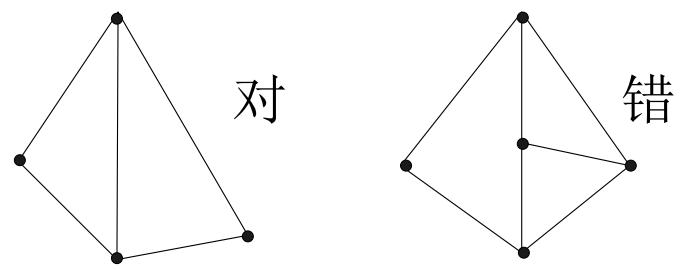

## 2.2 Element Analysis

## Element division

2. Avoid large obtuse angle.

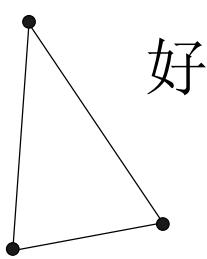

text_image

好

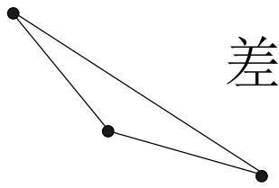

text_image

差

3. The meshes should be fine where the gradient of $u(x,y)$ varies intensely; and sparse where the gradient varies slightly.  
4. The numbering of the elements can be arbitrary but the arrangement can largely influences the band width of the global stiffness matrix. The principle is that keeping the difference of the neibourghing nodes minimal.  
Example: For the triangular division shown as follows

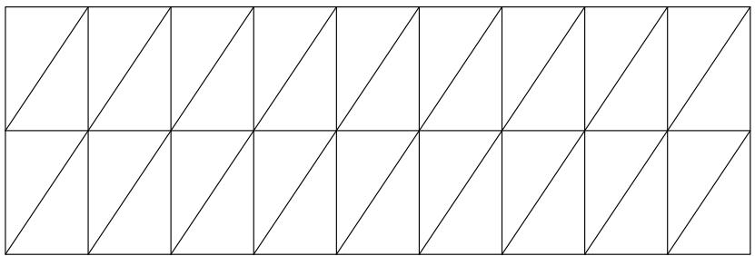

natural_image

Geometric pattern of intersecting diagonal lines forming a grid (no text or symbols)

How would you number them to have small band width?

## 2.2 Element Analysis

## Interpolation polynomial

We still adopt the linear interpolation whose general expression is as follows in the two-dimensional situation.

$$
u = a x + b y + c
$$

It has 3 undetermined coefficients.

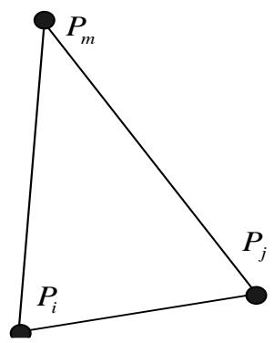

text_image

P_m
P_i
P_j

The value of $\mathbf{u}$ at 3 points should be used to determine the form of the interpolation polynomial in every element. And usually we'll take the 3 vertexes of the element. Let the value of u at the node $P_i$ be $u_i$ , which means $u(x_i, y_i) = u_i$ ( $i=1,\ldots\ldots,NP$ )。

The three vertexes of an arbitrary element e are $P_{i}, P_{j}, P_{m}$ . Let $e = \Delta P_{i}P_{j}P_{m}$ , which are in an anticlockwise order.

If the value of interpolation function respectively equals $u_{i}$ , $u_{j}$ , $u_{m}$ at three vertexes, then a, b, c should satisfy

$$
\left\{ \begin{array}{l l} a x _ {i} + b y _ {i} + c = u _ {i} \\ a x _ {j} + b y _ {j} + c = u _ {j} \\ a x _ {m} + b y _ {m} + c = u _ {m} \end{array} \right.
$$

## 2.2 Element Analysis

## Interpolation polynomial

(the Cramer law)

$$
a = \frac {1}{2 \Delta_ {e}} \left[ \left| \begin{array}{c c} y _ {j} & 1 \\ y _ {m} & 1 \end{array} \right| u _ {i} + \left| \begin{array}{c c} y _ {m} & 1 \\ y _ {i} & 1 \end{array} \right| u _ {j} + \left| \begin{array}{c c} y _ {i} & 1 \\ y _ {j} & 1 \end{array} \right| u _ {m} \right]
$$

$$
b = \frac {1}{2 \Delta_ {e}} \left[ - \left| \begin{array}{c c} x _ {j} & 1 \\ x _ {m} & 1 \end{array} \right| u _ {i} - \left| \begin{array}{c c} x _ {m} & 1 \\ x _ {i} & 1 \end{array} \right| u _ {j} - \left| \begin{array}{c c} x _ {i} & 1 \\ x _ {j} & 1 \end{array} \right| u _ {m} \right]
$$

$$
c = \frac {1}{2 \Delta_ {e}} \left[ \left| \begin{array}{l l} x _ {j} & y _ {j} \\ x _ {m} & y _ {m} \end{array} \right| u _ {i} + \left| \begin{array}{l l} x _ {m} & y _ {m} \\ x _ {i} & y _ {i} \end{array} \right| u _ {j} + \left| \begin{array}{l l} x _ {i} & y _ {i} \\ x _ {j} & y _ {j} \end{array} \right| u _ {m} \right]
$$

where $2\Delta_{e} = \left|\begin{array}{ccc}x_{i} & y_{i} & 1\\ x_{j} & y_{j} & 1\\ x_{m} & y_{m} & 1 \end{array}\right|$

## 2.2 Element Analysis

## Interpolation polynomial

$P_{i}, P_{j}, P_{m}$ are anticlockwise, so $\Delta_{e}$ is positive and is the area of the triangle element $e = \Delta P_{i} P_{j} P_{m}$ .

Substitute it into the general form of linear function and we can get the interpolation function of element e.

$$
u = N _ {i} (x, y) u _ {i} + N _ {j} (x, y) u _ {j} + N _ {m} (x, y) u _ {m}
$$

Where

$$
N _ {i} = \frac {1}{2 \Delta_ {e}} \left[ \left| \begin{array}{c c} y _ {j} & 1 \\ y _ {m} & 1 \end{array} \right| x + - \left| \begin{array}{c c} x _ {j} & 1 \\ x _ {m} & 1 \end{array} \right| y + \left| \begin{array}{c c} x _ {j} & y _ {j} \\ x _ {m} & y _ {m} \end{array} \right| \right]
$$

$$
\equiv \frac {1}{2 \Delta_ {e}} \left[ a _ {i} x + b _ {i} y + c _ {i} \right]
$$

The expressions of $N_{j}$ , $N_{m}$ and the constants $a_{j}$ , $b_{j}$ , $c_{j}$ , $a_{m}$ , $b_{m}$ , $c_{m}$ can be obtained by rotating the subscripts of the expression above.

## 2.2 Element Analysis

## Interpolation polynomial

Suppose

$$
\left\{\delta \right\} _ {e} = \left[ \begin{array}{c c c} u _ {i} & u _ {j} & u _ {m} \end{array} \right] ^ {T}, [ N ] = \left[ \begin{array}{c c c} N _ {i} & N _ {j} & N _ {m} \end{array} \right]
$$

Similar to the one-dimensional situation we have $u=\left[N\right]\left\{\delta\right\}_{e}$ in the element e.

The gradient vector of u can be expressed as

$$
\nabla \boldsymbol {u} = \left[ \begin{array}{l} \frac {\partial \boldsymbol {u}}{\partial x} \\ \frac {\partial \boldsymbol {u}}{\partial y} \end{array} \right] = \left[ \begin{array}{l l l} \frac {\partial N _ {i}}{\partial x} & \frac {\partial N _ {j}}{\partial x} & \frac {\partial N _ {m}}{\partial x} \\ \frac {\partial N _ {i}}{\partial y} & \frac {\partial N _ {j}}{\partial y} & \frac {\partial N _ {m}}{\partial y} \end{array} \right] \left\{\boldsymbol {\delta} \right\} _ {e}
$$

$$
= \frac {1}{2 \Delta_ {e}} \left[ \begin{array}{c c c} a _ {i} & a _ {j} & a _ {m} \\ b _ {i} & b _ {j} & b _ {m} \end{array} \right] \{\delta \} _ {e} \equiv [ B ] \{\delta \} _ {e}
$$

B is a $2 \times 3$ constant matrix

## 2.2 Element Analysis

## Interpolation polynomial

$N_{s}(x_{t},y_{t})$ (s,t=i,j,m) is the linear interpolation basis function of element e.

The properties are as follows

1. $N_{s}(x_{t},y_{t})$ (s,t=i,j,m) is first order polynomial in element e  
2. $\mathrm{N}_{s}(x_{t},y_{t})=\delta_{st}(s,t=i,j,m)$

3. In geometry $u = \mathrm{Ni}(x, y)$ represents a plane passing through $(x_i, y_i, 1), (x_j, y_j, 0), (x_m, y_m, 0)$ in the space x, y, u.

Conclusion is the same for the basis function $u = \mathrm{N}_{j}(x, y)$ and $u = \mathrm{N}_{m}(x, y)$ .

4. Due to the uniqueness of linear interpolation, the interpolation of a linear function is the function itself. So we have the following identical equations

$$
\begin{array}{l} 1 = N _ {i} + N _ {j} + N _ {m} \\ x = x _ {i} N _ {i} + x _ {j} N _ {j} + x _ {m} N _ {m} \\ y = y _ {i} N _ {i} + y _ {j} N _ {j} + y _ {m} N _ {m} \\ \end{array}
$$

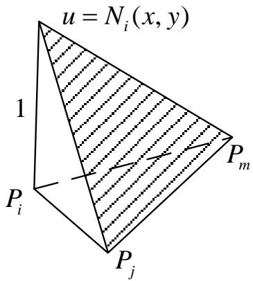

text_image

u = N_i(x, y)
1
P_i
P_j
P_m

## 2.2 Element Analysis

## Interpolation polynomial

5. Consider the linear transformation

$$
\lambda_ {1} = N _ {i} (x, y), \lambda_ {2} = N _ {j} (x, y)
$$

Because

$$
N _ {m} = 1 - \lambda_ {1} - \lambda_ {2}
$$

The reverse transformation is

$$
x = (x _ {i} - x _ {m}) \lambda_ {1} + (x _ {i} - x _ {m}) \lambda_ {2} + x _ {m}
$$

$$
y = (y _ {i} - y _ {m}) \lambda_ {1} + (y _ {i} - y _ {m}) \lambda_ {2} + y _ {m}
$$

The Jacobi determinant is

$$
\left| \frac {\partial (x , y)}{\partial (\lambda_ {1} , \lambda_ {2})} \right| = \left| \begin{array}{c c} x _ {i} - x _ {m} & x _ {j} - x _ {m} \\ y _ {i} - y _ {m} & y _ {j} - y _ {m} \end{array} \right| = 2 \Delta
$$

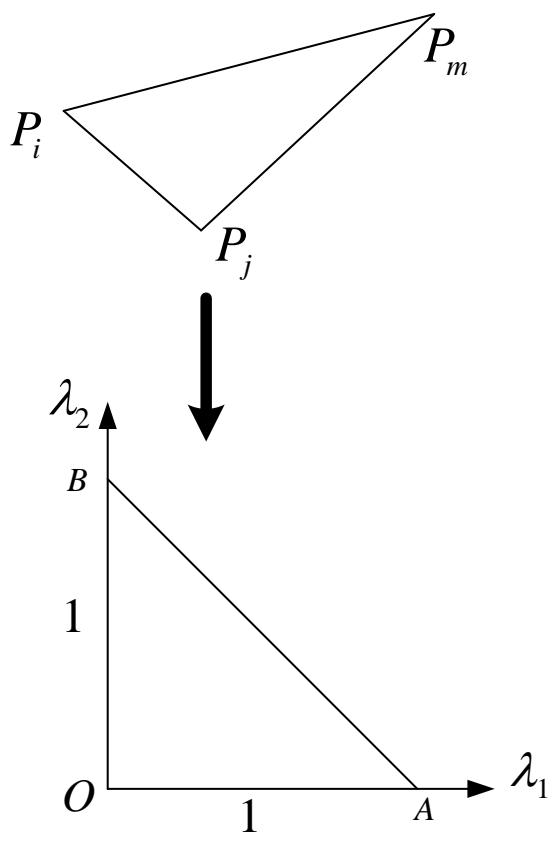

text_image

P_i
P_j
P_m
λ_2
B
1
O
1
A
λ_1

The element e becomes a standard triangle OAB on the plane $\lambda_{1}-\lambda_{2}$ after the transformation. Image of the point $P_{i}$ is A(1,0), image of the point $P_{j}$ is B (0,1) and image of the point $P_{m}$ is O(0,0).

We'll further discuss this property in the following chapter of isoparametric element.

## 2.2 Element Analysis

## Interpolation polynomial

6. On every side of the element $\mathrm{e}\;\mathrm{N}_{s}(x_{t},y_{t})\;(s,t=i,j,m)$ is the first order function of the parameter t of the arc length.

Take the side $P_{i}P_{j}$ for example

Let $P_{i}(t = 0), P_{j}(t = l = \left|\overline{P_{i}P_{j}}\right|)$

Then $N_{i}(x,y)|_{\overline{P_{i}P_{j}}} = 1 - \frac{t}{l}$

$$
N _ {j} (x, y) \mid_ {\overline {{P _ {i} P _ {j}}}} = \frac {t}{l}
$$

$$
N _ {m} (x, y) | _ {\overline {{P _ {i} P _ {j}}}} = 0
$$

The third equation holds because because

$$
N _ {i} + N _ {j} + N _ {m} \equiv 1
$$

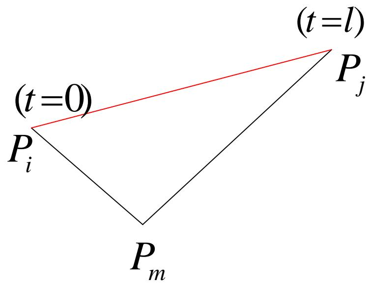

text_image

(t=0)
P_i
P_m
P_j
(t=l)

## 2.2 Element Analysis

## Element stiffness matrix and element load vector

Rewrite the equivalent integral weak form of the boundary problems of Poisson equations into the following equation according to the elements divided.

$$
\sum_ {n = 1} ^ {N E} \iint_ {e _ {n}} (u _ {x} \varphi_ {x} + u _ {y} \varphi_ {y}) d x d y = \sum_ {n = 1} ^ {N E} \iint_ {e _ {n}} f \varphi d x d y
$$

Now let's use the function value at the nodes to replace every term of the equation above. Let the element $e = \Delta P_i P_j P_m$ . The function value of $u(x,y)$ , $\varphi(x,y)$ at the node $P_s(s = i,j,m)$ is respectively $u_s, u_s^*$ .

According to $\nabla u = [B]\left\{\delta\right\}_{e}$ we have:

$$
\iint_ {e} \left(u _ {x} \varphi_ {x} + u _ {y} \varphi_ {y}\right) d x d y = \iint_ {e} \left\{\nabla \varphi \right\} ^ {T} \left\{\nabla u \right\} d x d y
$$

$$
= \iint_ {e} \left(\left[ B \right] \left\{\delta^ {*} \right\} _ {e}\right) ^ {T} \left(\left[ B \right] \left\{\delta \right\} _ {e}\right) d x d y
$$

$$
= \left\{\delta^ {*} \right\} _ {e} ^ {T} \iint_ {e} (\left[ B \right] ^ {T} [ B ]) d x d y \left\{\delta \right\} _ {e} = \left\{\delta^ {*} \right\} _ {e} ^ {T} [ k ] _ {e} \left\{\delta \right\} _ {e}
$$

## 2.2 Element Analysis

## Element stiffness matrix and element load vector

$\left[k\right]_e$ is a $3\times 3$ element stiffness matrix

$$
\left[ k \right] _ {e} = \iint_ {e} [ B ] ^ {T} [ B ] d x d y = \Delta_ {e} [ B ] ^ {T} [ B ]
$$

$$
= \left[ \begin{array}{c c c} k _ {i i} ^ {e} & k _ {i j} ^ {e} & k _ {i m} ^ {e} \\ k _ {j i} ^ {e} & k _ {j j} ^ {e} & k _ {j m} ^ {e} \\ k _ {m i} ^ {e} & k _ {m j} ^ {e} & k _ {m m} ^ {e} \end{array} \right]
$$

The stiffness coefficients of the element is

$$
k _ {s t} ^ {e} = \Delta_ {e} \left[ \frac {\partial N _ {s}}{\partial x} \frac {\partial N _ {t}}{\partial x} + \frac {\partial N _ {s}}{\partial y} \frac {\partial N _ {t}}{\partial y} \right]
$$

$$
= \frac {1}{4 \Delta_ {e}} \left(a _ {s} a _ {t} + b _ {s} b _ {t}\right)
$$

## 2.2 Element Analysis

## Element stiffness matrix and element load vector

For the right part of the weak form of the equivalent integral

$$
\sum_ {n = 1} ^ {N E} \iint_ {e _ {n}} (u _ {x} \varphi_ {x} + u _ {y} \varphi_ {y}) d x d y = \sum_ {n = 1} ^ {N E} \iint_ {e _ {n}} f \varphi d x d y
$$

We have $\iint_{e} f \varphi dxdy = \iint_{e} (\varphi)^T f dxdy$

$$
= \iint_ {e} \left([ N ] \{\delta^ {*} \} _ {e}\right) ^ {T} f d x d y = \{\delta^ {*} \} _ {e} ^ {T} \{F \} _ {e}
$$

Where $\{F\}_{e} = \iint_{e}[N]^{T}fdxdy = \begin{bmatrix} F_{i}^{e}\\ F_{j}^{e}\\ F_{m}^{e} \end{bmatrix}$

The equation above is element load vector.

## 2.3 Global integration

## Global stiffness matrix and the global load vector

Substitute the expressions of element stiffness matrix and element load vector into the integral form of the element.

$$
\sum_ {n = 1} ^ {N E} \iint_ {e _ {n}} \left(u _ {x} \varphi_ {x} + u _ {y} \varphi_ {y}\right) d x d y = \sum_ {n = 1} ^ {N E} \iint_ {e _ {n}} f \varphi d x d y
$$

We should expand $\{\delta\}_{e},\{F\}_{e},[k]_{e}$ to a NP-dimensional vector and a NP×NP square matrix for easier superposition.

The method is similar to the one-dimensional situation and the difference is that the global number may not be ordinal because the order of three vertexes $P_{i}$ , $P_{j}$ , $P_{m}$ must be anticlockwise in the element e. For example when j<i<m

The imaginary points represent element 0

$$
\{F \} _ {e} = \left[ \begin{array}{c} \vdots \\ F _ {j} ^ {e} \\ \vdots \\ F _ {i} ^ {e} \\ \vdots \\ F _ {m} ^ {e} \\ \vdots \end{array} \right] \quad \{k \} _ {e} = \left[ \begin{array}{c c c c c c} \vdots & \vdots & \vdots & \vdots & \vdots \\ \dots & k _ {j j} ^ {e} & \dots & k _ {j i} ^ {e} & \dots & k _ {j m} ^ {e} & \dots \\ & \vdots & & \vdots & & \vdots \\ \dots & k _ {i j} ^ {e} & \dots & k _ {i i} ^ {e} & \dots & k _ {i m} ^ {e} & \dots \\ & \vdots & & \vdots & & \vdots \\ \dots & k _ {m j} ^ {e} & \dots & k _ {m i} ^ {e} & \dots & k _ {m m} ^ {e} & \dots \\ & \vdots & & \vdots & & \vdots \end{array} \right]
$$

## 2.3 Global integration

## Global stiffness matrix and the global load vector

We can then superpose them after expanding :

$$
\sum_ {n = 1} ^ {N E} \{\delta^ {*} \} _ {e _ {n}} ^ {T} [ k ] _ {e _ {n}} \{\delta \} _ {e _ {n}} = \sum_ {n = 1} ^ {N E} \{\delta^ {*} \} _ {e _ {n}} ^ {T} \{F \} _ {e _ {n}}
$$

That is

$$
\{\delta^ {*} \} ^ {T} (\sum_ {n = 1} ^ {N E} [ k ] _ {e _ {n}}) \{\delta \} = \{\delta^ {*} \} ^ {T} (\sum_ {n = 1} ^ {N E} \{F \} _ {e _ {n}})
$$

Thus

$$
\{\delta^ {*} \} ^ {T} ([ K ] \{\delta \} - \{F \}) = 0
$$

Where

$$
[ K ] = \sum_ {n = 1} ^ {N E} [ k ] _ {e _ {n}} \qquad [ F ] = \sum_ {n = 1} ^ {N E} [ F ] _ {e _ {n}}
$$

## 2.3 Global integration

## Global stiffness matrix and the global load vector

We can then superpose them after expanding :

$$
\sum_ {n = 1} ^ {N E} \{\delta^ {*} \} _ {e _ {n}} ^ {T} [ k ] _ {e _ {n}} \{\delta \} _ {e _ {n}} = \sum_ {n = 1} ^ {N E} \{\delta^ {*} \} _ {e _ {n}} ^ {T} \{F \} _ {e _ {n}}
$$

That is

$$
\{\delta^ {*} \} ^ {T} (\sum_ {n = 1} ^ {N E} [ k ] _ {e _ {n}}) \{\delta \} = \{\delta^ {*} \} ^ {T} (\sum_ {n = 1} ^ {N E} \{F \} _ {e _ {n}})
$$

Thus

$$
\{\delta^ {*} \} ^ {T} ([ K ] \{\delta \} - \{F \}) = 0
$$

Where

$$
[ K ] = \sum_ {n = 1} ^ {N E} [ k ] _ {e _ {n}} \qquad [ F ] = \sum_ {n = 1} ^ {N E} [ F ] _ {e _ {n}}
$$

## 2.3 Global integration

## Global stiffness matrix and the global load vector

It can be proved that $[K]$ is both symmetric and nonnegative definite. Actually for the quadric form

$$
\{\delta \} ^ {T} [ K ] \{\delta \} = 0
$$

Because

$$
\begin{array}{l} \{\delta \} ^ {T} [ K ] \{\delta \} = \sum_ {n = 1} ^ {N E} \{\delta \} _ {e _ {n}} ^ {T} [ K ] _ {e _ {n}} \{\delta \} _ {e _ {n}} \\ = \sum_ {n = 1} ^ {N E} \iint_ {e _ {n}} \Bigl ([ B ] \{\delta \} _ {e _ {n}} \Bigr) ^ {T} \Bigl ([ B ] \{\delta \} _ {e _ {n}} \Bigr) d x d y \\ = \sum_ {n = 1} ^ {N E} \iint_ {e _ {n}} | \nabla u | ^ {2} d x d y \\ \end{array}
$$

The function u under the sign of integration is a linear interpolation function of which the values at three vertexes of the element $e_{n}$ are $u_{i}, u_{j}$ and $u_{m}$ respectively. The following discussion is similar to the one-dimensional problem.

There's no constraint condition for the function $\varphi(x,y)$ on the boundary, so $\{\delta^{*}\}$ is an arbitrary NP dimensional vector. Then we can obtain the linear equations.

$$
\{\delta^ {*} \} ^ {T} ([ K ] \{\delta \} - \{F \}) = 0 \quad \Rightarrow \quad [ K ] \{\delta \} = \{F \}
$$

## 2.3 Global integration

## Global stiffness matrix and the global load vector

One only needs to arrange the elements in element stiffness matrix and the element load vector in the order of their subscripts, then the global stiffness matrix and the global load vector can be obtained. We should then deal with the constraints:

From the final linear equations

$$
u _ {i} (i = 1, \dots , N E)
$$

From the interpolation polynomial we can obtain the expression of the approximate solution

$$
u (x, y) = [ N ] \{\delta \} _ {e _ {n}} = u _ {i} N _ {i} (x, y) + u _ {j} N _ {j} (x, y) + u _ {m} N _ {m} (x, y)
$$

Where $e_n = \Delta P_iP_jP_m$ $(n = 1,\dots ,NE)$

It should be noticed that the stiffness matrix is usually in band and sparse because the basis functions of the finite element usually consist of low order piecewise polynomial functions, which brings much convenience for discretization and numerical solution.

## III. Finite element form of elastic mechanics

## 3.1 Matrix expression of the basic equations

Now let's discuss the application of the finite element method in elastic mechanics. The finite element method originates from the method of matrix structural mechanics, but its real attractions is that it successfully resolves the continuum body (field) problems.

The conventional finite element method of elastic mechanics or finite element method for short is based on the principle of virtual displacement. The process is the same for all kinds of problems and one only needs to change the governing equations, coordinates, displacement and strain to the corresponding expressions.

Here we'll adopt the most simple linear tetrahedron element to learn the derivation of finite element method for elastic problems in 3D space. In the next chapter we'll discuss the derivation of elastic plane problems.

Actually the 3D problem is more generic than the plane problem and the derivation process is almost the same. As we have already learnt something about the finite element form of the plane problems before when discussing the two-dimensional Poisson equations, we'll start with the 3D problems in this chapter.

We mainly adopted the component form and tensor form when reviewing the elastic mechanics. And now we'll use the matrix form for the convenience of expression and derivation.

Let's first look at the according notations such like the matrix operator.

## 3.1 Matrix expressions of the governing equations

Strain, displacement and stress are usually expressed in the form of matrix in the elastic 3D problems.

$$
u = \left\{ \begin{array}{l} u \\ v \\ w \end{array} \right\} \qquad \qquad \varepsilon = \left\{ \begin{array}{l} \varepsilon_ {x} \\ \varepsilon_ {y} \\ \varepsilon_ {z} \\ \gamma_ {x y} \\ \gamma_ {y z} \\ \gamma_ {z x} \end{array} \right\} \qquad \qquad \sigma = \left\{ \begin{array}{l} \sigma_ {x} \\ \sigma_ {y} \\ \sigma_ {z} \\ \tau_ {x y} \\ \tau_ {y z} \\ \tau_ {z x} \end{array} \right\}
$$

u,v,w respectively represent the displacement in the direction of x,y,z.

$\varepsilon_{x}, \varepsilon_{y}, \varepsilon_{z}$ and $\sigma_{x}, \sigma_{y}, \sigma_{z}$ respectively represents the normal strains and stresses in the direction of x,y,z.

$\gamma_{xy}, \gamma_{yz}, \gamma_{zx}$ and $\tau_{xy}, \tau_{yz}, \tau_{zx}$ respectively represents the shear strains and stresses of the plane.

## 3.1 Matrix expression of the governing equations

## Now introduce the matrix operator

$$
[ \partial ] = \left\{ \begin{array}{c c c c c c} \frac {\partial}{\partial x} & 0 & 0 & \frac {\partial}{\partial y} & 0 & \frac {\partial}{\partial z} \\ 0 & \frac {\partial}{\partial y} & 0 & \frac {\partial}{\partial x} & \frac {\partial}{\partial z} & 0 \\ 0 & 0 & \frac {\partial}{\partial z} & 0 & \frac {\partial}{\partial y} & \frac {\partial}{\partial x} \end{array} \right\} ^ {T}
$$

Then the basic equations are as follows

Geometric equation

$$
\underset {(6 \times 1)} {\boldsymbol {\varepsilon}} = [ \underset {(6 \times 3)} {\partial} ] \underset {(3 \times 1)} {\mathbf {u}}
$$

Equilibrium equation

$$
[ \partial ] _ {(3 \times 6)} ^ {T} \underset {(6 \times 1)} {\boldsymbol {\sigma}} + \underset {(3 \times 1)} {\mathbf {f}} = 0
$$

Constitutive equation

$$
\underset {(6 \times 1)} {\boldsymbol {\sigma}} = \underset {(6 \times 6)} {\mathbf {D}} \underset {(6 \times 1)} {\boldsymbol {\varepsilon}}
$$

D=

$$
\left\{ \begin{array}{c c c c c c} \lambda + 2 G & \lambda & \lambda & 0 & 0 & 0 \\ \lambda & \lambda + 2 G & \lambda & 0 & 0 & 0 \\ \lambda & \lambda & \lambda + 2 G & 0 & 0 & 0 \\ 0 & 0 & 0 & G & 0 & 0 \\ 0 & 0 & 0 & 0 & G & 0 \\ 0 & 0 & 0 & 0 & 0 & G \end{array} \right\}
$$

The constitutive matrix D of the elastic body can be expressed as above using the Lame constants.

## 3.1 Matrix expression of the governing equations

Then the equilibrium equation can be expressed as

$$
\left[ \hat {\partial} \right] ^ {T} \underset {(3 \times 6)} {\boldsymbol {\sigma}} + \underset {(3 \times 1)} {\mathbf {f}} = \left[ \hat {\partial} \right] ^ {T} \underset {(3 \times 6)} {\mathbf {D}} \underset {(6 \times 6)} {\boldsymbol {\varepsilon}} + \underset {(3 \times 1)} {\mathbf {f}} = \left[ \hat {\partial} \right] ^ {T} \underset {(3 \times 6)} {\mathbf {D}} \underset {(6 \times 6)} {[ \hat {\partial} ]} \underset {(6 \times 3)} {\mathbf {u}} + \underset {(3 \times 1)} {\mathbf {f}} = 0
$$

The boundary conditions are

Boundary of displacement

$$
\left. \mathbf {u} \right| _ {S _ {\sigma}} = \overline {{\mathbf {u}}}
$$

Boundary of external force

$$
\left[ \begin{array}{c c c c c c} \cos (n, x) & 0 & 0 & \cos (n, y) & 0 & \cos (n, z) \\ 0 & \cos (n, y) & 0 & \cos (n, x) & \cos (n, z) & 0 \\ 0 & 0 & \cos (n, z) & 0 & \cos (n, y) & \cos (n, x) \end{array} \right] \pmb {\sigma} = \mathbf {T}
$$

The total functional of the minimum potential energy can be accordingly expressed in the form of matrix

$$
\Pi = \int_ {\Omega} \frac {1}{2} \pmb {\varepsilon} ^ {T} \mathbf {D} \pmb {\varepsilon} d V - \int_ {\Omega} \mathbf {u} ^ {T} \mathbf {f} d V - \int_ {S _ {\sigma}} \mathbf {u} ^ {T} \mathbf {T} d V
$$

Explanation: The equation of virtual work, the principle of virtual displacement and the principle of minimum potential energy can be all used to derive the discrete form of the finite element.

## 3.2 Discretization and the establishment of the element

The member system can be naturally discretized according to its structural form. We can suppose the solving domain to be a polyhedron which can be totally represented by the polyhedron elements.

The tetrahedron element is the most simple one among the three-dimensional elements. So we use it to discretize the solving domain. After meshing, we have the elements $e_{n}(n=1,\ldots,\mathrm{NE})$ and the nodes (vertexes of the

tetrahedron) are $P_{i}(x_{i},y_{i},z_{i})$ ( $i=1,\ldots,NP$ ).

Suppose that the displacement u at every node $P_{i}$ is

$$
\mathbf {u} _ {i} = \left\{ \begin{array}{l} u _ {i} \\ v _ {i} \\ w _ {i} \end{array} \right\}
$$

Denote an arbitrary element e whose four vertexes are $P_{i}$ , $P_{j}$ , $P_{m}$ , $P_{l}$ as $e = (P_{i}, P_{j}, P_{m}, P_{l})$ .

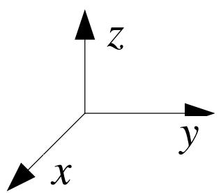

text_image

z
y
x

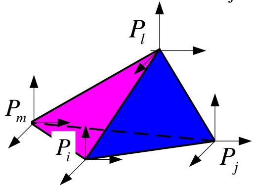

text_image

P_l
P_m
P_i
P_j

The order follows the right hand rule, which means when $P_{i}$ , $P_{j}$ and $P_{m}$ rotate in the direction of the right hand $P_{1}$ is in the direction of thumb.

## 3.2 Discretization and the construction of element

A linear interpolation can be determined in the element according to the value of displacement at four vertexes.

$$
\mathbf {u} = \boldsymbol {\alpha} _ {1} x + \boldsymbol {\alpha} _ {2} y + \boldsymbol {\alpha} _ {3} z + \boldsymbol {\alpha} _ {4}
$$

Where $\alpha_{i}(i=1,\ldots,4)$ is a $3\times1$ column matrix. It should satisfy

$$
\mathbf {u} _ {s} = \pmb {\alpha} _ {1} x _ {s} + \pmb {\alpha} _ {2} y _ {s} + \pmb {\alpha} _ {3} z _ {s} + \pmb {\alpha} _ {4} (s = i, j, m, l)
$$

Similarly to the plane triangle element one can use the Cramer rule to solve $\alpha_{i}$ . Substitute it into the equation above and we can get

Where $\mathbf{u} = N_{i}\mathbf{u}_{i} + N_{j}\mathbf{u}_{j} + N_{m}\mathbf{u}_{m} + N_{l}\mathbf{u}_{l} = \left[N\right]\left\{\delta\right\}_{e}$

$$
N _ {i} = \frac {1}{6 V _ {e}} \left| \begin{array}{c c c c} 1 & x & y & z \\ 1 & x _ {j} & y _ {j} & z _ {j} \\ 1 & x _ {m} & y _ {m} & z _ {m} \\ 1 & x _ {l} & y _ {l} & z _ {l} \end{array} \right|, \dots , N _ {l} = \frac {1}{6 V _ {e}} \left| \begin{array}{c c c c} 1 & x _ {i} & y _ {i} & z _ {i} \\ 1 & x _ {j} & y _ {j} & z _ {j} \\ 1 & x _ {m} & y _ {m} & z _ {m} \\ 1 & x & y & z \end{array} \right|, \text {now transformation} \left| \begin{array}{c c c c} 1 & x _ {i} & y _ {i} & z _ {i} \\ 1 & x _ {j} & y _ {j} & z _ {j} \\ 1 & x _ {m} & y _ {m} & z _ {m} \\ 1 & x _ {l} & y _ {l} & z _ {l} \end{array} \right|
$$

Ve is the volume of tetrahedron e.

$$
V _ {e} = \frac {1}{6} V _ {\text {六面体}} = \frac {1}{6} \left(\vec {P} _ {m i} \times \vec {P} _ {m j}\right) \cdot \vec {P} _ {m l} = \frac {1}{6} \left| \begin{array}{c c c} x _ {i} - x _ {m} & y _ {i} - y _ {m} & z _ {i} - z _ {m} \\ x _ {j} - x _ {m} & y _ {j} - x _ {m} & z _ {j} - x _ {m} ^ {P _ {m}} \\ x _ {l} - x _ {m} & y _ {l} - x _ {m} & z _ {l} - x _ {m} \end{array} \right|
$$

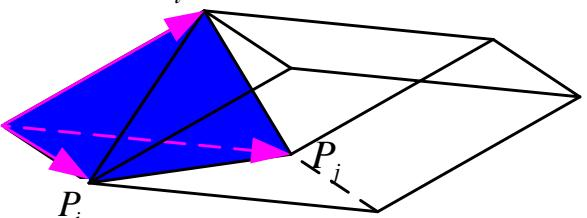

text_image

P_i
P_i

## 3.2 Discretization and the construction of the element

$\{\mathrm{a}\}_{e}$ is the displacement vector of the nodes.

$$
\left\{a \right\} _ {e} = \left\{u _ {i} \quad v _ {i} \quad w _ {i} \quad u _ {j} \quad v _ {j} \quad w _ {j} \quad u _ {m} \quad v _ {m} \quad w _ {m} \quad u _ {l} \quad v _ {l} \quad w _ {l} \right\} ^ {T}
$$

[N] is the matrix of the interpolation function.

$$
\begin{array}{l} [ N ] = \left[ \begin{array}{c c c c c c c c c c c c} N _ {i} & 0 & 0 & N _ {j} & 0 & 0 & N _ {m} & 0 & 0 & N _ {l} & 0 & 0 \\ 0 & N _ {i} & 0 & 0 & N _ {j} & 0 & 0 & N _ {m} & 0 & 0 & N _ {l} & 0 \\ 0 & 0 & N _ {i} & 0 & 0 & N _ {j} & 0 & 0 & N _ {m} & 0 & 0 & N _ {l} \end{array} \right] \\ = \left[ \begin{array}{c c c c} N _ {i} \mathbf {I} _ {3} & N _ {j} \mathbf {I} _ {3} & N _ {m} \mathbf {I} _ {3} & N _ {l} \mathbf {I} _ {3} \end{array} \right] \\ \end{array}
$$

where

$I_{3}$ is a $3^{rd}$ element matrix.

$$
N _ {s} = \frac {1}{6 V _ {e}} \left[ a _ {s} x + b _ {s} y + c _ {s} z + d _ {s} \right] (s = i, j, m, l)
$$

$a_{s}, b_{s}, c_{s}, d_{s}$ 为 are the coefficients related to the geometric position of the nodes.

## 3.2 Discretization and the construction of the element

For example for the node $i$ $a_{i} = -\left| \begin{array}{ccc}1 & y_{j} & z_{j}\\ 1 & y_{m} & z_{m}\\ 1 & y_{l} & z_{l} \end{array} \right|$ $b_{i} = \left| \begin{array}{ccc}1 & x_{j} & z_{j}\\ 1 & x_{m} & z_{m}\\ 1 & x_{l} & z_{l} \end{array} \right|$

$$
c _ {i} = - \left| \begin{array}{c c c} 1 & x _ {j} & y _ {j} \\ 1 & x _ {m} & y _ {m} \\ 1 & x _ {l} & y _ {l} \end{array} \right|, d _ {i} = - \left| \begin{array}{c c c} x _ {j} & y _ {j} & z _ {j} \\ x _ {j} & y _ {m} & z _ {m} \\ x _ {j} & y _ {l} & z _ {l} \end{array} \right|
$$

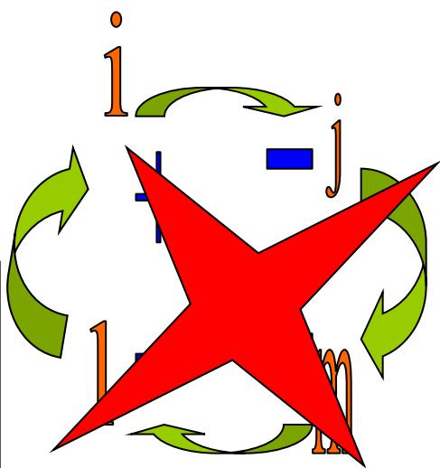

flowchart

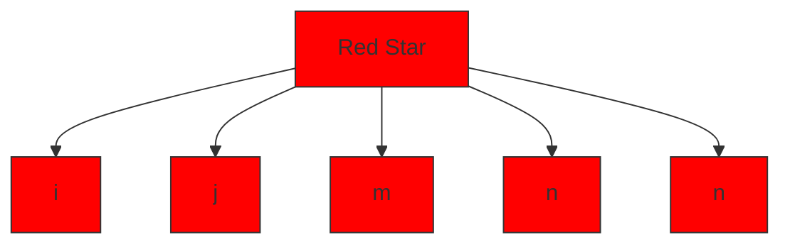

The rest $a_{s}, b_{s}, c_{s}, d_{s}$ (s=j, m, l) can be written in the similar way.

It should be noticed that the permutation of the three-dimensional problems are not totally the same as the plane problems because it cannot assure the right hand rule.

For example $j, m, l, I$ doesn't obey the rule.

So it should be corrected as: If the permutation starts with a even number (e.g. j equals 2) then it obeys the left hand rule.

$$
\boldsymbol {a} _ {j} = \left| \begin{array}{c c c} 1 & y _ {m} & z _ {m} \\ 1 & y _ {l} & z _ {l} \\ 1 & y _ {i} & z _ {i} \end{array} \right|, \quad \boldsymbol {a} _ {m} = - \left| \begin{array}{c c c} 1 & y _ {l} & z _ {l} \\ 1 & z _ {i} & z _ {i} \\ 1 & z _ {j} & z _ {j} \end{array} \right|, \quad \boldsymbol {a} _ {l} = \left| \begin{array}{c c c} 1 & y _ {i} & z _ {i} \\ 1 & y _ {j} & z _ {j} \\ 1 & y _ {j} & z _ {m} \end{array} \right|
$$

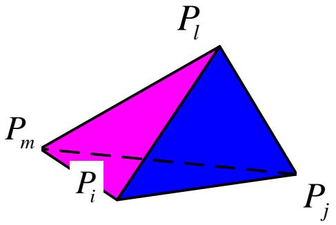

text_image

P_l
P_m
P_i
P_j

## 3.3 Solving process

Substitute the displacement of the element in the form of interpolation into the geometric equation and the physical equation

$$
\mathbf {u} = \left[ N \right] \left\{a \right\} _ {e}
$$

then the strain and the stress can be expressed as

$$
\underset {(6 \times 1)} {\boldsymbol {\varepsilon}} = \left[ \begin{array}{c} \partial \\ (6 \times 3) \end{array} \right] \underset {(3 \times 1)} {\mathbf {u}} = \left[ \begin{array}{c} \partial \\ (6 \times 3) (3 \times 1 2) \end{array} \right] \left[ \begin{array}{c} N \\ (1 2 \times 1) \end{array} \right] \left\{ \begin{array}{c} a \\ a \end{array} \right\} _ {e} = \underset {(6 \times 1 2)} {\mathbf {B}} \left\{ \begin{array}{c} a \\ a \end{array} \right\} _ {e}
$$

$$
\underset {(6 \times 1)} {\boldsymbol {\sigma}} = \underset {(6 \times 6)} {\mathbf {D}} \underset {(6 \times 1)} {\boldsymbol {\varepsilon}} = \underset {(6 \times 6)} {\mathbf {D}} \underset {(6 \times 1 2)} {\mathbf {B}} \left\{a \right\} _ {e} (1 2 \times 1)
$$

where

$$
\mathbf {B} = \left[ \begin{array}{c} \partial \end{array} \right] \left[ \begin{array}{c c c c} N _ {i} \mathbf {I} _ {3} & N _ {j} \mathbf {I} _ {3} & N _ {m} \mathbf {I} _ {3} & N _ {l} \mathbf {I} _ {3} \end{array} \right] = \left[ \begin{array}{c c c c} \mathbf {B} _ {i} & \mathbf {B} _ {j} & \mathbf {B} _ {m} & \mathbf {B} _ {l} \end{array} \right]
$$

After the calculation of partitioned matrix we have

$$
\mathbf {B} _ {s} = [ \partial ] N _ {s} \mathbf {I} _ {3} = \left\{ \begin{array}{c c c c c c} \frac {\partial N _ {s}}{\partial x} & 0 & 0 & \frac {\partial N _ {s}}{\partial y} & 0 & \frac {\partial N _ {s}}{\partial z} \\ 0 & \frac {\partial N _ {s}}{\partial y} & 0 & \frac {\partial N _ {s}}{\partial x} & \frac {\partial N _ {s}}{\partial z} & 0 \\ 0 & 0 & \frac {\partial N _ {s}}{\partial z} & 0 & \frac {\partial N _ {s}}{\partial y} & \frac {\partial N _ {s}}{\partial x} \end{array} \right\} ^ {T} = \frac {1}{6 V _ {e}} \left[ \begin{array}{c c c} a _ {s} & 0 & 0 \\ 0 & b _ {s} & 0 \\ 0 & 0 & c _ {s} \\ b _ {s} & a _ {s} & 0 \\ 0 & c _ {s} & b _ {s} \\ c _ {s} & 0 & a _ {s} \end{array} \right] (s = i, j, m, l)
$$

## 3.3 Solving process

The potential energy of a discretized model equals to the sum of potential energy of all the elements. We can then obtain the total potential energy of a discrete model that

$$
\begin{array}{l} \Pi = \sum_ {e} \Pi_ {p} ^ {e} = \sum_ {e} \left(\int_ {\Omega_ {e}} \frac {1}{2} \pmb {\varepsilon} ^ {T} \mathbf {D} \pmb {\varepsilon} d V - \int_ {\Omega_ {e}} \mathbf {u} ^ {T} \mathbf {f} d V - \int_ {S _ {\sigma} ^ {e}} \mathbf {u} ^ {T} \mathbf {T} d S\right) \\ = \sum_ {e} \left\{\int_ {\Omega_ {e}} \frac {1}{2} \Big (\mathbf {B} \left\{a \right\} _ {e} \Big) ^ {T} \mathbf {D} \Big (\mathbf {B} \left\{a \right\} _ {e} \Big) d V - \int_ {\Omega_ {e}} \Big (\mathbf {N} \left\{a \right\} _ {e} \Big) ^ {T} \mathbf {f} d V - \int_ {S _ {\sigma} ^ {e}} \Big (\mathbf {N} \left\{a \right\} _ {e} \Big) ^ {T} \mathbf {T} d S \right\} \\ = \sum_ {e} \left(\left\{a \right\} _ {e} ^ {T} \int_ {\Omega_ {e}} \frac {1}{2} \mathbf {B} ^ {T} \mathbf {D B} d V \left\{a \right\} _ {e}\right) - \sum_ {e} \left(\left\{a \right\} _ {e} ^ {T} \int_ {\Omega_ {e}} \mathbf {N} ^ {T} \mathbf {f} d V\right) - \sum_ {e} \left(\left\{a \right\} _ {e} ^ {T} \int_ {S _ {\sigma} ^ {e}} \mathbf {N} ^ {T} \mathbf {T} d S\right) \\ \end{array}
$$

Let

$$
\mathbf {K} _ {(1 2 \times 1 2)} ^ {e} = \int_ {\Omega_ {e}} \mathbf {B} _ {(1 2 \times 6)} ^ {T} \mathbf {D} _ {(6 \times 6)} \mathbf {B} _ {(6 \times 1 2)} d V \quad \mathbf {P} _ {(1 2 \times 1)} ^ {e} = \int_ {\Omega_ {e}} \mathbf {N} _ {(1 2 \times 3)} ^ {T} \mathbf {f} _ {(3 \times 1)} d V
$$

$$
\mathbf {P} _ {S} ^ {e} = \int_ {S _ {\sigma} ^ {e}} \mathbf {N} ^ {T} (1 2 \times 3) \mathbf {T} (3 \times 1) d S \quad \mathbf {P} ^ {e} = \mathbf {P} _ {f} ^ {e} + \mathbf {P} _ {S} ^ {e}
$$

$K^{e}$ and $P^{e}$ can be respectively called the element stiffness matrix and the element equivalent load column matrix.

## 3.3 Solving process

Substitute the two equations above into the expression of the potential energy and we have

$$
\begin{array}{l} \Pi = \frac {1}{2} \sum_ {e} \left(\left\{a \right\} _ {e} ^ {T} \mathbf {K} ^ {e} \left\{a \right\} _ {e}\right) - \sum_ {e} \left(\left\{a \right\} _ {e} ^ {T} \mathbf {P} _ {f} ^ {e}\right) - \sum_ {e} \left(\left\{a \right\} _ {e} ^ {T} \mathbf {P} _ {S} ^ {e}\right) \\ = \frac {1}{2} \sum_ {e} \left(\left\{a \right\} _ {e} ^ {T} \mathbf {K} ^ {e} \left\{a \right\} _ {e}\right) - \sum_ {e} \left(\left\{a \right\} _ {e} ^ {T} \mathbf {P} ^ {e}\right) \\ \end{array}
$$

Assemble the equation and we can get the global stiffness matrix and the load vector.

$$
\Pi = \frac {1}{2} \mathbf {a} ^ {T} \mathbf {K a} - \mathbf {a} ^ {T} \mathbf {P}
$$

Because the unknown variables of the total potential energy in the discrete form are the displacement of the structure at the nodes. Then according to the variation principle the functional gets its stationary value when its first variation is zero.

$$
\frac {\partial \Pi}{\partial \mathbf {a}} = 0
$$

Then we can get the solving equation of the finite element method.

$$
\mathbf {K a} = \mathbf {P}
$$

So this is the general principle of the finite element solving equations based on the principle of minimum potential energy of elastic mechanics.

The specific calculation involves the forming of element stiffness matrix, column matrix of element equivalent nodal loads, integration of global stiffness matrix and global load column matrix as well as the introducing of the given boundary conditions.

## 3.3 Solving process

In conclusion the element stiffness matrix is

$$
\mathbf {K} _ {(1 2 \times 1 2)} ^ {e} = \int_ {\Omega_ {e}} \frac {1}{2} \mathbf {B} ^ {T} \mathbf {D} \mathbf {B}   d V = \left[ \begin{array}{c c c c} \mathbf {K} _ {i i} ^ {e} & \mathbf {K} _ {i j} ^ {e} & \mathbf {K} _ {i m} ^ {e} & \mathbf {K} _ {i l} ^ {e} \\ (3 \times 3) & (3 \times 3) & (3 \times 3) & (3 \times 3) \\ \mathbf {K} _ {j i} ^ {e} & \mathbf {K} _ {j j} ^ {e} & \mathbf {K} _ {j m} ^ {e} & \mathbf {K} _ {j l} ^ {e} \\ (3 \times 3) & (3 \times 3) & (3 \times 3) & (3 \times 3) \\ \mathbf {K} _ {m i} ^ {e} & \mathbf {K} _ {m j} ^ {e} & \mathbf {K} _ {m m} ^ {e} & \mathbf {K} _ {m l} ^ {e} \\ (3 \times 3) & (3 \times 3) & (3 \times 3) & (3 \times 3) \\ \mathbf {K} _ {l i} ^ {e} & \mathbf {K} _ {l j} ^ {e} & \mathbf {K} _ {l m} ^ {e} & \mathbf {K} _ {l l} ^ {e} \\ (3 \times 3) & (3 \times 3) & (3 \times 3) & (3 \times 3) \end{array} \right]
$$

For the linear triangle element B is the matrix of constants. So

$$
\mathbf {K} _ {(3 \times 3) _ {s t}} ^ {e} = \mathbf {B} _ {s} ^ {T} \mathbf {D} \mathbf {B} _ {t} V _ {e}
$$

$$
= \frac {1}{3 6 V _ {e}} \left[ \begin{array}{c c c} a _ {s} a _ {t} (\lambda + 2 G) + (b _ {s} b _ {t} + \mathbf {c} _ {s} \mathbf {c} _ {t}) G & a _ {s} b _ {t} \lambda + b _ {s} a _ {t} G & a _ {s} c _ {t} \lambda + c _ {s} a _ {t} G \\ b _ {s} a _ {t} \lambda + a _ {s} b _ {t} G & b _ {s} b _ {t} (\lambda + 2 G) + (a _ {s} a _ {t} + \mathbf {c} _ {s} \mathbf {c} _ {t}) G & b _ {s} c _ {t} \lambda + c _ {s} b _ {t} G \\ c _ {s} a _ {t} \lambda + a _ {s} c _ {t} G & c _ {s} b _ {t} \lambda + b _ {s} c _ {t} G & c _ {s} c _ {t} (\lambda + 2 G) + (b _ {s} b _ {t} + a _ {s} a _ {t}) G \end{array} \right]
$$

$$
(s, t = i, j, m, l)
$$

For the element of high degree B is not a constant so numerical integration is usually needed.

## 3.3 Solving process

Calculate the integral to obtain the equivalent load vector

$$
\mathbf {P} _ {(1 2 \times 1)} ^ {e} = \int_ {\Omega_ {e}} \mathbf {N} _ {(1 2 \times 3) (3 \times 1)} ^ {T} d V \quad \mathbf {P} _ {(1 2 \times 1)} ^ {e} = \int_ {S _ {\sigma} ^ {e}} \mathbf {N} _ {(1 2 \times 3) (3 \times 1)} ^ {T} d S
$$

For the simple distribution, volume coordinate will be more convenient.

For the more complex load distribution numerical integral will be needed.

The integration of global stiffness matrix and the global load vector is similar to the situation before.

Now let's discuss the method "multiply the diagonal elements with large numbers" introduced by the boundary conditions.

When the displacement of the node is given $a_{j}=\overline{a}_{j}$ , then the equation j needs to be modified as $K_{j1}a_{1}+K_{j2}a_{2}+\cdots+\alpha K_{jj}a_{j}+\cdots+K_{jn}a_{n}=\alpha K_{jj}\overline{a}_{j}$

The magnitude of $\alpha$ can be around $10^{10}$ , so we have

$$
\alpha K _ {j j} a _ {j} \approx \alpha K _ {j j} \bar {a} _ {j} \Rightarrow a _ {j} = \bar {a} _ {j}
$$

If there are several given displacements, modify them in order.

This method is applicable to any given displacement (zero or nonzero).

When introduce the boundary condition by this method, the order of the equation and the order of nodal numbering will not be changed, which is quite convenient for programming. That's why it's often used in the finite element method.

## IV. Plane problems of elastic mechanics

The elastic plane problems refer to the plane stress problem and the plane strain problem. Let's look at a complete process of derivation for further understanding.

Express with the form of matrix

$$
\text {Displacement} \quad \mathbf {u} \equiv \left[ \begin{array}{l} u \\ v \\ 0 \end{array} \right] \qquad \text {Strain} \quad \boldsymbol {\varepsilon} \equiv \left[ \begin{array}{l} \varepsilon_ {x} \\ \varepsilon_ {y} \\ \gamma_ {x y} \end{array} \right] \qquad \text {Stress} \quad \boldsymbol {\sigma} \equiv \left[ \begin{array}{l} \sigma_ {x} \\ \sigma_ {y} \\ \tau_ {x y} \end{array} \right]
$$

u,v is the displacement in the direction of x and y, $\varepsilon_{x}$ , $\varepsilon_{y}$ and $\sigma_{x}$ , $\sigma_{y}$ respectively represent the formal strain and the formal stress in the direction of x and y. $\gamma_{xy}$ and $\tau_{xy}$ respectively represent the shear strain and shear stress.

The corresponding differential operator of matrix is $\left[\partial\right]=\begin{bmatrix}\frac{\partial}{\partial x}&0\\0&\frac{\partial}{\partial y}\\ \frac{\partial}{\partial y}&\frac{\partial}{\partial x}\end{bmatrix}$

Still take the triangle element for example.

This element has 6 degrees of freedom (DOF) of the nodal displacement.

Assemble all the node displacement to a column matrix

$$
\mathbf {q} _ {(6 \times 1)} ^ {e} = \left[ \begin{array}{c c c c c c} u _ {1} & v _ {1} & u _ {2} & v _ {2} & u _ {3} & v _ {3} \end{array} \right] ^ {T}
$$

Also assemble the forces of the nodes to a column matrix.

$$
\mathbf {P} _ {(6 \times 1)} ^ {e} = \left[ \begin{array}{c c c c c c} P _ {1 x} & P _ {1 y} & P _ {2 x} & P _ {2 y} & P _ {3 x} & P _ {3 y} \end{array} \right] ^ {T}
$$

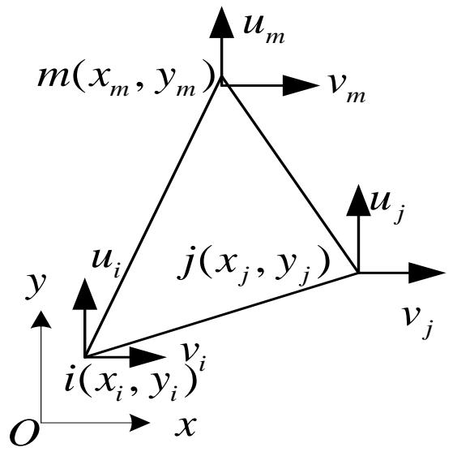

text_image

u_m
m(x_m, y_m)
v_m
u_j
y
u_i
j(x_j, y_j)
v_j
i(x_i, y_i)
v_i
O
x

One can use the column matrix of node displacement and the other relevant interpolation functions to express all the mechanical parameters

$$
u (x _ {i}, y _ {i}) 、 \sigma (x, y) 、 \varepsilon (x, y) 、 \Pi^ {e}
$$

using function interpolation, geometric equations, physical equations and the calculation formula of potential energy.

## 4.1 Element analysis

## Expression of the element displacement field

If express the displacement in the directions of x and y, then the displacement of each direction can be determined by 3 nodal displacement. So there are 3 undetermined coefficients in each direction.

Considering the simplicity, completeness, continuity and the uniqueness of the coefficients, the displacement mode is

$$
\left\{ \begin{array}{l} u (x, y) = \beta_ {1} + \beta_ {2} x + \beta_ {3} y \\ v (x, y) = \beta_ {4} + \beta_ {5} x + \beta_ {6} y \end{array} \right.
$$

Due to the nodal condition at the point $(x_{i},y_{i})$ we have

$$
\left. \begin{array}{l} u (x _ {i}, y _ {i}) = u _ {i} \\ v (x _ {i}, y _ {i}) = v _ {i} \end{array} \right\} (i = 1, 2, 3)
$$

Then the undetermined coefficients are

$$
\beta_ {1} = \frac {1}{2 A} \left| \begin{array}{c c c} u _ {1} & x _ {1} & y _ {1} \\ u _ {2} & x _ {2} & y _ {2} \\ u _ {3} & x _ {3} & y _ {3} \end{array} \right| = \frac {1}{2 A} \left(a _ {1} u _ {1} + a _ {2} u _ {2} + a _ {3} u _ {3}\right)
$$

$$
\beta_ {2} = \frac {1}{2 A} \left| \begin{array}{l l l} 1 & u _ {1} & y _ {1} \\ 1 & u _ {2} & y _ {2} \\ 1 & u _ {3} & y _ {3} \end{array} \right| = \frac {1}{2 A} \left(b _ {1} u _ {1} + b _ {2} u _ {2} + b _ {3} u _ {3}\right) \quad | 1, x, y,
$$

$$
\beta_ {3} = \frac {1}{2 A} \left| \begin{array}{c c c} 1 & x _ {1} & u _ {1} \\ 1 & x _ {2} & u _ {2} \\ 1 & x _ {3} & u _ {3} \end{array} \right| = \frac {1}{2 A} \left(c _ {1} u _ {1} + c _ {2} u _ {2} + c _ {3} u _ {3}\right)
$$

$$
A = \frac {1}{2} \left| \begin{array}{c c c} 1 & x _ {1} & y _ {1} \\ 1 & x _ {2} & y _ {2} \\ 1 & x _ {3} & y _ {3} \end{array} \right|
$$

## 4.1 Element analysis

## Expression of the element displacement field

Similarly we have

$$
\begin{array}{l} \beta_ {4} = \frac {1}{2 A} \left(a _ {1} v _ {1} + a _ {2} v _ {2} + a _ {3} v _ {3}\right) \\ \beta_ {5} = \frac {1}{2 A} \left(b _ {1} v _ {1} + b _ {2} v _ {2} + b _ {3} v _ {3}\right) \\ \beta_ {6} = \frac {1}{2 A} \left(c _ {1} v _ {1} + c _ {2} v _ {2} + c _ {3} v _ {3}\right) \\ \end{array}
$$

where

$$
\left. \begin{array}{r l} a _ {1} & = \left| \begin{array}{l l} x _ {2} & y _ {2} \\ x _ {3} & y _ {3} \end{array} \right| = x _ {2} y _ {3} - x _ {3} y _ {2} \\ b _ {1} & = \left| \begin{array}{l l} 1 & y _ {2} \\ 1 & y _ {3} \end{array} \right| = y _ {2} - y _ {3} \\ c _ {1} & = \left| \begin{array}{l l} 1 & x _ {2} \\ 1 & x _ {3} \end{array} \right| = - x _ {2} - x _ {3} \end{array} \right\} (\text {指标轮换})
$$

Rewrite the displacement function in the form of node displacement using the equations above and we have:

$$
\left\{ \begin{array}{l} u (x, y) = N _ {1} (x, y) u _ {1} + N _ {2} (x, y) u _ {2} + N _ {3} (x, y) u _ {3} \\ v (x, y) = N _ {1} (x, y) v _ {1} + N _ {2} (x, y) v _ {2} + N _ {3} (x, y) v _ {3} \end{array} \right.
$$

## 4.1 Element analysis

## Expression of the element strain field

According to the geometric equations of the elastic plane problems.

$$
\boldsymbol {\varepsilon} _ {(3 \times 1)} (x, y) = \left[ \begin{array}{l} \varepsilon_ {x} \\ \varepsilon_ {y} \\ \gamma_ {x y} \end{array} \right] = \left[ \begin{array}{c} \frac {\partial u}{\partial x} \\ \frac {\partial v}{\partial y} \\ \frac {\partial u}{\partial y} + \frac {\partial v}{\partial x} \end{array} \right] = \left[ \begin{array}{c c} \frac {\partial}{\partial x} & 0 \\ 0 & \frac {\partial}{\partial x} \\ \frac {\partial}{\partial x} & \frac {\partial}{\partial x} \end{array} \right] \left[ \begin{array}{l} u (x, y) \\ v (x, y) \end{array} \right] = [ \partial ] _ {(3 \times 2)} \mathbf {u} _ {(2 \times 1)}
$$

Substitute the displacement with the interpolation function and we have

$$
\underset {(3 \times 1)} {\boldsymbol {\varepsilon}} (x, y) = [ \partial ] _ {(3 \times 2)} \mathbf {u} _ {(2 \times 1)} = [ \partial ] _ {(3 \times 2)} \mathbf {N} _ {(2 \times 6)} (x, y) \mathbf {q} _ {(6 \times 1)} ^ {e} = \mathbf {B} _ {(3 \times 6)} (x, y) \mathbf {q} _ {(6 \times 1)} ^ {e}
$$

Substitute the expression of $\mathbf{N}(x,y)$

$$
\mathbf {B} _ {(3 \times 6)} (x, y) = [ \partial ] _ {(3 \times 2)} \mathbf {N} _ {(2 \times 6)} (x, y) = \frac {1}{2 A} \left[ \begin{array}{c c c c c c} b _ {1} & 0 & b _ {2} & 0 & b _ {3} & 0 \\ 0 & c _ {1} & 0 & c _ {2} & 0 & c _ {3} \\ c _ {1} & b _ {1} & c _ {2} & b _ {2} & c _ {3} & b \end{array} \right] = \left[ \begin{array}{c c c} \mathbf {B} _ {1} & \mathbf {B} _ {2} & \mathbf {B} _ {3} \\ (3 \times 2) & (3 \times 2) & (3 \times 2) \end{array} \right]
$$

## 4.1 Element analysis

## Expression of the element stress field

According to the physical equations of the elastic plane stress problems.

$$
\boldsymbol {\sigma} _ {(3 \times 1)} (x, y) = \left[ \begin{array}{l} \sigma_ {x} \\ \sigma_ {y} \\ \tau_ {x y} \end{array} \right] = \frac {E}{1 - \mu^ {2}} \left[ \begin{array}{c c c} 1 & \mu & 0 \\ \mu & 1 & 0 \\ 0 & 0 & \frac {1 - \mu}{2} \end{array} \right] \left[ \begin{array}{l} \varepsilon_ {x} \\ \varepsilon_ {y} \\ \gamma_ {x y} \end{array} \right] = \mathbf {D} _ {(3 \times 3)} (\varepsilon_ {(3 \times 1)}
$$

The coefficient (E, $\mu$ ) should be changed to strain problem. $\left(\frac{E}{1-\mu^{2}}\quad\frac{\mu}{1-\mu}\right)$ as to the plane

Substitute the expression of strain and we have

$$
\underset {(3 \times 1)} {\boldsymbol {\sigma}} (x, y) = \underset {(3 \times 3)} {\mathbf {D}} \underset {(3 \times 6)} {\mathbf {B}} (x, y) \underset {(6 \times 1)} {\mathbf {q} ^ {e}} = \underset {(3 \times 6)} {\mathbf {S}} \underset {(6 \times 1)} {\mathbf {q} ^ {e}}
$$

Where S is called the matrix of stress function.

## 4.1 Element analysis

## Expression of the element potential energy

We have expressed the three fundamental variables $(\mathbf{u},\boldsymbol{\varepsilon},\boldsymbol{\sigma})$ of the element by the column matrix $q^{e}$ of the node displacement. Substitute it into the expression of the element potential energy and we have

$$
\begin{array}{l} \Pi^ {e} = \frac {1}{2} \int_ {\Omega^ {e}} \pmb {\sigma} ^ {T} \pmb {\varepsilon} d V - \int_ {\Omega^ {e}} \pmb {\mathbf {f}} ^ {T} \pmb {\mathbf {u}} d V - \int_ {S _ {\sigma}} \pmb {\mathbf {T}} ^ {T} \pmb {\mathbf {u}} d S \\ = \frac {1}{2} \mathbf {q} ^ {e T} \left(\int_ {\Omega^ {e}} \mathbf {B} ^ {T} \mathbf {D B} d V\right) \mathbf {q} ^ {e} - \left(\int_ {\Omega^ {e}} \mathbf {N} ^ {T} \mathbf {f} d V + \int_ {S _ {\sigma}} \mathbf {N} ^ {T} \mathbf {T} d S\right) ^ {T} \mathbf {q} ^ {e} \\ = \frac {1}{2} \mathbf {q} ^ {e T} \mathbf {K} ^ {e} \mathbf {q} ^ {e} - \mathbf {P} ^ {e T} \mathbf {q} ^ {e} \\ \end{array}
$$

Where $\mathbf{K}^{\mathrm{e}}(x,y)$ is the element stiffness matrix

$$
\mathbf {K} _ {(6 \times 6)} ^ {e} = \int_ {\Omega^ {e}} \mathbf {B} _ {(6 \times 3)} ^ {T} \mathbf {D} _ {(3 \times 3)} \mathbf {B} _ {(3 \times 6)} d V = t \int_ {A ^ {e}} \mathbf {B} ^ {T} \mathbf {D B} d A
$$

t is the thickness of the plane stress problem

## 4.1 Element analysis

## Expression of the element potential energy

For the linear triangle element with three nodes the matrix B is a constant coefficient matrix. So the element stiffness matrix can be written as

$$
\mathbf {K} _ {(6 \times 6)} ^ {e} = \mathbf {B} _ {(6 \times 3)} ^ {T} \mathbf {D} _ {(3 \times 3)} \mathbf {B} _ {(3 \times 6)} t A = \left[ \begin{array}{c c c} \mathbf {k} _ {1 1} & \mathbf {k} _ {1 2} & \mathbf {k} _ {1 3} \\ \mathbf {k} _ {2 1} & \mathbf {k} _ {2 2} & \mathbf {k} _ {2 3} \\ \mathbf {k} _ {3 1} & \mathbf {k} _ {3 2} & \mathbf {k} _ {3 3} \end{array} \right]
$$

Where the sub- matrix is

$$
\mathbf {k} _ {\underset {(2 \times 2)} {r s}} = \mathbf {B} _ {\underset {(2 \times 3)} {r}} ^ {T} \mathbf {D} _ {\underset {(3 \times 3)} {(3 \times 3)}} \mathbf {B} _ {\underset {(3 \times 2)} {s}} t A = \frac {E t}{4 (1 - \mu^ {2}) A} \left[ \begin{array}{c c} k _ {1} & k _ {3} \\ k _ {2} & k _ {4} \end{array} \right]
$$

The equivalent node load is

$$
\begin{array}{l} \mathbf {P} _ {(6 \times 1)} ^ {e} = \int_ {\Omega^ {e}} \mathbf {N} ^ {T} \mathbf {f} d V + \int_ {S _ {\sigma}} \mathbf {N} ^ {T} \mathbf {T} d S \\ = t \int_ {\Omega^ {e}} \mathbf {N} ^ {T} \mathbf {f} _ {(2 \times 1)} d A + t \int_ {S _ {\sigma}} \mathbf {N} ^ {T} \mathbf {T} _ {(2 \times 1)} d l \\ \end{array}
$$

## 4.1 Element analysis

## The stiffness equation of the element

Take the first order extremum of the element potential energy to the node displacement. Then the element stiffness equation is

$$
\underset {(6 \times 6)} {\mathbf {K}} ^ {e} \underset {(6 \times 1)} {\mathbf {q}} ^ {e} = \underset {(6 \times 1)} {\mathbf {P}} ^ {e}
$$

## Notice:

The displacement field of the triangle element with three nodes is linear. So the $\mathbf{B}(x,y)$ and $\mathbf{S}(x,y)$ obtained above are both constant coefficient matrixes.

So the stress and strain at any point in the element is constant and the triangle elements with three nodes will become the element of constant stress or strain.

The meshes should be more intensive in the area where the strain gradient (stress gradient) changes sharply. Otherwise the real situation of the strain and stress cannot be described and it will cause a big error.

After the element analysis there will be the conventional integration of the global stiffness, integration of the load vector and then solve the problem.

The key point of the finite element method is to express the element field variables in a function form. Now let's look at a simple example.

## 4.2 Examples

## The finite element analysis of cantilever plane problems

A cantilever is applied a concentrated force F at the right end. The elasticity modulus of the material is E, the Poisson's ratio=1/3, the thickness of the cantilever is t.

Please solve the displacement of every node and the reaction at support according to the plane stress problems.

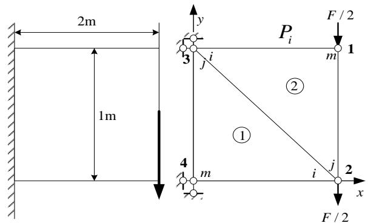

text_image

2m
1m
y
P_i
F / 2
3
j
i
m
①
②
4
m
i
j
2
x
F / 2

(1) Structural discretization and numbering

Discretize the structure, the numbering of elements and nodes is shown in the picture. There are 2 triangle elements with 3 nodes. The force F moves to the nodes 1 and 2 in terms of the static equivalent principle.

The column matrix of the node displacement:

$$
\mathbf {q} = \left[ \begin{array}{c c c c c c c c} u _ {1} & v _ {1} & u _ {2} & v _ {2} & u _ {3} & v _ {3} & u _ {4} & v _ {4} \end{array} \right] ^ {T}
$$

The column matrix of the external force at the nodes:

$$
\mathbf {F} = \left[ \begin{array}{c c c c c c c c} 0 & - \frac {F}{2} & 0 & - \frac {F}{2} & 0 & 0 & 0 & 0 \end{array} \right] ^ {T}
$$

The column matrix of the bearing reaction of the constraint:

$$
\mathbf {R} = \left[ \begin{array}{c c c c c c c c} 0 & 0 & 0 & 0 & R _ {3 x} & R _ {3 y} & R _ {4 x} & R _ {4 y} \end{array} \right] ^ {T}
$$

The global column matrix of the node load:

$$
\mathbf {P} = \left[ \begin{array}{c c c c c c c c} 0 & - \frac {F}{2} & 0 & - \frac {F}{2} & R _ {3 x} & R _ {3 y} & R _ {4 x} & R _ {4 y} \end{array} \right] ^ {T}
$$

## 4.2 Examples

## The finite element analysis of cantilever plane problems

## (2) Description of every element

When the local node numbers of two elements are as follows then they have the same stiffness matrix.

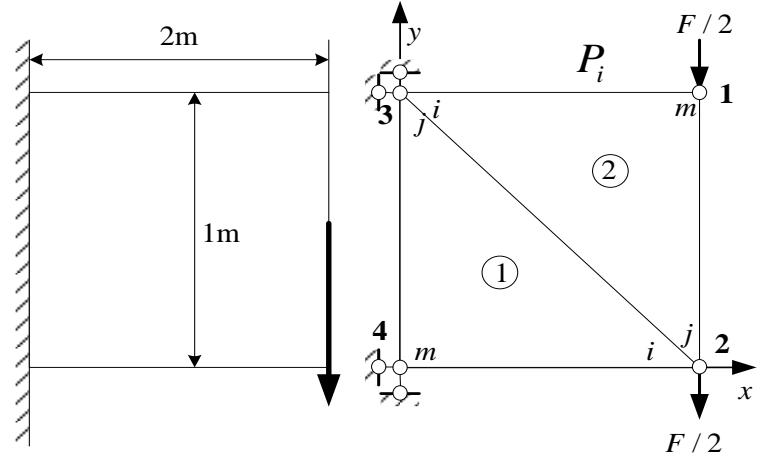

text_image

2m
1m
y
P_i
F / 2
3
j
i
m
①
②
4
m
i
j
2
x
F / 2

$$
\mathbf {K} ^ {(1)} = \mathbf {K} ^ {(2)} = \left[ \begin{array}{c c c} \mathbf {k} _ {i i} & \mathbf {k} _ {i j} & \mathbf {k} _ {i m} \\ \mathbf {k} _ {j i} & \mathbf {k} _ {j j} & \mathbf {k} _ {j m} \\ \mathbf {k} _ {m i} & \mathbf {k} _ {m j} & \mathbf {k} _ {m m} \end{array} \right] = \frac {9 E t}{3 2}
$$

$$
\left[ \begin{array}{c c c c c c} 1 & 0 & 0 & \frac {2}{3} & - 1 & - \frac {2}{3} \\ 0 & \frac {1}{3} & \frac {2}{3} & 0 & - \frac {2}{3} & - \frac {1}{3} \\ 0 & \frac {2}{3} & \frac {4}{3} & 0 & - \frac {4}{3} & - \frac {2}{3} \\ \frac {2}{3} & 0 & 0 & 4 & - \frac {2}{3} & - 4 \\ - 1 & - \frac {2}{3} & - \frac {4}{3} & - \frac {2}{3} & \frac {7}{3} & \frac {4}{3} \\ - \frac {2}{3} & - \frac {1}{3} & - \frac {2}{3} & - 4 & \frac {4}{3} & \frac {1 3}{3} \end{array} \right]
$$

## 4.2 Examples

## The finite element analysis of cantilever plane problems

## (3) Establish the global stiffness matrix

Assemble the element matrixes according to the displacement freedom degree to get the global stiffness matrix.

The assembling process can be written as

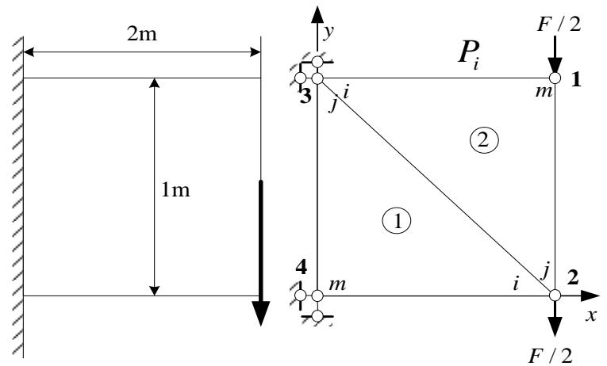

text_image

2m
1m
y
P_i
F / 2
3
j
i
m
①
②
4
m
i
j
2
x
F / 2

$$
\mathbf {K} = \mathbf {K} ^ {(1)} + \mathbf {K} ^ {(2)}
$$

$$
\boldsymbol {K} _ {(8 \times 8)} = \left[ \begin{array}{c c c c c} \boldsymbol {k} _ {m m} ^ {(2)} & \boldsymbol {k} _ {m j} ^ {(2)} & \boldsymbol {k} _ {m i} ^ {(2)} \\ \hline \boldsymbol {k} _ {j m} ^ {(2)} & \boldsymbol {k} _ {j j} ^ {(2)} + \boldsymbol {k} _ {i i} ^ {(1)} & \boldsymbol {k} _ {j i} ^ {(2)} + \boldsymbol {k} _ {i j} ^ {(1)} \\ \hline \boldsymbol {k} _ {i m} ^ {(2)} & \boldsymbol {k} _ {i j} ^ {(2)} + \boldsymbol {k} _ {j i} ^ {(1)} & \boldsymbol {k} _ {i i} ^ {(2)} + \boldsymbol {k} _ {j j} ^ {(1)} \\ \hline \end{array} \right] \left[ \begin{array}{l} \leftarrow u _ {1} \\ \leftarrow v _ {1} \\ \leftarrow u _ {2} \\ \leftarrow v _ {2} \\ \leftarrow u _ {3} \\ \leftarrow v _ {3} \\ \leftarrow u _ {4} \\ \leftarrow v _ {4} \end{array} \right]
$$

The corresponding positions of every element stiffness submatrix in the global stiffness matrix are as follows.

## 4.2 Examples

## The finite element analysis of cantilever plane problems

## (3) Establish the global stiffness matrix

Then we can obtain the global stiffness equation

$$
\frac {9 E t}{3 2} \left[ \begin{array}{c c c c c c c} \frac {7}{3} & \frac {4}{3} & - \frac {4}{3} & - \frac {2}{3} & - 1 & - \frac {2}{3} & 0 & 0 \\ \frac {4}{3} & \frac {1 3}{3} & - \frac {2}{3} & - 4 & - \frac {2}{3} & - \frac {1}{3} & 0 & 0 \\ \hline - \frac {4}{3} & - \frac {2}{3} & \frac {7}{3} & 0 & 0 & \frac {4}{3} & - 1 & - \frac {2}{3} \\ - \frac {2}{3} & - 4 & 0 & \frac {1 3}{3} & \frac {4}{3} & 0 & - \frac {2}{3} & - \frac {1}{3} \\ \hline - 1 & - \frac {2}{3} & 0 & \frac {4}{3} & \frac {7}{3} & 0 & - \frac {4}{3} & - \frac {2}{3} \\ - \frac {2}{3} & - \frac {1}{3} & \frac {4}{3} & 0 & 0 & \frac {1 3}{3} & - \frac {2}{3} & - 4 \\ \hline 0 & 0 & - 1 & - \frac {2}{3} & - \frac {4}{3} & - \frac {2}{3} & \frac {7}{3} & \frac {4}{3} \\ 0 & 0 & - \frac {2}{3} & - \frac {1}{3} & - \frac {2}{3} & - 4 & \frac {4}{3} & \frac {1 3}{3} \\ \end{array} \right] \left[ \begin{array}{c} u _ {1} \\ v _ {1} \\ \dots \\ u _ {2} \\ v _ {2} \\ \dots \\ u _ {3} \\ v _ {3} \\ \dots \\ u _ {4} \\ v _ {4} \\ \end{array} \right] = \left[ \begin{array}{c} 0 \\ - \frac {F}{2} \\ \dots \\ 0 \\ - \frac {F}{2} \\ \dots \\ R _ {x 3} \\ R _ {y 3} \\ \dots \\ R _ {x 4} \\ R _ {y 4} \\ \end{array} \right]
$$

## 4.2 Examples

## The finite element analysis of cantilever plane problems

(4) The treatment of the boundary conditions and the solution of the equation In this problem the displacement boundary conditions are $u_{3} = 0$ , $v_{3} = 0$ , $u_{4} = 0$ , $v_{4} = 0$ . Substitute them into the global equation. Delete the 5\~8 lines of the node displacement that are already known.

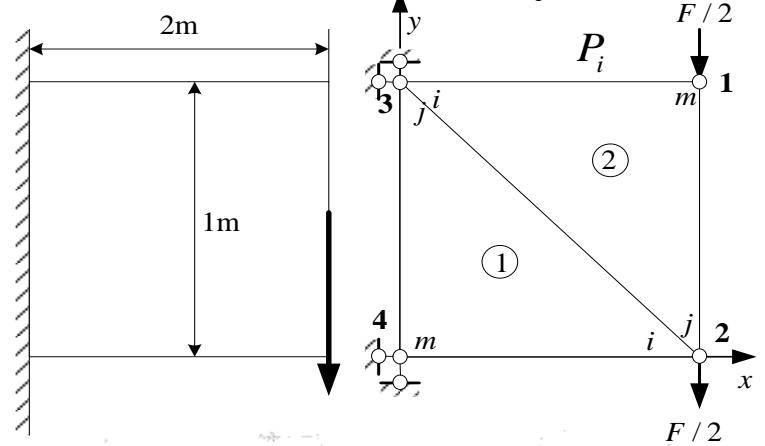

text_image

2m
1m
y
P_i
F / 2
3
j i
m
1
②
①
4
m
i j
2
x
F / 2

$$
\frac {9 E t}{3 2} \left[ \begin{array}{c c c c} \frac {7}{3} & \frac {4}{3} & - \frac {4}{3} & - \frac {2}{3} \\ \frac {4}{3} & \frac {1 3}{3} & - \frac {2}{3} & - 4 \\ - \frac {4}{3} & - \frac {2}{3} & \frac {7}{3} & 0 \\ - \frac {2}{3} & - 4 & 0 & \frac {1 3}{3} \end{array} \right] \left[ \begin{array}{c} u _ {1} \\ v _ {1} \\ u _ {2} \\ v _ {2} \end{array} \right] = \left[ \begin{array}{c} 0 \\ - \frac {F}{2} \\ 0 \\ - \frac {F}{2} \end{array} \right]
$$

$$
\frac {9 E t}{3 2} \left[ \begin{array}{c c c c c c c} \frac {7}{3} & \frac {4}{3} & - \frac {4}{3} & - \frac {2}{3} & - 1 & - \frac {2}{3} & 0 & 0 \\ \frac {4}{3} & \frac {1 3}{3} & - \frac {2}{3} & - 4 & - \frac {2}{3} & - \frac {1}{3} & 0 & 0 \\ \hline - \frac {4}{3} & - \frac {2}{3} & \frac {7}{3} & 0 & 0 & \frac {4}{3} & - 1 & - \frac {2}{3} \\ - \frac {2}{3} & - 4 & 0 & \frac {1 3}{3} & \frac {4}{3} & 0 & - \frac {2}{3} & - \frac {1}{3} \\ \hline - 1 & - \frac {2}{3} & 0 & \frac {4}{3} & \frac {7}{3} & 0 & - \frac {4}{3} & - \frac {2}{3} \\ - \frac {2}{3} & - \frac {1}{3} & \frac {4}{3} & 0 & 0 & \frac {1 3}{3} & - \frac {2}{3} & - 4 \\ \hline 0 & 0 & - 1 & - \frac {2}{3} & - \frac {4}{3} & - \frac {2}{3} & \frac {7}{3} & \frac {4}{3} \\ 0 & 0 & - \frac {2}{3} & - \frac {1}{3} & - \frac {2}{3} & - 4 & \frac {4}{3} & \frac {1 3}{3} \end{array} \right] \left[ \begin{array}{l} u _ {1} \\ v _ {1} \\ \dots \\ u _ {2} \\ v _ {2} \\ \dots \\ u _ {3} \\ v _ {3} \\ \dots \\ u _ {4} \\ v _ {4} \end{array} \right] = \left[ \begin{array}{l} 0 \\ - \frac {F}{2} \\ \dots \\ 0 \\ - \frac {F}{2} \\ \dots \\ R _ {x 3} \\ R _ {y 3} \\ \dots \\ R _ {x 4} \\ R _ {y 4} \end{array} \right]
$$

Why delete the 5\~8 lines?

## 4.2 Examples

## The finite element analysis of cantilever plane problems

(5) Calculation of the bearing reaction.

The node displacements are

$$
\left[ \begin{array}{l l l l} u _ {1} & v _ {1} & u _ {2} & v _ {2} \end{array} \right] ^ {T} = \frac {F}{E t} \left[ \begin{array}{l l l l} 1. 8 8 & - 8. 9 9 & - 1. 5 0 & - 8. 4 2 \end{array} \right] ^ {T}
$$

Substitute it into the global stiffness equation and we can get the bearing reactions that

$$
R _ {3 x} = \frac {9 E t}{3 2} \left(- u _ {1} - \frac {2}{3} v _ {1} + \frac {4}{3} v _ {2}\right) = - 2 F
$$

$$
R _ {3 y} = \frac {9 E t}{3 2} \left(- \frac {2}{3} u _ {1} - \frac {1}{3} v _ {1} + \frac {4}{3} u _ {2}\right) = - 0. 0 7 F
$$

$$
R _ {3 x} = \frac {9 E t}{3 2} \left(- u _ {2} - \frac {2}{3} v _ {2}\right) = 2 F
$$

$$
R _ {3 x} = \frac {9 E t}{3 2} \left(- \frac {2}{3} u _ {2} - \frac {1}{3} v _ {2}\right) = 1. 0 7 F
$$

text_image

2m
1m
y
P_i
F / 2
3
j
i
m
①
②
4
m
i
j
2
x
F / 2

$$
\frac {9 E t}{3 2} \left[ \begin{array}{c c c c c c c c} \frac {7}{3} & \frac {4}{3} & - \frac {4}{3} & - \frac {2}{3} & - 1 & - \frac {2}{3} & 0 & 0 \\ \frac {4}{3} & \frac {1 3}{3} & - \frac {2}{3} & - 4 & - \frac {2}{3} & - \frac {1}{3} & 0 & 0 \\ \hline - \frac {4}{3} & - \frac {2}{3} & \frac {7}{3} & 0 & 0 & \frac {4}{3} & - 1 & - \frac {2}{3} \\ - \frac {2}{3} & - 4 & 0 & \frac {1 3}{3} & \frac {4}{3} & 0 & - \frac {2}{3} & - \frac {1}{3} \\ \hline - 1 & - \frac {2}{3} & 0 & \frac {4}{3} & \frac {7}{3} & 0 & - \frac {4}{3} & - \frac {2}{3} \\ - \frac {2}{3} & - \frac {1}{3} & \frac {4}{3} & 0 & 0 & \frac {1 3}{3} & - \frac {2}{3} & - 4 \\ \hline 0 & 0 & - 1 & - \frac {2}{3} & - \frac {4}{3} & - \frac {2}{3} & \frac {7}{3} & \frac {4}{3} \\ 0 & 0 & - \frac {2}{3} & - \frac {1}{3} & - \frac {2}{3} & - 4 & \frac {4}{3} & \frac {1 3}{3} \end{array} \right] \left[ \begin{array}{l} u _ {1} \\ v _ {1} \\ \dots \\ u _ {2} \\ v _ {2} \\ \dots \\ u _ {3} \\ v _ {3} \\ \dots \\ u _ {4} \\ v _ {4} \end{array} \right] = \left[ \begin{array}{l} 0 \\ - \frac {F}{2} \\ \dots \\ 0 \\ - \frac {F}{2} \\ \dots \\ R _ {x 3} \\ R _ {y 3} \\ \dots \\ R _ {x 4} \\ R _ {y 4} \end{array} \right]
$$

So the bearing reactions above constitute a balanced system of force with the external force.

## 4.3 Conclusion of the solving process

Not let's review each step of solving the problems with the finite element method.

Take the plane problems with constant body force (e.g. the gravity) and linear surface force for example. And further embody the method from the aspect of programming.

## Divide the area into triangle elements

The size of the element is arbitrary to some extent. However one should take the computer capacity, speed and the computational accuracy requirement into consideration.

So the following points should be obeyed

1. 1. The node must be the vertex of adjacent elements but not the inner point on the boundary.  
2. Avoid large obtuse angle.  
3. The meshes should be intensive where the gradient of $u(x,y)$ varies intensely; and sparse where the gradient varies slightly.  
4. The number of the elements can be arbitrary but the quality can largely influences the band width of the global stiffness matrix. The principle is that the smaller the maximum of the absolute value of the differences between adjacent element numbers, the better.

## 4.3 Conclusion of the solving process

## Give the raw information according to the meshes

1. Coordinates of the nodes:

$$
(x _ {i}, y _ {i}) i = 1, \dots \dots , \mathrm{NP}
$$

2. Information of the element:

Provide every element with a three-node number $(n_{1}, n_{2}, n_{3})$ in an anticlockwise order and also with the number of the material types.

3. Characteristics of the material :

Give the elastic constants and the density of the constant body force of every material type.

4. Information of the concentrated force:

The node number and the magnitude of the concentrated force.

5. Information of the surface force:

Give the numbers of two ends and the load density of every line element under the surface force.

6. Information of the constraints:

The node number of the constraints and the constraint situations in the directions of x and y.

## 4.3 Conclusion of the solving process

## Establish the solving equation

1. Zero setting:

$$
\mathrm{K} _ {i j} = 0, F _ {i} = 0 (i = 1, \dots \dots , \mathrm{NP})
$$

2. Element analysis:

Provide the element information including the element numbering, the node numbering, the coordinates, material and the body force. Calculate the element stiffness matrix and the equivalent node load vector.

Scanning the elements one by one and then assemble the element stiffness to get the global stiffness matrix.

One can only calculate a half of the global matrix due to its symmetry. And even the elements outside the half-band width can be ignored.

3. Line element analysis:

Calculate surface force to get its equivalent node load vector.

4. Concentrated force:

Extract the node number and the value of the concentrated force one by one and then accumulate directly.

We can then obtain the global stiffness K and the global load vector P.

## 4.3 Conclusion of the solving process

## Treatment of the constraints

The geometric boundary conditions are needed to constrain the displacement of the rigid body system in the displacement field problem. to eliminate the singularity of the global stiffness matrix.

We usually adopt the following two methods: “change the diagonal elements to 1” and “multiply the diagonal elements by large number”.

## Solve the linear equations

It should be noticed that solving the linear algebraic equations requires a lot of calculation.

We should make full use of the symmetry, the sparsity and the banded distribution of the stiffness matrix and there has already developed several efficient methods.

## Solve the stress

We can then obtain the stress ad strain after getting the displacement solution. The stress in every element is constant for the line elements

here, which is $\sigma = \mathbf{D}\varepsilon = \mathbf{D}[\partial][N]\{\delta\}_{e} = \frac{1}{2\Delta_{e}}\left[ \begin{array}{ccc}\lambda +2G & \lambda & 0\\ \lambda & \lambda +2G & 0\\ 0 & 0 & G \end{array} \right]\left[ \begin{array}{cccccc}a_{n1} & 0 & a_{n2} & 0 & a_{n3} & 0\\ 0 & b_{n1} & 0 & b_{n2} & 0 & b_{n3}\\ b_{n1} & a_{n1} & b_{n2} & a_{n2} & b_{n3} & a_{n3} \end{array} \right]$

So the discontinuity of the stress between elements can be solved by later process.

## 4.4 Examples

## Example1

A homogeneous square sheet with the thickness t=1cm has an uniform tension $q=10^{6}N/m$ at both top and bottom sides. The elasticity modulus E=1000, the Poisson's ratio $\mu=1/3$ . Ignore the self weight and solve its stress components by the finite element method.

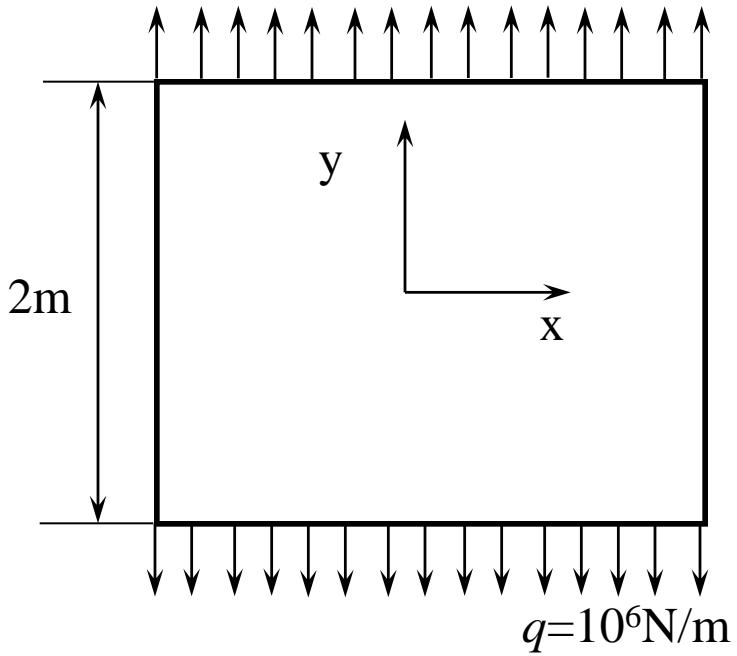

text_image

2m
y
x
q=10^6N/m

1

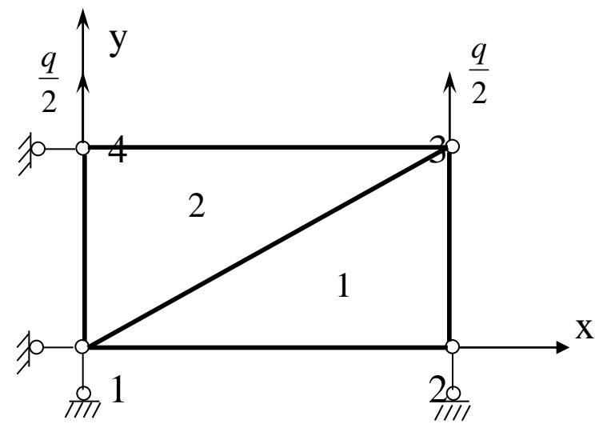

text_image

y
q/2
4
2
1
x
1
2
q/2

2

## 4.4 Examples

## Solve: 1. Establish the mechanical model

In this example the length and width of the structure are considerably larger than the thickness. The load is in the plane of the sheet and is uniformly distributed along the thickness. So this is a plane stress problem and we can extract $\frac{1}{4}$ of the structure due to the symmetry.

## 2. Structure discretization

The $\frac{1}{4}$ of the structure can be discretized into two triangle elements. The node number, the element division and the coordinate are given in the picture2. The coordinate figure of every node is given in table1.

## 3. Solve the element stiffness matrix

<table><tr><td>coordinate\node</td><td>1</td><td>2</td><td>3</td><td>4</td></tr><tr><td>x</td><td>0</td><td>1</td><td>1</td><td>0</td></tr><tr><td>y</td><td>0</td><td>0</td><td>1</td><td>1</td></tr></table>

Table 1

1) Calculate the difference between the node coordinates and the area of the elements.

Element 1 (i、j、m → 1, 2, 3)

$$
b _ {1} = y _ {2} - y _ {3} = - 1 \quad b _ {2} = y _ {3} - y _ {1} = 1 \quad b _ {3} = y _ {1} - y _ {2} = 0
$$

## 4.4 Examples

$$
c _ {1} = - (x _ {2} - x _ {3}) = 0 \quad c _ {2} = - (x _ {3} - x _ {1}) = - 1 \quad c _ {3} = - (x _ {1} - x _ {2}) = 1
$$

$$
\Delta^ {1} = \frac {1}{2} \left(b _ {2} c _ {3} - b _ {3} c _ {2}\right) = \frac {1}{2} [ 1 \times 1 - 0 \times (- 1) ] = \frac {1}{2}
$$

2) Solve the element stiffness matrix

Calculate the constants that will be used first.

$$
\frac {1 - \mu}{2} = \frac {1}{3} \quad \frac {E t}{4 (1 - \mu^ {2}) \Delta} = \frac {9 E}{1 6} \quad \frac {E}{2 (1 - \mu^ {2}) \Delta} = \frac {9 E}{8}
$$

Then

$$
\left[ K _ {1 1} \right] ^ {1} = \frac {9 E}{1 6} \left[ \begin{array}{c c} (- 1) \times (- 1) + \frac {1}{3} \times 0 \times 0 & \frac {1}{3} \times (- 1) \times 0 + \frac {1}{3} \times 0 \times (- 1) \\ \frac {1}{3} \times 0 \times (- 1) + \frac {1}{3} \times (- 1) \times 0 & 0 \times 0 + \frac {1}{3} \times (- 1) \times (- 1) \end{array} \right]
$$

$$
= \frac {9 E}{1 6} \left[ \begin{array}{c c} 1 & 0 \\ 0 & \frac {1}{3} \end{array} \right]
$$

## 4.4 Examples

$$
\left[ K _ {1 2} \right] ^ {1} = \frac {9 E}{1 6} \left[ \begin{array}{l l} - 1 & \frac {1}{3} \\ \frac {1}{3} & - \frac {1}{3} \end{array} \right]; \left[ K _ {1 3} \right] ^ {1} = \frac {9 E}{1 6} \left[ \begin{array}{c c} 0 & - \frac {1}{3} \\ - \frac {1}{3} & 0 \end{array} \right]; \left[ K _ {2 2} \right] ^ {1} = \frac {9 E}{1 6} \left[ \begin{array}{l l} \frac {4}{3} & - \frac {2}{3} \\ - \frac {2}{3} & - \frac {4}{3} \end{array} \right]
$$

$$
\left[ K _ {2 3} \right] ^ {1} = \frac {9 E}{1 6} \left[ \begin{array}{l l} - \frac {1}{3} & \frac {1}{3} \\ \frac {1}{3} & - 1 \end{array} \right]; \left[ K _ {3 3} \right] ^ {1} = \frac {9 E}{1 6} \left[ \begin{array}{l l} \frac {1}{3} & 0 \\ 0 & 1 \end{array} \right] \bigwedge^ {1} \quad \bigwedge^ {2} \quad \bigwedge^ {3}
$$

So the stiffness matrix of element 1 is

$$
\left[ K \right] _ {6 \times 6} ^ {1} = \left[ \begin{array}{l l l} \left[ K _ {1 1} \right] ^ {1} & \left[ K _ {1 2} \right] ^ {1} & \left[ K _ {1 3} \right] ^ {1} \\ \left[ K _ {2 1} \right] ^ {1} & \left[ K _ {2 2} \right] ^ {1} & \left[ K _ {2 3} \right] ^ {1} \\ \left[ K _ {3 1} \right] ^ {1} & \left[ K _ {3 2} \right] ^ {1} & \left[ K _ {3 3} \right] ^ {1} \end{array} \right] = \frac {9 E}{1 6}
$$

$$
\left[ \begin{array}{c c c c c c} 1 & 0 & - 1 & \frac {1}{3} & 0 & \frac {1}{3} \\ & \frac {1}{3} & \frac {1}{3} & - \frac {1}{3} & - \frac {1}{3} & 0 \\ & & \frac {4}{3} & - \frac {2}{3} & - \frac {1}{3} & \frac {1}{3} \\ & \text {对} & & \frac {4}{3} & \frac {1}{3} & - 1 \\ & & \text {称} & & \frac {1}{3} & 0 \\ & & & & & 1 \end{array} \right] \overset {1 >} {\underset {2 >} {\underset {3 >} {\times}}}
$$

## 4.4 Examples

The stiffness matrix will be just the same when the order of node number 341 of element2 corresponds to 123 of element 1.

$$
[ K ] _ {6 \times 6} ^ {2} = \frac {9 E}{1 6} \left[ \begin{array}{c c c c c c} 3 & & 4 & & 1 \\ \wedge & & \wedge & & \wedge \\ 1 & 0 & - 1 & \frac {1}{3} & 0 & \frac {1}{3} \\ & \frac {1}{3} & \frac {1}{3} & - \frac {1}{3} & - \frac {1}{3} & 0 \\ & & \frac {4}{3} & - \frac {2}{3} & - \frac {1}{3} & \frac {1}{3} \\ & \text {对} & & \frac {4}{3} & \frac {1}{3} & - 1 \\ & & \text {称} & & \frac {1}{3} & 0 \\ & & & & & 1 \end{array} \right] > _ {4}
$$

## 4.4 Examples

## 4. Assemble the global stiffness matrix

The global stiffness matrix is

$$
\left[ K \right] _ {8 \times 8} = \left[ \begin{array}{c c c c} {\left[ K _ {1 1} \right] ^ {1 + 2}} & & & \\ {\left[ K _ {2 1} \right] ^ {1}} & {\left[ K _ {2 2} \right] ^ {1}} & & \\ {\left[ K _ {3 1} \right] ^ {1 + 2}} & {\left[ K _ {3 2} \right] ^ {1}} & {\left[ K _ {3 3} \right] ^ {1 + 2}} & \\ {\left[ K _ {4 1} \right] ^ {2}} & & {\left[ K _ {4 3} \right] ^ {2}} & {\left[ K _ {4 4} \right] ^ {2}} \end{array} \right]
$$

Because $[K_{rs}] = [K_{sr}]^T$ and the order of node number 123 of element 1 corresponds to 341 of element2. Then we have

$$
\left[ K _ {1 1} \right] ^ {1} = \left[ K _ {3 3} \right] ^ {2} = \frac {3 E}{1 6} \left[ \begin{array}{c c} 3 & 0 \\ 0 & 1 \end{array} \right]
$$

$$
\left[ K _ {2 1} \right] ^ {1} = \left[ K _ {4 3} \right] ^ {2} = \left[ \left[ K _ {1 2} \right] ^ {1} \right] ^ {T} = \frac {3 E}{1 6} \left[ \begin{array}{c c} - 3 & 1 \\ 1 & - 1 \end{array} \right]
$$

$$
\left[ K _ {3 1} \right] ^ {1} = \left[ K _ {1 3} \right] ^ {2} = \left[ \left[ K _ {1 3} \right] ^ {1} \right] ^ {T} = \frac {3 E}{1 6} \left[ \begin{array}{c c} 0 & - 1 \\ - 1 & 0 \end{array} \right]
$$

## 4.4 Examples

$$
\left[ K _ {2 2} \right] ^ {1} = \left[ K _ {4 4} \right] ^ {2} = \frac {3 E}{1 6} \left[ \begin{array}{c c} 4 & - 2 \\ - 2 & 4 \end{array} \right]
$$

$$
\left[ K _ {3 2} \right] ^ {1} = \left[ K _ {1 4} \right] ^ {2} = \left[ \left[ K _ {2 3} \right] ^ {1} \right] ^ {T} = \frac {3 E}{1 6} \left[ \begin{array}{c c} - 1 & 1 \\ 1 & - 3 \end{array} \right]
$$

$$
\left[ K _ {3 3} \right] ^ {1} = \left[ K _ {1 1} \right] ^ {2} = \frac {3 E}{1 6} \left[ \begin{array}{l l} 1 & 0 \\ 0 & 3 \end{array} \right]
$$

$$
\left[ K _ {3 1} \right] ^ {2} = \left[ K _ {1 3} \right] ^ {1} = \left[ \left[ K _ {1 3} \right] ^ {2} \right] ^ {T} = \frac {3 E}{1 6} \left[ \begin{array}{c c} 0 & - 1 \\ - 1 & 0 \end{array} \right]
$$

$$
\left[ K _ {4 1} \right] ^ {2} = \left[ K _ {2 3} \right] ^ {1} = \left[ \left[ K _ {1 4} \right] ^ {2} \right] ^ {T} = \frac {3 E}{1 6} \left[ \begin{array}{c c} - 1 & 1 \\ 1 & - 3 \end{array} \right]
$$

## 4.4 Examples

So the global stiffness matrix is

$$
\left[ K \right] _ {8 \times 8} = \frac {3 E}{1 6} \left[ \begin{array}{c c c c c c c c} 4 & & & & & & \\ 0 & 4 & & & \text {对} & & \\ - 3 & 1 & 4 & & & \text {称} & \\ 1 & - 1 & - 2 & 4 & & \\ 0 & - 2 & - 1 & 0 & 4 & & \\ - 2 & 0 & 1 & - 3 & 0 & 4 & \\ - 1 & 1 & 0 & 0 & - 3 & 1 & 4 \\ 1 & - 3 & 0 & 0 & 1 & - 1 & - 2 & 4 \end{array} \right]
$$

## 4.4 Examples

## 6. Introduce the constraint conditions and modify the stiffness matrix

Substitute the constraint conditions: $u_1 = v_1 = 0$ ; $v_2 = 0$ ; $u_4 = 0$ and the column matrix of equivalent node forces $\{F\} = \{0, 0, 0, 0, 0, q/2, 0, q/2\}^T$ into the stiffness equation $[K]\{\delta\} = \{F\}$ . Delete the line and column 1,2,4,7 in $[K]$ according to the displacement 0 then the stiffness equation will become

$$
\frac {3 E}{1 6} \left[ \begin{array}{c c c c} 4 & & & \\ - 1 & 4 & & \\ 1 & 0 & 4 & \\ 0 & 1 & - 1 & 4 \end{array} \right] \left\{ \begin{array}{l} u _ {2} \\ u _ {3} \\ v _ {3} \\ v _ {4} \end{array} \right\} = \left\{ \begin{array}{c} 0 \\ 0 \\ q / 2 \\ q / 2 \end{array} \right\}
$$

So the displacement at nodes can be obtained

$$
\left\{u _ {2} \quad u _ {3} \quad v _ {3} \quad v _ {4} \right\} ^ {T} = \left\{- q / 3 E - q / 3 E q / E q / E \right\} ^ {T}
$$

Thus $\{\delta\} = q / E[0 0 -1 / 3 0 -1 / 3 1 0 1]^T$

## 4.4 Examples

7. Calculate the element stress matrix and solve the element stress Solve the element stress matrix $[S]^{1}$ 、 $[S]^{2}$ and then solve the stress components of every element.

$$
\left\{\sigma \right\} ^ {1} = \left\{ \begin{array}{l} \sigma_ {x} \\ \sigma_ {y} \\ \tau_ {x y} \end{array} \right\} = [ S ] ^ {1} \left\{\delta \right\} ^ {1} = \frac {3 E}{8} \left[ \begin{array}{c c c c c c} - 3 & 0 & 3 & - 1 & 0 & 1 \\ - 1 & 0 & 1 & - 3 & 0 & 3 \\ 0 & - 1 & - 1 & 1 & - 1 & 0 \end{array} \right] \left\{ \begin{array}{c} 0 \\ 0 \\ - q / 3 E \\ 0 \\ - q / 3 E \\ q / E \end{array} \right\} = \frac {3 q}{8} \left\{ \begin{array}{c} 0 \\ 8 / 3 \\ 0 \end{array} \right\} = q \left\{ \begin{array}{c} 0 \\ 1 \\ 0 \end{array} \right\}
$$

$$
\left\{\sigma \right\} ^ {2} = \left\{ \begin{array}{l} \sigma_ {x} \\ \sigma_ {y} \\ \tau_ {x y} \end{array} \right\} = \left[ S \right] ^ {2} \left\{\delta \right\} ^ {2} = \frac {3 E}{8} \left[ \begin{array}{c c c c c c} 3 & 0 & - 3 & 1 & 0 & - 1 \\ 1 & 0 & - 1 & 3 & 0 & - 3 \\ 0 & 1 & 1 & - 1 & - 1 & 0 \end{array} \right] \left\{ \begin{array}{c} - q / 3 E \\ q / E \\ 0 \\ q / E \\ 0 \\ 0 \end{array} \right\} = \frac {3 E}{8} \left\{ \begin{array}{c} 0 \\ 8 q / (3 E) \\ 0 \end{array} \right\} = q \left\{ \begin{array}{c} 0 \\ 1 \\ 0 \end{array} \right\}
$$

The element stress can be regarded as the stress value at the centroid.

## 4.4 Examples

## Ex.2

The discretized structure of a plane stress problem is shown in the Fig. 3. (a) shows the discretized global structure. (b) shows the structure of element 1, 2, 4. (c) shows the structure of element 3. Please try to solve the displacement at the nodes, the element stress and the element strain by the finite element method. (The Poisson ratio $\mu = 0$ , the element thickness $t = 1$ ).

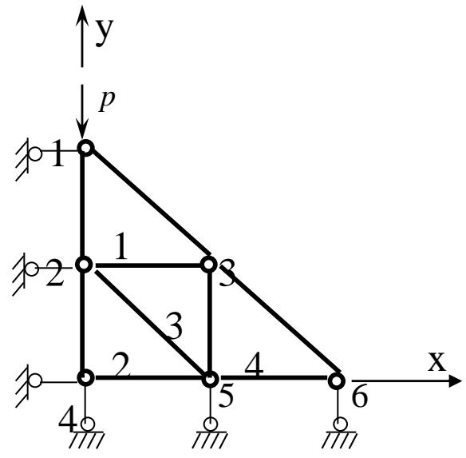

text_image

y
p
1
2
3
4
5
6
x

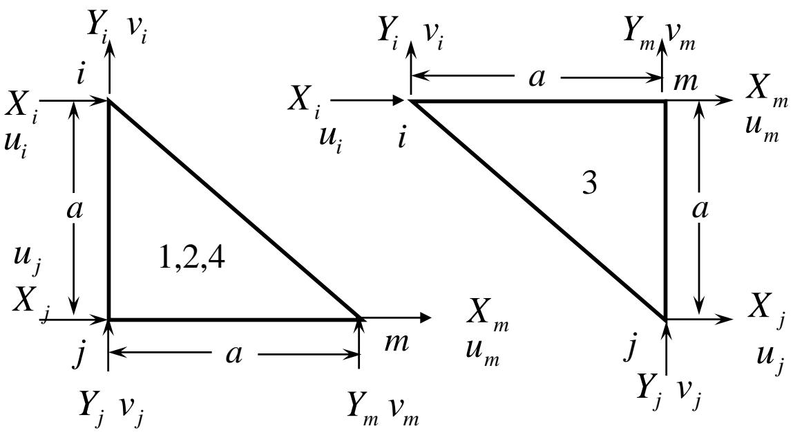

flowchart

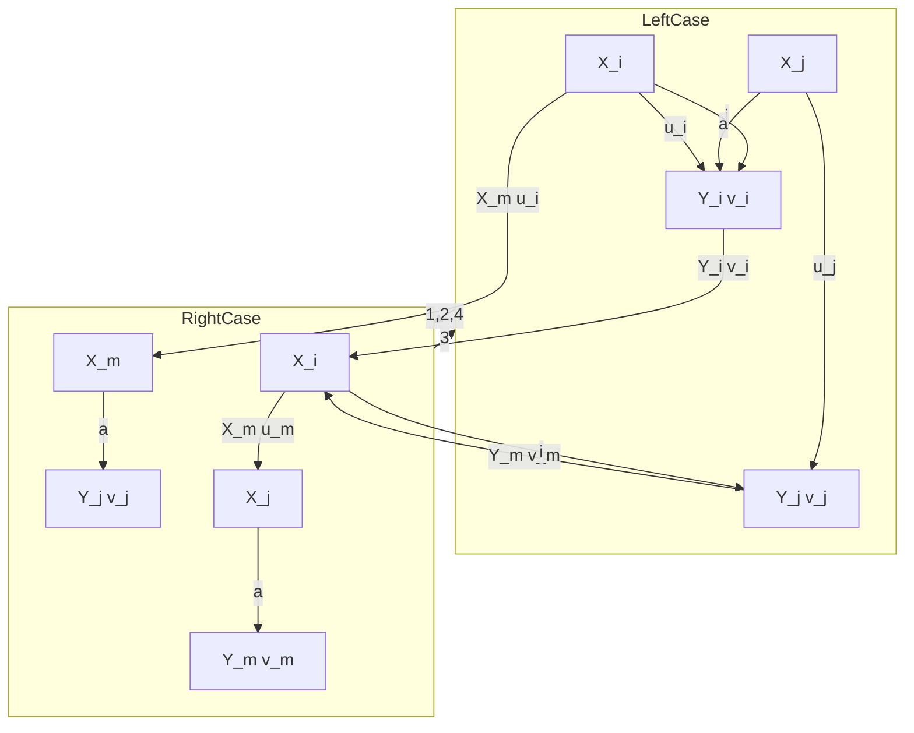

Fig.3

## 4.4 Examples

## Solution:

First determine the coefficients $b_{i}, b_{j}, b_{m}, c_{i}, c_{j}, c_{m}$ that will be needed when solving the element stiffness and the area A.

For the elements 1,2 and 4 we have

$$
\begin{array}{l} b _ {i} = 0, b _ {j} = - a, b _ {m} = a \\ c _ {i} = a, c _ {j} = - a, c _ {m} = 0 \\ A = a ^ {2} / 2 \\ \end{array}
$$

For element 3 we have:

$$
\begin{array}{l} b _ {i} = - a, b _ {j} = 0, b _ {m} = a \\ c _ {i} = 0, c _ {j} = - a, c _ {m} = a \\ A = a ^ {2} / 2 \\ \end{array}
$$

## 4.4 Examples

Then solve the element stiffness matrix.

The stiffness matrix of elements 1, 2 and 4 is

$$
k ^ {(1, 2, 4)} = \frac {E}{4} \left[ \begin{array}{c c c c c} \mathbf {i} & \mathbf {j} & \mathbf {m} \\ \hline 1 & 0 & - 1 & - 1 & 0 & 1 \\ 0 & 2 & 0 & - 2 & 0 & 0 \\ - 1 & 0 & 3 & 1 & - 2 & - 1 \\ - 1 & - 2 & 1 & 3 & 0 & - 1 \\ 0 & 0 & - 2 & 0 & 2 & 0 \\ 1 & 0 & - 1 & - 1 & 0 & 1 \end{array} \right] \left. \begin{array}{l} \text {i} \\ \text {j} \\ \text {m} \end{array} \right\}
$$

## 4.4 Examples

The stiffness matrix for element 3 is

$$
k ^ {(3)} = \frac {E}{4} \left[ \begin{array}{c c c c c} \mathrm{i} & \mathrm{j} & \mathrm{m} \\ \hline 2 & 0 & 0 & 0 & - 2 & 0 \\ 0 & 1 & 1 & 0 & - 1 & - 1 \\ 0 & 1 & 1 & 0 & - 1 & - 1 \\ 0 & 0 & 0 & 2 & 0 & - 2 \\ - 2 & - 1 & - 1 & 0 & 3 & 1 \\ 0 & - 1 & - 1 & - 2 & 1 & 3 \end{array} \right] \left. \begin{array}{l} \text {i} \\ \text {j} \\ \text {m} \end{array} \right\}
$$

Relationship between the node numbers of every element and the global numbers is shown in the table 2.

## 4.4 Examples

## Table 2

Corresponding relation table between element node numbers and the global node number

<table><tr><td>单元号</td><td>1</td><td>2</td><td>3</td><td>4</td></tr><tr><td>节点号</td><td colspan="4">节点总编号</td></tr><tr><td>I</td><td>1</td><td>2</td><td>2</td><td>3</td></tr><tr><td>j</td><td>2</td><td>4</td><td>5</td><td>5</td></tr><tr><td>m</td><td>3</td><td>5</td><td>3</td><td>6</td></tr></table>

## 4.4 Examples

Extend the element stiffness matrix to a 12\*12 matrix according to the total number of the nodes and the corresponding relationship of the node number.

$$
k _ {1 2 \times 1 2} ^ {1} = \frac {E}{4} \left[ \begin{array}{c c c c c c c c c c c} \overbrace {1} ^ {1} & 0 & - \overbrace {1} ^ {2} & - 1 & 0 & 1 & \overbrace {0} ^ {3} & 0 & 0 & \overbrace {0} ^ {4} & 0 & 0 \\ 0 & 2 & 0 & - 2 & 0 & 0 & 0 & 0 & 0 & 0 & 0 & 0 \\ - 1 & 0 & 3 & 1 & - 2 & - 1 & 0 & 0 & 0 & 0 & 0 & 0 \\ - 1 & - 2 & 1 & 3 & 0 & - 1 & 0 & 0 & 0 & 0 & 0 & 0 \\ 0 & 0 & - 2 & 0 & 2 & 0 & 0 & 0 & 0 & 0 & 0 & 0 \\ 1 & 0 & - 1 & - 1 & 0 & 1 & 0 & 0 & 0 & 0 & 0 & 0 \\ 0 & 0 & 0 & 0 & 0 & 0 & 0 & 0 & 0 & 0 & 0 & 0 \\ 0 & 0 & 0 & 0 & 0 & 0 & 0 & 0 & 0 & 0 & 0 & 0 \\ 0 & 0 & 0 & 0 & 0 & 0 & 0 & 0 & 0 & 0 & 0 & 0 \\ 0 & 0 & 0 \\ 0 & 0 \end{array} \right] \left\{ \begin{array}{l} \} _ {1} \\ \} _ {2} \\ \} _ {3} \\ \} _ {4} \\ \} _ {5} \\ \} _ {6} \end{array} \right.
$$

## 4.4 Examples

$$
k _ {1 2 \times 1 2} ^ {2} = \frac {E}{4} \left[ \begin{array}{c c c c c c c c c c c} 1 & 2 & 3 & 4 & 5 & 6 \\ \hline 0 & 0 & 0 & 0 & 0 & 0 & 0 & 0 & 0 & 0 & 0 \\ 0 & 0 & 0 & 0 & 0 & 0 & 0 & 0 & 0 & 0 & 0 \\ 0 & 0 & 1 & 0 & 0 & 0 & - 1 & - 1 & 0 & 1 & 0 \\ 0 & 0 & 0 & 2 & 0 & 0 & 0 & - 2 & 0 & 0 & 0 \\ 0 & 0 & 0 & 0 & 0 & 0 & 0 & 0 & 0 & 0 & 0 \\ 0 & 0 & 0 & 0 & 0 & 0 & 0 & 0 & 0 & 0 & 0 \\ 0 & 0 & - 1 & 0 & 0 & 0 & 3 & 1 & - 2 & - 1 & 0 \\ 0 & 0 & - 1 & - 2 & 0 & 0 & 1 & 3 & 0 & - 1 & 0 \\ 0 & 0 & 0 & 0 & 0 & 0 & - 2 & 0 & 2 & 0 & 0 \\ 0 & 0 & 1 & 0 & 0 & 0 & - 1 & - 1 & 0 & 1 & 0 \\ 0 & 0 & 0 & 0 & 0 & 0 & 0 & 0 & 0 & 0 & 0 \\ 0 & 0 & 0 & 0 & 0 & 0 & 0 & 0 & 0 & 0 & 0 \end{array} \right] \left\{ \begin{array}{l} {{1}} \\ {{2}} \\ {{3}} \\ {{4}} \\ {{5}} \\ {{6}} \end{array} \right\}
$$

## 4.4 Examples

$$
k _ {1 2 \times 1 2} ^ {3} = \frac {E}{4} \left[ \begin{array}{c c c c c c c c c c c} \overbrace {0} ^ {1} & \overbrace {0} ^ {2} & \overbrace {0} ^ {3} & \overbrace {0} ^ {4} & \overbrace {0} ^ {5} & \overbrace {0} ^ {6} \\ 0 & 0 & 0 & 0 & 0 & 0 & 0 & 0 & 0 & 0 & 0 \\ 0 & 0 & 0 & 0 & 0 & 0 & 0 & 0 & 0 & 0 & 0 \\ 0 & 0 & 2 & 0 & - 2 & 0 & 0 & 0 & 0 & 0 & 0 \\ 0 & 0 & 0 & 1 & - 1 & - 1 & 0 & 0 & 1 & 0 & 0 \\ 0 & 0 & - 2 & - 1 & 3 & 1 & 0 & 0 & - 1 & 0 & 0 \\ 0 & 0 & 0 & - 1 & 1 & 3 & 0 & 0 & - 1 & - 2 & 0 \\ 0 & 0 & 0 & 0 & 0 & 0 & 0 & 0 & 0 & 0 & 0 \\ 0 & 0 & 0 & 0 & 0 & 0 & 0 & 0 & 0 & 0 & 0 \\ 0 & 0 & 0 & 1 & - 1 & - 1 & 0 & 0 & 1 & 0 & 0 \\ 0 & 0 & 1 & 0 & 0 & - 2 & 0 & 0 & 0 & 2 & 0 \\ 0 & 0 & 0 & 0 & 0 & 0 & 0 & 0 & 0 & 0 \\ 0 & 0 & 0 & 0 & 0 & 0 & 0 & 0 & 0 & 0 \end{array} \right] \left\{ \begin{array}{l} {{1}} \\ {{2}} \\ {{3}} \\ {{4}} \\ {{5}} \\ {{6}} \end{array} \right\}
$$

## 4.4 Examples

$$
k _ {1 2 \times 1 2} ^ {4} = \frac {E}{4} \left[ \begin{array}{l l l l l l l l l l l} 0 & 0 & 0 & 0 & 0 & 0 & 0 & 0 & 0 & 0 & 0 \\ 0 & 0 & 0 & 0 & 0 & 0 & 0 & 0 & 0 & 0 & 0 \\ 0 & 0 & 0 & 0 & 0 & 0 & 0 & 0 & 0 & 0 & 0 \\ 0 & 0 & 0 & 0 & 0 & 0 & 0 & 0 & 0 & 0 & 0 \\ \end{array} \right] \left\{ \begin{array}{l} 1 \\ 2 \\ 3 \\ 4 \\ 5 \\ 6 \end{array} \right\}
$$

## 4.4 Examples

Add the extended element stiffness matrixes together and the global stiffness matrix K can be obtained.

$$
K = \sum_ {e = 1} ^ {4} k _ {1 2 \times 1 2} ^ {(e)} = \frac {E}{4} \left[ \begin{array}{c c c c c c c c c c c} \overbrace {1} & \overbrace {2} & \overbrace {3} & \overbrace {4} & \overbrace {5} & \overbrace {6} \\ 1 & 0 & - 1 & - 1 & 0 & 1 & 0 & 0 & 0 & 0 & 0 \\ 0 & 2 & 0 & - 2 & 0 & 0 & 0 & 0 & 0 & 0 & 0 \\ - 1 & 0 & 6 & 1 & - 4 & - 1 & - 1 & - 1 & 0 & 1 & 0 \\ - 1 & - 2 & 1 & 6 & - 1 & - 2 & 0 & - 2 & 1 & 0 & 0 \\ 0 & 0 & - 4 & - 1 & 6 & 1 & 0 & 0 & - 2 & - 1 & 0 \\ 1 & 0 & - 1 & - 2 & 1 & 6 & 0 & 0 & - 1 & - 4 & 0 \\ 0 & 0 & - 1 & 0 & 0 & 0 & 3 & 1 & - 2 & - 1 & 0 \\ 0 & 0 & - 1 & - 2 & 0 & 0 & 1 & 3 & 0 & - 1 & 0 \\ 0 & 0 & 0 & 1 & - 2 & - 1 & - 2 & 0 & 6 & 1 & - 2 \\ 0 & 0 & 1 & 0 & - 1 & - 4 & - 1 & - 1 & 1 & 6 & 0 \\ 0 & 0 & 0 & 0 & 0 & 0 & 0 & 0 & - 2 & 0 & 2 \\ 0 & 0 & 0 & 0 & 1 & 0 & 0 & 0 & - 1 & - 1 & 0 \end{array} \right] \left\{ \begin{array}{l} {{1}} \\ {{2}} \\ {{3}} \\ {{4}} \\ {{5}} \\ {{6}} \end{array} \right\}
$$

## 4.4 Examples

So the general equation of the structure is:

$$
R = K \delta
$$

Where

$$
R = \left\{0 - P 0 0 0 0 0 0 0 0 0 0 \right\} ^ {T}
$$

$$
\delta = \left\{u _ {1} v _ {1} u _ {2} v _ {2} u _ {3} v _ {3} u _ {4} v _ {4} u _ {5} v _ {5} u _ {6} v _ {6} \right\} ^ {T}
$$

Considering the boundary conditions:

$$
u _ {1} = u _ {2} = u _ {3} = v _ {4} = v _ {5} = v _ {6} = 0
$$

## 4.4 Examples

Eliminate the singularity through multiplying the diagonal elements by large number and the structural general equation is

$$
\frac {E}{4} \left[ \begin{array}{c c c c c c c c c c c c} 1 \times 1 0 ^ {1 5} & 0 & - 1 & - 1 & 0 & 1 & 0 & 0 & 0 & 0 & 0 & 0 \\ 0 & 2 & 0 & - 2 & 0 & 0 & 0 & 0 & 0 & 0 & 0 & 0 \\ - 1 & 0 & 6 \times 1 0 ^ {1 5} & 1 & - 4 & - 1 & - 1 & - 1 & 0 & 1 & 0 & 0 \\ - 1 & - 2 & 1 & 6 & - 1 & - 2 & 0 & - 2 & 1 & 0 & 0 & 0 \\ 0 & 0 & - 4 & - 1 & 6 & 1 & 0 & 0 & - 2 & - 1 & 0 & 1 \\ 1 & 0 & - 1 & - 2 & 1 & 6 & 0 & 0 & - 1 & - 4 & 0 & 0 \\ 0 & 0 & - 1 & 0 & 0 & 0 & 3 \times 1 0 ^ {1 5} & 1 & - 2 & - 1 & 0 & 0 \\ 0 & 0 & - 1 & - 2 & 0 & 0 & 1 & 3 \times 1 0 ^ {1 5} & 0 & - 1 & 0 & 0 \\ 0 & 0 & 0 & 1 & - 2 & - 1 & - 2 & 0 & 6 & 1 & - 2 & - 1 \\ 0 & 0 & 1 & 0 & - 1 & - 4 & - 1 & - 1 & 1 & 6 \times 1 0 ^ {1 5} & 0 & - 1 \\ 0 & 0 & 0 & 0 & 0 & 0 & 0 & 0 & - 2 & 0 & 2 & 0 \\ 0 & 0 & 0 & 0 & 1 & 0 & 0 & 0 & - 1 & - 1 & 0 & 1 \times {1} ^ {1} ^ {5} \end{array} \right] \left\{ \begin{array}{l} u _ {1} \\ v _ {1} \\ u _ {2} \\ v _ {2} \\ u _ {3} \\ v _ {3} \\ u _ {4} \\ v _ {4} \\ u _ {5} \\ v _ {5} \\ u _ {6} \\ v _ {6} \end{array} \right\} = \left\{ \begin{array}{l} \mathbf {0} \\ P \\ \mathbf {0} \\ \mathbf {0} \\ \mathbf {0} \\ \mathbf {0} \\ \mathbf {0} \\ \mathbf {0} \end{array} \right\}
$$

## 4.4 Examples

So the displacement at the nodes is:

$$
\delta = \left\{ \begin{array}{l} u _ {1} \\ v _ {1} \\ u _ {2} \\ v _ {2} \\ u _ {3} \\ v _ {3} \\ u _ {4} \\ v _ {4} \\ u _ {5} \\ v _ {5} \\ u _ {6} \\ v _ {6} \end{array} \right\} = \frac {P}{E} \left\{ \begin{array}{c} 0 \\ - 3. 2 5 2 \\ 0 \\ - 1. 2 5 2 \\ - 0. 0 8 8 \\ - 0. 3 7 4 \\ 0 \\ 0 \\ 0. 1 7 6 \\ 0 \\ 0. 1 7 6 \\ 0 \end{array} \right\}
$$

## 4.4 Examples

Substitute the node displacement into the equation and we can et the element stress and strain.

Element 1:

$$
\varepsilon^ {(1)} = \left\{ \begin{array}{l} \varepsilon_ {x} \\ \varepsilon_ {y} \\ \gamma_ {x y} \end{array} \right\} = \frac {1}{a ^ {2}} \left[ \begin{array}{c c c c c c} 0 & 0 & - a & 0 & a & 0 \\ 0 & a & 0 & - a & 0 & 0 \\ a & 0 & - a & - a & 0 & a \end{array} \right] \left\{ \begin{array}{l} u _ {1} \\ v _ {1} \\ u _ {2} \\ v _ {2} \\ u _ {3} \\ v _ {3} \end{array} \right\} = \frac {P}{E a} \left\{ \begin{array}{l} - 0. 0 8 8 \\ - 2. 0 0 0 \\ 0. 8 8 0 \end{array} \right\}
$$

$$
\sigma^ {(1)} = \left\{ \begin{array}{l} \sigma_ {x} \\ \sigma_ {y} \\ \tau_ {x y} \end{array} \right\} = E \left[ \begin{array}{c c c} 1 & 0 & 0 \\ 0 & 1 & 0 \\ 0 & 0 & 0. 5 \end{array} \right] \left\{ \begin{array}{l} \varepsilon_ {x} \\ \varepsilon_ {y} \\ \gamma_ {x y} \end{array} \right\} = \frac {P}{a} \left\{ \begin{array}{l} - 0. 0 8 8 \\ - 2. 0 0 0 \\ 0. 4 4 0 \end{array} \right\}
$$

## 4.4 Examples

## Element 2:

$$
\varepsilon^ {(2)} = \left\{ \begin{array}{l} \varepsilon_ {x} \\ \varepsilon_ {y} \\ \gamma_ {x y} \end{array} \right\} = \frac {1}{a ^ {2}} \left[ \begin{array}{c c c c c c} 0 & 0 & - a & 0 & a & 0 \\ 0 & a & 0 & - a & 0 & 0 \\ a & 0 & - a & - a & 0 & a \end{array} \right] \left\{ \begin{array}{l} u _ {2} \\ v _ {2} \\ u _ {4} \\ v _ {4} \\ u _ {5} \\ v _ {5} \end{array} \right\} = \frac {P}{E a} \left\{ \begin{array}{c} 0. 1 7 6 \\ - 1. 2 5 2 \\ 0 \end{array} \right\}
$$

$$
\sigma^ {(2)} = \left\{ \begin{array}{l} \sigma_ {x} \\ \sigma_ {y} \\ \tau_ {x y} \end{array} \right\} = E \left[ \begin{array}{c c c} 1 & 0 & 0 \\ 0 & 1 & 0 \\ 0 & 0 & 0. 5 \end{array} \right] \left\{ \begin{array}{l} \varepsilon_ {x} \\ \varepsilon_ {y} \\ \gamma_ {x y} \end{array} \right\} = \frac {P}{a} \left\{ \begin{array}{c} 0. 1 7 6 \\ - 1. 2 5 2 \\ 0 \end{array} \right\}
$$

## 4.4 Examples

## Element 3:

$$
\varepsilon^ {(3)} = \left\{ \begin{array}{l} \varepsilon_ {x} \\ \varepsilon_ {y} \\ \gamma_ {x y} \end{array} \right\} = \frac {1}{a ^ {2}} \left[ \begin{array}{c c c c c c} - a & 0 & 0 & 0 & a & 0 \\ 0 & 0 & 0 & - a & 0 & a \\ 0 & - a & - a & 0 & a & a \end{array} \right] \left\{ \begin{array}{l} u _ {2} \\ v _ {2} \\ u _ {5} \\ v _ {5} \\ u _ {3} \\ v _ {3} \end{array} \right\} = \frac {P}{E a} \left\{ \begin{array}{l} - 0. 0 8 8 \\ - 0. 3 7 4 \\ 0. 6 1 4 \end{array} \right\}
$$

$$
\sigma^ {(3)} = \left\{ \begin{array}{l} \sigma_ {x} \\ \sigma_ {y} \\ \tau_ {x y} \end{array} \right\} = E \left[ \begin{array}{c c c} 1 & 0 & 0 \\ 0 & 1 & 0 \\ 0 & 0 & 0. 5 \end{array} \right] \left\{ \begin{array}{l} \varepsilon_ {x} \\ \varepsilon_ {y} \\ \gamma_ {x y} \end{array} \right\} = \frac {P}{a} \left\{ \begin{array}{l} - 0. 0 8 8 \\ - 0. 3 7 4 \\ 0. 3 0 7 \end{array} \right\}
$$

## 4.4 Examples

## Element 4:

$$
\varepsilon^ {(4)} = \left\{ \begin{array}{l} \varepsilon_ {x} \\ \varepsilon_ {y} \\ \gamma_ {x y} \end{array} \right\} = \frac {1}{a ^ {2}} \left[ \begin{array}{c c c c c c} 0 & 0 & - a & 0 & a & 0 \\ 0 & a & 0 & - a & 0 & 0 \\ a & 0 & - a & - a & 0 & a \end{array} \right] \left\{ \begin{array}{l} u _ {3} \\ v _ {3} \\ u _ {5} \\ v _ {5} \\ u _ {6} \\ v _ {6} \end{array} \right\} = \frac {P}{E a} \left\{ \begin{array}{l} 0 \\ - 0. 3 7 4 \\ - 0. 2 6 4 \end{array} \right\}
$$

$$
\sigma^ {(4)} = \left\{ \begin{array}{l} \sigma_ {x} \\ \sigma_ {y} \\ \tau_ {x y} \end{array} \right\} = E \left[ \begin{array}{c c c} 1 & 0 & 0 \\ 0 & 1 & 0 \\ 0 & 0 & 0. 5 \end{array} \right] \left\{ \begin{array}{l} \varepsilon_ {x} \\ \varepsilon_ {y} \\ \gamma_ {x y} \end{array} \right\} = \frac {P}{a} \left\{ \begin{array}{l} 0 \\ - 0. 3 7 4 \\ - 0. 1 3 2 \end{array} \right\}
$$

## V. Further discussions

We’ve already obtained basic understanding of the fundamental principles and equations of the finite element method, which provide necessary preparations for the applications to the linear elastic analysis of the typical continuum system.

The finite element method is mainly characterized by the explicit physical meanings of its variables and the matrix, which is quite necessary for us to further understand and master the essence of finite element method.

On the other hand solving the complicated problems aims to get highly accurate result. But high accuracy will undoubtedly increase the computational complexity sharply.

That's why both the precision and efficiency should be taken into consideration and the preliminary theory of error should be introduced.

## 5.1 Characteristics of element stiffness matrix

Now let's first discuss the properties of the element stiffness matrix. We can establish a governing equation of an element by the principle of minimum potential energy.

$$
\mathbf {K} ^ {e} \mathbf {a} ^ {e} = \mathbf {P} ^ {e}
$$

For the linear triangle element $a^{e}$ and $P^{e}$ can be represented respectively

$$
\mathbf {a} ^ {e} = [ u _ {i} v _ {i} u _ {j} v _ {j} u _ {m} v _ {m} ] ^ {T} = [ a _ {1} a _ {2} \dots a _ {6} ] ^ {T}
$$

$$
\mathbf {P} ^ {e} = [ P _ {i x} \quad P _ {i y} \quad P _ {j x} \quad P _ {j y} \quad P _ {m x} \quad P _ {m y} ] ^ {T} = [ P _ {1} \quad P _ {2} \quad \dots \quad P _ {6} ] ^ {T}
$$

So the equation can be expanded as follows

$$
\left[ \begin{array}{c c c c} K _ {1 1} & K _ {1 2} & \dots & K _ {1 6} \\ K _ {2 1} & K _ {2 2} & \dots & K _ {2 6} \\ \dots & & & \\ \dots & & & \\ \dots & & & \\ K _ {6 1} & K _ {6 2} & \dots & K _ {6 6} \end{array} \right] \left[ \begin{array}{c} a _ {1} \\ a _ {2} \\ a _ {3} \\ a _ {4} \\ a _ {5} \\ a _ {6} \end{array} \right] = \left[ \begin{array}{c} P _ {1} \\ P _ {2} \\ P _ {3} \\ P _ {4} \\ P _ {5} \\ P _ {6} \end{array} \right]
$$

## 5.1 Characteristics of element stiffness matrix

The equation above is the equilibrium equation of the element nodes: There is an equilibrium equation on each direction of x and y for every node. So there are totally 6 equilibrium equations for 3 nodes.

The left part of the equation expresses the internal force of the element nodes represented by the node displacement. The right part expresses the equivalent element nodal force of the external load.

Let $a_{1}=1(u_{i}=1)$ , $a_{2}=a_{3}=\ldots=a_{6}=0$ . According to the equilibrium equation we

have

$$
\left[ \begin{array}{c} K _ {1 1} \\ K _ {2 1} \\ \vdots \\ K _ {6 1} \end{array} \right] _ {a _ {1} = 1} = \left[ \begin{array}{c} P _ {1} \\ P _ {2} \\ \vdots \\ P _ {6} \end{array} \right]
$$

The equation indicates the physical meaning of the first column:

The first column elements mean the magnitude of the node force applied in the direction of displacement when $a_{1}=1$ and the displacement of other nodes equals zero.

We can compare it to the stiffness concept in the displacement method of structural mechanics.

## 5.1 Characteristics of element stiffness matrix

The elements are obviously in an equilibrium state under the forces of nodes. So the sum of the forces in the direction of x and y should equals zero.

$$
x: K _ {1 1} + K _ {3 1} + K _ {5 1} = 0
$$

$$
y: \quad K _ {2 1} + K _ {4 1} + K _ {6 1} = 0
$$

The physical meanings of other column elements of the element stiffness matrix can be obtained in the same way.

So the physical meaning of an arbitrary element $K_{ij}$ in the element stiffness matrix is:

the magnitude of the node force that should be applied to the node i when the node j of the element has a unit displacement and the displacements of other nodes equal zero.

If the stiffness of the element is high, a big node force will be needed for a unit displacement of the node.

So every element in the element stiffness matrix represent the magnitude of the element stiffness that is the stiffness coefficient.

## 5.1 Characteristics of element stiffness matrix

The characteristics of the element stiffness matrix can be concluded as follows

## Symmetry

The symmetry of the matrix has already been discussed in the weighted residual method and the Galerkin method of variation principle.

The essence is the same as for the finite element method based on the principle of minimum potential energy.

## Singularity

Similar to the physical meaning of the element stiffness when $a_{j}=1(j=1,2,\ldots,6)$ and the displacements of other nodes equal zero we have

$$
K _ {1 j} + K _ {3 j} + K _ {5 j} = K _ {j 1} + K _ {j 3} + K _ {j 5} = 0
$$

$$
K _ {2 j} + K _ {4 j} + K _ {6 j} = K _ {j 2} + K _ {j 4} + K _ {j 6} = 0
$$

That is to say only three lines (or columns) of the $6 \times 6$ stiffness matrix of the linear triangle element are independent, so the matrix is singular.

## 5.1 Characteristics of element stiffness matrix

## Sparsity and band distribution

When a continuous body is discretised into finite elements, it's obvious that there are only a few related elements around a node, which is called the support region of the shape function of this node.

So a node is related to only a few nodes around it through the adjacent elements. That's why despite the large number of elements and nodes or the high degree of the global stiffness matrix, the non-zero elements are very few. And this is the sparsity of the stiffness matrix.

If the nodes are numbered reasonably, these non-zero elements will centralize in a banded region. And this is the band distribution of the stiffness matrix.

☐ In conclusion, the coefficient matrix of the finite element equation possesses the following characteristics: symmetry, singularity, sparsity and band distribution of the non-zero elements.

When solving the large-scale equations, one should pay attention to these characteristics for a higher efficiency. The singularity which will vanish after the introducing of boundary conditions.

## 5.2 Requirements of convergence

## The convergence criteria of finite element method

We've known that the finite element method can be regarded as a special form of the Ritz method when solving the differential equation. What's different is that the trial function of the finite element method is defined in the element (subdomain) but not the global domain.

So we can compare the convergence requirement of the finite element method to that of the Ritz method.

The convergence requirement of the Ritz method is: the trial function must be complete and continuous. And the approximate solution of the Ritz method must converge to the exact solution when n increases.

Then what about the convergence requirement of the finite element method?

As for the finite element method the global functional of the field function is summed by the element functional. If the interpolation function of the element (the trial function) is a complete polynomial, then the solution can be exact in a finite element.

However the trial function of the finite element method can only have finite terms, so the solution is an approximate one.

## 5.2 Requirements of convergence

## The convergence criteria of finite element method

So when the solution of finite element method will converge to an exact one as the size of the element tends to zero.

Take an undetermined scalar field function for example. The differential equation is

$$
L (\phi) + b = 0
$$

The corresponding functional is

$$
\Pi = \int_ {\Omega} \left[ \frac {1}{2} C (\phi) C (\phi) + \phi b \right] d \Omega
$$

Suppose the functional $\Pi$ contains $\varphi$ and its derivative with a degree up to m, then the approximate solution must be at least an m-order polynomial.

If the trial function is a complete p-order polynomial, it must satisfy $p \geq m$ , and the trial function is

$$
\tilde {\phi} = \beta_ {0} + \beta_ {1} x + \beta_ {2} x ^ {2} + \dots + \beta_ {p} x ^ {p}
$$

...

$$
\frac {d ^ {m} \tilde {\phi}}{d x ^ {m}} = m! \beta_ {m} + (m + 1)! \beta_ {m + 1} + \dots + \frac {p !}{(p - m) !} \beta_ {p} x ^ {p - m}
$$

## 5.2 Requirements of convergence

## The convergence criteria of finite element method

It can be seen that $\varphi$ is a complete p-order polynomial. So all its derivatives with a degree up to m contain the constant term.

When the size of an element tends to zero, the derivative with a degree up to m will tend to a constant. So the functional of every element will probably converge to its accurate solution.

If the trial function also satisfies the continuity requirement, the functional of the global system will converge to its exact value. So the solution of the finite element method converges to the accurate value. That is to say it's convergent.

So the requirements of convergence are as follows.

## 1. Requirement of completeness

If the highest derivative degree of the functional field function is m, then one of the conditions that the solution converges is that the trial function of the element field function is at least a complete m-degree polynomial.

In other words the trial function must contain itself and the terms of which the derivatives with a degree up to m are constants.

The element is complete if its interpolation function satisfies the requirements above.

## 5.2 Requirements of convergence

## The convergence criteria of finite element method

When the trial function is a polynomial, the function inside the element satisfies the requirement of continuous obviously.

The element is $C^{m-1}$ order continuous if the trial function is a mth-order polynomial. So we should pay attention to the continuity on the interface between the elements. So here comes another convergence criteria.

## 2. Requirements of compatibility

If the highest order of the functional derivative is m, the trial function on the interface between the elements must have $C^{m-1}$ order continuity. That is to say the function on the interface must have the continuous derivative with a degree up to m-1.

If the interpolation function of the element satisfies the requirement above, the element is compatible.

When the element is both complete and compatible, the solution of the finite element method converges.

So the solution converges to the exact value when the size of the element tends to zero.

## 5.2 Requirements of convergence

## The convergence criteria of finite element method

It should be pointed out that

There are usually many kinds of errors of the finite element solution. So the meaning of “converge to the exact value” is that the discretization error tends to zero.

The discretization error means:

the error that emerges when we use the element trial function to approximate the field function of the global domain as a continuous solving domain is discretize into infinite subdomains (elements).

Another main error of the finite element method is caused by the limited significant digits of computer including:

1. Rounding error: Randomly caused by rounding off.  
2. Truncation error: Caused by the truncation of the actual digits due to the limited significant digits of computer.

## 5.2 Requirements of convergence

## The physical meaning of the convergence criteria

Take the plane problem for example.

The functional

$$
\Pi_ {p} ^ {e} = \int_ {\Omega_ {e}} \frac {1}{2} \boldsymbol {\varepsilon} ^ {T} \mathbf {D} \boldsymbol {\varepsilon} d V - \int_ {\Omega_ {e}} \mathbf {u} ^ {T} \mathbf {f} d V - \int_ {S _ {\sigma} ^ {e}} \mathbf {u} ^ {T} \mathbf {T} d V
$$

contains the first order derivative of displacement u and v, so m=1.

The convergence criteria 1 requires that the interpolation function or the displacement function is at least the first order complete polynomial of x,y.

Displacement and the terms where the first order derivative is constant represent the corresponding displacement mode to the rigid body displacement and the state of constant strain.

The element deformation actually contains the rigid body displacement and the element strain also tends to be constant strain when the size is becoming infinitely small.

So the completeness requirement means that the finite element solution consisting of the interpolation function must reflect the rigid body displacement and the constant strain state of the element.

## 5.2 Requirements of convergence

## The physical meaning of the convergence criteria

The convergence criteria 2 requires that the displacement function must has $C^{0}$ order continuity.

That is to say that the zero order derivative of the displacement function is continuous or it is continuous on the interface between the elements.

It is obvious that the interpolation function of a linear triangle element satisfies both the completeness requirement and the coordination requirement. So the solution of this kind of element can converge.

## We should notice that:

The functional usually contains first order derivative for the two-dimensional or three-dimensional elastic mechanics problems. The approximate displacement function is required to be $C^{0}$ order continuous, which means it only requires the function itself be continuous on the interface between the elements.

However if the derivative in the functional is higher than first order (the derivative is second order for the problems of beam, plate and shell), then it requires the trial function has a first order or higher than first order continuous derivate on the interface between the elements, which means it has a continuity of $C^{1}$ or higher.

## 5.2 Requirements of convergence

## Patch test and the compatibility of the element

There is a very simple method to decide whether a new displacement mode of the element satisfies the convergence requirement, which is called the patch test.

The steps are as follows:

Assemble a small piece of elastic body by several elements. And make sure that at least one internal node is completely surrounded by the elements. The internal node can be changed to get an arbitrary shape of the element.

Apply the displacement corresponding to the state of constant strain or an external force to the nodes on the boundary. The internal node has neither the application of the external force nor the displacement constraints.

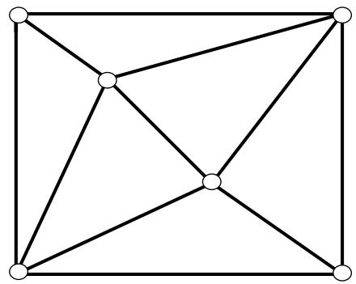

natural_image

Geometric diagram of a square with internal diagonals and marked vertices (no text or symbols)

If the element displacement, stress and strain agree well with the given constant strain state of the elastic body, then the element has passed the patch test.

This method is first proposed by B.M.Irons and has already been proved to be the sufficient condition of the convergence.

## 5.2 Requirements of convergence

## Patch test and the compatibility of the element

Sometimes the compatibility requirement can be relaxed. If the element passes the patch test, then the finite element solution can still converge to the right answer.

This kind of element can be called the non-compatible element.

Some non-compatible elements even possess better accuracy than the compatible elements. But they are regarded as “the illegal element” in the past because they fail to satisfy the compatibile condition.

Why some of the non-compatible elements have better accuracy than the compatible ones?

It is because:

The structure of the finite element obtained by the assumed displacement field is usually more rigid than the practical one. However the non-compatible elements permit the separation or overlap between the elements, which makes the structure of the finite element become more flexible.

These two opposite effects can offset each other and sometimes we can get better results.

## 5.3 Properties of the finite element solution

## ◆ Estimation of the solving accuracy

Still take the plane problem for example to study the solving accuracy and convergence rate of the elements.

The displacement field of the element can be expanded into the following series.

$$
\mathbf {u} = \mathbf {u} _ {i} + \left(\frac {\partial \mathbf {u}}{\partial x}\right) _ {i} \Delta x + \left(\frac {\partial \mathbf {u}}{\partial x}\right) _ {i} \Delta y + \dots
$$

If the size of the element equals h, then $\Delta x$ and $\Delta y$ in the equation above are the magnitude order of h.

If the displacement function of the element adopts the p-order complete polynomial or it can approximate the first p order polynomial of the Taylor series mentioned above, then the error of the displacement solution u will be $O(h^{p+1})$ order.

In terms of the triangle element with 3 nodes, because the interpolation function is linear where p=1, then the error of u is approximately $O(h^{2})$ order. And we can also predict that the rate of convergence is also $O(h^{2})$ order.

## 5.3 Properties of the finite element solution

## ◆ Estimation of the solving accuracy

So if we halve the size of all the elements, the error u will become $(1/2)^{2}=1/4$ of the previous error.

The deduction is also applicable for the error estimation of strain, stress and the strain energy as well as the rate estimation of convergence.

For example when the strain is based on the m order derivative of displacement, its error will be $O(h^{p-m+1})$ order. When we adopt the plane triangle linear element, we have p=m=1. So the strain error is estimated to be $O(h)$ order.

If the strain energy is expressed by the quadratic component of strain, the error is estimated to be $\mathrm{O}(\mathrm{h}^{2}\left(\mathrm{p}-\mathrm{m}+1\right))$ order. For example the error of strain energy is $\mathrm{O}(\mathrm{h}^{2})$ order as for the plane triangle linear element.

## 5.3 Properties of the finite element solution

## ◆ Estimation of the solving accuracy

The finite element solution of the coordinate elements that satisfies the completeness and compatibility requirements is monotonously convergent when the size of the element $h \rightarrow 0$ . So we can extrapolate the result obtained from twice meshing to improve the accuracy.

For the plane triangle linear element, if the result after first meshing is $u_{i}^{(1)}$ , then further halve the element size we can get the result $u_{i}^{(2)}$ .

Because

$$
\frac {u _ {i} ^ {(1)} - u _ {i}}{u _ {i} ^ {(2)} - u _ {i}} \approx \frac {O (h ^ {2})}{O ((h / 2) ^ {2})}
$$

Then we can get better approximate solution by extrapolating

$$
u _ {i} \approx \frac {1}{3} \Big (4 u _ {i} ^ {(2)} - u _ {i} ^ {(1)} \Big)
$$

It should be noticed that the error above is only limited to the discretization error of meshing.

As discussed before the practical errors should contain the error of numeric calculation.

## 5.3 Properties of the finite element solution

## The lower bound of the displacement element solution

The displacement element is the finite element based on the principle of minimum potential energy whose basic unknown quantity is displacement. We can get the properties of the lower bound of the deviation between the approximate and accurate solution.

The discretization form of the total potential energy of the system.

$$
\Pi = \frac {1}{2} \mathbf {a} ^ {T} \mathbf {K a} - \mathbf {a} ^ {T} \mathbf {P}
$$

We can get the solving equation of the finite element method according to $\delta\Pi=0$

$$
\mathbf {K a} = \mathbf {P}
$$

Substitute it into the expression of the total potential energy

$$
\Pi = \frac {1}{2} \mathbf {a} ^ {T} \mathbf {K a} - \mathbf {a} ^ {T} \mathbf {K a} = - \frac {1}{2} \mathbf {a} ^ {T} \mathbf {K a} = - U
$$

The equation above indicates that the total potential energy of the system equals to the opposite number of strain energy in the equilibrium state.

## 5.3 Properties of the finite element solution

The lower bound of displacement element solution So

$$
\Pi \Rightarrow \Pi_ {\min} \quad \Rightarrow \quad U \Rightarrow U _ {\max}
$$

The assumed approximate displacement mode is usually different from the accurate solution in the finite element method, so the total potential energy of the system we get will be bigger than the real one.

Denote the total potential energy, total strain energy, the stiffness matrix and the node displacement of the finite element method as follows

$$
\tilde {\Pi}, \tilde {U}, \tilde {K}, \tilde {a}
$$

The corresponding accurate solutions are

$$
\Pi , U, K, a
$$

## 5.3 Properties of the finite element solution

The lower bound of the displacement element solution

Because

$$
\tilde {\Pi} = - \tilde {U} \geq \Pi = - U \Rightarrow \tilde {U} \leq U
$$

which means

$$
\tilde {\mathbf {a}} ^ {T} \tilde {\mathbf {K}} \tilde {\mathbf {a}} \leq \mathbf {a} ^ {T} \mathbf {K} \mathbf {a}
$$

For the accurate solution we have

$$
\mathbf {K a} = \mathbf {P}
$$

For the approximate solution we have

$$
\tilde {\mathbf {K}} \tilde {\mathbf {a}} = \mathbf {P}
$$

Thus

$$
\tilde {\mathbf {a}} ^ {T} \mathbf {P} \leq \mathbf {a} ^ {T} \mathbf {P}
$$

## 5.3 Properties of the finite element solution

## The lower bound of the displacement element solution

Because

$$
\mathbf {\tilde {a}} ^ {T} \mathbf {P} \leq \mathbf {a} ^ {T} \mathbf {P}
$$

It can be seen that the reason why the approximate strain energy is smaller than the accurate is that the displacement of the approximate solution is smaller than that of the accurate one overall.

So the displacement solution obtained by the displacement element is not bigger than the accurate solution overall. So the solution has a lower bound.

## The explanation of the lower bound is

Every element is originally one part of the continuous body with infinite degrees of freedom.

After the displacement function of the element is assumed, the degree of freedom will become finite expressed by the node displacement. The displacement function constrains and limits the element deformation so the element stiffness is stronger than that of the practical continuous body. Thus the global stiffness matrix increases and the discrete stiffness matrix is larger than the practical one. So the approximate displacement solution is smaller than the accurate one oveal.

## 5.4 Conclusions

## We discussed the basic principles and the equations of the finite element method through the examples of elastic static problems. The main points are as follows

1. Establish the theoretical basis of finite element method and select the type of element

The principle of minimum potential energy and the displacement element whose basic unknown quantities are the node displacements are most commonly used. Almost all the current general programs of finite element analysis take the displacement element as the main form of element.

2. Establish the FEM model

Mainly include the choose of element form, meshing and the setting of boundary conditions, which requires a basic understanding here.

3. Establish the characteristic matrix and the solving equation of finite element method

The element characteristic matrix includes the interpolation function matrix, the strain matrix and finally we should establish the element stiffness matrix and the load vector to obtain the governing equation of finite element method.

4. Choose the numerical method and solve the equation of finite element method We'll discuss this in more details later on.

5. About the convergence of finite element solution

Provide the requirements for completeness that must contain the rigid body displacement and the displacement mode of constant strain. Meanwhile the element boundary must satisfy the requirement for continuity compatibility.

## 5.4 Conclusions

After establishing the basis of finite element method we'll discuss how to set up elements and the corresponding element analysis in the following chapter without any complete description of solving process. The establishment of element shape function is one of the most crucial and skillful steps.

One of the most important characteristics of FEM is to adopt the interpolation function as the displacement mode.

The element nodes we discussed before are all the corner nodes of the element. And as we use the linear interpolation the computational accuracy is not very good. One of the effective methods to improve the FEM accuracy is to increase the accuracy of interpolation (high order interpolation)

Generally speaking when use the finite element method to solve problems we should first consider and determine the element form and the corresponding interpolation and then carry on the rest steps according to the routine process.

Here we recommend two mathematical software for more efficient calculation

Matlab: numerical calculation expertise  
Mathematica: symbolic computation expertise

## 谢谢！