## Chapter 4

# Construction of element and shape functions

## Contents

1 Introduction  
2 Two-dimensional situation  
3 Three-dimensional situation  
4 Isoparametric element and numerical integration  
5 Conclusion

## I. Introduction

## 1.1 Introduction

As mentioned before, the construction of element shape function is one of the most important and skillful processes. That's because:

1. The calculation of the element stiffness matrix, the assembling of the global stiffness matrix and solving the finite element equations can be standardized and automated.

2. The basis function in the finite element space is generated by the shape function so it is related to the convergence and the convergence accuracy.

Generally speaking, the selection of elements depends on the geometric features, equation types and the expected solving accuracy of the structure or the solving domain.

The interpolation or shape functions of the finite element depend on the shape, node type and node number of the element.

## 1.1 Introduction

So following factors have to be determined before constructing the element:

## 1. The geometric shape of the element

one-dimensional element can be either a line or a curve  
two-dimensional element can be a triangle, rectangle or an arbitrary quadrilateral  
three-dimensional element can be a tetrahedron, a pentahedron, triangular prism or hexahedron.

## 2. The number and the distribution of the nodes

The element nodes can be the interior nodes when located inside the element or the exterior nodes when on the boundary.

To facilitate the construction of shape function, the nodes are usually arranged at some special locations. For example the two end points of the one-dimensional element, the three vertexes of the triangle, the midpoints of three sides and the centroid.

## 3. The DOF of the nodes

For the solid element in the elastic mechanics, the node parameters can be the displacements of the node, which means the nodes of n-dimensional problems have n degrees of freedom. This kind of nodes is the Lagrange type. For the structural element, the nodes have both the displacement and the derivatives (rotation) of its displacement field, which means the n-dimensional problems have 2n degrees of freedom. In some other physical field coupling elastic mechanics problems, the DOF of nodes will increase. This kind of nodes can be called the Hermite type.

## 1.1 Introduction

The interpolation can be divided into two types corresponding to the node types.

Lagrange interpolation only requires the interpolation polynomial is known at the interpolation points.

Hermite interpolation also requires the derivatives of the polynomial (including the first-order, second-order or normal...) to be known.

Now let's introduce the one-dimensional situation.

Suppose the interval $[a,b]$ is divided into several elements and the nodes are $a=x_{1}<x_{2}<\ldots<x_{n}=b$ 。

The value of function $f(x)$ is known at every node. Try to solve the linear

Lagrange interpolation function $L_{f}$ and

1. $L_{f}(x_{i})=f(x_{i})$ ( $i=1,2,\ldots,N$ )  
2. First order polynomial in every element:

Obviously we only need to establish the expression of $L_{f}$ in every element $e_{i}$ .

As discussed before

$$
L _ {f} (x) = f (x _ {i}) \frac {x _ {i + 1} - x}{L _ {i}} + f (x _ {i + 1}) \frac {x - x _ {i}}{L _ {i}} \quad (x _ {i} <   x <   x _ {i + 1})
$$

Where $L_{i}$ represents the length $x_{i+1}-x_{i}$ of the element $e_{i}$ .

## 1.2 One-dimensional situation

## Linear Lagrange interpolation and the length coordinate

If $Q_{1}$ , $Q_{2}$ and Q respectively represent the point whose coordinate is $x_{i}$ , $x_{i+1}$ and x. And

$$
\lambda_ {1} (x) = \frac {x _ {i + 1} - x}{L _ {i}} \quad \lambda_ {2} (x) = \frac {x - x _ {i}}{L _ {i}} \quad \underbrace {\bigwedge_ {X _ {i}} ^ {Q _ {1}} \cdots \bigwedge_ {X _ {i + 1}} ^ {Q _ {2}}} _ {}
$$

Then the expression of $L_{i}(x)$ can be written as

$$
L _ {f} (Q) = f (Q _ {i}) \lambda_ {i} + f (Q _ {i + 1}) \lambda_ {i + 1} Q \in e _ {i}
$$

$\lambda_{1}$ and $\lambda_{2}$ are the basis functions of the linear interpolation of element $e_{i}$ , which just equal to the length ratio

$$
\lambda_ {1} = \frac {\left| Q Q _ {2} \right|}{\left| Q _ {1} Q _ {2} \right|} \quad \lambda_ {2} = \frac {\left| Q Q _ {1} \right|}{\left| Q _ {1} Q _ {2} \right|}
$$

And $\left\{ \begin{array}{l}x = x_{1}\lambda_{1} + x_{2}\lambda_{2}\\ 1 = \lambda_{1} + \lambda_{2} \end{array} \right.$

So the coordinate x is in one-to-one correspondence with $(\lambda_{1}, \lambda_{2})$ that satisfies the relationship $\lambda_{1}+\lambda_{2}=1$ and $(\lambda_{1}, \lambda_{2})$ can also be regarded as coordinate like x. Because they just equal to the length ratio, they can also be called the length coordinate (only one variable is independent).

## 1.2 One-dimensional situation

## Linear Lagrange interpolation and the length coordinate

Generally speaking, exchanging the integral of x to the integration constant of length coordinate is usually very convenient. Especially when the integrand has already been expressed by the length coordinate.

$$
\int_ {Q _ {1}} ^ {Q _ {2}} F (\lambda_ {1} (x), \lambda_ {2} (x)) d x = \int_ {0} ^ {1} F (\lambda_ {1}, 1 - \lambda_ {1}) \left| \frac {d x}{d \lambda_ {1}} \right| d \lambda_ {1} = L \int_ {0} ^ {1} F (\lambda_ {1}, 1 - \lambda_ {1}) d \lambda_ {1}
$$

So we can transform the integral of an arbitrary interval $Q_{1}Q_{2}$ to a standard interval $[0, 1]$ , which is very useful in high-dimensional element integral.

According to the Euler integral formula

$$
\int_ {0} ^ {1} t ^ {m} (1 - t) ^ {n} d t = \frac {n}{m + 1} \int_ {0} ^ {1} t ^ {m + 1} (1 - t) ^ {n - 1} d t = \dots
$$

$$
= \frac {n !}{(m + 1) \cdots (m + n)} \int_ {0} ^ {1} t ^ {m + n} d t = \frac {m ! n !}{(m + n + 1) !}
$$

We have

$$
\int_ {Q _ {1}} ^ {Q _ {2}} \lambda_ {1} ^ {\alpha_ {1}} \lambda_ {2} ^ {\alpha_ {2}} d x = L \int_ {1} ^ {2} \lambda_ {1} ^ {\alpha_ {1}} (1 - \lambda_ {1}) ^ {\alpha_ {2}} d \lambda_ {1} = \frac {\alpha_ {1} ! \alpha_ {2} !}{(\alpha_ {1} + \alpha_ {2} + 1) !}
$$

This formula is very useful when calculating the element stiffness coefficients and the load vector, which can be extended to the high-dimensional situation.

## 1.2 One-dimensional situation

## Linear Lagrange interpolation and the length coordinate

Now let's discuss how to transform an arbitrary kth-order polynomial $p_k(x)$ into the homogeneous polynomial of $\lambda_1$ and $\lambda_2$ :

Multiply an arbitrary term $x^{r}(r \leq k)$ of $p_{k}(x)$ by $(\lambda_{1} + \lambda_{2})^{r}$ .

We should notice that even there are many different forms when transforming the kth-order polynomial $p_{k}(x)$ into the kth-order polynomial of $\lambda_{1}$ and $\lambda_{2}$ , the homogeneous form is unique.

We only need to prove for any $\lambda_{1}\in[0,1]$ , if $\sum_{n=0}^{k}a_{n}\lambda_{1}^{n}(1-\lambda_{1})^{k-n}\equiv0$ , then $a_{n}=0\ (n=0,1,\ldots,k)$ .

## Prove:

Select $k+1$ different points $\beta_{i}(i=0,1,\ldots,k)$ in an open interval $(0,1)$ , because

$$
\sum_ {n = 0} a _ {n} \beta_ {i} ^ {n} (1 - \beta_ {i}) ^ {k - n} = 0 \quad (i = 0, 1, \dots , k)
$$

The coefficient matrix is

$$
\left| \begin{array}{c c c c} (1 - \beta_ {0}) ^ {k} & (1 - \beta_ {0}) ^ {k - 1} \beta_ {0} & \dots & \beta_ {0} ^ {k} \\ (1 - \beta_ {1}) ^ {k} & (1 - \beta_ {1}) ^ {k} \beta_ {1} & \dots & \beta_ {1} ^ {k} \\ \dots & \dots & \dots & \dots \\ (1 - \beta_ {k}) ^ {k} & (1 - \beta_ {k}) ^ {k - 1} \beta_ {k} & \dots & \beta_ {k} ^ {k} \end{array} \right| = \prod_ {i = 0} ^ {k} (1 - \beta_ {i}) ^ {k}
$$

$$
\left| \begin{array}{c c c c} 1 & \frac {\beta_ {0}}{1 - \beta_ {0}} & \dots & \left(\frac {\beta_ {0}}{1 - \beta_ {0}}\right) ^ {k} \\ 1 & \frac {\beta_ {1}}{1 - \beta_ {1}} & \dots & \left(\frac {\beta_ {1}}{1 - \beta_ {1}}\right) ^ {k} \\ \dots & \dots & \dots & \dots \\ 1 & \frac {\beta_ {k}}{1 - \beta_ {k}} & \dots & \left(\frac {\beta_ {k}}{1 - \beta_ {k}}\right) ^ {k} \end{array} \right|
$$

$$
= \prod_ {i = 0} ^ {k} (1 - \beta_ {i}) ^ {k} \prod_ {0 \leq i <   j \leq k} ^ {k} (\frac {\beta_ {i}}{1 - \beta_ {i}} - \frac {\beta_ {j}}{1 - \beta_ {j}}) \neq 0
$$

Vandermonde
determinant

So the homogeneous systems have only zero solution $a_{n}=0$ .


<details>
<summary>text_image</summary>

When i≠j,
βi≠βj
</details>

## 1.2 One-dimensional situation

## High-order Lagrange interpolation

The value $f(x_{i})$ ( $i=1,2,\ldots,N$ ) of the function $f(x)$ at the vertex of every element and the value $f(\underline{x}_{i})$ ( $i=1,2,\ldots,N-1$ ) at the midpoints are already known. Please try to solve the second order Lagrange interpolation function $L_{f}$ as follows

1. $L_{i}(x_{i})=f(x_{i})$ ( $i=1,2,\ldots,N$ )

$$
\mathrm{L} _ {i} \left(\underline {{x}} _ {\mathrm{i}}\right) = f \left(\underline {{x}} _ {\mathrm{i}}\right) (i = 1, 2, \dots \dots , \mathrm{N} - 1)
$$

2. Quadratic expression in every element

Because the quadratic polynomial $a_{1}+a_{2}x+a_{3}x^{2}$ have three parameters, the function value $x_{i}$ at the midpoint of elements is given. If only the function values at both end points are given then they can not be uniquely determined.

Usually we directly write the algebraic equations that the coefficients $a_{1}$ , $a_{2}$ and $a_{3}$ satisfy

to prove the uniqueness

$$
\left\{ \begin{array}{c} a _ {1} + a _ {2} x _ {i} + a _ {3} x _ {i} ^ {2} = f (x _ {i}) \\ a _ {1} + a _ {2} \underline {{x}} _ {i} + a _ {3} \underline {{x}} _ {i} ^ {2} = f (\underline {{x}} _ {i}) \\ a _ {1} + a _ {2} x _ {i + 1} + a _ {3} x _ {i + 1} ^ {2} = f (x _ {i + 1}) \end{array} \right.
$$

Then we prove the coefficient determinant doesn't equal zero. So the coefficient only has the non-zero solution, which means it's unique.

But this method is usually very complicated, especially when solving the high-dimensional problems.

Now let's discuss another method, which is both simple and easy to be generalized.

## 1.2 One-dimensional situation

## High-order Lagrange interpolation

To prove the uniqueness of the interpolation function $L_{f}$ , we only need to prove that $L_{f} \equiv 0$ in the interval $[x_{i}, x_{i+1}]$ if

$$
f (x _ {i}) = f (x _ {i + 1}) = f (\underline {{x}} _ {i}) = 0
$$

Prove:

$L_{f}$ is a polynomial and

$$
\left\{ \begin{array}{c} L _ {f} (x _ {i}) = f (x _ {i}) = 0 \\ L _ {f} (\underline {{x}} _ {i}) = f (\underline {{x}} _ {i}) = 0 \\ L _ {f} (x _ {i + 1}) = f (x _ {i + 1}) = 0 \end{array} \right.
$$

So it must contain the following factors at the same time.

$$
L _ {f} (x) = C (x) (x - x _ {i}) (x - x _ {i + 1}) (x - \underline {{x}} _ {i})
$$

Quadric expression it is so $C(x) \equiv 0$ (otherwise $L_{f}$ is more than three degrees) and $L_{f} \equiv 0$ .

To establish $L_{f}$ , we only need to establish the quadratic functions $N1(x)$ , $N2(x)$ and $N3(x)$ in every element that satisfy

$$
\left\{ \begin{array}{l l} N _ {1} (x _ {i}) = 1, & N _ {1} (\underline {{x}} _ {i}) = N _ {1} (x _ {i + 1}) = 0 \\ N _ {2} (x _ {i + 1}) = 1, & N _ {2} (x _ {i}) = N _ {2} (\underline {{x}} _ {i}) = 0 \\ N _ {3} (\underline {{x}} _ {i}) = 1, & N _ {3} (x _ {i}) = N _ {3} (x _ {i + 1}) = 0 \end{array} \right.
$$

## 1.2 One-dimensional situation

## High-order Lagrange interpolation

After this set of functions we have the following relationship in the element $[x_{i}, x_{i+1}]$

$$
L _ {f} (x) = f (x _ {i}) N _ {1} (x) + f (x _ {i + 1}) N _ {2} (x) + f (\underline {{x}} _ {i}) N _ {3} (x)
$$

$N_{1}(x)$ , $N_{2}(x)$ and $N_{3}(x)$ are called the basis functions of the quadratic interpolation of element $e_{i}$ , which can be easily obtained by the length coordinate.

Take $N_{1}(x_{i})$ for example.

Take $N_{1}(x_{i})$ for example. $N_{1}(x_{i+1}) = N_{1}(\underline{x}_{i}) = 0$ must be satisfied so the factor $\lambda_{1}(\lambda_{1} - \frac{1}{2})$ must be contained according to the property of length coordinate.

Multiply by proper coefficient to make it satisfy $N_{1}(x_{i})=1$ , which means

$$
N _ {1} (x) = \frac {\lambda_ {1} (\lambda_ {1} - \frac {1}{2})}{\left. \lambda_ {1} (\lambda_ {1} - \frac {1}{2}) \right| _ {\lambda_ {1} = 1}} = 2 \lambda_ {1} (\lambda_ {1} - \frac {1}{2})
$$

Similarly

$$
N _ {2} (x) = \frac {\lambda_ {2} (\lambda_ {2} - \frac {1}{2})}{\left. \lambda_ {2} (\lambda_ {2} - \frac {1}{2}) \right| _ {\lambda_ {2} = 1}} = 2 \lambda_ {2} (\lambda_ {2} - \frac {1}{2}) \quad N _ {3} (x) = \frac {\lambda_ {1} \lambda_ {2}}{\left. \lambda_ {1} \lambda_ {2} \right| _ {\lambda_ {1} = \lambda_ {2} = \frac {1}{2}}} = 4 \lambda_ {1} \lambda_ {2}
$$

## 1.2 One-dimensional situation

## ◆High-order Lagrange interpolation

Generally speaking, if the function values at $k+1$ nodes are given in the element $e_{i}=[x_{i},x_{i+1}]$ , which means

$$
f (x _ {i} ^ {(j)}) \quad (j = 1, 2, \dots , k + 1, x _ {i} ^ {(1)} = x _ {i}, x _ {i} ^ {(k + 1)} = x _ {i + 1})
$$

Then we can establish the kth-order Lagrange interpolation function.

1. $L_{f}^{(k)}(x_{i}^{(j)}) = f(x_{i}^{(j)})$ $(i=1,\cdots,N;\quad j=1,\cdots,k+1)$  
2. kth-order expression in every element $e_{i}$

The corresponding basis functions can also be easily expressed by the length coordinate

It should be noticed that the approximating accuracy of the interpolation function will increase with the increase in k. But the smoothness between adjacent elements is not improved and the function is still $C^{0}$ continuous.

It means for the displacement field only displacement is continuous but not the rotation (derivative). So it's obviously improper to adopt it as the displacement mode for beam element.

That's why we introduce the Hermite interpolation.

## 1.2 One-dimensional situation

## Hermite cubic interpolation

If both the interpolation polynomial itself and its derivatives (including the first-order, second-order or the normal derivative) are required to be known at the interpolating points, it is called the Hermite interpolation.

The function value $f(x_{i})$ of $f(x)$ at every vertex of the elements and the derivative $f'(x_{i})$ ( $i=1,2,\ldots,N$ ) are known. Solve $H_{f}$ that satisfy

1. $\mathrm{H}_{f}(x_{\mathrm{i}})=f(x_{\mathrm{i}})(i=1,2,\ldots,N)$

$$
\mathrm{H} _ {f} ^ {\prime} \left(x _ {\mathrm{i}}\right) = f ^ {\prime} \left(x _ {\mathrm{i}}\right) (i = 1, 2, \dots \dots , \mathrm{N})
$$

2. $H_{f}$ is a cubic expression in every element $e_{i}$ .

Similar to the proving of uniqueness of high-degree Lagrange interpolation function, we can prove that Hermite cubic interpolation is also unique.

## 1.2 One-dimensional situation

## Hermite cubic interpolation

We only need to establish four basis functions $\mathrm{N}_{1}(x)$ , $\mathrm{N}_{2}(x)$ , $\mathrm{M}_{1}(x)$ and $\mathrm{M}_{2}(x)$ of element $e_{i}$ , which are all three order expressions and satisfy

$$
N _ {1} (x _ {i}) = 1, \quad N _ {1} ^ {\prime} (x _ {i}) = N _ {1} (x _ {i + 1}) = N _ {1} ^ {\prime} (x _ {i + 1}) = 0
$$

$$
N _ {2} (x _ {i + 1}) = 1, N _ {2} ^ {\prime} (x _ {i + 1}) = N _ {2} (x _ {i}) = N _ {2} ^ {\prime} (x _ {i}) = 0
$$

$$
M _ {1} ^ {\prime} (x _ {i}) = 1, \quad M _ {1} (x _ {i}) = M _ {1} (x _ {i + 1}) = M _ {1} ^ {\prime} (x _ {i + 1}) = 0
$$

$$
M _ {1} ^ {\prime} (x _ {i + 1}) = 1, \quad M _ {2} (x _ {i}) = M _ {2} (x _ {i + 1}) = M _ {2} ^ {\prime} (x _ {i}) = 0
$$

Adopt the length coordinate and because $\frac{d\lambda_{1}}{dx}=-\frac{1}{L_{i}}$

Then $N_{1}(x_{i+1})=N_{1}^{\prime}(x_{i+1})=0 \Rightarrow N_{1}\big|_{\lambda_{1}=0}=0;\quad\frac{dN_{1}}{d\lambda_{1}}\bigg|_{\lambda_{1}=0}=N_{1}^{\prime}(x_{i+1})\frac{dx}{d\lambda_{1}}=0$

So we have $N_{1}=\frac{\lambda_{1}^{2}}{\left.\lambda_{1}^{2}\right|_{\lambda_{1}=1}}=\lambda_{1}^{2}$

Similarly we can get the length coordinate expression of $N_{2}$ $M_{1}$ $M_{2}$

## 1.2 One-dimensional situation

## ◆Generalized expression of Lagrange interpolation function

We introduce the generalized expression here to facilitate the establishment of other forms of Lagrange elements.

$$
N _ {i} = l _ {i} ^ {(n - 1)} = \prod_ {j = 1, j \neq i} ^ {n} \frac {f _ {j} (\xi)}{f _ {j} (\xi_ {i})}
$$

Where $f_{j}(\xi) = \xi - \xi_{j}$ represent the distance between an arbitrary point and the node $j$ . It is obvious that $f_{j}(\xi) = 0$ .

$$
f _ {j} (\xi_ {j}) = 0
$$

So the expansion of this interpolation form contains the factors of all the $f_{j}(\xi)$ (j=1,2,...,i-1, i+1,...,n) except $f_{i}(\xi)$ and ensure

$$
N _ {i} (\xi_ {j}) = 0 (i \neq j)
$$

$f_{i}(\xi_{i}) = \xi_{i} - \xi_{j}$ is the value obtained after the coordinate of point i is substituted. The factor is introduced to denominator to ensure

$$
N _ {i} (\xi_ {i}) = 1
$$

So

$$
N _ {i} (\xi_ {j}) = \delta_ {i j}
$$

## II. Two-dimensional element

## 2.1 Triangular element

Two-dimensional interpolation is the natural generalization of the one-dimensional one. They share a lot of similarities such like the uniqueness proving method and the establishment of basis functions.

But new features and difficulties will certainly emerge with the increase of the regional dimension.

1. Two-dimensional interpolation is closely related to the regional division including triangle, rectangle and arbitrary quadrilateral division.  
2. What connects two elements is not only a node with given interpolation condition but a common side with nodes.  
So the continuity of interpolation function at nodes can't guarantee the continuity on the whole public side. That's why we should carefully consider the continuity of interpolation function in the entire domain.  
3. The interpolating points can be both the element vertexes and the boundary points or even the interior points.

## 2.1 Triangular element

The triangular elements are widely used for the two-dimensional problems. That's not only because of the simplicity and flexibility of its shape, which can easily adapt to the shape of the domain, but also the easy and standardized establishment of the element shape function after adopting the corresponding area coordinate.

## Linear interpolation (Lagrange) and the area coordinates

As discussed before the basis functions of linear triangular element are

$$
N _ {i} (x, y) = \frac {1}{2 \Delta_ {e}} (a _ {i} x + b _ {i} y + c _ {i}) \quad (i = 1, 2, 3)
$$

Similarly to the one-dimensional interpolation, the basis functions of linear interpolation play an important role in the triangular division. Take N1 for example.

$$
\begin{array}{l} N _ {1} (x, y) = \frac {1}{2 \Delta_ {e}} \left(a _ {1} x + b _ {1} y + c _ {1}\right) \\ = \frac {1}{2 \Delta_ {e}} (\left| \begin{array}{c c} y _ {2} & 1 \\ y _ {3} & 1 \end{array} \right| x - \left| \begin{array}{c c} x _ {2} & 1 \\ x _ {3} & 1 \end{array} \right| y + \left| \begin{array}{c c} x _ {2} & y _ {2} \\ x _ {3} & y _ {3} \end{array} \right|) \\ = \frac {1}{2 \Delta_ {e}} \left| \begin{array}{c c c} 1 & x & y \\ 1 & x _ {2} & y _ {2} \\ 1 & x _ {3} & y _ {3} \end{array} \right| = \frac {\Delta_ {Q Q _ {2} Q _ {3}}}{\Delta_ {Q _ {1} Q _ {2} Q _ {3}}} \\ \end{array}
$$

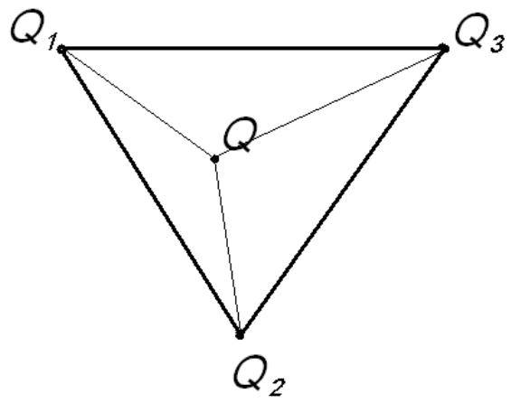

<details>
<summary>text_image</summary>

Q₁
Q₂
Q
Q₃
</details>

## 2.1 Triangular element

## Linear interpolation (Lagrange) and the area coordinates

Similarly we have

$$
N _ {2} (x, y) = \frac {\Delta_ {Q _ {1} Q Q _ {3}}}{\Delta_ {Q _ {1} Q _ {2} Q _ {3}}} N _ {3} (x, y) = \frac {\Delta_ {Q _ {1} Q _ {2} Q}}{\Delta_ {Q _ {1} Q _ {2} Q _ {3}}}
$$

Let

$$
\lambda_ {i} = N _ {i} (x, y) \quad (i = 1, 2, 3)
$$

Then the transformation relation between the area coordinates and the rectangular coordinates is as follows.

$$
{\left[ \begin{array}{l} \lambda_ {1} \\ \lambda_ {2} \\ \lambda_ {3} \end{array} \right]} = {\frac {1}{2 \Delta_ {e}}} {\left[ \begin{array}{l l l} a _ {1} & b _ {1} & c _ {1} \\ a _ {2} & b _ {2} & c _ {2} \\ a _ {3} & b _ {3} & c _ {3} \end{array} \right]} {\left[ \begin{array}{l} x \\ y \\ 1 \end{array} \right]}
$$

It is obvious that $(\lambda_{1},\lambda_{2},\lambda_{3})$ is in one-to-one correspondence to $(x,y)$ , so the former can also be used as coordinates, which can be called as the area coordinates considering the geometric meaning.

We should notice that there are only two independent variables in the area coordinates and they should satisfy

$$
\lambda_ {1} + \lambda_ {2} + \lambda_ {3} = 1
$$

If $\lambda_{1}$ and $\lambda_{2}$ are independent variables then it can be regarded as linear transformation to transform every triangular element in the plane x-y to the standard triangular element in the plane $\lambda_{1}-\lambda_{2}$ .

## 2.1 Triangular element

## Linear interpolation (Lagrange) and the area coordinates

The area coordinates have the following properties

1. The area coordinates of the three vertexes $Q_{1}, Q_{2}, Q_{3}$ and the centroid of the triangle are 1, 1, 1

$$
(1, 0, 0) \quad (0, 1, 0) \quad (0, 0, 1) \quad (\frac {1}{3}, \frac {1}{3}, \frac {1}{3})
$$

2. The equations of the three sides of the triangle are

$$
\lambda_ {1} = 0 \left(Q _ {2} Q _ {3} \text {边}\right) \quad \lambda_ {2} = 0 \left(Q _ {1} Q _ {3} \text {边}\right) \quad \lambda_ {3} = 0 \left(Q _ {1} Q _ {2} \text {边}\right)
$$

3. Every point has the same coordinate $\lambda_{i}$ on the lines parallel to the opposite side jm of the node i in the triangle.

4. Similar to the one-dimensional length coordinate, the kth-order polynomial of any x and y can be transformed into the kth-order homogeneous polynomial of $\lambda_{1}$ , $\lambda_{2}$ and $\lambda_{3}$ . Also it is unique.

## 2.1 Triangular element

## Linear interpolation (Lagrange) and the area coordinates

The area coordinates have the following properties

5. The inverse transformation between the area coordinates and rectangular coordinates

$$
{\left[ \begin{array}{l} x \\ y \\ 1 \end{array} \right]} = {\left[ \begin{array}{l l l} x _ {1} & x _ {2} & x _ {3} \\ y _ {1} & y _ {2} & y _ {3} \\ 1 & 1 & 1 \end{array} \right]} {\left[ \begin{array}{l} \lambda_ {1} \\ \lambda_ {2} \\ \lambda_ {3} \end{array} \right]}
$$

6. When solving the derivative of the function expressed by the area coordinate to the rectangular coordinates, according to the compound derivation law we

have

$$
\left\{ \begin{array}{l} \frac {\partial}{\partial x} = \frac {\partial}{\partial \lambda_ {1}} \frac {\partial \lambda_ {1}}{\partial x} + \frac {\partial}{\partial \lambda_ {2}} \frac {\partial \lambda_ {2}}{\partial x} + \frac {\partial}{\partial \lambda_ {3}} \frac {\partial \lambda_ {3}}{\partial x} = \frac {1}{2 \Delta_ {e}} \Bigg (a _ {1} \frac {\partial}{\partial \lambda_ {1}} + a _ {2} \frac {\partial}{\partial \lambda_ {2}} + a _ {3} \frac {\partial}{\partial \lambda_ {3}} \Bigg) \\ \frac {\partial}{\partial y} = \frac {\partial}{\partial \lambda_ {1}} \frac {\partial \lambda_ {1}}{\partial y} + \frac {\partial}{\partial \lambda_ {2}} \frac {\partial \lambda_ {2}}{\partial y} + \frac {\partial}{\partial \lambda_ {3}} \frac {\partial \lambda_ {3}}{\partial y} = \frac {1}{2 \Delta_ {e}} \Bigg (b _ {1} \frac {\partial}{\partial \lambda_ {1}} + b _ {2} \frac {\partial}{\partial \lambda_ {2}} + b _ {3} \frac {\partial}{\partial \lambda_ {3}} \Bigg) \end{array} \right.
$$

If express the interpolation function by the area coordinates in the finite element calculation, it'll bring great convenience to integral computation.

## 2.1 Triangular element

## - Linear interpolation (Lagrange) and the area coordinates

Now we have

$$
\iint_ {\Omega e} F (\lambda_ {1} (x, y), \lambda_ {2} (x, y), \lambda_ {3} (x, y)) d x d y
$$

$$
= \iint_ {O A B} F (\lambda_ {1}, \lambda_ {2}, \lambda_ {3}) \left| \frac {\partial (x , y)}{\partial (\lambda_ {1} , \lambda_ {2})} \right| d \lambda_ {1} d \lambda_ {2}
$$

$$
= 2 \Delta_ {e} \int_ {0} ^ {1} d \lambda_ {1} \int_ {0} ^ {1 - \lambda_ {1}} F (\lambda_ {1}, \lambda_ {2}, 1 - \lambda_ {1} - \lambda_ {2}) d \lambda_ {2}
$$

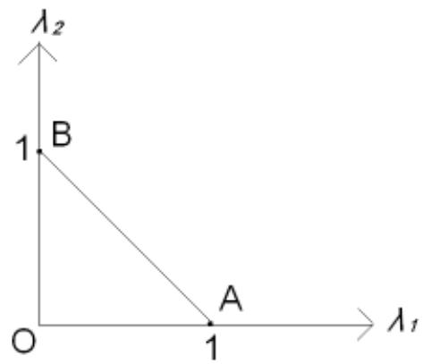

<details>
<summary>text_image</summary>

λ₂
1 B
O 1 λ₁
A
</details>

We can obtained a very useful formula using the Euler integral formula

$$
\iint_ {\Omega e} \lambda_ {1} ^ {\alpha_ {1}} \lambda_ {2} ^ {\alpha_ {2}} \lambda_ {3} ^ {\alpha_ {3}} d x d y = 2 \Delta_ {e} \int_ {0} ^ {1} d \lambda_ {1} \int_ {0} ^ {1 - \lambda_ {1}} \lambda_ {1} ^ {\alpha_ {1}} \lambda_ {2} ^ {\alpha_ {2}} (1 - \lambda_ {1} - \lambda_ {2}) ^ {\alpha_ {3}} d \lambda_ {2}
$$

$$
= \frac {\alpha_ {1} ! \alpha_ {2} ! \alpha_ {3} !}{(\alpha_ {1} + \alpha_ {2} + \alpha_ {3} + 2) !} 2 \Delta_ {e}
$$

## 2.1 Triangular element

## High-degree Lagrange interpolation

As shown in the picture, a quadratic element has 6 nodes and the area coordinates of each node is denoted in the bracket.

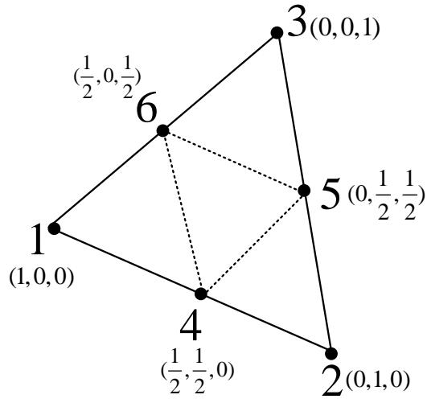

<details>
<summary>text_image</summary>

1
(1,0,0)
4
(½,½,0)
5
(0,½,½)
6
3(0,0,1)
2(0,1,0)
(½,0,½)
</details>

According to the generalized expression of the Lagrange interpolation mentioned before, the interpolation function can be expressed as

$$
N _ {i} = \prod_ {j = 1} ^ {2} \frac {f _ {j} ^ {(i)} (L _ {1} , L _ {2} , L _ {3})}{f _ {j} ^ {(i)} (L _ {1 i} , L _ {2 i} , L _ {3 i})}
$$

Where

$$
f _ {j} ^ {(i)} (L _ {1}, L _ {2}, L _ {3}), f _ {j} ^ {(i)} (L _ {1 i}, L _ {2 i}, L _ {3 i})
$$

carry geometric meaning.

## 2.1 Triangular element

## High-degree Lagrange interpolation

Where

$$
f _ {j} ^ {(i)} (L _ {1}, L _ {2}, L _ {3}) \quad (j = 1, 2)
$$

is the left part of the equation of two lines passing through all the nodes except the node i. 3(0)

$$
f _ {j} ^ {(i)} (L _ {1}, L _ {2}, L _ {3}) = 0
$$

For example when i=1, the equation of the line passing through nodes 4 and 6 is $L_{1}-1/2=0$

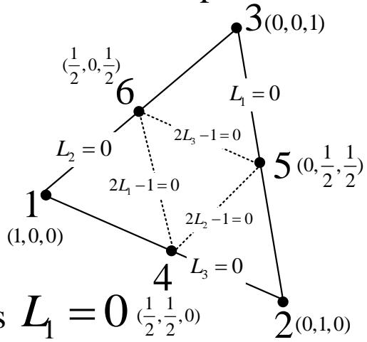

<details>
<summary>flowchart</summary>

```mermaid
graph TD
  1["1 (1,0,0)"] -->|L2 = 0| 6["6"]
  n1["1"] -->|2L1 -1 = 0| 4["4"]
  n4["4"] -->|L3 = 0| 2["2 (0,1,0)"]
    6 -.->|L1 = 0| 3["3 (0,0,1)"]
    4 -.->|2L2 -1 = 0| 5["5 (0,1/2,1/2)"]
  n3["3"] -->|L1 = 0| n5["5"]
    5 -.->|L2 = 0| 6
    style 1 fill:#f9f,stroke:#333
    style 2 fill:#f9f,stroke:#333
    style 3 fill:#ccf,stroke:#333
    style 4 fill:#ccf,stroke:#333
    style 5 fill:#ccf,stroke:#333
    note right of 6: s L1 = 0 (1/2,1/2,0)
```
</details>

The equation of the line passing through the nodes 2, 5 and 3 is $L_{1} = 0$ ( $\frac{1}{2}, \frac{1}{2}, 0$ )

$$
f _ {1} ^ {(1)} (L _ {1}, L _ {2}, L _ {3}) = L _ {1} - 1 / 2 f _ {2} ^ {(1)} (L _ {1}, L _ {2}, L _ {3}) = L _ {1}
$$

So $N_{1} = \frac{L_{1} - 1 / 2}{1 / 2}\bullet \frac{L_{1}}{1} = (2L_{1} - 1)L_{1}$

Similarly we can obtain the rest $N_{i}$ .

We'll call this kind of method of establishing element interpolation function “the method of scraping line”.

## 2.1 Triangular element

## High-degree Lagrange interpolation

We can establish higher degree triangular element if necessary. The processes are as follows.

1. Determine the number and the position of nodes according to the completeness requirement of polynomials in two-dimensional domain.

This requirement can be expressed as the Pascal triangle. For example the number of nodes for cubic element is 10.

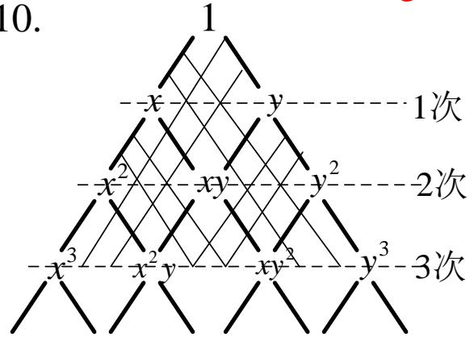

<details>
<summary>flowchart</summary>

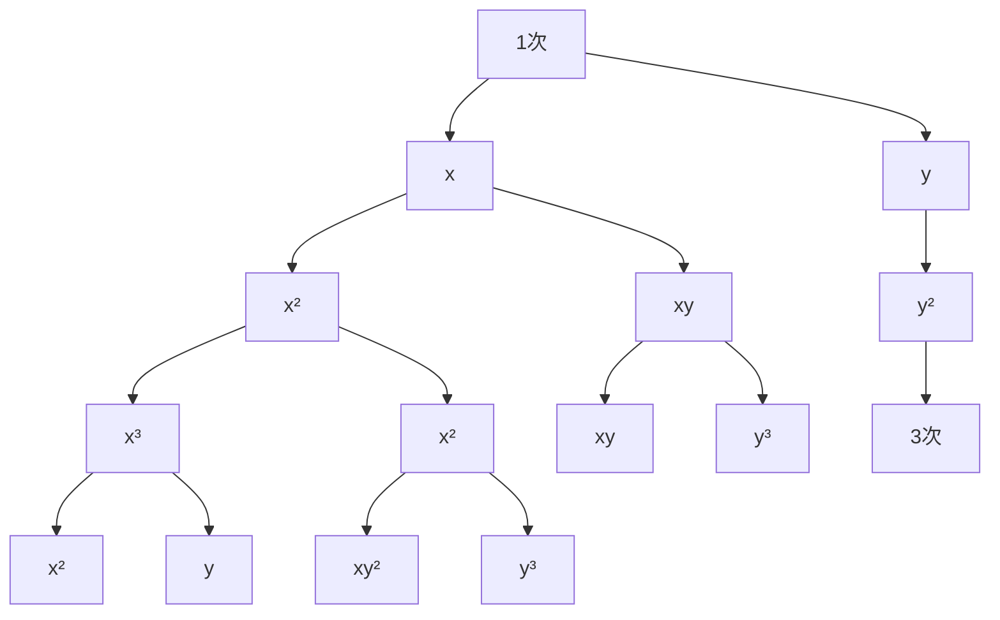
</details>

2. Establish the interpolation function according to the generalized Lagrange interpolation formula.

$$
N _ {i} = \prod_ {j = 1} ^ {p} \frac {f _ {j} ^ {(i)} (L _ {1} , L _ {2} , L _ {3})}{f _ {j} ^ {(i)} (L _ {1 i} , L _ {2 i} , L _ {3 i})}
$$

Where p is the degree of the interpolation function.

Obviously the interpolation function established according to the formula above can satisfy this fundamental requirement.

Besides this kind of element function can be proved to satisfy the convergence criterion due to the properties mentioned above and because the node number and arrangement satisfy the requirement of the Pascal triangle.

## 2.2 Rectangular element

Establishment of the interpolation function of rectangular element can be very different from that of the triangular element, but the accuracy is higher. The rectangular element may not adapt well to the boundary shape but it can develop its advantage when combining with other elements.

Suppose the domain $\Omega$ is divided into the combination of several rectangular elements, it can also be classified into the Lagrange and Hermite type.

We'll discuss the former later on and also the Serendipity element of which the nodes are mainly distributed on the element boundary.

The area coordinates has played an important role in establishing the interpolation function of triangular element whose essence is to transform an arbitrary triangular element in the plane x-y to a standard triangular element in the plane $\lambda_{1}-\lambda_{2}$ .

It is similar to the rectangular division. A square can be chosen as a symmetric and simple standard rectangular.

$$
D \colon \left\{- 1 \leq \xi \leq 1, - 1 \leq \eta \leq 1 \right\}
$$

## 2.2 Rectangular element

For an arbitrary element e: $\{x_{1}\leq x\leq x_{2}, y_{1}\leq y\leq y_{2}\}$ , the transformation from e to the standard rectangular element is

$$
\xi = \frac {x - x _ {c}}{L _ {1}}, \quad \eta = \frac {y - y _ {c}}{L _ {2}}
$$

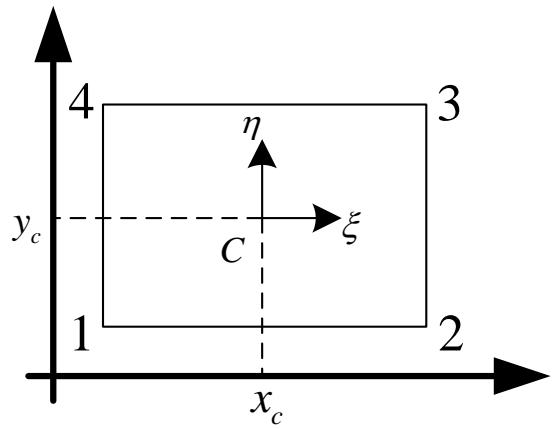

<details>
<summary>text_image</summary>

4
η
3
y_c
ξ
C
1
2
x_c
</details>

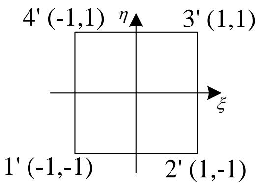

<details>
<summary>text_image</summary>

4' (-1,1) η
3' (1,1)
ξ
1' (-1,-1)
2' (1,-1)
</details>

Where $(x_{c},y_{c})$ is the coordinate of centroid C.

$L_{1}$ and $L_{2}$ is the half length of two sides of the rectangle

$\xi$ and $\eta$ are called the local coordinates, which are adopted when establishing the basis functions of rectangular division.

According to the local coordinates, the equations of the four sides 12, 23, 34 and 41 of element e are as follows

$$
\eta = - 1, \quad \xi = 1, \quad \eta = 1, \quad \xi = - 1
$$

## 2.2 Rectangular element

## Lagrange element

The so-called bilinear interpolation is the interpolation function $L_{\mathrm{f}}(x,y)$ obtained after the function values of four vertexes of element are determined. Its value is fixed at every vertex and it's a bilinear interpolation function in the element. So when the variable x (or y) is fixed, $L_{\mathrm{f}}(x,y)$ is the linear function of y (or x).

We can obtain the basis functions of the bilinear interpolation

$$
\begin{array}{l} N _ {1} = \frac {1}{4} (1 - \xi) (1 - \eta) N _ {2} = \frac {1}{4} (1 + \xi) (1 - \eta) \\ N _ {3} = \frac {1}{4} (1 + \xi) (1 + \eta) N _ {2} = \frac {1}{4} (1 - \xi) (1 + \eta) \\ \end{array}
$$

Or uniformly written as

$$
N _ {i} = \frac {1}{4} (1 + \xi_ {i} \xi) (1 + \eta_ {i} \eta) (i = 1, 2, 3, 4)
$$

Where $(\xi_{i},\eta_{i})$ is the local coordinate of vertex i.

## 2.2 Rectangular element

## Lagrange element

The basis function of the bilinear interpolation is actually the product of the basis functions of the one-dimensional linear interpolation.

Generally speaking, bi-k degree interpolation is the k-degree polynomial of the other variable when one of the variables is fixed. Bi-k degree element has a DOF of $(k+1)^{2}$ .

Take the biquadratic element for example. The function values of four vertexes of the element, midpoints of four sides and the centroid C are required to be known to determine the 9 coefficients of the polynomial.

Now let's first establish the generalized form of Lagrange interpolation by the method of scraping line.

Suppose $N_{i}, M_{i} (i=1,2,3,4)$ and $N_{c}$ are the basis functions respectively corresponding to the points $A_{i}, B_{i}$ and C.

Take $N_{1}$ for example. The equations of the lines $A_{2}B_{3}A_{3}$ , $A_{3}B_{4}A_{4}$ , $B_{1}CB_{3}$ and $B_{2}CB_{4}$ are

$$
\xi = 1, \eta = 1, \eta = 0, \xi = 0
$$

Then

$$
N _ {1} = \frac {\xi \eta (1 - \xi) (1 - \eta)}{\left. \xi \eta (1 - \xi) (1 - \eta) \right| _ {\xi = - 1} ^ {\eta = - 1}} = \frac {1}{4} \xi \eta (1 - \xi) (1 - \eta)
$$

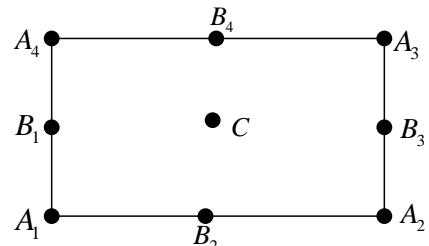

<details>
<summary>text_image</summary>

A₄
B₁
C
A₁
B₂
B₃
A₂
A₃
</details>

Similarly we can obtain the remaining basis functions, which are also the products of one-dimensional quadratic interpolation basis functions. We can establish higher degree Lagrange interpolation in the similar way.

## 2.2 Rectangular element

## Lagrange element

As discussed before, to establish the interpolation function of Lagrange elements is very convenient. However, the defects are also apparent.

The nodes must be increased with the increment of element degree, which will certainly increase the DOF of element.

For example:

first-order element

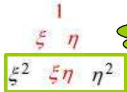

<details>
<summary>text_image</summary>

1
ξ η
ξ² ξη η²
</details>

$$
\begin{array}{l} \xi^ {3} \quad \xi^ {2} \eta \quad \xi \eta^ {2} \quad \eta^ {3} \\ \xi^ {4} \xi^ {3} \eta \xi^ {2} \eta^ {2} \xi \eta^ {3} \eta^ {4} \\ \xi^ {5} \xi^ {4} \eta \xi^ {3} \eta^ {2} \xi^ {2} \eta^ {3} \xi \eta^ {4} \eta^ {5} \\ \xi^ {6} \xi^ {5} \eta \xi^ {4} \eta^ {2} \xi^ {3} \eta^ {3} \xi^ {2} \eta^ {4} \xi \eta^ {5} \eta^ {6} \\ \end{array}
$$

second-order element

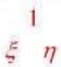

$$
\xi^ {2} \xi \eta \eta^ {2}
$$

$$
\xi^ {3} \quad \xi^ {2} \eta \quad \xi \eta^ {2} \quad \eta^ {3}
$$

$$
\xi^ {4} \xi^ {3} \eta \xi^ {2} \eta^ {2} \xi \eta^ {3} \eta^ {4}
$$

$$
\xi^ {5} \xi^ {4} \eta \xi^ {3} \eta^ {2} \xi^ {2} \eta^ {3} \xi \eta^ {4} \eta^ {5}
$$

$$
\xi^ {6} \xi^ {5} \eta \xi^ {4} \eta^ {2} \xi^ {3} \eta^ {3} \xi^ {2} \eta^ {4} \xi \eta^ {5} \eta^ {6}
$$

third-order element

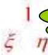

$$
\xi^ {2} \xi \eta \eta^ {2}
$$

37.5%

surplus

$$
\xi^ {3} \xi^ {2} \eta \xi \eta^ {2} \cdot \eta^ {3}
$$

$$
\xi^ {4} \xi^ {3} \eta \xi^ {2} \eta^ {2} \xi \eta^ {3} \eta^ {4}
$$

$$
\xi^ {5} \xi^ {4} \eta \xi^ {3} \eta^ {2} \xi^ {2} \eta^ {3} \xi \eta^ {4} \eta^ {5}
$$

$$
\xi^ {6} \xi^ {5} \eta \xi^ {4} \eta^ {2} \xi^ {3} \eta^ {3} \xi^ {2} \eta^ {4} \xi \eta^ {5} \eta^ {6}
$$

The figures above show that the rth-degree element interpolation function established through this method contains a lot of high degree terms that are not necessary for rth-degree non-complete polynomial.

But the accuracy of element usually depends on the complete polynomial, so these non-complete terms with high degree have little effect to improve the element accuracy.

## 2.2 Rectangular element

## Serendipity element

Zienkiewicz initially proposed this kind of element to decrease the nodes inside the element. Take the quadratic element for example.

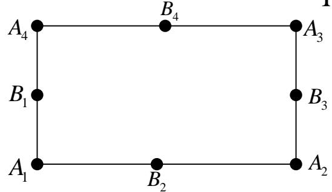

<details>
<summary>text_image</summary>

A₄
B₄
A₃
B₁
B₃
A₁
B₂
A₂
</details>

$$
\begin{array}{c} \text {kample.} \\ \begin{array}{c c c c c c c c} & 1 & & & & & \\ & \xi & \eta & & & & \\ & \xi^ {2} & \xi \eta & \eta^ {2} & & & \\ & \xi^ {3} & \xi^ {2} \eta & \xi \eta^ {2} & \eta^ {3} & & \\ & \xi^ {4} & \xi^ {3} \eta & \xi^ {2} \eta^ {2} & \xi \eta^ {3} & \eta^ {4} & \\ & \xi^ {5} & \xi^ {4} \eta & \xi^ {3} \eta^ {2} & \xi^ {2} \eta^ {3} & \xi \eta^ {4} & \eta^ {5} \\ \xi^ {6} & \xi^ {5} \eta & \xi^ {4} \eta^ {2} & \xi^ {3} \eta^ {3} & \xi^ {2} \eta^ {4} & \xi \eta^ {5} & \eta^ {6} \end{array} \end{array}
$$

Obviously we cannot obtain the complete biquadratic interpolation (8 nodes can't determine 9 coefficients), so we only need to eliminate the last term $\xi^2\eta^2$ of the biquadratic expression. In terms of the approximation, we first start from the term with highest degree.

However this non-complete biquadratic interpolation is still accurate for quadratic polynomial (the complete one is only accurate for quadratic polynomial), so it doesn't decrease the element accuracy but the global DOF.

The result is the same as the Lagrange element as for the linear element.

## 2.2 Rectangular element

## Serendipity element

By distributing the nodes mainly on the sides of the element, the variation of the high-degree function will emerge on the sides of the interpolation function, which will increase the descriptive power on the boundary.

Besides the numbers of nodes on each side of the Serendipity element can be different, which will help transit between elements of different degrees.

## For example

Suppose there are only four corner points. The interpolation function corresponding to these nodes can be established by duo-linear Lagrange polynomial.

$$
\hat {N} _ {i} = \frac {1}{4} (1 + \xi_ {i} \xi) (1 + \eta_ {i} \eta) (i = 1, 2, 3, 4)
$$

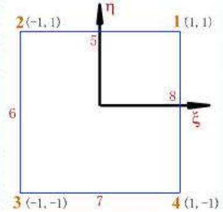

<details>
<summary>text_image</summary>

2(-1,1)
η
5
1(1,1)
6
8
ξ
3(-1,-1)
7
4(1,-1)
</details>

If increase the nodes, the corresponding interpolation function can be established by the method of scraping line, or be directly expressed by the product of quadratic Lagrange interpolation polynomial in the direction of $\xi(\text{ or } \eta)$ and the first degree one in the direction of $\eta(\text{ or } \xi)$ .

For example if add the node 5, we have

$$
N _ {5} = \frac {1}{2} (1 - \xi^ {2}) (1 + \eta)
$$

## 2.2 Rectangular element

## Serendipity element

It should be noticed that in the situation of 5 nodes, N5 satisfies $N_{5j} = \delta_{5j} (j = 1, 2, 3, 4, 5)$ but $\hat{N}_{i}$ doesn't satisfy $\hat{N}_{i5} = \delta_{i5} = 0 \quad (i = 1, 2)$ any more.

So we have to modify it to

$$
N _ {1} = \hat {N} _ {1} - \frac {1}{2} N _ {5} \quad N _ {2} = \hat {N} _ {2} - \frac {1}{2} N _ {5}
$$

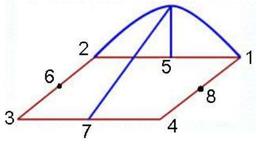

<details>
<summary>text_image</summary>

2
6
7
4
5
1
8
3
</details>

Where coefficient $\frac{1}{2}$ is the value of $\hat{N}_{1}, \hat{N}_{2}$ at the node 5.

The situation is the same for adding nodes 6, 7, 8 on the boundary. The interpolation functions are

$$
N _ {1} = \hat {N} _ {1} - \frac {1}{2} N _ {5} - \frac {1}{2} N _ {8} \quad N _ {2} = \hat {N} _ {2} - \frac {1}{2} N _ {5} - \frac {1}{2} N _ {6}
$$

$$
N _ {3} = \hat {N} _ {3} - \frac {1}{2} N _ {6} - \frac {1}{2} N _ {7} \quad N _ {4} = \hat {N} _ {4} - \frac {1}{2} N _ {7} - \frac {1}{2} N _ {8}
$$

$$
N _ {5} = \frac {1}{2} (1 - \xi^ {2}) (1 + \eta) N _ {6} = \frac {1}{2} (1 - \eta^ {2}) (1 - \xi)
$$

$$
N _ {7} = \frac {1}{2} (1 - \xi^ {2}) (1 - \eta) N _ {8} = \frac {1}{2} (1 - \eta^ {2}) (1 + \xi)
$$

(If any of the nodes 5,6,7,8 doesn't exist, let the corresponding interpolation function be zero)

## 2.2 Rectangular element

## ◆ Serendipity element

We can adopt the same method to establish the interpolation function for the high degree Serendipity element.

For example:

two-dimensional cubic element

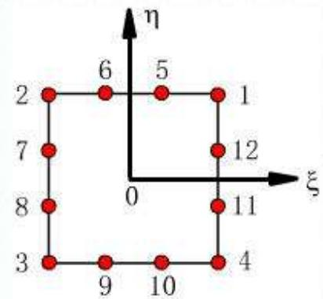

<details>
<summary>scatterplot</summary>

| Point | ξ | η |
|---|---|---|
| 1 | 0 | 1 |
| 2 | 0 | 6 |
| 3 | 0 | 3 |
| 4 | 0 | 4 |
| 5 | 0 | 5 |
| 6 | 0 | 6 |
| 7 | 0 | 7 |
| 8 | 0 | 8 |
| 9 | 0 | 9 |
| 10 | 0 | 10 |
| 11 | 0 | 11 |
| 12 | 0 | 12 |
</details>

two-dimensional quartic element

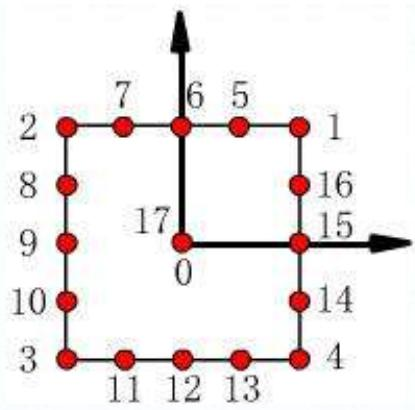

<details>
<summary>scatterplot</summary>

| X | Y |
|---|---|
| 0 | 17 |
| 1 | 1 |
| 2 | 7 |
| 3 | 3 |
| 4 | 4 |
| 5 | 5 |
| 6 | 6 |
| 7 | 7 |
| 8 | 8 |
| 9 | 9 |
| 10 | 10 |
| 11 | 11 |
| 12 | 12 |
| 13 | 13 |
| 14 | 14 |
| 15 | 15 |
| 16 | 16 |
</details>

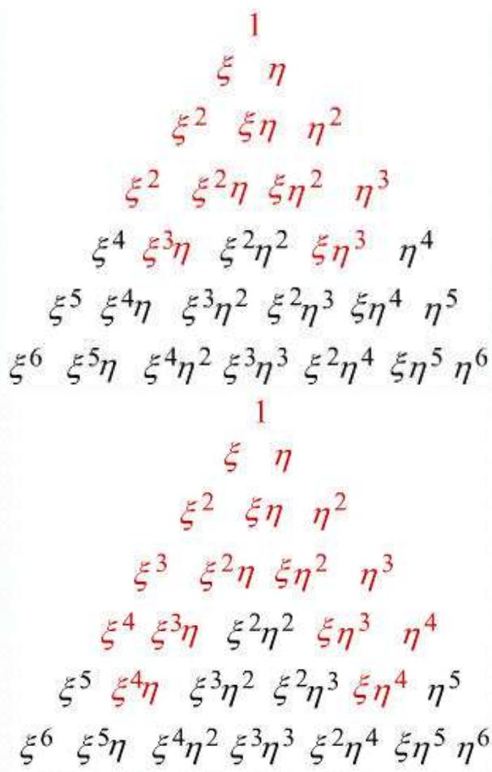

<details>
<summary>text_image</summary>

1
ξ η
ξ² ξη η²
ξ² ξ²η ξη² η³
ξ⁴ ξ³η ξ²η² ξη³ η⁴
ξ⁵ ξ⁴η ξ³η² ξ²η³ ξη⁴ η⁵
ξ⁶ ξ⁵η ξ⁴η² ξ³η³ ξ²η⁴ ξη⁵ η⁶
1
ξ η
ξ² ξη η²
ξ³ ξ²η ξη² η³
ξ⁴ ξ³η ξ²η² ξη³ η⁴
ξ⁵ ξ⁴η ξ³η² ξ²η³ ξη⁴ η⁵
ξ⁶ ξ⁵η ξ⁴η² ξ³η³ ξ²η⁴ ξη⁵ η⁶
</details>

## 2.2 Rectangular element

## Serendipity element

The method introduced before is actually modifying the original basis function of biquadratic interpolation by the analytic method according to the requirement of new interpolation.

However this kind of general method can be very complicated for some simple problems.

## Here's a new approach:

Use the method of scraping line to directly satisfy the requirement of basis functions.

For example

For the node 1 in the picture, first suppose the shape function to be

$$
N _ {1} (\xi , \eta) = C (1 + \xi) (1 + \eta) (\xi + \eta - 1)
$$

Because

$$
N 1 (1) = 1 \Rightarrow C = \frac {1}{4} \Rightarrow N _ {1} (\xi , \eta) = \frac {1}{4} (1 + \xi) (1 + \eta) (\xi + \eta - 1)
$$

This method is very intuitive but can be very difficult to generalize to the complicated problems.

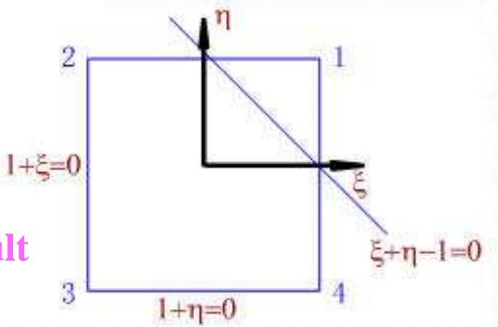

<details>
<summary>text_image</summary>

η
2
1
1+ξ=0
ξ
3
1+η=0
4
ξ+η-1=0
lt
</details>

## III. Three-dimensional element

## 3.1 Tetrahedron element

Three-dimensional element is much more complicated than the two-dimensional one. We only introduce some simple and commonly used elements here.

As the establishment of the interpolation function is just a generalization of the method introduced before, we only provide the specific result here rather than the concrete processes.

The tetrahedron element is one of the most simple three-dimensional elements, whose expression of the linear interpolation function as well as the volume coordinates has already been discussed in the previous chapter.

## The pictures below show the tetrahedron elements of all degrees.

Similar to the two-dimensional triangular element, the interpolation functions of these elements are the complete polynomials of all degrees in the three-dimensional coordinates, which ensures the coordination between elements. The definition and property of volume Coordinate are similar to that of the two-dimensional area coordinate. And we have

$$
\begin{array}{l} \iiint_ {\Omega_ {e}} \lambda_ {1} ^ {\alpha_ {1}} \lambda_ {2} ^ {\alpha_ {2}} \lambda_ {3} ^ {\alpha_ {3}} \lambda_ {4} ^ {\alpha_ {4}} d x d y d z \\ = \frac {\alpha_ {1} ! \alpha_ {2} ! \alpha_ {3} ! \alpha_ {4} !}{\left(\alpha_ {1} + \alpha_ {2} + \alpha_ {3} + \alpha_ {4}\right) !} 6 V _ {e} \\ \end{array}
$$

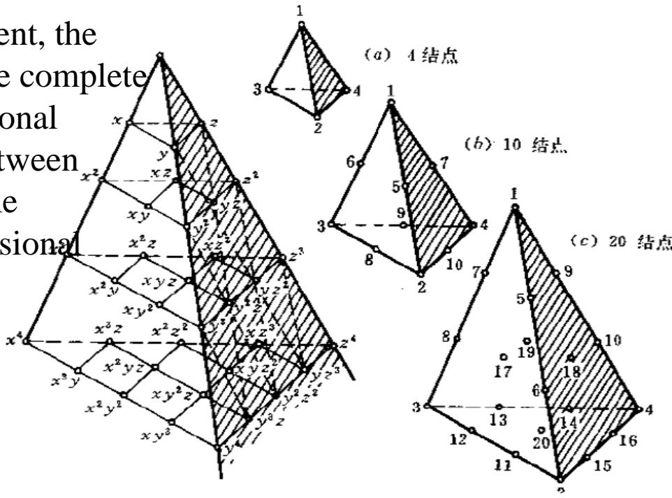

<details>
<summary>text_image</summary>

ent, the
complete
onal
tween
e
sional
(a) 4 结点
(b) 10 结点
(c) 20 结点
</details>

## 3.2 Other three-dimensional elements

There are some quite mature automatic decomposition algorithms for the tetrahedron element such like the Qhull algorithm package developed from the Delaunay algorithm in the computational geometry.

There must be enough elements to ensure the basic accuracy due to the low interpolation accuracy of tetrahedron element, which requires a rather high computer internal storage. So it's necessary to introduce some three-dimensional elements of other shapes.

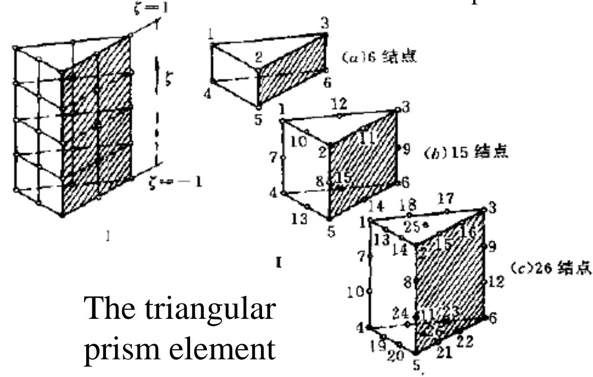

<details>
<summary>text_image</summary>

The triangular
prism element
(a)6 结点
(b)15 结点
(c)26 结点
</details>

The hexahedral element

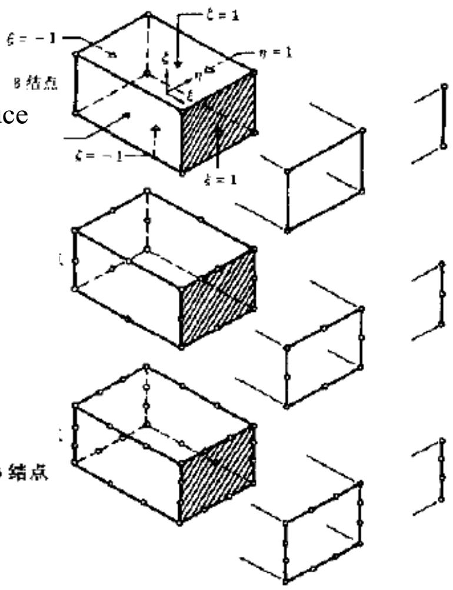

<details>
<summary>text_image</summary>

B结点
ce
ξ = -1
ξ = 1
η = 1
ξ = -1
ξ = 1
结点
</details>

The triangular
prism element

## V. Isoparametric element and numerical integration

## 5.1 The arbitrary quadrilateral element

We've introduced two kinds of element division methods for plane problems:

## 1. Triangular element

Triangular element is simple and flexible and can adapt very well to the boundary. So it's a easy and feasible method for element division.

However when solving practical problems (such like the plane elastic problem), the accuracy will be rather poor if we adopt the linear interpolation so the strain and stress are constants in every element.

Especially in the area with stress concentration, the result is only an average even after the post-processing of stress.

## 2. Rectangular element

The accuracy will get improved if we adopt the bilinear interpolation of rectangular element so the stress and strain are linear in every element. But the rectangular element cannot adapt well to the boundary.

To combine the advantages of these two elements, we'll introduce the arbitrary quadrilateral element for a better accuracy and a better boundary approximation capability.

## 5.1 Arbitrary quadrilateral element

The region $\Omega$ is divided into several quadrilateral elements e and the function values at four vertexes are given.

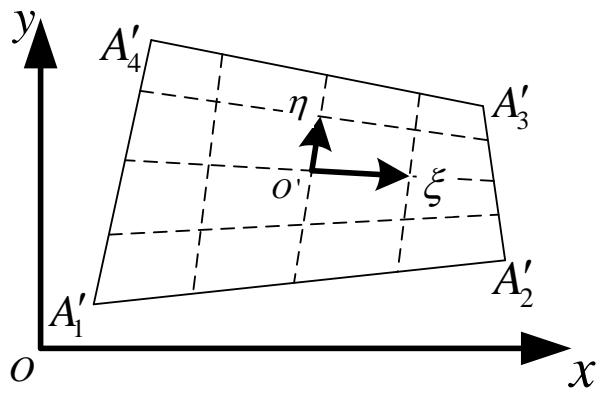

<details>
<summary>text_image</summary>

y
A′₄
η
O′
ξ
A′₃
A′₁
A′₂
x
O
</details>

Obviously we cannot solve the bilinear interpolation here like the rectangular element:

Because it can't guarantee the compatibility condition, that is, the continuity of interpolation function in the region $\Omega$ .

In fact if any of the four sides of the quadrilateral element is not parallel to the coordinates, it can be expressed as

$$
y = a x + b (a \neq 0)
$$

So even the linearly distributed quantity on the side is a quadratic function of x or y. However, a quadratic function cannot be uniquely determined by the function values of two end points.

## 5.1 The arbitrary quadrilateral element

However if we consider in a standard region D: $\{-1\leq\xi\leq1, -1\leq\eta\leq1\}$ in the plane $\xi-\eta$ , the problem will be solved easily.

On each of the four boundaries of D, the interpolation function is the linear functions of one variable, which can be uniquely determined by the function values of two end points.

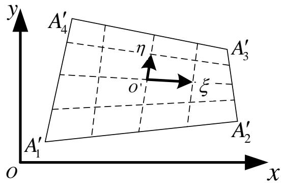

<details>
<summary>text_image</summary>

y
A′₄
η
O
ξ
A′₃
A′₁
A′₂
x
O
</details>

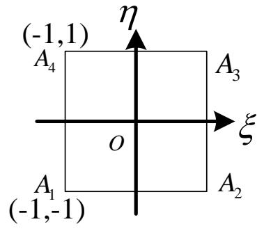

<details>
<summary>text_image</summary>

(-1,1)
A₄
η
A₃
ξ
O
A₁
(-1,-1)
A₂
</details>

The expression of basis function will the same as the bilinear interpolation of rectangular element after the transformation. $(\xi_{i}, \eta_{i})$ is the local coordinate of vertex. $N_{i}=\frac{1}{4}(1+\xi_{i}\xi)(1+\eta_{i}\eta)$

But the relationship between the local coordinate $(\xi_{i}, \eta_{i})$ and global coordinate $(x, y)$ has become different. The key point is to find out the new relationship of coordinate transformation.

## 5.1 The arbitrary quadrilateral element

Actually there's no need to look for the coordinate transformation on purpose.

We notice that the interpolation formula corresponding to the basis function mentioned above is accurate if the mapping relationship is linear.

So this is the coordinate transformation formula we want.

$$
x = \sum_ {i = 1} ^ {4} x _ {i} N _ {i} (\xi , \eta) \quad y = \sum_ {i = 1} ^ {4} y _ {i} N _ {i} (\xi , \eta)
$$

The four sides of the original quadrilateral $A_{1}^{\prime}A_{2}^{\prime}A_{3}^{\prime}A_{4}^{\prime}$ exactly become

the four corresponding sides of the standard rectangle on the plane.

For example, the equation of side $A_{1}A_{2}$ is $\eta = -1$ , the corresponding

$$
\left\{ \begin{array}{l l} x = \sum_ {i = 1} ^ {4} x _ {i} N _ {i} (\xi , - 1) & \\ y = \sum_ {i = 1} ^ {4} y _ {i} N _ {i} (\xi , - 1) & \end{array} \right. - 1 \leq \xi \leq 1
$$

is exact the parameter equation of a linear segment $A_1' A_2'$

For the element like this, parameters of both the coordinate transformation and the interpolation function are the values at nodes, and the numbers of parameters and the basis functions adopted are also the same. So it is usually called the isoparameter element.

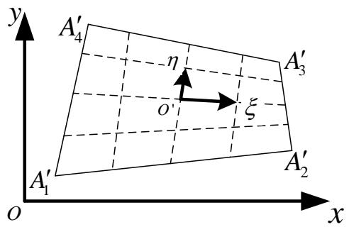

<details>
<summary>text_image</summary>

y
A′₄
η
o
ξ
A′₃
A′₁
O
x
A′₂
</details>

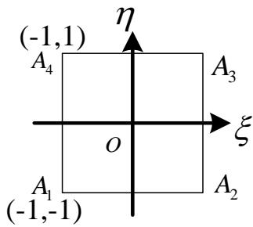

<details>
<summary>text_image</summary>

(-1,1)
A₄
η
A₃
ξ
O
A₁
(-1,-1)
A₂
</details>

## 5.2 The isoparametric element

The concept of curved element is created because the element with straight side can not strictly adapt to boundary with complex shape. Irons initially introduce a kind of local coordinate transformation that can transform the original curved element into a standard element in the new coordinate system.

The easiest way to establish this kind of transformation is to express it in the form of interpolation function, such as

$$
x = \sum_ {i = 1} ^ {m} x _ {i} N _ {i} ^ {\prime} y = \sum_ {i = 1} ^ {m} y _ {i} N _ {i} ^ {\prime} z = \sum_ {i = 1} ^ {m} z _ {i} N _ {i} ^ {\prime}
$$

where m is the number of nodes involved in the coordinate transformation, $x_{i}, y_{i}, z_{i}$ is the coordinates of these nodes in the original coordinate system, $N_{i}'$ is the shape function, which is actually an interpolation function expressed by the local coordinate.

The element with regular shape in the local coordinate can be transformed into a curved element in the original coordinate system through the relationship formula mentioned before. The former one is called the parent element, the latter one is called the sub-element.

The parent element

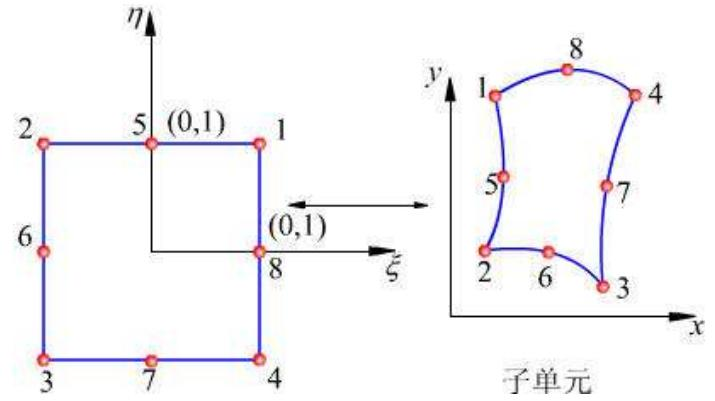

<details>
<summary>text_image</summary>

η
5 (0,1)
1
6
8
(0,1)
ξ
y
1
8
4
5
7
3
子单元
x
3
7
4
2
3
</details>

The sub-element

## 5.2 The isoparametric element

The expression of coordinate transformation is similar to that of the interpolation in terms of the expression form.

$$
\phi = \sum_ {i = 1} ^ {m} \phi_ {i} N _ {i}
$$

If the coordinate transformation and the interpolation adopt the same nodes as well as the same interpolation function that is

$$
m = n \quad N _ {i} ^ {\prime} = N _ {i}
$$

Then it's called the isoparametric transformation.

If there are more nodes of coordinate transformation than that of the interpolation of the function, m>n, superparametric transformation. On the contrary when m<n, it is called the subparametric

We mainly discuss isoparametric transformation here.

However a coordinate transformation must be reversible, which means it must be proved to be a one-to-one relationship.

## 5.2 The isoparametric element

According to advanced mathematics we can know that the condition of one-to-one coordinate transformation relationship is that the Jacobi determinant doesn't identically equal zero, which the isoparametric transformation must obey. The Jacobi determinant is as follows for the two-dimensional situation.

$$
\begin{array}{l} \mathbf {J} = \frac {\partial (x , y)}{\partial (\xi , \eta)} = \left[ \begin{array}{c c} \sum_ {i = 1} ^ {m} x _ {i} \frac {\partial N _ {i} ^ {\prime}}{\partial \xi} & \sum_ {i = 1} ^ {m} y _ {i} \frac {\partial N _ {i} ^ {\prime}}{\partial \xi} \\ \sum_ {i = 1} ^ {m} x _ {i} \frac {\partial N _ {i} ^ {\prime}}{\partial \eta} & \sum_ {i = 1} ^ {m} y _ {i} \frac {\partial N _ {i} ^ {\prime}}{\partial \eta} \end{array} \right] \\ = \left[ \begin{array}{c c c c} \frac {\partial N _ {1} ^ {\prime}}{\partial \xi} & \frac {\partial N _ {2} ^ {\prime}}{\partial \xi} & \ldots & \frac {\partial N _ {m} ^ {\prime}}{\partial \xi} \\ \frac {\partial N _ {1} ^ {\prime}}{\partial \eta} & \frac {\partial N _ {2} ^ {\prime}}{\partial \eta} & \ldots & \frac {\partial N _ {m} ^ {\prime}}{\partial \eta} \end{array} \right] \left[ \begin{array}{c c} x _ {1} & y _ {1} \\ x _ {2} & y _ {2} \\ \vdots & \vdots \\ x _ {m} & y _ {m} \end{array} \right] \\ \end{array}
$$

The transformation between derivatives can be expressed as follows according to the chain rule.

$$
{\left[ \begin{array}{l} \frac {\partial N _ {i}}{\partial \xi} \\ \frac {\partial N _ {i}}{\partial \eta} \end{array} \right]} = {\left[ \begin{array}{l l} \frac {\partial x}{\partial \xi} & \frac {\partial y}{\partial \xi} \\ \frac {\partial x}{\partial \eta} & \frac {\partial y}{\partial \eta} \end{array} \right]} {\left[ \begin{array}{l} \frac {\partial N _ {i}}{\partial x} \\ \frac {\partial N _ {i}}{\partial y} \end{array} \right]} = \mathbf {J} {\left[ \begin{array}{l} \frac {\partial N _ {i}}{\partial x} \\ \frac {\partial N _ {i}}{\partial y} \end{array} \right]}
$$

## 5.2 The isoparametric element

Also for the area infinitesimal we have

$$
d \mathbf {A} = d x d y = | \mathbf {J} | d \xi d \eta
$$

It can be seen that if $|J|=0$ , then the area infinitesimal in the local coordinate system is corresponding to one point in the original coordinate system, which is obviously not a one-to-one relationship.

Now let's discuss how to prevent the situation of $|\mathbf{J}| = 0$ in the finite element analysis. Take the two-dimensional problem for example. The area infinitesimal in the local coordinate system can also be expressed in the following form.

$$
d A = \left| d \pmb {\xi} \times d \pmb {\eta} \right| = \left| d \pmb {\xi} \right| \left| d \pmb {\eta} \right| \sin (d \pmb {\xi}, d \pmb {\eta})
$$

Combining two equations we can have

$$
\left| \mathbf {J} \right| = \frac {\left| d \boldsymbol {\xi} \right| \left| d \boldsymbol {\eta} \right| \sin (d \boldsymbol {\xi} , d \boldsymbol {\eta})}{d \xi d \eta}
$$

So in any of these three situations, we will have $|J|=0$ .

$$
\left| d \pmb {\xi} \right| = 0, \quad \left| d \pmb {\eta} \right| = 0, \quad \sin (d \pmb {\xi}, d \pmb {\eta}) = 0
$$

That's why we should prevent the situations above when dividing elements in the local coordinate system.

## 5.2 The isoparametric element

As shown in the pictures

(a) shows the normal situation, (b)-(d) show the situations we should avoid.  
(b) shows that the element nodes 3 and 4 have degraded to one node, where $|d\xi|=0$ .  
(c) shows that the element nodes 2 and 3 have degraded to one node, where $|d\eta|=0$ .  
(d) shows that at the element nodes 1, 2 and 3 we have $\sin(\mathrm{d}\xi,\mathrm{d}\eta)>0$ , but at the node 4 we have $\sin(\mathrm{d}\xi,\mathrm{d}\eta)<0$ . So there must be $\sin(\mathrm{d}\xi,\mathrm{d}\eta)=0$ in the element due to the continuity of the element, where $d\xi$ and $d\eta$ are collinear. This situation is caused by the excessive distortion of the element.

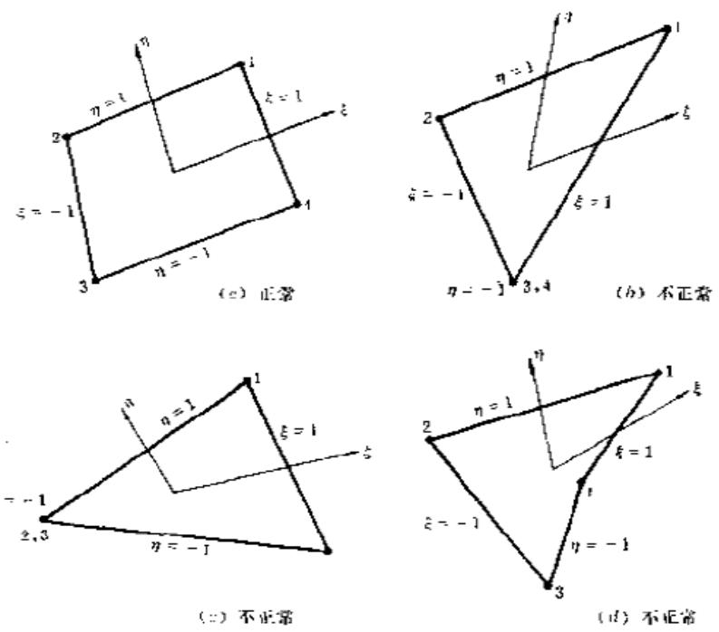

The discussion above can be generalized to the three-dimensional situation.

## 5.3 The general form of isoparametric element of elastic static problems

The isoparametric element often takes the displacement as the fundamental unknown quantity. So the general form of finite element obtained through the principle of minimum potential energy in the previous chapter is also applicable for the isoparametric element.

The difference is that the interpolation function of the isoparametric element is expressed by the local coordinate. All the calculations about isoparametric element are carried out in the parent element of regular shape in the local coordinate system.

So we only need to do some modification to the original general form to obtain the finite element form that's suitable for the isoparametric element.

The system equation is still

$$
\mathbf {K a} = \mathbf {P}
$$

The global stiffness matrix K and the global load vector P are respectively assembled by the element stiffness matrix $K^{e}$ and the element load vector $P^{e}$ .

There are only two points that need modification:

The variables and the limits of integration.

Now let's take the three-dimensional element for example.

## 5.3 The general form of isoparametric element of elastic static problems

The basis functions of the isoparametric element are expressed by the local coordinate. So it's not easy to get the expression in the global coordinate system even with the transformation relationship.

Meanwhile the stiffness matrix is established according to the element and then assembled gradually. So there's no need to establish the expression in the global coordinate system. All the calculations can be carried out in the local coordinate system.

However, when solving the element stiffness matrix and the equivalent load vector, a Jacobi determinant will still be added to the integrand even though the integration domain has become very regular after the coordinate transformation.

$$
\mathbf {K} ^ {e} = \iint_ {\Omega_ {e}} \mathbf {B} ^ {T} \mathbf {D B} d x d y = \iint_ {\Omega_ {e} ^ {\prime}} \mathbf {B} ^ {T} \mathbf {D B} | \mathbf {J} | d \xi d \eta
$$

Of course we can directly use the integral formula of area coordinate for some simple problems. But in some circumstances we can only use the numerical integration.

Now we'll introduce the numerical integration that is commonly used in the finite element analysis.

## 5.4 The numerical integration

## The basic idea

For a definite integral

$$
I = \int_ {- 1} ^ {1} f (\xi) d \xi
$$

establish a polynomial $\varphi(\xi)$ which equals $f(\xi)$ at a number of n nodes.

$$
\phi (\xi_ {i}) = f (\xi_ {i}) (i = 1, 2, \dots , n)
$$

If use the polynomial function for approximation, the integral formula will become

$$
I = \int_ {- 1} ^ {1} f (\xi) d \xi \approx \int_ {- 1} ^ {1} \phi (\xi) d \xi
$$

So the problem is:

How to establish a polynomial $\varphi(\xi)$ that can approximate best to $f(\xi)$ .

So we'll introduce the following two methods.

## Newton—Cotes numerical integration

Establish a Lagrange interpolation polynomial based on n nodes.

$$
\phi (\xi) = a _ {0} + a _ {1} \xi + \dots + a _ {n - 1} \xi^ {n - 1} = \sum_ {i = 1} l _ {i} (\xi) f (\xi_ {i})
$$

where $a_{0},\ldots,a_{n-1}$ are constants and $l_{i}$ is a (n-1) degree Lagrange interpolation function

$$
l _ {i} (\xi) = \frac {(\xi - \xi_ {1}) \cdots (\xi - \xi_ {i - 1}) (\xi - \xi_ {i + 1}) \cdots (\xi - \xi_ {n})}{(\xi_ {i} - \xi_ {1}) \cdots (\xi_ {i} - \xi_ {i - 1}) (\xi_ {i} - \xi_ {i + 1}) \cdots (\xi_ {i} - \xi_ {n})} = \prod_ {j = i, j \neq i} ^ {n} \frac {(\xi - \xi_ {j})}{(\xi_ {i} - \xi_ {j})}
$$

## 5.4 The numerical integration

## Newton—Cotes numerical integration

Obviously we have

$$
l _ {i} (\xi_ {j}) = \delta_ {i j} \quad \phi (\xi_ {i}) = f (\xi_ {i})
$$

The integral can be approximately written as

$$
I = \int_ {- 1} ^ {1} f (\xi) d \xi \approx \int_ {- 1} ^ {1} \phi (\xi) d \xi = \int_ {- 1} ^ {1} \sum_ {i = 1} ^ {n} l _ {i} (\xi) f (\xi_ {i}) d \xi
$$

$$
= \sum_ {i = 1} ^ {n} \left[ \left(\int_ {- 1} ^ {1} l _ {i} (\xi) d \xi\right) f \left(\xi_ {i}\right) \right] = \sum_ {i = 1} ^ {n} A _ {i} f \left(\xi_ {i}\right)
$$

Where $A_{i}=\int_{-1}^{1}l_{i}(\xi)d\xi$ is called the integral weight coefficient.

## The Gauss integral

If modify the locations of the n interpolating points and $\varphi(\xi)$ will approximate to $f(\xi)$ just like a (2n-1) degree polynomial. Then the integral accuracy will be improved significantly.

So the point $\xi_{i}$ that is modified to the optimal local to get a optimal combination is called the Gauss integral point.

## 5.4 The numerical integration

## The Gauss integral

The position of the integral point is determined by the following method: The n degree polynomial $P(\xi)$ is defined as

$$
P (\xi) = (\xi - \xi_ {1}) \dots (\xi - \xi_ {n}) = \prod^ {n} (\xi - \xi_ {i})
$$

Then determine the integral points by the following condition $i=1$

$$
\int_ {- 1} ^ {1} \xi^ {i} P (\xi) d \xi = 0 (i = 0, 1, \dots , n - 1)
$$

So P(ξ) have the following properties

1. On the integral points  
2. The polynomial $P(\xi)$ and $\xi^{0},\xi,\ldots,\xi^{n-1}$ are orthogonal in the interval $(-1,1)$ . So the integrand can be approximated by a $(2n-1)$ degree polynomial.

$$
\phi (\xi) = \sum_ {i = 1} ^ {n} l _ {i} (\xi) f (\xi_ {i}) + \sum_ {i = 0} ^ {n - 1} \beta_ {i} \xi^ {i} P (\xi)
$$

The integral can be approximately written as

$$
\begin{array}{l} I = \int_ {- 1} ^ {1} f (\xi) d \xi \approx \int_ {- 1} ^ {1} \phi (\xi) d \xi \\ = \sum_ {i = 1} ^ {n} \left[ \left(\int_ {- 1} ^ {1} l _ {i} (\xi) d \xi\right) f \left(\xi_ {i}\right) \right] + \sum_ {i = 1} ^ {n} \int_ {- 1} ^ {1} \beta_ {i} \xi^ {i} P (\xi) d \xi = \sum_ {i = 1} ^ {n} A _ {i} f \left(\xi_ {i}\right) \\ \end{array}
$$

## 5.4 The numerical integration

## The two-dimensional and three-dimensional Gauss integral

Similarly to the analytic method used to solve the multiple integration we can adopt the one-dimensional Gauss integral to solve the two and three-dimensional numerical integration:

That is to keep the outer part of integral variables constants when calculating the inner part of the integral.

In this way we can easily obtain the numerical integral of two and three-dimensional problems. Take the two-dimensional integral for example.

$$
I = \int_ {- 1} ^ {- 1} \int_ {- 1} ^ {1} f (\xi , \eta) d \xi d \eta
$$

Let $\eta$ be a constant. Integrate the inner part

$$
\int_ {- 1} ^ {1} f (\xi , \eta) d \xi d \eta = \sum_ {i = 1} ^ {n} A _ {i} f (\xi_ {i}, \eta)
$$

Similarly integrate the outer part

$$
\begin{array}{l} I = \int_ {- 1} ^ {- 1} \int_ {- 1} ^ {1} f (\xi , \eta) d \xi d \eta = \int_ {- 1} ^ {1} \sum_ {i = 1} ^ {n} A _ {i} f (\xi_ {i}, \eta) d \eta \\ = \sum_ {j = 1} ^ {n} A _ {j} \sum_ {i = 1} ^ {n} A _ {i} f (\xi_ {i}, \eta_ {j}) = \sum_ {i = 1} ^ {n} \sum_ {j = 1} ^ {n} A _ {i} A _ {j} f (\xi_ {i}, \eta_ {j}) \\ \end{array}
$$

## 5.5 The convergence of the isoparametric element

So the convergence condition of the finite element solution is that the element must be compatible and complete.

Now let's discuss whether the isoparametric element satisfy the requirement.

1. To ensure the compatibility, the adjacent elements must have totally the same nodes on the shared sides (or plane). The coordinates and the unknown functions of every element must be determined by the same interpolation function along these sides (or plane). It is obvious that the isoparametric element can satisfy the compatibility requirement if the meshes and elements are properly arranged.

2. For the element C0, completeness requires that the interpolation function contains the complete linear terms (the one degree complete polynomial). For a three-dimensional isoparametric element, the coordinate and the interpolation expression of the function are

$$
x = \sum^ {n} N _ {i} x _ {i} \quad y = \sum^ {n} N _ {i} y _ {i} \quad z = \sum^ {n} N _ {i} z _ {i} \quad \phi = \sum^ {n} N _ {i} \phi_ {i}
$$

Assign the values at the element nodes of the function of linear field to every node

parameter $\phi_{i}=a+bx_{i}+cy_{i}+dz_{i}\quad(i=1,2,\cdots,n)$

Substituted into the equation above and, we can get the function expression inside the element. $\phi = a \sum N_{i} + bx + cy + dz$

It can be seen that if the interpolation function satisfies the condition $\sum_{i=1}^{n} N_{i} = 1$ ,

$$
\phi = a \sum_ {i = 1} ^ {n} N _ {i} + b x + c y + d z = a + b x + c y + d z
$$

it means the element can represent the linear field function and the completeness requirement is satisfied.

So the isoparametric element satisfies the completeness requirement.

## VI. Conclusions

The length coordinate, area coordinate and the volume coordinate have no direct relationship with the element form. So they are uniformly called the nature coordinate. Then we introduce two methods: the generalized Lagrange interpolation function and the variably distributed interpolation points.

We adopt the form of polynomial when establishing the interpolation function of the element because:

1. Easy for calculation  
2. Easy to prove the convergence

In practical calculation we usually adopt the linear or quadratic element to reduce the calculation work. So we introduce the self-adapting finite element method:

1.h method: does not change the configuration situation of interpolation function of every element but to gradually refine the meshes to approach the exact solution.  
2.p method: does not change the mesh division of finite element but to increase the degree of element interpolation function to improve the calculation accuracy.

Besides we can also start from improving the form of interpolation function, for example:

1. Adopt the spline function to establish the spline finite element.  
2. Adopt the wavelet function to establish the wavelet finite element.

## Thank you !