## Introduction lecture

Prof. Jian Yang (杨健)

(j.yang.1@sjtu.edu.cn)

FEM, also called as finite element analysis (FEA), is a method for numerical solution of field problems.

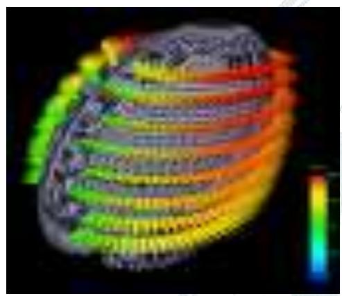

natural_image

Color-coded 3D thermal or topographic visualization of a multi-layered structure with no visible text or symbols

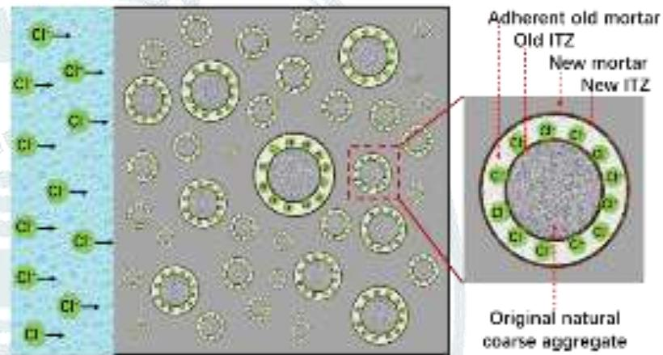

text_image

Cl⁻
Cl⁻
Cl⁻
Cl⁻
Cl⁻
Cl⁻
Cl⁻
Cl⁻
Adherent old mortar
Old ITZ
New mortar
New ITZ
Original natural
coarse aggregate

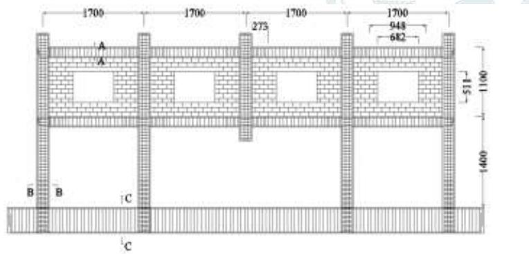

text_image

1700
1700
1700
1700
948
682
A
A
511
1100
B
B
C
1400
C

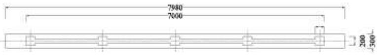

text_image

7980
7600
200
300

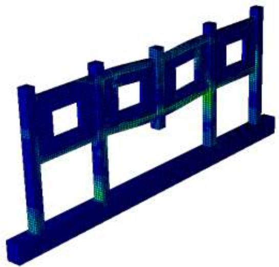

natural_image

3D rendered image of a blue structural frame with vertical supports and rectangular cutouts (no text or symbols)

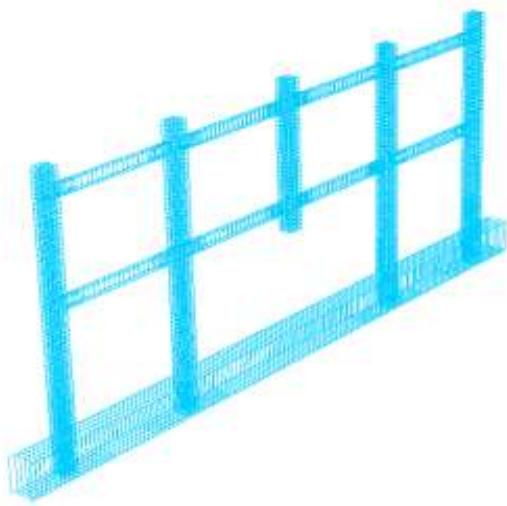

natural_image

3D wireframe diagram of a grid structure with vertical and horizontal bars (no text or symbols)

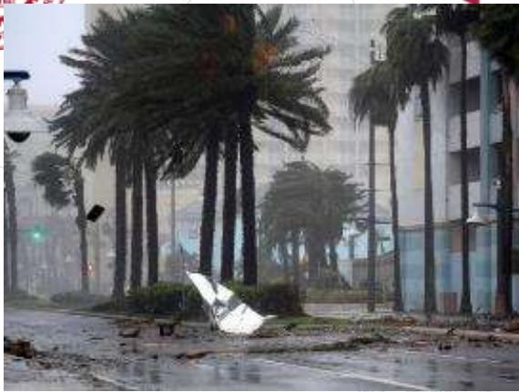

natural_image

Street scene with palm trees and a damaged white object on wet pavement, no visible text or symbols

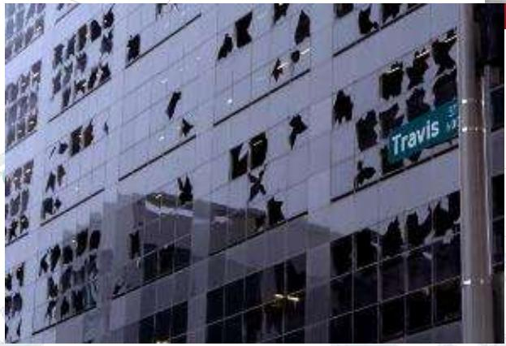

text_image

Street photo of a modern glass building facade with visible 'Travis' signage and scattered black-and-white patterns on the facade.

1896

1920

1987

2006

落重冲击试验

新型数值方法

FEM

XFEM

DEM

FEMDEM

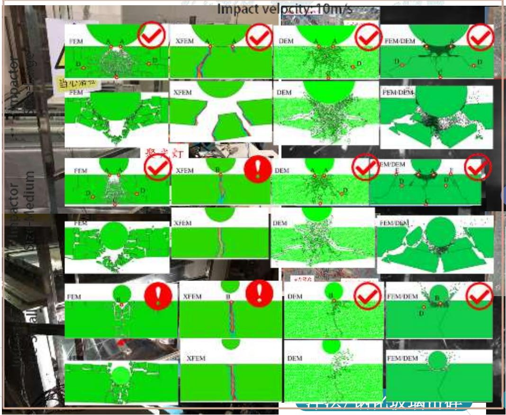

text_image

Impact velocity: 10m/s
FEM
XFEM
DEM
FEM/DEM
当心油浸
XFEM
DEM
FEM/DEM
FEM
XFEM
DEM
FEM/DEM
FEM
XFEM
DEM
FEM/DEM
FEM
XFEM
DEM
FEM/DEM
FEM
XFEM
DEM
FEM/DEM
FEM
XFEM
DEM
FEM/DEM
FEM
XFEM
DEM
FEM/DEM
FEM
XFEM
DEM
FEM/DEM
FEM
XFEM
DEM
FEM/DEM

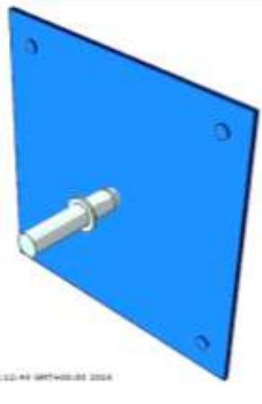

natural_image

3D CAD model of a blue square plate with a metallic cylindrical component inserted, no text or symbols visible

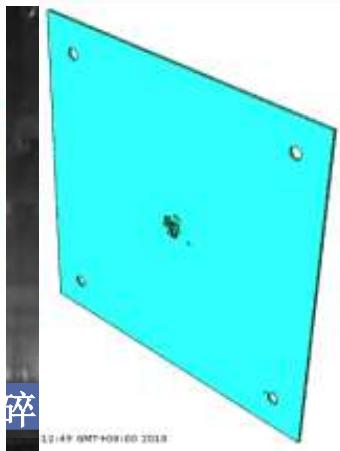

natural_image

3D model of a cyan square plate with four corner holes, no text or symbols visible

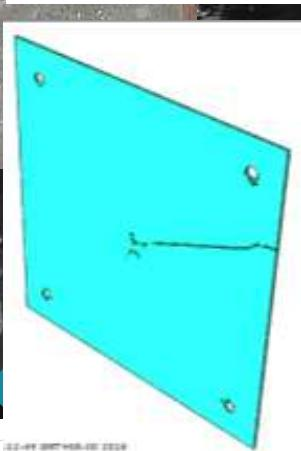

natural_image

Simple 3D geometric shape resembling a tilted square with corner holes and a central line (no text or symbols)

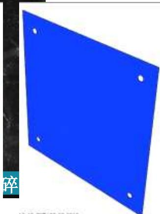

natural_image

Blue square plate with four small holes, no text or symbols visible

## FE modelling

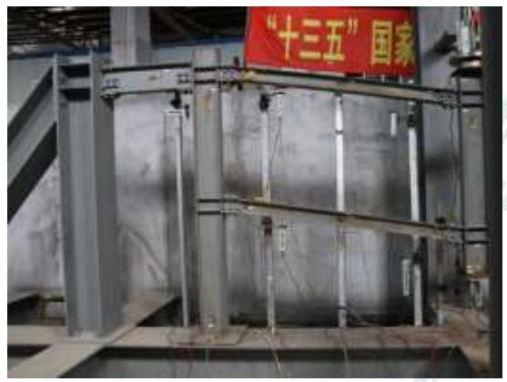

text_image

“十三五”国家

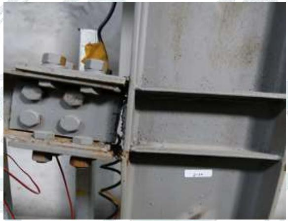

natural_image

Close-up of a metallic industrial structure with bolts and wiring, no visible text or symbols

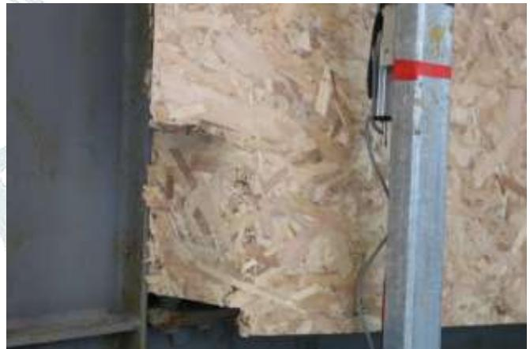

natural_image

Interior view of a construction or industrial facility showing exposed wooden panels and metal pipes (no visible text or symbols)

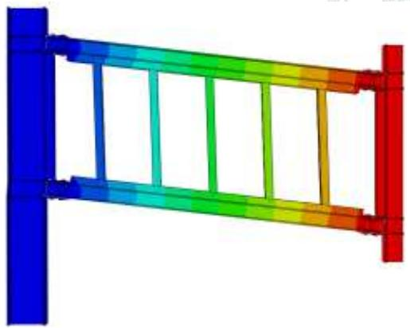

natural_image

Color-coded structural beam diagram with no text or symbols

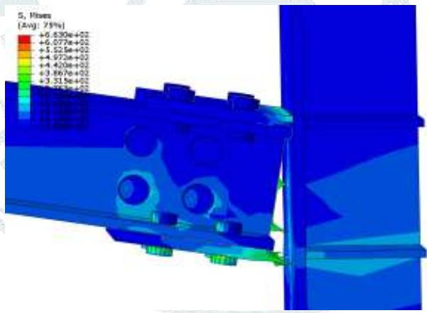

heatmap

| Value       |
| ----------- |
| +6.830e+02  |
| +6.077e+02  |
| +5.525e+02  |
| +4.972e+02  |
| +4.420e+02  |
| +3.867e+02  |
| +3.315e+02  |
| +2.953e+02  |

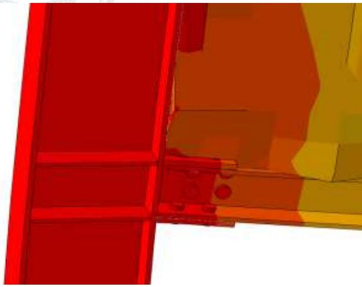

natural_image

Abstract 3D rendering of a red and yellow geometric structure with no visible text or symbols

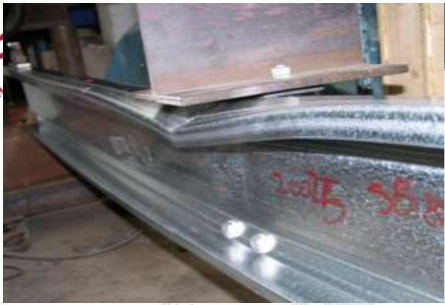

text_image

20075 35.8

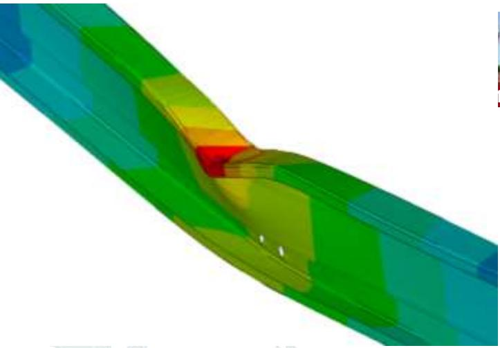

natural_image

3D simulation visualization of fluid flow or material deformation with color gradient (no text or symbols)

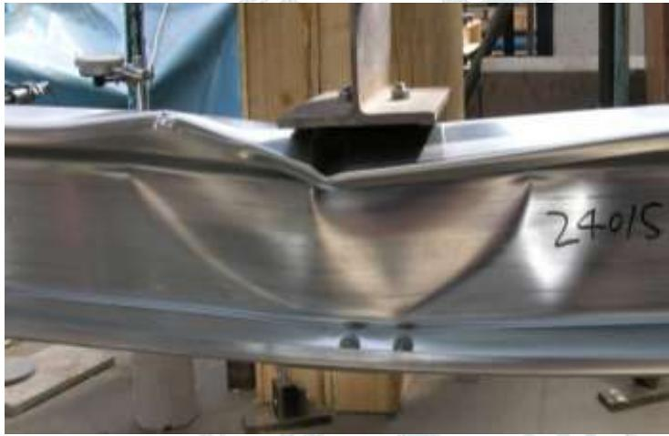

text_image

24015

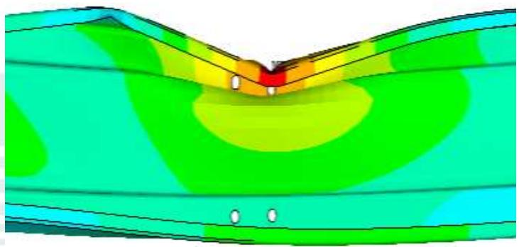

natural_image

Thermal or pressure distribution visualization with color gradients and no visible text or symbols

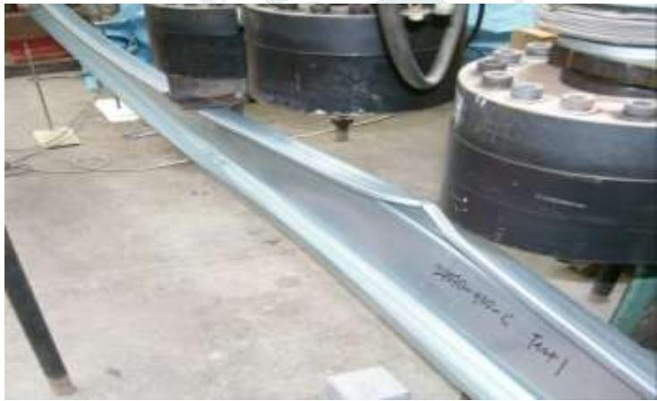

text_image

2010-2025 (Fig.1)

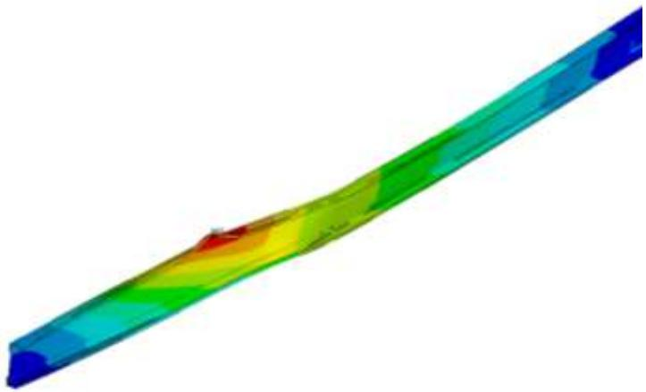

natural_image

Colorful 3D gradient bar structure with no text or symbols

Mesh  
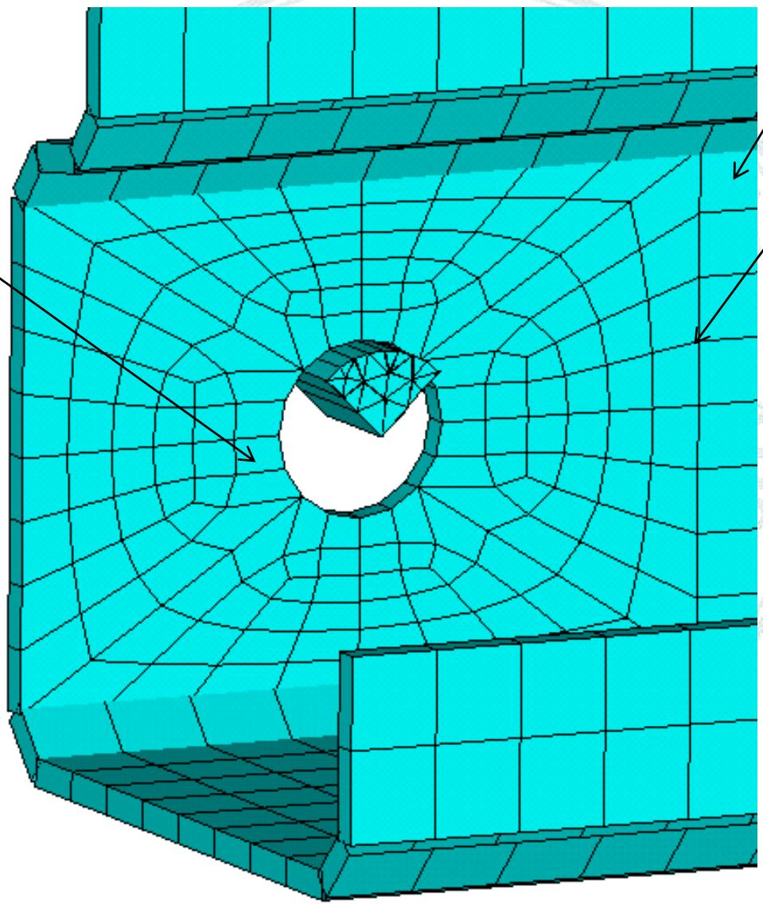

natural_image

3D mesh model of a structural component with curved internal structure and grid lines (no text or symbols)

Node

## Alternative numerical methods

• Other numerical solution methods:

\- Finite differences

» Approximates the derivatives in the differential equation using difference equations.  
» Useful for solving heat transfer and fluid mechanics problems.  
» Works well for two-dimensional regions with boundaries parallel to the coordinate axes.  
» Cumbersome when regions have curved boundaries.

• Weighted residual methods (not confined to a small subdomain):

» Collocation  
» Subdomain  
» Least squares\*  
» Galerkin's method\*

• Variational Methods\* (not confined to a small subdomain)

## Advantages of FEA

Versatile  
No geometric restriction  
Boundary conditions and loading are not restricted  
Material properties are not restricted  
Components that have different behaviours  
An FE structures can closely resembles the actual body  
The approximation is easily improved by grading the mesh or increasing the order of elements  
Can deal with multi-physics problems.

## Terminologies

Interpolation  
Elements  
Nodes  
D.O.F  
○ ○ ○

## History of FEA

1943 – Courant (Variational method)  
1956 (1954) – Turner, Clough, Martin and Topp (Stiffness)  
1955 – Argyris  
Clough, Argyris, Zienkiewicz the three founders of FEA; K. Feng made great contributions but was less known.  
1960– Clough (proposed Finite Element, plane problems)  
1970s – Applications on mainframe computers  
1980s – Microcomputers, pre- and post-processors  
1990s – Analysis of large structural systems

## Available commercial FEM software NSYS packages

ANSYS  
SDRC/I-DEAS (complete CAD/CAM/CAE package)  
Nastran  
ABAQUS  
COSMOS  
ALGOR  
PATRAN  
HyperMesh  
LS-Dyna  
Comsol

## Solving a problem by FEA

Classification of problems  
Model idealization  
Preliminary analysis  
Finite element analysis

- Preprocessing  
- Numerical analysis  
- Postprocessing

Check and interpret results

Reiteration

Structure  
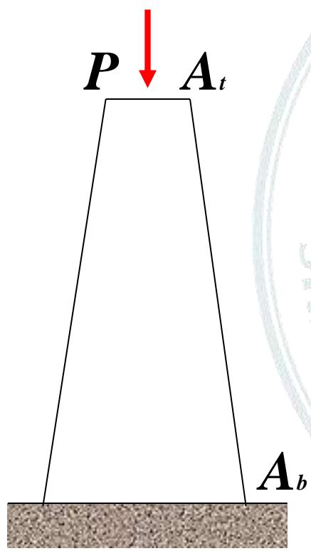

text_image

P
Aₜ
Aₑ

Ground

Model  
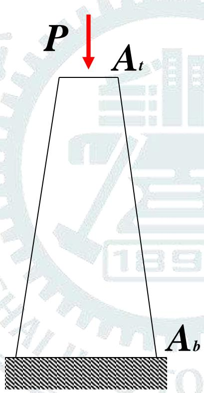

text_image

P
Aₜ
Aₑ

Rigid
support

Discretized models  
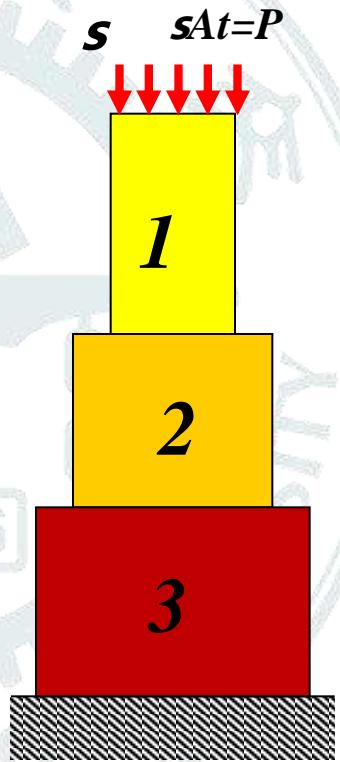

text_image

s sAt=P
1
2
3

Physical representation

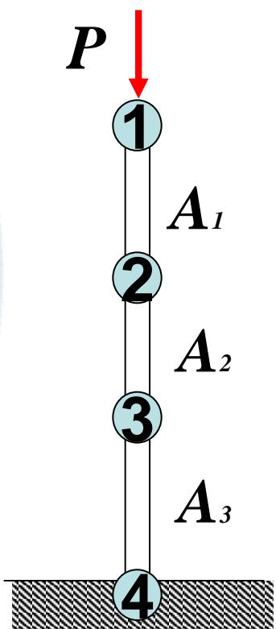

text_image

P
1
A₁
2
A₂
3
A₃
4

Finite element
representation

## Types of finite elements

1-D (line) element  
2-D (plane) element  
3-D (solid) element

## How does the FEA work

Consider the bar of different cross-sections subjected to three point loads as shown in the figure. Determine the displacements at the loading points.

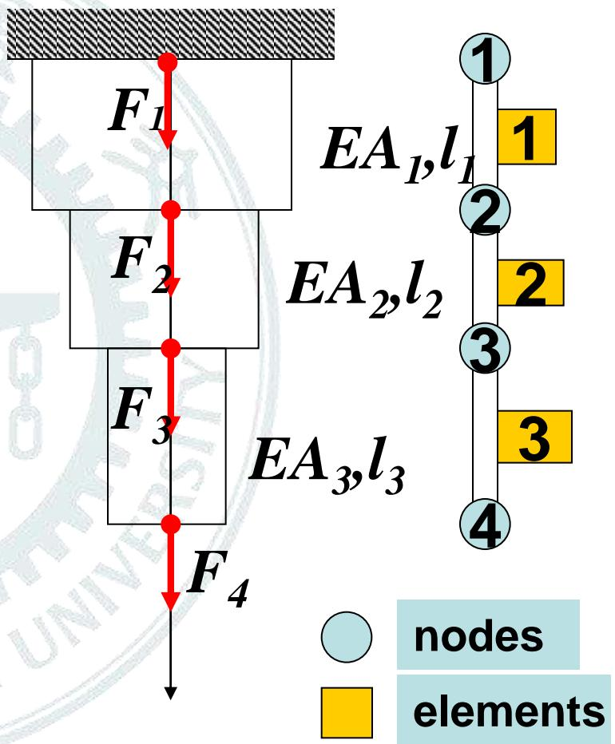

flowchart

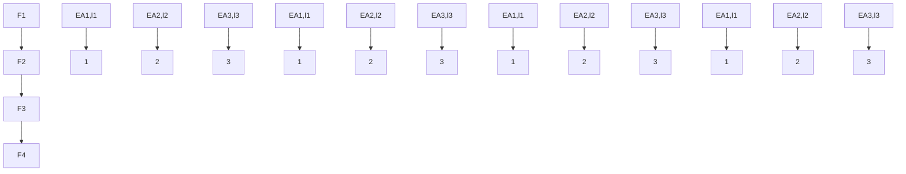
```mermaid
graph TD
  A["F1"] --> B["F2"]
  B --> C["F3"]
  C --> D["F4"]
  E["EA1,l1"] --> F["1"]
  G["EA2,l2"] --> H["2"]
  I["EA3,l3"] --> J["3"]
  K["EA1,l1"] --> L["1"]
  M["EA2,l2"] --> N["2"]
  O["EA3,l3"] --> P["3"]
  Q["EA1,l1"] --> R["1"]
  S["EA2,l2"] --> T["2"]
  U["EA3,l3"] --> V["3"]
  W["EA1,l1"] --> X["1"]
  Y["EA2,l2"] --> Z["2"]
  AA["EA3,l3"] --> AB["3"]
```

## Element stiffness matrices

Equilibrium equation for element 1

$$
\left[ \begin{array}{l l} k _ {1} & - k _ {1} \\ - k _ {1} & k _ {1} \end{array} \right] \left\{ \begin{array}{l} u _ {1} \\ u _ {2} \end{array} \right\} = \left\{ \begin{array}{l} P _ {1 1} \\ P _ {1 2} \end{array} \right\}
$$

$$
k _ {i} = \frac {E A _ {i}}{l _ {i}}
$$

Equilibrium equation for element 2

$$
\left[ \begin{array}{c c} k _ {2} & - k _ {2} \\ - k _ {2} & k _ {2} \end{array} \right] \left\{ \begin{array}{c} u _ {2} \\ u _ {3} \end{array} \right\} = \left\{ \begin{array}{c} P _ {2 1} \\ P _ {2 2} \end{array} \right\}
$$

Equilibrium equation for element 3

$$
\left[ \begin{array}{c c} k _ {3} & - k _ {3} \\ - k _ {3} & k _ {3} \end{array} \right] \left\{ \begin{array}{l} u _ {3} \\ u _ {4} \end{array} \right\} = \left\{ \begin{array}{l} P _ {3 1} \\ P _ {3 2} \end{array} \right\}
$$

Equilibrium of nodes  
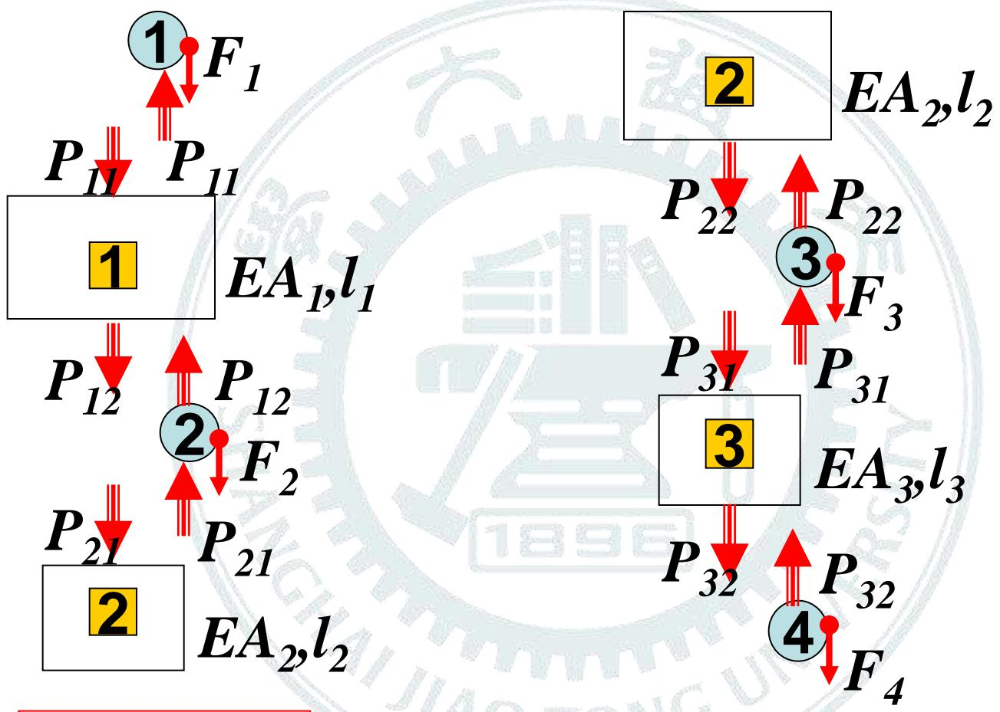

flowchart

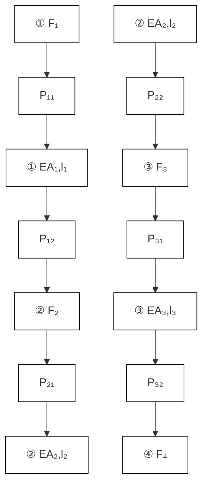
```mermaid
graph TD
  A["① F₁"] --> B["P₁₁"]
  B --> C["① EA₁,l₁"]
  C --> D["P₁₂"]
  D --> E["② F₂"]
  E --> F["P₂₁"]
  F --> G["② EA₂,l₂"]
    
  H["② EA₂,l₂"] --> I["P₂₂"]
  I --> J["③ F₃"]
  J --> K["P₃₁"]
  K --> L["③ EA₃,l₃"]
  L --> M["P₃₂"]
  M --> N["④ F₄"]
    
    style A fill:#fff,stroke:#000
    style B fill:#fff,stroke:#000
    style C fill:#fff,stroke:#000
    style D fill:#fff,stroke:#000
    style E fill:#fff,stroke:#000
    style F fill:#fff,stroke:#000
    style G fill:#fff,stroke:#000
    style H fill:#fff,stroke:#000
    style I fill:#fff,stroke:#000
    style J fill:#fff,stroke:#000
    style K fill:#fff,stroke:#000
    style L fill:#fff,stroke:#000
    style M fill:#fff,stroke:#000
    style N fill:#fff,stroke:#000
```

$$
P _ {1 1} = F _ {1}
$$

$$
P _ {1 2} + P _ {2 1} = F _ {2}
$$

$$
P _ {2 2} + P _ {3 1} = F _ {3}
$$

$$
P _ {3 2} = F _ {4}
$$

## Assembly of stiffness matrices

$$
\left[ \begin{array}{c c c c} k _ {1} & - k _ {1} & 0 & 0 \\ - k _ {1} & k _ {1} & 0 & 0 \\ 0 & 0 & 0 & 0 \\ 0 & 0 & 0 & 0 \end{array} \right] \left\{ \begin{array}{l} u _ {1} \\ u _ {2} \\ u _ {3} \\ u _ {4} \end{array} \right\} = \left\{ \begin{array}{l} P _ {1 1} \\ P _ {1 2} \\ 0 \\ 0 \end{array} \right\}
$$

For element 1

$$
\left[ \begin{array}{c c c c} 0 & 0 & 0 & 0 \\ 0 & k _ {2} & - k _ {2} & 0 \\ 0 & - k _ {2} & k _ {2} & 0 \\ 0 & 0 & 0 & 0 \end{array} \right] \left\{ \begin{array}{l} u _ {1} \\ u _ {2} \\ u _ {3} \\ u _ {4} \end{array} \right\} = \left\{ \begin{array}{l} 0 \\ P _ {2 1} \\ P _ {2 2} \\ 0 \end{array} \right\}
$$

For element 2

Element equilibrium equations in the global coordinate system

## Assembly of stiffness matrices

$$
\left[ \begin{array}{c c c c} 0 & 0 & 0 & 0 \\ 0 & 0 & 0 & 0 \\ 0 & 0 & k _ {3} & - k _ {3} \\ 0 & 0 & - k _ {3} & k _ {3} \end{array} \right] \left\{ \begin{array}{l} u _ {1} \\ u _ {2} \\ u _ {3} \\ u _ {4} \end{array} \right\} = \left\{ \begin{array}{l} 0 \\ 0 \\ P _ {3 1} \\ P _ {3 2} \end{array} \right\} \text {For element 3}
$$

$$
\left[ \begin{array}{c c c c} k _ {1} & - k _ {1} & 0 & 0 \\ - k _ {1} & k _ {1} + k _ {2} & - k _ {2} & 0 \\ 0 & - k _ {2} & k _ {2} + k _ {3} & - k _ {3} \\ 0 & 0 & - k _ {3} & k _ {3} \end{array} \right] \left\{ \begin{array}{l} u _ {1} \\ u _ {2} \\ u _ {3} \\ u _ {4} \end{array} \right\} = \left\{ \begin{array}{c} P _ {1 1} \\ P _ {1 2} + P _ {2 1} \\ P _ {2 2} + P _ {3 1} \\ P _ {3 2} \end{array} \right\} = \left\{ \begin{array}{c} F _ {1} \\ F _ {2} \\ F _ {3} \\ F _ {4} \end{array} \right\}
$$

## Applying boundary conditions

$$
u _ {1} = 0, \quad F _ {1} = R
$$

Stiffness matrix

Global equilibrium equations

$$
\left[ \begin{array}{c c c c} k _ {1} & - k _ {1} & 0 & 0 \\ - k _ {1} & k _ {1} + k _ {2} & - k _ {2} & 0 \\ 0 & - k _ {2} & k _ {2} + k _ {3} & - k _ {3} \\ 0 & 0 & - k _ {3} & k _ {3} \end{array} \right] \left\{ \begin{array}{l} 0 \\ u _ {2} \\ u _ {3} \\ u _ {4} \end{array} \right\} = \left\{ \begin{array}{l} R \\ F _ {2} \\ F _ {3} \\ F _ {4} \end{array} \right\}
$$

Solve for nodal displacements from the global equilibrium equations
Solve for reaction forces from the global equilibrium equations
Calculate the strain for each element from obtained displacements
Calculate the stress for each element from obtained displacements

## Properties of stiffness matrices

Nonnegative Kii  
Symmetry  
Sparsity  
Singularity (no support or mechanism)

## Checking results

Deformed shape of the structure  
Balance of the external forces  
Order of magnitudes of results

## A generalised approach to formulate

stiffness matrix  
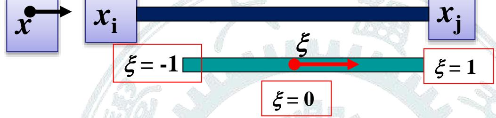

text_image

x
xi
xj
ξ = -1
ξ
ξ = 0
ξ = 1

Let $\xi = 2\mathrm{x / l}$ and move the origin into the middle of the bar

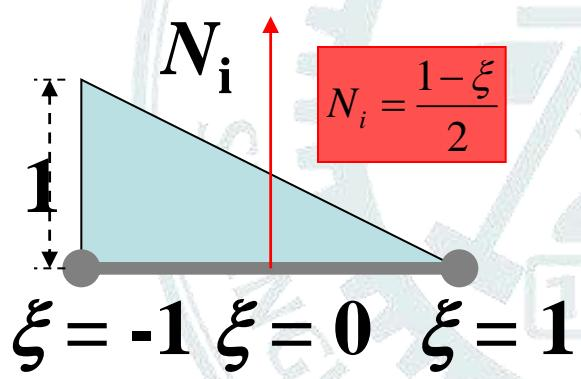

area chart

| ξ       | Ni     |
| ------- | ------ |
| -1      | 1      |
| 0       | 1      |
| 1       | 1      |

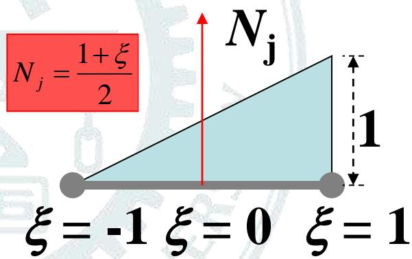

text_image

N_j = \frac{1 + \xi}{2}
N_j
1
\xi = -1  \xi = 0  \xi = 1

$$
x = N _ {i} (\xi) x _ {i} + N _ {j} (\xi) x _ {j}
$$

## Element displacement field

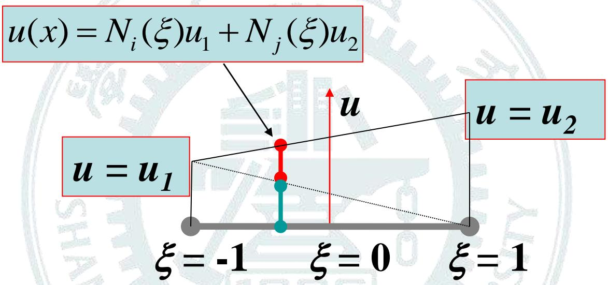

text_image

u(x) = N_i(ξ)u_1 + N_j(ξ)u_2
u = u_1
ξ = -1
ξ = 0
ξ = 1
u
u = u_2

$$
\boxed {u = \left[ \begin{array}{c c} N _ {i} & N _ {j} \end{array} \right] \left\{ \begin{array}{c} u _ {i} \\ u _ {j} \end{array} \right\}}
$$

## Element strain field

$$
\varepsilon (x) = \frac {d u}{d x} = \left[ \begin{array}{c c} d N _ {i} & d N _ {j} \\ \hline d x & d x \end{array} \right] \left\{ \begin{array}{c} u _ {i} \\ u _ {j} \end{array} \right\}
$$

$$
{\frac {d x}{d \xi}} = {\frac {d N _ {i}}{d \xi}} x _ {i} + {\frac {d N _ {j}}{d \xi}} x _ {j} = - {\frac {x _ {i}}{2}} + {\frac {x _ {j}}{2}} = {\frac {x _ {j} - x _ {i}}{2}} = {\frac {l}{2}}
$$

$$
{\frac {d N _ {i}}{d x}} = {\frac {d N _ {i}}{d \xi}} {\frac {d \xi}{d x}} = \left(- {\frac {1}{2}}\right) \left({\frac {2}{l}}\right)
$$

$$
\frac {d N _ {j}}{d x} = \frac {d N _ {j}}{d \xi} \frac {d \xi}{d x} = \left(\frac {1}{2}\right) \left(\frac {2}{l}\right)
$$

$$
\varepsilon = \left[ \begin{array}{c c} - \frac {1}{l} & \frac {1}{l} \end{array} \right] \left\{ \begin{array}{c} u _ {i} \\ u _ {j} \end{array} \right\}
$$

## Element stress field

$$
\sigma (x) = E \varepsilon (x) = E \left[ \frac {d N _ {i}}{d x} - \frac {d N _ {j}}{d x} \right] \left\{ \begin{array}{l} u _ {i} \\ u _ {j} \end{array} \right\}
$$

$$
\sigma = \left[ \begin{array}{c c} - \frac {E}{l} & \frac {E}{l} \end{array} \right] \left\{ \begin{array}{c} u _ {i} \\ u _ {j} \end{array} \right\}
$$

Note: element strain and element stress are constant

## Element internal force

$$
N (x) = \sigma (x) A = E A \left[ \frac {d N _ {i}}{d x} - \frac {d N _ {j}}{d x} \right] \left\{ \begin{array}{l} u _ {i} \\ u _ {j} \end{array} \right\}
$$

$$
N = \left[ - \frac {E A}{l} \quad \frac {E A}{l} \right] \left\{ \begin{array}{l} u _ {i} \\ u _ {j} \end{array} \right\}
$$

## Element strain energy

$$
\begin{array}{l} U = \frac {1}{2} \int_ {0} ^ {V} \sigma \varepsilon d V = \frac {A l}{2} \left[ u _ {i} - u _ {j} \right] \left\{ \begin{array}{c} - \frac {E}{l} \\ \frac {E}{l} \end{array} \right\} \left[ \begin{array}{c c} - \frac {1}{l} & \frac {1}{l} \end{array} \right] \left\{ \begin{array}{c} u _ {i} \\ u _ {j} \end{array} \right\} \\ = \frac {1}{2} \left[ \begin{array}{l l} u _ {i} & u _ {j} \end{array} \right] \left[ \begin{array}{c c} \frac {E A}{l} & - \frac {E A}{l} \\ - \frac {E A}{l} & \frac {E A}{l} \end{array} \right] \left\{ \begin{array}{l} u _ {i} \\ u _ {j} \end{array} \right\} \\ \end{array}
$$

$$
[ K ] = \left[ \begin{array}{c c} \frac {E A}{l} & - \frac {E A}{l} \\ - \frac {E A}{l} & \frac {E A}{l} \end{array} \right]
$$

Element stiffness matrix

## Work in the element

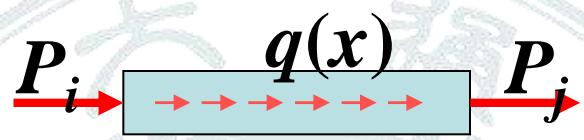

text_image

P_i → q(x) → P_j

$$
\begin{array}{l} W = - \int_ {l} q u d x - \left(P _ {i} u _ {i} + P _ {j} u _ {j}\right) \\ = - q \int_ {l} \left[ u _ {i} \quad u _ {j} \right] \left\{ \begin{array}{c} N _ {i} \\ N _ {j} \end{array} \right\} d x - \left(P _ {i} u _ {i} + P _ {j} u _ {j}\right) \\ = - \left[ \begin{array}{c c} u _ {i} & u _ {j} \end{array} \right] \left\{ \begin{array}{c} \frac {q l}{2} \\ \frac {q l}{2} \end{array} \right\} - \left[ \begin{array}{c c} u _ {i} & u _ {j} \end{array} \right] \left\{ \begin{array}{c} P _ {i} \\ P _ {j} \end{array} \right\} \\ \end{array}
$$

## Principle of minimum potential energy for a single element

$$
\Pi = U + W = \frac {1}{2} \left[ \begin{array}{l l} u _ {i} & u _ {j} \end{array} \right] \left[ \begin{array}{c c} \frac {E A}{l} & - \frac {E A}{l} \\ - \frac {E A}{l} & \frac {E A}{l} \end{array} \right] \left\{ \begin{array}{l} u _ {i} \\ u _ {j} \end{array} \right\} - \left[ \begin{array}{l l} u _ {i} & u _ {j} \end{array} \right] \left\{ \begin{array}{c} \frac {q l}{2} \\ q \frac {l}{2} \end{array} \right\} - \left[ \begin{array}{l l} u _ {i} & u _ {j} \end{array} \right] \left\{ \begin{array}{l} P _ {i} \\ P _ {j} \end{array} \right\}
$$

$$
\frac {\partial \Pi}{\partial \mathbf {u} ^ {T}} = \left[ \begin{array}{c c} \frac {E A}{l} & - \frac {E A}{l} \\ - \frac {E A}{l} & \frac {E A}{l} \end{array} \right] \left\{ \begin{array}{l} u _ {i} \\ u _ {j} \end{array} \right\} - \left\{ \begin{array}{l} \frac {q l}{2} \\ \frac {q l}{2} \end{array} \right\} - \left\{ \begin{array}{l} P _ {i} \\ P _ {j} \end{array} \right\} = 0
$$

$$
\left[ \begin{array}{c c} \frac {E A}{l} & - \frac {E A}{l} \\ - \frac {E A}{l} & \frac {E A}{l} \end{array} \right] \left\{ \begin{array}{c} u _ {i} \\ u _ {j} \end{array} \right\} = \left\{ \begin{array}{c} \frac {q l}{2} + P _ {i} \\ q \frac {l}{2} + P _ {j} \end{array} \right\}
$$

Element equilibrium equation

$$
\mathbf {k u} = \mathbf {f}
$$

where

$$
\mathbf {k} = \int_ {V} \left(\mathbf {B} ^ {\mathrm{T}} E \mathbf {B}\right) d V
$$

is the element stiffness matrix.

## Choosing elements

Choose the right type of element for a given problem  
Avoid elements with large aspect ratios and corner angle

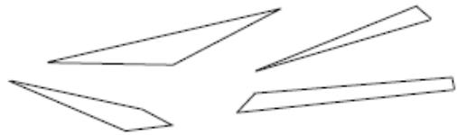

natural_image

Three abstract geometric shapes drawn with straight lines, no text or symbols present

Elements with Bad Shapes

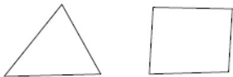

natural_image

Two simple geometric shapes: a triangle and a square, drawn with black lines on white background (no text or symbols)

Elements with Nice Shapes

Connect elements correctly

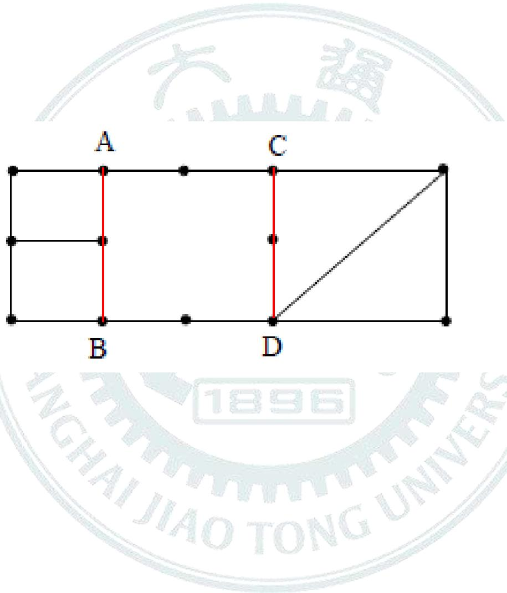

text_image

A
C
B
D
1896
INGHAI JIAO TONG UNIVERS

## Modeling and solution techniques

## Use symmetry

- Reflective symmetry  
- Rotational (cyclic symmetry)  
- Axisymmetry

## Substructures

## Convergence of FE solutions

- Reduce the element size  
- Increase the order of element

## Global dynamic equations

$$
[ \mathbf {M} ] \{\ddot {\mathbf {D}} \} + [ \mathbf {C} ] \{\dot {\mathbf {D}} \} + [ \mathbf {K} ] \{\mathbf {D} \} = \left\{\mathbf {R} ^ {\mathrm{ext}} \right\}
$$

## Explicit integration

$$
\frac {1}{\Delta t ^ {2}} \left[ \mathbf {M} \right] \left\{\mathbf {D} \right\} _ {n + 1} = \left\{\mathbf {R} ^ {\mathrm{ext}} \right\} _ {n} - \left[ \mathbf {K} - \frac {2}{\Delta t ^ {2}} \mathbf {M} + \frac {1}{\Delta t} \mathbf {C} \right] \left\{\mathbf {D} \right\} _ {n} - \left[ \frac {2}{\Delta t ^ {2}} \mathbf {M} - \frac {1}{\Delta t} \mathbf {C} \right] \left\{\mathbf {D} \right\} _ {n - 1}
$$

## Implicit integration

$$
\left[ \mathbf {K} ^ {\mathrm{eff}} \right] \left\{\mathbf {D} \right\} _ {n + 1} = \left\{\mathbf {R} ^ {\mathrm{ext}} \right\} _ {n + 1} + \left[ \mathbf {M} \right] \left[ \frac {1}{\beta \Delta t ^ {2}} \left\{\mathbf {D} \right\} _ {n} + \frac {1}{\beta \Delta t} \left\{\dot {\mathbf {D}} \right\} _ {n} + \left(\frac {1}{2 \beta} - 1\right) \left\{\ddot {\mathbf {D}} \right\} _ {n} \right]
$$

$$
+ \left[ \mathbf {C} \right] \left[ \frac {\gamma}{\beta \Delta t} \left\{\mathbf {D} \right\} _ {n} + \left(\frac {\gamma}{\beta} - 1\right) \left\{\dot {\mathbf {D}} \right\} _ {n} + \Delta t \left(\frac {\gamma}{2 \beta} - 1\right) \left\{\ddot {\mathbf {D}} \right\} _ {n} \right]
$$

where

$$
\left[ \mathbf {K} ^ {\mathrm{eff}} \right] = \frac {1}{\beta \Delta t ^ {2}} \left[ \mathbf {M} \right] + \frac {\gamma}{\beta \Delta t} \left[ \mathbf {C} \right] + \left[ \mathbf {K} \right]
$$

## Nonlinear problems

Material nonlinearity  
Contact nonlinearity  
Geometric nonlinearity

Newton-Raphson (N-R)  
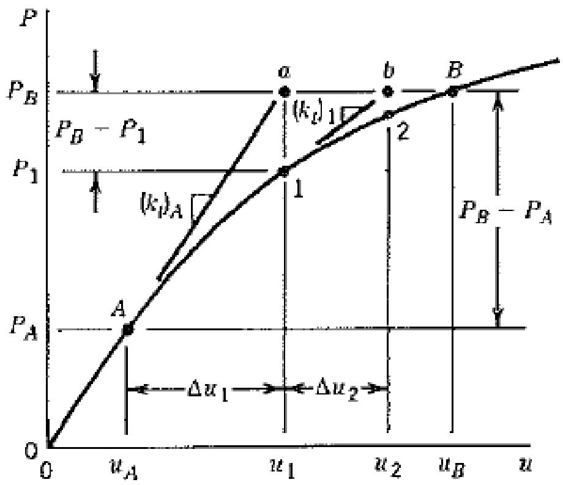

line chart

| Point | u     | P     |
|-------|-------|-------|
| a     | u₁    | (kᵢ)₁₁|
| b     | u₂    | (kᵢ)₁₁|
| 1     | u₁    | (kᵢ)ₐ |
| 2     | u₂    | (kᵢ)ₐ |
| O     | 0     | 0     |

## Modified Newton-Raphson iteration

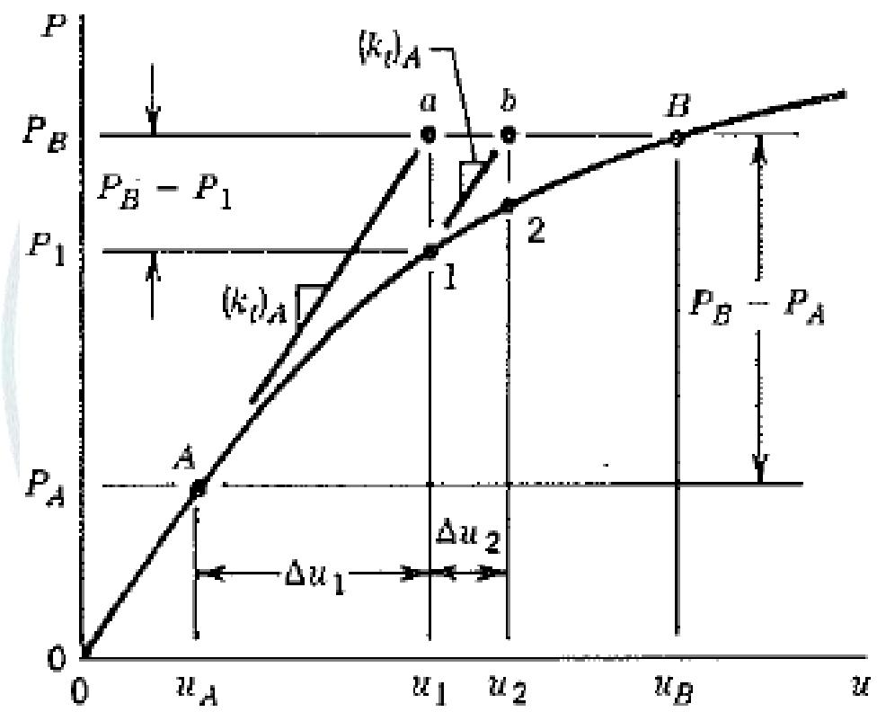

line chart

| Point | u | P | Label |
| --- | --- | --- | --- |
| A | u_A | P_A |  |
| B | u_B | P_B | a, b, b, B |
| C | u_1 | P_A |  |
| D | u_2 | P_A |  |
| E | u_A | (k_t)_A |  |
| F | u_1 | (k_t)_A |  |
| G | u_2 | (k_t)_A |  |
| H | u_A | (k_t)_A |  |
| I | u_1 | (k_t)_A |  |
| J | u_2 | (k_t)_A |  |
| K | u_A | (k_t)_A |  |
| L | u_A | (k_t)_A |  |
| M | u_A | (k_t)_A |  |
| N | u_A | (k_t)_A |  |
| O | u_A | (k_t)_A |  |
| P_B | u_A | P_B |  |
| P_B - P_1 | u_A | P_B - P_1 |  |
| P_A | u_A | P_A |  |
| P_A | u_1 | P_A |  |
| P_A | u_2 | P_A |  |
| P_B | u_B | P_B - P_A |  |
| P_B - P_A | u_A | (k_t)_A |  |
| P_B - P_1 | u_A | (k_t)_A |  |
| P_B - P_2 | u_A | (k_t)_A |  |
| Δu_1 | u_1 | Δu_2 |  |
| Δu_2 | u_2 | Δu_2 |  |
| Δu_3 | u_A | Δu_3 |  |
| Δu_4 | u_A | Δu_4 |  |
| Δu_5 | u_A | Δu_5 |  |
| Δu_6 | u_A | Δu_6 |  |
| Δu_7 | u_A | Δu_7 |  |
| Δu_8 | u_A | Δu_8 |  |
| Δu_9 | u_A | Δu_9 |  |
| Δu_10 | u_A | Δu_10 |  |
| Δu_11 | u_A | Δu_11 |  |
| Δu_12 | u_A | Δu_12 |  |
| Δu_13 | u_A | Δu_13 |  |
| Δu_14 | u_A | Δu_14 |  |
| Δu_15 | u_A | Δu_15 |  |
| Δu_16 | u_A | Δu_16 |  |
| Δu_17 | u_A | Δu_17 |  |
| Δu_18 | u_A | Δu_18 |  |
| Δu_19 | u_A | Δu_19 |  |
| Δu_20 | u_A | Δu_20 |  |
| Δu_21 | u_A | Δu_21 |  |
| Δu_22 | u_A | Δu_22 |  |
| Δu_23 | u_A | Δu_23 |  |
| Δu_24 | u_A | Δu_24 |  |
| Δu_25 | u_A | Δu_25 |  |
| Δu_26 | u_A | Δu_26 |  |
| Δu_27 | u_A | Δu_27 |  |
| Δu_28 | u_A | Δu_28 |  |
| Δu_29 | u_A | Δu_29 |  |
| Δu_30 | u_A | Δu_30 |  |
| Δu_31 | u_A | Δu_31 |  |
| Δu_32 | u_A | Δu_32 |  |
| Δu_33 | u_A | Δu_33 |  |
| Δu_34 | u_A | Δu_34 |  |
| Δu_35 | u_A | Δu_35 |  |
| Δu_36 | u_A | Δu_36 |  |
| Δu_37 | u_A | Δu_37 |  |
| Δu_38 | u_A | Δu_38 |  |
| Δu_39 | u_A | Δu_39 |  |
| Δu_40 | u_A | Δu_40 |  |
| Δu_41 | u_A | Δu_41 |  |
| Δu_42 | u_A | Δu_42 |  |
| Δu_43 | u_A | Δu_43 |  |
| Δu_44 | u_A | Δu_44 |  |
| Δu_45 | u_A | Δu_45 |  |
| Δu_46 | u_A | Δu_46 |  |
| Δu_47 | u_A | Δu_47 |  |
| Δu_48 | u_A | Δu_48 |  |
| Δu_49 | u_A | Δu_49 |  |
| Δu_50 | u_A | Δu_50 |  |
| Δu_51 | u_A | Δu_51 |  |
| Δu_52 | u_A | Δu_52 |  |
| Δu_53 | u_A | Δu_53 |  |
| Δu_54 | u_A | Δu_54 |  |
| Δu_55 | u_A | Δu_55 |  |
| Δu_56 | u_A | Δu_56 |  |
| Δu_57 | u_A | Δu_57 |  |
| Δu_58 | u_A | Δu_58 |  |
| Δu_59 | u_A | Δu_59 |  |

Arc-length method  
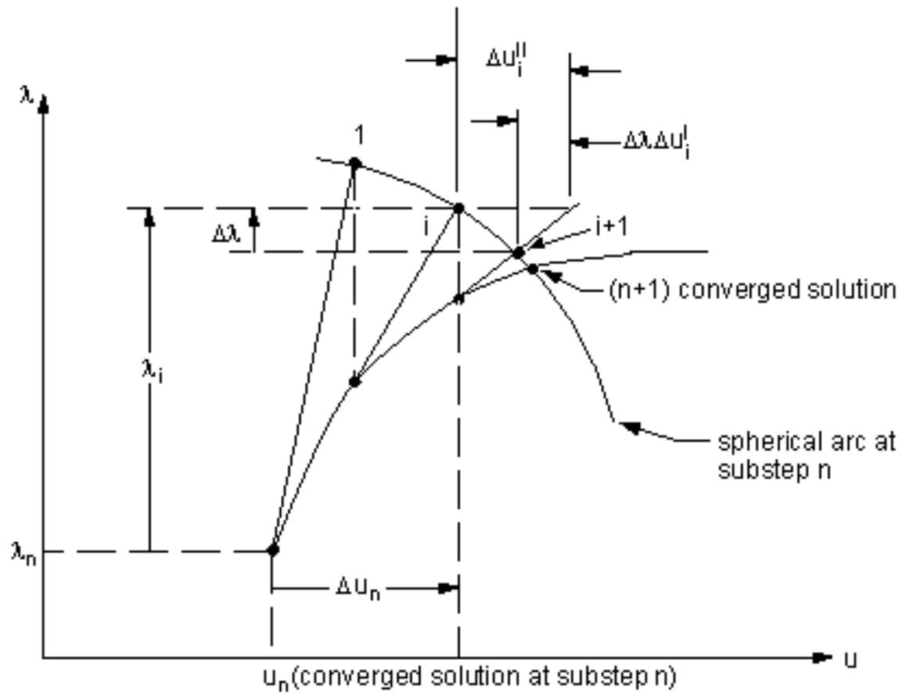

line chart

| u_n | λ_i | λ_n | Δu_i^ll | Δu_i^l | Δu_n^l |
| --- | --- | --- | ------- | ------ | ------ |
| 0   | λ_i | λ_n |         |        |        |
| 1   |         |         |         |        |        |
| i   |         |         |         |        |        |
| i+1 |         |         |         |        |        |
| (n+1)|         |         |         |        |        |
| spherical arc at substep n |         |         |         |        |        |

Zienkiewicz O.C., Taylor, R.L. and Zhu, J.Z. The finite element method: Its basis and fundamentals ( $7^{th}$ ed.), Elsevier Butterworth-Heinemann, 2013.  
Reddy, J.N. An introduction to the Finite Element Method. McGraw-Hill, New York, 1993.  
Cook. R.D., Malkus, D.S., Plesha, M.E. Witt, R.J. Concepts and applications of finite element analysis ( $4^{th}$ ed.), John Wiley & Sos. Inc. New York, 2002.  
Bathe, K.J. Finite element procedures. Prentice Hall, Englewood Cliffs, NJ. 1996.  
Rao, S.S. The finite element method in engineering ( $5^{th}$ ed.) Elsevier Butterworth-Heinemann. 2011.

# Module Schedule

text_image

Module Schedule
SHANGHAI JIAO TONG UNIVERSITY

## Thanks!

natural_image

Exterior view of a traditional Chinese building with a stone lion statue and decorative plaques (no visible text or symbols)

