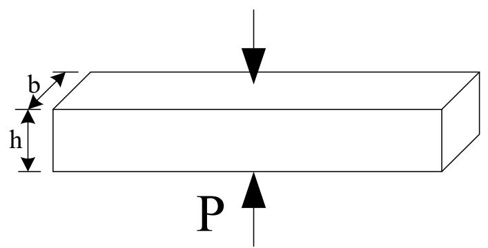
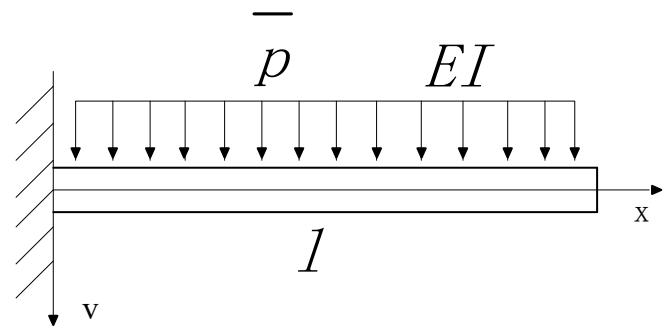

## 习题三

1 考虑图中所示的矩形截面杆，中部受一对夹持力P作用，求由P引起的杆长变化 $\Delta$ 。

text_image

b
h
P

2 求泛函的极值函数。分别用直接法（Euler方程法）和间接法（Ritz法，取三项）。

$$
Q [ y ] = \int_ {0} ^ {1} (y ^ {\prime 2} - 4 y ^ {2}) d x \quad y (0) = 0, y (1) = 1
$$

3 求下列泛函的欧拉方程和自然边界条件

$$
Q [ y ] = \frac {1}{2} \int_ {x _ {0}} ^ {x _ {1}} \Big [ p _ {(x)} y ^ {\prime \prime 2} + q _ {(x)} y ^ {\prime 2} + r _ {(x)} y ^ {2} - 2 s _ {(x)} y \Big ] d x
$$

4 如图所示为一受均布荷载的悬臂梁。

(1) 用挠度方程求出精确解。  
(2) 写出两种以上的许可位移场（试函数）。  
(3) 基于许可位移（至少用一种），分别用以下几种原理求挠度曲线 $\omega(X)$ ，并和精确解比较。

- 最小势能原理（即Rayleigh-Ritz法）。  
- Galerkin加权残值法。  
- 残值最小二乘法。

text_image

p EI
x
l
v

5 设某一类1D物理问题的微分方程为

$$
\frac {d ^ {2} \varphi}{d x ^ {2}} + \varphi + x = 0 (0 \leq x \leq 1)
$$

边界条件为

$$
\varphi (0) = \varphi (1) = 0
$$

若采用下列试函数

$$
\varphi (x) = c _ {1} \varphi_ {1} (x) + c _ {2} \varphi_ {2} (x)
$$

其中

$$
\begin{array}{l} \varphi_ {1} (x) = x (1 - x) \\ \varphi_ {2} (x) = x ^ {2} (1 - x) \\ \end{array}
$$

试应用以下方法求解该问题:

(1) 加权残值法中的Galerkin方法,  
(2) 加权残值法中的最小二乘法,  
(3) Rayleigh-Ritz方法（对泛函求极值的方法）。

\- 6 使用Galerkin 方法推导二维稳定状态热传导问题的一个四节点有限元单元