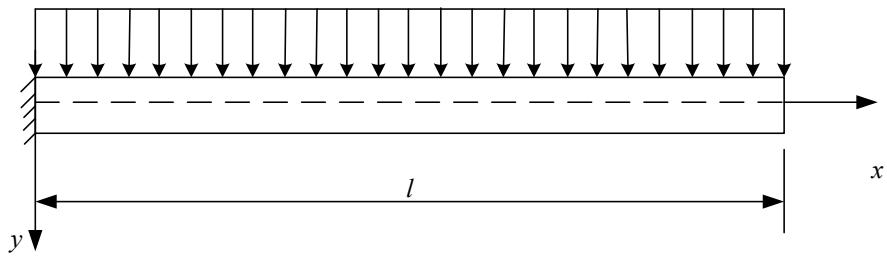
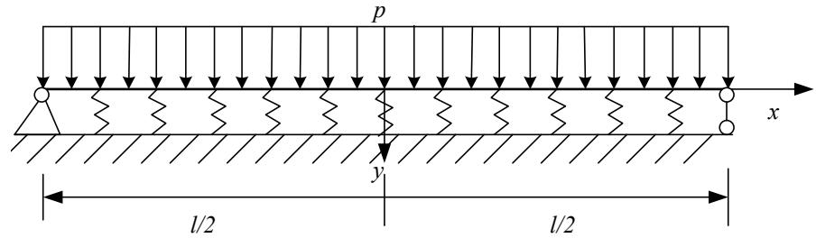
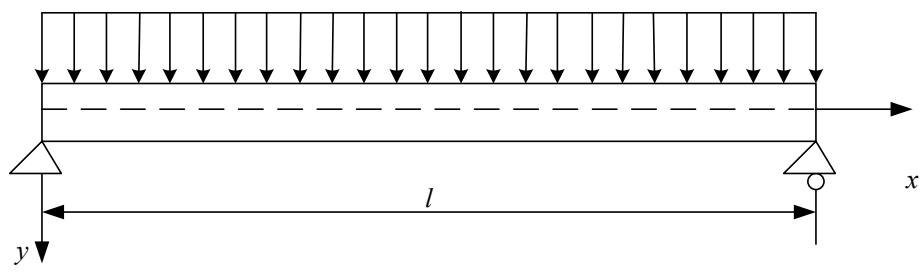
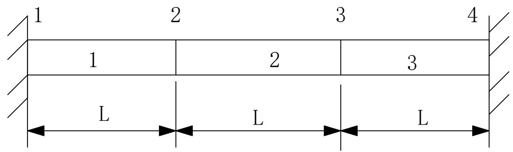

# 习题四 解答

---

## 1. 推导等效泛函并用 Ritz 法求解

**题目**：对于方程 $\frac{d^2\varphi}{dx^2} + \varphi = x$，边界条件 $\varphi(0) = 0, \varphi(1) = 1$。试推导出与它等效的泛函。若采用近似函数 $\varphi(X) = a_0 + a_1X + a_2X^2$，试用泛函极值的方法求解待定参数。

**解答**：

**方法**：利用变分原理，将微分方程转化为泛函极值问题。

设泛函为：

$$J[\varphi] = \int_0^1 F(x, \varphi, \varphi') dx$$

Euler 方程为：

$$\frac{\partial F}{\partial \varphi} - \frac{d}{dx}\left(\frac{\partial F}{\partial \varphi'}\right) = 0$$

与原方程对比：$\varphi'' + \varphi = x$

取 $F = \frac{1}{2}(\varphi')^2 - \frac{1}{2}\varphi^2 + x\varphi$

验证 Euler 方程：

$$\frac{\partial F}{\partial \varphi} = -\varphi + x$$

$$\frac{\partial F}{\partial \varphi'} = \varphi'$$

$$\frac{\partial F}{\partial \varphi} - \frac{d}{dx}\left(\frac{\partial F}{\partial \varphi'}\right) = -\varphi + x - \varphi'' = 0$$

即 $\varphi'' + \varphi = x$ ✓

**等效泛函**：

$$\boxed{J[\varphi] = \int_0^1 \left[\frac{1}{2}(\varphi')^2 - \frac{1}{2}\varphi^2 + x\varphi\right] dx}$$

### Ritz 法求解

**处理非齐次边界条件**：

令 $\varphi = w + x$，其中 $w(0) = w(1) = 0$

代入泛函：

$$J[w] = \int_0^1 \left[\frac{1}{2}(w'+1)^2 - \frac{1}{2}(w+x)^2 + x(w+x)\right] dx$$

展开：

$$= \int_0^1 \left[\frac{1}{2}(w'^2 + 2w' + 1) - \frac{1}{2}(w^2 + 2wx + x^2) + xw + x^2\right] dx$$

$$= \int_0^1 \left[\frac{1}{2}w'^2 + w' + \frac{1}{2} - \frac{1}{2}w^2 - wx - \frac{1}{2}x^2 + xw + x^2\right] dx$$

$$= \int_0^1 \left[\frac{1}{2}w'^2 - \frac{1}{2}w^2 + w' + \frac{1}{2} + \frac{1}{2}x^2\right] dx$$

**取试函数**：

$$w = a_0 + a_1 X + a_2 X^2$$

但需满足 $w(0) = w(1) = 0$，所以：

$$w = a_1 X(1-X) + a_2 X^2(1-X)$$

或直接用题目给的近似函数 $\varphi = a_0 + a_1 X + a_2 X^2$，代入原泛函。

**代入 $\varphi = a_0 + a_1 X + a_2 X^2$**：

$$\varphi' = a_1 + 2a_2 X$$

$$J = \int_0^1 \left[\frac{1}{2}(a_1 + 2a_2 X)^2 - \frac{1}{2}(a_0 + a_1 X + a_2 X^2)^2 + X(a_0 + a_1 X + a_2 X^2)\right] dX$$

计算积分并对 $a_0, a_1, a_2$ 求偏导令为零：

$$\frac{\partial J}{\partial a_0} = 0, \quad \frac{\partial J}{\partial a_1} = 0, \quad \frac{\partial J}{\partial a_2} = 0$$

解方程组得 $a_0, a_1, a_2$。

**边界条件约束**：

$\varphi(0) = a_0 = 0$

$\varphi(1) = a_0 + a_1 + a_2 = 1$

因此 $a_0 = 0$，$a_1 + a_2 = 1$。

只需对 $a_1$（或 $a_2$）求极值，另一个由约束确定。

---

## 2. 证明 Euler 方程

**题目**：若函数 $Y(X)$ 的二次泛函为 $\Pi[y] = \int_{x_1}^{x_2}[p(x)y^2 + 2q(x)yy' + r(x)y'^2 + 2f(x)y + 2g(x)y']dx$，试证明所对应的控制方程（欧拉方程）为 $(ry')' + (q'-p)y + g' - f = 0$。

**解答**：

$$\frac{\partial F}{\partial y} = 2py + 2qy' + 2f$$

$$\frac{\partial F}{\partial y'} = 2qy + 2ry' + 2g$$

**Euler 方程**：

$$\frac{\partial F}{\partial y} - \frac{d}{dx}\left(\frac{\partial F}{\partial y'}\right) = 0$$

$$2py + 2qy' + 2f - \frac{d}{dx}(2qy + 2ry' + 2g) = 0$$

展开导数项：

$$\frac{d}{dx}(2qy + 2ry' + 2g) = 2q'y + 2qy' + 2r'y' + 2ry'' + 2g'$$

代入：

$$2py + 2qy' + 2f - 2q'y - 2qy' - 2r'y' - 2ry'' - 2g' = 0$$

整理：

$$-2ry'' - 2r'y' + 2(p - q')y + 2(f - g') = 0$$

除以 $-2$：

$$ry'' + r'y' - (p - q')y - (f - g') = 0$$

注意到 $(ry')' = r'y' + ry''$，因此：

$$\boxed{(ry')' + (q' - p)y + g' - f = 0}$$

$\blacksquare$

---

## 3. 证明 $w = a(1 - \cos\frac{\pi x}{2l})$ 不可用作 Galerkin 法试函数

**题目**：证明 $w = a(1 - \cos\frac{\pi x}{2l})$ 不可用作悬臂梁问题的 Galerkin 法试函数。

**解答**：

1. 满足**所有边界条件**（本质边界条件和自然边界条件）
2. 函数足够光滑

**检查试函数**：

$$w = a(1 - \cos\frac{\pi x}{2l})$$

**边界条件**：

- 固定端 $x=0$：$w(0) = a(1 - 1) = 0$ ✓
- 固定端 $x=0$：$w'(0) = a \cdot \frac{\pi}{2l}\sin(0) = 0$ ✓
- 自由端 $x=l$：$w''(l) = -a(\frac{\pi}{2l})^2\cos\frac{\pi}{2} = 0$ ✓（弯矩为零）
- 自由端 $x=l$：$w'''(l) = a(\frac{\pi}{2l})^3\sin\frac{\pi}{2} = a(\frac{\pi}{2l})^3 \neq 0$ ✗

**问题**：$w'''(l) \neq 0$，不满足自由端剪力为零的自然边界条件。

因此，$w = a(1 - \cos\frac{\pi x}{2l})$ **不可用作 Galerkin 法试函数**。

$\blacksquare$

---

## 4. 弹性地基梁的变分推导与 Galerkin 求解

**题目**：利用变分法推导弹性地基梁的微分方程及边界条件，并利用 Galerkin 法取一阶近似进行求解。

**解答**：

$$\Pi = \int_0^l \left[\frac{EI}{2}(w'')^2 + \frac{k}{2}w^2 - pw\right] dx$$

### 变分推导微分方程

$$\delta\Pi = \int_0^1 \left[EI w'' \delta w'' + kw\delta w - p\delta w\right] dx = 0$$

对第一项分部积分两次：

$$\int_0^l EI w'' \delta w'' dx = \left[EI w'' \delta w'\right]_0^l - \int_0^l (EI w'')' \delta w' dx$$

$$= \left[EI w'' \delta w'\right]_0^l - \left[(EI w'')' \delta w\right]_0^l + \int_0^l (EI w'')'' \delta w \, dx$$

合并：

$$\int_0^l \left[(EI w'')'' + kw - p\right] \delta w \, dx + \text{边界项} = 0$$

**微分方程**：

$$\boxed{EI\frac{d^4 w}{dx^4} + kw = p}$$

**边界条件**：

- 固定端：$w = 0, w' = 0$
- 自由端：$w'' = 0, w''' = 0$

### Galerkin 一阶近似

**试函数**：

$$w = a_1 \sin\frac{\pi x}{l}$$

代入 Galerkin 条件：

$$\int_0^l \left[EI w'''' + kw - p\right] \sin\frac{\pi x}{l} dx = 0$$

计算得 $a_1$，回代得挠度曲线。

---

## 5. 简支梁的加权残值法

**题目**：采用课件中给出的二阶试函数，任选两种加权残值法计算简支梁问题。

**解答**：

$$w(x) = \frac{p}{24EI}(x^4 - 2lx^3 + l^3 x)$$

**二阶试函数**：

$$w = a_1 \sin\frac{\pi x}{l} + a_2 \sin\frac{2\pi x}{l}$$

### 方法 1：Galerkin 法

**权函数**：$W_i = \sin\frac{i\pi x}{l}$

**Galerkin 条件**：

$$\int_0^l (EI w'''' - p) \sin\frac{i\pi x}{l} dx = 0, \quad i = 1, 2$$

计算：

$$w'''' = a_1\left(\frac{\pi}{l}\right)^4 \sin\frac{\pi x}{l} + a_2\left(\frac{2\pi}{l}\right)^4 \sin\frac{2\pi x}{l}$$

代入得：

$$EI a_1\left(\frac{\pi}{l}\right)^4 \cdot \frac{l}{2} = p \cdot \frac{2l}{\pi}$$

$$EI a_2\left(\frac{2\pi}{l}\right)^4 \cdot \frac{l}{2} = p \cdot \frac{l}{\pi}$$

解得：

$$a_1 = \frac{4pl^4}{\pi^5 EI}, \quad a_2 = \frac{pl^4}{4\pi^5 EI}$$

### 方法 2：最小二乘法

**目标**：最小化 $J = \int_0^l R^2 dx$，其中 $R = EI w'''' - p$

$$\frac{\partial J}{\partial a_i} = 2\int_0^l R \frac{\partial R}{\partial a_i} dx = 0$$

计算得方程组，解得 $a_1, a_2$。

---

## 6. 弹性杆的有限元分析

**题目**：设横截面面积为常数的弹性杆两端固定，杆长为 3L，各处受相同的体积力 f 作用。采用 3 个长为 L 的线性元，试给出单元形函数矩阵、单元刚度阵、总体刚度矩阵。

**解答**：

- 节点：1, 2, 3, 4
- 单元：$e_1 = [1,2]$, $e_2 = [2,3]$, $e_3 = [3,4]$
- 每个单元长度 $L$

### 单元形函数矩阵

线性单元的形函数：

$$N_1 = 1 - \frac{x}{L}, \quad N_2 = \frac{x}{L}$$

形函数矩阵：

$$\mathbf{N} = [N_1 \quad N_2] = \left[1 - \frac{x}{L} \quad \frac{x}{L}\right]$$

### 单元刚度矩阵

$$k^e = \int_0^L EA \left(\frac{d\mathbf{N}}{dx}\right)^T \left(\frac{d\mathbf{N}}{dx}\right) dx$$

$$\frac{d\mathbf{N}}{dx} = \left[-\frac{1}{L} \quad \frac{1}{L}\right]$$

$$k^e = EA \int_0^L \begin{bmatrix} \frac{1}{L^2} & -\frac{1}{L^2} \\ -\frac{1}{L^2} & \frac{1}{L^2} \end{bmatrix} dx = \frac{EA}{L}\begin{bmatrix} 1 & -1 \\ -1 & 1 \end{bmatrix}$$

三个单元的刚度矩阵相同：

$$k^{(1)} = k^{(2)} = k^{(3)} = \frac{EA}{L}\begin{bmatrix} 1 & -1 \\ -1 & 1 \end{bmatrix}$$

### 总体刚度矩阵

4 个节点，总体刚度矩阵为 $4 \times 4$：

$$K = \frac{EA}{L}\begin{bmatrix} 1 & -1 & 0 & 0 \\ -1 & 2 & -1 & 0 \\ 0 & -1 & 2 & -1 \\ 0 & 0 & -1 & 1 \end{bmatrix}$$

### 载荷向量

体积力 $f$ 的等效节点载荷：

$$f^e = \int_0^L f \mathbf{N}^T dx = f \int_0^L \begin{bmatrix} 1 - x/L \\ x/L \end{bmatrix} dx = \frac{fL}{2}\begin{bmatrix} 1 \\ 1 \end{bmatrix}$$

总体载荷向量：

$$F = \frac{fL}{2}\begin{bmatrix} 1 \\ 2 \\ 2 \\ 1 \end{bmatrix}$$

### 引入边界条件

两端固定：$u_1 = u_4 = 0$

消去第 1、4 行/列，得缩减方程：

$$\frac{EA}{L}\begin{bmatrix} 2 & -1 \\ -1 & 2 \end{bmatrix}\begin{bmatrix} u_2 \\ u_3 \end{bmatrix} = \frac{fL}{2}\begin{bmatrix} 2 \\ 2 \end{bmatrix}$$

解得：

$$u_2 = u_3 = \frac{fL^2}{EA}$$
