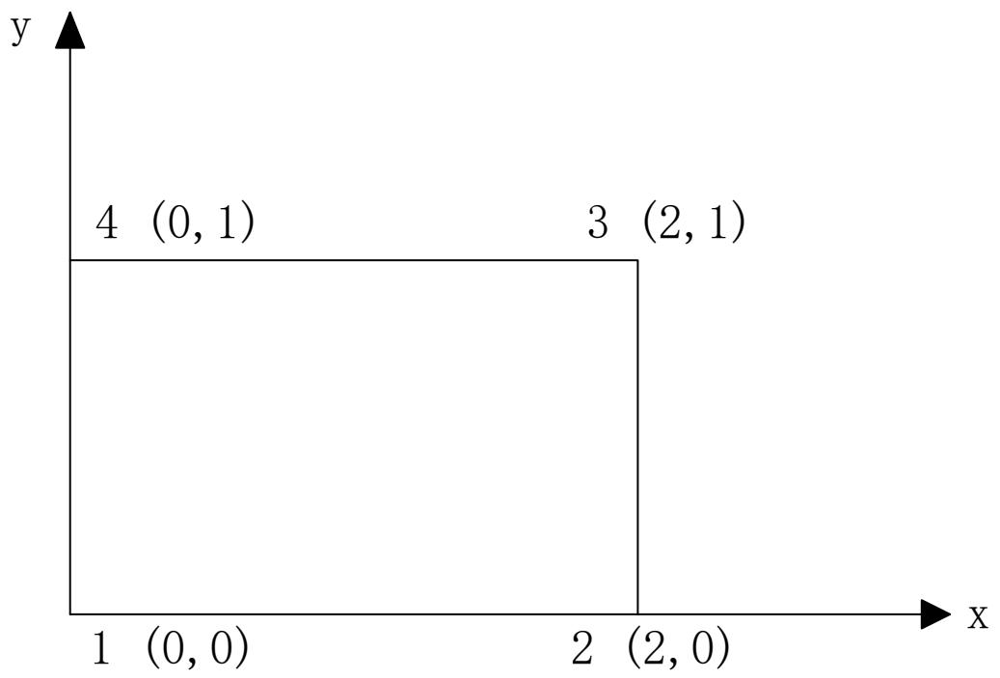

# 习题五 解答

---

## 1. 有限元法求解方程

**题目**：利用有限元法求解方程 $-u''(x) + u(x) = -x$，$u(0) = u(1) = 0$。要求：用结点 0, 1/4, 1/2, 3/4, 1 将区间分为四个单元。

**解答**：

节点：$x_0 = 0, x_1 = 1/4, x_2 = 1/2, x_3 = 3/4, x_4 = 1$

4 个单元，每个单元长度 $h = 1/4$

### 形函数

线性单元形函数：

$$N_1 = 1 - \xi, \quad N_2 = \xi$$

其中 $\xi = (x - x_i)/h$

### 单元刚度矩阵

**刚度矩阵**：

$$k^e = \int_0^h \left(\frac{d\mathbf{N}}{dx}\right)^T \left(\frac{d\mathbf{N}}{dx}\right) + \mathbf{N}^T\mathbf{N} \, dx$$

计算：

$$\frac{d\mathbf{N}}{dx} = \left[-\frac{1}{h} \quad \frac{1}{h}\right]$$

$$k^e_{11} = \int_0^h \left(\frac{1}{h^2} + (1-\xi/h)^2\right) dx = \frac{1}{h} + \frac{h}{3}$$

$$k^e_{12} = k^e_{21} = \int_0^h \left(-\frac{1}{h^2} + (1-\xi/h)(\xi/h)\right) dx = -\frac{1}{h} + \frac{h}{6}$$

$$k^e_{22} = \int_0^h \left(\frac{1}{h^2} + (\xi/h)^2\right) dx = \frac{1}{h} + \frac{h}{3}$$

代入 $h = 1/4$：

$$k^e = \begin{bmatrix} 4 + 1/12 & -4 + 1/24 \\ -4 + 1/24 & 4 + 1/12 \end{bmatrix} = \begin{bmatrix} 49/12 & -95/24 \\ -95/24 & 49/12 \end{bmatrix}$$

### 载荷向量

$$f^e = \int_0^h x\mathbf{N}^T dx$$

对于单元 $e_i$（节点 $i$ 和 $i+1$，坐标 $x_i$ 和 $x_{i+1}$）：

$$f^e_1 = \int_0^h (x_i + \xi h)(1 - \xi/h) h \, d\xi = h\left(\frac{x_i h}{2} + \frac{h^2}{6}\right)$$

$$f^e_2 = \int_0^h (x_i + \xi h)(\xi/h) h \, d\xi = h\left(\frac{x_i h}{2} + \frac{h^2}{3}\right)$$

### 总体刚度矩阵

5 个节点，$5 \times 5$ 总体刚度矩阵（组装 4 个单元）。

引入边界条件 $u_0 = u_4 = 0$，消去第 1、5 行/列，得 $3 \times 3$ 方程组。

### 求解

求解缩减后的方程组，得节点位移 $u_1, u_2, u_3$。

---

## 2. 薄膜平衡问题导出 Poisson 方程

**题目**：针对垂直外力作用下的薄膜平衡问题，用变分的方法导出其对应的 Poisson 方程。

**解答**：

- 薄膜张力 $T$（单位长度）
- 垂直外力 $p(x,y)$（单位面积）
- 挠度 $w(x,y)$

**虚功原理**：

薄膜的应变能：

$$U = \frac{T}{2}\iint_\Omega \left[\left(\frac{\partial w}{\partial x}\right)^2 + \left(\frac{\partial w}{\partial y}\right)^2\right] dxdy$$

外力做功：

$$W = \iint_\Omega p \cdot w \, dxdy$$

总势能：

$$\Pi = U - W = \frac{T}{2}\iint_\Omega \left[(\nabla w)^2 - \frac{2p}{T}w\right] dxdy$$

**变分**：

$$\delta\Pi = T\iint_\Omega \left[\frac{\partial w}{\partial x}\frac{\partial \delta w}{\partial x} + \frac{\partial w}{\partial y}\frac{\partial \delta w}{\partial y} - \frac{p}{T}\delta w\right] dxdy = 0$$

对前两项分部积分（利用 Green 公式）：

$$\iint_\Omega \nabla w \cdot \nabla \delta w \, dxdy = -\iint_\Omega \Delta w \cdot \delta w \, dxdy + \oint_{\partial\Omega} \frac{\partial w}{\partial n} \delta w \, ds$$

边界上 $\delta w = 0$（固定边界），因此：

$$-T\iint_\Omega \left(\Delta w + \frac{p}{T}\right) \delta w \, dxdy = 0$$

由于 $\delta w$ 任意，得：

$$\boxed{\Delta w = -\frac{p}{T}}$$

即 **Poisson 方程**：

$$\frac{\partial^2 w}{\partial x^2} + \frac{\partial^2 w}{\partial y^2} = -\frac{p}{T}$$

---

## 3. 线性三角形单元刚度矩阵推导

**题目**：推导线性三角形单元（CST）的单元刚度矩阵。

**解答**：

**形函数**：

$$N_i = \frac{1}{2\Delta}(a_i + b_i x + c_i y)$$

其中：

$$a_i = x_j y_m - x_m y_j, \quad b_i = y_j - y_m, \quad c_i = x_m - x_j$$

（$i, j, m$ 循环置换）

**单元面积**：

$$\Delta = \frac{1}{2}\begin{vmatrix} 1 & x_i & y_i \\ 1 & x_j & y_j \\ 1 & x_m & y_m \end{vmatrix}$$

**应变-位移矩阵 $[B]$**（$3 \times 6$）：

**Step 1**：写出形函数矩阵 $[N]$

$$[N] = \begin{bmatrix} N_i & 0 & N_j & 0 & N_m & 0 \\ 0 & N_i & 0 & N_j & 0 & N_m \end{bmatrix}$$

位移场插值：$\begin{bmatrix} u \\ v \end{bmatrix} = [N]\{d\}^e$

**Step 2**：形函数对坐标求导

$$\frac{\partial N_i}{\partial x} = \frac{b_i}{2\Delta}, \quad \frac{\partial N_i}{\partial y} = \frac{c_i}{2\Delta}$$

**Step 3**：由几何方程 $\varepsilon_x = \frac{\partial u}{\partial x}$，$\varepsilon_y = \frac{\partial v}{\partial y}$，$\gamma_{xy} = \frac{\partial u}{\partial y} + \frac{\partial v}{\partial x}$ 得 [B] 矩阵

$$[B] = \begin{bmatrix} \frac{\partial N_i}{\partial x} & 0 & \frac{\partial N_j}{\partial x} & 0 & \frac{\partial N_m}{\partial x} & 0 \\ 0 & \frac{\partial N_i}{\partial y} & 0 & \frac{\partial N_j}{\partial y} & 0 & \frac{\partial N_m}{\partial y} \\ \frac{\partial N_i}{\partial y} & \frac{\partial N_i}{\partial x} & \frac{\partial N_j}{\partial y} & \frac{\partial N_j}{\partial x} & \frac{\partial N_m}{\partial y} & \frac{\partial N_m}{\partial x} \end{bmatrix} = \frac{1}{2\Delta}\begin{bmatrix} b_i & 0 & b_j & 0 & b_m & 0 \\ 0 & c_i & 0 & c_j & 0 & c_m \\ c_i & b_i & c_j & b_j & c_m & b_m \end{bmatrix}$$

**弹性矩阵 $[D]$**（平面应力）：

$$[D] = \frac{E}{1-\nu^2}\begin{bmatrix} 1 & \nu & 0 \\ \nu & 1 & 0 \\ 0 & 0 & \frac{1-\nu}{2} \end{bmatrix}$$

### 单元刚度矩阵

$$[k]^e = t\Delta [B]^T[D][B]$$

其中 $t$ 是单元厚度。

**计算过程**：

1. 计算 $\Delta$（单元面积）
2. 计算 $b_i, c_i$ 系数
3. 构造 $[B]$ 矩阵
4. 确定 $[D]$ 矩阵
5. 计算 $[k]^e = t\Delta [B]^T[D][B]$

**结果**：$[k]^e$ 是 $6 \times 6$ 对称矩阵。

---

## 4. 矩形单元刚度矩阵推导

**题目**：推导图示矩形单元的单元刚度矩阵。

**解答**：

由图可知节点坐标：1(0,0), 2(2,0), 3(2,1), 4(0,1)

**自然坐标**：$\xi, \eta \in [-1, 1]$

**形函数**：

$$N_i = \frac{1}{4}(1 + \xi\xi_i)(1 + \eta\eta_i), \quad i = 1,2,3,4$$

节点坐标：$(\xi_i, \eta_i) = (\pm 1, \pm 1)$

### 等参变换

$$x = \sum_{i=1}^4 N_i x_i, \quad y = \sum_{i=1}^4 N_i y_i$$

**Jacobi 矩阵**：

$$J = \begin{bmatrix} \frac{\partial x}{\partial \xi} & \frac{\partial y}{\partial \xi} \\ \frac{\partial x}{\partial \eta} & \frac{\partial y}{\partial \eta} \end{bmatrix}$$

### 应变-位移矩阵

$$\frac{\partial N_i}{\partial x} = J^{-1}_{11}\frac{\partial N_i}{\partial \xi} + J^{-1}_{12}\frac{\partial N_i}{\partial \eta}$$

$$\frac{\partial N_i}{\partial y} = J^{-1}_{21}\frac{\partial N_i}{\partial \xi} + J^{-1}_{22}\frac{\partial N_i}{\partial \eta}$$

**$[B]$ 矩阵**（$3 \times 8$）：

$$[B] = \begin{bmatrix} \frac{\partial N_1}{\partial x} & 0 & \cdots & \frac{\partial N_4}{\partial x} & 0 \\ 0 & \frac{\partial N_1}{\partial y} & \cdots & 0 & \frac{\partial N_4}{\partial y} \\ \frac{\partial N_1}{\partial y} & \frac{\partial N_1}{\partial x} & \cdots & \frac{\partial N_4}{\partial y} & \frac{\partial N_4}{\partial x} \end{bmatrix}$$

### 单元刚度矩阵

$$[k]^e = \int_{-1}^{1}\int_{-1}^{1} [B]^T[D][B] \, t \, |J| \, d\xi d\eta$$

**数值积分**（2×2 Gauss 积分）：

$$[k]^e \approx \sum_{i=1}^2 \sum_{j=1}^2 [B]^T[D][B] \, t \, |J| \, w_i w_j$$

其中 $w_i = w_j = 1$，积分点 $\xi_i, \eta_j = \pm 1/\sqrt{3}$。

---

## 5. 面积坐标与直角坐标的转换关系

**题目**：试证明面积坐标与直角坐标满足转换关系：$x = x_iL_i + x_jL_j + x_mL_m$，$y = y_iL_i + y_jL_j + y_mL_m$。

**解答**：

$$L_i = \frac{\text{面积}(P, j, m)}{\text{面积}(i, j, m)} = \frac{a_i + b_i x + c_i y}{2\Delta}$$

**证明**：

由面积坐标的定义：

$$L_i + L_j + L_m = 1$$

将 $x_i, x_j, x_m$ 用面积坐标表示：

$$x_i L_i + x_j L_j + x_m L_m = x_i \cdot \frac{a_i + b_i x + c_i y}{2\Delta} + x_j \cdot \frac{a_j + b_j x + c_j y}{2\Delta} + x_m \cdot \frac{a_m + b_m x + c_m y}{2\Delta}$$

计算系数：

- $x$ 的系数：$\frac{x_i b_i + x_j b_j + x_m b_m}{2\Delta}$

由 $b_i = y_j - y_m$ 等：

$$x_i b_i + x_j b_j + x_m b_m = x_i(y_j - y_m) + x_j(y_m - y_i) + x_m(y_i - y_j)$$

$$= x_i y_j - x_i y_m + x_j y_m - x_j y_i + x_m y_i - x_m y_j$$

$$= 2\Delta$$

因此 $x$ 的系数为 $1$。

类似可证常数项和 $y$ 的系数。

因此：

$$\boxed{x = x_i L_i + x_j L_j + x_m L_m}$$
$$\boxed{y = y_i L_i + y_j L_j + y_m L_m}$$

$\blacksquare$

---

## 6. 平行四边形单元的 Jacobi 矩阵

**题目**：证明二维平行四边形单元的 Jacobi 矩阵是常数。

**解答**：

$$x_2 - x_1 = x_3 - x_4, \quad y_2 - y_1 = y_3 - y_4$$

$$x_4 - x_1 = x_3 - x_2, \quad y_4 - y_1 = y_3 - y_2$$

**等参变换**：

$$x = \sum_{i=1}^4 N_i x_i, \quad y = \sum_{i=1}^4 N_i y_i$$

**Jacobi 矩阵**：

$$J = \begin{bmatrix} \frac{\partial x}{\partial \xi} & \frac{\partial y}{\partial \xi} \\ \frac{\partial x}{\partial \eta} & \frac{\partial y}{\partial \eta} \end{bmatrix}$$

**展开计算**：以 $\partial x/\partial\xi$ 为例

$$\frac{\partial N_i}{\partial\xi} = \frac{\xi_i}{4}(1+\eta\eta_i), \quad i=1,2,3,4$$

代入得：

$$\frac{\partial x}{\partial\xi} = \sum_{i=1}^4 \frac{\partial N_i}{\partial\xi} x_i
= \frac14\Big[-(1-\eta)x_1 + (1-\eta)x_2 + (1+\eta)x_3 - (1+\eta)x_4\Big]$$

**问题**：单独看每个 $\partial N_i/\partial\xi$ 不是常数（含 $\eta$），但求和后是否含 $\eta$ 取决于节点坐标。

将 $\eta$ 的项（$-\frac14\eta x_1 + \frac14\eta x_2 + \frac14\eta x_3 - \frac14\eta x_4$）提取，合并得 $\frac{\eta}{4}\big[(x_2-x_1) - (x_3-x_4)\big]$。要使该交叉项为零（即 $\partial x/\partial\xi$ 与 $\eta$ 无关），需要：

$$x_2 - x_1 = x_3 - x_4$$

对 $\partial x/\partial\eta$、$\partial y/\partial\xi$、$\partial y/\partial\eta$ 做同样展开，可得平行四边形的完整条件：

$$\boxed{x_2 - x_1 = x_3 - x_4,\quad y_2 - y_1 = y_3 - y_4}$$
$$\boxed{x_4 - x_1 = x_3 - x_2,\quad y_4 - y_1 = y_3 - y_2}$$

即对边平行且相等。在此条件下，J 中所有 $\xi,\eta$ 交叉项消去，**每个元素为常数**。

**结论**：平行四边形单元的 Jacobi 矩阵是常数矩阵。$\blacksquare$

---

## 7. 轴对称回转体的有限元分析

**题目**：对于承受轴对称载荷的回转体，若取 3 节点三角形环形单元，试求：(1) 以转速 $\omega$ 旋转时节点的等效载荷；(2) 若回转轴方向有 $\alpha_z$ 的加速度时，如何计算节点的等效荷载。

**解答**：

**离心力**：单位体积力 $f = \rho\omega^2 r$（径向）

**等效节点载荷**：

$$F_i^e = \int_V N_i \rho\omega^2 r \, dV$$

对于轴对称问题，$dV = 2\pi r \, dr \, dz$

$$F_i^e = 2\pi \int_{\Delta_e} N_i \rho\omega^2 r^2 \, dr \, dz$$

利用面积坐标积分公式：

$$\int_{\Delta_e} L_i^a L_j^b L_m^c \, dA = \frac{a! \, b! \, c!}{(a+b+c+2)!} 2\Delta_e$$

计算得节点等效载荷。

### (2) 轴向加速度 $\alpha_z$ 的等效载荷

**惯性力**：单位体积力 $f_z = -\rho\alpha_z$（轴向）

**等效节点载荷**：

$$F_i^e = \int_V N_i (-\rho\alpha_z) \, dV = -2\pi\rho\alpha_z \int_{\Delta_e} N_i r \, dA$$

类似地利用面积坐标积分公式计算。
