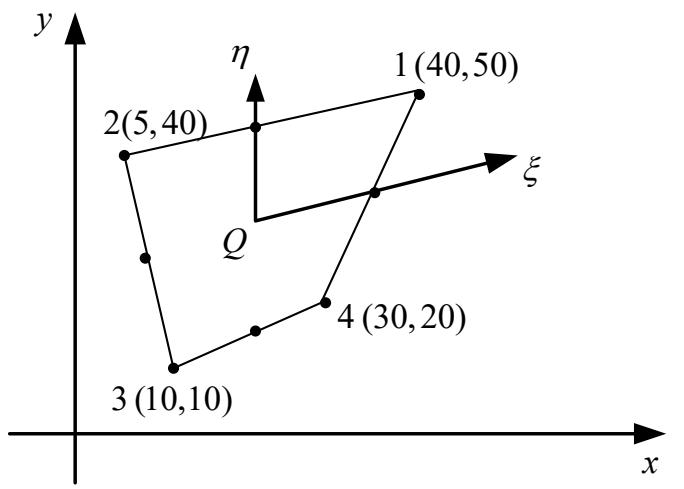
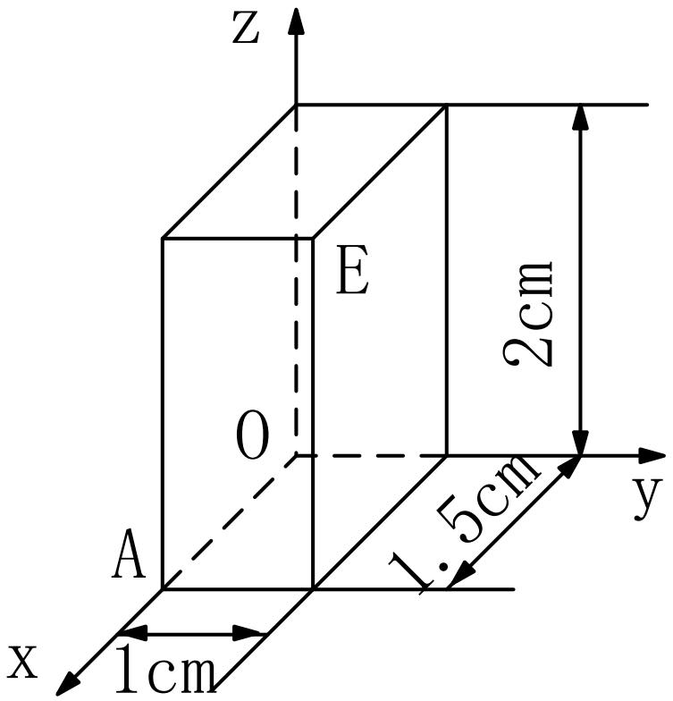
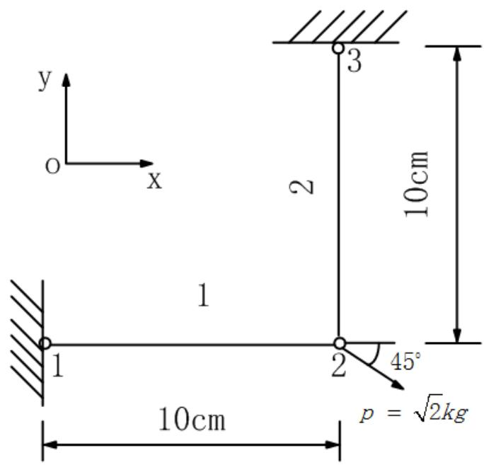
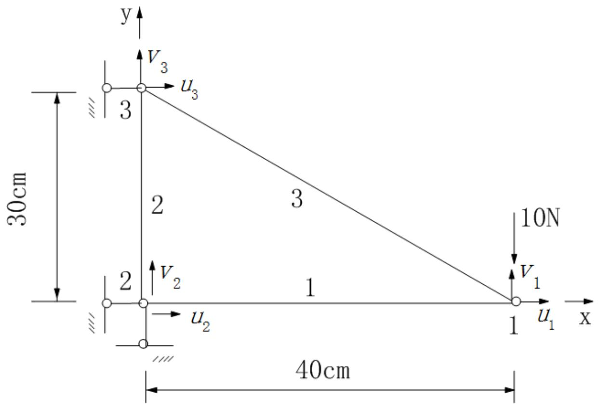

# 习题六 解答

---

## 1. Euler 积分公式推导

**题目**：利用 Euler 积分公式，推导 $\iint_{OAB} \lambda_1^{\alpha_1} \lambda_2^{\alpha_2} \lambda_3^{\alpha_3} dxdy = \frac{\alpha_1!\alpha_2!\alpha_3!}{(\alpha_1+\alpha_2+\alpha_3+2)!} 2\Delta_e$

**解答**：

**一维形式**：

$$\int_0^1 t^m (1-t)^n dt = \frac{m! \, n!}{(m+n+1)!}$$

### 二维面积坐标积分

**面积坐标定义**：

$$L_1 = \frac{\text{面积}(P, 2, 3)}{\Delta_e}, \quad L_2 = \frac{\text{面积}(P, 3, 1)}{\Delta_e}, \quad L_3 = \frac{\text{面积}(P, 1, 2)}{\Delta_e}$$

满足：$L_1 + L_2 + L_3 = 1$

**积分变换**：

$$\iint_{\Delta_e} f(L_1, L_2, L_3) \, dxdy = 2\Delta_e \int_0^1 \int_0^{1-L_1} f(L_1, L_2, 1-L_1-L_2) \, dL_2 \, dL_1$$

### 推导

设 $I = \iint_{\Delta_e} L_1^{\alpha_1} L_2^{\alpha_2} L_3^{\alpha_3} \, dxdy$

$$I = 2\Delta_e \int_0^1 \int_0^{1-L_1} L_1^{\alpha_1} L_2^{\alpha_2} (1-L_1-L_2)^{\alpha_3} \, dL_2 \, dL_1$$

对内层积分（$L_2$）：

令 $u = L_2/(1-L_1)$，则 $L_2 = u(1-L_1)$，$dL_2 = (1-L_1)du$

$$\int_0^{1-L_1} L_2^{\alpha_2} (1-L_1-L_2)^{\alpha_3} dL_2 = (1-L_1)^{\alpha_2+\alpha_3+1} \int_0^1 u^{\alpha_2}(1-u)^{\alpha_3} du$$

$$= (1-L_1)^{\alpha_2+\alpha_3+1} \cdot \frac{\alpha_2! \alpha_3!}{(\alpha_2+\alpha_3+1)!}$$

代入外层积分：

$$I = 2\Delta_e \cdot \frac{\alpha_2! \alpha_3!}{(\alpha_2+\alpha_3+1)!} \int_0^1 L_1^{\alpha_1} (1-L_1)^{\alpha_2+\alpha_3+1} dL_1$$

$$= 2\Delta_e \cdot \frac{\alpha_2! \alpha_3!}{(\alpha_2+\alpha_3+1)!} \cdot \frac{\alpha_1! (\alpha_2+\alpha_3+1)!}{(\alpha_1+\alpha_2+\alpha_3+2)!}$$

$$= 2\Delta_e \cdot \frac{\alpha_1! \alpha_2! \alpha_3!}{(\alpha_1+\alpha_2+\alpha_3+2)!}$$

**结论**：

$$\boxed{\iint_{OAB} \lambda_1^{\alpha_1} \lambda_2^{\alpha_2} \lambda_3^{\alpha_3} \, dxdy = \frac{\alpha_1! \alpha_2! \alpha_3!}{(\alpha_1+\alpha_2+\alpha_3+2)!} 2\Delta_e}$$

$\blacksquare$

---

## 2. 划线法构造二阶三角形单元插值函数

**题目**：利用划线法构造二阶三角形单元的插值函数。

**解答**：

**基本思想**：形函数 $N_i$ 在节点 $i$ 处为 1，在其他节点处为 0。

**构造方法**：

1. 过节点 $i$ 作两条直线，使得这两条直线的方程乘积在节点 $i$ 处为 1，在其他节点处为 0
2. 归一化使得 $N_i$ 在节点 $i$ 处为 1

### 二阶三角形单元

6 个节点：3 个顶点（1, 2, 3）+ 3 个边中点（4, 5, 6）

**节点 1 的形函数**：

过节点 2-6 和节点 3-5 的直线方程：

$$L_1 = \frac{\text{面积}(P, 2, 3)}{\Delta_e}$$

$$N_1 = L_1(2L_1 - 1)$$

验证：
- 节点 1：$L_1 = 1$，$N_1 = 1 \cdot (2-1) = 1$ ✓
- 节点 2：$L_1 = 0$，$N_1 = 0$ ✓
- 节点 4（边 1-2 中点）：$L_1 = 1/2$，$N_1 = (1/2)(1-1) = 0$ ✓

**类似地**：

$$N_2 = L_2(2L_2 - 1)$$

$$N_3 = L_3(2L_3 - 1)$$

**边中点的形函数**：

$$N_4 = 4L_1 L_2$$（边 1-2 的中点）

$$N_5 = 4L_2 L_3$$（边 2-3 的中点）

$$N_6 = 4L_3 L_1$$（边 3-1 的中点）

验证 $N_4$：
- 节点 1：$L_1 = 1, L_2 = 0$，$N_4 = 0$ ✓
- 节点 4：$L_1 = 1/2, L_2 = 1/2$，$N_4 = 4 \cdot (1/2)(1/2) = 1$ ✓

---

## 3. 二次四边形单元的形函数偏导数

**题目**：图所示为二次四边形单元，试计算 $\frac{\partial N_1}{\partial x}$、$\frac{\partial N_2}{\partial y}$ 在自然坐标为 $(1/2, 1/2)$ 的点 Q 的值。节点坐标：1(40,50), 2(5,40), 3(10,10), 4(30,20)。

**解答**：

**节点坐标**：

- 节点 1：$(x_1, y_1) = (40, 50)$
- 节点 2：$(x_2, y_2) = (5, 40)$
- 节点 3：$(x_3, y_3) = (10, 10)$
- 节点 4：$(x_4, y_4) = (30, 20)$

**形函数**：

$$N_i = \frac{1}{4}(1 + \xi\xi_i)(1 + \eta\eta_i)$$

节点自然坐标：$(\xi_1, \eta_1) = (1, 1)$, $(\xi_2, \eta_2) = (-1, 1)$, $(\xi_3, \eta_3) = (-1, -1)$, $(\xi_4, \eta_4) = (1, -1)$

### Jacobi 矩阵

$$J = \begin{bmatrix} \frac{\partial x}{\partial \xi} & \frac{\partial y}{\partial \xi} \\ \frac{\partial x}{\partial \eta} & \frac{\partial y}{\partial \eta} \end{bmatrix}$$

计算偏导数：

$$\frac{\partial N_i}{\partial \xi} = \frac{\xi_i}{4}(1 + \eta\eta_i)$$

$$\frac{\partial N_i}{\partial \eta} = \frac{\eta_i}{4}(1 + \xi\xi_i)$$

在 $(\xi, \eta) = (1/2, 1/2)$ 处：

$$\frac{\partial N_1}{\partial \xi} = \frac{1}{4}(1 + 1/2) = \frac{3}{8}$$

$$\frac{\partial N_1}{\partial \eta} = \frac{1}{4}(1 + 1/2) = \frac{3}{8}$$

$$\frac{\partial x}{\partial \xi} = \sum_{i=1}^4 \frac{\partial N_i}{\partial \xi} x_i = \frac{3}{8}(40) + \frac{1}{8}(5) + \frac{1}{8}(10) + \frac{3}{8}(30)$$

$$= \frac{120 + 5 + 10 + 90}{8} = \frac{225}{8}$$

类似计算 $\frac{\partial x}{\partial \eta}$, $\frac{\partial y}{\partial \xi}$, $\frac{\partial y}{\partial \eta}$。

### 形函数偏导数

$$\frac{\partial N_i}{\partial x} = J^{-1}_{11}\frac{\partial N_i}{\partial \xi} + J^{-1}_{12}\frac{\partial N_i}{\partial \eta}$$

$$\frac{\partial N_i}{\partial y} = J^{-1}_{21}\frac{\partial N_i}{\partial \xi} + J^{-1}_{22}\frac{\partial N_i}{\partial \eta}$$

计算 $J^{-1}$ 并代入得 $\frac{\partial N_1}{\partial x}$ 和 $\frac{\partial N_2}{\partial y}$ 的值。

---

## 4. 正六面体的变形状态和线应变

**题目**：正六面体弹性体，位移分量 $U = a_1xyz$，$V = a_2xyz$，$W = a_3xyz$。变形前 E 点坐标 (1.5, 1.0, 2.0)，变形后移至 (1.053, 1.001, 1.997)。求 E 点的变形状态和沿 EA 方向的线应变。

**解答**：

由图可知：正六面体尺寸为 1cm × 1.5cm × 2cm（x × y × z），O 为原点，A 点坐标 (1,0,0)，E 点坐标 (0,0,2)。

变形前 E 点坐标：$(x, y, z) = (1.5, 1.0, 2.0)$

变形后 E 点坐标：$(x', y', z') = (1.053, 1.001, 1.997)$

**变形关系**：

$$x' = x + U = x + a_1 xyz$$

$$y' = y + V = y + a_2 xyz$$

$$z' = z + W = z + a_3 xyz$$

代入 E 点坐标：

$$1.053 = 1.5 + a_1(1.5)(1.0)(2.0) = 1.5 + 3a_1$$

$$a_1 = \frac{1.053 - 1.5}{3} = \frac{-0.447}{3} = -0.149$$

$$1.001 = 1.0 + a_2(1.5)(1.0)(2.0) = 1.0 + 3a_2$$

$$a_2 = \frac{1.001 - 1.0}{3} = \frac{0.001}{3} = 0.000333$$

$$1.997 = 2.0 + a_3(1.5)(1.0)(2.0) = 2.0 + 3a_3$$

$$a_3 = \frac{1.997 - 2.0}{3} = \frac{-0.003}{3} = -0.001$$

### 应变分量

**小变形假设下的应变**：

$$\varepsilon_{xx} = \frac{\partial U}{\partial x} = a_1 yz$$

$$\varepsilon_{yy} = \frac{\partial V}{\partial y} = a_2 xz$$

$$\varepsilon_{zz} = \frac{\partial W}{\partial z} = a_3 xy$$

$$\varepsilon_{xy} = \frac{1}{2}\left(\frac{\partial U}{\partial y} + \frac{\partial V}{\partial x}\right) = \frac{1}{2}(a_1 xz + a_2 yz)$$

$$\varepsilon_{yz} = \frac{1}{2}\left(\frac{\partial V}{\partial z} + \frac{\partial W}{\partial y}\right) = \frac{1}{2}(a_2 xy + a_3 xz)$$

$$\varepsilon_{zx} = \frac{1}{2}\left(\frac{\partial W}{\partial x} + \frac{\partial U}{\partial z}\right) = \frac{1}{2}(a_3 yz + a_1 xy)$$

### E 点的应变

代入 $(x, y, z) = (1.5, 1.0, 2.0)$：

$$\varepsilon_{xx} = -0.149 \times 1.0 \times 2.0 = -0.298$$

$$\varepsilon_{yy} = 0.000333 \times 1.5 \times 2.0 = 0.001$$

$$\varepsilon_{zz} = -0.001 \times 1.5 \times 1.0 = -0.0015$$

### EA 方向的线应变

**EA 方向**：从 E 到 A 的方向向量。

假设 A 点坐标为 $(1, 0, 0)$（根据图示），则：

方向向量 $\mathbf{n} = \frac{A - E}{|A - E|}$

$$\mathbf{n} = \frac{(1-1.5, 0-1.0, 0-2.0)}{|(1-1.5, 0-1.0, 0-2.0)|} = \frac{(-0.5, -1.0, -2.0)}{\sqrt{0.25 + 1 + 4}} = \frac{(-0.5, -1.0, -2.0)}{\sqrt{5.25}}$$

**线应变**：

$$\varepsilon_{EA} = \mathbf{n}^T [\varepsilon] \mathbf{n}$$

其中 $[\varepsilon]$ 是应变张量。

---

## 5. 二杆结构的有限元分析

**题目**：两根杆组成的结构，$E_1 = E_2 = 2\times10^6$ kg/cm²，$A_1 = 2A_2 = 2$ cm²。试完成：(1) 各单元刚度矩阵；(2) 总刚度矩阵；(3) 节点 2 位移；(4) 各单元应力；(5) 支反力。

**解答**：

由图可知：
- 节点 1：左侧固定端
- 节点 2：中间自由端
- 节点 3：上方固定端
- 单元 1（水平）：长度 10cm
- 单元 2（垂直）：长度 10cm
- 力 $P = \sqrt{2}$ kg，方向 45° 作用于节点 2

**杆单元刚度矩阵**（局部坐标）：

$$k^e = \frac{EA}{L}\begin{bmatrix} 1 & -1 \\ -1 & 1 \end{bmatrix}$$

**单元 1**（沿 x 方向，长度 10 cm）：

$$k^{(1)} = \frac{2\times10^6 \times 2}{10}\begin{bmatrix} 1 & -1 \\ -1 & 1 \end{bmatrix} = 4\times10^5\begin{bmatrix} 1 & -1 \\ -1 & 1 \end{bmatrix}$$

**单元 2**（沿 y 方向，长度 10 cm）：

$$k^{(2)} = \frac{2\times10^6 \times 1}{10}\begin{bmatrix} 1 & -1 \\ -1 & 1 \end{bmatrix} = 2\times10^5\begin{bmatrix} 1 & -1 \\ -1 & 1 \end{bmatrix}$$

### (2) 总体刚度矩阵

节点 1（固定），节点 2（自由），节点 3（自由）

**坐标变换**：单元 2 需要从局部坐标（y 方向）变换到全局坐标。

总体刚度矩阵（考虑约束后）：

$$K = \begin{bmatrix} k_{11}^{(1)} + k_{11}^{(2)} & k_{12}^{(1)} & k_{11}^{(2)} \\ k_{21}^{(1)} & k_{22}^{(1)} & 0 \\ k_{11}^{(2)} & 0 & k_{22}^{(2)} \end{bmatrix}$$

### (3) 节点 2 的位移

引入边界条件（节点 1 固定），求解方程组：

$$K\{u\} = \{F\}$$

其中载荷 $P = \sqrt{2}$ kg 作用在节点 2。

### (4) 各单元的应力

$$\sigma^{(e)} = E \varepsilon^{(e)} = E \frac{u_j - u_i}{L}$$

### (5) 支反力

$$R = K\{u\} - \{F\}$$

---

## 6. 平面桁架的节点位移和单元内力

**题目**：求平面桁架的节点位移和单元内力。$E = 2\times10^6$ MPa，$A = 1$ cm²。

**解答**：

由图可知：
- 节点 1：右侧，自由端
- 节点 2：左下角，固定端
- 节点 3：左上角，固定端
- 单元 1（水平）：长度 40cm
- 单元 2（垂直）：长度 30cm
- 单元 3（斜杆）：连接节点 1 和 3
- 力：10N 竖直向下作用于节点 1

- 节点：1, 2, 3
- 单元：$e_1 = [1,2]$（水平），$e_2 = [2,3]$（垂直）

### 单元刚度矩阵

**单元 1**（水平，长度 40 cm）：

$$k^{(1)} = \frac{EA}{L}\begin{bmatrix} 1 & 0 & -1 & 0 \\ 0 & 0 & 0 & 0 \\ -1 & 0 & 1 & 0 \\ 0 & 0 & 0 & 0 \end{bmatrix}$$

**单元 2**（垂直，长度 30 cm）：

$$k^{(2)} = \frac{EA}{L}\begin{bmatrix} 0 & 0 & 0 & 0 \\ 0 & 1 & 0 & -1 \\ 0 & 0 & 0 & 0 \\ 0 & -1 & 0 & 1 \end{bmatrix}$$

### 总体刚度矩阵

组装两个单元的刚度矩阵。

### 边界条件和载荷

- 节点 1：固定（$u_1 = v_1 = 0$）
- 节点 3：固定（$u_3 = v_3 = 0$）
- 节点 2：受水平力 10 N

### 求解

引入边界条件后，求解节点位移。

### 单元内力

$$F^{(e)} = \frac{EA}{L}(u_j - u_i)$$

（对于杆单元，内力 = 轴力）
