## Chapter 1

## Solid mechanics: theory of elasticity

## Contents

1 Introduction  
2 Introduction to tensor  
3 Theory of elasticity: differential context  
4 Introduction to variational theory  
5 Theory of elasticity: variational context

## 1. Introduction

## Theory of elasticity

Elasticity – On removal of the external forces, the objects made of elastic materials will return to their original state.

Elastic body – An physical object with elasticity being the only material property.

Solid mechanics of elastic bodies – A subject that studies the distribution of stresses and deformations within the elastic body, under certain external conditions (e.g. temperature, force).

The applications of elastic material can be found throughout thousands of years of human civilization. However, the comprehensive study on the theory of elasticity was not conducted until the industrial revolution. The theory has been widely applied in the fields of civil, aeronautical and mechanical engineering.

## Theory of elasticity

Theory of elasticity is an important branch of solid mechanics; whereas the mechanics of materials perhaps has the longest history as a branch of solid mechanics.  
The mechanics of materials focuses on strength, stiffness and stability issues of structural members. For the problems mentioned above, it is important to investigate the internal stresses, strains and deformations of structural members under external loads.  
However, the mechanics of materials only focuses on column and beam members of structures, whereas plate, shell and solid structures are generally difficult to be dealt with.  
Even for column and beam members, there are still problems left to be solved.

## Theory of elasticity

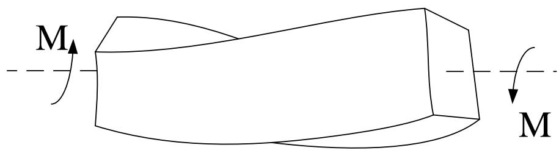

text_image

M
M

Structural member with rectangular cross-section in torsion  

text_image

P
P

Plate with hole in tension

The problems described above cannot be solved with the knowledge of mechanics of materials. However, the precise solutions can be obtained in the theory of elasticity. Similar problems are found in many different areas of engineering.

## Brief state of the art (I)

The theory of elasticity has a history of more than three hundred years.

In 1678, Hooke found that the displacement of an elastic body is directly proportional to the externally applied force.  
In 1821 and 1823, Navier and Cauchy derived the governing equilibrium equations for the linear elastic boundary value problems respectively, which provided a first insight into the mechanics of elastic bodies.  
Other important works in the history of elasticity theory include the classic works by Saint-Venant (1855) on torsion and bending, and the complex variable formulation by Muskhelishvili (1933).

The first problem described in the previous slide can be approached by conformal transformation where the rectangular cross-section is transformed into circular cross-section.

In the late 20th century, the theory of elasticity was further developed to consider the interaction with other physical factors such as:

Heat  
Viscosity  
...

## Brief state of the art (II)

As mentioned above, the theory of elasticity investigates the general behaviour of how elastic bodies deform under external load. In principle, there is no limitation on the geometry of the elastic body and the form of the external load.  
In contrast to the mechanics of materials, the theory of elasticity allows more realistic assumptions to be made. For example, the assumption of ‘plain sections remain plane’ in beam bending theory would not be appropriate under certain conditions.  
☐ The development of the theory requires more precise and logical analysis, where more powerful and complex mathematical tools are needed, hence provides more general, more precise and wider range of applications.  
☐ The development of any engineering subject tends to reduce the number of assumptions with the aid of more mathematical analysis.

## Brief state of the art (III)

Through the study of theory of elasticity or applied mathematics, we know that solving partial differential equations for boundary value problems can be problematic. For complex geometries and boundary conditions, it is generally very difficult to obtain exact solutions.  
Such problems are very common in real engineering applications. On the other hand, the precision of solutions is still crucial.  
Therefore, researchers tend to look for approximate solutions.  
Even for problems with exact solutions, the analytical approach can be cumbersome and hence involved with huge computational costs. The results are sometimes difficult to interpret (e.g. infinite series). Under such circumstances, engineers would prefer approximate solutions to the exact solutions.

## Objectives of the lecture

Review the theory of elasticity  
Introduce and apply expressions in tensor forms

To simplify written expressions  
To gain insight into the theory of mechanics  
To help with literature reading  
→ ...

Introduce the concept of variations in mathematics and apply variations in the theory of elasticity, hence provide a basic knowledge for finite element analysis (FEA).

## 2. Introduction to tensor

## Introduction

Assume that a physical law describes the physical relationships between components a, b, c, ... of a certain physical quantity under a certain coordinate system K, the same law should also apply to a new set of components a', b', c', ... under the new coordinate system K' for the same physical quantity. Note that both sets of components describe the same physical state of the physical quantity. In another word, the physics is independent on the setting up of the coordinate system.  
The form of tensor provides a clear and simple expression that shows different components under different coordinate system for the same physical state.

## Introduction

As we know scalar is a special form of vector, scalar and vector are both special forms of tensor. For detailed explanation with regard to coordinate transformation, we will:

■ Firstly introduce notations for index and summation  
■ Secondly introduce two common notations $\delta_{ij}$ and $e_{ijk}$  
■ Then review the coordinate transformation in linear algebra  
■ Finally comprehensively introduce vector and tensor with coordinate transformation

## 2.1 Index and summation

Many physical quantities can only be expressed by a set of scalar variables instead of a single scalar. Each scalar in the set is called as the component which is normally written with indications of the coordinate system. For example:

➢ Position of a point: expressed by the coordinate system x, y, and z  
Displacement: expressed by displacement components u, v, and w with respect to x, y, and z  
Velocity: expressed by velocity components $v_{x}$ , $v_{y}$ , $v_{z}$ respectively  
➢ Stress: expressed by nine stress components $\sigma_{x}$ , $\sigma_{y}$ , $\sigma_{z}$ , $\tau_{xy}$ , $\tau_{yx}$ , $\tau_{yz}$ , $\tau_{zy}$ , $\tau_{xz}$ , $\tau_{zx}$  
• • • • • •

## 2.1 Index and summation

For simplifying expressions with summation convention, the same letter is used in the tensor form. A same letter is used for a given physical variable whose components are represented by indices. For example:

Displacement: $u_{1}$ , $u_{2}$ and $u_{3}$ are expressed as $u_{i}$ .  
➢ Stress: $\sigma_{11}$ , $\sigma_{22}$ , $\sigma_{33}$ , $\sigma_{12}$ , $\sigma_{21}$ , $\sigma_{23}$ , $\sigma_{32}$ , $\sigma_{13}$ and $\sigma_{31}$ are expressed as $\sigma_{ij}$ .

In the current chapter, unless specified otherwise, the indices (e.g. i and j) are generally taken as 1, 2 or 3.

## 2.1 Index and summation

The same index letter that appears more than once in a single term is referred to as the summation index (also referred to as the dummy index), meaning that the single term is essentially the sum of the terms with the indices being 1, 2 and 3 in turn. This is known as the summation convention. The index letter that appears only once in a single term is referred to as the free index, meaning that it is a general term with its index being 1, 2 or 3.

$$
\left. \begin{array}{c} a _ {i} b _ {i} = a _ {1} b _ {1} + a _ {2} b _ {2} + a _ {3} b _ {3} = \sum_ {i = 1} ^ {3} a _ {i} b _ {i} \\ a _ {i j} b _ {j} = a _ {i 1} b _ {1} + a _ {i 2} b _ {2} + a _ {i 3} b _ {3} = \sum_ {j = 1} ^ {3} a _ {i j} b _ {j} \\ a _ {i i} = a _ {1 1} + a _ {2 2} + a _ {3 3} = \sum_ {i = 1} ^ {3} a _ {i i} \end{array} \right\}
$$

The index i in the second equation above is a free index, therefore the term is essentially given by three equations with i being 1, 2 or 3.

## 2.1 Index and summation

For example, a set of linear simultaneous equations is given below:

$$
\left. \begin{array}{l} a _ {1 1} b _ {1} + a _ {1 2} b _ {2} + a _ {1 3} b _ {3} = c _ {1} \\ a _ {2 1} b _ {1} + a _ {2 2} b _ {2} + a _ {2 3} b _ {3} = c _ {2} \\ a _ {3 1} b _ {1} + a _ {3 2} b _ {2} + a _ {3 3} b _ {3} = c _ {3} \end{array} \right\}
$$

With subscript indices, it is simplified to (i is the free index):

$$
a _ {i j} b _ {j} = c _ {i} (i = 1, 2, 3)
$$

The summation index can be substituted by any letter, since it does not represent different components, instead it is a sign of summation:

$$
a _ {i i} = a _ {1 1} + a _ {2 2} + a _ {3 3} = a _ {k k}
$$

## 2.2 Common symbols

With the previously set convention, $\delta_{ij}$ has nine components, often referred to as the Kronecker delta.

$$
\delta_ {i j} = \left\{ \begin{array}{l l} 1, \text {if} i = j \\ 0, \text {if} i \neq j \end{array} \right.
$$

Sometimes it is also known as the substitution tensor. Assume the following equation:

$$
\delta_ {i j} A _ {i} = \delta_ {1 j} A _ {1} + \delta_ {2 j} A _ {2} + \delta_ {3 j} A _ {3}
$$

Recall the definition for $\delta_{ij}$ :

If $j = 1$ $\delta_{il}\mathrm{A}_i = \mathrm{A}_1$  
■ If j=2, $\delta_{i2}A_{i}=A_{2}$  
If j=3, $\delta_{i3}A_{i}=A_{3}$

And therefore

The subscript i in $A_{i}$ is substituted by j

$$
\delta_ {i j} \mathbf {A} _ {i} = \mathbf {A} _ {j}
$$

## 2.2 Common symbols

With the previously set convention, $e_{ijk}$ has 27 components, often known as the Levi-Civita symbols.

$$
e _ {i j k} = \left\{ \begin{array}{l l} 1, & \text {if} (i, j, k) = (1, 2, 3), (2, 3, 1), (3, 1, 2) \\ - 1 & \text {if} (i, j, k) = (3, 2, 1), (2, 1, 3), (1, 3, 2) \\ 0, & \text {If any two indices are identical} \end{array} \right.
$$

Sometimes it is also referred to as the permutation symbol, thus $e_{ijk}$ is +1 if i, j and k follows the clockwise permutation, -1 if i, j and k follows the anti-clockwise permutation and 0 if any index is repeated.

The relationship between $\delta_{ij}$ and $e_{ijk}$ is given by:

$$
\pmb {e} _ {\mathrm{ijk}} \pmb {e} _ {\mathrm{ist}} = \delta_ {\mathrm{js}} \delta_ {\mathrm{kt}} - \delta_ {\mathrm{jt}} \delta_ {\mathrm{ks}}
$$

flowchart

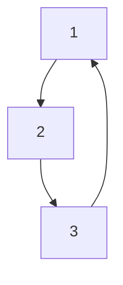

## 2.2 Common symbols

## Example

Consider the following simultaneous equations

$$
\left. \begin{array}{r} a _ {1 1} = b + c _ {1 1} \\ a _ {2 2} = b + c _ {2 2} \\ a _ {3 3} = b + c _ {3 3} \\ a _ {1 2} = c _ {1 2}, a _ {2 1} = c _ {2 1} \\ a _ {2 3} = c _ {2 3}, a _ {3 2} = c _ {3 2} \\ a _ {3 1} = c _ {3 1}, a _ {1 3} = c _ {1 3} \end{array} \right\}
$$

With the aid of Kronecker delta $\delta_{ij}$ , the equations above can be simplified to

$$
a _ {i j} = b \delta_ {i j} + c _ {i j}
$$

## 2.2 Common symbols

## Example:

The determinant
of a 3 by 3 square
matrix:

$$
a = \left| \begin{array}{c c c} a _ {1 1} & a _ {1 2} & a _ {1 3} \\ a _ {2 1} & a _ {2 2} & a _ {2 3} \\ a _ {3 1} & a _ {3 2} & a _ {3 3} \end{array} \right|
$$

Expanding the equation:

$$
a = a _ {1 1} \left| \begin{array}{c c} a _ {2 2} & a _ {2 3} \\ a _ {3 2} & a _ {3 3} \end{array} \right| - a _ {1 2} \left| \begin{array}{c c} a _ {2 1} & a _ {2 3} \\ a _ {3 1} & a _ {3 3} \end{array} \right| + a _ {1 3} \left| \begin{array}{c c} a _ {2 1} & a _ {2 2} \\ a _ {3 1} & a _ {3 2} \end{array} \right|
$$

$$
= a _ {1 1} a _ {2 2} a _ {3 3} + a _ {2 1} a _ {3 2} a _ {1 3} + a _ {3 1} a _ {1 2} a _ {2 3} - a _ {3 1} a _ {2 2} a _ {1 3} - a _ {2 1} a _ {1 2} a _ {3 3} - a _ {1 1} a _ {3 2} a _ {2 3}
$$

It is obvious that the all row indices are cyclic permutation in all six terms whereas the they are clock-wise permutation in the first three terms and anti clock-wise permutation in the last three terms. Therefore, with the Levi-Civita symbol the equation above can be written as:

$$
a = \left| a _ {i j} \right| = e _ {i j k} a _ {i 1} a _ {j 2} a _ {k 3}
$$

flowchart

## 2.2 Common Symbols

## Example:

## 3 by 3 square matrix:

The previous expression was obtained by expanding the determinant by column, if expanding by row the following expression is obtained:

$$
a = \left| a _ {i j} \right| = e _ {i j k} a _ {1 i} a _ {2 j} a _ {3 k}
$$

flowchart

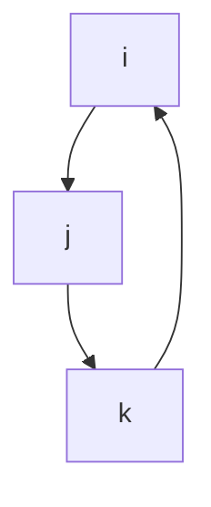

If we swap any adjacent columns once in the original matrix, the sign of the determinant becomes the opposite and the permutation of the new matrix becomes anti clock-wise:

$$
a ^ {\prime} = \left| \begin{array}{c c c} a _ {1 ^ {\prime} 1 ^ {\prime}} & a _ {1 ^ {\prime} 2 ^ {\prime}} & a _ {1 ^ {\prime} 3 ^ {\prime}} \\ a _ {2 ^ {\prime} 1 ^ {\prime}} & a _ {2 ^ {\prime} 2 ^ {\prime}} & a _ {2 ^ {\prime} 3 ^ {\prime}} \\ a _ {3 ^ {\prime} 1 ^ {\prime}} & a _ {3 ^ {\prime} 2 ^ {\prime}} & a _ {3 ^ {\prime} 3 ^ {\prime}} \end{array} \right| = \left| \begin{array}{c c c} a _ {1 1} & a _ {1 3} & a _ {1 2} \\ a _ {2 1} & a _ {2 3} & a _ {2 2} \\ a _ {3 1} & a _ {3 3} & a _ {3 2} \end{array} \right|
$$

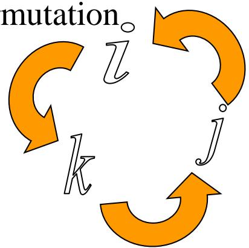

flowchart

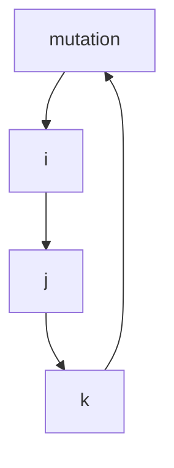

Similarly, the following expression is obtained upon expansion of the new matrix:

$$
a ^ {\prime} = \left| a _ {i j} ^ {\prime} \right| = e _ {i ^ {\prime} j ^ {\prime} k ^ {\prime}} a _ {1 ^ {\prime} i ^ {\prime}} a _ {2 ^ {\prime} j ^ {\prime}} a _ {3 ^ {\prime} k ^ {\prime}} = e _ {i k j} a _ {1 i} a _ {2 j} a _ {3 k}
$$

## 2.2 Common symbols

## Example

## 3 by 3 square matrix:

Therefore, for odd number of swaps of any adjacent columns, the sign of the determinant and the permutation are both changed. On the other hand, for even number of swaps of any adjacent columns, both the determinant and the permutation remain the same as for the original matrix.  
Hence, if the column indices are in some random order r, s and t, we can draw the following conclusion:

A clockwise in r, s and t implies an even number of swaps of any adjacent columns whereas the determinant remains unchanged. Moreover, indices r, s and t are achieved through an even number of swaps from 1, 2 and 3, thus are still clockwise.  
■ An anti-clockwise permutation in r, s and t implies an odd number of swaps of any adjacent columns whereas the sign of the determinant becomes the opposite. Moreover, indices r, s and t are achieved through an odd number of swaps from 1, 2 and 3, thus are anticlockwise.

Therefore the information on column swaps and the sign changes of the determinant in a square matrix can be seen from expressions with the Levi-Civita

$$
\mathrm{symbol} e _ {i j k}
$$

$$
a e _ {r s t} = a _ {i r} a _ {j s} a _ {k t} e _ {i j k}
$$

Similarly, for row swaps:

$$
a e _ {r s t} = a _ {r i} a _ {s j} a _ {t k} e _ {i j k}
$$

## 2.3 Revision of linear algebra

## Vector and coordinates

Assume that $\{O; x_{1}, x_{2}, x_{3}\}$ is the Cartesian-coordinate system in a 3-D space, $e_{1}, e_{2}$ and $e_{3}$ are the basis vectors in the direction of $Ox_{1}$ , $Ox_{2}$ and $Ox_{3}$ respectively. Therefore any random vector $OP = r$ can be expressed as:

$$
\mathbf {r} = x _ {1} \mathbf {e} _ {1} + x _ {2} \mathbf {e} _ {2} + x _ {3} \mathbf {e} _ {3}
$$

$x_{1}$ , $x_{2}$ and $x_{3}$ are referred to as the vector coordinates.  
$\mathbf{e}_1, \mathbf{e}_2$ and $\mathbf{e}_3$ are three mutually perpendicular basis vectors, sometimes referred to as the orthonormal basis in the Cartesian-coordinate system.

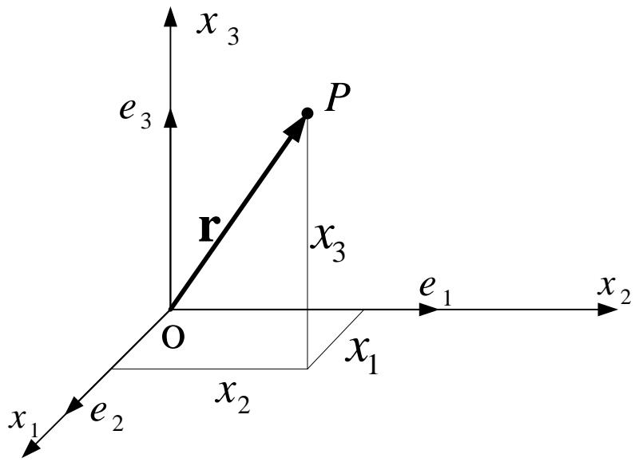

text_image

x₃
e₃
P
r
x₃
O
e₁
x₂
x₁
e₂
x₂

Obviously, the vector r is independent of the choice of the coordinate system. However its components vary their forms according to different coordinate systems, the same vector is generally expressed in different forms of components in different coordinate systems.

## 2.3 Revision of linear algebra

## Basis vector transformation

Assume a Cartesian-coordinate system in a 3-D space $\{O; x_1, x_2, x_3\}$ , with basis vectors being $\{\mathbf{e}_1, \mathbf{e}_2, \mathbf{e}_3\}$ .  
Assume that there is another coordinate system $\{O; x_{1}^{\prime}, x_{2}^{\prime}, x_{3}^{\prime}\}$ , with basis vectors being $\{e_{1}^{\prime}, e_{2}^{\prime}, e_{3}^{\prime}\}$ .

> Denote $l_{i}, j$ as the cos function of the angle between $x_{i}'$ and $x_{j}$ axis: $\cos(x_{i}', x_{j})$

$$
\left\{ \begin{array}{l} \mathbf {e} _ {1} ^ {\prime} = l _ {1 ^ {\prime} 1} \mathbf {e} _ {1} + l _ {1 ^ {\prime} 2} \mathbf {e} _ {2} + l _ {1 ^ {\prime} 3} \mathbf {e} _ {3} \\ \mathbf {e} _ {2} ^ {\prime} = l _ {2 ^ {\prime} 1} \mathbf {e} _ {1} + l _ {2 ^ {\prime} 2} \mathbf {e} _ {2} + l _ {2 ^ {\prime} 3} \mathbf {e} _ {3} \\ \mathbf {e} _ {3} ^ {\prime} = l _ {3 ^ {\prime} 1} \mathbf {e} _ {1} + l _ {3 ^ {\prime} 2} \mathbf {e} _ {2} + l _ {3 ^ {\prime} 3} \mathbf {e} _ {3} \end{array} \right.
$$

text_image

x₃'
e₃'
e₃
e₂'
e₂
x₂'
x₂
o
e₁
e₁'
x₁
x₁'

<table><tr><td rowspan="2">axis</td><td colspan="3">axis</td></tr><tr><td> $x_1$ </td><td> $x_2$ </td><td> $x_3$ </td></tr><tr><td> $x'_1$ </td><td> $l_{1'1}$ </td><td> $l_{1'2}$ </td><td> $l_{1'3}$ </td></tr><tr><td> $x'_2$ </td><td> $l_{2'1}$ </td><td> $l_{2'2}$ </td><td> $l_{2'3}$ </td></tr><tr><td> $x'_3$ </td><td> $l_{3'1}$ </td><td> $l_{3'2}$ </td><td> $l_{3'3}$ </td></tr></table>

## 2.3 Revision of linear algebra

## Basis vector transformation

The equations given in the previous slide show the transformation between basis vectors $\mathbf{e}_{i}^{\prime}(i=1,2,3)$ and $\mathbf{e}_{i}(i=1,2,3)$ . Expressing in matrix form, thus:

$$
\left( \begin{array}{l} \mathbf {e} _ {1} ^ {\prime} \\ \mathbf {e} _ {2} ^ {\prime} \\ \mathbf {e} _ {3} ^ {\prime} \end{array} \right) = \left[ \begin{array}{l l l} l _ {1 ^ {\prime} 1} & l _ {1 ^ {\prime} 2} & l _ {1 ^ {\prime} 3} \\ l _ {2 ^ {\prime} 1} & l _ {2 ^ {\prime} 2} & l _ {2 ^ {\prime} 3} \\ l _ {3 ^ {\prime} 1} & l _ {3 ^ {\prime} 2} & l _ {3 ^ {\prime} 3} \end{array} \right] \left( \begin{array}{l} \mathbf {e} _ {1} \\ \mathbf {e} _ {2} \\ \mathbf {e} _ {3} \end{array} \right)
$$

With summation indices, the expression can be simplified to:

$$
\mathbf {e} _ {i} ^ {\prime} = l _ {i ^ {\prime} j} \mathbf {e} _ {j} (i, i ^ {\prime}, j = 1, 2, 3)
$$

and in matrix form:

$$
\mathbf {e} ^ {\prime} = \mathbf {L e}
$$

## 2.3 Revision of linear algebra

## Basis vector transformation

L is an orthogonal matrix:

$$
L = \left[ \begin{array}{l l l} l _ {1 ^ {\prime} 1} & l _ {1 ^ {\prime} 2} & l _ {1 ^ {\prime} 3} \\ l _ {2 ^ {\prime} 1} & l _ {2 ^ {\prime} 2} & l _ {2 ^ {\prime} 3} \\ l _ {3 ^ {\prime} 1} & l _ {3 ^ {\prime} 2} & l _ {3 ^ {\prime} 3} \end{array} \right]
$$

Since L is an orthogonal matrix, $L^{-1}=L^{T}$ . Hence it is not difficult to obtain the inverse transformation of the basis vectors:

$$
\left\{ \begin{array}{l l} \mathbf {e} _ {1} = l _ {1 1 ^ {\prime}} \mathbf {e} _ {1} ^ {\prime} + l _ {1 2 ^ {\prime}} \mathbf {e} _ {2} ^ {\prime} + l _ {1 3 ^ {\prime}} \mathbf {e} _ {3} ^ {\prime} \\ \mathbf {e} _ {2} = l _ {2 1 ^ {\prime}} \mathbf {e} _ {1} ^ {\prime} + l _ {2 2 ^ {\prime}} \mathbf {e} _ {2} ^ {\prime} + l _ {2 3 ^ {\prime}} \mathbf {e} _ {3} ^ {\prime} \\ \mathbf {e} _ {3} = l _ {3 1 ^ {\prime}} \mathbf {e} _ {1} ^ {\prime} + l _ {3 2 ^ {\prime}} \mathbf {e} _ {2} ^ {\prime} + l _ {3 3 ^ {\prime}} \mathbf {e} _ {3} ^ {\prime} \end{array} \right. \quad \text {thus} \quad \mathbf {e} = \mathbf {L} ^ {T} \mathbf {e} ^ {\prime}
$$

## 2.3 Revision of linear algebra

## Transformation of coordinates

Consider a vector $a$ originating from O to A, the coordinates are $\{a_1, a_2, a_3\}$ and $\{a_1', a_2', a_3'\}$ in the old and new coordinate systems respectively,  
and a can be expressed as:

$$
a = a _ {i} \mathbf {e} _ {i} = a _ {1} \mathbf {e} _ {1} + a _ {2} \mathbf {e} _ {2} + a _ {3} \mathbf {e} _ {3} = (\mathbf {e} _ {1}, \mathbf {e} _ {2}, \mathbf {e} _ {3}) \cdot (a _ {1}, a _ {2}, a _ {3}) ^ {T}
$$

$$
a = a _ {i ^ {\prime}} \mathbf {e} _ {i} ^ {\prime} = a _ {1 ^ {\prime}} \mathbf {e} _ {1} ^ {\prime} + a _ {2 ^ {\prime}} \mathbf {e} _ {2} ^ {\prime} + a _ {3 ^ {\prime}} \mathbf {e} _ {3} ^ {\prime} = (\mathbf {e} _ {1} ^ {\prime}, \mathbf {e} _ {2} ^ {\prime}, \mathbf {e} _ {3} ^ {\prime}) \cdot (a _ {1 ^ {\prime}}, a _ {2 ^ {\prime}}, a _ {3 ^ {\prime}}) ^ {T}
$$

With the previously derived equations for basis vector transformation, the following expression is obtained:

$$
(\mathbf {e} _ {1} ^ {\prime}, \mathbf {e} _ {2} ^ {\prime}, \mathbf {e} _ {3} ^ {\prime}) \left( \begin{array}{l} a _ {1 ^ {\prime}} \\ a _ {2 ^ {\prime}} \\ a _ {3 ^ {\prime}} \end{array} \right) = (\mathbf {e} _ {1}, \mathbf {e} _ {2}, \mathbf {e} _ {3}) \left[ \begin{array}{l l l} l _ {1 1 ^ {\prime}} & l _ {1 2 ^ {\prime}} & l _ {1 3 ^ {\prime}} \\ l _ {2 1 ^ {\prime}} & l _ {2 2 ^ {\prime}} & l _ {2 3 ^ {\prime}} \\ l _ {3 1 ^ {\prime}} & l _ {3 2 ^ {\prime}} & l _ {3 3 ^ {\prime}} \end{array} \right] \left( \begin{array}{l} a _ {1 ^ {\prime}} \\ a _ {2 ^ {\prime}} \\ a _ {3 ^ {\prime}} \end{array} \right) = (\mathbf {e} _ {1}, \mathbf {e} _ {2}, \mathbf {e} _ {3}) \left( \begin{array}{l} a _ {1} \\ a _ {2} \\ a _ {3} \end{array} \right)
$$

## 2.3 Revision of linear algebra

## Transformation of coordinates

thus

$$
\left\{ \begin{array}{l l} a _ {1} = l _ {1 1 ^ {\prime}} a _ {1 ^ {\prime}} + l _ {1 2 ^ {\prime}} a _ {2 ^ {\prime}} + l _ {1 3 ^ {\prime}} a _ {3 ^ {\prime}} \\ a _ {2} = l _ {2 1 ^ {\prime}} a _ {1 ^ {\prime}} + l _ {2 2 ^ {\prime}} a _ {2 ^ {\prime}} + l _ {2 3 ^ {\prime}} a _ {3 ^ {\prime}} & \text {或} \quad \mathbf {a} = \mathbf {L} ^ {T} \mathbf {a} ^ {\prime} \\ a _ {3} = l _ {3 1 ^ {\prime}} a _ {1} + l _ {3 2 ^ {\prime}} a _ {2} + l _ {3 3 ^ {\prime}} a _ {3 ^ {\prime}} \end{array} \right.
$$

Expressed with summation indices, thus

$$
a _ {i} = l _ {i j ^ {\prime}} a _ {j ^ {\prime}} (i = 1, 2, 3)
$$

The equation above transforms the components of vector a from the new to the old coordinate system. Similarly, the equation of transformation from the old to the new coordinate system can also be derived.

$$
a _ {i \mathbb {C}} = l _ {i \mathbb {C} j} a _ {j} (i \mathbb {C} = 1, 2, 3)
$$

## 2.3 Revision of linear algebra

## Matrix transformation

With the knowledge of linear algebra, we know that the linear transformation in any space is entirely based on the transformation of basis vectors. Matrix is the coordinated expression of linear transformation for certain basis. For a random vector $\mathbf{a}$ ,

$$
Y \mathbf {a} = \boxed {Y (\mathbf {e} _ {1} \mathbf {e} _ {2} \mathbf {e} _ {3})} \begin{array}{c c c} a & 0 \\ \zeta & a _ {1} & \div \\ \zeta & a _ {2} & \div \\ \zeta & a _ {3} & \div \\ \ddot {\theta} & & \end{array} = \boxed {(\mathbf {e} _ {1} \mathbf {e} _ {2} \mathbf {e} _ {3}) \mathbf {A}} \begin{array}{c c c} a & 0 \\ \zeta & a _ {1} & \div \\ \zeta & a _ {2} & \div \\ \zeta & a _ {3} & \div \\ \ddot {\theta} & & \end{array} = \mathbf {e} ^ {T} \mathbf {A} \mathbf {a}
$$

where $\Psi$ is the linear transformation operator, A is the matrix expression of the linear transformation for basis $\{e_{1}, e_{2}, e_{3}\}$ .

Similarly, for basis $\{e_{1}^{\prime}, e_{2}^{\prime}, e_{3}^{\prime}\}$ we have:

$$
\Psi \mathbf {a} = \Psi (\mathbf {e} _ {1} ^ {\prime} \quad \mathbf {e} _ {2} ^ {\prime} \quad \mathbf {e} _ {3} ^ {\prime}) \left( \begin{array}{c} a _ {1 ^ {\prime}} \\ a _ {2 ^ {\prime}} \\ a _ {3 ^ {\prime}} \end{array} \right) = (\mathbf {e} _ {1} ^ {\prime} \quad \mathbf {e} _ {2} ^ {\prime} \quad \mathbf {e} _ {3} ^ {\prime}) \mathbf {A} ^ {\prime} \left( \begin{array}{c} a _ {1 ^ {\prime}} \\ a _ {2 ^ {\prime}} \\ a _ {3 ^ {\prime}} \end{array} \right) = \mathbf {e} ^ {\prime T} \mathbf {A} ^ {\prime} \mathbf {a} ^ {\prime}
$$

## 2.3 Revision of linear algebra

## Matrix transformation

Recall the equations of basis transformation and vector transformation derived previously,

$$
\mathbf {e} ^ {T} = \mathbf {e} ^ {\prime T} \mathbf {L} \quad \mathbf {a} = \mathbf {L} ^ {T} \mathbf {a} ^ {\prime}
$$

substitute into the equation of the linear transformation under the old coordinate system, thus:

$$
\Psi \mathbf {a} = \mathbf {e} ^ {T} \mathbf {A a} = \mathbf {e} ^ {\prime T} \mathbf {L A L} ^ {T} \mathbf {a} ^ {\prime}
$$

comparing with the equation of the linear transformation under the new coordinate system:

$$
\mathsf {Y} \mathbf {a} = \mathbf {e} ^ {\mathbb {C} ^ {T}} \mathbf {A} ^ {\mathbb {C}} \mathbf {a} ^ {\mathbb {C}}
$$

since a' is a random vector, thus

$$
\mathbf {A} ^ {\prime} = \mathbf {L A L} ^ {T}
$$

The expression above is the matrix transformations, with summation indices it can be simplified to:

$$
a _ {i ^ {\prime} j ^ {\prime}} = a _ {m n} l _ {i ^ {\prime} m} l _ {j ^ {\prime} n} \quad (i ^ {\prime}, j ^ {\prime} = 1, 2, 3)
$$

大家可以自己推导其逆变换。

## 2.3 Revision of linear algebra

## Scalar product of vectors

Recall the definition of the orthonormal basis:

$$
\delta_ {i j} = \mathbf {e} _ {i} \bullet \mathbf {e} _ {j} \quad \delta_ {i ^ {\prime} j ^ {\prime}} = \mathbf {e} _ {i ^ {\prime}} \bullet \mathbf {e} _ {j ^ {\prime}}
$$

Shifting

index

the scalar product of any two vectors is thus:

$$
\boldsymbol {a} \cdot \boldsymbol {b} = (a _ {i} \mathbf {e} _ {i}) \cdot (b _ {j} \mathbf {e} _ {j}) = a _ {i} b _ {j} \mathbf {e} _ {i} \cdot \mathbf {e} _ {j} = a _ {i} b _ {j} ^ {\prime} \delta_ {i j} = a _ {i} b _ {i}
$$

Moreover:

$$
\delta_ {i j} = e _ {i} e _ {j} = l _ {k ^ {\prime} i} e _ {k ^ {\prime}} l _ {l ^ {\prime} j} e _ {l ^ {\prime}} = l _ {k ^ {\prime} i} l _ {l ^ {\prime} j} \delta_ {k ^ {\prime} l ^ {\prime}} = l _ {k ^ {\prime} i} l _ {k ^ {\prime} j}
$$

## Cross product of vectors

Shifting rows indeterminant of

Recall the discussion about the determinant of matrix: matrix

$$
\mathbf {a} \times \mathbf {b} = \left| \begin{array}{c c c} \mathbf {e} _ {1} & \mathbf {e} _ {2} & \mathbf {e} _ {3} \\ a _ {1} & a _ {2} & a _ {3} \\ b _ {1} & b _ {2} & b _ {3} \end{array} \right| = \left| \begin{array}{c c c} a _ {1} & a _ {2} & a _ {3} \\ b _ {1} & b _ {2} & b _ {3} \\ \mathbf {e} _ {1} & \mathbf {e} _ {2} & \mathbf {e} _ {3} \end{array} \right| ^ {\circ} = a _ {i} b _ {j} e _ {i j k} \mathbf {e} _ {k}
$$

## 2.3 Revision of linear algebra

We will prove the relationship between $\delta_{ij}$ and $e_{ijk}$ given below, hence be more familiar with tensor calculations.

$$
e _ {k s p} e _ {i p j} = \delta_ {i s} \delta_ {j k} - \delta_ {i k} \delta_ {j s}
$$

Rule of double cross product: (refer to math text book)

$$
\boldsymbol {a} \times (\boldsymbol {b} \times \boldsymbol {c}) = (\boldsymbol {a} \cdot \boldsymbol {c}) \boldsymbol {b} - (\boldsymbol {a} \cdot \boldsymbol {b}) \boldsymbol {c}
$$

Express the vectors in terms of components, thus:

$$
\boldsymbol {a} = a _ {i} \mathbf {e} _ {i}, \quad \boldsymbol {b} = b _ {k} \mathbf {e} _ {k}, \quad \boldsymbol {c} = c _ {s} \mathbf {e} _ {s}
$$

Substitute into the equation of double cross product, thus:

$$
\begin{array}{l} \pmb {a} \times (\pmb {b} \times \pmb {c}) = a _ {i} \mathbf {e} _ {i} \times (b _ {k} c _ {s} e _ {k s p} \mathbf {\epsilon_ {p}}) \\ = a _ {i} b _ {k} c _ {s} e _ {k s p} e _ {i p j} \mathbf {e} _ {j} \\ \end{array}
$$

$$
(\pmb {a} \bullet \pmb {c}) \pmb {b} - (\pmb {a} \bullet \pmb {b}) \pmb {c} = a _ {i} c _ {s} \delta_ {i s} b _ {k} \mathbf {e} _ {k} - a _ {i} b _ {k} \delta_ {i k} c _ {s} \mathbf {e} _ {s}
$$

$$
= a _ {i} b _ {k} c _ {s} (\delta_ {i s} \delta_ {j k} - \delta_ {i k} \delta_ {j s}) \mathbf {e} _ {j}
$$

## 2.3 Revision of linear algebra

Using the rule of double cross product to prove the relationship between $\delta_{ij}$ and $e_{ijk}$

thus  
Simply the expression above, thus:

$$
a _ {i} b _ {k} c _ {s} e _ {k s p} e _ {i p j} \mathbf {e} _ {j} = a _ {i} b _ {k} c _ {s} (\delta_ {i s} \delta_ {j k} - \delta_ {i k} \delta_ {j s}) \mathbf {e} _ {j}
$$

$$
a _ {i} b _ {k} c _ {s} [ e _ {k s p} e _ {i p j} - (\delta_ {i s} \delta_ {j k} - \delta_ {i k} \delta_ {j s}) ] \mathbf {e} _ {j} = 0
$$

Since $a_{i}$ , $b_{k}$ , $c_{s}$ are random vectors, hence:

$$
e _ {k s p} e _ {i p j} = e _ {k s p} e _ {j i p} = \delta_ {i s} \delta_ {j k} - \delta_ {i k} \delta_ {j s}
$$

Practice 1: Try proving the expression below using Lagrange equation

$$
(a \times b) \bullet (c \times d) = (a \bullet c) (b \bullet d) - (a \bullet d) (b \bullet c)
$$

Practice 2: Using enumeration method, prove all 81 scenarios for all combinations of values of i, j, k and s.

## 2.4 Cartesian tensor

Tensor is a quantity that describes the physical state or the geometric property of a certain object. It includes the quantity that describes the deformation and stress state of a continuum, the quantity that describes the elastic property of an object, etc.

The name “tensor” is originated from its historical relationship with stress (tensile). In fact, the moment of inertia of a rigid body is a second order tensor in classic mechanics, which sometimes is NOT clearly indicated in mechanics text books. We will prove this statement in later sections.

We will make further discussions about scalars and vectors, which will be very helpful to provide a better understanding of the concept of tensor.

## 2.4 Cartesian tensor

## Scalar

A physical or geometric quantity that can be expressed by a single real number.

## There are normally two types of scalars...

The first type of scalar does not vary with the coordinate transformation, hence is independent of the coordinate system. This type is referred to as the ordinary scalar, such as the density, the temperature, etc.  
The second type is dependent of the coordinate system, such as the scalar part of the vector component. This is referred to as the relative scalar.  
All scalars under the context of tensor are thought as ordinary scalars.

## 2.4 Cartesian tensor

## Example

Consider points A and B in a space, of which the coordinates are $a_{i}$ and $b_{i}$ (i=1,2,3) in a Cartesian coordinate system $\{O;x_{1},x_{2},x_{3}\}$ , respectively. The distance between A and B is denoted as $\Delta s$ , which is of course the length of AB, thus $\Delta s$ is a scalar.

## Proof:

The length of AB is thus: $\Delta s^2 = \Delta x_1^2 +\Delta x_2^2 +\Delta x_3^2 = \Delta x_i\Delta x_i$

Recall the transformations of the coordinate system: $x_{i'} = l_{i'j}x_j$

The coordinates of A and B in the Cartesian coordinate system $\{O;x_{1}^{\prime},x_{2}^{\prime},x_{3}^{\prime}\}$ are $a_{i}$ , and $b_{i}$ , respectively, thus:

$$
\Delta x _ {\mathrm{i}} = a _ {\mathrm{i}} - b _ {\mathrm{i}}, \quad \Delta x _ {\mathrm{i} ^ {\prime}} = a _ {\mathrm{i} ^ {\prime}} - b _ {\mathrm{i} ^ {\prime}}
$$

Using the transformation:

Length is a scalar

$$
\Delta x _ {i ^ {\prime}} = a _ {i ^ {\prime}} - b _ {i ^ {\prime}} = l _ {i ^ {\prime} j} a _ {j} - l _ {i ^ {\prime} j} b _ {j} = l _ {i ^ {\prime} j} (a _ {j} - b _ {j}) = l _ {i ^ {\prime} j} \Delta x _ {j} \quad ⓞ
$$

thus:

$$
(\Delta s ^ {\prime}) ^ {2} = \Delta x _ {i} ^ {\prime} \Delta x _ {i} ^ {\prime} = l _ {i ^ {\prime} k} l _ {i ^ {\prime} l} \Delta x _ {k} \Delta x _ {l} = \delta_ {k l} \Delta x _ {k} \Delta x _ {l} = \Delta x _ {k} \Delta x _ {k} = (\Delta s) ^ {2}
$$

## 2.4 Cartesian tensor

## Vector

Normally a vector is defined as a quantity with magnitude and direction. For further discussions, the new definition is given below:  
A physical or geometric quantity that are defined by 3 scalars that are dependent on the choice of the coordinate system and consistent with the equation of transformation of the coordinate system.

$$
a _ {i ^ {\prime}} = l _ {i ^ {\prime} j} a _ {j}
$$

Vector can be expressed by a single bold letter, or by its three components. (In theory of elasticity, variables are normally expressed by column vectors)

However, a set of three scalars may NOT be a vector. For example $a_{1}$ describes the age, $a_{2}$ describes the height and $a_{3}$ describes the weight of a person. It can be expressed in vector form ( $a_{1}$ , $a_{2}$ , $a_{3}$ ) $^{T}$ . It can be plus or multiplied to obtain average values of age, height and weight, however it is NOT a vector.  
Herein, the definition of vector is NOT a general definition. In another word, it is a specific definition.

## 2.4 Cartesian tensor

## Example

The displacement of any point in a space is a vector.

## Proof:

Consider a point P in a coordinate system $\{O;x_{1},x_{2},x_{3}\}$ , the coordinate of P is expressed as:

$$
x _ {\mathrm{i}} = x _ {\mathrm{i}} (\mathrm{t})
$$

therefore in a time interval $(t, t+\Delta t)$ the displacement of P is thus:

$$
u _ {\mathrm{i}} = x _ {\mathrm{i}} (\mathrm{t} + \Delta \mathrm{t}) - x _ {\mathrm{i}} (\mathrm{t})
$$

in a new coordinate system $\{\mathrm{O};x_1',x_2',x_3'\}$ , it becomes:

$$
u _ {i ^ {\prime}} = x _ {i ^ {\prime}} (t + \Delta t) - x _ {i ^ {\prime}} (t)
$$

with coordinate transformation:

$$
x _ {i ^ {\prime}} = l _ {i ^ {\prime} j} x _ {j}
$$

thus:

$$
u _ {i ^ {\prime}} = x _ {i ^ {\prime}} (t + \Delta t) - x _ {i ^ {\prime}} (t) = l _ {i ^ {\prime} j} (x _ {j} (t + \Delta t) - x _ {j} (t)) = l _ {i ^ {\prime} j} u _ {j}
$$

Similarly, velocity and acceleration can both be proved to be vectors.

Displacement is vector

## 2.4 Cartesian tensor

## Tensor

A quantity that are defined by 9 scalars that are dependent on the choice of the coordinate system and consistent with the equation of transformation of the coordinate system given below. Comparing with

$$
a _ {i ^ {\prime} j ^ {\prime}} = a _ {m n} l _ {i ^ {\prime} m} l _ {j ^ {\prime} n}
$$

Comparing with

the vector:

$$
a _ {i ^ {\prime}} = l _ {i ^ {\prime} j} a _ {j}
$$

Second order tensors can normally be expressed in matrix forms:

$$
a _ {i j} = \left[ \begin{array}{c c c} a _ {1 1} & a _ {1 2} & a _ {1 3} \\ a _ {2 1} & a _ {2 2} & a _ {2 3} \\ a _ {3 1} & a _ {3 2} & a _ {3 3} \end{array} \right]
$$

Clearly, a random $3 \times 3$ matrix may NOT be a tensor, it is only the ones that are consistent with the equation of transformation of the coordinate system

## Sometimes scalars are referred to zero order tensors and vectors are referred to as first order tensors.

The number of components in a tensor is given by the number of dimension to the power of the number of the order:

2-D vector (2-D first order tensor): $2^{1}=2$ components (plane vector)  
3-D vector (3-D first order tensor): $3^{1}=3$ components (space vector)

The dimension of space is different to the order of tensor.

## 2.4 Cartesian tensor

## Example

## 1 Kronecker symbol

## Proof:

Consider the transformation of the basis vectors:

$$
e _ {i} ^ {\prime} = l _ {i ^ {\prime} j} e _ {j}
$$

Refer to definition of tensor

and the scalar product of orthonormal basis, thus

$$
\delta_ {i ^ {\prime} j ^ {\prime}} = \mathbf {e} _ {i} ^ {\prime} \bullet \mathbf {e} _ {j} ^ {\prime} = l _ {i ^ {\prime} k} \mathbf {e} _ {k} \bullet l _ {j ^ {\prime} s} \mathbf {e} _ {s} = l _ {i ^ {\prime} k} l _ {j ^ {\prime} s} \delta_ {k s}.
$$

Therefore Kronecker symbol is a second order tensor.

Practice: Similarly, prove permutation symbol $e_{ijk}$ is a third order tensor

## 2.4 Cartesian tensor

## Example 2

The moment of inertia of a rigid body

## Proof:

Consider the angular velocity $\omega$ of a rigid body, the velocity of any point in the rigid body is thus:

$$
\nu = \omega \times \mathbf {r}
$$

where $\mathbf{r}$ is position vector of the point.

The angular momentum of the rigid body is:

$$
\begin{array}{l} \mathbf {\tilde {I}} = \int \mathbf {r} \times \mathbf {v} d m = \int \mathbf {r} \times (\boldsymbol {\omega} \times \mathbf {r}) d m = \int (x _ {p} \mathbf {e} _ {p}) \times [ (\omega_ {j} \mathbf {e} _ {j}) \times (x _ {k} \mathbf {e} _ {k}) ] d m \\ = \int (x _ {p} \mathbf {e} _ {p}) \times (\omega_ {j} x _ {k} e _ {j k q} \mathbf {e} _ {q}) d m = (e _ {p q i} e _ {j k q} \int x _ {p} x _ {k} d m) \omega_ {j} \mathbf {e} _ {i} \\ \end{array}
$$

the moment of inertia of the rigid body:

$$
I _ {i j} = e _ {p q i} e _ {j k q} \int x _ {p} x _ {k} d m = e _ {q i p} e _ {q j k} \int x _ {p} ^ {\bullet} x _ {k} d m ^ {\bullet}
$$

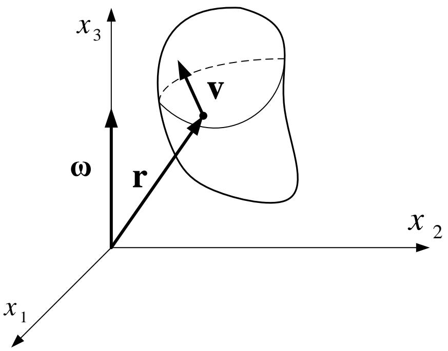

text_image

x₃
ω
r
v
x₂
x₁

Symmetry of index

## 2.4 Cartesian tensor

## Example 2

Moment of inertia of rigid body
Recall the relationship between $\delta_{ij}$ and $e_{ijk}$ :

$$
e _ {q i p} e _ {q j k} = \delta_ {i j} \delta_ {p k} - \delta_ {i k} \delta_ {p j}
$$

Substitute into the expression of moment of inertia:

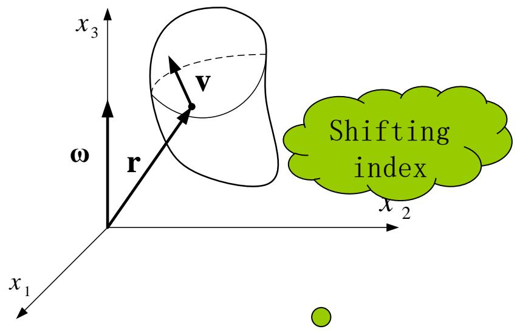

text_image

x₃
v
ω
r
x₁
x₂
Shifting index

$$
\begin{array}{l} I _ {i j} = e _ {p q i} e _ {p j k} \int x _ {p} x _ {k} d m = \int (\delta_ {i j} \delta_ {p k} - \delta_ {i k} \delta_ {p j}) x _ {p} x _ {k} d m \quad . \\ = \int (\delta_ {i j} \delta_ {p k} x _ {p} x _ {k} - \delta_ {i k} \delta_ {p j} x _ {p} x _ {k}) d m = \int (\delta_ {i j} x _ {p} x _ {p} - x _ {i} x _ {j}) d m \\ \end{array}
$$

Equation of coordinate transformation:

$$
x _ {i ^ {\prime}} = l _ {i ^ {\prime} j} x _ {j}
$$

## 2.4 Cartesian tensor

## Example 2

The moment of inertia of rigid body

From the previous example we know that $\delta_{ij}$ is a second order tensor.

Note that the length $x_{\mathrm{p}}x_{\mathrm{p}}$ is a scalar and therefore is independent of coordinate transformation. Recall the summation indices:

$$
x _ {p} x _ {p} = x _ {p ^ {\prime}} x _ {p ^ {\prime}}
$$

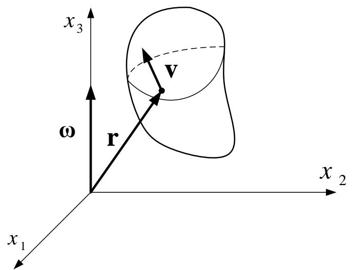

text_image

x₃
ω
r
v
x₂
x₁

For $x_{i}x_{j}$ : $x_{i'}x_{j'} = l_{i'm}x_ml_{j'n}x_n = l_{i'm}l_{j'n}x_mx_n$

Thus: $I_{i'j'} = \int (\delta_{i'j'}x_{p'}x_{p'} - x_{i'}x_{j'})dm$

$$
= \int (\delta_ {m n} l _ {i ^ {\prime} m} l _ {j ^ {\prime} n} x _ {p} x _ {p} - x _ {m} x _ {n} l _ {i ^ {\prime} m} l _ {j ^ {\prime} n}) d \Omega
$$

$$
= l _ {i ^ {\prime} m} l _ {j ^ {\prime} n} \int (\delta_ {m n} x _ {p} x _ {p} - x _ {m} x _ {n}) d m = l _ {i ^ {\prime} m} l _ {j ^ {\prime} n} I _ {m n}
$$

The moment of inertia is a second order tensor

## 2.4 Cartesian tensor

## Tensor calculations

Addition and subtraction is the same as matrix calculation.  
Product of a scalar and a tensor is the same as matrix multiplication.  
Notation of the derivatives of tensors

$$
\frac {\partial (\quad)}{\partial x _ {i}} \equiv (\quad), _ {i} \quad \frac {\partial (\quad)}{\partial x _ {i j}} \equiv (\quad), _ {i j}
$$

## Tensor decomposition

Symmetric and anti-symmetric tensor decomposition  
Spherical and deviator tensor decomposition

## Tensor invariant

Analogous to eigenvalue and eigenvectors in matrix.

Tensor is a mathematical tool. During early development it was only a convenient notation that simplifies expressions and equations. However in recent decades, theory of tensor was rapidly developed and became an important tool for studies of continuum mechanics.

Herein, only basic concepts are given and it is expected to be helpful for reading the textbook and literature review  
The three bullet points listed above will be further discussed with specific examples in later sections.

## III、Theory of elasticity: differential context

# Introduction

Several basic concepts are reviewed in this lecture. Since the main purpose is to consolidate the tensor as a tool for defining the elasticity theory, the completeness of the elasticity theory is not particularly sought.  
In addition to learning the use of tensor, several basic concepts in mechanics of elasticity are also reviewed.

Internal forces内力分析部分

■ Stress states, stresses transformation when coordinate axes rotate 点的应力状态，坐标轴旋转时应力分量的计算  
■ Principal stresses and stress invariants, the decomposition of stress tensors主应力及应力不变量，应力张量的分解

Deformation 变形分析部分

■ Strain tensors: deduction and physical representations应变张量的推导及其物理意义  
■ Deformation analysis of rigid body刚体变形分析

Constitutive theory 本构理论

■ Strain energy function derived from thermal mechanics theory从热力学出发建立应变能函数  
■ Deduction of linear elasticity theory 线弹性理论的推导

Summary of mechanics and elasticity 弹性力学方程汇总

■ The order reduction of tensors 张量的降阶  
■ Expression of matrix calculus 矩阵算子表达式  
■ Equation derivations under various coordinate systems不同坐标系下方程的推导

## 3.1 Internal forces内力分析

## Stress state at one point

The stress state will be determined if all nine stress components can be determined.

This statement is true only if the following condition is met: stresses in any slant planes can be represented by those nine components.

This has been proven in the Theory of Elasticity and is used herewith directly. Consider the infinitesimal tetrahedron element in the diagram on the right:

The equilibrium in three axial directions will lead to the stress equations in any slant plane.:

$$
\left\{ \begin{array}{l} T _ {1} ^ {n} = \sigma_ {1 1} l _ {1} + \sigma_ {2 1} l _ {2} + \sigma_ {3 1} l _ {3} \\ T _ {2} ^ {n} = \sigma_ {1 2} l _ {1} + \sigma_ {2 2} l _ {2} + \sigma_ {3 2} l _ {3} \\ T _ {3} ^ {n} = \sigma_ {1 3} l _ {1} + \sigma_ {2 3} l _ {2} + \sigma_ {3 3} l _ {3} \end{array} \right.
$$

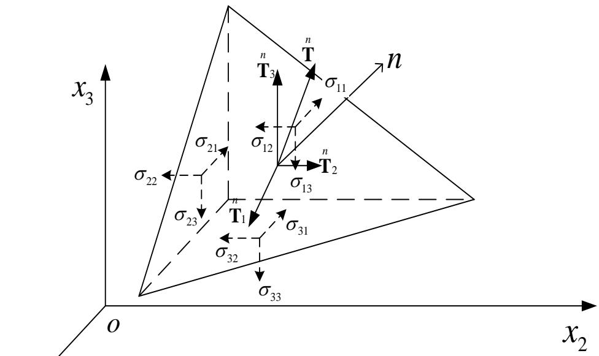

text_image

x₃
σ₂₂ ← σ₂₁ ← σ₁₂ ← σ₁₃ ← σ₁₄
σ₂₃ ← σ₃₂ ← σ₃₃ ← σ₃₁ ← σ₃₂ ← σ₃₃
O
x₂
n
n
T₃
T
T₂
n
n
n
n
T₁
T₃

$x_{1}$ $l_{1}, l_{2}, l_{3}$ represent the direction cosine of n, i.e. $l_{1} = \cos(n, x_{1})$ , $l_{2} = \cos(n, x_{2})$ , $l_{3} = \cos(n, x_{3})$

The equations on the left can also represent the stress boundary conditions.

## 3.1 Internal forces内力分析

## Stress at one point

The equation in the previous slide is the well-known Cauchy stress equation, written in the form of matrix as follows:

$$
\left( \begin{array}{c} n \\ T _ {1} \\ n \\ T _ {2} \\ n \\ T _ {3} \end{array} \right) = \left( \begin{array}{c c c} \sigma_ {1 1} & \sigma_ {2 1} & \sigma_ {3 1} \\ \sigma_ {1 2} & \sigma_ {2 2} & \sigma_ {2 3} \\ \sigma_ {1 3} & \sigma_ {2 3} & \sigma_ {3 3} \end{array} \right) \left( \begin{array}{c} l _ {1} \\ l _ {2} \\ l _ {3} \end{array} \right)
$$

It can be further simplified by using the index symbols:

$$
T _ {i} ^ {n} = \sigma_ {j i} l _ {j} (i = 1, 2, 3)
$$

The equilibrium of moment about three axial directions, the theorem of equality of shear stresses can be obtained:

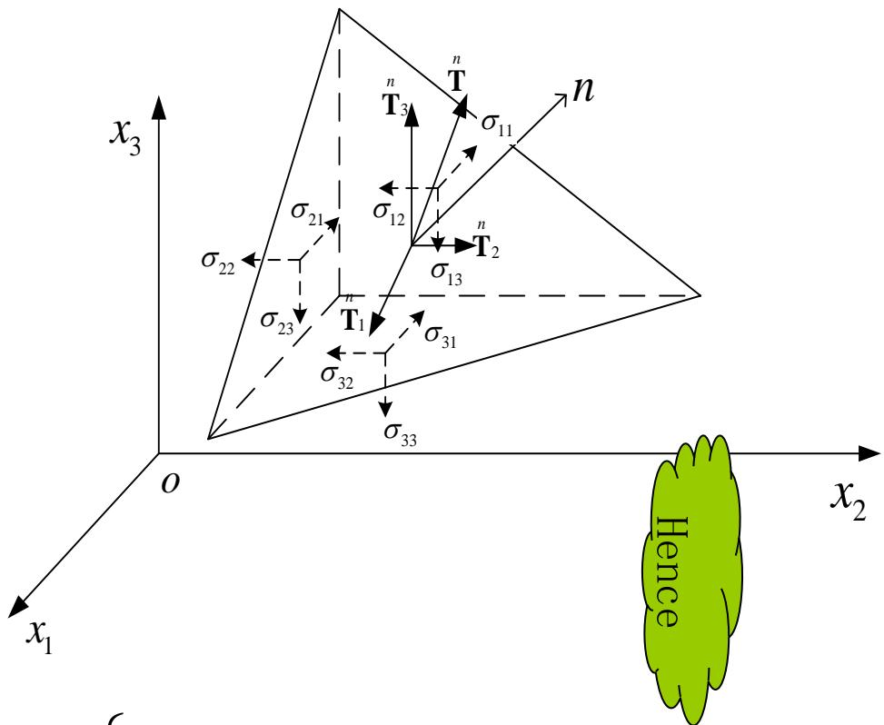

text_image

x₃
σ₂₂
σ₂₁
σ₁₂
T₃
n
T
n
σ₁₁
n
T₂
σ₁₃
σ₂₃
T₁
n
σ₃₁
σ₃₂
σ₃₃
O
x₁
x₂
Hence

$$
\left\{ \begin{array}{l l} \sigma_ {1 2} = \sigma_ {2 1} & \stackrel {\bullet} {\vdots} \\ \sigma_ {2 3} = \sigma_ {3 2} & T _ {i} = \sigma_ {j i} l _ {j} = \sigma_ {i j} l _ {j} \\ \sigma_ {3 1} = \sigma_ {1 3} & \end{array} \right.
$$

## 3.1 Internal forces内力分析

## The stress transformation at the rotation of coordinate systems

By utilizing the above results, the 9 stress components in the new coordinate system $\{O; x_{1}^{\prime}, x_{2}^{\prime}, x_{3}^{\prime}\}$ can be represented using those from the old coordinate system $\{O; x_{1}, x_{2}, x_{3}\}$ .  
An orthogonal coordinate system is defined on the slant section with three axes r, m, n. The n axis is aligned with the normal direction and $r \& m$ are perpendicular to each other.  
The projected stress components along r, m, n axes can be represented with $\sigma_{nr}$ , $\sigma_{nm}$ , $\sigma_{nn}$ .  
The direction cosine along the m axis can be expressed as $l_{m1}$ , $l_{m2}$ , $l_{m3}$ , and the n/r axis follows the same convention.  
Since the projection of a vector is the summation of its components, i.e.

$$
\sigma_ {n m} = T _ {i} ^ {n} l _ {m i} = T _ {1} ^ {n} l _ {m 1} + T _ {2} ^ {n} l _ {m 2} + T _ {3} ^ {n} l _ {m 3} = \left( \begin{array}{c c c} l _ {m 1} & l _ {m 2} & l _ {m 3} \end{array} \right)
$$

where $T_{i}(i = 1,2,3)$ are the stress vector on the slant plane.

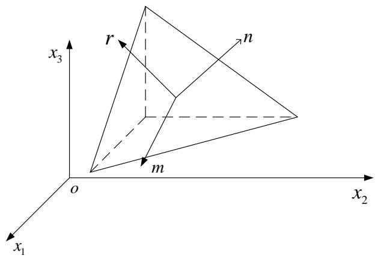

text_image

x₃
r
n
m
o
x₂
x₁

The best way to get familiar with the tensor is to write its expanded expressions and then form them into a matrix. After some practices, you will be able to establish their relationship and find their advantages of being concise.

$$
\left( \begin{array}{c} n \\ T _ {1} \\ n \\ T _ {2} \\ n \\ T _ {3} \end{array} \right)
$$

## 3.1 Internal forces内力分析

The stress components transformation at the rotation of coordinate systems
坐标轴旋转时应力分量的计算

According to Cauchy Formula

$$
T _ {i} ^ {n} = \sigma_ {j i} l _ {n j}
$$

Thus $\sigma_{nm}=T_{i}l_{mi}=\sigma_{ji}l_{nj}l_{mi}$

It can be written in matrix form

$$
\sigma_ {n m} = \left( \begin{array}{c c c} l _ {m 1} & l _ {m 2} & l _ {m 3} \end{array} \right) \left( \begin{array}{c c c} \sigma_ {1 1} & \sigma_ {2 1} & \sigma_ {3 1} \\ \sigma_ {1 2} & \sigma_ {2 2} & \sigma_ {2 3} \\ \sigma_ {1 3} & \sigma_ {2 3} & \sigma_ {3 3} \end{array} \right) \left( \begin{array}{c} l _ {n 1} \\ l _ {n 2} \\ l _ {n 3} \end{array} \right)
$$

text_image

x₃
r
n
m
o
x₂
x₁

## 3.1 Internal forces内力分析

The stress components transformation at the rotation of coordinate systems
坐标轴旋转时应力分量的计算

Similar as $\sigma_{nm} = \sigma_{ji}l_{nj}l_{mi}$

Thus the nine components of stress at the new coordinate systems can be written as follows, take $\sigma_{2'3'}$ for example

$$
\sigma_ {2 ^ {\prime} 3 ^ {\prime}} = \sigma_ {i j} l _ {2 ^ {\prime} j} l _ {3 ^ {\prime} i}
$$

Using free index we can get

$$
\sigma_ {m n} = \sigma_ {i j} l _ {m j} l _ {n i} (m, n = 1, 2, 3)
$$

It can be written in matric form

$$
\pmb {\sigma} ^ {\prime} = \mathbf {L} \pmb {\sigma} \mathbf {L} ^ {T}
$$

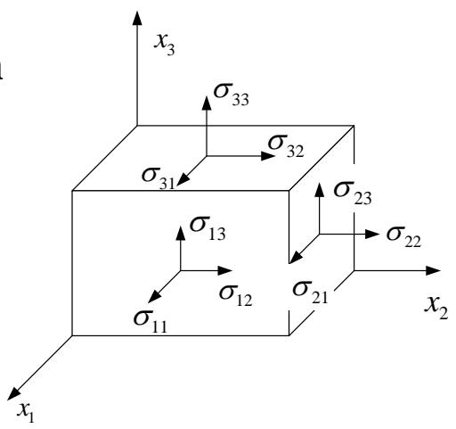

text_image

x₃
σ₃₃
σ₃₂
σ₃₁
σ₂₃
σ₂₂
σ₁₃
σ₁₂
σ₁₁
x₂
x₁

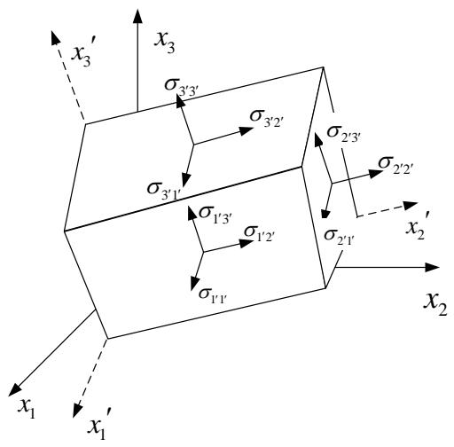

text_image

x₃'
x₃
σ₃'₃'
σ₃'₂'
σ₃'₁'
σ₂'₃'
σ₂'₂'
σ₁'₃'
σ₁'₂'
σ₁'₁'
σ₂'₁'
x₂'
x₁
x₁'
x₂

The included angle cosine between two coordinate systems

<table><tr><td></td><td> $x_{1}$ </td><td> $x_{2}$ </td><td> $x_{3}$ </td></tr><tr><td> $x'_{1}$ </td><td> $l_{11}$ </td><td> $l_{12}$ </td><td> $l_{13}$ </td></tr><tr><td> $x'_{2}$ </td><td> $l_{21}$ </td><td> $l_{22}$ </td><td> $l_{23}$ </td></tr><tr><td> $x'_{3}$ </td><td> $l_{31}$ </td><td> $l_{32}$ </td><td> $l_{33}$ </td></tr></table>

## 3.1 Internal forces 内力分析

## The principal stress 主应力

According to

$$
\pmb {\sigma} ^ {\prime} = \mathbf {L} \pmb {\sigma} \mathbf {L} ^ {T}
$$

It can be seen that the tensor components transformation equals to that of matric components at the rotation of coordinate system.

$$
\mathbf {A} ^ {\prime} = \mathbf {L A L} ^ {T}
$$

Refer to equality of shear stresses theorem, stress tensor is symmetric. (由剪力互等定理，应力张量是对称的)  
It is indicated that in the matrix theory of linear algebra, if a matrix meets the following two requirements at the rotation of coordinate systems

■ Matrix elements are real numbers  
■ Matrix is symmetric

Then there definitely exists a coordinate system that can diagonalize the matrix

The physical meaning of this conclusion is that there must exist three principle stress of real number and a group of orthogonal principal directions for any point in the object..

对于物体内任意一点，必定存在三个实数值的主应力及一组正交的主方向。

## 3.1 Internal forces内力分析

## The principal stress 主应力

Physical explanations of the principal stress We know that stress vector at a point on an arbitrary cross-section depends on both stress tensor and the direction of section.

Thus the following question is proposed: if there is any cross-section of which the stress vector is alined with its normal vector? This stress vector indicates a normal stress with no shear stress.

The normal stress with the characters above will be called as the principal stress, which is the principal value of stress tensor. The section will be called the principal plane whose normal direction is the principal direction of stress tensor.

Assuming that the inclined section in the picture meets the requirements above, and the stress on it is $\sigma$ , according to Cauchy formula

$$
T _ {i} ^ {n} = \sigma_ {i j} n _ {i} = \sigma n _ {i} (i = 1, 2, 3)
$$

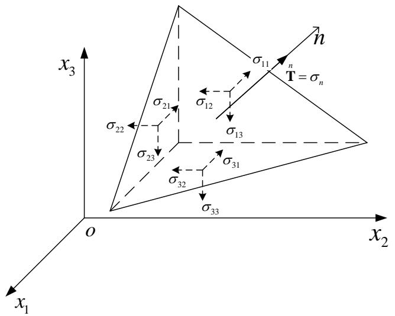

text_image

x₃
σ₂₂
σ₂₁
σ₁₂
σ₁₃
σ₂₃
σ₃₂
σ₃₁
σ₃₃
n
T = σₙ
O
x₂
x₁

The principal stress at one point

## It can be written in matrix form

$$
\left( \begin{array}{c} ^ {n} T _ {1} \\ ^ {n} T _ {2} \\ ^ {n} T _ {3} \end{array} \right) = \left( \begin{array}{c c c} \sigma_ {1 1} & \sigma_ {2 1} & \sigma_ {3 1} \\ \sigma_ {1 2} & \sigma_ {2 2} & \sigma_ {2 3} \\ \sigma_ {1 3} & \sigma_ {2 3} & \sigma_ {3 3} \end{array} \right) \left( \begin{array}{c} n _ {1} \\ n _ {2} \\ n _ {3} \end{array} \right) = \sigma \left( \begin{array}{c} n _ {1} \\ n _ {2} \\ n _ {3} \end{array} \right)
$$

## 3.1 Internal forces 内力分析

## The principal stress 主应力

It is actually a question of matrix eigenvalue and the nonzero solution is the corresponding determinants equals zero.

$$
\left| \begin{array}{c c c} \sigma_ {1 1} - \sigma & \sigma_ {2 1} & \sigma_ {3 1} \\ \sigma_ {1 2} & \sigma_ {2 2} - \sigma & \sigma_ {2 3} \\ \sigma_ {1 3} & \sigma_ {2 3} & \sigma_ {3 3} - \sigma \end{array} \right| = 0
$$

■ It can be written more concisely using the index symbol.

$$
\left| \sigma_ {i j} - \sigma \delta_ {i j} \right| = 0
$$

■ The expanded determinant is

$$
\sigma^ {3} - \sigma^ {2} (\sigma_ {1 1} + \sigma_ {2 2} + \sigma_ {3 3}) + \sigma (\sigma_ {1 1} \sigma_ {2 2} + \sigma_ {2 2} \sigma_ {3 3} + \sigma_ {3 3} \sigma_ {1 1} - \sigma_ {2 3} ^ {2} - \sigma_ {3 1} ^ {2} - \sigma_ {1 2} ^ {2})
$$

$$
- (\sigma_ {1 1} \sigma_ {2 2} \sigma_ {3 3} + 2 \sigma_ {2 3} \sigma_ {3 1} \sigma_ {1 2} - \sigma_ {1 1} \sigma_ {2 3} ^ {2} - \sigma_ {2 2} \sigma_ {3 1} ^ {2} - \sigma_ {3 3} \sigma_ {1 2} ^ {2}) = 0
$$

## 3.1 Internal forces 内力分析

## The principal tress and the invariant of stress tensor 主应力与应力张量不变量

The equation above can be rewritten as follows

$$
\sigma^ {3} - \sigma^ {2} I _ {1} + \sigma I _ {2} - I _ {3} = 0
$$

$I_{1}$ , $I_{2}$ and $I_{3}$ are the invariants of stress tensor.

$$
I _ {1} = \sigma_ {1 1} + \sigma_ {2 2} + \sigma_ {3 3}
$$

$$
I _ {2} = \left| \begin{array}{c c} \sigma_ {1 1} & \sigma_ {1 2} \\ \sigma_ {2 1} & \sigma_ {2 2} \end{array} \right| + \left| \begin{array}{c c} \sigma_ {2 2} & \sigma_ {2 3} \\ \sigma_ {3 2} & \sigma_ {3 3} \end{array} \right| + \left| \begin{array}{c c} \sigma_ {3 3} & \sigma_ {3 1} \\ \sigma_ {1 3} & \sigma_ {1 1} \end{array} \right|
$$

$$
I _ {3} = \left| \begin{array}{c c c} \sigma_ {1 1} & \sigma_ {2 1} & \sigma_ {3 1} \\ \sigma_ {1 2} & \sigma_ {2 2} & \sigma_ {2 3} \\ \sigma_ {1 3} & \sigma_ {2 3} & \sigma_ {3 3} \end{array} \right|
$$

## 3.1 Internal forces 内力分析

## The invariant of stress tensor

$\sigma_{1}, \sigma_{2}$ and $\sigma_{3}$ are the three solutions of this simple cubic equation

$$
\sigma^ {3} - \sigma^ {2} I _ {1} + \sigma I _ {2} - I _ {3} = 0
$$

According to the relationship between solutions and coefficients of a algebraic equation, $I_{1}$ , $I_{2}$ , $I_{3}$ can be expressed as

$$
\begin{array}{l} I _ {1} = \sigma_ {1} + \sigma_ {2} + \sigma_ {3} \\ I _ {2} = \sigma_ {1} \sigma_ {2} + \sigma_ {2} \sigma_ {3} + \sigma_ {3} \sigma_ {1} \\ I _ {3} = \sigma_ {1} \sigma_ {2} \sigma_ {3} \\ \end{array}
$$

Because the value of principal stress is independent of coordinate systems, it can be deduced that $I_1$ , $I_2$ and $I_3$ are also independent of coordinate systems. That's why we call them the invariant of stress tensor.

Now we use the transformation formulas for the rotation of coordinate axes to prove the validity of the first invariant of stress tensor.

$$
\sigma_ {i ^ {\prime} i ^ {\prime}} = \sigma_ {m n} l _ {i ^ {\prime} m} l _ {i ^ {\prime} n} = \sigma_ {m n} \delta_ {m n} = \sigma_ {m m} = \sigma_ {i i}
$$

## 3.1 Internal forces 内力分析

## Decomposition of Stress Tensor 应力张量的分解

The stress tensor can be divided into two parts, one of which is the homogeneous state of stress where all the principal stress equal and the shear stress is the average stress. It can be expressed in the following matrix.

$$
\left| \begin{array}{c c c} \sigma_ {m} & 0 & 0 \\ 0 & \sigma_ {m} & 0 \\ 0 & 0 & \sigma_ {m} \end{array} \right|
$$

其中 $\sigma_{m} = \frac{1}{3}\sigma_{ii} = \frac{1}{3}\bigl (\sigma_{11} + \sigma_{22} + \sigma_{33}\bigr)$

It is called the spherical stress tensor （球应力张量）that only depends on the volume of the material.

The rest part of the stress tensor is called deviator stress tensor（偏应力张量）that only depends on the deformation of material (shear deformation), whose component is

$$
S _ {i j} = \sigma_ {i j} - \sigma_ {m} \delta_ {i j}
$$

The three invariants of deviator stress tensor can be solved by similar method. They are widely applied in plastic mechanics.

## 3.1 Internal forces内力分析

## The equilibrium equation 平衡方程

Gauss Formula（该公式以后经常用到，希望大家能够复习）

$$
\iint_ {S} (P \cos \alpha + Q \cos \beta + R \cos \gamma) d S = \iiint_ {V} (\frac {\partial P}{\partial x} + \frac {\partial Q}{\partial y} + \frac {\partial R}{\partial z}) d V
$$

It can be written more concisely with regard to the stress in elastic mechanics.

$$
\int_ {S} \sigma_ {i j} l _ {j} d S = \int_ {V} \sigma_ {i j, j} d V (i = 1, 2, 3)
$$

Equilibrium of isolated element

A volume V surrounded by closed surface S is subjected to a force named $T_{i}$ on outer surface and a body force $F_{i}$ . The total force equals zero.

$$
\int_ {S} \mathrm{T} _ {i} d S + \int_ {V} \mathrm{F} _ {i} d V = 0 (i = 1, 2, 3)
$$

In terms of Cauchy Formula, we can get

$$
\int_ {S} \sigma_ {\mathrm{ij}} l _ {j} d S + \int_ {V} \mathrm{F} _ {i} d V = 0 (i = 1, 2, 3)
$$

## 3.1 Internal forces内力分析

## The equilibrium equation平衡方程

Gauss Formula

$$
\int_ {S} \sigma_ {i j} l _ {j} d S = \int_ {V} \sigma_ {i j, j} d V (i = 1, 2, 3)
$$

Equilibrium of an isolated element

$$
\int_ {S} \sigma_ {\mathrm{ij}} l _ {j} d S + \int_ {V} F _ {i} d V = 0 (i = 1, 2, 3)
$$

Substituting the first to the second equation and rearranging it, one has

$$
\int_ {V} (\sigma_ {\mathrm{ij}, \mathrm{j}} + \mathrm{F} _ {i}) d V = 0 (i = 1, 2, 3)
$$

Notice that V is arbitrary, so the equality holds valid only when its integrand function is identically zero.  
Thus $\sigma_{\mathrm{ij,j}} + \mathrm{F}_i = 0 (i = 1,2,3)$

Gauss Formula is useful in applied mathematics due to its establishment of the relationship between volume and surface integrals of continuous function. 这里的思想方法，以后经常遇到。

## 3.2 Deformation analysis变形分析

## Configuration and displacement 构形与位移

Under the assumption of small deformation where deformation is really small, the change of spatial position can be ignored. Otherwise the change must be taken into consideration. The concept of configuraion is use to depict the two different states of the object before and after the deformation.  
构形(configuration): the area occupied by object instantaneously (有时也将其称为位形), which depict the location and the shape of the object. That is a geometrical morphology of the deformed object described by the coordinate system.

- When $t = 0$ , initial configuration is $V_0$ , referring to a fixed coordinate system $\{x_i\}$ .  
Point p in the object can be expressed by the radius vector r or its particle coordinates $(x_{1}, x_{2}, x_{3})$ . $V_{0}$ is called the initial configuration.  
■ Object is then moved to another position at time t when V is called current configuration, which is described by the rectangular coordinate system $\{\xi_{i}\}$ Point p in the initial configuration is moved to the point Q in the current configuration, can be expressed by radius vector R or its particle coordinates ( $\xi_{1}$ , $\xi_{2}$ , $\xi_{3}$ )  
As shown in the picture on the right, let coordinate systems $\{x_{i}\}$ and $\{\xi_{i}\}$ coincide.

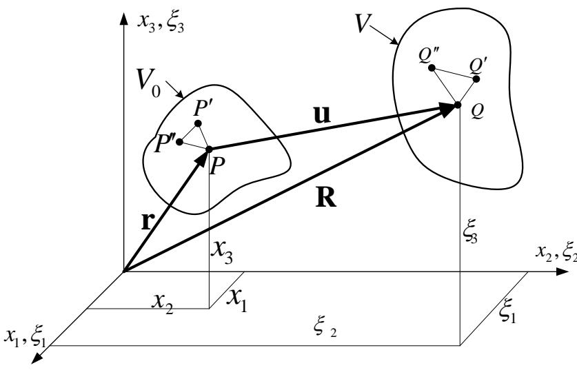

text_image

x₃, ξ₃
V₀
P′
u
Q″
Q′
P
P′
R
r
x₃
ξ₃
x₂, ξ₂
x₁, ξ₁
ξ₂
ξ₁

## 3.2 Deformation analysis变形分析

## Configuration and displacement 构形与位移

The change of configuration of the object from the initial to the current state can be regarded as a kind of mathematical transformation. So the relationship between particle P and Q is

$$
\xi_ {\mathrm{i}} = \xi_ {\mathrm{i}} (x _ {1}, x _ {2}, x _ {3}, t) (\mathrm{i} = 1, 2, 3)
$$

$\xi_{i}$ is obviously the single valued continuous function of $x_{j}$ , so according to its definition we can get

$$
\xi_ {\mathrm{i}} = \xi_ {\mathrm{i}} (x _ {1}, x _ {2}, x _ {3}, 0) = x _ {\mathrm{i}} (\mathrm{i} = 1, 2, 3)
$$

位移(displacement)

Let $u_{i}$ be the displacement of the particle along the $x_{i}$ axis

$$
u _ {\mathrm{i}} = \xi_ {\mathrm{i}} - x _ {\mathrm{i}} (\mathrm{i} = 1, 2, 3)
$$

Or rewritten in the vector form

$$
\mathbf {u} = \mathbf {R} - \mathbf {r}
$$

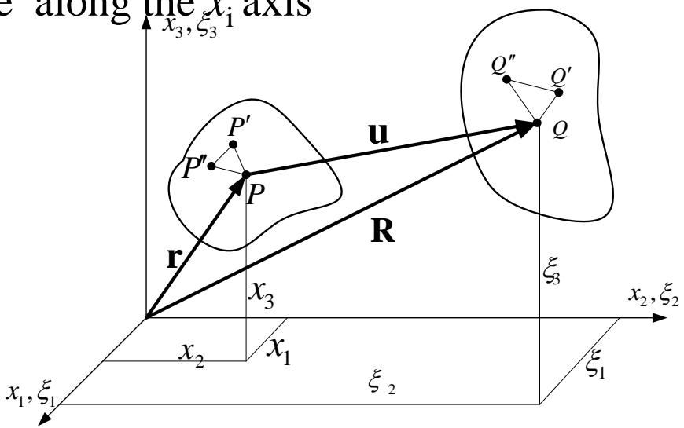

text_image

e along the x_i axis
x_3, \xi_3
P'
P'
u
R
r
x_3
x_2, \xi_2
x_1, \xi_1
\xi_2
\xi_1
Q''
Q'
Q
\xi_3

## 3.2 Deformation analysis变形分析

## Configuration and displacement 构形与位移

The displacement can be divided into two different kinds

■ Rigid body displacement: Points in the object still remain in the same relative position after the displacement, which is only caused by the rigid motion in the space.  
■ Deformaiton displacement: the relative displacement of each point in the object is changed by the occurrence of displacement. This is the kind of displacement that the elastic mechanics concerns because it is related to the stress inside the object.

Pick three adjacent points P, P' and P'', which $x_{1}, \xi_{1}$ respectively move to the point Q, Q' and Q'' after deformation. Obviously when the changes of the length of each side are confirmed, the shape and angles of the triangle will be completely determined.  
If all the miniature triangles are pieced together, then the new form of the object can be determined after deformation, other than the location in the space. So the key to the deformation analysis is to describe the change of the distance between any two points within object.

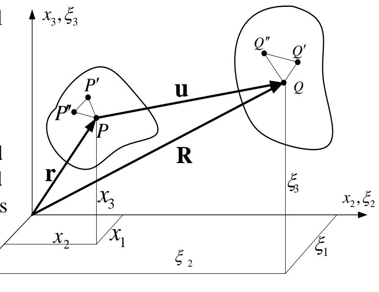

text_image

x₃, ξ₃
P'
P
u
Q''
Q'
Q
R
r
s
x₃
ξ₃
x₂, ξ₂
x₂
x₁
ξ₂
ξ₁

## 3.2 Deformation analysis变形分析

## Strain tensors 应变张量

Study the two adjacent points P(x1,x2,x3)、P'(x1+dx1, x2+dx2, x3+dx3). The square of initial length ds0 of line element PP' before deformation is:

$$
d s _ {0} ^ {2} = d x _ {1} ^ {2} + d x _ {2} ^ {2} + d x _ {3} ^ {2} = d x _ {i} d x _ {i}
$$

After the deformation, point P、P' move to Q ( $\xi_{1}, \xi_{2}, \xi_{3}$ ), Q' ( $\xi_{1}+d\xi_{1}, \xi_{2}+d\xi_{2}, \xi_{3}+d\xi_{3}$ ). And the square of $x_{1}, \xi_{1}$ length ds of line element QQ' is

$$
d s ^ {2} = d \xi_ {1} ^ {2} + d \xi_ {2} ^ {2} + d \xi_ {3} ^ {2} = d \xi_ {i} d \xi_ {i}
$$

we consider the change of the configuration from xi (i=1, 2, 3) to $\xi i$ (i=1, 2, 3) as a mathematical transformation, that is

$$
\xi_ {\mathrm{i}} = \xi_ {\mathrm{i}} (x _ {1}, x _ {2}, x _ {3}) (\mathrm{i} = 1, 2, 3)
$$

Thus $d\xi_{i} = \frac{\partial\xi_{i}}{\partial x_{j}} dx_{j} = \xi_{i,j}dx_{j}$

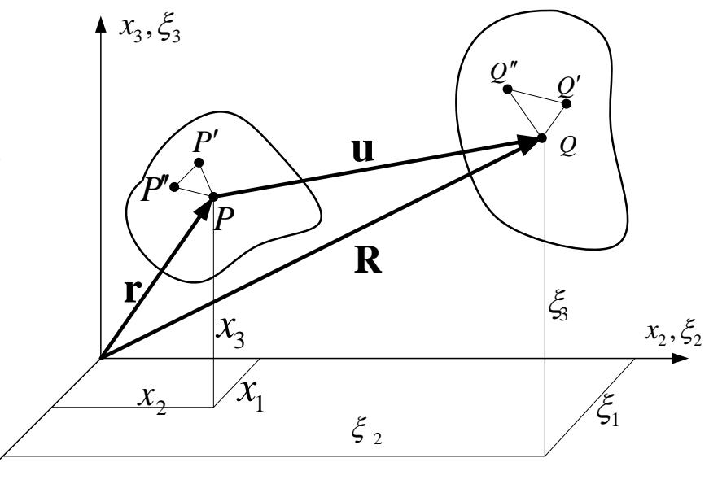

text_image

x₃,ξ₃
P'
P'
P
u
R
r
x₃
ξ₃
x₂,ξ₂
x₂
x₁
ξ₂
ξ₁
Q''
Q'
Q

## 3.2 Deformation analysis变形分析

## Strain tensors 应变张量

So the quadratic difference of the line element can be expressed as

$$
d s ^ {2} - d s _ {0} ^ {2} = d \xi_ {k} d \xi_ {k} - d x _ {i} d x _ {i} = \xi_ {k, i} d x _ {i} \xi_ {k, j} d x _ {j} - \delta_ {i j} d x _ {i} d x _ {j}
$$

introducing the dependent variable

$$
E _ {i j} = \frac {1}{2} (\xi_ {k, i} \xi_ {k, j} - \delta_ {i j})
$$

One has

$$
d s ^ {2} - d s _ {0} ^ {2} = 2 E _ {i j} d x _ {j} d x _ {i}
$$

$E_{ij}$ is called Green Strain, which is a frequently used strain measurement in terms of large deformation analysis

In order to get the relationship between stress and strain, we refer to the displacement field mentioned above.

$$
u _ {i} = \xi_ {i} - x _ {i} (i = 1, 2, 3)
$$

## 3.2 Deformation analysis变形分析

## Strain tensor 应变张量

Therefore

$$
\frac {\partial \xi_ {i}}{\partial x _ {j}} = \frac {\partial (u _ {i} + x _ {i})}{\partial x _ {j}} = \frac {\partial u _ {i}}{\partial x _ {j}} + \delta_ {i j} = u _ {i, j} + \delta_ {i j}
$$

Substitute the formula above into the Green strain expression and pay attention to the role of $\delta_{ij}$ , which could shift the index

$$
E _ {i j} = \frac {1}{2} [ (u _ {k, i} + \delta_ {k i}) (u _ {k, j} + \delta_ {k j}) - \delta_ {i j} ] = \frac {1}{2} (u _ {i, j} + u _ {j, i} + u _ {k, i} u _ {k, j})
$$

Due to the small deformation assumption, the second order term of the displacement's derivatives can be ignored. Therefore the Green strain can be reduced to the strain tensor for the small deformation problem.

That is,

$$
\star \varepsilon_ {i j} = \frac {1}{2} (u _ {i, j} + u _ {j, i})
$$

We can try to prove that the strain is also a second-order tensor.  
Like we work on the stresses, we can also determine the principal strains as well as principal strain directions and find the strain invariants.

## 3.2 Deformation analysis 变形分析

## Physical meaning of strain tensor

Now we'll discuss how to determine the relative elongation of a line element by the strain tensor.

Suppose a given line element to be parallel to the x axis before the deformation, and its components are $dx_{1}=ds_{0}$ , $dx_{2}=dx_{3}=0$ and ds after deformation. Thus the relative elongation of the line element is

$$
L _ {1} = \frac {d s - d s _ {0}}{d s _ {0}} \quad \text {或} \quad d s = (1 + L _ {1}) d s _ {0}
$$

based on the small deformation assumption

$$
d s ^ {2} - d s _ {0} ^ {2} = 2 E _ {i j} d x _ {j} d x _ {i} \approx 2 \varepsilon_ {i j} d x _ {j} d x _ {i} = 2 \varepsilon_ {1 1} d x _ {1} ^ {2}
$$

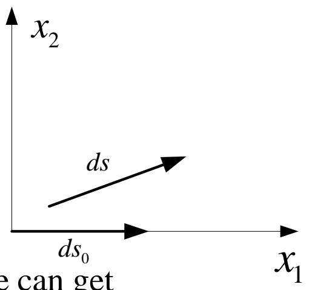

text_image

x₂
ds
ds₀
e can get
x₁

Combining the above expressions and using $dx_{1}=ds_{0}$ we can get

$$
\left(1 + L _ {1}\right) ^ {2} - 1 = 2 \varepsilon_ {1 1} \quad \text {即} \quad L _ {1} = \sqrt {1 + 2 \varepsilon_ {1 1}} - 1 \approx \varepsilon_ {1 1}
$$

The relative elongation is what we usually call normal strain, so the value of $\varepsilon_{11}$ equals the engineering normal strain. (Similar conclusions are valid to $\varepsilon_{22}$ and $\varepsilon_{33}$ )

## 3.2 Deformation analysis 变形分析

## Physical meaning of strain tensor

How to determine the angle between two mutually perpendicular line element by the strain tensor?

Suppose the line element $ds_{0}$ was parallel to $x_{1}$ axis before the deformation and its components are $dx_{1}=ds_{0}$ , $dx_{2}=dx_{3}=0$ ; $ds'_{0}$ was parallel to $x_{2}$ and its components are $dx_{2}=ds'_{0}$ , $dx_{1}=dx_{3}=0$ . New line elements after deformation are $ds(\mathrm{d}\xi_{\mathrm{i}})$ and $ds'(\mathrm{d}\xi'_{\mathrm{i}})$ . Inner product between the new line element ds and $ds'$ is as follows

$$
d \mathbf {s} \cdot d \mathbf {s} ^ {\prime} = d s d s ^ {\prime} \cos \theta = d \xi_ {k} d \xi_ {k} ^ {\prime} = \xi_ {k, i} d x _ {i} \xi_ {k, j} d x _ {j} ^ {\prime} = \xi_ {k, 1} \xi_ {k, 2} d s _ {0} d s _ {0} ^ {\prime}
$$

By using the Green Formula and with $\delta_{ij} = \delta_{12} = 0$ , we have

$$
E _ {1 2} = \frac {1}{2} (\xi_ {k, 1} \xi_ {k, 2} - \delta_ {i j}) = \frac {1}{2} \xi_ {k, 1} \xi_ {k, 2}
$$

Substituted into the above expression

$$
d s d s ^ {\prime} \cos \theta = 2 E _ {1 2} d s _ {0} d s _ {0} ^ {\prime}
$$

Since

$$
d s = \sqrt {1 + 2 E _ {1 1}} d s _ {0} d s ^ {\prime} = \sqrt {1 + 2 E _ {1 1}} d s _ {0} ^ {\prime}
$$

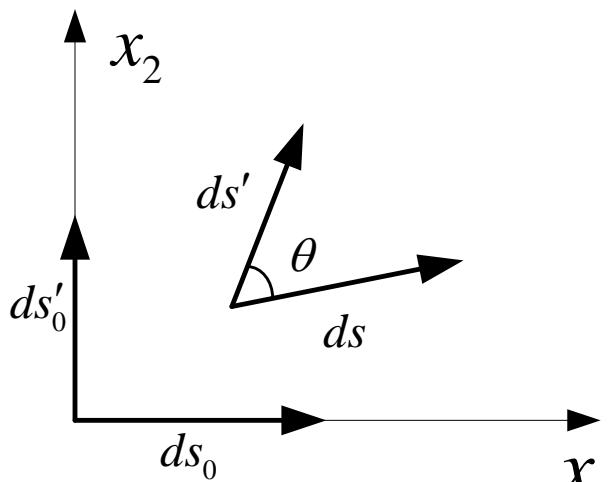

text_image

x₂
ds′
θ
ds
ds′₀
ds₀
x

## 3.2 Deformation analysis 变形分析

## Physical meaning of strain tensor

From the formulas above, we can get

$$
\cos \theta = \frac {2 E _ {1 2} d s _ {0} d s _ {0} ^ {\prime}}{d s d s ^ {\prime}} = \frac {2 E _ {1 2}}{\sqrt {1 + 2 E _ {1 1}} \sqrt {1 + 2 E _ {2 2}}}
$$

So the differential angle between $ds_{0}$ and $ds'_{0}$ is

$$
\alpha_ {1 2} = \frac {\pi}{2} - \theta
$$

Thus

$$
\sin \alpha_ {1 2} = \frac {2 E _ {1 2}}{\sqrt {1 + 2 E _ {1 1}} \sqrt {1 + 2 E _ {2 2}}}
$$

In terms of small deformation assumption

$$
\sin \alpha_ {1 2} \approx \alpha_ {1 2} \approx 2 E _ {1 2} \approx 2 \varepsilon_ {1 2} = u _ {i, j} + u _ {j, i} = \gamma_ {i j}
$$

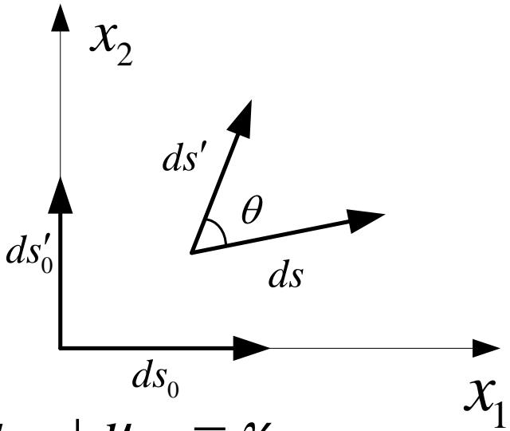

text_image

x₂
ds′
θ
ds
ds₀
ds₀
x₁

This is the engineering shear strain $\gamma_{xy}$ : The angular change of the right angle between $x_{1}$ and $x_{2}$ direction at one point. (Similar conclusions are valid to other components)

## 3.2 Deformation analysis变形分析

## Rigid Deformation 刚体变形

We've discussed the strain of the object based on the change of distance between two arbitrary points inside. However, the displacement results from both the rigid motion and the deformation under the external force.

物体在外力作用下产生的位移是由刚体运动和变形共同引起的。

For example, as illustrated in the picture below, an arbitrary line element AB moves to A'B" after deformation. It can also be regarded as an elongation transformation following a rigid rotation to A'B" after a rigid motion from AB to A'B'.

Next we'll discuss the part of rigid rotation under the assumption of small deformation, which is obviously only related to the relative displacement between end points A and B of the line element.

If expand the displacement of adjacent point B into Taylor series and ignore the second or higher order terms, we can get

$$
\mathbf {u} _ {B} = \mathbf {u} _ {A} + \frac {\partial \mathbf {u}}{\partial x _ {j}} d x _ {j}
$$

The relative displacement between end points A and B of the line element is

$$
d \mathbf {u} = \mathbf {u} _ {B} - \mathbf {u} _ {A} = \frac {\partial \mathbf {u}}{\partial x _ {j}} d x _ {j}
$$

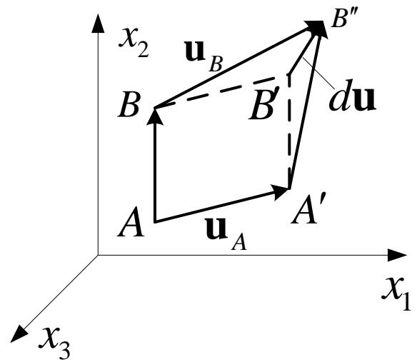

text_image

x₂ u_B B''
B B' du
A u_A A'
x₁
x₃

## 3.2 Deformation analysis 变形分析

## Rigid Deformation 刚体变形

It can be rewritten as follows using index notation

$$
d u _ {i} = \frac {\partial u _ {i}}{\partial x _ {j}} d x _ {j} = u _ {i, j} d x _ {j} (i = 1, 2, 3)
$$

It can be proved that the first-order partial derivative of displacement is a second order tensor. That is (in matrix form)

$$
u _ {i, j} = \left( \begin{array}{c c c} \frac {\partial u _ {1}}{\partial x _ {1}} & \frac {\partial u _ {1}}{\partial x _ {2}} & \frac {\partial u _ {1}}{\partial x _ {3}} \\ \frac {\partial u _ {2}}{\partial x _ {1}} & \frac {\partial u _ {2}}{\partial x _ {2}} & \frac {\partial u _ {2}}{\partial x _ {3}} \\ \frac {\partial u _ {3}}{\partial x _ {1}} & \frac {\partial u _ {3}}{\partial x _ {2}} & \frac {\partial u _ {3}}{\partial x _ {3}} \end{array} \right)
$$

$U_{i,j}$ is usually called the the displacement gradient tensor.

## 3.2 Deformation analysis 变形分析

## Rigid Deformation刚体变形

Normally

$$
\frac {\partial u _ {i}}{\partial x _ {j}} \neq \frac {\partial u _ {j}}{\partial x _ {i}}
$$

So the displacement gradient tensor is usually asymmetric, which can be regarded as the sum of a symmetric and an antisymmetric tensor in order to separate rigid rotation and elongation strain.

$$
u _ {i, j} = \frac {1}{2} \left(u _ {i, j} + u _ {j, i}\right) + \frac {1}{2} \left(u _ {i, j} - u _ {j, i}\right)
$$

The symmetric tensor on the right side of the equation above is the strain tensor $\varepsilon_{ij}$ of small deformation. The antisymmetric one is related to the rotation of the line element, which is called the rotation tensor $\omega_{ij}$ of the small deformation.

So the equation can be expressed as

$$
u _ {i, j} = \varepsilon_ {i j} + \omega_ {i j}
$$

where

$$
\omega_ {i j} = \frac {1}{2} \left(u _ {i, j} - u _ {j, i}\right) = - \omega_ {j i}
$$

## 3.2 Deformation analysis 变形分析

## Physical meaning of the rotation tensor

We now study the angular displacement caused by rigid rotation of a line element through a certain point on the plane $x_{1}x_{2}$ around a rigid axis, which passes through this point and perpendicular to the plane $x_{1}x_{2}$ .

Pick two line elements PA and PB through point P, which are respectively parallel to axis $x_{1}$ and $x_{2}$ . Assume by two angles $\alpha_{1}$ and $\alpha_{2}$ , PA and PB rotate to PA' and PB' respectively (see the figure on the right).

Then under the assumption of small deformation we have

$$
\left\{ \begin{array}{l l} \alpha_ {1} = \frac {\partial u _ {2}}{\partial x _ {1}} & (\text {逆时针方向}) \quad \text {counter - clockwise} \\ \alpha_ {2} = \frac {\partial u _ {1}}{\partial x _ {2}} & (\text {顺时针方向}) \quad \text {clockwise} \end{array} \right.
$$

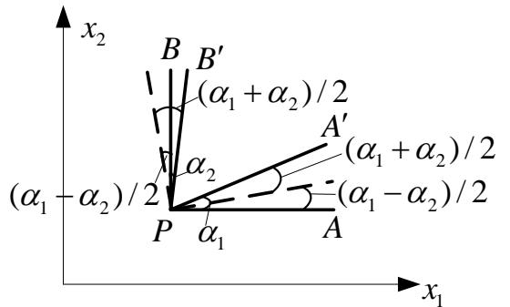

text_image

x₂
B B′
(α₁ + α₂)/2
A′
(α₁ - α₂)/2
P α₁ A
α₂
(α₁ + α₂)/2
(α₁ - α₂)/2
x₁

The above rotational movement can be regarded as a counterclockwise rotation of PAB (as a ridgid body) by an angle of $(\alpha1 - \alpha2)/2$ to the dashed line, after which PA rotates clockwise with an angle of $(\alpha1 + \alpha2)/2$ and PB rotates counterclockwise with an angle of $(\alpha1 + \alpha2)/2$ .

## 3.2 Deformation analysis 变形分析

## Physical meaning of rotation tensor

Shear deformation between PA and PB is

$$
\gamma_ {1 2} = \frac {\alpha_ {1} + \alpha_ {2}}{2} + \frac {\alpha_ {1} + \alpha_ {2}}{2} = \alpha_ {1} + \alpha_ {2} = \frac {\partial u _ {1}}{\partial x _ {2}} + \frac {\partial u _ {2}}{\partial x _ {1}}
$$

And the corresponding strain tensor is

$$
\varepsilon_ {1 2} = \frac {1}{2} \gamma_ {1 2} = \frac {1}{2} \left(\frac {\partial u _ {1}}{\partial x _ {2}} + \frac {\partial u _ {2}}{\partial x _ {1}}\right)
$$

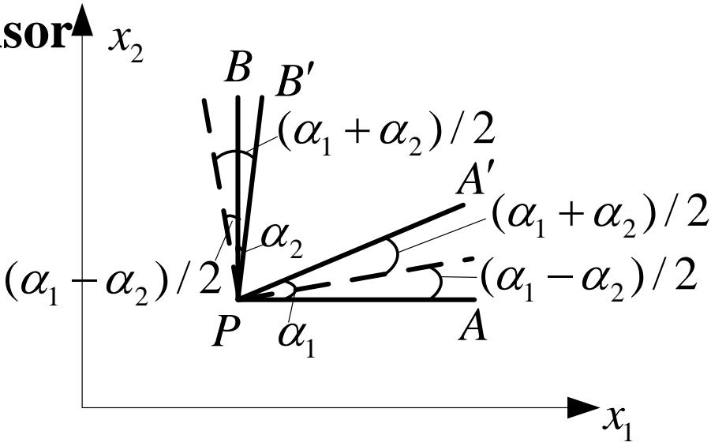

text_image

sor
x₂
B B′
(α₁ + α₂) / 2
A′
(α₁ - α₂) / 2
α₂
P α₁ A
(α₁ - α₂) / 2
x₁

Represent the rigid rotation of P by vector $\Omega$ according to the right-hand rule. the rotational angle about the x3 axis is:

$$
\Omega_ {3} = \frac {\alpha_ {1} - \alpha_ {2}}{2} = \frac {1}{2} \left(\frac {\partial u _ {1}}{\partial x _ {2}} - \frac {\partial u _ {2}}{\partial x _ {1}}\right) = \omega_ {1 2}
$$

The relationship between the rotation tensor and the rotation vector can be expressed by using permutation symbol.

$$
\Omega_ {k} = - \frac {1}{2} e _ {i j k} \omega_ {i j} \quad \text {或} \quad \omega_ {p q} = - e _ {p q k} \Omega_ {k}
$$

## 3.3 Constitutive relation 本构关系

Equilibrium equation and geometric equation can be deduced from the theory of mechanics and geometry as seen before.

These equations can only reflect the motion law and the continuity condition that are must be followed during the deformation process, but do not include any physical characteristics of the material. Hence the equations are applicable for any continuous body.

The purpose of elastic mechanics is to study the object's mechanical responses (including stress, strain...) induced by the external causes (including loads, temperature...). Obviously there equations are not adequate. More equations should be sought to link the stress, strain and temperature.

## 3.3 Constitutive relation 本构关系

Constitutive equation describes the material characters. So the stress-strain relationship is also a kind of constitutive equation as it describes the mechanical characteristics of material.

The law of thermodynamics is fundamental when studying the constitutive relation of the deformable body's mechanical characteristics, because the change and deformation of the object is actually a process of thermodynamics.

It is impossible to get a constitutive relation applicable to all kinds of continuum and working condition due to the complexity nature of material structure and the variety of deformation mechanism.

## 3.3 Constitutive relation 本构关系

Usually a basic framework is first established in terms of the law of thermodynamics and then the necessary characteristic constants of material can be determined through appropriate material tests, after which the applicable constitutive relation of a given material under a given working condition can be obtained.  
In this chapter we’ll introduce the constitutive relation of elastic material following this approach but only in isothermal or adiabatic process, which almost can describe the majority of engineering problems.

As mentioned before, during the shifting from one state to another, the external force does work and the object exchanges heats with the outside (absorb or emit) as well. Therefore the total energy of the object has changed and this process should obey the two thermodynamics basic laws.

## 3.3 Constitutive relation 本构关系

## Strain-energy function of ideal elastic body

## The first law of thermodynamics

The first law states that the change in the internal energy of a closed system is equal to the amount of heat supplied to the system, plus the amount of work done by the external forces in an infinitesimally small time interval.  
The total energy of the object includes its kinetic energy K and internal energy U. K is related to the mass and the velocity distribution while U depends on the state of deformation (strain) and the temperature (to be precisely, it is a functional).  
Define A the external work, Q the quantity of heat. We can obtain the following equation in terms of the first law of thermodynamics

$$
\mathrm{dA} + \mathrm{dQ} = \mathrm{dK} + \mathrm{dU}
$$

or $\mathrm{dU - dQ = dA - dK}$

Only the static problems are discussed for simplicity.  
dK=0, hence dU - dQ=dA

## 3.3 Constitutive relation 本构关系

## Strain-energy function of ideal elastic body

The first law of thermodynamics

Assume an external force is placed on the object and define the body force as $F_{i}$ and the surface force as $p_{i}$ . In an infinitesimally small time interval, the displacement of each point inside the object is dui, so the external force work is

$$
d A = \int_ {V} F _ {i} d u _ {i} d V + \int_ {S} p _ {i} d u _ {i} d S
$$

Substituting the stress boundary conditions into the equation above

$$
p _ {i} = \sigma_ {i j} l _ {j} (i = 1, 2, 3)
$$

Transform the surface integral into the volume integral by using the Gauss formula

$$
\begin{array}{l} d A = \int_ {V} F _ {i} d u _ {i} d V + \int_ {S} \sigma_ {i j} l _ {j} d u _ {i} d S \\ = \int_ {V} F _ {i} d u _ {i} d V + \int_ {V} \left(\sigma_ {i j} d u _ {i}\right) _ {, j} d V \\ \end{array}
$$

## 3.3 Constitutive relation 本构关系

## Strain-energy function of ideal elastic body

The first law of thermodynamics

Expand the formula as follows

$$
\begin{array}{l} d A = \int_ {V} F _ {i} d u _ {i} d V + \int_ {V} (\sigma_ {i j} d u _ {i}) _ {, j} d V \\ = \int_ {V} F _ {i} d u _ {i} d V + \int_ {V} \left(\sigma_ {i j, j} d u _ {i} + \sigma_ {i j} d u _ {i, j}\right) d V \\ = \int_ {V} \left(F _ {i} + \sigma_ {i j, j}\right) d u _ {i} d V + \int_ {V} \sigma_ {i j} \frac {1}{2} \left(d u _ {i, j} + d u _ {j, i}\right) d V \\ \end{array}
$$

According to the equilibrium equation and geometric equation we have

$$
d A = \int_ {V} \sigma_ {i j} d \varepsilon_ {i j} d V
$$

Thus

$$
d U - d Q = d A = \int_ {V} \sigma_ {i j} d \varepsilon_ {i j} d V
$$

## 3.3 Constitutive relation 本构关系

## Strain-energy function of ideal elastic body

## The second law of thermodynamics

The deformation process of the ideal elastic material we study is reversible.

During the thermal balance process from one state to another one, there is always one temperature T for. According to the second law of thermodynamics, the following equation is applicable for the reversible process.

$$
\mathrm{TdS} = \mathrm{dQ}
$$

where S is entropy related to the state of material

Substituting the equation from the last slide into the equation above then

$$
d U - T d S = \int_ {V} \sigma_ {i j} d \varepsilon_ {i j} d V
$$

We obtain the result in terms of the first and second law of thermodynamics for the deformation-reversible elastic materials. Now we'll prove that there exists a strain-energy function such elastic material, through which the stress-strain relationship can be determined.

## 3.3 Constitutive relation 本构关系

## Strain-energy function of ideal elastic body

## Free energies of thermodynamics

Deformation process is a thermodynamics process as mentioned.  
Except the strain $\varepsilon_{ij}$ , stress $\sigma_{ij}$ , temperature T, entropy S and internal energy U as the thermodynamic parameters to describe the deformation, the free energy F, which is expressed by U, T and S is also introduced.

$$
\mathrm{F} = \mathrm{U-ST}
$$

These are state parameters. It can be proved that only two of them are independent, from which all the other parameters can be deduced.

In another word, any parameter can be expressed by the two independent parameters. For example, U and F can be expressed as a function of strain and temperature.

Only in adiabatic and isothermal process, U of F can be expressed by the single-valued function.

## 3.3 Constitutive relation 本构关系

## Strain-energy function of ideal elastic body

## Adiabatic process

Fast loading (e.g. impact) can be regarded as an adiabatic process.  
Because the change occurs too fast to allow the thermal exchange between the object and the outside to happen, so dQ=0. Thus

$$
d U = \int_ {V} \sigma_ {i j} d \varepsilon_ {i j} d V
$$

The temperature will change slightly during the adiabatic process, so the stain will change accordingly. But under the assumption of small deformation, dQ is very small compared to the external force work dA, so the change of T can be ignored. Therefore the strain is only related to the stress.

## 3.3 Constitutive relation 本构关系

## Strain-energy function of ideal elastic body

## Isothermal process

If the loading is slow enough for the sufficient thermal exchange between the object and the outside during its deformation, the temperature will stay constant, which is called the isothermal process. In terms of the definition of free energy

$$
\mathrm{dF} = \mathrm{dU} - \mathrm{TdS} - \mathrm{SdT}
$$

Substituted into the equation below

$$
d U - T d S = \int_ {V} \sigma_ {i j} d \varepsilon_ {i j} d V
$$

And because dT=0 in isothermal process, thus

$$
d F = \int_ {V} \sigma_ {i j} d \varepsilon_ {i j} d V
$$

## 3.3 Constitutive relation 本构关系

## Strain-energy function of ideal elastic body

During the two processes mentioned before, as just proved, internal energy change dU and dF from one state to an adjacent one, can be considered to be caused only by the change of strain state of the ideal elastic body. So U and F can be expressed by the function only related to the strain.  
These two state functions can be generally called the strain-energy function. If let W be the stain energy of per unit volume, which is called the strain energy density (strain energy for short), then

$$
d \int_ {V} W d V = \int_ {V} d W d V = \int_ {V} \sigma_ {i j} d \varepsilon_ {i j} d V
$$

It should be pointed out that the different W values may exist for the same material during two processes, but is only due to the different elastic coefficient under two situations.  
When the deformation is small enough, stress-strain relationships are the same (both can be expressed in linear way). Experiments show very minor differences between the elastic coefficients and thus the constitutive relation of the material under these two processes at a certain temperature can be regarded the same.

## 3.3 Constitutive relation 本构关系

## Strain-energy function of ideal elastic body

The following equation holds valid for any ideal elastic body (in adiabatic or isothermal process), i.e. the integral region can be arbitrary

$$
d \int_ {V} W d V = \int_ {V} d W d V = \int_ {V} \sigma_ {i j} d \varepsilon_ {i j} d V
$$

So for any point in the volumn domain V, we have

$$
d W = \sigma_ {i j} d \varepsilon_ {i j}
$$

Because stain energy W is a single-valued function of the state of strain, which is independent on the deformation process, thus

$$
\sigma_ {i j} = \frac {\partial W}{\partial \varepsilon_ {i j}}
$$

So this equation gives the general rule of establishing the stress-strain relationship. The stress components equals to the partial derivative of stain energy to the according strain components. This conclusion is originally obtained by Green, which is later called the Green formula.

## 3.3 Constitutive relation 本构关系

## ◆ Constitutive relation of linear elastic material

Expand the strain energy W to the Taylor series at $\varepsilon_{ij}=0$ . When the strain components are very small under the assumption of small deformation ( $\varepsilon_{ij}<<1$ ), the third-order term of $\varepsilon_{ij}$ can be ignored, thus

$$
W = W (\varepsilon_ {i j}) = a _ {k l} \varepsilon_ {k l} + b _ {k l r s} \varepsilon_ {k l} \varepsilon_ {r s}
$$

And then

$$
\sigma_ {i j} = \frac {\partial W}{\partial \varepsilon_ {i j}} = a _ {k l} \frac {\partial \varepsilon_ {k l}}{\partial \varepsilon_ {i j}} + b _ {k l r s} \left(\frac {\partial \varepsilon_ {k l}}{\partial \varepsilon_ {i j}} \varepsilon_ {r s} + \frac {\partial \varepsilon_ {r s}}{\partial \varepsilon_ {i j}} \varepsilon_ {k l}\right)
$$

$$
= \delta_ {k i} \delta_ {l j} a _ {k l} + b _ {k l r s} \left(\delta_ {k i} \delta_ {l j} \varepsilon_ {r s} + \delta_ {r i} \delta_ {s j} \varepsilon_ {k l}\right)
$$

$$
= a _ {i j} + b _ {i j r s} \varepsilon_ {r s} + b _ {k l i j} \varepsilon_ {k l}
$$

$$
= a _ {i j} + \left(b _ {i j k l} + b _ {k l i j}\right) \varepsilon_ {k l}
$$

## 3.3 Constitutive relation 本构关系

## ◆ Constitutive relation of linear elastic material

When $\varepsilon_{ij}=0,\sigma_{ij}=0,a_{ij}=0$ 。  
Let

$$
c _ {i j k l} = b _ {k l i j} + b _ {i j k l}
$$

Then

$$
\sigma_ {i j} = c _ {i j k l} \varepsilon_ {k l}
$$

- $C_{ijkl}$ is the characteristic constant of the material, that usually changes with coordinate system and temperature.  
- $C_{ijkl}$ is a quartic tensor. A quartic tensor usually consists of 81 components. However it can be proved that $c_{ijkl}$ has 36 different values at most due to the symmetry about i, j, k and l.  
■ According to the definition, $c_{ijkl}$ is also symmetric about ij and kl.

$$
c _ {\mathrm{ijkl}} = c _ {\mathrm{klij}}
$$

So in the constitutive relation of linear elastic material, there are actually 21 mutually independent constants at most even in the most extreme anisotropy condition. The number of elastic constants can further decrease for the material with symmetry planes.

## 3.3 Constitutive relation 本构关系

## ◆ Constitutive relation of isotropic linear elastic material

Strain energy is only the function of the position of the point at a certain strain state, independent on the coordinate orientation. So the strain energy is a scalar function, or rather an invariant

The elastic coefficient of the isotropy linear elastic material is also invariant. So W is a quadratic homogeneous form of strain energy in terms of its expression.

$$
W = \int d W = \int_ {0} ^ {\varepsilon_ {i j}} \sigma_ {i j} d \varepsilon_ {i j} = \frac {1}{2} \sigma_ {i j} \varepsilon_ {i j} = \frac {1}{2} c _ {i j k l} \varepsilon_ {i j} \varepsilon_ {k l}
$$

Similar to the stress tensor, strain tensor has only 3 mutually independent invariants I $_{1}$ , I $_{2}$ and I $_{3}$ , which are respectively the homogeneous form of first, second and third order of the strain components.  
According to the conclusion of polynomial algebra, homogeneous form of higher degree can be expressed by the combination of lower ones. Thus the strain energy of isotropy linear elastic material can be

expressed as follows

$$
W = A I _ {1} ^ {2} + B I _ {2}
$$

A and B are the constants related to the elastic properties of the material.

## 3.3 Constitutive relation 本构关系

## ◆ Constitutive relation of isotropic linear elastic material

Now we'll replace A and B with two constants to clarify its mechanical meaning and express the strain invariants with engineering strain components. Thus W can be indicated as follows.

$$
\begin{array}{l} W = \left(\frac {\lambda}{2} + \mu\right) I _ {1} ^ {2} - 2 \mu I _ {2} \\ = \left(\frac {\lambda}{2} + \mu\right) \left(\varepsilon_ {x} + \varepsilon_ {y} + \varepsilon_ {z}\right) ^ {2} - 2 \mu \left[ \varepsilon_ {x} \varepsilon_ {y} + \varepsilon_ {z} \varepsilon_ {y} + \varepsilon_ {x} \varepsilon_ {z} - \frac {1}{4} \left(\gamma_ {x y} ^ {2} + \gamma_ {z x} ^ {2} + \gamma_ {y z} ^ {2}\right) \right] \\ \end{array}
$$

$\lambda$ and $\mu$ are called Lame elastic constants. From the analysis above it can be deduced that isotropy linear elastic material has only two mutually independent elastic constants.

The equation can be further simplified as

$$
W = \frac {\lambda}{2} \left(\varepsilon_ {x} + \varepsilon_ {y} + \varepsilon_ {z}\right) ^ {2} + \mu \left[ \varepsilon_ {x} ^ {2} + \varepsilon_ {y} ^ {2} + \varepsilon_ {z} ^ {2} + \frac {1}{2} \left(\gamma_ {x y} ^ {2} + \gamma_ {z x} ^ {2} + \gamma_ {y z} ^ {2}\right) \right]
$$

After the derivation of strain energy W to every engineering strain components according to the following equation

$$
\sigma_ {i j} = \frac {\partial W}{\partial \varepsilon_ {i j}}
$$

## 3.3 Constitutive relation 本构关系

## ◆ Constitutive relation of isotropic linear elastic material

The stress expressed with strain can be obtained according to the strain energy function above

$$
\left. \begin{array}{l l} \sigma_ {x} = \lambda e + 2 \mu \varepsilon_ {x} & \tau_ {x y} = \mu \gamma_ {x y} \\ \sigma_ {y} = \lambda e + 2 \mu \varepsilon_ {y} & \tau_ {y z} = \mu \gamma_ {y z} \\ \sigma_ {z} = \lambda e + 2 \mu \varepsilon_ {z} & \tau_ {x z} = \mu \gamma_ {x z} \end{array} \right\}
$$

Where

$$
e = \varepsilon_ {x} + \varepsilon_ {y} + \varepsilon_ {z} = \varepsilon_ {k k}
$$

is the volumetric strain.

It can be simplified as follows using index notation

$$
\sigma_ {i j} = \lambda e \delta_ {i j} + 2 \mu \varepsilon_ {i j}
$$

## 3.3 Constitutive relation 本构关系

## Hooke's law

The two elastic constants of isotropy elastic material can be determined through tests. However, the commonly used engineering elastic constants in elastic mechanics are E and v rather than $\lambda$ and $\mu$ .  
It has been proved that there are only two mutually independent elastic constants of isotropic elastic material. So we can confirm that there must be a certain relationship between these elastic constants.  
Now let's try to derivate it.

## 3.3 Constitutive relation 本构关系

## Hooke's law

Simple tensile test

In a simple tensile test

$$
\sigma_ {x} = \sigma \quad \sigma_ {y} = \sigma_ {z} = \tau_ {x y} = \tau_ {y z} = \tau_ {z x} = 0
$$

$$
\varepsilon_ {x} = \frac {\sigma}{E} \quad \varepsilon_ {y} = \varepsilon_ {z} = - \nu \frac {\sigma}{E} \quad \gamma_ {x y} = \gamma_ {y z} = \gamma_ {z x} = 0
$$

$$
e = \varepsilon_ {x} + \varepsilon_ {y} + \varepsilon_ {z} = \frac {\sigma}{E} (1 - 2 \nu)
$$

E is Young's modulus（杨氏模量），v is Poisson's ratio（泊松比）。

Substituting into the constitutive equation expressed by Lame constant

$$
\sigma_ {x} = \lambda e + 2 \mu \varepsilon_ {x} = \frac {\sigma}{E} [ \lambda (1 - 2 \nu) + 2 \mu ] = \sigma
$$

$$
\sigma_ {y} = \lambda e + 2 \mu \varepsilon_ {y} = \frac {\sigma}{E} [ \lambda (1 - 2 \nu) - 2 \mu \nu ] = 0 = \sigma_ {z}
$$

## 3.3 Constitutive relation 本构关系

## Hooke's law

## Therefore

Thus

$$
\left\{ \begin{array}{l} \lambda (1 - 2 \nu) + 2 \mu = E \\ \lambda (1 - 2 \nu) - 2 \mu \nu = 0 \end{array} \right.
$$

$$
\mu = \frac {E}{2 (1 + \nu)}
$$

$$
\lambda = \frac {E \nu}{(1 + \nu) (1 - 2 \nu)}
$$

The equation above reveals the relationship between Lame constants $\lambda$ , $\mu$ and the engineering elastic constants E, v.

## 3.3 Constitutive relation 本构关系

## Hooke's Law

## Simple shear test

Another elastic constant “shear modulus” G is also commonly used in engineering. As discussed before, G is not independent with a certain relationship with E and v.  
Simple shear test carried out by thin-walled cylinder torsion shows that

$$
\tau_ {x y} = \tau \quad \sigma_ {x} = \sigma_ {y} = \sigma_ {z} = \tau_ {y z} = \tau_ {z x} = 0
$$

$$
\gamma_ {x y} = \frac {\tau}{G} \quad \varepsilon_ {x} = \varepsilon_ {y} = \varepsilon_ {z} = \gamma_ {y z} = \gamma_ {z x} = 0
$$

$$
e = \varepsilon_ {x} + \varepsilon_ {y} + \varepsilon_ {z} = 0
$$

Substituted in a constitutive equation expressed by Lame constants

## 3.3 Constitutive relation 本构关系

## Hooke's law

## Simple shear test

Thus

$$
\left. \begin{array}{l l} \sigma_ {x} = \lambda e + 2 \mu \varepsilon_ {x} & \tau_ {x y} = \mu \gamma_ {x y} \\ \sigma_ {y} = \lambda e + 2 \mu \varepsilon_ {y} & \tau_ {y z} = \mu \gamma_ {y z} \\ \sigma_ {z} = \lambda e + 2 \mu \varepsilon_ {z} & \tau_ {x z} = \mu \gamma_ {x z} \end{array} \right\}
$$

The five equations highlighted hold valid obviously, with one equation left. Analyze the engineering shearing strain $\gamma_{xy}$ and we get

$$
G = \mu = \frac {E}{2 (1 + \nu)}
$$

It suggests the relationship between engineering elastic constants E, v and G, which also shows that Lame constant $\mu$ is the shear modulus G.

## 3.4 The differential equations of elastic mechanics

We’ve derived all the equations of elastic mechanics through the three chapters above. It is a group of generic equations. To have the solution, we also need to introduce additional condition such as the boundary conditions.

## Summary of this chapter

1. Fundamental equations, deduction process, applicability and accuracy.  
2. How to include the boundary conditions.  
3. Tensor is handy form of study the elasticity. However, transferring the tensor form into a matrix one is often necessary in FEM programming. That's why Voigt rule is introduced.  
4. In order to ease the derivation of FEM equations, the matrix operator is provided for the expression of fundamental equations based on the Voigt rule.  
5. Introduce how to directly derive the fundamental equations in other coordinate systems based on their Cartesian forms using matrix operators.

## 3.4 The differential equation of elastic mechanics

## Fundamental equations

Combining the equilibrium equations, geometric equations and constitutive equations together and then we can get a fundamental equation system, which can be expressed in tensor form.

Equilibrium equation

$$
\sigma_ {i j, j} + F _ {i} = 0
$$

Geometric equation

$$
\varepsilon_ {i j} = \frac {1}{2} \left(u _ {i, j} + u _ {j, i}\right)
$$

Constitutive equation

$$
\sigma_ {i j} = \lambda \delta_ {i j} e + 2 \mu \varepsilon_ {i j}
$$

where

$$
e = \varepsilon_ {1 1} + \varepsilon_ {2 2} + \varepsilon_ {3 3} = \varepsilon_ {k k}
$$

## 3.4 The differential equation of elastic mechanics

## Fundamental equations

We notice that the 15 equations above are all linear equations. So it is necessary to review the relationship between these equations and the basic hypotheses. That is to analyze how continuity, uniformity, isotropy, linear elasticity and small deformation hypotheses work in these equations.

All the equations above are based on an assumption that all the unknown functions or partial derivative are continuous function of the coordinate. That's why continuity hypothesis is indispensable for equilibrium equation, geometric equation and constitutive equation.  
It can be easily found out that uniformity, isotropy and linear elasticity have no influence on equilibrium and geometric equations, which means these two equation systems are applicable for those heterogenic and anisotropic materials as well as the materials that do not obey Hooke's law.  
Attention: Small deformation hypothesis is the assumption of equilibrium and geometric equations!

■ Only in small deformation system can we adopt the position before deformation instead of the one after deformation to derivate the equilibrium equation.  
■ Only in small deformation system can the geometric equation contain only the linear terms of the derivatives of displacements.

## 3.4 The differential equation of elastic mechanics

## Fundamental equations

As mentioned before, constitutive relationship have to be confirmed through tests. But it’s almost impossible to directly establish the relationship between 6 stress components and 6 strain components.  
Based on small deformation hypothesis, high order small terms can be ignored and the stress-strain linear relationship can be obtained. That is what we call linearly elastic hypothesis.  
Generally speaking, linear elastic has no significant relationship with small deformation. Sometimes the stress-strain relation can be linear even with large deformation. But usually it follows the linearly elastic law only on the assumption of small deformation.

Conclusion

<table><tr><td></td><td>Continuity</td><td>Uniformity</td><td>Isotropy</td><td>Linear elasticity</td><td>Small deformation</td></tr><tr><td>Equilibrium equation</td><td>√</td><td></td><td></td><td></td><td>√</td></tr><tr><td>Geometric equation</td><td>√</td><td></td><td></td><td></td><td>√</td></tr><tr><td>Constitutive equation</td><td>√</td><td>√</td><td>√</td><td>√</td><td>√</td></tr></table>

## 3.4 The differential equation of elastic mechanics

## ◆ Fundamental equations

Now let's discuss the accuracy of the equations.

Equilibrium equations are the application of Newton's laws in deformable body.  
The accuracy of the geometric equations will be pretty high if the actual strain of the body is small enough such as a thousandth level  
Accuracy of the constitutive equations largely depends on the elastic constants of the material. While the confirmation of the constants is closely related to the test, which means the constitutive equations have a lowest accuracy.

In general, if the material obeys Hooke's law accurately enough with a small deformation, then the 15 equations above will reflect the stress and deformation inside. Once a proper boundary condition is given, the stress, strain and displacement obtained will stay very close to the real solution of the problem.

## 3.4 The differential equation of elastic mechanics

## Boundary condition

The fundamental equations of elastic mechanics mentioned before only reflect the stress, strain and deformation inside elastic body.

To solve a specific problem, proper boundary equations must be given according to its boundary condition to complete the boundary value problem of differential equation with the fundamental ones. That's why boundary condition is no less important than the fundamental equations.

## Common boundary conditions can be divided into three kinds

Stress boundary condition  
▶ Displacement boundary condition  
Mixed boundary condition

## 3.4 The differential equation of elastic mechanics

## Boundary condition

## 1. Stress boundary condition

Stress boundary condition shows the surface force distribution, which means the three surface force components of every point on the project can be confirmed. It can be expressed in terms of Cauchy's stress equation.

$$
\sigma_ {i j} l _ {j} = \overline {{p}} _ {i}
$$

$\overline{p}_{i}$ is the given surface force component, a function of the coordinate on the boundary surface.

## 2. Displacement boundary condition

Displacement boundary condition shows the displacement of all the boundaries, reflecting the geometric constraints on the boundary. That means boundary displacement discontinuity is not allowed. Written in tensor form:

$$
u _ {i} = \overline {{u}} _ {i}
$$

$\overline{u}_i$ presents the displacement distribution law on the known boundary surface.

## 3.4 The differential equation of elastic mechanics

## Boundary condition

## 3. Mixed boundary condition

Mixed boundary condition contains two probabilities:

Give stress boundary condition of partial boundary ( $S_{\sigma}$ ), and displacement boundary condition for others ( $S_{u}$ ).

on $\mathrm{S}_{\sigma}$ $\sigma_{ij}l_j = \overline{p}_i$ （在 $\mathbf{S}_{\sigma}$ 上）

on $\mathrm{S_u}$ $u_{i} = \overline{u}_{i}$ （在 $\mathbf{S}_u$ 上）

Confirm surface force components for some directions of a certain point on the partial or whole boundary of a elastic object, and displacement components for the other directions.

It should be specially noticed that boundary condition cannot be proposed either too much or too little. For a space problem, every point on the boundary needs and only needs to be given the boundary conditions of three orthogonal directions. Surface force and displacement condition cannot be given to the same direction at the same time and vice versa.

Of course in practical engineering there are also some other kinds of boundary conditions, which we do not enumerate here.

## 3.4 The differential equation of elastic mechanics

## ◆ Elastic mechanics expressed by differential equations

Now we can complete the mathematical expression to solve the boundary problem of elastic mechanics differential equation

$$
\left. \begin{array}{c c c} {{\mathbf {i n V}}} & {{\sigma_ {i j, j} + F _ {i} = 0}} & {{(V \mathrm{内})}} \\ {{\mathbf {i n V}}} & {{\varepsilon_ {i j} = \frac {1}{2} \big (u _ {i, j} + u _ {j, i} \big)}} & {{(V \mathrm{内})}} \\ {{\mathbf {i n V}}} & {{\sigma_ {i j} = \mathbf {D} _ {i j k l} \varepsilon_ {k l}}} & {{(V \mathrm{内})}} \\ {{\mathbf {i n S _ {\sigma}}}} & {{\sigma_ {i j} l _ {j} = \overline {{{{p}}}} _ {i}}} & {{(\mathbf {S _ {\sigma}} \mathrm{内})}} \\ {{\mathbf {i n S _ {u}}}} & {{u _ {i} = \overline {{{{u}}}} _ {i}}} & {{(\mathbf {S _ {u}} \mathrm{内})}} \end{array} \right\}
$$

Where constitutive relationship is applicable to the most ordinary linear elastic object.

## 3.4 The differential equation of elastic mechanics

## Differential equations of elastic mechanics

Above is a complete and strict mathematical expression of elastic mechanics problems. And because it belongs to the boundary problems of partial differential equations, it is also called a differential equations of elastic mechanics.

It should be pointed out that in addition to the infinitesimal unit analysis, we can also adopt alternative method.

Establish a proper functional for the entire object, and then solve the problem by employing the extreme condition of the functional. This is the variational expression of elastic mechanics.

It can be proved that the Euler corresponds to the fundamental equations and boundary conditions of elastic mechanics problems, which means two methods give the same results in essence.

## 3.4 The differential equation of elastic mechanics

## Differential expression of elastic mechanics

The governing equations are generic, applicable to all problems.

Boundary condition can be obtained through specific problems. The problem can be solved only when the boundary condition is given.

So it's crucially important for engineers to be able to write correct boundary conditions of a given problem.

## 3.5 Supplementary

“Tensor” was originally introduced by Hamilton in 1846, but to represent what we now call “modulus”. The modern meaning of tensor came into use by Voigt in 1899.

“Absolute Differential” is a well-known article among the mathematicians. With the introduction of Einstein’s general relativity around 1915, tensor differential/integration became widely recognized. (General relativity is totally expressed in “tensor language)

Tensor possesses great advantage in the theoretical derivation, but may be less convenient in engineering applications. We can connect tensor with traditional vector of elastic mechanics by Voigt rule. Transforming the tensor of high-order free indexes into a low-order tensor form is called Voigt labeling, which obeys the Voigt rule. For example, second-order tensor is often rewritten into column matrix.

According to the traditional vector of elastic mechanics, we use the following customs:

■ Bolt fonts for tensor  
[ ] for matrix  
■ {} for column vector

Finally, the method of deriving fundamental equations in different coordinate systems by using the coordinate transformation operators is briefly introduced in this chapter.

## 3.5 Supplementary

## Voigt rule

Details of Voigt rule mainly depend on whether the tensor is a dynamic quantity (e.g. stress) or a kinematic one (e.g. strain).

Dynamic Voigt rule

$$
\text {Two dimension} \quad \boldsymbol {\sigma} = \left[\begin{array}{c c}\sigma_ {1 1}&\sigma_ {1 2}\\\sigma_ {2 1}&\sigma_ {2 2}\end{array}\right]\rightarrow \left\{\begin{array}{c}\sigma_ {1 1}\\\sigma_ {2 2}\\\sigma_ {1 2}\end{array}\right\} = \left\{\begin{array}{c}\sigma_ {x x}\\\sigma_ {y y}\\\tau_ {x y}\end{array}\right\} = \{\sigma \}
$$

Rule

<table><tr><td colspan="2"> $\sigma_{ij}$ </td><td> $\sigma_a$ </td></tr><tr><td>i</td><td>j</td><td>a</td></tr><tr><td>1</td><td>1</td><td>1</td></tr><tr><td>2</td><td>2</td><td>2</td></tr><tr><td>1</td><td>2</td><td>3</td></tr></table>

## 3.5 Supplementary

## Voigt rule

Dynamic Voigt rule

$$
\text {Three dimension} \quad \boldsymbol {\sigma} = \left[ \begin{array}{c c c} \sigma_ {1 1} & \sigma_ {1 2} & \sigma_ {1 3} \\ \sigma_ {2 1} & \sigma_ {2 2} & \sigma_ {2 3} \\ \sigma_ {3 1} & \sigma_ {3 2} & \sigma_ {3 3} \end{array} \right]
$$

$$
\rightarrow \left\{\begin{array}{l}\sigma_ {1 1}\\\sigma_ {2 2}\\\sigma_ {3 3}\\\sigma_ {2 3}\\\sigma_ {1 3}\\\sigma_ {1 2}\end{array}\right\} = \left\{\begin{array}{l}\sigma_ {x x}\\\sigma_ {y y}\\\sigma_ {z z}\\\sigma_ {y z}\\\sigma_ {z x}\\\sigma_ {x y}\end{array}\right\} = \{\sigma \}
$$

<table><tr><td colspan="2"> $\sigma_{ij}$ </td><td> $\sigma_a$ </td></tr><tr><td>i</td><td>j</td><td>a</td></tr><tr><td>1</td><td>1</td><td>1</td></tr><tr><td>2</td><td>2</td><td>2</td></tr><tr><td>3</td><td>3</td><td>3</td></tr><tr><td>2</td><td>3</td><td>4</td></tr><tr><td>1</td><td>3</td><td>5</td></tr><tr><td>1</td><td>2</td><td>6</td></tr></table>

The order of each element in the column matrix can be deduced in this way:

Draw a line down along the main diagonal of tensors, then turn up at the last column then return on first row

## 3.5 Supplementary

## Voigt rule

## Kinematic Voigt rule

The Voigt rule of second-order kinematic tensor can also be given in the form above. But shear strain, a component expressed by different indexes, have to double. So the Voigt rule for stain is

$$
\text {Two dimension} \quad \pmb {\varepsilon} = \left[\begin{array}{l l}\varepsilon_ {1 1}&\varepsilon_ {1 2}\\\varepsilon_ {2 1}&\varepsilon_ {2 2}\end{array}\right]\rightarrow \left\{\begin{array}{l}\varepsilon_ {1 1}\\\varepsilon_ {2 2}\\2 \varepsilon_ {1 2}\end{array}\right\} = \left\{\begin{array}{l}\varepsilon_ {x x}\\\varepsilon_ {y y}\\2 \varepsilon_ {x y}\end{array}\right\} = \{\pmb {\varepsilon} \}
$$

<table><tr><td colspan="2"> $\sigma_{ij}$ </td><td> $\sigma_a$ </td></tr><tr><td>i</td><td>j</td><td>a</td></tr><tr><td>1</td><td>1</td><td>1</td></tr><tr><td>2</td><td>2</td><td>2</td></tr><tr><td>1</td><td>2</td><td>3</td></tr></table>

## 3.5 Supplementary

## Voigt rule

Kinematic Voigt rule

$$
\text {Three dimension} \quad \pmb {\varepsilon} = \left[ \begin{array}{l l l} \varepsilon_ {1 1} & \varepsilon_ {1 2} & \varepsilon_ {1 3} \\ \varepsilon_ {2 1} & \varepsilon_ {2 2} & \varepsilon_ {2 3} \\ \varepsilon_ {3 1} & \varepsilon_ {3 2} & \varepsilon_ {3 3} \end{array} \right] \to \left\{ \begin{array}{l} \varepsilon_ {1 1} \\ \varepsilon_ {2 2} \\ \varepsilon_ {3 3} \\ 2 \varepsilon_ {2 3} \\ 2 \varepsilon_ {1 3} \\ 2 \varepsilon_ {1 2} \end{array} \right\} = \left\{ \begin{array}{l} \varepsilon_ {x x} \\ \varepsilon_ {y y} \\ \varepsilon_ {z z} \\ 2 \varepsilon_ {y z} \\ 2 \varepsilon_ {z x} \\ 2 \varepsilon_ {x y} \end{array} \right\} = \{\pmb {\varepsilon} \}
$$

Coefficient 2 for shear strain meets the needs of energy expression, where Voigt and index labeling equal to each other.

$$
d \varepsilon_ {i j} \sigma_ {i j} = \left\{d \pmb {\varepsilon} \right\} ^ {T} \left\{\pmb {\sigma} \right\}
$$

## 3.5 Supplementary

## Voigt rule

## High-order tensor

Voigt rule plays a very important role in program coding, when the complex fourth-order tensor needed to be changed into second-order matrix.

For example, linear elasticity law expressed by index notation contains fourth-order tensor. $\sigma_{1}-C_{1}\cdot\varepsilon$

$$
\sigma_ {i j} = C _ {i j k l} \varepsilon_ {k l}
$$

Its Voigt matrix form is $\{\sigma\} = [C]\{\varepsilon\}$

Where $a \rightarrow ij$ and $b \rightarrow kl$ , like the situation for 2 and 3 dimensions in the table above.

Take the Voigt matrix form of plane-stain elastic constitutive equation for example.

$$
\left[ \mathbf {C} \right] = \left[ \begin{array}{c c c} C _ {1 1} & C _ {1 2} & C _ {1 3} \\ C _ {2 1} & C _ {2 2} & C _ {2 3} \\ C _ {3 1} & C _ {3 2} & C _ {3 3} \end{array} \right] = \left[ \begin{array}{c c c} C _ {1 1 1 1} & C _ {1 1 2 2} & C _ {1 1 1 2} \\ C _ {2 2 1 1} & C _ {2 2 2 2} & C _ {2 2 1 2} \\ C _ {1 2 1 1} & C _ {1 2 2 2} & C _ {1 2 1 2} \end{array} \right]
$$

## 3.5 Supplementary

## Voigt rule

## High-order tensor

Pay attention to the tensor expression of $\sigma_{12}$ to prove the transformation above.

$$
\sigma_ {1 2} = C _ {1 2 1 1} \varepsilon_ {1 1} + C _ {1 2 1 2} \varepsilon_ {1 2} + C _ {1 2 2 1} \varepsilon_ {2 1} + C _ {1 2 2 2} \varepsilon_ {2 2}
$$

Adopt Voigt labeling method, it can be transformed into

$$
\sigma_ {3} = C _ {3 1} \varepsilon_ {1} + C _ {3 3} \varepsilon_ {3} + C _ {3 2} \varepsilon_ {2}
$$

Because

$$
\varepsilon_ {3} = \varepsilon_ {1 2} + \varepsilon_ {2 1} = 2 \varepsilon_ {1 2}
$$

And because of the symmetry of C, which means $C_{1212}=C_{1221}$ , it can be proved that the two equations above equal to each other.

## 3.5 Supplementary

## Matrix operators

Now we introduce a fundamental equation of elastic mechanics expressed by matrix operators to ease the discretization of finite element equation.

This is the matrix of the first order differential operator .

$$
[ \partial ] = \left[ \begin{array}{c c c c c c} \frac {\partial}{\partial x} & 0 & 0 & 0 & \frac {\partial}{\partial z} & \frac {\partial}{\partial y} \\ 0 & \frac {\partial}{\partial y} & 0 & \frac {\partial}{\partial z} & 0 & \frac {\partial}{\partial x} \\ 0 & 0 & \frac {\partial}{\partial z} & \frac {\partial}{\partial y} & \frac {\partial}{\partial x} & 0 \end{array} \right] ^ {T} = \left[ \begin{array}{c c c} \frac {\partial}{\partial x} & 0 & 0 \\ 0 & \frac {\partial}{\partial y} & 0 \\ 0 & 0 & \frac {\partial}{\partial z} \\ 0 & \frac {\partial}{\partial z} & \frac {\partial}{\partial y} \\ \frac {\partial}{\partial z} & 0 & \frac {\partial}{\partial x} \\ \frac {\partial}{\partial y} & \frac {\partial}{\partial x} & 0 \end{array} \right]
$$

## 3.5 Supplementary

## Matrix operators

The equilibrium equation can be written as

$$
\left[ \partial \right] ^ {T} \left\{\sigma \right\} + \left\{F \right\} = 0
$$

Geometric equation can be written as

$$
\left\{\varepsilon \right\} = \left[ \partial \right] \left\{u \right\}
$$

Constitutive equation is still written in Voigt labeling

$$
\left\{\sigma \right\} = \left[ C \right] \left\{\varepsilon \right\}
$$

## 3.5 Supplementary

## Fundamental equations in cylindrical coordinate system

Usually in a textbook of elastic mechanics, we analyze a proper infinitesimal unit cut out in a cylindrical coordinate system to obtain its fundamental equations just like in a rectangular coordinate system.  
This method has a very clear physical concept. However during the derivation, you have to be very cautious and reserve many useless high-order small terms which should have been ignored just in case that some essential ones are overlooked.  
Here introduced a method in terms of coordinate transformation. It is to shift all the coordinate, unknown functions and partial differential operators into a cylindrical coordinate form by coordinate transformation based on the fundamental equations obtained in a rectangular system. Then we can get the equilibrium equation in cylindrical system after calculation.

## 3.5 Supplementary

## ◆ Fundamental equations in cylindrical coordinate system Coordinate transformation

Transformation of coordinates can be expressed as follows

$$
\left\{ \begin{array}{l l} x = r \cos \theta & \text {Or its inverse} \\ y = r \sin \theta & \text {transformation} \\ z = z & \end{array} \right. \quad \left\{ \begin{array}{l l} \theta = \tan^ {- 1} (y / x) \\ r = \sqrt {x ^ {2} + y ^ {2}} \\ z = z \end{array} \right.
$$

Thus relationship between partial differential operators can be confirmed

$$
\left\{ \begin{array}{c} \frac {\partial r}{\partial x} = \frac {x}{\sqrt {x ^ {2} + y ^ {2}}} = \frac {x}{r} = \cos \theta \\ \frac {\partial r}{\partial y} = \frac {y}{\sqrt {x ^ {2} + y ^ {2}}} = \frac {y}{r} = \sin \theta \\ \frac {\partial \theta}{\partial x} = \frac {- y}{x ^ {2} + y ^ {2}} = \frac {- y}{r ^ {2}} = - \frac {\sin \theta}{r} \\ \frac {\partial \theta}{\partial y} = \frac {x}{x ^ {2} + y ^ {2}} = \frac {x}{r ^ {2}} = \frac {\cos \theta}{r} \end{array} \right.
$$

## 3.5 Supplementary

## ◆ Fundamental equations in cylindrical coordinate system coordinate transformation

Then

$$
\left\{ \begin{array}{l} \frac {\partial}{\partial x} = \frac {\partial}{\partial r} \frac {\partial r}{\partial x} + \frac {\partial}{\partial \theta} \frac {\partial \theta}{\partial x} = \cos \theta \frac {\partial}{\partial r} - \frac {\sin \theta}{r} \frac {\partial}{\partial \theta} \\ \frac {\partial}{\partial y} = \frac {\partial}{\partial r} \frac {\partial r}{\partial y} + \frac {\partial}{\partial \theta} \frac {\partial \theta}{\partial y} = \sin \theta \frac {\partial}{\partial r} + \frac {\cos \theta}{r} \frac {\partial}{\partial \theta} \end{array} \right.
$$

Combine the partial derivative in direction z, then we can get the matrix expression as follows

$$
\left\{ \begin{array}{l} \frac {\partial}{\partial x} \\ \frac {\partial}{\partial y} \\ \frac {\partial}{\partial z} \end{array} \right\} = \left[ \begin{array}{c c c} \cos \theta & - \sin \theta & 0 \\ \sin \theta & \cos \theta & 0 \\ 0 & 0 & 1 \end{array} \right] \left\{ \begin{array}{l} \frac {\partial}{\partial r} \\ \frac {1}{r} \frac {\partial}{\partial \theta} \\ \frac {\partial}{\partial z} \end{array} \right\}
$$

## 3.5 Supplementary

## ◆ Fundamental equations in cylindrical coordinate system

## Displacement transformation

Suppose the displacement vector is of a certain point in the elastic object. Then the relationship between the three components in rectangular and cylindrical coordinate system is

$$
\left\{ \begin{array}{c} u = u _ {r} \cos \theta - u _ {\theta} \sin \theta \\ v = u _ {r} \sin \theta + u _ {\theta} \cos \theta \\ w = u _ {z} \end{array} \right.
$$

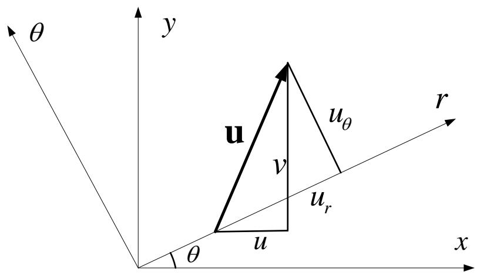

text_image

θ
y
u
v
uθ
uᵣ
r
θ
u
x

Expressed in matrix form, that is

$$
\left\{ \begin{array}{c} u \\ v \\ w \end{array} \right\} = \left[ \begin{array}{c c c} \cos \theta & - \sin \theta & 0 \\ \sin \theta & \cos \theta & 0 \\ 0 & 0 & 1 \end{array} \right] \left\{ \begin{array}{c} u _ {r} \\ u _ {\theta} \\ u _ {z} \end{array} \right\}
$$

## 3.5 Supplementary

## ◆ Fundamental equations in cylindrical coordinate system External force transformation

Similarly we can obtain the transformation relationship between external forces

$$
\left\{ \begin{array}{c} F _ {x} \\ F _ {y} \\ F _ {z} \end{array} \right\} = \left[ \begin{array}{c c c} \cos \theta & - \sin \theta & 0 \\ \sin \theta & \cos \theta & 0 \\ 0 & 0 & 1 \end{array} \right] \left\{ \begin{array}{c} F _ {r} \\ F _ {\theta} \\ F _ {z} \end{array} \right\}
$$

The reverse matrices in the equations above are all, that is

$$
\mathbf {L} = \left[ \begin{array}{c c c} l _ {1 1} & l _ {1 2} & l _ {1 3} \\ l _ {2 1} & l _ {2 2} & l _ {2 3} \\ l _ {3 1} & l _ {3 2} & l _ {3 3} \end{array} \right] = \left[ \begin{array}{c c c} \cos \theta & \sin \theta & 0 \\ - \sin \theta & \cos \theta & 0 \\ 0 & 0 & 1 \end{array} \right]
$$

## 3.5 Supplementary

## ◆ Fundamental equations in cylindrical coordinate system Equilibrium equations

In terms of the stress tensor rotation transformation, we can get

$$
\left[ \begin{array}{c c c} \sigma_ {x} & \tau_ {x y} & \tau_ {z x} \\ \tau_ {x y} & \sigma_ {y} & \tau_ {y z} \\ \tau_ {z x} & \tau_ {y z} & \sigma_ {z} \end{array} \right] = \left[ \begin{array}{c c c} \cos \theta & - \sin \theta & 0 \\ \sin \theta & \cos \theta & 0 \\ 0 & 0 & 1 \end{array} \right] \left[ \begin{array}{c c c} \sigma_ {r} & \tau_ {r \theta} & \tau_ {z r} \\ \tau_ {r \theta} & \sigma_ {\theta} & \tau_ {\theta z} \\ \tau_ {z r} & \tau_ {\theta z} & \sigma_ {z} \end{array} \right] \left[ \begin{array}{c c c} \cos \theta & \sin \theta & 0 \\ - \sin \theta & \cos \theta & 0 \\ 0 & 0 & 1 \end{array} \right]
$$

Expand and derivate the formula

$$
\left. \begin{array}{r} \sigma_ {x} = \sigma_ {r} \cos^ {2} \theta + \sigma_ {\theta} \sin^ {2} \theta - 2 \tau_ {r \theta} \sin \theta \cos \theta \\ \sigma_ {y} = \sigma_ {r} \sin^ {2} \theta + \sigma_ {\theta} \cos^ {2} \theta + 2 \tau_ {r \theta} \sin \theta \cos \theta \\ \sigma_ {z} = \sigma_ {z} \\ \tau_ {y z} = \tau_ {z r} \sin \theta + \tau_ {\theta z} \cos \theta \\ \tau_ {z x} = \tau_ {z r} \cos \theta - \tau_ {\theta z} \sin \theta \\ \tau_ {x y} = (\sigma_ {r} - \sigma_ {\theta}) \sin \theta \cos \theta + \tau_ {r \theta} (\cos^ {2} \theta - \sin^ {2} \theta) \\ \end{array} \right\}
$$

## 3.5 Supplementary

## ◆ Fundamental equations in cylindrical coordinate system Equilibrium equations

Substitute differential operator transformation, external force transformation and stress transformation obtained earlier into the first balance equation.

$$
\frac {\partial \sigma_ {x}}{\partial x} + \frac {\partial \tau_ {x y}}{\partial y} + \frac {\partial \tau_ {z x}}{\partial z} + F _ {x} = 0
$$

After a lengthy but easy calculation, we can get the following equations.(No high-order term is ignored in the process)

$$
\left(\frac {\partial \sigma_ {r}}{\partial r} + \frac {1}{r} \frac {\partial \tau_ {r \theta}}{\partial \theta} + \frac {\partial \tau_ {z r}}{\partial z} + \frac {\sigma_ {r} - \sigma_ {\theta}}{r} + F _ {r}\right) \cos \theta
$$

$$
- \left(\frac {\partial \tau_ {r \theta}}{\partial r} + \frac {1}{r} \frac {\partial \sigma_ {r}}{\partial \theta} + \frac {\partial \tau_ {z r}}{\partial z} + \frac {2 \tau_ {r \theta}}{r} + F _ {\theta}\right) \sin \theta = 0
$$

## 3.5 Supplementary

## ◆ Fundamental equations in cylindrical coordinate system Equilibrium equations

The equation above must be applicable for any $\theta$ . Therefore

$$
\frac {\partial \sigma_ {r}}{\partial r} + \frac {1}{r} \frac {\partial \tau_ {r \theta}}{\partial \theta} + \frac {\partial \tau_ {z r}}{\partial z} + \frac {\sigma_ {r} - \sigma_ {\theta}}{r} + F _ {r} = 0
$$

$$
\frac {\partial \tau_ {r \theta}}{\partial r} + \frac {1}{r} \frac {\partial \sigma_ {r}}{\partial \theta} + \frac {\partial \tau_ {z r}}{\partial z} + \frac {2 \tau_ {r \theta}}{r} + F _ {\theta} = 0
$$

Substitute differential operator transformation, external force transformation and stress transformation into the second equation, then we can get the same conclusion

$$
\frac {\partial \tau_ {x y}}{\partial x} + \frac {\partial \sigma_ {y}}{\partial y} + \frac {\partial \tau_ {y z}}{\partial z} + F _ {y} = 0
$$

## 3.5 Supplementary

## ◆ Fundamental equations in cylindrical coordinate system Equilibrium equations

Substitute differential operator transformation, external force transformation and stress transformation into the third equilibrium equation.

$$
\frac {\partial \tau_ {z x}}{\partial x} + \frac {\partial \tau_ {y z}}{\partial y} + \frac {\partial \sigma_ {z}}{\partial z} + F _ {z} = 0
$$

Thus

$$
\frac {\partial \tau_ {z r}}{\partial r} + \frac {1}{r} \frac {\partial \tau_ {z \theta}}{\partial \theta} + \frac {\partial \sigma_ {z}}{\partial z} + \frac {\tau_ {z r}}{r} + F _ {z} = 0
$$

Then we can get the equilibrium equations in cylindrical coordinate system.

## 3.5 Supplementary

## ◆ Fundamental equations in cylindrical coordinate system geometric equation

Use the rotation transformation formula of strain tensor similarly to stress.

$$
\left. \begin{array}{r} \varepsilon_ {x} = \varepsilon_ {r} \cos^ {2} \theta + \varepsilon_ {\theta} \sin^ {2} \theta - 2 \gamma_ {r \theta} \sin \theta \cos \theta \\ \varepsilon_ {y} = \varepsilon_ {r} \sin^ {2} \theta + \varepsilon_ {\theta} \cos^ {2} \theta + 2 \gamma_ {r \theta} \sin \theta \cos \theta \\ \varepsilon_ {z} = \varepsilon_ {z} \\ \gamma_ {y z} = \gamma_ {z r} \sin \theta + \gamma_ {\theta z} \cos \theta \\ \gamma_ {z x} = \gamma_ {z r} \cos \theta - \gamma_ {\theta z} \sin \theta \\ \tau_ {x y} = (\varepsilon_ {r} - \varepsilon_ {\theta}) \sin \theta \cos \theta + \gamma_ {r \theta} (\cos^ {2} \theta - \sin^ {2} \theta) \\ \end{array} \right\}
$$

## 3.5 Supplementary

## ◆ Fundamental equations in cylindrical coordinate system geometric equation

Use the displacement and operator transformation, we can get

$$
\varepsilon_ {x} = \frac {\partial u}{\partial x} = \frac {\partial}{\partial x} (u _ {r} \cos \theta - u _ {\theta} \sin \theta) = (\cos \theta \frac {\partial}{\partial r} - \frac {\sin \theta}{r} \frac {\partial}{\partial \theta}) (u _ {r} \cos \theta - u _ {\theta} \sin \theta)
$$

$$
= \cos^ {2} \theta \frac {\partial u _ {r}}{\partial r} + \sin^ {2} \theta \left(\frac {1}{r} \frac {\partial u _ {\theta}}{\partial \theta} + \frac {u _ {r}}{r}\right) - \cos \theta \sin \theta \left(\frac {1}{r} \frac {\partial u _ {r}}{\partial \theta} + \frac {\partial u _ {\theta}}{\partial \theta} - \frac {u _ {\theta}}{r}\right)
$$

Compared to the strain transformation that

$$
\varepsilon_ {r} = \frac {\partial u _ {r}}{\partial r}
$$

$$
\varepsilon_ {\theta} = \frac {1}{r} \frac {\partial u _ {\theta}}{\partial \theta} + \frac {u _ {r}}{r}
$$

$$
\gamma_ {r \theta} = \frac {1}{r} \frac {\partial u _ {r}}{\partial \theta} + \frac {\partial u _ {\theta}}{\partial \theta} - \frac {u _ {\theta}}{r}
$$

## 3.5 Supplementary

## ◆ Fundamental equations in cylindrical coordinate system geometric equation

Derivate other strain components to obtain all the geometric equation in cylindrical coordinate system. (You can have a try on your own)

Think: How to obtain fundamental equations in spherical coordinate system by coordinate transformation  
Tip: Spherical coordinate system can be regarded as two cylindrical coordinate transformations.

## 3.6 Conclusions

## Conclusions

Establishing and solving boundary problems of elastic mechanics constitute the key of the elastic theory. The boundary problem turns a specific physical problem into a mathematical one.

Boundary problem of elastic mechanics is the common effort of numerous engineers, mechanists, physicists and mathematicians in nearly a century. For the moment, elastic mechanics is one of the most successful areas in mathematics and physics, the basic framework of which has become the basic mode of many physical theory.

The task of solving elastic mechanics boundary problems is to solve 15 unknown quantities to satisfy 15 equations and 3 boundary conditions.

## 3.6 Conclusion

## Conclusion

There are many boundary problems of elastic mechanics raised in engineering practice. The solutions can be roughly divided into three kinds

Analytical method Mainly use mathematical method like partial differential equations, complex functions, integral equations, group theory, differential geometry and functional analysis to solve the boundary problems.  
Experimental method Methods like electrometry, photoelasticity, analogy, Moire technique, Mmoire interferometry, speckle interferometry, infrared scintigraphy and holography.  
Numerical analysis method There are direct, difference, finite element, boundary element and element-free methods.

Finite element analysis is the most important and practical one and has been widely used in scientific research as well as engineering calculations.  
In order to understand finite element analysis thoroughly, we'll move on to the basic concept and theory of classical variational method.

谢谢！

Thanks!