## Chapter 2

## Theoretical Basis of Finite Element

## Contents

1 Introduction  
2 The direct method of variation problem  
3 The method of weighted residuals  
4 The method of finite element  
5 Conclusion

## I. Introduction

## Introduction

The finite element method is a numerical approximation method of mathematical physics problems by computer analysis.

It originated from solid mechanics and rapidly developed to other physical fields such like hydromechanics, heat transfer theory, electromagnetics and acoustics.

The fundamental idea of finite element method is to divide the continuous body into many finite elements and than reassemble them, which means the analysis of the original continuous body can be transformed into the analysis of the newly assembled object of these finite elements.

One can understand the finite element method in three approaches:

Structural matrix method  
Variational method  
Method of weighted residuals

The whole calculation process of finite element method is conducted automatically by a computer program. It has very strong generality. All you need to do is to change the inputs according to the different practical engineering problems.

This method totally changed the limitation of analytical solution.

## Introduction

The main task of engineering design is to analyze the structural strength, stiffness and stability using the theory of solid mechanics including structural mechanics, elastic mechanics and plastic mechanics.

As mentioned before, with the development of science and technology the geometrical shapes and loading conditions of the engineering structures are becoming increasingly complicated. This has been exacerbated by the emergency of new materials which makes it difficult or even impossible for solving the analytical solutions of structural analysis.

So people turned to seek its approximate solutions.

In 1908 Ritz proposed an approximate method using trial functions with unknown quantities to approximate the energy functional that is to obtain the equations of unknown quantities by solving their minimum of energy.

The method of Ritz largely promoted the application of elastic mechanics in engineering. But its limitation is that the trial function must satisfy the boundary conditions, which can be quite difficult for a structure with complicated geometrical shape.

Courant extended the method of Ritz in 1943. He divided the entire cross section into several triangle regions when solving the torsion problem and assumed the approximate uniform distribution of the warping function in each triangle region to overcome the difficulty of the Ritz method that demands the entire approximate functions satisfy all the boundary conditions.

It is quite similar to the idea of finite element method in the early stage. But it demanded too much numerical calculation for further development.

# Introduction

The line structural system first adopted the computer for numerical calculation since its birth in 1946.

Its theoretical basis is the matrix displacement method and matrix force method, which can be called the method of structural matrix, derived from the displacement method and force method of structural mechanics. It adopts the matrix algebra for simpler expression of equations and facilitates the computational program.

The mechanics concept of structural matrix is pretty clear and all the theoretical formulas have very accurate meaning of structural mechanics. The rounding errors occur only in the process of numerical calculation due to the computer limitation of the storage digits of real numbers.

Turner, Clough, Martin and Topp introduced a new calculation method to solve the plane stress problem evolved from the matrix displacement method in the annual conference of Aviation Institute in 1956. They divided the structure into several triangle and rectangle elements and solve the element stiffness matrix between the force and displacement of the nodes using the approximate displacement function of the element.  
At the same time, Argyris published several papers of energy theory and structure analysis. He unified the fundamental energy principles of elastic structures, developed the matrix method and derived the element stiffness matrix of the rectangular grating composed of a plane stress plate and four edge members.  
Clough for the first time introduced the term “FEM” in the paper “The finite element method in plane stress analysis” in 1960 since when the finite element method has become an standard method to discretize the continuous body.  
However in the early stage people only relied on the intuitive concepts without sufficient theoretical basis. So the application was sometimes not successful due to the limitation of the practical problems it could solve.

## Introduction

People gradually realized that the finite element method was actually a transformatin of the Ritz method of variation principle after the work of Besseling, Melosh, Jones and Gallagher in 1963 and then developed the methods to derive the calculation formulas of finite element from different variation principles.  
In 1965, Zienkiewicz and Y.K.Cheung discovered that all the field problems can be solved by the same procedures as the finite element method of solid mechanics if they can be transformed into the form of variation when solving the Laplace and Poisson equations and then published the first book of finite element in 1967.  
However the formulae of finite element method are not necessarily based on the variation principle. In 1969 Szabo and G.C.Lee noticed that one can solve the non-structural problems in standard procedures of finite element by the weighted residual method especially the Galerkin one.  
At the same time the mathematical basis of the finite element method attracted great attentions: the numerical method to solve large-scale linear equations and the method to solve the matrix eigenvalues were developed, techniques of substructures and modal synthesis were applied and the convergence of finite element method as well as the error analysis was being studied.  
The functions of computer is becoming increasingly stronger and the finite element method is gaining greater attentions. Many universities, research institutes and software companies have received a lot of financial aids from various industrial sectors (eg. Aviation, astronavigation, civil engineering, shipbuilding and automobiles) and develop many general programs of finite element, which has contribute to the theoretical research and practical applications.

# Introduction

Hundreds of general programs of finite element for large-scale structures have been developed since the early 1980s, of which the most well known ones are:

NASTRAN  
MARC  
SAP—NONSAP  
ADINA  
ANSYS  
ABAQUS  
■ ....

The list is in no particular order.

Chinese researchers of mechanics also made great contributions to the early development of finite element method:

■ 陈伯屏：method of structural matrix  
■ 钱令希: theory of the complementary potential energy  
■ 钱伟长、胡海昌：theory of generalized variation  
■ 冯康: theory of finite element method  
■ ....

The list is in no particular order.

The concept will be very clear if derived by using the variation principle in the field of solid mechanics. So we'll first explain the methods in a mathematical way and then introduce their applications in mechanic field.

## II. The direct method of variation problem

## 2.1 Brief introduction

We have discussed the extremum problems of functional in detail and established the variation method of mechanical problems. However we all stop at the Euler equations of functional.

We have to solve the Euler equations when dealing with the practical problems but unfortunately it’s usually very difficult to get the analytical solutions.

So here comes the direct method of variation problems. People usually transform the differential problem into a variation one due to its convenience.

To mechanics problems, establishing the corresponding functional and solve its extremum problem is only one way to solve it. The following example shows another way of establishing the proper functional.

## 2.1 Brief introductions

## From the differential equations to the variation equations

One can use the trial-and-error method to establish the corresponding functional to solve the normal differential equations. Refer to the relevant mathematical manuals for the functional forms for the common problems.

For the boundary problems of the following ordinary differential equation (L is the operator)

$$
\left\{ \begin{array}{c} \mathbf {L} u = - \frac {d}{d x} \Bigg (P (x) \frac {d u}{d x} \Bigg) + r (x) u (x) = f (x) \\ u (a) = u (b) = 0 \end{array} \right.
$$

And $P(x)\in C^{1}[a,b],\quad r(x)\in C[a,b]$

$P(x) > 0, \quad r(x) \geq 0, \quad r(x)$ 不恒为零

It equals to the extremum problem of the functional

$$
Q [ u (x) ] = \int_ {a} ^ {b} [ - (P (x) u ^ {\prime} (x)) ^ {\prime} u (x) + r (x) u ^ {2} (x) - 2 f (x) u (x) ] d x
$$

Now let's prove the validity of this equivalency.

## 2.1 Brief introductions

## Prove:

1) If $u_{0}(x)$ is the solution to the differential equation then it must make the functional $Q[u(x)]$ get its minimum.

That is for any $y(x)$ , we have $Q[y(x)] > Q[u_{0}(x)]$

Denote the set of all the functions with continuous second-order derivative in $[a,b]$ and two endpoints of zero as

$$
C _ {0} ^ {2} [ a, b ] = \{f (x) | f (x) \in C ^ {2} [ a, b ], f (a) = f (b) = 0 \}
$$

For an arbitrary $W(x)$ inside we have

So $V = u_{0} + W\in C_{0}^{2}[a,b]$

$$
\begin{array}{l} Q [ V ] = \int_ {a} ^ {b} \left[ - (P V ^ {\prime}) ^ {\prime} V + r V ^ {2} - 2 f V \right] d x \\ = - \left. P V ^ {\prime} V \right| _ {a} ^ {b} + \int_ {a} ^ {b} [ P (V ^ {\prime}) ^ {2} ] d x + \int_ {a} ^ {b} [ r V ^ {2} - 2 f V ] d x \\ \end{array}
$$

Because $V(a) = V(b) = 0$ , the equation can be written as

$Q[V] = \int_{a}^{b}[P(V')^{2} + rV^{2} - 2fV]dx\text{Consider} V(x) = u_{0}(x) + W(x)$

## 2.1 Brief introductions

## Prove: We have

$$
\begin{array}{l} Q [ V (x) ] = Q [ u _ {0} (x) + W (x) ] = \int_ {a} ^ {b} [ P (u _ {0} ^ {\prime} + W ^ {\prime}) ^ {2} + r (u _ {0} + W) ^ {2} - 2 f (u _ {0} + W) ] d x \\ = \int_ {a} ^ {b} [ P u _ {0} ^ {\prime 2} + r u _ {0} ^ {2} - 2 f u _ {0} ] d x + 2 \int_ {a} ^ {b} [ P u _ {0} ^ {\prime} W ^ {\prime} + r u _ {0} W ] d x - 2 \int_ {a} ^ {b} f W d x + \int_ {a} ^ {b} [ P W ^ {\prime 2} + r W ^ {2} ] d x \\ \end{array}
$$

According to the formula of integration by parts, the second term can be written as

$$
\int_ {a} ^ {b} \left[ P u _ {0} ^ {\prime} W ^ {\prime} + r u _ {0} W \right] d x = \left. P u _ {0} ^ {\prime} W \right| _ {a} ^ {b} - \int_ {a} ^ {b} \left(P u _ {0} ^ {\prime}\right) ^ {\prime} W d x + \int_ {a} ^ {b} r u _ {0} W d x
$$

$$
= \int_ {a} ^ {b} \left[ - \left(P u _ {0} ^ {\prime}\right) ^ {\prime} + r u _ {0} \right] W d x = \int_ {a} ^ {b} f W d x
$$

So $Q[V(x)] = \int_{a}^{b}[Pu_0^{\prime 2} + ru_0^2 -2fu_0]dx + \int_{a}^{b}[PW^{\prime 2} + rW^{2}]dx$

$$
= Q \left[ u _ {0} (x) \right] + \int_ {a} ^ {b} \left[ P W ^ {\prime 2} + r W ^ {2} \right] d x = Q \left[ u _ {0} + W \right]
$$

The equation above holds apparently for any

$$
W (x) \in C _ {0} ^ {2} [ a, b ]
$$

## 2.1 Brief introductions

## Prove:

Notice that $P(x)$ and $r(x)$ are not negative. So when $W(x)$ is not identically equivalent to zero, we have

$$
\int_ {a} ^ {b} [ P (x) W ^ {\prime 2} (x) + r (x) W ^ {2} (x) ] d x > 0
$$

which can be proved by the following proof by contradiction.

If the integral above equals to zero, the integrand equals to zero. That is

$$
P (x) W ^ {\prime 2} (x) + r (x) W ^ {2} (x) \equiv 0 \Rightarrow P (x) W ^ {\prime 2} (x) \equiv 0 \Rightarrow W ^ {\prime 2} (x) \equiv 0
$$

$W(x)$ is a constant, so

$$
W ^ {\prime} (x) \equiv 0 \Rightarrow W (x) \equiv C
$$

Due to the continuity of the function we have

$$
W (a) = W (b) = 0 \Rightarrow W (x) \equiv 0
$$

which means once $\mathrm{V}(x)$ doesn't identically equal to $u_0(x)$ we have

$$
Q [ V (x) ] = Q [ u _ {0} (x) ] + \int_ {a} ^ {b} [ P W ^ {\prime 2} + r W ^ {2} ] d x > Q [ u _ {0} (x) ]
$$

So the functional $Q[u(x)]$ gets its minimum at the solution $u_{0}(x)$ of the differential equation.

## 2.1 Brief introductions

## Prove:

2) If the functional $\mathrm{Q}[u(x)]$ reaches its minimum at $u_0(x)$ then $u_0(x)$ is the solution of the differential equations.

If the arbitrary $W(x) \in C_0^2[a, b]$ doesn't identically equivalent to zero, then for any real number $\lambda$ we have

$$
\begin{array}{l} Q \left[ u _ {0} (x) + \lambda W (x) \right] = Q \left[ u _ {0} (x) \right] + \int_ {a} ^ {b} \left[ P \left(\lambda W ^ {\prime}\right) ^ {2} + r (\lambda W) ^ {2} \right] d x \\ + 2 \int_ {a} ^ {b} \left[ P u _ {0} ^ {\prime} (\lambda W ^ {\prime}) + r u _ {0} (\lambda W) - f (\lambda W) \right] d x \geq Q [ u _ {0} (x) ] \\ \end{array}
$$

When $W(x)$ and $u_{0}(x)$ are fixed, the red part of the equation can be regarded as the function $\varphi(\lambda)$ , so

$$
\phi (\lambda) = \lambda^ {2} \int_ {a} ^ {b} [ P W ^ {\prime 2} + r W ^ {2} ] d x + 2 \lambda \int_ {a} ^ {b} [ P u _ {0} ^ {\prime} W ^ {\prime} + r u _ {0} W - f W ] d x \geq 0
$$

Consider the conclusion of the quadratic trinomial

$$
A \lambda^ {2} + B \lambda + C \geq 0 \Rightarrow \Delta = B ^ {2} - 4 A C \leq 0
$$

C=0, so we have B=0. That is

Integrate by parts

$$
\int_ {a} ^ {b} [ P u _ {0} ^ {\prime} W ^ {\prime} + r u _ {0} W - f W ] d x = 0
$$

## 2.1 Brief introductions

## Prove:

According to the formula of integration by parts we have

$$
\int_ {a} ^ {b} [ - (P u _ {0} ^ {\prime}) ^ {\prime} + r u _ {0} - f ] W d x = 0
$$

which holds for any $W(x)\in C_0^2 [a,b]$

Similar to the preliminary theory of variation we have

$$
- \left(P u _ {0} ^ {\prime}\right) ^ {\prime} + r u _ {0} - f \equiv 0
$$

where $u_{0}(x)$ is the solution of the differential equation.

## Conclusion:

The necessary and sufficient condition of u0(x) being the solution of the differential equation is that the functional Q[u(x)] gets its minimum at $u_{0}(x)$ , which means the extremum problem of the functional and the problem of differential equations are equivalent.

Now let's discuss the direct method of variation problem.

## 2.1 Brief introductions

## The direct method of variation problem

Euler adopted the “finite difference method” when first studying the variation problem, which is a very important direct method. So Euler is the founder of the direct method of variation problems.

Now let's first discuss the finite difference method of Euler for further understanding of other approximate method.

For the differential equations written in the form of operator

$$
\mathbf {T} \mathbf {y} (x) = f (x)
$$

Suppose its corresponding variation method is: solve the function that can make the following functional get its extremum.

$$
Q [ y (x) ] = \int_ {a} ^ {b} F (x, y, y ^ {\prime}) d x
$$

The boundary condition is

$$
y (a) = y _ {a}, \quad y (b) = y _ {b}
$$

The main procedures of the Euler finite difference method is:

## 2.1 Brief introductions

## The direct method of variation problem

(1) Divide the interval $[a,b]$ into $n + 1$ equal portions and the diversion points are

$$
x _ {0} = a, x _ {1}, \dots , x _ {n}, x _ {n + 1} = b
$$

Let $y=f(x)$ be the polyline through the points $(a,y_{a}),\ldots,(x_{i},y_{i}),\ldots,(b,y_{b})$ and $y_{i}$ is undetermined except the boundary.

(2) Replace the derivative by the difference quotient in the interval $(x_{i}, x_{i+1})$

$$
y ^ {\prime} = \frac {y _ {i + 1} - y _ {i}}{\Delta x}
$$

(3) So the functional $Q[y(x)]$ is actually the function of $y_{1}, \ldots, y_{n}$ . That is

$$
Q [ y (x) ] = \int_ {a} ^ {b} F (x, y, y ^ {\prime}) d x \approx \sum_ {i = 0} ^ {n} F (x _ {i}, y _ {i}, \frac {y _ {i + 1} - y _ {i}}{\Delta x}) \Delta x _ {i} = \Phi (y _ {1}, \dots , y _ {n})
$$

(4) Select the value of $y_{1}, \ldots, y_{n}$ to make the function $\Phi$ get its extremum. According to the extremum of the multivariate function we have

$$
\frac {\partial \Phi}{\partial y _ {1}} = 0, \frac {\partial \Phi}{\partial y _ {2}} = 0, \dots , \frac {\partial \Phi}{\partial y _ {n}} = 0
$$

So $y_{1}, \ldots, y_{n}$ can be determined by the equations above.

## 2.1 Brief introductions

## The direct method of variation problem

For any value of interval we can get an approximate curve.

When the number of section increase $(n \to \infty)$ we can obtain a series of curves or functions:

$$
\left\{f _ {1} (x), f _ {2} (x), \dots , f _ {m} (x), \dots \right\}
$$

The more the sections are, the closer the curve can approach to the real function.

The real solution makes the functional get its minimum so the functional decreases with the increase of n. That's why it's called the minimizing sequence of the functional.

Definition: The sequences that satisfy the following conditions can be called the minimizing sequences of the functional.

$$
Q [ u _ {n} ] \rightarrow \min Q [ u ] \quad n \rightarrow \infty
$$

Theorem: If the differential operator T is positively definite, then any minimal sequence of the corresponding functional converges to the solution of its Euler equation.

$$
\mathbf {T} u = f \Leftrightarrow Q [ y (x) ] = \int_ {a} ^ {b} F (x, y, y ^ {\prime}) d x
$$

## 2.2 The method of Ritz

## Review

From the discussion above we can confirm that the differential problems can be transformed into the variational ones.

Now let's explain it in a mathematical way (but not precise).

For a differential equation

$$
\mathbf {L} u = f
$$

L is the differential operator of the function space H. u is a undetermined function and f is given.

L is defined as

$$
\mathbf {L} u = - \frac {d}{d x} (P (x) u ^ {\prime} (x)) + r (x) u (x)
$$

The operator L is linear so

$$
\mathbf {L} (c _ {1} u _ {1} + c _ {2} u _ {2}) = c _ {1} \mathbf {L} (u _ {1}) + c _ {2} \mathbf {L} (u _ {2})
$$

Please prove it on your own.

## 2.2 The method of Ritz

## Review

To simplify the writing we denote the integral as

$$
\int_ {a} ^ {b} f (x) g (x) d x = (f, g)
$$

and call it the inner product of the function f and g.

The corresponding functional is

$$
Q [ u (x) ] = \int_ {a} ^ {b} [ - (P u ^ {\prime}) ^ {\prime} u + r u ^ {2} - 2 f u ] d x = \int_ {a} ^ {b} u [ - (P u ^ {\prime}) ^ {\prime} + r u ] d x - 2 \int_ {a} ^ {b} f u d x
$$

which can be written as

$$
Q [ u (x) ] = (\mathbf {L} u, u) - 2 (f, u)
$$

It's easy to prove that the inner product defined here has the following

properties

$$
(f, c _ {1} g _ {1} + c _ {2} g _ {2}) = c _ {1} (f, g _ {1}) + c _ {2} (f, g _ {2})
$$

$$
\left(c _ {1} f _ {1} + c _ {2} f _ {2}, g\right) = c _ {1} \left(f _ {1}, g\right) + c _ {2} \left(f _ {2}, g\right)
$$

Now we'll discuss the Ritz method of variational problems. That is how to establish the minimizing sequence by the method of Ritz.

Apparently L is only a special case. So we'll change it to T for practical problems.

## 2.2 The method of Ritz

(1) Transform the problem of differential equations into the variational one by the variational principle

$$
\mathbf {T} u = f \Leftrightarrow Q [ u ] = (T u, u) - 2 (f, u) = \min
$$

(2) Transform the variation problem of infinite dimensional function space into the approximate extremum problem of the multivariable function after establishing the minimizing sequence. That is to choose the linear independent functions $\{\varphi_1, \varphi_2, \dots, \varphi_n\}$ as the basis functions in H to form a nth dimensional subspace

$$
\mathrm{H} _ {\mathrm{n}} = \operatorname{span} \left\{\phi_ {1}, \phi_ {2}, \dots , \phi_ {\mathrm{n}} \right\}
$$

For any arbitrary element inside we have

$$
u _ {n} = \sum_ {i = 1} ^ {n} a _ {i} \phi_ {i}
$$

when $n=1,2,3,\ldots$ , which means the subspace is expanding, $u_{n}$ approaches to the minimizing sequence of the functional.

(3) Substitute $u_{n}$ into the expression of the functional

$$
Q [ u ] \approx Q [ u _ {n} ] = (\mathbf {T} u _ {n}, u _ {n}) - 2 (f, u _ {n}) = (\mathbf {T} \sum_ {i = 1} ^ {n} a _ {i} \phi_ {i}, \sum_ {i = 1} ^ {n} a _ {i} \phi_ {i}) - 2 (f, \sum_ {i = 1} ^ {n} a _ {i} \phi_ {i})
$$

$$
= \sum_ {i, j = 1} ^ {n} a _ {i} a _ {j} (\mathbf {T} \phi_ {i}, \phi_ {j}) - 2 \sum_ {i = 1} ^ {n} a _ {i} (f, \phi_ {i}) = F (a _ {1}, a _ {2}, \dots , a _ {n})
$$

And the functional has become the multivariable function of $a_{1}, a_{2}, \ldots, a_{n}$ after the calculation of inner product.

## 2.2 The method of Ritz

(4) According to the extremum theory of multivariable function we have the governing equations as follows.

$$
\frac {\partial F}{\partial a _ {1}} = 0, \dots , \frac {\partial F}{\partial a _ {n}} = 0
$$

expressed in the form of matrix as

$$
\left[ \begin{array}{c c c c} (\mathbf {T} \phi_ {1}, \phi_ {1}) & (\mathbf {T} \phi_ {1}, \phi_ {2}) & \dots & (\mathbf {T} \phi_ {1}, \phi_ {n}) \\ (\mathbf {T} \phi_ {2}, \phi_ {1}) & (\mathbf {T} \phi_ {2}, \phi_ {2}) & \dots & (\mathbf {T} \phi_ {2}, \phi_ {n}) \\ \cdots & \cdots & \cdots & \cdots \\ (\mathbf {T} \phi_ {n}, \phi_ {1}) & (\mathbf {T} \phi_ {n}, \phi_ {2}) & \dots & (\mathbf {T} \phi_ {n}, \phi_ {n}) \end{array} \right] \left[ \begin{array}{c} a _ {1} \\ a _ {2} \\ \cdots \\ a _ {n} \end{array} \right] = \left[ \begin{array}{c} (f, \phi_ {1}) \\ (f, \phi_ {2}) \\ \cdots \\ (f, \phi_ {n}) \end{array} \right]
$$

(5) Solve the equations and get $a_{1}, a_{2}, \ldots, a_{n}$

$$
u _ {n} = \sum_ {i = 1} ^ {n} a _ {i} \phi_ {i}
$$

So we have the approximate extremum function of the functional, which is the approximate solution of a differential equation.

Now let's look at some examples.

## 2.2 The method of Ritz

## Examples

Solve the function $u(x) \in \mathrm{C}^{2}[0,1]$ that satisfy the following equations

$$
\left\{ \begin{array}{l} u ^ {\prime \prime} (x) - u (x) = x \\ u (0) = u (1) = 0 \end{array} \right.
$$

We can easily solve the exact solution

$$
u (x) = \frac {e}{e ^ {2} - 1} \left(e ^ {x} - e ^ {- x}\right) - x
$$

Now let's solve the problem by the method of Ritz.

The equation here is actually the special case of the differential operator L mentioned before. That is $\mathrm{P}(x) \equiv r(x) \equiv 1$ , $f(x) \equiv -x$

$$
\mathbf {L} u = - \frac {d}{d x} (P (x) u ^ {\prime} (x)) + r (x) u (x) = - \frac {d}{d x} (u ^ {\prime}) + u = f = - x
$$

So the corresponding functional is

$$
Q [ u (x) ] = (\mathbf {L} u, u) - 2 (f, u)
$$

The solution space here is $C^{2}[0,1]$ .

## 2.2 The method of Ritz

## Example

Let the basis functions be

$$
\varphi_ {1} (x) = x (1 - x)
$$

$$
\varphi_ {2} (x) = x ^ {2} (1 - x)
$$

$$
\varphi_ {3} (x) = x ^ {3} (1 - x)
$$

They apparently satisfy

$$
\varphi_ {i} (0) = 0 = \varphi_ {i} (1) \Rightarrow \varphi_ {i} (x) \in C _ {0} ^ {2} [ 0, 1 ]
$$

It can be proved that the three functions above are linearly independent.

Substituted into the expression above we can get the following equations.

$$
\left\{ \begin{array}{l} 0. 3 6 6 7 a _ {1} + 0. 1 8 3 3 a _ {2} - 0. 1 7 6 3 a _ {3} = - 1 / 1 2 \\ 0. 1 8 3 3 a _ {1} + 0. 1 3 3 3 a _ {2} - 0. 8 9 4 0 a _ {3} = - 1 / 2 0 \\ - 0. 1 7 6 3 a _ {1} - 0. 8 9 4 0 a _ {2} + 0. 0 8 9 7 a _ {3} = - 1 / 3 0 \end{array} \right.
$$

Attention to
the symmetry
of the
coefficients

Thus $a_1 = -0.4425, a_2 = 0.4635, a_3 = 0.0343$

## 2.2 The method of Ritz

## Example

So the approximate solution is

$$
\begin{array}{l} u _ {3} (x) = - 0. 4 4 2 5 x (1 - x) + 0. 4 6 3 5 x ^ {2} (1 - x) + 0. 0 3 4 3 x ^ {3} (1 - x) \\ = 0. 0 3 4 3 x ^ {4} - 0. 4 2 9 2 x ^ {3} + 0. 9 0 6 0 x ^ {2} - 0. 4 4 2 5 x \\ \end{array}
$$

At the point x=0.5 calculate both the exact value and the approximate value,

$$
u (0. 5) = \frac {e}{e ^ {2} - 1} \left(e ^ {0. 5} - e ^ {- 0. 5}\right) - 0. 5 = - 0. 0 5 6 6
$$

$$
u _ {3} (0. 5) = 0. 0 3 4 3 (0. 5) ^ {4} - 0. 4 2 9 2 (0. 5) ^ {3} + 0. 9 0 6 0 (0. 5) ^ {2} - 0. 4 4 2 5 (0. 5) = - 0. 0 5 0 5
$$

The error is apparent but it should be noticed that the number of the basis function is only 3.

## Exercise

Solve the extremum function of the functional

$$
Q [ y ] = \int_ {0} ^ {1} (y ^ {\prime 2} - 4 y ^ {2}) d x \quad y (0) = 0,   y (1) = 1
$$

Solve the problem respectively by the Euler equation and the method of Ritz (take 3 terms)

## 2.2 The method of Ritz

## Further discussions

There are still some problems unsolved even one can solve the variation problem by the method of Ritz. For example whether the linear equations solved by the Ritz method have solutions and whether the solution is unique.

Now let's discuss the problem in detail.

The Ritz method has approximated the functional into the multivariable function

$$
Q [ u ] \approx F (a _ {1}, a _ {2}, \dots , a _ {n}) = \sum_ {i, j = 1} ^ {n} a _ {i} a _ {j} (\mathbf {T} \phi_ {i}, \phi_ {j}) - 2 \sum_ {i = 1} ^ {n} a _ {i} (f, \phi_ {i})
$$

According to the extremum condition we have

$$
\frac {\partial F}{\partial a _ {i}} = 0 \Rightarrow \sum_ {j = 1} ^ {n} a _ {j} (\mathbf {T} \phi_ {i}, \phi_ {j}) = (f, \phi_ {i}) \quad i = 1, \dots , n
$$

which are the linear equations of $a_{1}, a_{2}, \ldots, a_{n}$ .

We only discuss the differential operator $L$ , whose definition is

$$
\mathbf {L} u = - \left(P u ^ {\prime}\right) ^ {\prime} u + r u
$$

## 2.2 The method of Ritz

## ◆ Further discussion

So the left part of the equation

$$
(\mathbf {L} \phi_ {i}, \phi_ {j}) = \int_ {a} ^ {b} [ - (P \phi_ {i} ^ {\prime}) ^ {\prime} \phi_ {j} + r \phi_ {i} \phi_ {j} ] d x
$$

$$
= - \left. P \phi_ {i} ^ {\prime} \phi_ {j} \right| _ {a} ^ {b} + \int_ {a} ^ {b} \left[ P \phi_ {i} ^ {\prime} \phi_ {j} ^ {\prime} + r \phi_ {i} \phi_ {j} \right] d x.
$$

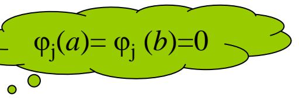

text_image

φj(a)=φj(b)=0

written as

$$
(\mathbf {L} \phi_ {i}, \phi_ {j}) = k _ {i j} = B (\phi_ {i}, \phi_ {j}) = \int_ {a} ^ {b} [ P \phi_ {i} ^ {\prime} \phi_ {j} ^ {\prime} + r \phi_ {i} \phi_ {j} ] d x
$$

let $(f,\phi_{i})=b_{i}$

Then the equations can be written as

$$
\left\{ \begin{array}{l} k _ {1 1} a _ {1} + k _ {1 2} a _ {2} + \dots + k _ {1 n} a _ {n} = b _ {1} \\ k _ {2 1} a _ {1} + k _ {2} a _ {2} + \dots + k _ {2 n} a _ {n} = b _ {2} \\ \dots\dots\\ k _ {n 1} a _ {1} + k _ {n 2} a _ {2} + \dots + k _ {n n} a _ {n} = b _ {n} \end{array} \right.
$$

or expressed with matrix notations

$$
\mathbf {K a} = \mathbf {b}
$$

## 2.2 The method of Ritz

## ◆ Further discussion

The coefficient symmetry of the equations mentioned before can be obtained directly by its calculation formula

$$
k _ {i j} = B \left(\phi_ {i}, \phi_ {j}\right) = \int_ {a} ^ {b} \left[ P \phi_ {i} ^ {\prime} \phi_ {j} ^ {\prime} + r \phi_ {i} \phi_ {j} \right] d x = B \left(\phi_ {j}, \phi_ {i}\right) = k _ {j i}
$$

which means the coefficient matrix K of the equations is symmetric.

Now let's prove K is positively definite

$$
\forall \mathbf {c} ^ {T} = (c _ {1}, c _ {2}, \dots , c _ {n}) \neq 0: \quad \mathbf {c} ^ {T} \mathbf {K} \mathbf {c} > 0
$$

In fact

$$
\mathbf {c} ^ {T} \mathbf {K} \mathbf {c} = \sum_ {i, j = 1} ^ {n} c _ {i} c _ {j} k _ {i j} = \sum_ {i, j = 1} ^ {n} \int_ {a} ^ {b} [ P c _ {i} c _ {j} \phi_ {i} ^ {\prime} \phi_ {j} ^ {\prime} + r c _ {i} c _ {j} \phi_ {i} \phi_ {j} ] d x
$$

$$
= \int_ {a} ^ {b} [ P (\sum_ {i = 1} ^ {n} c _ {i} \phi_ {i}) ^ {\prime} (\sum_ {j = 1} ^ {n} c _ {j} \phi_ {j}) ^ {\prime} + r (\sum_ {i = 1} ^ {n} c _ {i} \phi_ {i}) (\sum_ {j = 1} ^ {n} c _ {j} \phi_ {j}) ] d x
$$

$$
= B \left(\sum_ {i = 1} ^ {n} c _ {i} \phi_ {i}, \sum_ {j = 1} ^ {n} c _ {j} \phi_ {j}\right) = B \left(u _ {n} (x), u _ {n} (x)\right)
$$

where $u_{n}(x)=\sum_{i=1}^{n}c_{i}\phi_{i}=\sum_{j=1}^{n}c_{j}\phi_{j}$

## 2.2 The method of Ritz

## ◆ Further discussion

Now that

$$
u _ {n} (x) = \sum_ {i = 1} ^ {n} c _ {i} \phi_ {i}
$$

When the vector $\mathbf{c} \neq 0$ , then $u_n(x)$ doesn't identically equal to zero. Because the functions $\varphi_1, \varphi_2, \ldots, \varphi_n$ are linearly independent.

Now we only have to prove that there exists $\delta>0$ that will make

$$
\mathbf {c} ^ {T} \mathbf {K c} = B (u _ {n} (x), u _ {n} (x)) = \int_ {a} ^ {b} [ P (u _ {n} ^ {\prime}) ^ {2} + r (u _ {n}) ^ {2} ] d x \geq \delta \int_ {a} ^ {b} u _ {n} ^ {2} d x > 0
$$

According to the property of the definite integral

$$
\int_ {a} ^ {x} u ^ {\prime} (t) d t = u (x)
$$

And use the inequality of Schwarz

$$
\left| \int_ {a} ^ {b} \varphi (x) \psi (x) d x \right| \leq \sqrt {\int_ {a} ^ {b} \varphi^ {2} (x) d x} \sqrt {\int_ {a} ^ {b} \psi^ {2} (x) d x}
$$

We have

$$
u (x) = \int_ {a} ^ {x} u ^ {\prime} (t) * 1 d t \leq \sqrt {\int_ {a} ^ {x} \left(u ^ {\prime} (t)\right) ^ {2} d t} \sqrt {\int_ {a} ^ {x} 1 d t} = \sqrt {x - a} \sqrt {\int_ {a} ^ {x} \left(u ^ {\prime} (t)\right) ^ {2} d t}
$$

## 2.2 The method of Ritz

## ◆ Further discussion

$$
\begin{array}{l} \leq \int_ {a} ^ {b} \left[ (x - a) \int_ {a} ^ {b} \left(u ^ {\prime} (t)\right) ^ {2} d t \right] d x = \int_ {a} ^ {b} \left(u ^ {\prime} (t)\right) ^ {2} d t \int_ {a} ^ {b} (x - a) d x \\ = \frac {(b - a) ^ {2}}{2} \int_ {a} ^ {b} (u ^ {\prime} (t)) ^ {2} d t = \frac {(b - a) ^ {2}}{2} \int_ {a} ^ {b} (u ^ {\prime} (x)) ^ {2} d x \\ \end{array}
$$

So $\int_{a}^{b} u^{2}(x) dx = \int_{a}^{b} \left[ \int_{a}^{x} u(t) dt \right]^{2} dx \leq \int_{a}^{b} \left[ (x - a) \int_{a}^{x} (u'(t))^{2} dt \right] dx$

And

$$
\int_ {a} ^ {b} \left(u ^ {\prime} (x)\right) ^ {2} d x \geq \frac {2}{(b - a) ^ {2}} \int_ {a} ^ {b} u ^ {2} (x) d x
$$

Thus

$$
\int_ {a} ^ {b} \left[ P \left(u _ {n} ^ {\prime}\right) ^ {2} + r \left(u _ {n}\right) ^ {2} \right] d x \geq \int_ {a} ^ {b} \left[ \left(\min _ {a \leq x \leq b} P (x)\right) \left(u _ {n} ^ {\prime}\right) ^ {2} + r \left(u _ {n}\right) ^ {2} \right] d x
$$

$$
\geq \int_ {a} ^ {b} \left[ \left(\min _ {a \leq x \leq b} P (x)\right) \frac {2}{(b - a) ^ {2}} \left(u _ {n}\right) ^ {2} + r \left(u _ {n}\right) ^ {2} \right] d x
$$

$$
> \int_ {a} ^ {b} \left[ \left(\min _ {a \leq x \leq b} P (x)\right) \frac {2}{(b - a) ^ {2}} \left(u _ {n}\right) ^ {2} \right] d x = \delta \int_ {a} ^ {b} \left(u _ {n}\right) ^ {2} d x
$$

## 2.2 The method of Ritz

## ◆ Further discussion

In conclusion we have

$$
\mathbf {c} ^ {T} \mathbf {K} \mathbf {c} = B (u _ {n} (x), u _ {n} (x)) = \int_ {a} ^ {b} [ P (u _ {n} ^ {\prime}) ^ {2} + r (u _ {n}) ^ {2} ] d x \geq \delta \int_ {a} ^ {b} u _ {n} ^ {2} d x
$$

where $\delta=\left(\min_{a\leq x\leq b}P(x)\right)\frac{2}{(b-a)^{2}}$

which means the matrix K is positively definite.

So the equations

$$
\mathbf {K a} = \mathbf {b}
$$

have the unique solution.

## More explanation

Because

$$
F (a _ {1}, a _ {2}, \dots , a _ {n}) = \sum_ {i, j = 1} ^ {n} a _ {i} a _ {j} (\mathbf {T} \phi_ {i}, \phi_ {j}) - 2 \sum_ {i = 1} ^ {n} a _ {i} (f, \phi_ {i})
$$

According to the conclusion of

$$
\delta^ {2} F = \frac {\partial^ {2} F}{\partial a _ {i} \partial a _ {j}} \delta a _ {i} \delta a _ {j} = k _ {i j} \delta a _ {i} \delta a _ {j} > 0
$$

That is the second-order variation is greater than zero, which means the solution we get can make the functional get its minimum.

## 2.3 Application of the Ritz method

## Summary

The discussion before mainly focuses on the mathematical aspect. Now let's discuss the application of the Ritz method in mechanics.

## The method of Ritz directly use the principle of minimum potential energy

(1) Choose the permissible trial function for the displacement.

$$
u _ {i} = u _ {i} ^ {0} + a _ {i n} u _ {i n} \quad n = 1, 2, \dots , N
$$

where i is the free index, n is the summation index and $a_{in}$ is the displacement parameter of the undetermined displacement.

The value range of the free index i depends on the specific problem, for example for the three-dimensional problem i can be 1, 2, 3.

$u_{i}^{0}$ is the function of displacement that satisfies the given nonhomogeneous boundary condition of displacement, which means $u_{i}^{0} = \overline{u}_{i}$ on $\mathbf{S}_u$ .

$u_{in}$ is the function of displacement that satisfies the homogeneous boundary condition of displacement, which means $u_{in}=0$ on $S_{u}$ .

(2) Write the expression $\Pi(u_i)$ of the total potential energy of the given elastic system, substitute the possible trial function of displacement and obtain the expression $\Pi(a_{in})$ of the total potential energy expressed by the undetermined displacement parameters.  
(3) Calculate the variation of the total potential energy $\Pi$ .

Because the form of the displacement function has been determined so only the amplitude (the undetermined coefficient $a_{in}$ ) will change when solving the variation.

## 2.3 Application of the Ritz method

## Summary

(3) According to the principle of minimum potential energy

$$
\delta \Pi = \frac {\partial \Pi}{\partial a _ {i n}} \delta a _ {i n} = 0
$$

Because $\delta a_{in}$ are mutually independent, the coefficients equal to zero. That is

$$
\frac {\partial \Pi}{\partial a _ {i n}} = 0 \quad n = 1, 2, \dots , N
$$

This is the solving equation of the Ritz method.

It's actually the approximate equilibrium equation expressed by the displacement parameters.

For the linear elastic problem total potential energy $\Pi$ is the second-order functional of the displacement and its derivative. Substitute the trial function of displacement and we can get the quadratic function of the undetermined coefficient of displacement.

So the equation above is actually the linear algebraic equations of $a_{in}$ , which can be easily solved by computer.

(4) Solve the algebraic equations above and we can get the undetermined parameter of displacement and then substitute it into the equation below.

$$
u _ {i} = u _ {i} ^ {0} + a _ {i n} u _ {i n} \quad n = 1, 2, \dots , N
$$

We can get the approximate solution of the displacement field.

Stress and strain can also be solved by displacement but generally the obtained stress field doesn't satisfy the static equilibrium equations.

## 2.3 Application of the Ritz method

## The beam with uniform load

Let's consider a beam example.

The force condition is as shown in the picture.

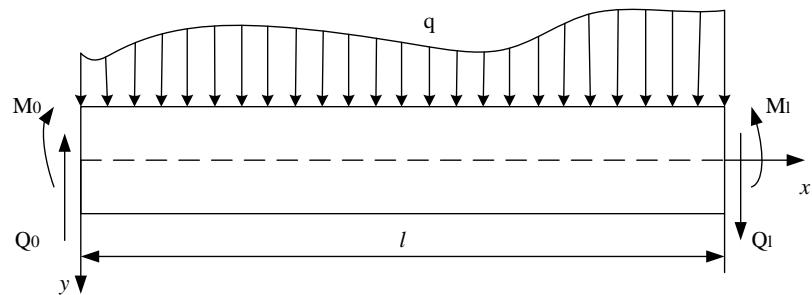

text_image

q
M0
Q0
y
l
M1
x
Q1

Now let's derive the differential equilibrium equations and the static boundary conditions expressed with the beam deflection according to the principle of minimum potential energy.

The advantage of variation method is that one can easily obtain the correct boundary conditions.

Let the beam deflection be $w(x)$ . Denote the curvature of the beam axis in flexure as $\kappa$ . And the strain energy of the beam is

$$
U = \frac {1}{2} \int_ {0} ^ {L} M \kappa d x
$$

Because $\mathbf{M} = \mathrm{EI}\kappa$ . Notice that in the case of small deformation we have $\kappa \approx \frac{\omega_{\mathrm{eff}}}{dx^2}$

So the strain energy can be written as $U = \frac{1}{2} \int_{0}^{L} EI \left( \frac{d^{2} w}{dx^{2}} \right)^{2} dx$

## 2.3 Application of the Ritz method

## The beam with uniform load

The boundary S of this problem is the upper and lower surfaces and the two ends. If the direction of load is as shown in the picture then the potential energy of the external force is

$$
V = - \int_ {0} ^ {L} q w d x + Q _ {0} w _ {0} - M _ {0} \left(\frac {d w}{d x}\right) _ {0} - Q _ {L} w _ {L} + M _ {L} \left(\frac {d w}{d x}\right) _ {L}
$$

The total potential energy of the beam is

$$
\Pi = \frac {1}{2} \int_ {0} ^ {L} E I \left(\frac {d ^ {2} w}{d x ^ {2}}\right) ^ {2} d x - \int_ {0} ^ {L} q w d x + Q _ {0} w _ {0} - M _ {0} \left(\frac {d w}{d x}\right) _ {0} - Q _ {L} w _ {L} + M _ {L} \left(\frac {d w}{d x}\right) _ {L}
$$

Solve the variation of the equation above

$$
\delta \Pi = \frac {1}{2} \int_ {0} ^ {L} E I \delta \left(\frac {d ^ {2} w}{d x ^ {2}}\right) ^ {2} d x - \int_ {0} ^ {L} q \delta w d x + Q _ {0} \delta w _ {0} - M _ {0} \delta \left(\frac {d w}{d x}\right) _ {0} - Q _ {L} \delta w _ {L} + M _ {L} \delta \left(\frac {d w}{d x}\right) _ {L}
$$

$$
= \frac {1}{2} \int_ {0} ^ {L} E I \delta \left(\frac {d ^ {2} w}{d x ^ {2}}\right) ^ {2} d x - \int_ {0} ^ {L} q \delta w d x - [ Q \delta w ] _ {0} ^ {L} + \left[ M \delta \left(\frac {d w}{d x}\right) \right] _ {0} ^ {L}
$$

Calculate the first term

$$
\begin{array}{l} \frac {1}{2} \int_ {0} ^ {L} E I \delta \left(\frac {d ^ {2} w}{d x ^ {2}}\right) ^ {2} d x = \int_ {0} ^ {L} E I \frac {d ^ {2} w}{d x ^ {2}} \delta \left(\frac {d ^ {2} w}{d x ^ {2}}\right) d x = \int_ {0} ^ {L} E I \frac {d ^ {2} w}{d x ^ {2}} d \left(\delta \frac {d w}{d x}\right) d x \\ = \left[ E I \frac {d ^ {2} w}{d x ^ {2}} \delta \left(\frac {d w}{d x}\right) \right] _ {0} ^ {L} - \int_ {0} ^ {L} \frac {d}{d x} \left(E I \frac {d ^ {2} w}{d x ^ {2}}\right) \delta \frac {d w}{d x} d x \\ = \left[ E I \frac {d ^ {2} w}{d x ^ {2}} \delta \left(\frac {d w}{d x}\right) \right] \Bigg | _ {0} ^ {L} - \left[ \delta w \frac {d}{d x} \left(E I \frac {d ^ {2} w}{d x ^ {2}}\right) \right] \Bigg | _ {0} ^ {L} + \int_ {0} ^ {L} \frac {d ^ {2}}{d x ^ {2}} \left(E I \frac {d ^ {2} w}{d x ^ {2}}\right) \delta w d x \\ \end{array}
$$

## 2.3 Application of the Ritz method

## The beam with uniform load

Substitute the equation above into the variation of the total potential energy

$$
\delta \Pi = \int_ {0} ^ {L} \left[ \frac {d ^ {2}}{d x ^ {2}} \left(E I \frac {d ^ {2} w}{d x ^ {2}}\right) - q \right] \delta w d x + \delta \left(\frac {d w}{d x}\right) \left[ E I \frac {d ^ {2} w}{d x ^ {2}} + M \right] \Bigg | _ {0} ^ {L} - \delta w \left[ \frac {d}{d x} \left(E I \frac {d ^ {2} w}{d x ^ {2}}\right) + Q \right] \Bigg | _ {0} ^ {L}
$$

$\delta w$ is totally arbitrary, so the equation above holds when

$$
\frac {d ^ {2}}{d x ^ {2}} \left(E I \frac {d ^ {2} w}{d x ^ {2}}\right) = q \quad 0 \leq x \leq L
$$

Equilibrium equations

$$
\left. \begin{array}{l} \delta \left(\frac {d w}{d x}\right) \left[ E I \frac {d ^ {2} w}{d x ^ {2}} + M \right] \\ \delta w \left[ \frac {d}{d x} \left(E I \frac {d ^ {2} w}{d x ^ {2}}\right) + Q \right] \end{array} \right\} x = 0, L
$$

The boundary conditions

Apparently the equations above are the differential equations of the beam curvature and the boundary conditions of the displacement.

Now let's discuss how to express the static boundary conditions by deflection in different situations of support.

## 2.3 Application of the Ritz method

## The beam with uniform load

General types of the boundary conditions are

$$
\left. \begin{array}{l} \delta \bigg (\frac {d w}{d x} \bigg) \bigg [ E I \frac {d ^ {2} w}{d x ^ {2}} + M \bigg ] \\ \delta w \bigg [ \frac {d}{d x} \bigg (E I \frac {d ^ {2} w}{d x ^ {2}} \bigg) + Q \bigg ] \end{array} \right\} x = 0, L
$$

1. For the fixed ends because $w=\frac{dw}{dx}=0$ , the equations hold naturally.  
2. For the simply supported ends we have w=0 (because $\delta w=0$ ). Also $\left(\frac{d}{dx}\right)^{n}$ . So the second term of the equations holds naturally and from the first term we have

$$
E I \frac {d ^ {2} w}{d x ^ {2}} = - M
$$

If there's no bending moment of the simply supported end of the beam, then it can be simplified as $EI\frac{d^2w}{dx^2} = 0$

3. For the free ends because $\delta w \neq 0$ , $\delta\left(\frac{dw}{dx}\right) \neq 0$ , we have

$$
E I \frac {d ^ {2} w}{d x ^ {2}} = - M, \frac {d}{d x} \left(E I \frac {d ^ {2} w}{d x ^ {2}}\right) = - Q
$$

If one of or both of the moment and shearing force equal to zero, then the boundary conditions can be simplified accordingly.

## 2.3 Application of the Ritz method

## The beam with uniform load

The expression of the total potential energy of the simply supported beam shown in the picture is

$$
\Pi = \frac {1}{2} \int_ {0} ^ {L} E I \left(\frac {d ^ {2} w}{d x ^ {2}}\right) ^ {2} d x - \int_ {0} ^ {L} q w d x
$$

1. The trial function also the deflection is

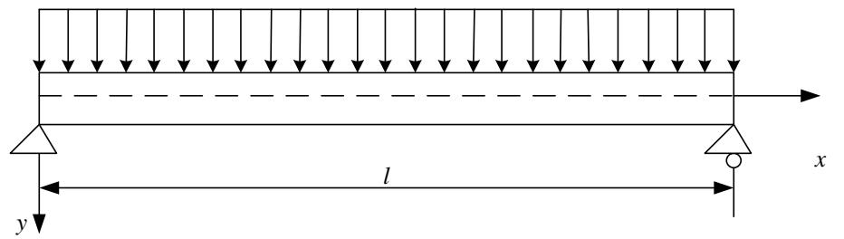

text_image

y
l
x

$$
w = a x (l - x)
$$

It apparently satisfies the boundary condition

$$
w (0) = w (l) = 0
$$

Substitute it into the expression of the total potential energy and we have

$$
\Pi = \frac {E I}{2} \int_ {0} ^ {l} (- 2 a) ^ {2} d x - q a \int_ {0} ^ {l} x (l - x) d x
$$

Only a is the variable so $= 2EIla^{2} - \frac{1}{6} ql^{3}a$

Thus the approximate solution of the deflection is. $\frac{\partial\Pi}{\partial a} = 0\Rightarrow 4EIa - \frac{1}{6} ql^3 = 0\Rightarrow a = \frac{ql^2}{24EI}$

$$
w = \frac {q l ^ {2}}{2 4 E I} x (l - x)
$$

## 2.3 Application of the Ritz method

## The beam with uniform load

In engineering practice, people mostly focus on the maximum of deflection, which occurs in the middle $al^{2}$ , $l_{1}$ , $l_{2}$ , $al^{4}$

$$
w _ {\mathrm{max}} = \frac {q l ^ {2}}{2 4 E I} \frac {l}{2} (l - \frac {l}{2}) = \frac {q l ^ {4}}{9 6 E I}
$$

The exact solution obtained by mechanics of materials is

$$
w _ {\mathrm{max}} = \frac {5 q l ^ {4}}{3 8 4 E I}
$$

The error is around 20%, which is quite dissatisfying.

2. Change the trial function to $w = a\sin \left(\frac{\pi x}{l}\right)$

which satisfies the boundary conditions apparently. Substitute the equation into the expression of the total potential energy that

$$
\begin{array}{l} \Pi = \frac {E I}{2} a ^ {2} \left(\frac {\pi}{l}\right) ^ {2} \int_ {0} ^ {l} \sin^ {2} \left(\frac {\pi x}{l}\right) d x - q a \int_ {0} ^ {l} \sin \left(\frac {\pi x}{l}\right) d x \\ = \frac {E I \pi^ {4}}{4 l ^ {3}} a ^ {2} - \frac {2 q l}{\pi} a \\ \end{array}
$$

## 2.3 Application of the Ritz method

## The beam with uniform load

So

$$
\frac {\partial \Pi}{\partial a} = 0 \Rightarrow \frac {E I \pi^ {4}}{2 l ^ {3}} a - \frac {2 q l}{\pi} = 0 \Rightarrow a = \frac {4 q l ^ {4}}{E I \pi^ {5}}
$$

So the approximate solution of deflection is

$$
w = \frac {4 q l ^ {4}}{E I \pi^ {5}} \sin \left(\frac {\pi x}{l}\right)
$$

Similarly the deflection in the middle is the maximum.

$$
w _ {\mathrm{max}} = \frac {4 q l ^ {4}}{E I \pi^ {5}} \sin \left(\frac {\pi}{l} \frac {l}{2}\right) = \frac {4 q l ^ {4}}{E I \pi^ {5}}
$$

The error is 0.38%, which is quite satisfying compared to the solution above.

## One can take more terms or even infinite series to obtain more accurate result.

We can notice the advantage of the direct method of variation problems that we only need to solve the algebraic equations rather than the differential equations. Once the trial function is appropriately, it only needs to solve several (sometimes even one) algebraic equations to get the result accurate enough.

## 2.4 The method of Galerkin

## The method of Galerkin

Galerkin proposed another direct method of variation problem in 1915, which is a special form of the Ritz method in mechanics.

Now let's look at his idea.

The variation of the minimum potential energy is

$$
\delta \Pi = - \int_ {V} (\sigma_ {i j, j} + f _ {i}) \delta u _ {i} d V + \int_ {S _ {\sigma}} (\sigma_ {i j} n _ {j} - \overline {{p}} _ {i}) \delta u _ {i} d S = 0
$$

, which is the origin of the Ritz method: Establish and substitute the trial function satisfying the displacement boundary conditions on $S_{u}$ .

However the trial function of the displacement is required to satisfy both the boundary conditions of the displacement on $S_{u}$ and the external force on $S_{\sigma}$ in the method of Galerkin.

So the variation of the potential energy can be written as

$$
\delta \Pi = - \int_ {V} (\sigma_ {i j, j} + f _ {i}) \delta u _ {i} d V = 0
$$

Because $\delta u_{i}=u_{in}\delta a_{in}$ . And $\delta a_{in}$ is mutually independent. We have

$$
\int_ {V} \left(\sigma_ {i j, j} + f _ {i}\right) u _ {i n} d V = 0 \quad n = 1, 2, \dots , N
$$

This is the solving equation of the Galerkin method, which is also the linear equations after integration.

## 2.4 The method of Galerkin

## The method of Galerkin

Take the beam as example. We have obtained its functional form of the total potential

energy

$$
\Pi = \int_ {0} ^ {l} F (x, w, w ^ {\prime}, w ^ {\prime \prime}) d x
$$

Using the operation notations of variation we can get its first-order variation as

$$
\delta \Pi = \int_ {0} ^ {l} \delta w [ \frac {\partial F}{\partial w} - \frac {d}{d x} (\frac {\partial F}{\partial w ^ {\prime}}) + \frac {d ^ {2}}{d x ^ {2}} (\frac {\partial F}{\partial w ^ {\prime \prime}}) ] d x
$$

$$
\left. + \left[ \delta w (F _ {w ^ {\prime}} - \frac {d}{d x} (F _ {w ^ {\prime \prime}})) \right] \right| _ {0} ^ {l} + \left[ F _ {w ^ {\prime \prime}} \delta \left(\frac {d w}{d x}\right) \right] \bigg | _ {0} ^ {l}
$$

We can know that the terms outside the sign of integration are the variation of potential energy on the boundary.

When replace the real w by the approximate displacement function $w_{n}$ , there usually remain only one term of integral because the trial function must satisfy all the boundary conditions according to the method of Galerkin.

Rewritten as

$$
\int_ {0} ^ {l} \delta w _ {n} \left[ \frac {\partial F}{\partial w} - \frac {d}{d x} \left(\frac {\partial F}{\partial w ^ {\prime}}\right) + \frac {d ^ {2}}{d x ^ {2}} \left(\frac {\partial F}{\partial w ^ {\prime \prime}}\right) \right] d x = \int_ {0} ^ {l} \delta w _ {n} f (x, w, w ^ {\prime}, w ^ {\prime \prime}, \dots) d x
$$

Substitute the trial function and we can get a set of linear equations.

## 2.4 The method of Galerkin

## The method of Galerkin

Example: Solve the approximate value of the deflection of the beam with two fixed ends and uniform load.

Solve: Let the trial function of the deflection be

$$
w = a (1 - \cos \frac {2 \pi x}{l})
$$

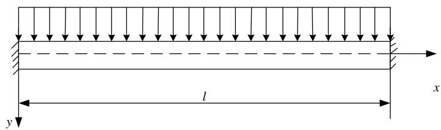

text_image

l
x
y

, which apparently satisfies the boundary conditions of displacement.

$$
w (0) = w (l) = 0
$$

$$
w ^ {\prime} (0) = w ^ {\prime} (l) = 0
$$

The equation above can be chosen as the trial function of the Ritz method. So it can be solved by the Ritz method.

However there are no boundary conditions of force in this problem. So satisfying the equations above (the displacement and the rotation of two ends equal zero) means satisfying all the boundary conditions.

So this function can also be the trial function of the Galerkin method and let's solve the problem by the method of Galerkin.

The integral equation of Galerkin is

$$
\int_ {0} ^ {l} (E I \frac {d ^ {4} w}{d x ^ {4}} - q) w d x = 0
$$

## 2.4 The method of Galerkin

## The method of Galerkin

Solve: Substitute the trial function of displacement and

$$
- E I \left(\frac {2 \pi}{l}\right) ^ {4} a \int_ {0} ^ {l} \cos \frac {2 \pi x}{l} (1 - \cos \frac {2 \pi x}{l}) d x - q \int_ {0} ^ {l} (1 - \cos \frac {2 \pi x}{l}) d x = 0
$$

which leads to

$$
E I \left(\frac {2 \pi}{l}\right) ^ {4} \frac {l}{2} a - q l = 0 \Rightarrow a = \frac {q l ^ {4}}{8 \pi^ {4} E I}
$$

So the approximate curve of the deflection is

$$
w = \frac {q l ^ {4}}{8 \pi^ {4} E I} (1 - \cos \frac {2 \pi x}{l})
$$

We can notice an advantage of the Galerkin method that we don't need to judge whether the structure is indeterminate.

Because the solution is the same no matter the structure is static determinate or not.

## 2.4 The method of Galerkin

## Comparison to the method of Ritz

Example: Solve the deflection of a cantilever beam with uniform load.

## Solution 1. The Ritz method

The first-order approximate trial function is

$$
w = a (1 - \cos \frac {\pi x}{2 l})
$$

Substituted into the expression of the total potential energy and we have

$$
\begin{array}{l} \Pi = \int_ {0} ^ {l} \frac {1}{2} E I (w ^ {\prime \prime}) ^ {2} d x - \int_ {0} ^ {l} q w d x \\ = \frac {1}{2} a ^ {2} E I \left(\frac {\pi}{2 l}\right) ^ {4} \frac {l}{2} - q a l \left(1 - \frac {2}{\pi}\right) \\ \end{array}
$$

Because $\frac{\partial\Pi}{\partial a} = 0$ , we have $a = \frac{32}{\pi^4}\left(1 - \frac{2}{\pi}\right)\frac{ql^4}{EI}$

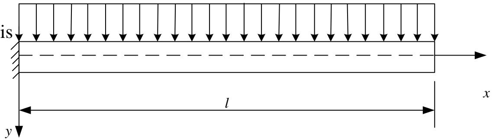

text_image

is
l
x
y

So the maximum of the deflection at x=l is

$$
\begin{array}{l} \text {e deflection at x = l is} \\ w _ {\max} = a (1 - \cos \frac {\pi}{2 l} l) = \frac {3 2}{\pi^ {4}} (1 - \frac {2}{\pi}) \frac {q l ^ {4}}{E I} \end{array}
$$

4.5% smaller compared to the accurate result $\frac{1}{8}\frac{ql^{4}}{EI}$

## 2.4 The method of Galerkin

## Comparison to the method of Ritz

## Solution 2. The Galerkin method

The method of Galerkin requires that the trial function must satisfy the boundary conditions of both the external force and the displacement. So the trial function of the Ritz method is not appropriate here.

Exercise: What will be the result if adopt the trial function of Ritz method?

It'll be easier to consider the boundary condition of the external force first when looking for the trial function of the Galerkin method.

Let

$$
\frac {d ^ {2} w}{d x ^ {2}} = a (1 - \sin \frac {\pi x}{2 l})
$$

Apparently it satisfies the condition that the moment and the shearing force equal to zero at x=1 $\quad \quad \quad \quad \quad \quad \quad \quad \quad \quad \quad \quad \quad \quad \quad \quad \quad \quad \quad \quad \quad \quad \quad \quad \quad \quad \quad \quad \quad \quad \quad \quad \quad \quad \quad \quad \quad \quad \quad \quad \quad \quad \quad$

$$
w ^ {\prime \prime} (l) = 0 \quad w ^ {\prime \prime \prime} (l) = 0
$$

Integrate the equation above twice and

$$
w = a \left[ \frac {1}{2} x ^ {2} + \left(\frac {2 l}{\pi}\right) ^ {2} \sin \frac {\pi x}{2 l} + A x + B \right]
$$

The integral constants A and B are determined by the boundary condition that the trial function satisfies at x=0. That is $w(0)=0$ $w'(0)=0$

## 2.4 The method of Galerkin

## Comparison to the method of Ritz

## Solution:

The trial function is $w = a\left[\frac{1}{2} x^2 - \frac{2l}{\pi} x + \left(\frac{2l}{\pi}\right) \sin \frac{\pi x}{2l} + B\right]$

Substitute the trial function into the solving equations of the Galerkin method and we have

$$
a = \frac {\frac {1}{6} - \frac {1}{\pi} + \frac {8}{\pi^ {3}}}{\frac {3}{2} - \frac {4}{\pi}} \frac {q l ^ {4}}{E I}
$$

Thus the biggest deflection at $x = l$ is

$$
w _ {\mathrm{max}} = a l ^ {2} (\frac {1}{2} - \frac {2}{\pi} + \frac {4}{\pi^ {2}}) \approx 0. 1 2 6 \frac {q l ^ {4}}{E I}
$$

The result is 0.8% bigger than the accurate solution and is apparently better than the first approximate solution of the Ritz method.

The trial function of the Galerkin method is also the trial function of the Ritz method. You can try to substitute the trial function above into the Ritz method to solve the problem.

## 2.5 Conclusion

## Conclusions

The solving equations of the Galerkin method can be explained by the idea of the weighted residual method.

For example according to the equilibrium conditions the real solution w of the beam with uniform load should satisfy:

$$
E I \frac {d ^ {4} w}{d x ^ {4}} - q = 0 \Rightarrow \int_ {0} ^ {l} (E I \frac {d ^ {4} w}{d x ^ {4}} - q) w d x = 0
$$

The trial function $w_{n}$ doesn't always satisfy the equilibrium equations in the domain once relax the requirement. So there will be a nonzero residual on the right side after substituted into the equilibrium equations.

$$
w _ {n} = \sum_ {i = 1} ^ {n} a _ {i} \phi_ {i} \Rightarrow E I \frac {d ^ {4} w _ {n}}{d x ^ {4}} - q = R _ {i} \neq 0
$$

The method of weighted residual is to adjust the undetermined parameters of the trial functions to make the integral of the product of the residual and some weight functions equals zero in the entire domain. And we can obtain the approximate solution.

$$
\int_ {0} ^ {l} R \varphi_ {i} d x = \int_ {0} ^ {l} \left(E I \frac {d ^ {4} w _ {n}}{d x ^ {4}} - q\right) \varphi_ {i} d x = 0 \quad i = 1, 2, \dots , N
$$

There are different ways to choose the weight function. And when the weight function is the admissible function $\varphi_{i}$ of the trial function, it becomes the method of Galerkin.

## III. The method of weighted residuals

## 3.1 Brief

We've discussed the approximate solutions of the physical problems or the differential equations.

However, not all the differential equations can be transformed into the variation problem, which means we should first think about the inverse problem of the variation.

There are two methods to discuss the variation problem:

Take the simple functional of one independent function for example

(1) For the function family with two given parametric variables $\alpha$ and $\beta$

Solve the functional of which the function above is the extreme

(2) For the given differential function

$$
\phi (x, y, y ^ {\prime}, y ^ {\prime \prime}) = 0
$$

Solve the functional of which the function above is the Euler equation.

For the first question, we usually solve its differential equations by eliminating the parameters and then obtain the corresponding functional, which actually turns out to be the second question.

## 3.1 Brief

As stressed before, all the differential equations don't have the functional of which the differential equation itself is the Euler equation.

Take the second-order ordinary differential equation for example

$$
\phi (x, y, y ^ {\prime}, y ^ {\prime \prime}) = 0
$$

If it is the Euler equation of the functional below

$$
Q [ y ] = \int_ {a} ^ {b} F (x, y, y ^ {\prime}) d x
$$

Then

$$
\phi (x, y, y ^ {\prime}, y ^ {\prime \prime}) = 0 = F _ {y} - \frac {d}{d x} F _ {y ^ {\prime}} = F _ {y} - F _ {y ^ {\prime} x} - y ^ {\prime} F _ {y ^ {\prime} y} - y ^ {\prime \prime} F _ {y ^ {\prime} y ^ {\prime}}
$$

So

$$
\phi_ {y ^ {\prime}} - \frac {d}{d x} \phi_ {y ^ {\prime \prime}} = \left(F _ {y y ^ {\prime}} - F _ {y ^ {\prime} y ^ {\prime} x} - F _ {y y ^ {\prime}} - y ^ {\prime} F _ {y y ^ {\prime} y ^ {\prime}} - y ^ {\prime \prime} F _ {y ^ {\prime} y ^ {\prime} y ^ {\prime}}\right) - \frac {d}{d x} F _ {y ^ {\prime} y ^ {\prime}}
$$

$$
= \left(- F _ {y ^ {\prime} y ^ {\prime} x} - y ^ {\prime} F _ {y y ^ {\prime} y ^ {\prime}} - y ^ {\prime \prime} F _ {y ^ {\prime} y ^ {\prime} y ^ {\prime}}\right) - \left(F _ {y ^ {\prime} y ^ {\prime} x} + y ^ {\prime} F _ {y y ^ {\prime} y ^ {\prime}} + y ^ {\prime \prime} F _ {y ^ {\prime} y ^ {\prime} y ^ {\prime}}\right) = 0
$$

So $\varphi$ must satisfy

$$
\phi_ {y ^ {\prime}} - \frac {d}{d x} \phi_ {y ^ {\prime \prime}} = 0
$$

## 3.1 Brief

We can prove that

$$
\phi = - x y + 2 x y ^ {\prime} + x ^ {2} y ^ {\prime \prime} = 0
$$

is the Euler equation of the functional below

$$
Q [ y ] = \frac {1}{2} \int_ {a} ^ {b} (x y ^ {2} + x ^ {2} y ^ {\prime 2}) d x
$$

However after eliminate the common factor x in the equation $\phi$ , we have

$$
\phi = - y + 2 y ^ {\prime} + x y ^ {\prime \prime} = 0
$$

where

$$
\phi_ {y ^ {\prime}} - \frac {d}{d x} \phi_ {y ^ {\prime \prime}} = 2 - \frac {d}{d x} x = 1 \neq 0
$$

So there is no functional of which the equation above is the Euler equation.

So we have to adopt the weighted residual method (WRM) for this kind of problem.

## 3.1 Brief

## The basic idea of the weighted residual method

We have already mentioned the weighted residual method before when discussed the method of Galerkin and now let's explain it from a more mathematical perspective.

Suppose to solve the equation of a differential operator in a function space H.

$$
\mathbf {T} u = f
$$

where T is the operator, u is the undetermined and f is already known in H.

1. Find a set of linearly independent elements $\varphi_1, \varphi_2, \ldots, \varphi_n$ in H and denote the formed subspace as $M = \operatorname{span}[\phi, \phi, \ldots, \phi]$ .

$$
M = \operatorname{span} \{\phi_ {1}, \phi_ {1}, \dots , \phi_ {n} \}
$$

2. Find a set of linearly independent weight functions $\omega_{1}, \omega_{2}, \ldots, \omega_{n}$ in H and let

$$
W = \operatorname{span} \{\omega_ {1}, \omega_ {1}, \dots , \omega_ {n} \}
$$

3. In the space M let

$$
u _ {0} = \sum_ {i = 1} ^ {n} a _ {i} \phi_ {i}
$$

where $a_{1}, a_{2}, \ldots, a_{n}$ are the undetermined coefficients.

## 3.1 Brief

## The basic idea of the weighted residual method

4. Substitute $u_{0}$ into the equation. Because it cannot perfectly satisfy the equation so let the residual be

$$
R = \mathbf {T} u _ {0} - f \neq 0
$$

5. The basic idea of the weighted residual method is to make the projection of the residual R to the weighted function space W equals zero thus we can determine the coefficients $a_{1}$ .

$$
a _ {2}, \ldots , a _ {\mathrm{n}}
$$

$$
(R, \omega_ {i}) = 0 (i = 1, 2, \dots , n)
$$

The geometric meaning of the inner product is the projection

The inner production is written in the integral form as defined before or can be more precisely expressed as

$$
(\mathbf {T} u _ {0} - f, \omega_ {i}) = (\mathbf {T} \sum_ {k = 1} ^ {n} a _ {k} \phi_ {k} - f, \omega_ {i}) = 0 (i = 1, 2, \dots , n)
$$

We can obtain the approximate weighting solutions by solving the equation above.

The method of weighted residual can be regarded as the unified model of solving approximate solutions of the equations. Different basis functions of the subspace M and the weighted function space W can make up different ways to solve the approximate solutions.

## 3.2 Example

## Example

Solve the deflection at the middle of the simply supported beam with uniform load.

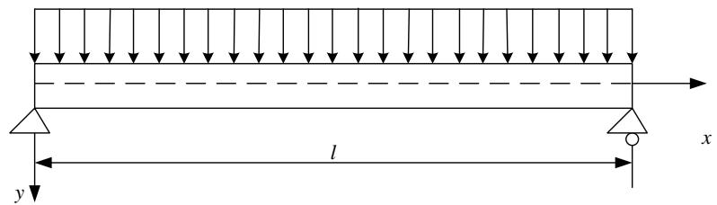

text_image

y
l
x

As discussed before the control differential equation and the boundary conditions of this problem are $d^4 w$

$$
E I \frac {d ^ {4} w}{d x ^ {4}} - q = 0
$$

$$
x = 0: \quad w = 0, w ^ {\prime \prime} = 0
$$

$$
x = l: \quad w = 0, w ^ {\prime \prime} = 0
$$

Now let's use the low dimensional approximate method to solve the problem for better understanding of the essence of the weighted residual method.

The low dimensional approximate method means there is only one or several undetermined parametric variables in the trial function

$$
\tilde {w} _ {1} = c \sin {\frac {\pi x}{l}}
$$

First order approximation

$$
\tilde {w} _ {2} = c _ {1} \sin \frac {\pi x}{l} + c _ {2} \sin \frac {3 \pi x}{l}
$$

Second order approximation

We can prove that the equations above have already satisfy the boundary conditions so there is only internal residual.

## 3.2 Example

## Example

Solve the deflection at the middle of the simply supported beam with uniform load.

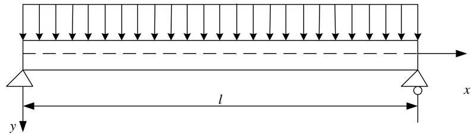

text_image

l
x
y

## The Galerkin method

Choose the basis of the trial function as the weighted function and make the product integral of the internal residual and the weighted function equals zero in the domain. Thus we can derive the algebraic equations to solve the parametric variables.

## Solution

For the first order approximate

$$
\int_ {0} ^ {l} R \sin \frac {\pi x}{l} d x = \int_ {0} ^ {l} \left[ E I c \left(\frac {\pi}{l}\right) ^ {4} \sin \frac {\pi x}{l} - q \right] \sin \frac {\pi x}{l} d x
$$

$$
= E I c \left(\frac {\pi}{l}\right) ^ {4} \frac {l}{2} - 2 q \frac {l}{\pi} = 0
$$

So the parametric variable c is $c=\frac{4ql^{4}}{\pi^{5}EI}$

c is apparently the max deflection at the mid-span and the error is 0.386% compared to the exact solution.

## 3.2 Example

## Example

Solve the deflection at the middle of the simply supported beam with uniform load.

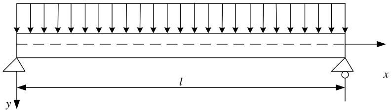

text_image

y
l
x

## Moment Method

The moment method is similar to the Galerkin method but the difference is that the weighted functions is the power series of the coordinates $1, x, x^{2}, \ldots$ and the number of the weighted functions is equal to the number of parametric variables. Let the product integral of the internal residual with every weighted function equals zero thus derive the equation of the parametric variables.

## Solve

For the first order approximate

$$
\int_ {0} ^ {l} R \cdot 1 d x = 2 E I c \left(\frac {\pi}{l}\right) ^ {3} - q l = 0
$$

So the parametric variable $c$ is

$$
c = \frac {q l ^ {4}}{2 \pi^ {3} E I}
$$

c is apparently the max deflection at the mid-span and the error is 23.85% compared to the exact solution.

## 3.2 Example

## Example

Solve the deflection at the middle of the simply supported beam with uniform load.

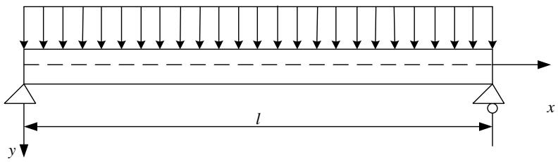

text_image

l
x
y

## Least Square Method

Make the square integral of the internal residual get its extremum in the solving domain, which means the derivative of the integral of every parametric variable equals zero. And we can get the algebraic equations to solve the parametric variables.

## Solve

For the first order approximate

$$
\frac {d}{d c} \int_ {0} ^ {l} R ^ {2} d x = 2 \int_ {0} ^ {l} R \frac {d R}{d c} d x
$$

$$
= E I c \left(\frac {\pi}{l}\right) ^ {4} \frac {l}{2} - 2 q \frac {l}{\pi} = 0
$$

So the parametric variable $c$ is

$$
c = \frac {4 q l ^ {4}}{\pi^ {5} E I}
$$

c is apparently the max deflection at the mid-span. The approximate solution obtained in this way is the same as the Galerkin method.

## 3.2 Example

## Example

Solve the deflection at the middle of the simply supported beam with uniform load.

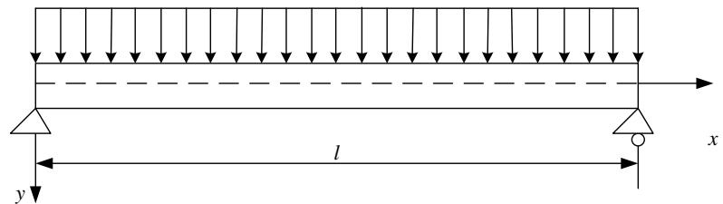

text_image

y
l
x

## Collocation Method

Select several collocations in the solving domain at which the internal residual equals zero thus we can get the equations to solve the variables. The number of the collocations should be equal to the number of undetermined parametric variables.

## Solve

For the first-order approximation there's only one parametric variable so only one collocation is needed. Let the collocation be the middle point.

$$
\left. R \right| _ {x = \frac {l}{2}} = E I c \left(\frac {\pi}{l}\right) ^ {4} - q = 0
$$

So the parametric variable $c$ is

$$
c = \frac {q l ^ {4}}{\pi^ {4} E I}
$$

C is apparently the max deflection at the mid-span and the error is 21.16% compared to the exact solution.

## 3.2 Example

## Example

Solve the deflection at the middle of the simply supported beam with uniform load.

text_image

y
l
x

## Subdomain Method

Divide the solving domain into several parts and make the integral of the internal residual equals zero in very subdomain thus we can get the algebraic equations to solve the parametric variables. The number of the subdomains divided should be equal to the number of the undetermined parametric variables.

## Solve

There's only one parametric variable in the trial function for the first order approximation. So it only requires the integral in the solving domain equals zero. So now the subdomain method is the same as the moment method.

$$
\int_ {0} ^ {l} R d x = 2 E I c \left(\frac {\pi}{l}\right) ^ {3} - q l = 0
$$

So the parametric variable $c$ is

$$
c = \frac {q l ^ {4}}{2 \pi^ {3} E I}
$$

C is apparently the max deflection at the mid-span and the error is 23.85% compared to the exact solution.

## 3.2 Example

## Example

Solve the deflection at the middle of the simply supported beam with uniform load.

## Conclusion

We introduced five methods to solve the approximate solution with the same first order approximate function. We can find out that the errors of the least square method and the Galerkin method are the smallest.

Exercise: Try to use the five methods above to solve the problem with the second order approximate function.

## Discussion

The methods above can be generally called the weighted residual method and they are actually very similar to each other, which can all be expressed in a unified formula. That is to form different methods by choosing the proper weighted functions.

But why these methods are so similar? What's their inner link? And what's the essence of the unified formula of the weighted residual method?

We have to first study the functional analysis and the Sobolev space.

## 3.3 Further discussion

## The functional of variance

The governing differential equations in the theoretical research and the engineering application can be generally expressed as

$$
\mathbf {P} _ {m} (u) = f _ {0}
$$

The corresponding boundary conditions are

$$
\mathbf {Q} _ {t} (u) = f _ {t} \quad (t = 1, 2, \dots , m)
$$

where $P_{m}$ is a m-order differential operator, $Q_{t}$ is a $(t-1)$ order differential operator in the normal direction of the boundary, $f_{t}$ is the given coordinate function and the boundary $\Gamma$ of the domain $\Omega$ is

$$
\Gamma = \bigcup_ {t = 1} \Gamma_ {t}
$$

Usually the problem is supposed to be regular and well posed.

The regularity is the smoothness of the solution, which means if there exists determined degree of smoothness of the boundary conditions then the solution must hold certain degree of smoothness.

The “well-posed” means the existence of the solutions, the uniqueness and the continuity dependence of the definite conditions.

Let the trial function be $\tilde{u} = \sum_{i=1}^{n} c_{i} \phi_{i}$

where $\{\varphi i\}$ is the basis of the trial function and ci is the corresponding undetermined parametric variable.

## 3.3 Further discussion

## The functional of variance

The trial space consist of all the trial functions is called the trial function space.

Because the trial function may satisfy neither the equations nor the boundary conditions. So there will be respectively the internal residual $R_{I}$ and the boundary residual $R_{t}$ after substituted into the equations.

Solve the weighted integral of all the residual squares in the corresponding domain and we have

$$
J _ {R} (\tilde {u}) = \int_ {\Omega} \beta_ {I} ^ {2} R _ {I} ^ {2} d \Omega + \sum_ {t = 1} ^ {m} \int_ {\Gamma_ {t}} \beta_ {t} ^ {2} R _ {t} ^ {2} d \Gamma
$$

The formula above is called the functional of variance, which is actually the functional of the square residual, where $\beta_{I}$ is the weighting coefficient in the domain and $\beta_{t}$ is the weighting coefficient of the boundary conditions.

## The weighting coefficients have the following two effects:

1. Increasing $\beta_{t}$ to ensure the better satisfaction of the boundary conditions if they are very important.  
2. The weighting coefficients can be used as the dimension to adjust the internal and external residuals to make the additive operation more meaningful.

## Apparently the functional of variance has two important conditions:

1) The functional has the minimum that equals zero.  
2) The solution that makes the functional get its minimum is equivalent to that of the boundary problems of the differential equations.

## 3.3 Further discussion

## The functional of variance

The extremum problems of energy variation can be solved by variation equations in the principle of energy variation.

Similarly we can use the variation equation to solve the minimum problem of the functional of variance here.

$$
\delta J _ {R} (\tilde {u}) = 0
$$

And there is the corresponding variation principle of the variance functional.

## The variation principles of the variance functional and the energy functional are very similar:

1. They are both the extremum principles of the functional.  
2. They are both the second-order positive functional for linear problems so the necessary and sufficient condition that the functional gets its minimum is that the first-order variation equals zero.

## The differences are:

1. The quadratic term about u in the energy functional forms the certain energy with general and apparent physical meaning. But its minimum can not be known in advance.  
2. The minimum of the functional of variance is determined to be zero. But there's no explicit physical meaning for the quadratic term about $u$ . The square root can be directly defined as the mean square modulus.

## 3.3 Further discussion

## The functional of variance

After the definition of the modulus we can similarly make up the minimizing sequence of the functional to solve the problem.

The primary task of the numerical analysis is to transform the infinite dimensional problem to the finite one.

Now let's explain from the geometric aspect.

Rewrite the solving equation of the weighted residual method in the inner product form as

$$
(\mathbf {T} u _ {0} - f, \omega_ {i}) = (\mathbf {T} u _ {0} - \mathbf {T} u, \omega_ {i}) = 0
$$

where $u_{0}$ is the trial solution and u is the real solution so

$$
(\mathbf {T} u _ {0}, \omega_ {i}) = (\mathbf {T} u, \omega_ {i})
$$

It can be seen that the projections to the space W of $Tu_{0}$ and Tu equal to each other.

## So the geometric explanation of the weighted residual method is

Find an approximate solution of Tu=f in the trial function space M to make the approximate value Tu0 and the real Tu have the same projection in the space W.

When the dimension $n \to \infty$ of the subspace M, the minimum of the variance functional will furtherly decrease, which means the approximate solution is approaching to the real solution.

Theoretically speaking only when the range of the trial function has been expanded to all the admissible functions, the minimum of the functional is zero.

## 3.3 Further discussion

## The functional of variance

The different kinds of weighted residual methods above are actually the different methods of forming the minimizing sequence.

We can see that the principle of the weighted residual method is quite simple: The average value of the residuals must be zero under certain situations. It can also transform the differential method of the problem to an integral one, which is applicable for the physical system with or without functional. So it’s a kind of general mathematical treatment and is widely used in the fields like hydromechanics, solid mechanics and thermal physics.

It should be noticed that the solving equations derived by the direct Galerkin method of the variation equation and the Galerkin method of the weighted residual are the same for the problems with functional.

The coefficient matrixes of the equations obtained are symmetric, which is quite important for solving the equations.

We'll call both the two kinds the Galerkin method because we mainly discuss the finite element method of the elastic mechanics.

Exercise: Derive the differential equation and the boundary conditions of the beam on elastic foundation by the variation method and select the first order approximation by different weighted residual methods.

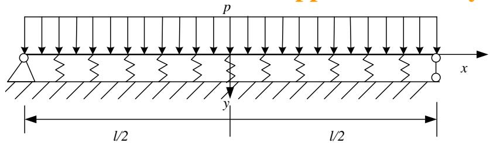

text_image

p
x
l/2
y
l/2

## IV. The finite element method

## 4.1 Brief

We took the one dimensional problem for example when introducing the different methods. So let's look at a two-dimensional example for better understanding of the necessity of the finite element method.

## Example

Solve the Poisson equation by the Galerkin method

$$
\left\{ \begin{array}{c} \Omega : \Delta u = \frac {\partial^ {2} u}{\partial x ^ {2}} + \frac {\partial^ {2} u}{\partial y ^ {2}} = - 2 \\ \Gamma : u = 0 \end{array} \right.
$$

where $\Omega:\left\{\left|x\right|\langle a,\left|y\right|\langle a\right\},\Gamma\right.$ is the boundary of $\Omega$ .

## Solution

Choose two linearly independent basis functions as

$$
\begin{array}{l} \phi_ {1} = (a ^ {2} - x ^ {2}) (a ^ {2} - y ^ {2}) \\ \phi_ {2} = (a ^ {2} - x ^ {2}) (a ^ {2} - y ^ {2}) (x ^ {2} + y ^ {2}) \\ \end{array}
$$

Let $u_{2} = c_{1}\phi_{1} + c_{2}\phi_{2}$

The formula above satisfies all the boundary conditions so it can be used as the trial function of the Galerkin method.

## 4.1 Brief

The solving equation of the Galerkin method

$$
\left\{ \begin{array}{l} \iint_ {\Omega} \phi_ {1} R d \Omega = 0 \Rightarrow \iint_ {\Omega} \phi_ {1} (\Delta u _ {2} - f) d \Omega = 0 \\ \iint_ {\Omega} \phi_ {2} R d \Omega = 0 \Rightarrow \iint_ {\Omega} \phi_ {2} (\Delta u _ {2} - f) d \Omega = 0 \end{array} \right. \Rightarrow \left\{ \begin{array}{l} (\mathbf {T} \phi_ {1}, \phi_ {1}) c _ {1} + (\mathbf {T} \phi_ {2}, \phi_ {1}) c _ {2} = (f, \phi_ {1}) \\ (\mathbf {T} \phi_ {1}, \phi_ {2}) c _ {1} + (\mathbf {T} \phi_ {2}, \phi_ {2}) c _ {2} = (f, \phi_ {2}) \end{array} \right.
$$

Then

$$
(\mathbf {T} \phi_ {1}, \phi_ {1}) = \iint_ {\Omega} \phi_ {1} \Delta \phi_ {1} d \Omega = - \frac {1 6 \times 1 6}{5 \times 3 \times 3} a ^ {8} (\mathbf {T} \phi_ {1}, \phi_ {2}) = \iint_ {\Omega} \phi_ {2} \Delta \phi_ {1} d \Omega = - \frac {1 2 \times 1 6 \times 1 6}{3 5 \times 5 \times 3 \times 3} a ^ {1 0}
$$

$$
(\mathbf {T} \phi_ {2}, \phi_ {1}) = \iint_ {\Omega} \phi_ {1} \Delta \phi_ {2} d \Omega = - \frac {8 \times 1 2 8}{3 5 \times 5 \times 3} a ^ {1 0} (\mathbf {T} \phi_ {2}, \phi_ {2}) = \iint_ {\Omega} \phi_ {2} \Delta \phi_ {2} d \Omega = - \frac {2 2 \times 3 2 \times 8 \times 2}{7 \times 5 \times 5 \times 2 7} a ^ {1 2}
$$

$$
(f, \phi_ {1}) = \iint_ {\Omega} - 2 \phi_ {1} d \Omega = - \frac {3 2}{9} a ^ {6} \qquad (f, \phi_ {2}) = \iint_ {\Omega} - 2 \phi_ {2} d \Omega = - \frac {1 6 \times 4}{5 \times 9} a ^ {6}
$$

Thus $c_{1} = \frac{1}{a^{2}}\frac{5\times 7\times 37}{8\times 277}$ $c_{2} = \frac{1}{a^{4}}\frac{15\times 35}{16\times 277}$

## 4.1 Brief

So the approximate solution is

$$
\begin{array}{l} u \approx u _ {2} = c _ {1} \phi_ {1} + c _ {2} \phi_ {2} \\ = \frac {1}{a ^ {2}} \frac {3 5}{1 6 \times 2 7 7} \left(a ^ {2} - x ^ {2}\right) \left(a ^ {2} - y ^ {2}\right) \left[ 7 4 + \frac {1 5}{a ^ {2}} \left(x ^ {2} + y ^ {2}\right) \right] \\ \end{array}
$$

Apparently the boundary curve is square.

We can see that even for this very simple equation, to form a proper trial function can be very difficult when the boundary curve is complicated.

Besides the Galerkin method requires a relatively high level of smoothness degree of the trial function. For example the second order derivative of this trial function must be integrable. So we usually transform the solving equation to an equivalent integral weak form to decrease the requirement of the trial function smoothness.

So we can solve the partitioned interpolation of the solving domain after obtaining the equivalent integral weak form of the equation and then expand the range of the trial functions.

It leads to the finite element method applicable for a wider domain.

## 4.1 Brief

## Now let's discuss the main idea of the finite element method.

1. The classical finite element method is to find the variation problem of the differential equations through the principle of variation and thus to find the corresponding functional.

One can directly start to establish the functional from the variation method for the mechanical problems.

2. However the functional is not easy to find for some complicated differential equations so here we can adopt the weighted residual method.

The basic idea is to directly calculate the inner product of the basis function and the two ends of the equation rather than find out the corresponding functional and then the discrete solving equations can be obtained.

The equivalent integral forms obtained from different methods are actually the same for the equation that has its corresponding functional.

The requirement of the smoothness degree of the trial function is relatively high when using the equivalent integral method obtained by the Galerkin method.

It has to be transformed to equivalent weak form to decrease the requirement of the smoothness degree.

The common approach is the integration by parts or to directly solve by the principle of virtual work for the mechanical problems.

## 4.1 Brief

It has been discussed before that

$$
- \frac {d}{d x} \left(P (x) u ^ {\prime} (x)\right) + r (x) u (x) = f (x)
$$

the equivalent functional of the equation above (the equivalent integral form) is

$$
Q [ u (x) ] = \int_ {a} ^ {b} \left[ - \left(P (x) u ^ {\prime} (x)\right) ^ {\prime} u (x) + r (x) u (x) u (x) - 2 f (x) u (x) \right] d x
$$

Integrate the first term by parts

$$
Q [ u (x) ] = - P (x) u ^ {\prime} (x) u (x) \Big | _ {a} ^ {b} + \int_ {a} ^ {b} \left[ P (x) u ^ {\prime} (x) u ^ {\prime} (x) \right] d x
$$

$$
+ \int_ {a} ^ {b} [ r (x) u (x) u (x) - 2 f (x) u (x) ] d x
$$

$$
= \int_ {a} ^ {b} \left(P u ^ {\prime 2} + r u ^ {2} - 2 f u\right) d x
$$

text_image

u(a) = u(b) = 0

Apparently it only needs the trial function $u(x)$ to be $C^{0}$ continuous, which is the integral weak form.

The expression can be rewritten as follows so as to derive the formulas more easily.

$$
Q [ u (x) ] = \frac {1}{2} \int_ {a} ^ {b} \left(P u ^ {\prime 2} + r u ^ {2} - 2 f u\right) d x
$$

## 4.2 The mathematical description of the finite element method

We'll discuss the finite element method from a mathematical aspect. . Take the single-variable function for example.

Suppose the undetermined function $u(x)$ of the operator equation Tu=f is defined in the interval $[a,b]$ . Arbitrarily select the discrete points.

$$
a = x _ {0} <   x _ {2} <   \dots x _ {i} <   x _ {i + 1} <   \dots x _ {n} = b
$$

$x_{i}$ is called the node in the finite element method and the interval $[x_{i}, x_{i+1}]$ is called the unit.

Establish the linear basis functions for every node $x_{i}$

$$
\phi_ {i} = \left\{ \begin{array}{c c c} 1 & x = x _ {i} \\ \text {线性} & x \in \left(x _ {i - 1}, x _ {i + 1}\right) & \text {linear} \\ 0 & \text {其他} & \text {others} \end{array} \right.
$$

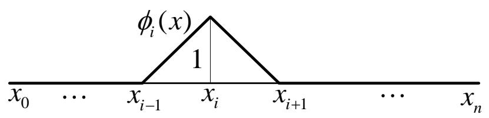

text_image

φᵢ(x)
1
x₀ ... xᵢ₋₁ xᵢ xᵢ₊₁ ... xₙ

So there are totally a number of n basis functions according to the n discrete

points in the whole domain.

$$
\phi_ {1}, \phi_ {2}, \dots , \phi_ {n}
$$

## 4.2 The mathematical description of the finite element method

Apparently $\phi_{i}(i = 1,2,\dots,n)$ is linearly independent and form the subspace as follows.

$$
M = \operatorname{span} \{\phi_ {1}, \phi_ {2}, \dots , \phi_ {n} \}
$$

So any element of M can be linearly expressed as follows by the basis functions above.

$$
\nu (x) = \sum_ {i = 1} ^ {n} a _ {i} \phi_ {i}
$$

The basic ideal of the finite element method is to use $u_{n}$ as the approximation of the real solution u of the equation in the infinite dimensional function space.

That is to select proper $a_1, a_2, \ldots, a_n$ to make $v$ become the best element approaching $u$ in M.

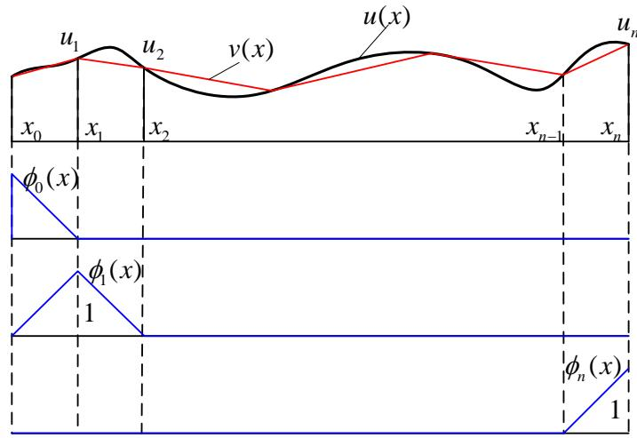

text_image

u₁
u₂
v(x)
u(x)
x₀
x₁
x₂
xₙ₋₁
xₙ
φ₀(x)
φ₁(x)
1
φₙ(x)
1

## 4.2 The mathematical description of the finite element method

The value of every basis function equals 1 at the according nodes and 0 at other nodes due to its special construction (usually called the property of Kronecker).

So the coefficients of the approximate solution $a_{1}$ , $a_{2}$ , ..., $a_{n}$ are just the function values $u_{i}$ ( $i = 1, \ldots, n$ ) of $v(x)$ at the discrete points $x_{1}$ , $x_{2}$ , ..., $x_{n}$ .

To solve $a_{i}(i=1,2,\ldots,n)$ the classical finite element method is to change the equation to the equivalent variation problem according to the principle of variation. Thus the minimum problem of the functional can be transformed into the extremum problem of multivariable function in finite subspace and be

solved through the linear equations obtained. From the definition of basis function we have

$$
\phi_ {i} = \left\{ \begin{array}{c c} 1 & x = x _ {i} \\ \text {线性} & x \in \left(x _ {i - 1}, x _ {i}\right) \\ 0 & \text {其他} \end{array} \right.
$$

We can know that the influence domain or the support set of the basis function is quite small, so the coefficient matrix of the obtained linear equations is very sparse for easier calculation.

We were actually establishing the minimizing sequence of the functional.

And it can be proved that $u_{n}$ is really the approximation of the real solution u in the finite subspace.

## 4.3 Solving steps of the finite element method

## Now let's summarize the solving steps of the finite element method Take the one dimensional equation for example

## 1. Establish the equivalent integral weak form of the function

For the differential equation

$$
\left\{ \begin{array}{l} - (P u ^ {\prime}) ^ {\prime} + r u = f \\ u (a) = u _ {a}, \quad u (b) = u _ {b} \end{array} \right.
$$

its equivalent integral weak form is

$$
Q [ u (x) ] = \frac {1}{2} \int_ {a} ^ {b} \left(P u ^ {\prime 2} + r u ^ {2} - 2 f u\right) d x
$$

## ◆2. Discretize the solving domain

Divide the solving domain of the equation into a finite number of sections and discretize the whole domain into an assembly of finite elements. So the discrete points of the interval $[a, b]$ are

$$
a = x _ {0} <   x _ {2} <   \dots x _ {i} <   x _ {i + 1} <   \dots x _ {n} = b
$$

So the functional in the whole domain can be discretized into the sum of the functionals in each of the n elements.

$$
Q [ u ] = \sum_ {i = 1} ^ {n} Q _ {j} ^ {e}
$$

## 4.3 Solving steps of the finite element method

## 3. Establish the basis function of the slicing difference

Choose the sectioned polynomial $\phi_{i}$ as the basis function, so the trial function is

$$
v (x) = \sum_ {i = 0} ^ {n} u _ {i} \phi_ {i} (x)
$$

where the basis function is as follows

$$
\phi_ {0} = \left\{ \begin{array}{c c} (x _ {1} - x) / (x _ {1} - x _ {0}) & x \in [ x _ {0}, x _ {1} ] \\ 0 & x \not \in [ x _ {0}, x _ {1} ] \end{array} \right.
$$

$$
\phi_ {i} = \left\{ \begin{array}{l l} (x - x _ {i - 1}) / (x _ {i} - x _ {i - 1}) & x \in [ x _ {i - 1}, x _ {i} ] \\ (x _ {i + 1} - x) / (x _ {i + 1} - x _ {i}) & x \in [ x _ {i}, x _ {i + 1} ] \\ 0 & x \not \in [ x _ {i - 1}, x _ {i} ] \bigcup [ x _ {i}, x _ {i + 1} ] \end{array} \right.
$$

$$
\phi_ {n} = \left\{ \begin{array}{c c} 0 & x \not \in [ x _ {n - 1}, x _ {n} ] \\ (x - x _ {n - 1}) / (x _ {n} - x _ {n - 1}) & x \in [ x _ {n - 1}, x _ {n} ] \end{array} \right.
$$

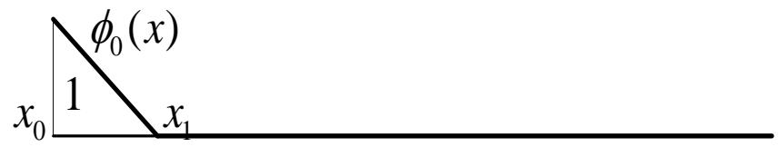

text_image

φ₀(x)
x₀ 1 x₁

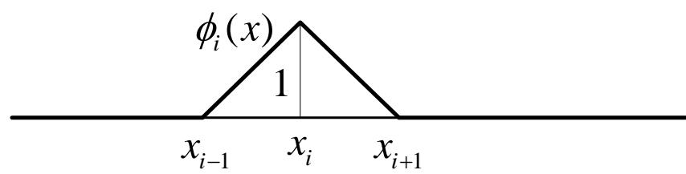

text_image

φᵢ(x)
1
xᵢ₋₁	xᵢ	xᵢ₊₁

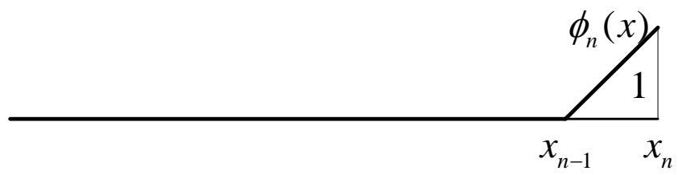

text_image

φₙ(x)
1
xₙ₋₁	xₙ

## 4.3 Solving steps of the finite element method

3. Construct the basis function

Denote the interval $(x_{i-1}, x_i)$ as the element $e_i$ and denote the node $x_{i-1}$ , $x_i$ as the node 1 and node 2 with local numbers. And define the shape function

$$
N _ {1} ^ {(i)} = (x _ {i} - x) / (x _ {i} - x _ {i - 1})
$$

$$
N _ {2} ^ {(i)} = (x - x _ {i - 1}) / (x _ {i} - x _ {i - 1})
$$

So the basis function can also be expressed as

$$
\phi_ {0} = \left\{ \begin{array}{c c} N _ {1} ^ {(1)} & x \in e _ {1} \\ 0 & x \not \in e _ {1} \end{array} \right.
$$

$$
\phi_ {i} = \left\{ \begin{array}{l l} N _ {2} ^ {(i)} & x \in e _ {i} \\ N _ {1} ^ {(i + 1)} & x \in e _ {i + 1} \\ 0 & x \not \in e _ {i} \bigcup e _ {i + 1} \end{array} \right.
$$

$$
\phi_ {n} = \left\{ \begin{array}{c c} 0 & x \notin e _ {n} \\ N _ {2} ^ {(n)} & x \in e _ {n} \end{array} \right.
$$

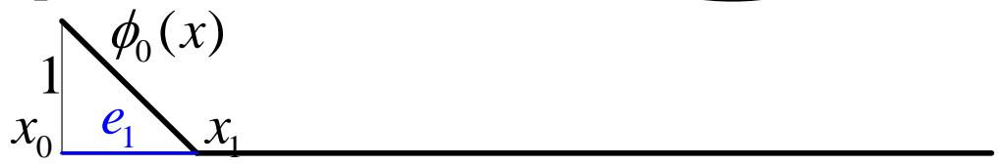

text_image

φ₀(x)
1
x₀ e₁ x₁

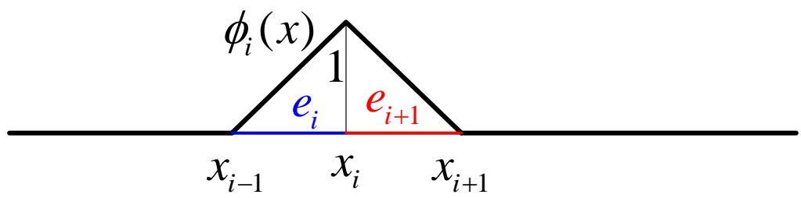

text_image

φᵢ(x)
1
eᵢ eᵢ₊₁
xᵢ₋₁ xᵢ xᵢ₊₁

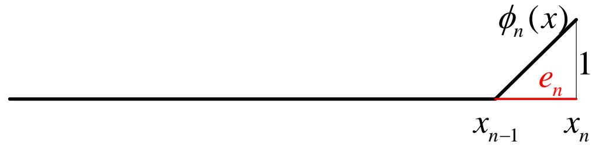

text_image

φₙ(x)
eₙ
1
xₙ₋₁	xₙ

The superscript of N is the number of elements, and the subscript is the number of local nodes.

## 4.3 Solving steps of the finite element method

## 4. Element analysis

We establish the basis function and solve the extremum equations by element when using the finite element method.

Calculate the functional by element, $v(x) = \sum_{i=0}^{n} a_i \phi_i(x)$ for example for the normal element $e_j$

$$
Q _ {j} = \frac {1}{2} \int_ {e _ {j}} \left(P v ^ {\prime 2} + r v ^ {2} - 2 f v\right) d x
$$

It should be noticed that only the basis functions $\phi_{j-1}$ and $\phi_j$ of the trial function $v(x)$ are not equal to zero in the element $e_j$ ( $x_{j-1} < x < x_j$ )

specifically, it is

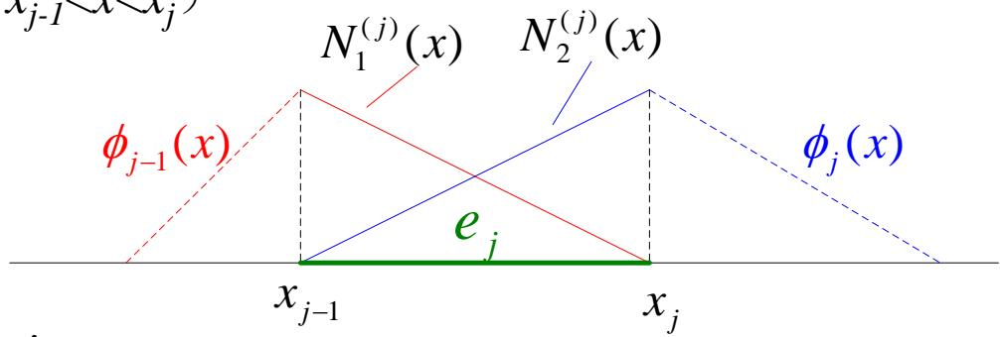

text_image

x_{j-1} \sim x \sim x_j
N_1^{(j)}(x) N_2^{(j)}(x)
\phi_{j-1}(x) e_j \phi_j(x)
x_{j-1} x_j

So in the element $e_{j}$ the trial function is

$$
\phi_ {j - 1} (x) = N _ {1} ^ {(j)} (x) = (x - x _ {j - 1}) / (x _ {j} - x _ {j - 1})
$$

$$
\phi_ {j} (x) = N _ {2} ^ {(j)} (x) = \left(x _ {j + 1} - x\right) / \left(x _ {j + 1} - x _ {j}\right)
$$

$$
v (x) = \sum_ {i = 0} ^ {n} a _ {i} \phi_ {i} (x) = u _ {j - 1} N _ {1} ^ {(j)} (x) + u _ {j} N _ {2} ^ {(j)} (x)
$$

## 4.3 Solving steps of the finite element method

## 4. Element analysis

Substitute the equivalent integral weak form and we have

$$
\begin{array}{l} Q _ {j} = \frac {1}{2} \int_ {e j} \left(P v ^ {\prime 2} + r v ^ {2} - 2 f v\right) d x \\ = \frac {1}{2} \int_ {e j} \left[ P \left(u _ {j - 1} \frac {d N _ {1} ^ {(j)}}{d x} + u _ {j} \frac {d N _ {2} ^ {(j)}}{d x}\right) ^ {2} + r \left(u _ {j - 1} N _ {1} ^ {(j)} + u _ {j} N _ {2} ^ {(j)}\right) ^ {2} - 2 f \left(u _ {j - 1} N _ {1} ^ {(j)} + u _ {j} N _ {2} ^ {(j)}\right) \right] d. \\ = \frac {1}{2} u _ {j - 1} ^ {2} \int_ {e j} \left[ P \left(\frac {d N _ {1} ^ {(j)}}{d x}\right) ^ {2} + r \left(N _ {1} ^ {(j)}\right) ^ {2} \right] d x + u _ {j - 1} u _ {j} \int_ {e j} \left(P \frac {d N _ {1} ^ {(j)}}{d x} \frac {d N _ {2} ^ {(j)}}{d x} + r N _ {1} ^ {(j)} N _ {2} ^ {(j)}\right) d x \\ + \frac {1}{2} u _ {j} ^ {2} \int_ {e j} \left[ P \left(\frac {d N _ {2} ^ {(j)}}{d x}\right) ^ {2} + r \left(N _ {2} ^ {(j)}\right) ^ {2} \right] d x - u _ {j - 1} \int_ {e j} f N _ {1} ^ {(j)} (x) d x - u _ {j} \int_ {e j} f N _ {2} ^ {(j)} (x) d x \\ \end{array}
$$

Let $k_{\alpha \beta}^{ej} = \int_{ej}\left(P\frac{dN_{\alpha}^{(j)}}{dx}\frac{dN_{\beta}^{(j)}}{dx} + rN_{\alpha}^{(j)}N_{\beta}^{(j)}\right)dx$

$$
b _ {\alpha} ^ {e j} = \int_ {e j} f N _ {\alpha} ^ {(j)} (x) d x
$$

## 4.3 Solving steps of the finite element method

## 4. Element analysis

So in the interval $(x_{j-1} < x < x_j)$ the functional value of the element $e_j$ can be

written as

$$
Q _ {j} = \frac {1}{2} u _ {j - 1} ^ {2} k _ {1 1} ^ {e j} + u _ {j - 1} u _ {j} k _ {1 2} ^ {e j} + \frac {1}{2} u _ {j} ^ {2} k _ {2 2} ^ {e j} - u _ {j - 1} b _ {1} ^ {e j} - u _ {j} b _ {2} ^ {e j}
$$

So the derivate of the element is

$$
\frac {\partial Q _ {j}}{\partial u _ {j - 1}} = k _ {1 1} ^ {e j} u _ {j - 1} + k _ {1 2} ^ {e j} u _ {j} - b _ {1} ^ {e j}
$$

$$
\frac {\partial Q _ {j}}{\partial u _ {j}} = k _ {1 2} ^ {e j} u _ {j - 1} + k _ {2 2} ^ {e j} u _ {j} - b _ {2} ^ {e j}
$$

Written in the form of matrix

$$
\left( \begin{array}{l} \frac {\partial Q _ {j}}{\partial u _ {j - 1}} \\ \frac {\partial Q _ {j}}{\partial u _ {j}} \end{array} \right) = \left( \begin{array}{l l} k _ {1 1} ^ {e j} & k _ {1 2} ^ {e j} \\ k _ {1 2} ^ {e j} & k _ {2 2} ^ {e j} \end{array} \right) \left( \begin{array}{l} u _ {j - 1} \\ u _ {j} \end{array} \right) - \left( \begin{array}{l} b _ {1} ^ {e j} \\ b _ {2} ^ {e j} \end{array} \right) = K ^ {e j} \left( \begin{array}{l} u _ {j - 1} \\ u _ {j} \end{array} \right) - B ^ {e j}
$$

$K^{ei}$ is also called the element stiffness matrix of element ej.

## 4.3 Solving steps of the finite element method

## 5. Assemble the equations

We discussed a specific element at one time just now. And we can obtain a number of n derivative formulas of elements from $e_{1}$ to $e_{n}$ .

Add them together according to the public nodes and then get the overall extremum equations.

First write down the equations

$$
\frac {\partial Q}{\partial u _ {i}} = \sum_ {j = 1} ^ {n} \frac {\partial Q _ {j}}{\partial u _ {i}} = 0 (i = 0, 1, \dots , n)
$$

For arbitrary element $e_{i}$

$$
Q _ {j} = \frac {1}{2} u _ {j - 1} ^ {2} k _ {1 1} ^ {e j} + u _ {j - 1} u _ {j} k _ {1 2} ^ {e j} + \frac {1}{2} u _ {j} ^ {2} k _ {2 2} ^ {e j} - u _ {j - 1} b _ {1} ^ {e j} - u _ {j} b _ {2} ^ {e j}
$$

After recurrence we have

$$
Q _ {j + 1} = \frac {1}{2} u _ {j} ^ {2} k _ {1 1} ^ {e (j + 1)} + u _ {j} u _ {j + 1} k _ {1 2} ^ {e (j + 1)} + \frac {1}{2} u _ {j + 1} ^ {2} k _ {2 2} ^ {e (j + 1)} - u _ {j} b _ {1} ^ {e (j + 1)} - u _ {j + 1} b _ {2} ^ {e (j + 1)}
$$

It can be seen that the other terms don't contain $u_{j}$ except $Q_{j}$ and $Q_{j+1}$ , which means only the terms $Q_{i}$ and $Q_{i+1}$ have the partial derivatives of $u_{i}$ . Thus

$$
\frac {\partial Q}{\partial u _ {i}} = \sum_ {j = 1} ^ {n} \frac {\partial Q _ {j}}{\partial u _ {i}} = \frac {\partial Q _ {i}}{\partial u _ {i}} + \frac {\partial Q _ {i + 1}}{\partial u _ {i}}
$$

## 4.3 Solving steps of the finite element method

## 5. Assemble the equations

So

$$
\left. \begin{array}{c} \frac {\partial Q}{\partial u _ {1}} = \frac {\partial Q _ {1}}{\partial u _ {1}} + \frac {\partial Q _ {2}}{\partial u _ {1}} = 0 \\ \frac {\partial Q}{\partial u _ {2}} = \frac {\partial Q _ {2}}{\partial u _ {2}} + \frac {\partial Q _ {3}}{\partial u _ {2}} = 0 \\ \dots \\ \frac {\partial Q}{\partial u _ {n}} = \frac {\partial Q _ {n}}{\partial u _ {n}} = 0 \end{array} \right\} \Leftarrow \frac {\partial Q}{\partial u _ {i}} = \sum_ {j = 1} ^ {n} \frac {\partial Q _ {j}}{\partial u _ {i}} = 0 (i = 1, 2, \dots , n)
$$

According to the element analysis before we have

$$
\begin{array}{l} \frac {\partial Q _ {1}}{\partial u _ {1}} = k _ {1 2} ^ {e 1} u _ {0} + k _ {2 2} ^ {e 1} u _ {1} - b _ {2} ^ {e 1} \\ \frac {\partial Q _ {2}}{\partial u _ {1}} = k _ {1 1} ^ {e 2} u _ {1} + k _ {1 2} ^ {e 2} u _ {2} - b _ {1} ^ {e 2} \end{array}
$$

...

Substituted into the equations above.

## 4.3 Solving steps of the finite element method

## 5. Assemble the equations

And we can get the following equations

$$
\left. \begin{array}{c} \left(k _ {2 2} ^ {e 1} + k _ {1 1} ^ {e 2}\right) u _ {1} + k _ {1 2} ^ {e 2} u _ {2} + k _ {1 2} ^ {e 1} u _ {0} = b _ {2} ^ {e 1} + b _ {1} ^ {e 2} \\ \dots \\ k _ {2 1} ^ {e (n - 1)} u _ {n - 2} + \left(k _ {2 2} ^ {e (n - 1)} + k _ {1 1} ^ {e n}\right) u _ {n - 1} + k _ {1 2} ^ {e n} u _ {n} = b _ {2} ^ {e (n - 1)} + b _ {1} ^ {e n} \\ k _ {2 1} ^ {e n} u _ {n - 1} + k _ {2 2} ^ {e n} u _ {n} = b _ {2} ^ {e n} \end{array} \right\} \Rightarrow K U = B
$$

Expressed in the form of matrix where

$$
K = \left( \begin{array}{c c c c c c} k _ {2 2} ^ {e 1} + \boxed {k _ {1 1} ^ {e 2} \quad k _ {1 2} ^ {e 2}} & & 0 & \dots & \dots & \dots \\ k _ {2 1} ^ {e 2} & k _ {2 2} ^ {e 2} + \boxed {k _ {1 1} ^ {e 3} \quad k _ {1 2} ^ {3}} & & 0 & \dots & \dots \\ 0 & k _ {2 1} ^ {e 3} & k _ {2 2} ^ {e 3} + \boxed {k _ {1 1} ^ {e 4} \quad k _ {1 2} ^ {4}} & & 0 & \dots \\ \dots & 0 & k _ {2 1} ^ {e 4} & k _ {2 2} ^ {e 4} + k _ {1 1} ^ {e 5} & k _ {1 2} ^ {e 5} & \dots \\ \dots & \dots & \dots & \dots & \dots & \dots \\ \dots & \dots & \dots & 0 & k _ {2 1} ^ {n} & k _ {2 2} ^ {n} \end{array} \right) B = \left( \begin{array}{c} b _ {2} + b _ {1} \\ b _ {2} ^ {e 2} + b _ {1} ^ {e 3} \\ \vdots \\ \vdots \\ b _ {2} ^ {e (n - 1)} + b _ {1} ^ {e n} \\ b _ {2} ^ {e n} \end{array} \right) U = \left( \begin{array}{c} u _ {2} \\ \vdots \\ \vdots \\ u _ {n - 1} \\ u _ {n} \end{array} \right)
$$

We can observe the pattern of the global stiffness assembled by the element stiffness.

## 4.3 Solving steps of the finite element method

## ◆6. Introduce the boundary conditions

We can naturally introduce the functional when discussing the variation problems without special treatment for the natural boundary conditions.

For the compulsive (essential) boundary conditions we can directly introduce the equations to reduce the dimensions of the undetermined equations.

It is usually realized by “put 1 on the diagonal”. For example suppose the equations are

$$
\left[ \begin{array}{c c c c} k _ {1 1} & k _ {1 2} & \dots & k _ {1 n} \\ k _ {2 1} & k _ {2 2} & \dots & k _ {2 n} \\ \vdots & \vdots & \vdots & \vdots \\ k _ {1 n} & k _ {2 n} & \dots & k _ {n n} \end{array} \right] \left[ \begin{array}{c} u _ {1} \\ u _ {2} \\ \vdots \\ u _ {n} \end{array} \right] = \left[ \begin{array}{c} b _ {1} \\ b _ {2} \\ \vdots \\ b _ {n} \end{array} \right]
$$

Suppose the value of a point i on the boundary is known, then

$$
i \text {行} \left[ \begin{array}{c c c c c} k _ {1 1} & k _ {1 2} & \text {列} & \dots & k _ {1 n} \\ \vdots & \vdots & \vdots & \vdots & \vdots \\ \dots & 0 & 1 & 0 & \dots \\ \vdots & \vdots & \vdots & \vdots & \vdots \\ k _ {n 1} & k _ {n 2} & \dots & \dots & k _ {n n} \end{array} \right] \left[ \begin{array}{c} u _ {1} \\ \vdots \\ \tilde {u} _ {i} \\ \vdots \\ u _ {n} \end{array} \right] = \left[ \begin{array}{c} b _ {1} \\ \vdots \\ \tilde {u} _ {i} \\ \vdots \\ b _ {n} \end{array} \right]
$$

Do the same treatment for all the given points on the boundary.

## 4.3 Solving steps of the finite element method

## 7. Solve the equations

Use the calculation method of the linear algebraic equations to solve the equations after the treatment of boundary conditions. And we can get the approximate solutions at every node in the whole domain

$$
u _ {1}, u _ {2}, \dots , u _ {n - 1} \dots
$$

text_image

u₀,uₙ are the known
boundary

The approximate solutions in the whole domain are

Exercise

$$
v (x) = \sum_ {i = 0} ^ {n} u _ {i} \phi_ {i} (x)
$$

Solve the equations by the finite element method

$$
\left\{ \begin{array}{c} - u ^ {\prime \prime} (x) + u (x) = - x \\ u (0) = u (1) = 0 \end{array} \right.
$$

Demand: Divide the interval into four elements by the nodes 0, 1/4, 1/2, 3/4, 1.

Hints: The equivalent integral weak form is

$$
Q [ u (x) ] = \frac {1}{2} \int_ {0} ^ {1} [ u ^ {\prime 2} (x) + u ^ {2} (x) + 2 x u (x) ] d x
$$

## 4.4 Mechanical examples

## Take a one dimension problem for example

An one-end-fixed uniform elastic rod with uniform section is in equilibrium under its self-weight and the tension P at the other end. Solve the deformation and stress distribution of the rod. It is known that the length is L, the sectional area is A and the density is $\rho$ .

Establish the coordinate system. Let $u(x)$ be the displacement of section x and we have

$$
\varepsilon (x) = \frac {d u}{d x} \qquad \sigma (x) = E \varepsilon (x)
$$

Of course we can first establish the equivalent integral form according to the principle of minimum potential energy and then transform it into the weak form by integration by parts.

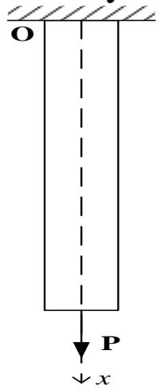

text_image

O
P
↓x

Here we'll directly establish the equivalent integral weak form according to the principle of virtual work

of virtual work
Let the virtual displacement be $\phi(x)$ then the according virtual strain is $\tilde{\varepsilon}(x)=\frac{d\phi}{dx}$ In terms of the principle of virtual work:

The virtual work of the internal force equals that of the external force

$$
\int_ {0} ^ {l} \sigma (x) \tilde {\varepsilon} (x) d x = \int_ {0} ^ {l} E A u ^ {\prime} (x) \phi^ {\prime} (x) d x = \int_ {0} ^ {l} A \rho g \phi (x) d x + P \phi (L)
$$

So the equation above is the equivalent integral weak form.

## 4.4 Mechanical examples

The first step of the finite element method is the discretization.

Usually the differential and virtual work equations are called the continuous form.

The so-called discretization is to approximately transform them into algebraic equations.

Let's look at the last example again to explain the basic steps of discretization of the finite element method.

## Element subdivision

Divide the interval $[0,l]$ into a number of n parts

$$
0 = x _ {0} <   x _ {1} <   \dots <   x _ {n} = l
$$

The interval $[x_{i}, x_{i+1}]$ is called the element $e_{i} (i=0,1,\ldots,n-1)$ and $x=x_{i+1}$ is the nodes $(i=0,1,\ldots,n)$ .

## Displacement mode

The displacement mode is actually the specific form of determined interpolation polynomials, which is also the trial function expressed with the function value at the nodes.

Now we'll use the linear displacement mode. That is to represent the displacement using the step-linear-functions. And we only need to write the expression of displacement trial function in each element.

## 4.4 Mechanical examples

## Displacement mode

Suppose the displacement $u_{i-1}$ and $u_{i}$ at the two ends $x_{i-1}$ and $x_{i}$ of the element $e_{i}$ : $[x_{i-1}, x_{i}]$ are given. Because the displacement of element $e_{i}$ is linear and according to the two-point form of linear equation of analytic geometry we can get the expression of $u(x)$ in the element $e_{i}$ as

$$
u (x) = \frac {x _ {i} - x}{x _ {i} - x _ {i - 1}} u _ {i - 1} + \frac {x - x _ {i - 1}}{x _ {i} - x _ {i - 1}} u _ {i} \quad (x _ {i - 1} \leq x \leq x _ {i})
$$

Adopt the local number of nodes and

$$
N _ {1} ^ {(i)} = \frac {x _ {i} - x}{x _ {i} - x _ {i - 1}} N _ {2} ^ {(i)} = \frac {x - x _ {i - 1}}{x _ {i} - x _ {i - 1}}
$$

Apparently the two functions have the following properties:

1. $N_{1}(x)$ and $N_{2}(x)$ are  
2. $N_{1}(x_{i-1})=1,\quad N_{1}(x_{i})=0,\quad N_{2}(x_{i-1})=0,\quad N_{2}(x_{i})=1$

The two functions are linear basis function of interpolation as shown in the picture.

The effects are apparent. The displacement of the element can be expressed by the linear combination of them.

$$
u (x) = u _ {i - 1} N _ {1} ^ {(i)} (x) + u _ {i} N _ {2} ^ {(i)} (x) \quad \text {或} \quad u (x) = [ N ] \{\delta \} _ {e i}
$$

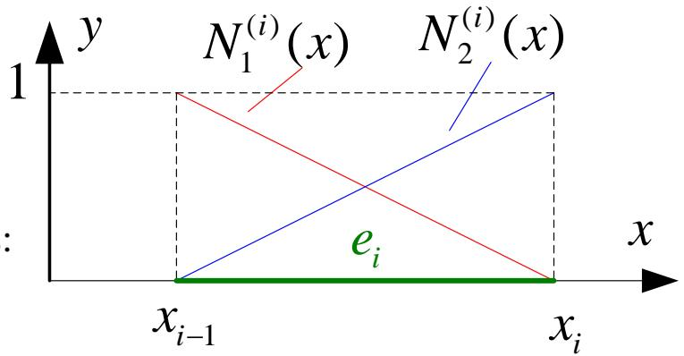

text_image

y
1
N₁⁽ⁱ⁾(x)
N₂⁽ⁱ⁾(x)
eᵢ
x
xᵢ₋₁
xᵢ

Where

$$
\mathbf {N} = \left[ \begin{array}{l l} N _ {1} ^ {(i)} & N _ {2} ^ {(i)} \end{array} \right] \qquad \left\{\boldsymbol {\delta} \right\} _ {e i} = \left[ \begin{array}{l l} u _ {i - 1} (x) & u _ {i} (x) \end{array} \right] ^ {T}
$$

## 4.4 Mechanical examples

## Displacement mode

In element $e_{i}$ : the strain in $[x_{i-1}, x_{i}]$ can be expressed as $\varepsilon_{i}$

$$
\varepsilon_ {i} = \frac {d u}{d x} = \frac {d N _ {1} ^ {(i)}}{d x} u _ {i - 1} + \frac {d N _ {2} ^ {(i)}}{d x} u _ {i} = [ B ] \left\{\delta \right\} _ {e i}
$$

where

$$
B = [ \frac {d N _ {1} ^ {(i)}}{d x} \frac {d N _ {2} ^ {(i)}}{d x} ] = [ - \frac {1}{L _ {i}} \frac {1}{L _ {i}} ]
$$

The conclusion is the same for the virtual displacement $\{\delta^{*}\}_{\mathrm{ei}}$ .

## Element analysis

The equation of the virtual work can be written in the form of discretization after determining the displacement mode.

Rewrite the global integral of the virtual work equation into a partitioning integral $_{n-1}$

$$
\sum_ {i = 0} ^ {n - 1} E A \int_ {e i} u ^ {\prime} (x) \phi^ {\prime} (x) d x = \sum_ {i = 0} ^ {n - 1} A \int_ {e i} f \phi (x) d x + P \phi (L)
$$

where $f = \rho g$ .

## 4.4 Mechanical examples

## Element analysis

Substitute the according determined displacement mode into the left part of the integral of every element $e_{i}$ . And we have

$$
\begin{array}{l} E A \int_ {e i} u ^ {\prime} (x) \phi^ {\prime} (x) d x = E A \int_ {e i} \left[ \phi^ {\prime} (x) \right] ^ {T} u ^ {\prime} (x) d x \\ = E A \int_ {e i} ([ B ] \{\delta^ {*} \} _ {e i}) ^ {T} ([ B ] \{\delta \} _ {e i}) d x \\ = \{\delta^ {*} \} _ {e i} ^ {T} \int_ {e i} ([ B ] ^ {T} E A [ B ]) d x \{\delta \} _ {e i} = \{\delta^ {*} \} _ {e i} ^ {T} [ k ] _ {e i} \{\delta \} _ {e i} \\ \end{array}
$$

where $[k]_{ei} = \int_{ei}\left([B]^T EA[B]\right)dx$ is called the element stiffness matrix.

Similarly substitute into the right part of the equation

$$
\begin{array}{l} A \int_ {e i} \phi (x) f d x = A \int_ {e i} \phi^ {T} f d x = A \int_ {e i} \left([ N ] \{\delta^ {*} \} _ {e i}\right) ^ {T} f d x \\ = \{\delta^ {*} \} _ {e i} ^ {T} \int_ {e i} A [ N ] f d x = \{\delta^ {*} \} _ {e i} ^ {T} \{F \} _ {e i} \\ \end{array}
$$

where $\{F\}_{ei} = \int_{ei} A[N] f dx$ is called the equivalent force of element nodes.

## 4.4 Mechanical examples

## The assembling of the global stiffness matrix and the global load vector

Assemble every element of the element stiffness matrix and the element load vector according to its global number and we can get the global stiffness matrix and the global load vector.

We can find the following properties of the global stiffness matrix:

1. Symmetric matrix  
2. Sparse matrix  
3. Nonnegative definite matrix

## Constraint handling

Introduce the boundary condition by “put 1 on the diagonal”.

## Solving equation

The coefficient matrixes of the linear equations obtained by the finite element method have the properties of symmetry and sparsity but usually very high order. So we usually use the computer programming to solve

## Further analysis

After solving the displacement we can obtain the parameters such like strain, stress and the support reverse force by further calculation.

## 4.5 Example analysis

Question 1 As shown in the picture, apply an axial load P on the right end of the first-step shaft part.

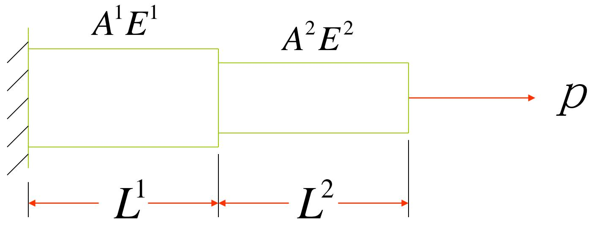

text_image

A¹E¹
A²E²
L¹
L²
p

$$
A ^ {1} = 2. 0 \times 1 0 ^ {- 6} m ^ {2} \quad A ^ {2} = 1. 0 \times 1 0 ^ {- 6} m ^ {2}
$$

$$
E ^ {1} = E ^ {2} = E = 2. 0 \times 1 0 ^ {1 1} P a
$$

$$
P = 1 0 0 N \quad L ^ {1} = L ^ {2} = 1. 0 m
$$

## 4.5 Example analysis

Solve: (1) Structure discretization

Deformation analysis: There is only axial deformation with the same displacement at every section. Suppose there is one axial displacement at every node. And express the element with axial deformation by line segment.

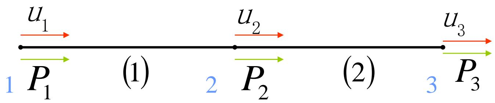

flowchart

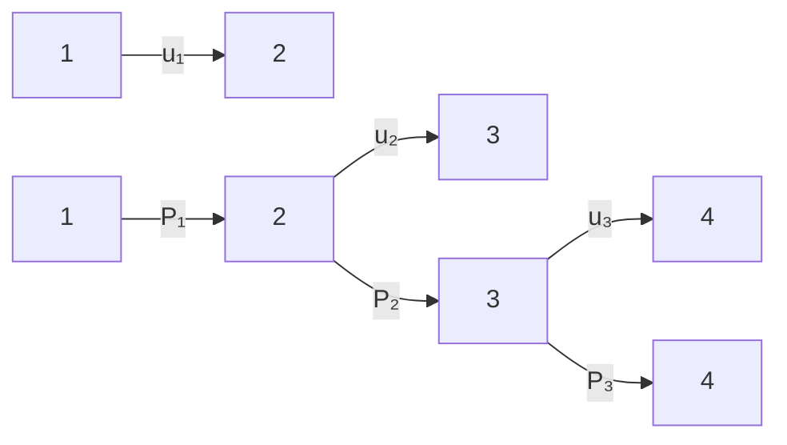

1、2、3 ——node number (1)、(2) ——element number $u_{1}$ 、 $u_{2}$ 、 $u_{3}$ ——The number of freedom degree of nodes. $P_{1}$ 、 $P_{2}$ 、 $P_{3}$ ——The number of load of nodes.

Known quantities: $u_{1}$ 、 $P_{2}$ 、 $P_{3}$ Unknown quantities: $P_{1}$ 、 $u_{2}$ 、 $u_{3}$

## 4.5 Example analysis

(2) Determine the interpolation function of the displacement.

Arbitrarily select an element of the structure

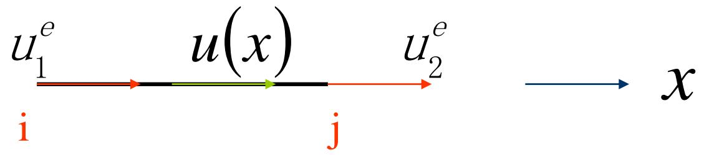

flowchart

Establish a local reference system from i to j at the element where i is the original point. ( $\vec{i}\vec{j}$ is the positive direction)

i、j —— Number of element endpoints

$u_{1}^{e}$ 、 $u_{2}^{e}$ ——Displacement number of element endpoints.

## 4.5 Example analysis

Let the axial displacement at an arbitrary point x (section) in the element be $u(x)$ Suppose: $u(x)=a+bx$ (1)

According to the displacement continuity:

At point i $u\left(x_{i}\right) = u_{1}^{e}$ a = $u_{1}^{e}$ (2)

At point j $u\left(x_{j}\right) = u_{2}^{e}a + bL^{e} = u_{2}^{e}$ (3)

$L^{e}$ —— element length

Solve the simultaneous equations (2) (3)

$b = \frac{u_2^e - u_1^e}{L^e}$ (4)

Thus:

Substitute (2) and (4) back to (1) and we have

$u(x) = u_1^e + \frac{u_2^e - u_1^e}{L^e} x$ Incorporate with identical indicators $U_1^e U_2^e$

## 4.5 Example analysis

And $u(x) = \left(1 - \frac{X}{L^e}\right) u_1^e + \frac{X}{L^e} u_2^e$

Written in the form of matrix

$$
u (x) = \left[ 1 - \frac {x}{L ^ {e}}, \frac {x}{L ^ {e}} \right] \left\{ \begin{array}{l} u _ {1} ^ {e} \\ u _ {2} ^ {e} \end{array} \right\}
$$

Let $\{u\} = u(x)$

$$
\begin{array}{l} \left[ N \right] = \left[ 1 - \frac {x}{L ^ {e}}, \frac {x}{L ^ {e}} \right] \text {- - - Shape function matrix} \\ \left\{u ^ {e} \right\} = \left\{ \begin{array}{l} u _ {1} ^ {e} \\ u _ {2} ^ {e} \end{array} \right\} \text {- - - Displacement vector of element nodes} \end{array}
$$

So $\{u\} = [N]\left\{u^e\right\}$

## 4.5 Example analysis

## (3) Element analysis

Calculate the elastic strain energy of the element

$$
U ^ {e} = \frac {1}{2} \iiint_ {V ^ {e}} \sigma \varepsilon d v = \frac {1}{2} A ^ {e} \int_ {0} ^ {L ^ {e}} \sigma \varepsilon d x
$$

$$
\begin{array}{l} \varepsilon = \frac {\partial u (x)}{\partial x} = \frac {\partial}{\partial x} [ N ] \left\{u ^ {e} \right\} = \frac {\partial}{\partial x} \left[ N _ {1}, N _ {2} \right] \left\{u ^ {e} \right\} \\ = \left[ - \frac {1}{L ^ {e}}, \frac {1}{L ^ {e}} \right] \left\{ \begin{array}{l} u _ {1} ^ {e} \\ u _ {2} ^ {e} \end{array} \right\} = \left[ B \right] \left\{ \begin{array}{l} u _ {1} ^ {e} \\ u _ {2} ^ {e} \end{array} \right\} \\ \end{array}
$$

$$
\sigma = E \varepsilon = E \left[ - \frac {1}{L ^ {e}}, \frac {1}{L ^ {e}} \right] \left\{ \begin{array}{l} u _ {1} ^ {e} \\ u _ {2} ^ {e} \end{array} \right\} = E ^ {e} [ B ] \left\{ \begin{array}{l} u _ {1} ^ {e} \\ u _ {2} ^ {e} \end{array} \right\}
$$

## 4.5 Example analysis

$$
U ^ {e} = \frac {1}{2} A ^ {e} \int_ {0} ^ {L ^ {e}} \left\{u _ {1} ^ {e}, u _ {2} ^ {e} \right\} [ B ] ^ {T} E ^ {e} [ B ] \left\{ \begin{array}{c} u _ {1} ^ {e} \\ u _ {2} ^ {e} \end{array} \right\} d x
$$

$$
= \frac {1}{2} A ^ {e} L ^ {e} \left(\left\{u _ {1} ^ {e}, u _ {2} ^ {e} \right\} [ B ] ^ {T} E ^ {e} [ B ] \left\{ \begin{array}{l} u _ {1} ^ {e} \\ u _ {2} ^ {e} \end{array} \right\}\right)
$$

$$
= \left. \frac {1}{2} \left\{u _ {1} ^ {e}, u _ {2} ^ {e} \right\} \left(A ^ {e} L ^ {e} E ^ {e} [ B ] ^ {T} [ B ]\right) \left\{ \begin{array}{l} u _ {1} ^ {e} \\ u _ {2} ^ {e} \end{array} \right\} \right.
$$

Let $\left[K^{e}\right] = A^{e}L^{e}E^{e}\left[B\right]^{T}\left[B\right]$

$$
= A ^ {e} L ^ {e} E ^ {e} \left[ \begin{array}{c} - \frac {1}{L ^ {e}} \\ \frac {1}{L ^ {e}} \end{array} \right] \left[ - \frac {1}{L ^ {e}}, \frac {1}{L ^ {e}} \right] = \frac {A ^ {e} E ^ {e}}{L ^ {e}} \left[ \begin{array}{c c} 1 & - 1 \\ - 1 & 1 \end{array} \right]
$$

## 4.5 Example analysis

So the elastic strain energy of the element can be expressed as

$$
U ^ {e} = \frac {1}{2} \left\{u ^ {e} \right\} ^ {T} \left[ K ^ {e} \right] \left\{u ^ {e} \right\}
$$

Where

$\left\{u^{e}\right\} = \left\{ \begin{array}{l}u_{1}^{e}\\ u_{2}^{e} \end{array} \right\}$ — Displacement vector of the element nodes.

$$
\left\{u ^ {e} \right\} ^ {T} = \left\{u _ {1} ^ {e}, u _ {2} ^ {e} \right\}
$$

$$
\left\{u ^ {1} \right\} = \left\{ \begin{array}{l} u _ {1} \\ u _ {2} \end{array} \right\}
$$

$$
\left[ K ^ {1} \right] = \frac {A ^ {1} E ^ {1}}{L ^ {1}} \left[ \begin{array}{c c} 1 & - 1 \\ - 1 & 1 \end{array} \right] = \left[ \begin{array}{c c} 4. 0 \times 1 0 ^ {5} & - 4. 0 \times 1 0 ^ {5} \\ - 4. 0 \times 1 0 ^ {5} & 4. 0 \times 1 0 ^ {5} \end{array} \right]
$$

## 4.5 Example analysis

As for element 2

$$
\left\{u ^ {2} \right\} = \left\{ \begin{array}{l} u _ {2} \\ u _ {3} \end{array} \right\}
$$

$$
\left[ K ^ {2} \right] = \frac {A ^ {2} E ^ {2}}{L ^ {2}} \left[ \begin{array}{c c} 1 & - 1 \\ - 1 & 1 \end{array} \right] = \left[ \begin{array}{c c} 2. 0 \times 1 0 ^ {5} & - 2. 0 \times 1 0 ^ {5} \\ - 2. 0 \times 1 0 ^ {5} & 2. 0 \times 1 0 ^ {5} \end{array} \right]
$$

## 4.5 Example analysis

$$
U = U ^ {1} + U ^ {2}
$$

$$
= \frac {1}{2} \left\{u _ {1}, u _ {2} \right\} \cdot \left[ \begin{array}{c c} 4. 0 \times 1 0 ^ {5} & - 4. 0 \times 1 0 ^ {5} \\ - 4. 0 \times 1 0 ^ {5} & 4. 0 \times 1 0 ^ {5} \end{array} \right] \left\{ \begin{array}{l} u _ {1} \\ u _ {2} \end{array} \right\}
$$

$$
+ \frac {1}{2} \left\{u _ {2}, u _ {3} \right\} \cdot \left[ \begin{array}{c c} 2. 0 \times 1 0 ^ {5} & - 2. 0 \times 1 0 ^ {5} \\ - 2. 0 \times 1 0 ^ {5} & 2. 0 \times 1 0 ^ {5} \end{array} \right] \left\{ \begin{array}{l} u _ {2} \\ u _ {3} \end{array} \right\}
$$

$$
= \frac {1}{2} \left\{u _ {1}, u _ {2}, u _ {3} \right\} \cdot \left[ \begin{array}{c c c} 4. 0 \times 1 0 ^ {5} & - 4. 0 \times 1 0 ^ {5} & 0 \\ - 4. 0 \times 1 0 ^ {5} & 4. 0 \times 1 0 ^ {5} & 0 \\ 0 & 0 & 0 \end{array} \right] \left\{ \begin{array}{c} u _ {1} \\ u _ {2} \\ u _ {3} \end{array} \right\}
$$

$$
+ \frac {1}{2} \left\{u _ {1}, u _ {2}, u _ {3} \right\} \cdot \left[ \begin{array}{c c c} 0 & 0 & 0 \\ 0 & 2. 0 \times 1 0 ^ {5} & - 2. 0 \times 1 0 ^ {5} \\ 0 & - 2. 0 \times 1 0 ^ {5} & 2. 0 \times 1 0 ^ {5} \end{array} \right] \left\{ \begin{array}{l} u _ {1} \\ u _ {2} \\ u _ {3} \end{array} \right\}
$$

## 4.5 Example analysis

$$
U = \frac {1}{2} \left\{u _ {1}, u _ {2}, u _ {3} \right\} \left[ \begin{array}{c c c} 4. 0 \times 1 0 ^ {5} & - 4. 0 \times 1 0 ^ {5} & 0 \\ - 4. 0 \times 1 0 ^ {5} & 6. 0 \times 1 0 ^ {5} & - 2. 0 \times 1 0 ^ {5} \\ 0 & - 2. 0 \times 1 0 ^ {5} & 2. 0 \times 1 0 ^ {5} \end{array} \right] \left\{ \begin{array}{c} u _ {1} \\ u _ {2} \\ u _ {3} \end{array} \right\}
$$

$$
= \frac {1}{2} \left\{u \right\} ^ {T} [ K ] \left\{u \right\}
$$

The virtual work of the external force

$$
W _ {p} = P \bullet u = \left\{u _ {1}, u _ {2}, u _ {3} \right\} \left\{ \begin{array}{l} P _ {1} \\ P _ {2} \\ P _ {3} \end{array} \right\}
$$

$$
P _ {1} - \text {Unknown} P _ {2} = 0 P _ {3} = 1 0 0 N
$$

## 4.5 Example analysis

The potential energy of the structure is

$$
\Pi = \frac {1}{2} \left\{u _ {1}, u _ {2}, u _ {3} \right\} \cdot \left[ \begin{array}{c c c} 4. 0 \times 1 0 ^ {5} & - 4. 0 \times 1 0 ^ {5} & 0 \\ - 4. 0 \times 1 0 ^ {5} & 6. 0 \times 1 0 ^ {5} & - 2. 0 \times 1 0 ^ {5} \\ 0 & - 2. 0 \times 1 0 ^ {5} & 2. 0 \times 1 0 ^ {5} \end{array} \right] \left\{ \begin{array}{l} u _ {1} \\ u _ {2} \\ u _ {3} \end{array} \right\}
$$

$$
- \left\{u _ {1}, u _ {2}, u _ {3} \right\} \left\{ \begin{array}{c} P _ {1} \\ 0 \\ 1 0 0 \end{array} \right\}
$$

Substitute the extremum condition of the functional

$$
\frac {\partial \prod}{\partial u _ {i}} = 0 \quad \text {Or} \quad \frac {\partial \prod}{\partial \left\{u _ {1} , u _ {2} , u _ {3} \right\}} = \left\{ \begin{array}{l} 0 \\ 0 \\ 0 \end{array} \right\}
$$

## 4.5 Example analysis

So

$$
\left[ \begin{array}{c c c} 4. 0 \times 1 0 ^ {5} & - 4. 0 \times 1 0 ^ {5} & 0 \\ - 4. 0 \times 1 0 ^ {5} & 6. 0 \times 1 0 ^ {5} & - 2. 0 \times 1 0 ^ {5} \\ 0 & - 2. 0 \times 1 0 ^ {5} & 2. 0 \times 1 0 ^ {5} \end{array} \right] \left\{ \begin{array}{l} u _ {1} \\ u _ {2} \\ u _ {3} \end{array} \right\} - \left\{ \begin{array}{l} P _ {1} \\ 0 \\ 1 0 0 \end{array} \right\} = \left\{ \begin{array}{l} 0 \\ 0 \\ 0 \end{array} \right\}
$$

Transpose the terms and

$$
\left[ \begin{array}{c c c} 4. 0 \times 1 0 ^ {5} & - 4. 0 \times 1 0 ^ {5} & 0 \\ - 4. 0 \times 1 0 ^ {5} & 6. 0 \times 1 0 ^ {5} & - 2. 0 \times 1 0 ^ {5} \\ 0 & - 2. 0 \times 1 0 ^ {5} & 2. 0 \times 1 0 ^ {5} \end{array} \right] \left\{ \begin{array}{l} u _ {1} \\ u _ {2} \\ u _ {3} \end{array} \right\} = \left\{ \begin{array}{l} P _ {1} \\ 0 \\ 1 0 0 \end{array} \right\}
$$

$$
\left[ K \right] \left\{u \right\} = \left\{P \right\}
$$

— The approximate equilibrium equation of the structure

## 4.5 Example analysis

## (5)Constraint handling

Purpose: Introduce the boundary conditions to eliminate the rigid displacement and ensure the unique solution of the equation.

Solution: Substitute the known displacement

$$
U = \frac {1}{2} \left\{u _ {1}, u _ {2}, u _ {3} \right\} \cdot \left[ \begin{array}{c c c} 4. 0 \times 1 0 ^ {5} & - 4. 0 \times 1 0 ^ {5} & 0 \\ - 4. 0 \times 1 0 ^ {5} & 6. 0 \times 1 0 ^ {5} & - 2. 0 \times 1 0 ^ {5} \\ 0 & - 2. 0 \times 1 0 ^ {5} & 2. 0 \times 1 0 ^ {5} \end{array} \right] \left\{ \begin{array}{l} u _ {1} \\ u _ {2} \\ u _ {3} \end{array} \right\}
$$

Because $u_{1} = 0$

[K] The first line and first row respectively multiply zero and can be eliminated from the equation

$\left[K\right]$ Can be simplified as $\left[ \begin{array}{cc}6.0\times 10^{5} & -2.0\times 10^{5}\\ -2.0\times 10^{5} & 2.0\times 10^{5} \end{array} \right]$

## 4.5 Example analysis

Reduce the order of the equation to

$$
\left[ \begin{array}{c c} 6. 0 \times 1 0 ^ {5} & - 2. 0 \times 1 0 ^ {5} \\ - 2. 0 \times 1 0 ^ {5} & 2. 0 \times 1 0 ^ {5} \end{array} \right] \left\{ \begin{array}{l} u _ {2} \\ u _ {3} \end{array} \right\} = \left\{ \begin{array}{l} 0 \\ 1 0 0 \end{array} \right\}
$$

(6) Solve the equation"

$$
u _ {2} = 0. 2 5 \times 1 0 ^ {- 3} m \qquad u _ {3} = 0. 7 5 \times 1 0 ^ {- 3} m
$$

Eliminating the line and row of the matrix is not quite convenient in practical analysis. So we usually put 1 in the diagonal and 0 in the other places.

Than the equation can be transformed into

$$
\left[ \begin{array}{c c c} 1 & 0 & 0 \\ 0 & 6. 0 \times 1 0 ^ {5} & - 2. 0 \times 1 0 ^ {5} \\ 0 & - 2. 0 \times 1 0 ^ {5} & 2. 0 \times 1 0 ^ {5} \end{array} \right] \left\{ \begin{array}{c} u _ {1} \\ u _ {2} \\ u _ {3} \end{array} \right\} = \left\{ \begin{array}{c} 0 \\ 0 \\ 1 0 0 \end{array} \right\}
$$

The two forms are equivalent but the latter one is more convenient when solved by computer.

This step usually requires a lot of large-scale algebraic equations calculation, which can only be solved by computers.

## 4.5 Example analysis

## (7) Solve the element stress

## Element 1

$$
\begin{array}{l} \varepsilon^ {1} = [ B ] \left\{u ^ {e} \right\} = \left[ - \frac {1}{L ^ {1}}, \frac {1}{L ^ {1}} \right] \left\{ \begin{array}{l} u _ {1} \\ u _ {2} \end{array} \right\} = [ - 1, 1 ] \left\{ \begin{array}{c} 0 \\ 0. 2 5 \times 1 0 ^ {- 3} \end{array} \right\} \\ = 0. 2 5 \times 1 0 ^ {- 3} \\ \end{array}
$$

$$
\sigma^ {1} = E ^ {1} \varepsilon^ {1} = 2. 0 \times 1 0 ^ {1 1} \times 0. 2 5 \times 1 0 ^ {- 3}
$$

$$
= 0. 5 \times 1 0 ^ {8} (P a)
$$

## Element 2

$$
\boldsymbol {\varepsilon} ^ {2} = \left[ B \right] \left\{u ^ {e} \right\} = \left[ - \frac {1}{L ^ {2}}, \frac {1}{L ^ {2}} \right] \left\{ \begin{array}{l} u _ {2} \\ u _ {3} \end{array} \right\} = \left[ - 1, 1 \right] \left\{ \begin{array}{l} 0. 2 5 \times 1 0 ^ {- 3} \\ 0. 7 5 \times 1 0 ^ {- 3} \end{array} \right\}
$$

$$
= 0. 5 \times 1 0 ^ {- 3}
$$

$$
\sigma^ {2} = E ^ {2} \varepsilon^ {2} = 2. 0 \times 1 0 ^ {1 1} \times 0. 5 \times 1 0 ^ {- 3}
$$

$$
= 1. 0 \times 1 0 ^ {8} (P a)
$$

## V. Conclusion

## 5.1 Conclusion

So this is the mathematical basis of the finite element method and the steps to solve the one dimensional problems.

In terms of mathematics the finite element method can be regarded as the combination of the classical variation method and the partitioned polynomial interpolation.

1. It adopts the discretization and the flexibility of variation method and create the finite subspace on basis of the principle of variation.  
2. It then turns the variation problems in the infinite dimensional function space of the differential equations into the extremum problems of multivariable functions in the finite element subspace. The unknown quantities of the multivariable functions are the value of the undetermined functions at the disperse nodes.  
3. Solve the governing equations according to the extreme value theory of the multivariable functions, which is also called the linear algebraic equations. The solutions of the algebraic equations are the numerical solution of the undetermined functions at the disperse nodes.

It should be noticed that the discussion of the theoretical basis is far from perfect such like proving the convergence and the neglect of the error estimation. These problems must be solved before widely used.

## 5.1 Conclusion

In fact since the finite element method developed into the climax of theoretical research in 1960s, more and more mathematicians have been studying to free the finite element method from the restraint of the engineering problems, provide a unified opinion as well as a more precise mathematical description and finally establish a systematic mathematical basis after combining with the functional analysis, the variation method, the difference method, the approximation theory of functions and so on.

The revolution of the finite element method is driven by the emergence of computer and the application of functional, of which the former is the calculation tool and the latter is the theoretical basis.

## You can refer to the following books

1 有限元法的数学基础 王烈衡 许学军 编著  
2 有限元方法及其理论基础 姜礼尚 庞之垣 著  
3 有限元方法及其应用 李开泰 黄艾香 黄庆怀 编著

So the part of theoretical basis has come to the end.

We'll discuss the derivation, basic form, numerical method and the practical application of the finite element method in solid mechanics.

## 谢谢！